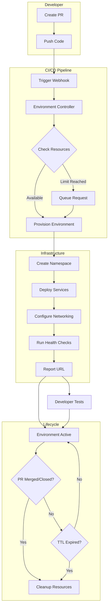
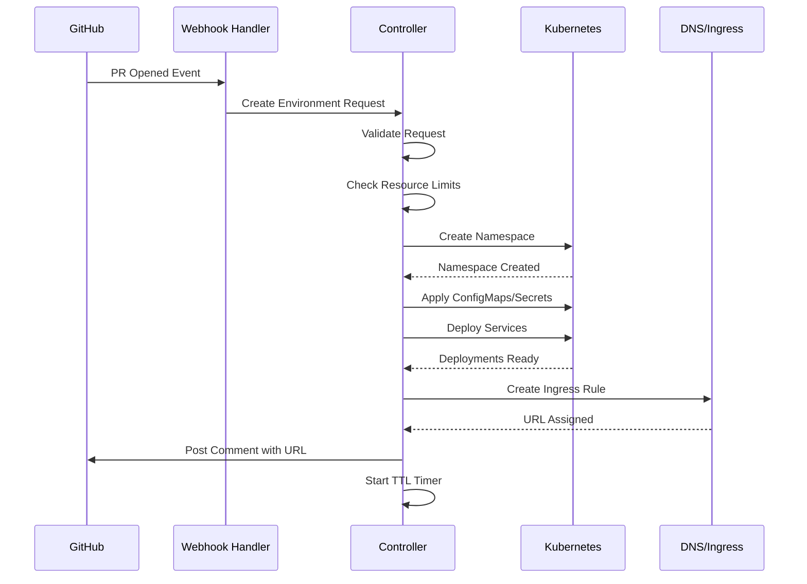
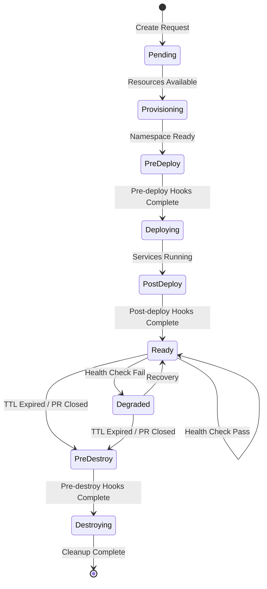
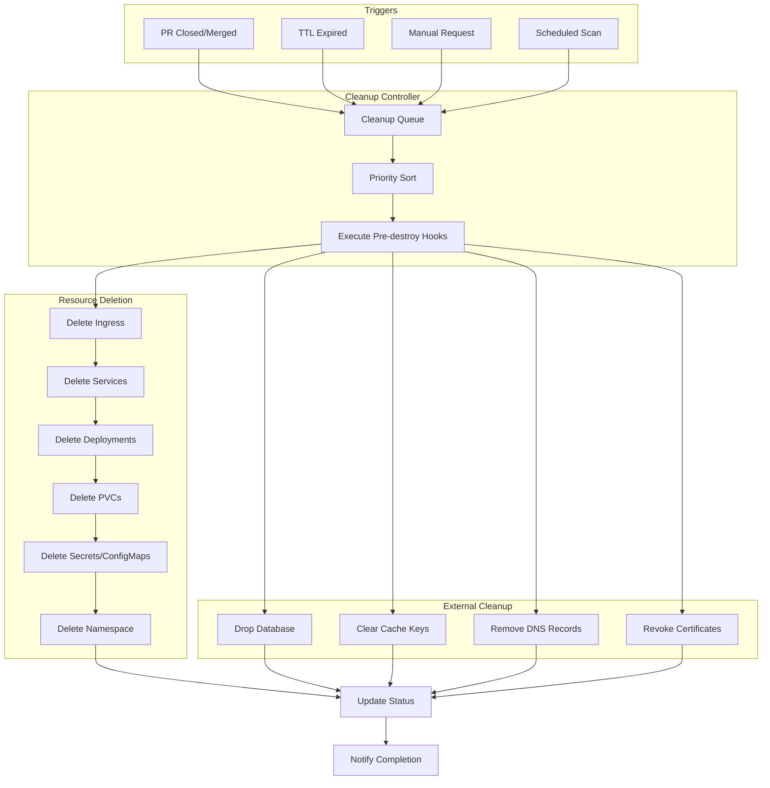
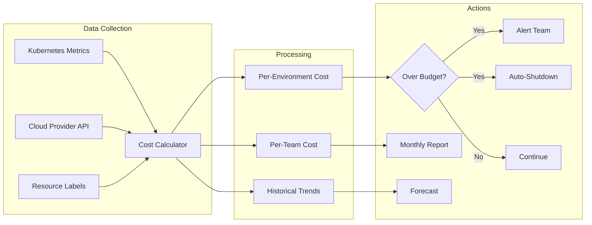

# How to Create Ephemeral Environments

Author: [nawazdhandala](https://github.com/nawazdhandala)

Tags: Platform Engineering, Ephemeral Environments, CI/CD, Development

Description: Learn to implement ephemeral environments with automatic provisioning, lifecycle management, and cost optimization for PR-based testing.

---

Ephemeral environments are short-lived, isolated deployment environments that are automatically created and destroyed based on specific triggers - typically pull requests or feature branches. They provide developers with production-like testing environments without the overhead of maintaining permanent staging infrastructure.

In this guide, we will walk through building a complete ephemeral environment system from scratch, covering provisioning automation, lifecycle management, resource cleanup, and cost optimization.

## Why Ephemeral Environments Matter

Before diving into implementation, let us understand the key benefits:

- **Isolation**: Each PR gets its own environment, preventing conflicts between features
- **Cost Efficiency**: Resources exist only when needed
- **Faster Feedback**: Developers and QA can test changes immediately
- **Production Parity**: Environments mirror production configuration
- **Parallel Development**: Multiple features can be tested simultaneously

## Architecture Overview

Here is a high-level view of how ephemeral environments fit into your development workflow:



## Setting Up the Foundation

### 1. Environment Controller

The environment controller is the brain of your ephemeral environment system. It listens for events and orchestrates the entire lifecycle.

```yaml
# environment-controller/deployment.yaml
apiVersion: apps/v1
kind: Deployment
metadata:
  name: ephemeral-controller
  namespace: platform
spec:
  replicas: 2
  selector:
    matchLabels:
      app: ephemeral-controller
  template:
    metadata:
      labels:
        app: ephemeral-controller
    spec:
      serviceAccountName: ephemeral-controller
      containers:
        - name: controller
          image: your-registry/ephemeral-controller:latest
          ports:
            - containerPort: 8080
          env:
            - name: GITHUB_TOKEN
              valueFrom:
                secretKeyRef:
                  name: github-credentials
                  key: token
            - name: MAX_ENVIRONMENTS
              value: "20"
            - name: DEFAULT_TTL
              value: "24h"
            - name: CLUSTER_DOMAIN
              value: "preview.yourcompany.com"
          resources:
            requests:
              memory: "256Mi"
              cpu: "100m"
            limits:
              memory: "512Mi"
              cpu: "500m"
```

The controller needs proper RBAC permissions to create and manage resources:

```yaml
# environment-controller/rbac.yaml
apiVersion: v1
kind: ServiceAccount
metadata:
  name: ephemeral-controller
  namespace: platform
---
apiVersion: rbac.authorization.k8s.io/v1
kind: ClusterRole
metadata:
  name: ephemeral-controller
rules:
  - apiGroups: [""]
    resources: ["namespaces", "services", "configmaps", "secrets"]
    verbs: ["create", "delete", "get", "list", "watch", "update"]
  - apiGroups: ["apps"]
    resources: ["deployments", "statefulsets"]
    verbs: ["create", "delete", "get", "list", "watch", "update"]
  - apiGroups: ["networking.k8s.io"]
    resources: ["ingresses"]
    verbs: ["create", "delete", "get", "list", "watch", "update"]
---
apiVersion: rbac.authorization.k8s.io/v1
kind: ClusterRoleBinding
metadata:
  name: ephemeral-controller
subjects:
  - kind: ServiceAccount
    name: ephemeral-controller
    namespace: platform
roleRef:
  kind: ClusterRole
  name: ephemeral-controller
  apiGroup: rbac.authorization.k8s.io
```

### 2. Custom Resource Definition

Define a custom resource to represent ephemeral environments:

```yaml
# crd/ephemeral-environment.yaml
apiVersion: apiextensions.k8s.io/v1
kind: CustomResourceDefinition
metadata:
  name: ephemeralenvironments.platform.yourcompany.com
spec:
  group: platform.yourcompany.com
  versions:
    - name: v1
      served: true
      storage: true
      schema:
        openAPIV3Schema:
          type: object
          properties:
            spec:
              type: object
              required:
                - repository
                - branch
                - prNumber
              properties:
                repository:
                  type: string
                branch:
                  type: string
                prNumber:
                  type: integer
                ttl:
                  type: string
                  default: "24h"
                services:
                  type: array
                  items:
                    type: object
                    properties:
                      name:
                        type: string
                      image:
                        type: string
                      port:
                        type: integer
                      replicas:
                        type: integer
                        default: 1
            status:
              type: object
              properties:
                phase:
                  type: string
                url:
                  type: string
                createdAt:
                  type: string
                expiresAt:
                  type: string
                message:
                  type: string
      additionalPrinterColumns:
        - name: Status
          type: string
          jsonPath: .status.phase
        - name: URL
          type: string
          jsonPath: .status.url
        - name: Age
          type: date
          jsonPath: .status.createdAt
  scope: Cluster
  names:
    plural: ephemeralenvironments
    singular: ephemeralenvironment
    kind: EphemeralEnvironment
    shortNames:
      - ephem
      - ee
```

## Provisioning Automation

### Environment Provisioning Flow



### Webhook Handler Implementation

Here is a Go implementation of the webhook handler that processes GitHub events:

```go
// cmd/controller/webhook.go
package main

import (
    "context"
    "encoding/json"
    "fmt"
    "log"
    "net/http"
    "strings"

    "github.com/google/go-github/v50/github"
    metav1 "k8s.io/apimachinery/pkg/apis/meta/v1"
)

type WebhookHandler struct {
    githubClient *github.Client
    k8sClient    *K8sClient
    config       *Config
}

type PREvent struct {
    Action      string `json:"action"`
    Number      int    `json:"number"`
    PullRequest struct {
        Head struct {
            Ref string `json:"ref"`
            SHA string `json:"sha"`
        } `json:"head"`
    } `json:"pull_request"`
    Repository struct {
        FullName string `json:"full_name"`
    } `json:"repository"`
}

func (h *WebhookHandler) HandlePREvent(w http.ResponseWriter, r *http.Request) {
    var event PREvent
    if err := json.NewDecoder(r.Body).Decode(&event); err != nil {
        http.Error(w, "Invalid payload", http.StatusBadRequest)
        return
    }

    ctx := r.Context()

    switch event.Action {
    case "opened", "synchronize", "reopened":
        if err := h.createOrUpdateEnvironment(ctx, &event); err != nil {
            log.Printf("Failed to create environment: %v", err)
            http.Error(w, err.Error(), http.StatusInternalServerError)
            return
        }
    case "closed":
        if err := h.deleteEnvironment(ctx, &event); err != nil {
            log.Printf("Failed to delete environment: %v", err)
            http.Error(w, err.Error(), http.StatusInternalServerError)
            return
        }
    }

    w.WriteHeader(http.StatusOK)
}

func (h *WebhookHandler) createOrUpdateEnvironment(ctx context.Context, event *PREvent) error {
    envName := h.generateEnvName(event)

    // Check if we have capacity
    count, err := h.k8sClient.CountEnvironments(ctx)
    if err != nil {
        return fmt.Errorf("failed to count environments: %w", err)
    }

    if count >= h.config.MaxEnvironments {
        return h.queueEnvironment(ctx, event)
    }

    // Create the ephemeral environment resource
    env := &EphemeralEnvironment{
        ObjectMeta: metav1.ObjectMeta{
            Name: envName,
            Labels: map[string]string{
                "pr-number":  fmt.Sprintf("%d", event.Number),
                "repository": strings.ReplaceAll(event.Repository.FullName, "/", "-"),
                "branch":     sanitizeName(event.PullRequest.Head.Ref),
            },
        },
        Spec: EphemeralEnvironmentSpec{
            Repository: event.Repository.FullName,
            Branch:     event.PullRequest.Head.Ref,
            PRNumber:   event.Number,
            TTL:        h.config.DefaultTTL,
            CommitSHA:  event.PullRequest.Head.SHA,
        },
    }

    if err := h.k8sClient.CreateEnvironment(ctx, env); err != nil {
        return fmt.Errorf("failed to create environment: %w", err)
    }

    return nil
}

func (h *WebhookHandler) generateEnvName(event *PREvent) string {
    repoName := strings.ReplaceAll(event.Repository.FullName, "/", "-")
    return fmt.Sprintf("pr-%s-%d", repoName, event.Number)
}

func sanitizeName(name string) string {
    // Convert to lowercase and replace invalid characters
    name = strings.ToLower(name)
    name = strings.ReplaceAll(name, "/", "-")
    name = strings.ReplaceAll(name, "_", "-")
    // Truncate if too long
    if len(name) > 63 {
        name = name[:63]
    }
    return name
}
```

### Namespace and Resource Creation

The controller reconciles the environment by creating necessary Kubernetes resources:

```go
// pkg/controller/reconciler.go
package controller

import (
    "context"
    "fmt"
    "time"

    corev1 "k8s.io/api/core/v1"
    networkingv1 "k8s.io/api/networking/v1"
    metav1 "k8s.io/apimachinery/pkg/apis/meta/v1"
    "sigs.k8s.io/controller-runtime/pkg/reconcile"
)

func (r *Reconciler) Reconcile(ctx context.Context, req reconcile.Request) (reconcile.Result, error) {
    env := &EphemeralEnvironment{}
    if err := r.client.Get(ctx, req.NamespacedName, env); err != nil {
        return reconcile.Result{}, err
    }

    // Handle deletion
    if !env.DeletionTimestamp.IsZero() {
        return r.handleDeletion(ctx, env)
    }

    // Check TTL expiration
    if r.isExpired(env) {
        return r.triggerDeletion(ctx, env)
    }

    // Reconcile based on current phase
    switch env.Status.Phase {
    case "":
        return r.initializeEnvironment(ctx, env)
    case PhaseProvisioning:
        return r.provisionResources(ctx, env)
    case PhaseDeploying:
        return r.deployServices(ctx, env)
    case PhaseReady:
        return r.monitorHealth(ctx, env)
    case PhaseFailed:
        return r.handleFailure(ctx, env)
    }

    return reconcile.Result{RequeueAfter: 30 * time.Second}, nil
}

func (r *Reconciler) provisionResources(ctx context.Context, env *EphemeralEnvironment) (reconcile.Result, error) {
    namespace := &corev1.Namespace{
        ObjectMeta: metav1.ObjectMeta{
            Name: env.Name,
            Labels: map[string]string{
                "ephemeral":   "true",
                "pr-number":   fmt.Sprintf("%d", env.Spec.PRNumber),
                "managed-by":  "ephemeral-controller",
                "expires-at":  env.Status.ExpiresAt,
            },
            Annotations: map[string]string{
                "repository": env.Spec.Repository,
                "branch":     env.Spec.Branch,
            },
        },
    }

    if err := r.client.Create(ctx, namespace); err != nil {
        return reconcile.Result{}, r.updateStatus(ctx, env, PhaseFailed, err.Error())
    }

    // Copy secrets from template namespace
    if err := r.copySecrets(ctx, env.Name); err != nil {
        return reconcile.Result{}, r.updateStatus(ctx, env, PhaseFailed, err.Error())
    }

    // Create network policies for isolation
    if err := r.createNetworkPolicies(ctx, env.Name); err != nil {
        return reconcile.Result{}, r.updateStatus(ctx, env, PhaseFailed, err.Error())
    }

    return reconcile.Result{}, r.updateStatus(ctx, env, PhaseDeploying, "Resources provisioned")
}

func (r *Reconciler) createIngress(ctx context.Context, env *EphemeralEnvironment) error {
    pathType := networkingv1.PathTypePrefix

    ingress := &networkingv1.Ingress{
        ObjectMeta: metav1.ObjectMeta{
            Name:      "main",
            Namespace: env.Name,
            Annotations: map[string]string{
                "kubernetes.io/ingress.class":                 "nginx",
                "cert-manager.io/cluster-issuer":              "letsencrypt-prod",
                "nginx.ingress.kubernetes.io/ssl-redirect":    "true",
                "nginx.ingress.kubernetes.io/proxy-body-size": "50m",
            },
        },
        Spec: networkingv1.IngressSpec{
            TLS: []networkingv1.IngressTLS{
                {
                    Hosts:      []string{fmt.Sprintf("%s.preview.yourcompany.com", env.Name)},
                    SecretName: fmt.Sprintf("%s-tls", env.Name),
                },
            },
            Rules: []networkingv1.IngressRule{
                {
                    Host: fmt.Sprintf("%s.preview.yourcompany.com", env.Name),
                    IngressRuleValue: networkingv1.IngressRuleValue{
                        HTTP: &networkingv1.HTTPIngressRuleValue{
                            Paths: []networkingv1.HTTPIngressPath{
                                {
                                    Path:     "/",
                                    PathType: &pathType,
                                    Backend: networkingv1.IngressBackend{
                                        Service: &networkingv1.IngressServiceBackend{
                                            Name: "frontend",
                                            Port: networkingv1.ServiceBackendPort{
                                                Number: 80,
                                            },
                                        },
                                    },
                                },
                                {
                                    Path:     "/api",
                                    PathType: &pathType,
                                    Backend: networkingv1.IngressBackend{
                                        Service: &networkingv1.IngressServiceBackend{
                                            Name: "api",
                                            Port: networkingv1.ServiceBackendPort{
                                                Number: 8080,
                                            },
                                        },
                                    },
                                },
                            },
                        },
                    },
                },
            },
        },
    }

    return r.client.Create(ctx, ingress)
}
```

## Lifecycle Hooks

Lifecycle hooks allow you to execute custom logic at various stages of the environment lifecycle. This is essential for tasks like database seeding, cache warming, and notification sending.



### Implementing Lifecycle Hooks

```yaml
# config/lifecycle-hooks.yaml
apiVersion: v1
kind: ConfigMap
metadata:
  name: lifecycle-hooks
  namespace: platform
data:
  hooks.yaml: |
    preDeploy:
      - name: create-database
        type: job
        spec:
          image: postgres:15
          command:
            - /bin/sh
            - -c
            - |
              createdb -h $DB_HOST -U $DB_USER $ENV_NAME || true
              pg_restore -h $DB_HOST -U $DB_USER -d $ENV_NAME /seed/data.dump || true
        timeout: 300s

      - name: warm-cache
        type: job
        spec:
          image: redis:7
          command:
            - /bin/sh
            - -c
            - |
              redis-cli -h $REDIS_HOST FLUSHDB
              redis-cli -h $REDIS_HOST SET env:ready true
        timeout: 60s

    postDeploy:
      - name: run-migrations
        type: job
        spec:
          image: ${APP_IMAGE}
          command: ["npm", "run", "migrate"]
        timeout: 120s

      - name: seed-test-data
        type: job
        spec:
          image: ${APP_IMAGE}
          command: ["npm", "run", "seed:test"]
        timeout: 180s

      - name: notify-slack
        type: webhook
        spec:
          url: https://hooks.slack.com/services/xxx/yyy/zzz
          method: POST
          body: |
            {
              "text": "Environment ${ENV_NAME} is ready!",
              "attachments": [{
                "color": "good",
                "fields": [
                  {"title": "PR", "value": "#${PR_NUMBER}", "short": true},
                  {"title": "URL", "value": "${ENV_URL}", "short": true}
                ]
              }]
            }

    preDestroy:
      - name: export-logs
        type: job
        spec:
          image: amazon/aws-cli:latest
          command:
            - /bin/sh
            - -c
            - |
              kubectl logs -n $ENV_NAME -l app --all-containers --tail=-1 | \
              aws s3 cp - s3://logs-bucket/ephemeral/$ENV_NAME/final-logs.txt
        timeout: 120s

      - name: cleanup-database
        type: job
        spec:
          image: postgres:15
          command:
            - /bin/sh
            - -c
            - dropdb -h $DB_HOST -U $DB_USER --if-exists $ENV_NAME
        timeout: 60s
```

### Hook Executor Implementation

```go
// pkg/hooks/executor.go
package hooks

import (
    "context"
    "fmt"
    "time"

    batchv1 "k8s.io/api/batch/v1"
    corev1 "k8s.io/api/core/v1"
    metav1 "k8s.io/apimachinery/pkg/apis/meta/v1"
)

type HookExecutor struct {
    k8sClient *K8sClient
    config    *HooksConfig
}

type HookResult struct {
    Name      string
    Success   bool
    Duration  time.Duration
    Output    string
    Error     error
}

func (e *HookExecutor) ExecuteHooks(ctx context.Context, phase string, env *EphemeralEnvironment) ([]HookResult, error) {
    hooks, ok := e.config.Hooks[phase]
    if !ok {
        return nil, nil
    }

    results := make([]HookResult, 0, len(hooks))

    for _, hook := range hooks {
        result := e.executeHook(ctx, hook, env)
        results = append(results, result)

        if !result.Success && !hook.ContinueOnFailure {
            return results, fmt.Errorf("hook %s failed: %v", hook.Name, result.Error)
        }
    }

    return results, nil
}

func (e *HookExecutor) executeHook(ctx context.Context, hook Hook, env *EphemeralEnvironment) HookResult {
    start := time.Now()
    result := HookResult{Name: hook.Name}

    // Create timeout context
    hookCtx, cancel := context.WithTimeout(ctx, hook.Timeout)
    defer cancel()

    switch hook.Type {
    case "job":
        result.Error = e.executeJobHook(hookCtx, hook, env)
    case "webhook":
        result.Error = e.executeWebhookHook(hookCtx, hook, env)
    case "script":
        result.Error = e.executeScriptHook(hookCtx, hook, env)
    default:
        result.Error = fmt.Errorf("unknown hook type: %s", hook.Type)
    }

    result.Duration = time.Since(start)
    result.Success = result.Error == nil

    return result
}

func (e *HookExecutor) executeJobHook(ctx context.Context, hook Hook, env *EphemeralEnvironment) error {
    job := &batchv1.Job{
        ObjectMeta: metav1.ObjectMeta{
            Name:      fmt.Sprintf("hook-%s-%d", hook.Name, time.Now().Unix()),
            Namespace: env.Name,
            Labels: map[string]string{
                "hook-name": hook.Name,
                "hook-type": "lifecycle",
            },
        },
        Spec: batchv1.JobSpec{
            TTLSecondsAfterFinished: ptr(int32(300)),
            BackoffLimit:            ptr(int32(0)),
            Template: corev1.PodTemplateSpec{
                Spec: corev1.PodSpec{
                    RestartPolicy: corev1.RestartPolicyNever,
                    Containers: []corev1.Container{
                        {
                            Name:    "hook",
                            Image:   e.interpolate(hook.Spec.Image, env),
                            Command: hook.Spec.Command,
                            Env:     e.buildEnvVars(env),
                        },
                    },
                },
            },
        },
    }

    if err := e.k8sClient.Create(ctx, job); err != nil {
        return fmt.Errorf("failed to create hook job: %w", err)
    }

    // Wait for job completion
    return e.waitForJob(ctx, job)
}

func (e *HookExecutor) buildEnvVars(env *EphemeralEnvironment) []corev1.EnvVar {
    return []corev1.EnvVar{
        {Name: "ENV_NAME", Value: env.Name},
        {Name: "PR_NUMBER", Value: fmt.Sprintf("%d", env.Spec.PRNumber)},
        {Name: "BRANCH", Value: env.Spec.Branch},
        {Name: "REPOSITORY", Value: env.Spec.Repository},
        {Name: "ENV_URL", Value: env.Status.URL},
        {Name: "DB_HOST", Value: "shared-postgres.database.svc.cluster.local"},
        {Name: "REDIS_HOST", Value: "shared-redis.cache.svc.cluster.local"},
    }
}

func ptr[T any](v T) *T {
    return &v
}
```

## Resource Cleanup

Proper resource cleanup is critical to prevent orphaned resources and runaway costs. Implement multiple cleanup strategies to ensure no resources are left behind.

### Cleanup Architecture



### Cleanup Controller Implementation

```go
// pkg/cleanup/controller.go
package cleanup

import (
    "context"
    "fmt"
    "time"

    corev1 "k8s.io/api/core/v1"
    metav1 "k8s.io/apimachinery/pkg/apis/meta/v1"
)

type CleanupController struct {
    k8sClient    *K8sClient
    hookExecutor *HookExecutor
    metrics      *MetricsCollector
}

func (c *CleanupController) StartGarbageCollector(ctx context.Context) {
    ticker := time.NewTicker(5 * time.Minute)
    defer ticker.Stop()

    for {
        select {
        case <-ctx.Done():
            return
        case <-ticker.C:
            c.collectGarbage(ctx)
        }
    }
}

func (c *CleanupController) collectGarbage(ctx context.Context) {
    // Find expired environments
    environments, err := c.k8sClient.ListEnvironments(ctx)
    if err != nil {
        log.Printf("Failed to list environments: %v", err)
        return
    }

    for _, env := range environments {
        if c.shouldCleanup(&env) {
            go c.cleanupEnvironment(ctx, &env)
        }
    }

    // Find orphaned namespaces (namespaces without corresponding CR)
    namespaces, err := c.k8sClient.ListNamespaces(ctx, "ephemeral=true")
    if err != nil {
        log.Printf("Failed to list namespaces: %v", err)
        return
    }

    for _, ns := range namespaces {
        if c.isOrphaned(ctx, &ns) {
            go c.cleanupOrphanedNamespace(ctx, &ns)
        }
    }
}

func (c *CleanupController) shouldCleanup(env *EphemeralEnvironment) bool {
    // Check TTL
    if env.Status.ExpiresAt != "" {
        expiresAt, err := time.Parse(time.RFC3339, env.Status.ExpiresAt)
        if err == nil && time.Now().After(expiresAt) {
            return true
        }
    }

    // Check if PR is closed
    if env.Status.PRClosed {
        return true
    }

    // Check if marked for deletion
    if !env.DeletionTimestamp.IsZero() {
        return true
    }

    return false
}

func (c *CleanupController) cleanupEnvironment(ctx context.Context, env *EphemeralEnvironment) error {
    log.Printf("Starting cleanup for environment: %s", env.Name)

    // Record cleanup start
    c.metrics.RecordCleanupStart(env.Name)
    defer c.metrics.RecordCleanupEnd(env.Name)

    // Execute pre-destroy hooks
    if _, err := c.hookExecutor.ExecuteHooks(ctx, "preDestroy", env); err != nil {
        log.Printf("Pre-destroy hooks failed for %s: %v", env.Name, err)
        // Continue with cleanup even if hooks fail
    }

    // Delete resources in order
    resources := []string{"ingresses", "services", "deployments", "statefulsets", "jobs", "configmaps", "secrets", "pvc"}

    for _, resource := range resources {
        if err := c.deleteResourceType(ctx, env.Name, resource); err != nil {
            log.Printf("Failed to delete %s in %s: %v", resource, env.Name, err)
        }
    }

    // Delete the namespace
    if err := c.k8sClient.DeleteNamespace(ctx, env.Name); err != nil {
        return fmt.Errorf("failed to delete namespace: %w", err)
    }

    // Delete the CR
    if err := c.k8sClient.DeleteEnvironment(ctx, env.Name); err != nil {
        return fmt.Errorf("failed to delete environment CR: %w", err)
    }

    // Update GitHub PR status
    if err := c.notifyPRClosed(ctx, env); err != nil {
        log.Printf("Failed to notify PR: %v", err)
    }

    log.Printf("Successfully cleaned up environment: %s", env.Name)
    return nil
}

func (c *CleanupController) cleanupOrphanedNamespace(ctx context.Context, ns *corev1.Namespace) error {
    log.Printf("Cleaning up orphaned namespace: %s", ns.Name)

    // Add grace period to avoid race conditions
    createdAt := ns.CreationTimestamp.Time
    if time.Since(createdAt) < 10*time.Minute {
        return nil // Too new, might still be initializing
    }

    // Force delete all resources
    if err := c.forceDeleteNamespace(ctx, ns.Name); err != nil {
        return fmt.Errorf("failed to force delete namespace: %w", err)
    }

    return nil
}
```

### Scheduled Cleanup CronJob

Deploy a scheduled job to catch any resources that slip through:

```yaml
# cleanup/cronjob.yaml
apiVersion: batch/v1
kind: CronJob
metadata:
  name: ephemeral-cleanup
  namespace: platform
spec:
  schedule: "0 */6 * * *"  # Every 6 hours
  concurrencyPolicy: Forbid
  jobTemplate:
    spec:
      template:
        spec:
          serviceAccountName: ephemeral-controller
          restartPolicy: OnFailure
          containers:
            - name: cleanup
              image: your-registry/ephemeral-cleanup:latest
              command:
                - /cleanup
                - --mode=full
                - --dry-run=false
                - --max-age=48h
              env:
                - name: SLACK_WEBHOOK
                  valueFrom:
                    secretKeyRef:
                      name: slack-credentials
                      key: webhook-url
              resources:
                requests:
                  memory: "128Mi"
                  cpu: "50m"
                limits:
                  memory: "256Mi"
                  cpu: "200m"
```

## Cost Management

Ephemeral environments can quickly become expensive if not managed properly. Implement cost controls at multiple levels.

### Cost Monitoring Dashboard



### Cost Tracking Implementation

```go
// pkg/cost/tracker.go
package cost

import (
    "context"
    "fmt"
    "time"
)

type CostTracker struct {
    cloudProvider CloudProvider
    k8sClient     *K8sClient
    store         CostStore
}

type EnvironmentCost struct {
    Name            string
    Team            string
    PRNumber        int
    ComputeCost     float64
    StorageCost     float64
    NetworkCost     float64
    TotalCost       float64
    Duration        time.Duration
    CostPerHour     float64
    CreatedAt       time.Time
    LastCalculated  time.Time
}

type ResourcePricing struct {
    CPUPerCoreHour    float64 // e.g., $0.048 for n2-standard
    MemoryPerGBHour   float64 // e.g., $0.006
    StoragePerGBMonth float64 // e.g., $0.10 for SSD
    IngressPerGB      float64 // e.g., $0.12
    EgressPerGB       float64 // e.g., $0.12
}

func (t *CostTracker) CalculateEnvironmentCost(ctx context.Context, envName string) (*EnvironmentCost, error) {
    env, err := t.k8sClient.GetEnvironment(ctx, envName)
    if err != nil {
        return nil, err
    }

    // Get resource usage from metrics
    usage, err := t.getResourceUsage(ctx, envName)
    if err != nil {
        return nil, err
    }

    pricing := t.cloudProvider.GetCurrentPricing()
    duration := time.Since(env.Status.CreatedAt.Time)
    hours := duration.Hours()

    cost := &EnvironmentCost{
        Name:           envName,
        Team:           env.Labels["team"],
        PRNumber:       env.Spec.PRNumber,
        Duration:       duration,
        LastCalculated: time.Now(),
        CreatedAt:      env.Status.CreatedAt.Time,
    }

    // Calculate compute cost
    cost.ComputeCost = (usage.CPUCores * pricing.CPUPerCoreHour * hours) +
        (usage.MemoryGB * pricing.MemoryPerGBHour * hours)

    // Calculate storage cost
    cost.StorageCost = usage.StorageGB * pricing.StoragePerGBMonth * (hours / 720) // Monthly to hourly

    // Calculate network cost
    cost.NetworkCost = (usage.IngressGB * pricing.IngressPerGB) +
        (usage.EgressGB * pricing.EgressPerGB)

    cost.TotalCost = cost.ComputeCost + cost.StorageCost + cost.NetworkCost
    cost.CostPerHour = cost.TotalCost / hours

    // Store for historical tracking
    t.store.SaveCost(ctx, cost)

    return cost, nil
}

func (t *CostTracker) EnforceBudgetLimits(ctx context.Context) error {
    environments, err := t.k8sClient.ListEnvironments(ctx)
    if err != nil {
        return err
    }

    teamBudgets := t.loadTeamBudgets()
    teamSpending := make(map[string]float64)

    for _, env := range environments {
        cost, err := t.CalculateEnvironmentCost(ctx, env.Name)
        if err != nil {
            continue
        }

        team := env.Labels["team"]
        teamSpending[team] += cost.TotalCost

        // Check individual environment limits
        if cost.TotalCost > t.config.MaxCostPerEnvironment {
            t.alertAndShutdown(ctx, &env, fmt.Sprintf(
                "Environment %s exceeded cost limit ($%.2f > $%.2f)",
                env.Name, cost.TotalCost, t.config.MaxCostPerEnvironment,
            ))
        }

        // Check hourly rate (detect runaway costs)
        if cost.CostPerHour > t.config.MaxCostPerHour {
            t.alertAndShutdown(ctx, &env, fmt.Sprintf(
                "Environment %s has excessive hourly cost ($%.2f/hr)",
                env.Name, cost.CostPerHour,
            ))
        }
    }

    // Check team budgets
    for team, spent := range teamSpending {
        budget := teamBudgets[team]
        if spent > budget.MonthlyLimit {
            t.alertTeam(team, fmt.Sprintf(
                "Team %s has exceeded monthly ephemeral environment budget ($%.2f > $%.2f)",
                team, spent, budget.MonthlyLimit,
            ))
        } else if spent > budget.MonthlyLimit*0.8 {
            t.warnTeam(team, fmt.Sprintf(
                "Team %s is approaching monthly budget limit (%.0f%% used)",
                team, (spent/budget.MonthlyLimit)*100,
            ))
        }
    }

    return nil
}
```

### Resource Quotas and Limits

Apply quotas to prevent any single environment from consuming too many resources:

```yaml
# templates/resource-quota.yaml
apiVersion: v1
kind: ResourceQuota
metadata:
  name: ephemeral-quota
  namespace: "{{ .EnvName }}"
spec:
  hard:
    requests.cpu: "4"
    requests.memory: "8Gi"
    limits.cpu: "8"
    limits.memory: "16Gi"
    persistentvolumeclaims: "5"
    requests.storage: "50Gi"
    pods: "20"
    services: "10"
---
apiVersion: v1
kind: LimitRange
metadata:
  name: ephemeral-limits
  namespace: "{{ .EnvName }}"
spec:
  limits:
    - default:
        cpu: "500m"
        memory: "512Mi"
      defaultRequest:
        cpu: "100m"
        memory: "128Mi"
      max:
        cpu: "2"
        memory: "4Gi"
      min:
        cpu: "50m"
        memory: "64Mi"
      type: Container
    - max:
        storage: "10Gi"
      min:
        storage: "1Gi"
      type: PersistentVolumeClaim
```

### Cost Optimization Strategies

```yaml
# config/cost-optimization.yaml
apiVersion: v1
kind: ConfigMap
metadata:
  name: cost-optimization
  namespace: platform
data:
  config.yaml: |
    # Automatic scaling down during off-hours
    offHoursSchedule:
      enabled: true
      timezone: "America/New_York"
      scaleDown:
        - days: ["Monday", "Tuesday", "Wednesday", "Thursday", "Friday"]
          start: "20:00"
          end: "08:00"
        - days: ["Saturday", "Sunday"]
          allDay: true
      behavior:
        minReplicas: 0
        preserveData: true

    # TTL based on activity
    dynamicTTL:
      enabled: true
      rules:
        - condition: "no_commits_for"
          duration: "24h"
          action: "extend_by"
          value: "0h"  # No extension
        - condition: "has_recent_activity"
          duration: "1h"
          action: "extend_by"
          value: "4h"
        - condition: "pr_approved"
          action: "extend_by"
          value: "8h"

    # Shared resources
    sharedServices:
      - name: database
        type: "postgres"
        mode: "database-per-env"  # vs "schema-per-env"
      - name: cache
        type: "redis"
        mode: "keyspace-per-env"
      - name: queue
        type: "rabbitmq"
        mode: "vhost-per-env"

    # Spot/Preemptible instances
    spotInstances:
      enabled: true
      nodeSelector:
        cloud.google.com/gke-spot: "true"
      tolerations:
        - key: "cloud.google.com/gke-spot"
          operator: "Equal"
          value: "true"
          effect: "NoSchedule"
```

## CI/CD Integration

### GitHub Actions Workflow

```yaml
# .github/workflows/ephemeral-environment.yaml
name: Ephemeral Environment

on:
  pull_request:
    types: [opened, synchronize, reopened, closed]

env:
  CLUSTER_NAME: prod-cluster
  CLUSTER_ZONE: us-central1-a
  PROJECT_ID: your-project-id

jobs:
  deploy:
    if: github.event.action != 'closed'
    runs-on: ubuntu-latest
    outputs:
      environment_url: ${{ steps.deploy.outputs.url }}

    steps:
      - uses: actions/checkout@v4

      - name: Set up Docker Buildx
        uses: docker/setup-buildx-action@v3

      - name: Login to Container Registry
        uses: docker/login-action@v3
        with:
          registry: gcr.io
          username: _json_key
          password: ${{ secrets.GCP_SA_KEY }}

      - name: Build and push images
        uses: docker/build-push-action@v5
        with:
          context: .
          push: true
          tags: |
            gcr.io/${{ env.PROJECT_ID }}/app:pr-${{ github.event.pull_request.number }}
            gcr.io/${{ env.PROJECT_ID }}/app:${{ github.sha }}
          cache-from: type=gha
          cache-to: type=gha,mode=max

      - name: Set up gcloud CLI
        uses: google-github-actions/setup-gcloud@v2
        with:
          project_id: ${{ env.PROJECT_ID }}
          service_account_key: ${{ secrets.GCP_SA_KEY }}

      - name: Get GKE credentials
        run: |
          gcloud container clusters get-credentials ${{ env.CLUSTER_NAME }} \
            --zone ${{ env.CLUSTER_ZONE }}

      - name: Deploy ephemeral environment
        id: deploy
        run: |
          ENV_NAME="pr-${{ github.event.pull_request.number }}"

          # Create environment manifest
          cat <<EOF | kubectl apply -f -
          apiVersion: platform.yourcompany.com/v1
          kind: EphemeralEnvironment
          metadata:
            name: ${ENV_NAME}
          spec:
            repository: ${{ github.repository }}
            branch: ${{ github.head_ref }}
            prNumber: ${{ github.event.pull_request.number }}
            commitSHA: ${{ github.sha }}
            ttl: "24h"
            services:
              - name: frontend
                image: gcr.io/${{ env.PROJECT_ID }}/frontend:${{ github.sha }}
                port: 80
              - name: api
                image: gcr.io/${{ env.PROJECT_ID }}/api:${{ github.sha }}
                port: 8080
              - name: worker
                image: gcr.io/${{ env.PROJECT_ID }}/worker:${{ github.sha }}
                replicas: 1
          EOF

          # Wait for environment to be ready
          for i in {1..60}; do
            STATUS=$(kubectl get ee ${ENV_NAME} -o jsonpath='{.status.phase}' 2>/dev/null || echo "Pending")
            if [ "$STATUS" = "Ready" ]; then
              URL=$(kubectl get ee ${ENV_NAME} -o jsonpath='{.status.url}')
              echo "url=${URL}" >> $GITHUB_OUTPUT
              exit 0
            elif [ "$STATUS" = "Failed" ]; then
              echo "Environment deployment failed"
              kubectl get ee ${ENV_NAME} -o yaml
              exit 1
            fi
            echo "Waiting for environment... (${i}/60) Status: ${STATUS}"
            sleep 10
          done

          echo "Timeout waiting for environment"
          exit 1

      - name: Comment on PR
        uses: actions/github-script@v7
        with:
          script: |
            const url = '${{ steps.deploy.outputs.url }}';
            const body = `## Ephemeral Environment Ready

            Your preview environment has been deployed and is ready for testing.

            | Resource | URL |
            |----------|-----|
            | Application | [${url}](${url}) |
            | API Docs | [${url}/api/docs](${url}/api/docs) |

            This environment will be automatically destroyed when:
            - This PR is merged or closed
            - 24 hours pass without activity

            To extend the TTL, add a comment with \`/extend-env 24h\``;

            github.rest.issues.createComment({
              issue_number: context.issue.number,
              owner: context.repo.owner,
              repo: context.repo.repo,
              body: body
            });

  test:
    needs: deploy
    runs-on: ubuntu-latest

    steps:
      - uses: actions/checkout@v4

      - name: Run E2E tests
        run: |
          npm ci
          npm run test:e2e -- --base-url=${{ needs.deploy.outputs.environment_url }}

      - name: Run performance tests
        run: |
          npm run test:performance -- --target=${{ needs.deploy.outputs.environment_url }}

      - name: Upload test results
        uses: actions/upload-artifact@v4
        if: always()
        with:
          name: test-results
          path: test-results/

  cleanup:
    if: github.event.action == 'closed'
    runs-on: ubuntu-latest

    steps:
      - name: Set up gcloud CLI
        uses: google-github-actions/setup-gcloud@v2
        with:
          project_id: ${{ env.PROJECT_ID }}
          service_account_key: ${{ secrets.GCP_SA_KEY }}

      - name: Get GKE credentials
        run: |
          gcloud container clusters get-credentials ${{ env.CLUSTER_NAME }} \
            --zone ${{ env.CLUSTER_ZONE }}

      - name: Delete ephemeral environment
        run: |
          ENV_NAME="pr-${{ github.event.pull_request.number }}"
          kubectl delete ee ${ENV_NAME} --ignore-not-found=true
```

### GitLab CI Integration

```yaml
# .gitlab-ci.yml
stages:
  - build
  - deploy
  - test
  - cleanup

variables:
  ENV_NAME: "pr-${CI_MERGE_REQUEST_IID}"
  KUBE_CONTEXT: your-cluster-context

.kube_setup: &kube_setup
  before_script:
    - kubectl config use-context $KUBE_CONTEXT

build:
  stage: build
  image: docker:24
  services:
    - docker:24-dind
  script:
    - docker build -t $CI_REGISTRY_IMAGE:$CI_COMMIT_SHA .
    - docker push $CI_REGISTRY_IMAGE:$CI_COMMIT_SHA
  rules:
    - if: $CI_PIPELINE_SOURCE == "merge_request_event"

deploy_ephemeral:
  stage: deploy
  image: bitnami/kubectl:latest
  <<: *kube_setup
  script:
    - |
      cat <<EOF | kubectl apply -f -
      apiVersion: platform.yourcompany.com/v1
      kind: EphemeralEnvironment
      metadata:
        name: ${ENV_NAME}
        labels:
          gitlab-project: "${CI_PROJECT_PATH_SLUG}"
          gitlab-mr: "${CI_MERGE_REQUEST_IID}"
      spec:
        repository: ${CI_PROJECT_PATH}
        branch: ${CI_MERGE_REQUEST_SOURCE_BRANCH_NAME}
        prNumber: ${CI_MERGE_REQUEST_IID}
        commitSHA: ${CI_COMMIT_SHA}
        ttl: "24h"
      EOF
    - |
      for i in $(seq 1 60); do
        STATUS=$(kubectl get ee ${ENV_NAME} -o jsonpath='{.status.phase}')
        if [ "$STATUS" = "Ready" ]; then
          URL=$(kubectl get ee ${ENV_NAME} -o jsonpath='{.status.url}')
          echo "ENVIRONMENT_URL=${URL}" >> deploy.env
          break
        fi
        sleep 10
      done
  artifacts:
    reports:
      dotenv: deploy.env
  environment:
    name: review/$CI_MERGE_REQUEST_SOURCE_BRANCH_NAME
    url: $ENVIRONMENT_URL
    on_stop: cleanup_ephemeral
  rules:
    - if: $CI_PIPELINE_SOURCE == "merge_request_event"

test_ephemeral:
  stage: test
  image: cypress/included:latest
  needs:
    - job: deploy_ephemeral
      artifacts: true
  script:
    - cypress run --config baseUrl=$ENVIRONMENT_URL
  rules:
    - if: $CI_PIPELINE_SOURCE == "merge_request_event"

cleanup_ephemeral:
  stage: cleanup
  image: bitnami/kubectl:latest
  <<: *kube_setup
  script:
    - kubectl delete ee ${ENV_NAME} --ignore-not-found
  environment:
    name: review/$CI_MERGE_REQUEST_SOURCE_BRANCH_NAME
    action: stop
  rules:
    - if: $CI_PIPELINE_SOURCE == "merge_request_event"
      when: manual
```

## Monitoring and Observability

Track the health and performance of your ephemeral environment system:

```yaml
# monitoring/prometheus-rules.yaml
apiVersion: monitoring.coreos.com/v1
kind: PrometheusRule
metadata:
  name: ephemeral-environments
  namespace: monitoring
spec:
  groups:
    - name: ephemeral.rules
      rules:
        - record: ephemeral:environments:total
          expr: count(kube_namespace_labels{label_ephemeral="true"})

        - record: ephemeral:environments:by_team
          expr: count(kube_namespace_labels{label_ephemeral="true"}) by (label_team)

        - record: ephemeral:cost:hourly
          expr: |
            sum(
              (container_cpu_usage_seconds_total{namespace=~"pr-.*"} * 0.048) +
              (container_memory_usage_bytes{namespace=~"pr-.*"} / 1073741824 * 0.006)
            ) by (namespace)

        - alert: EphemeralEnvironmentStuck
          expr: |
            time() - kube_namespace_created{label_ephemeral="true"} > 3600
            and
            kube_namespace_status_phase{label_ephemeral="true"} != "Active"
          for: 10m
          labels:
            severity: warning
          annotations:
            summary: "Ephemeral environment stuck in provisioning"
            description: "Environment {{ $labels.namespace }} has been provisioning for over 1 hour"

        - alert: EphemeralEnvironmentOverBudget
          expr: ephemeral:cost:hourly > 5
          for: 30m
          labels:
            severity: warning
          annotations:
            summary: "Ephemeral environment exceeding cost threshold"
            description: "Environment {{ $labels.namespace }} is costing more than $5/hour"

        - alert: TooManyEphemeralEnvironments
          expr: ephemeral:environments:total > 50
          for: 5m
          labels:
            severity: warning
          annotations:
            summary: "Too many ephemeral environments"
            description: "There are {{ $value }} ephemeral environments running"
```

## Best Practices Summary

1. **Set Reasonable Defaults**: Start with conservative TTLs (24 hours) and resource limits. Adjust based on actual usage patterns.

2. **Implement Progressive Rollout**: Begin with a single team or project before rolling out organization-wide.

3. **Use Shared Resources Wisely**: Databases and caches should be shared infrastructure with per-environment isolation at the data level.

4. **Monitor Everything**: Track environment count, costs, provisioning time, and failure rates.

5. **Automate Cleanup Aggressively**: Implement multiple cleanup mechanisms - event-driven, TTL-based, and scheduled garbage collection.

6. **Optimize for Speed**: Use image caching, parallel provisioning, and pre-warmed resource pools to minimize environment startup time.

7. **Secure by Default**: Apply network policies, use short-lived credentials, and limit external access to preview environments.

8. **Document and Communicate**: Provide clear documentation on how to use, extend, and troubleshoot ephemeral environments.

## Conclusion

Ephemeral environments transform the development workflow by providing instant, isolated testing environments for every pull request. While the initial setup requires investment in infrastructure and tooling, the benefits - faster feedback loops, improved testing coverage, and reduced environment conflicts - make it worthwhile for teams of any size.

Start small with a basic implementation, measure the impact, and iteratively improve based on your team's needs. The patterns and code examples in this guide provide a solid foundation for building a production-ready ephemeral environment system.
