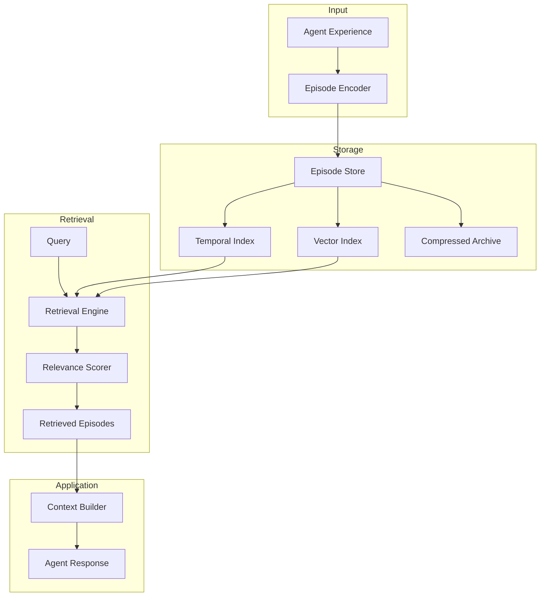
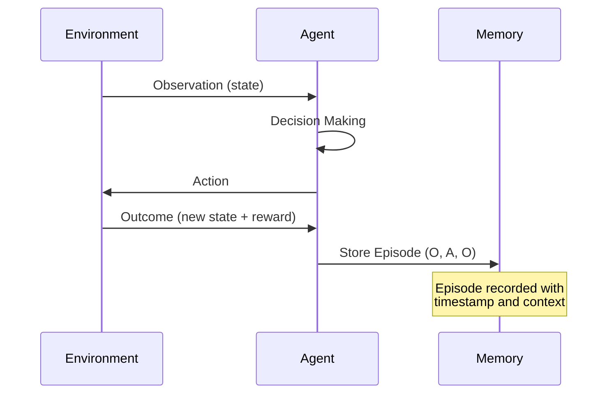
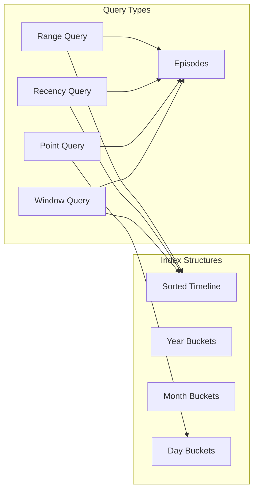
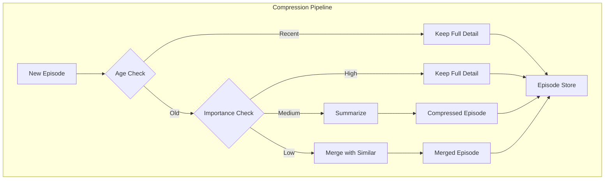
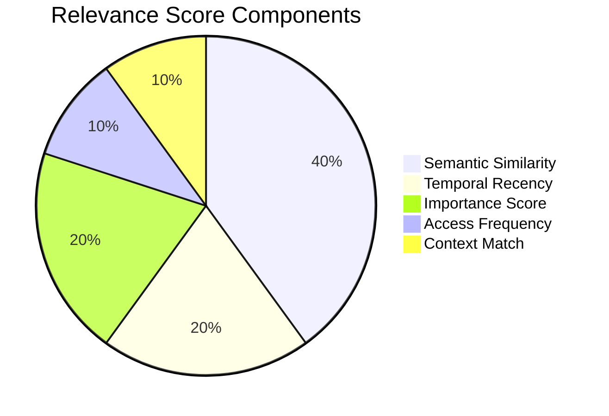
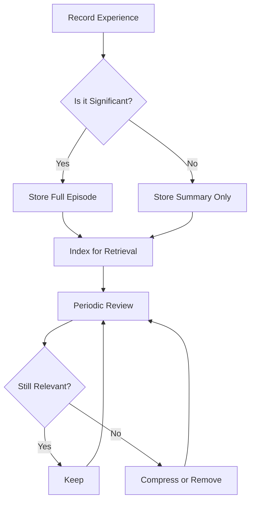

# How to Create Episodic Memory

Author: [nawazdhandala](https://github.com/nawazdhandala)

Tags: AI Agents, Episodic Memory, LLM, Context Learning

Description: Learn to implement episodic memory for AI agents with experience recording, temporal indexing, and similarity-based episode retrieval for contextual learning.

---

## Introduction

Episodic memory is a critical component for building AI agents that can learn from past experiences and apply that knowledge to new situations. Unlike semantic memory, which stores general facts and concepts, episodic memory captures specific experiences - the what, when, and where of events. This allows agents to recall past interactions, learn from mistakes, and improve their decision-making over time.

In this guide, we will walk through implementing a complete episodic memory system for AI agents, covering episode structure, temporal indexing, similarity-based retrieval, compression strategies, and relevance scoring.

## System Architecture Overview

Before diving into implementation details, let us understand how the components of an episodic memory system interact with each other.



## Episode Structure

An episode represents a discrete unit of experience. Each episode should capture enough context to be meaningful when retrieved later. Here is a well-designed episode structure:

```python
from dataclasses import dataclass, field
from datetime import datetime
from typing import List, Dict, Any, Optional
import uuid

@dataclass
class Episode:
    """Represents a single episodic memory unit."""

    # Unique identifier for the episode
    episode_id: str = field(default_factory=lambda: str(uuid.uuid4()))

    # Temporal information
    timestamp: datetime = field(default_factory=datetime.now)
    duration_seconds: float = 0.0

    # Content of the episode
    observation: str = ""  # What the agent perceived
    action: str = ""       # What action was taken
    outcome: str = ""      # What resulted from the action

    # Contextual metadata
    context: Dict[str, Any] = field(default_factory=dict)
    tags: List[str] = field(default_factory=list)

    # Relationships to other episodes
    parent_episode_id: Optional[str] = None
    child_episode_ids: List[str] = field(default_factory=list)

    # Embedding for similarity search
    embedding: Optional[List[float]] = None

    # Importance and access metrics
    importance_score: float = 0.5
    access_count: int = 0
    last_accessed: Optional[datetime] = None

    def to_text(self) -> str:
        """Convert episode to text for embedding generation."""
        return f"Observation: {self.observation}\nAction: {self.action}\nOutcome: {self.outcome}"

    def mark_accessed(self):
        """Update access metrics when episode is retrieved."""
        self.access_count += 1
        self.last_accessed = datetime.now()
```

The episode structure follows the Observation-Action-Outcome (OAO) pattern, which captures the essential elements of any experience:



## Temporal Indexing

Temporal indexing allows efficient retrieval of episodes based on time. This is crucial for understanding sequences of events and for recency-based retrieval.

```python
from collections import defaultdict
from datetime import datetime, timedelta
from typing import List, Tuple
import bisect

class TemporalIndex:
    """Indexes episodes by time for efficient temporal queries."""

    def __init__(self):
        # Sorted list of (timestamp, episode_id) tuples
        self._timeline: List[Tuple[datetime, str]] = []

        # Hierarchical time buckets for faster range queries
        self._year_index: Dict[int, List[str]] = defaultdict(list)
        self._month_index: Dict[Tuple[int, int], List[str]] = defaultdict(list)
        self._day_index: Dict[Tuple[int, int, int], List[str]] = defaultdict(list)

    def add_episode(self, episode: Episode):
        """Add an episode to the temporal index."""
        ts = episode.timestamp
        episode_id = episode.episode_id

        # Add to sorted timeline
        bisect.insort(self._timeline, (ts, episode_id))

        # Add to hierarchical buckets
        self._year_index[ts.year].append(episode_id)
        self._month_index[(ts.year, ts.month)].append(episode_id)
        self._day_index[(ts.year, ts.month, ts.day)].append(episode_id)

    def get_episodes_in_range(
        self,
        start: datetime,
        end: datetime
    ) -> List[str]:
        """Retrieve episode IDs within a time range."""
        # Binary search for start and end positions
        start_idx = bisect.bisect_left(
            self._timeline,
            (start, "")
        )
        end_idx = bisect.bisect_right(
            self._timeline,
            (end, "zzz")  # Ensures we include all episodes at end time
        )

        return [ep_id for _, ep_id in self._timeline[start_idx:end_idx]]

    def get_recent_episodes(
        self,
        n: int,
        before: Optional[datetime] = None
    ) -> List[str]:
        """Get the n most recent episodes before a given time."""
        if before is None:
            before = datetime.now()

        end_idx = bisect.bisect_right(self._timeline, (before, "zzz"))
        start_idx = max(0, end_idx - n)

        return [ep_id for _, ep_id in self._timeline[start_idx:end_idx]]

    def get_episodes_by_day(
        self,
        year: int,
        month: int,
        day: int
    ) -> List[str]:
        """Get all episodes from a specific day."""
        return self._day_index.get((year, month, day), [])

    def get_surrounding_episodes(
        self,
        timestamp: datetime,
        window_minutes: int = 30
    ) -> List[str]:
        """Get episodes within a time window around a timestamp."""
        delta = timedelta(minutes=window_minutes)
        return self.get_episodes_in_range(
            timestamp - delta,
            timestamp + delta
        )
```

The temporal index supports multiple query patterns:



## Similarity-Based Retrieval

Similarity retrieval allows finding episodes that are semantically related to a given query. This requires embedding episodes into a vector space and using approximate nearest neighbor search.

```python
import numpy as np
from typing import List, Tuple, Optional
from abc import ABC, abstractmethod

class EmbeddingModel(ABC):
    """Abstract base class for embedding models."""

    @abstractmethod
    def embed(self, text: str) -> List[float]:
        """Generate embedding for text."""
        pass

    @abstractmethod
    def embed_batch(self, texts: List[str]) -> List[List[float]]:
        """Generate embeddings for multiple texts."""
        pass

class OpenAIEmbedding(EmbeddingModel):
    """OpenAI-based embedding model."""

    def __init__(self, model: str = "text-embedding-3-small"):
        from openai import OpenAI
        self.client = OpenAI()
        self.model = model

    def embed(self, text: str) -> List[float]:
        response = self.client.embeddings.create(
            input=text,
            model=self.model
        )
        return response.data[0].embedding

    def embed_batch(self, texts: List[str]) -> List[List[float]]:
        response = self.client.embeddings.create(
            input=texts,
            model=self.model
        )
        return [item.embedding for item in response.data]

class VectorIndex:
    """Vector index for similarity-based episode retrieval."""

    def __init__(self, embedding_model: EmbeddingModel, dimension: int = 1536):
        self.embedding_model = embedding_model
        self.dimension = dimension

        # Storage for embeddings and episode IDs
        self._embeddings: List[np.ndarray] = []
        self._episode_ids: List[str] = []

        # Optional: Use FAISS for larger scale
        self._faiss_index = None
        self._use_faiss = False

    def enable_faiss(self):
        """Enable FAISS for faster similarity search."""
        try:
            import faiss
            self._faiss_index = faiss.IndexFlatIP(self.dimension)
            self._use_faiss = True

            # Add existing embeddings to FAISS
            if self._embeddings:
                embeddings_matrix = np.array(self._embeddings).astype('float32')
                faiss.normalize_L2(embeddings_matrix)
                self._faiss_index.add(embeddings_matrix)
        except ImportError:
            print("FAISS not available, using numpy-based search")

    def add_episode(self, episode: Episode):
        """Add an episode to the vector index."""
        # Generate embedding if not present
        if episode.embedding is None:
            episode.embedding = self.embedding_model.embed(episode.to_text())

        embedding = np.array(episode.embedding)

        self._embeddings.append(embedding)
        self._episode_ids.append(episode.episode_id)

        # Add to FAISS if enabled
        if self._use_faiss and self._faiss_index is not None:
            embedding_normalized = embedding.copy().astype('float32')
            embedding_normalized /= np.linalg.norm(embedding_normalized)
            self._faiss_index.add(embedding_normalized.reshape(1, -1))

    def search(
        self,
        query: str,
        k: int = 10,
        threshold: float = 0.0
    ) -> List[Tuple[str, float]]:
        """Find k most similar episodes to query."""
        query_embedding = np.array(self.embedding_model.embed(query))

        if self._use_faiss and self._faiss_index is not None:
            return self._search_faiss(query_embedding, k, threshold)
        else:
            return self._search_numpy(query_embedding, k, threshold)

    def _search_numpy(
        self,
        query_embedding: np.ndarray,
        k: int,
        threshold: float
    ) -> List[Tuple[str, float]]:
        """Numpy-based similarity search."""
        if not self._embeddings:
            return []

        # Normalize query
        query_norm = query_embedding / np.linalg.norm(query_embedding)

        # Calculate cosine similarities
        similarities = []
        for i, emb in enumerate(self._embeddings):
            emb_norm = emb / np.linalg.norm(emb)
            sim = np.dot(query_norm, emb_norm)
            if sim >= threshold:
                similarities.append((self._episode_ids[i], float(sim)))

        # Sort by similarity and return top k
        similarities.sort(key=lambda x: x[1], reverse=True)
        return similarities[:k]

    def _search_faiss(
        self,
        query_embedding: np.ndarray,
        k: int,
        threshold: float
    ) -> List[Tuple[str, float]]:
        """FAISS-based similarity search."""
        import faiss

        query_normalized = query_embedding.copy().astype('float32')
        query_normalized /= np.linalg.norm(query_normalized)

        distances, indices = self._faiss_index.search(
            query_normalized.reshape(1, -1),
            min(k, len(self._episode_ids))
        )

        results = []
        for dist, idx in zip(distances[0], indices[0]):
            if idx >= 0 and dist >= threshold:
                results.append((self._episode_ids[idx], float(dist)))

        return results
```

## Compression Strategies

As the number of episodes grows, storage and retrieval become expensive. Compression strategies help manage memory while preserving important information.



```python
from typing import List, Optional
from datetime import datetime, timedelta

class EpisodeCompressor:
    """Handles compression and summarization of episodes."""

    def __init__(
        self,
        llm_client,  # LLM for summarization
        similarity_threshold: float = 0.85,
        age_threshold_days: int = 30
    ):
        self.llm_client = llm_client
        self.similarity_threshold = similarity_threshold
        self.age_threshold_days = age_threshold_days

    def should_compress(self, episode: Episode) -> bool:
        """Determine if an episode should be compressed."""
        age = datetime.now() - episode.timestamp

        # Never compress recent episodes
        if age < timedelta(days=self.age_threshold_days):
            return False

        # Never compress high-importance episodes
        if episode.importance_score > 0.8:
            return False

        # Compress old, low-access episodes
        if episode.access_count < 3 and episode.importance_score < 0.5:
            return True

        return age > timedelta(days=self.age_threshold_days * 2)

    def summarize_episode(self, episode: Episode) -> Episode:
        """Create a summarized version of an episode."""
        prompt = f"""Summarize this experience concisely while preserving key information:

Observation: {episode.observation}
Action: {episode.action}
Outcome: {episode.outcome}

Provide a brief summary in the same format (Observation, Action, Outcome)."""

        response = self.llm_client.generate(prompt)

        # Parse response and create compressed episode
        compressed = Episode(
            episode_id=f"compressed_{episode.episode_id}",
            timestamp=episode.timestamp,
            observation=self._extract_field(response, "Observation"),
            action=self._extract_field(response, "Action"),
            outcome=self._extract_field(response, "Outcome"),
            context={"original_id": episode.episode_id, "compressed": True},
            tags=episode.tags + ["compressed"],
            importance_score=episode.importance_score,
            access_count=episode.access_count
        )

        return compressed

    def merge_similar_episodes(
        self,
        episodes: List[Episode]
    ) -> Episode:
        """Merge multiple similar episodes into one."""
        if len(episodes) == 1:
            return episodes[0]

        # Sort by timestamp
        episodes.sort(key=lambda e: e.timestamp)

        # Combine content for summarization
        combined_text = "\n\n".join([
            f"Episode {i+1} ({e.timestamp.isoformat()}):\n{e.to_text()}"
            for i, e in enumerate(episodes)
        ])

        prompt = f"""These are similar experiences that should be merged into one representative episode:

{combined_text}

Create a single merged episode that captures the common pattern and key variations. Format as Observation, Action, Outcome."""

        response = self.llm_client.generate(prompt)

        merged = Episode(
            timestamp=episodes[0].timestamp,  # Earliest timestamp
            observation=self._extract_field(response, "Observation"),
            action=self._extract_field(response, "Action"),
            outcome=self._extract_field(response, "Outcome"),
            context={
                "merged_from": [e.episode_id for e in episodes],
                "merge_count": len(episodes)
            },
            tags=list(set(tag for e in episodes for tag in e.tags)) + ["merged"],
            importance_score=max(e.importance_score for e in episodes)
        )

        return merged

    def _extract_field(self, text: str, field: str) -> str:
        """Extract a field value from structured text."""
        lines = text.split('\n')
        for line in lines:
            if line.startswith(f"{field}:"):
                return line[len(field)+1:].strip()
        return ""

    def run_compression_cycle(
        self,
        episodes: List[Episode],
        vector_index: VectorIndex
    ) -> List[Episode]:
        """Run a full compression cycle on a list of episodes."""
        compressed_episodes = []
        episodes_to_merge = []

        for episode in episodes:
            if not self.should_compress(episode):
                compressed_episodes.append(episode)
                continue

            # Check for similar episodes to merge
            similar = vector_index.search(
                episode.to_text(),
                k=5,
                threshold=self.similarity_threshold
            )

            similar_episodes = [
                e for e in episodes
                if e.episode_id in [s[0] for s in similar]
                and self.should_compress(e)
            ]

            if len(similar_episodes) >= 3:
                merged = self.merge_similar_episodes(similar_episodes)
                compressed_episodes.append(merged)
                # Mark originals for removal
                for e in similar_episodes:
                    episodes.remove(e)
            else:
                summarized = self.summarize_episode(episode)
                compressed_episodes.append(summarized)

        return compressed_episodes
```

## Relevance Scoring

Relevance scoring determines which retrieved episodes are most useful for the current context. A good scoring function combines multiple signals.

```python
from dataclasses import dataclass
from datetime import datetime, timedelta
from typing import List, Tuple, Callable
import math

@dataclass
class RelevanceWeights:
    """Configurable weights for relevance scoring."""
    semantic_similarity: float = 0.4
    temporal_recency: float = 0.2
    importance: float = 0.2
    access_frequency: float = 0.1
    contextual_match: float = 0.1

class RelevanceScorer:
    """Calculates relevance scores for retrieved episodes."""

    def __init__(self, weights: RelevanceWeights = None):
        self.weights = weights or RelevanceWeights()

    def score_episode(
        self,
        episode: Episode,
        query: str,
        semantic_similarity: float,
        current_context: dict = None,
        current_time: datetime = None
    ) -> float:
        """Calculate overall relevance score for an episode."""
        if current_time is None:
            current_time = datetime.now()

        scores = {
            'semantic': semantic_similarity,
            'recency': self._recency_score(episode, current_time),
            'importance': episode.importance_score,
            'access': self._access_frequency_score(episode),
            'context': self._context_match_score(episode, current_context)
        }

        final_score = (
            self.weights.semantic_similarity * scores['semantic'] +
            self.weights.temporal_recency * scores['recency'] +
            self.weights.importance * scores['importance'] +
            self.weights.access_frequency * scores['access'] +
            self.weights.contextual_match * scores['context']
        )

        return final_score

    def _recency_score(
        self,
        episode: Episode,
        current_time: datetime
    ) -> float:
        """Calculate recency score with exponential decay."""
        age_hours = (current_time - episode.timestamp).total_seconds() / 3600

        # Exponential decay with half-life of 24 hours
        half_life = 24.0
        decay_score = math.exp(-0.693 * age_hours / half_life)

        return decay_score

    def _access_frequency_score(self, episode: Episode) -> float:
        """Score based on how often the episode has been accessed."""
        # Logarithmic scaling to prevent highly-accessed episodes from dominating
        if episode.access_count == 0:
            return 0.0
        return min(1.0, math.log(episode.access_count + 1) / 5.0)

    def _context_match_score(
        self,
        episode: Episode,
        current_context: dict
    ) -> float:
        """Score based on context metadata matching."""
        if current_context is None or not episode.context:
            return 0.5  # Neutral score when no context available

        matches = 0
        total_keys = 0

        for key, value in current_context.items():
            if key in episode.context:
                total_keys += 1
                if episode.context[key] == value:
                    matches += 1

        if total_keys == 0:
            return 0.5

        return matches / total_keys

    def rank_episodes(
        self,
        episodes: List[Tuple[Episode, float]],  # (episode, semantic_similarity)
        query: str,
        current_context: dict = None,
        top_k: int = 10
    ) -> List[Tuple[Episode, float]]:
        """Rank episodes by relevance and return top k."""
        scored_episodes = []

        for episode, semantic_sim in episodes:
            score = self.score_episode(
                episode=episode,
                query=query,
                semantic_similarity=semantic_sim,
                current_context=current_context
            )
            scored_episodes.append((episode, score))

        # Sort by score descending
        scored_episodes.sort(key=lambda x: x[1], reverse=True)

        return scored_episodes[:top_k]
```

The relevance scoring system balances multiple factors:



## Putting It All Together

Now let us create a complete episodic memory system that integrates all components.

```python
from typing import List, Optional, Dict, Any
from datetime import datetime

class EpisodicMemory:
    """Complete episodic memory system for AI agents."""

    def __init__(
        self,
        embedding_model: EmbeddingModel,
        llm_client = None,  # For compression
        enable_compression: bool = True,
        compression_interval_hours: int = 24
    ):
        self.embedding_model = embedding_model
        self.llm_client = llm_client
        self.enable_compression = enable_compression

        # Core components
        self.episode_store: Dict[str, Episode] = {}
        self.temporal_index = TemporalIndex()
        self.vector_index = VectorIndex(embedding_model)
        self.relevance_scorer = RelevanceScorer()

        # Optional compression
        if enable_compression and llm_client:
            self.compressor = EpisodeCompressor(llm_client)
        else:
            self.compressor = None

        self._last_compression = datetime.now()
        self._compression_interval = timedelta(hours=compression_interval_hours)

    def record_episode(
        self,
        observation: str,
        action: str,
        outcome: str,
        context: Dict[str, Any] = None,
        tags: List[str] = None,
        importance: float = 0.5
    ) -> Episode:
        """Record a new episode to memory."""
        episode = Episode(
            observation=observation,
            action=action,
            outcome=outcome,
            context=context or {},
            tags=tags or [],
            importance_score=importance
        )

        # Generate embedding
        episode.embedding = self.embedding_model.embed(episode.to_text())

        # Store and index
        self.episode_store[episode.episode_id] = episode
        self.temporal_index.add_episode(episode)
        self.vector_index.add_episode(episode)

        # Check if compression is needed
        self._maybe_compress()

        return episode

    def recall(
        self,
        query: str,
        k: int = 10,
        time_range: tuple = None,  # (start, end) datetime
        context: Dict[str, Any] = None,
        min_relevance: float = 0.3
    ) -> List[Tuple[Episode, float]]:
        """Recall relevant episodes from memory."""

        # Get candidates from vector search
        similar_episodes = self.vector_index.search(query, k=k*2)

        # Filter by time range if specified
        if time_range:
            time_filtered_ids = set(
                self.temporal_index.get_episodes_in_range(*time_range)
            )
            similar_episodes = [
                (ep_id, sim) for ep_id, sim in similar_episodes
                if ep_id in time_filtered_ids
            ]

        # Get full episode objects
        episodes_with_sim = [
            (self.episode_store[ep_id], sim)
            for ep_id, sim in similar_episodes
            if ep_id in self.episode_store
        ]

        # Score and rank
        ranked = self.relevance_scorer.rank_episodes(
            episodes_with_sim,
            query=query,
            current_context=context,
            top_k=k
        )

        # Filter by minimum relevance
        ranked = [(ep, score) for ep, score in ranked if score >= min_relevance]

        # Mark episodes as accessed
        for episode, _ in ranked:
            episode.mark_accessed()

        return ranked

    def recall_recent(
        self,
        n: int = 10,
        before: datetime = None
    ) -> List[Episode]:
        """Recall the n most recent episodes."""
        episode_ids = self.temporal_index.get_recent_episodes(n, before)
        return [self.episode_store[ep_id] for ep_id in episode_ids]

    def recall_by_tags(
        self,
        tags: List[str],
        match_all: bool = False
    ) -> List[Episode]:
        """Recall episodes matching specified tags."""
        results = []
        for episode in self.episode_store.values():
            if match_all:
                if all(tag in episode.tags for tag in tags):
                    results.append(episode)
            else:
                if any(tag in episode.tags for tag in tags):
                    results.append(episode)
        return results

    def update_importance(
        self,
        episode_id: str,
        new_importance: float
    ):
        """Update the importance score of an episode."""
        if episode_id in self.episode_store:
            self.episode_store[episode_id].importance_score = new_importance

    def _maybe_compress(self):
        """Run compression if enough time has passed."""
        if not self.compressor:
            return

        if datetime.now() - self._last_compression > self._compression_interval:
            episodes_list = list(self.episode_store.values())
            compressed = self.compressor.run_compression_cycle(
                episodes_list,
                self.vector_index
            )

            # Rebuild store with compressed episodes
            self.episode_store = {e.episode_id: e for e in compressed}
            self._last_compression = datetime.now()

    def get_context_for_prompt(
        self,
        query: str,
        max_episodes: int = 5,
        max_tokens: int = 2000
    ) -> str:
        """Generate context string for inclusion in LLM prompts."""
        episodes = self.recall(query, k=max_episodes)

        context_parts = ["## Relevant Past Experiences\n"]
        total_chars = 0
        char_limit = max_tokens * 4  # Rough char to token ratio

        for i, (episode, score) in enumerate(episodes):
            episode_text = f"""
### Experience {i+1} (Relevance: {score:.2f})
**When:** {episode.timestamp.strftime('%Y-%m-%d %H:%M')}
**Observation:** {episode.observation}
**Action:** {episode.action}
**Outcome:** {episode.outcome}
"""
            if total_chars + len(episode_text) > char_limit:
                break

            context_parts.append(episode_text)
            total_chars += len(episode_text)

        return "\n".join(context_parts)

    def get_statistics(self) -> Dict[str, Any]:
        """Get memory statistics."""
        return {
            "total_episodes": len(self.episode_store),
            "compressed_episodes": sum(
                1 for e in self.episode_store.values()
                if "compressed" in e.tags or "merged" in e.tags
            ),
            "average_importance": sum(
                e.importance_score for e in self.episode_store.values()
            ) / max(1, len(self.episode_store)),
            "total_accesses": sum(
                e.access_count for e in self.episode_store.values()
            )
        }
```

## Usage Example

Here is a complete example of how to use the episodic memory system with an AI agent:

```python
# Initialize components
embedding_model = OpenAIEmbedding()
memory = EpisodicMemory(
    embedding_model=embedding_model,
    enable_compression=False  # Disable for simplicity
)

# Record some episodes
memory.record_episode(
    observation="User asked how to deploy a Python application to AWS",
    action="Provided step-by-step guide for AWS Elastic Beanstalk deployment",
    outcome="User successfully deployed their application",
    tags=["aws", "deployment", "python"],
    importance=0.7
)

memory.record_episode(
    observation="User encountered 'ModuleNotFoundError' when running their app",
    action="Suggested checking requirements.txt and virtual environment setup",
    outcome="User fixed the issue by adding missing dependency to requirements.txt",
    tags=["python", "debugging", "dependencies"],
    importance=0.6
)

memory.record_episode(
    observation="User asked about setting up CI/CD pipeline",
    action="Recommended GitHub Actions with provided workflow example",
    outcome="User implemented CI/CD but had issues with secrets configuration",
    tags=["ci-cd", "github-actions", "devops"],
    importance=0.8
)

# Later, when handling a new query
new_query = "I need help deploying my Python app with automatic deployments"

# Recall relevant episodes
relevant_episodes = memory.recall(
    query=new_query,
    k=3,
    context={"topic": "deployment"}
)

print("Relevant past experiences:")
for episode, score in relevant_episodes:
    print(f"\n[Score: {score:.2f}]")
    print(f"Observation: {episode.observation}")
    print(f"Action: {episode.action}")
    print(f"Outcome: {episode.outcome}")

# Generate context for LLM prompt
context = memory.get_context_for_prompt(new_query, max_episodes=3)
print("\n" + "="*50)
print("Context for LLM:")
print(context)
```

## Best Practices

When implementing episodic memory for your AI agents, keep these best practices in mind:

1. **Choose appropriate granularity**: Episodes should be atomic but meaningful. Too fine-grained episodes create noise; too coarse episodes lose detail.

2. **Balance storage and retrieval costs**: Use approximate nearest neighbor search (like FAISS or Annoy) for large-scale deployments.

3. **Implement forgetting mechanisms**: Not all memories are worth keeping. Use importance scores and access patterns to decide what to compress or discard.

4. **Consider privacy**: If storing user interactions, implement proper data retention policies and anonymization.

5. **Test retrieval quality**: Regularly evaluate whether retrieved episodes are actually useful for improving agent responses.



## Conclusion

Episodic memory transforms AI agents from stateless responders into entities that can learn from experience. By implementing the components covered in this guide - episode structure, temporal indexing, similarity retrieval, compression, and relevance scoring - you can build agents that improve over time and provide more contextually aware responses.

The key to success is balancing the tradeoffs between memory capacity, retrieval speed, and relevance quality. Start with a simple implementation and iterate based on your specific use case requirements.

Remember that episodic memory is just one component of a complete memory system. For production agents, consider combining it with semantic memory (facts and concepts) and procedural memory (learned skills and procedures) for a more comprehensive cognitive architecture.
