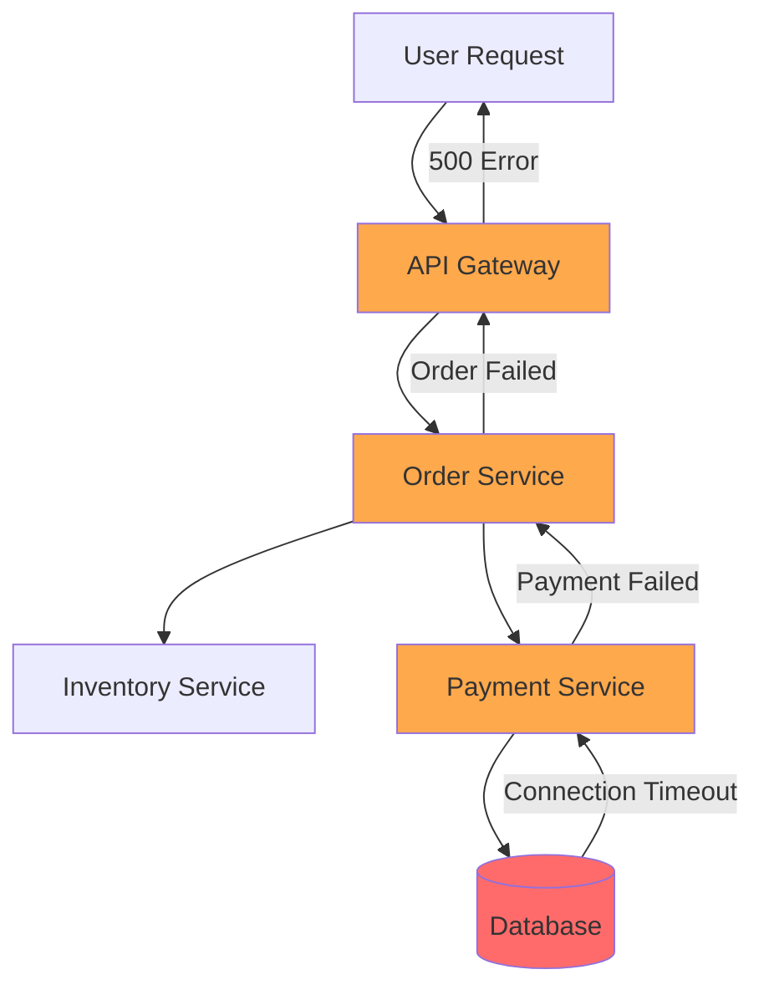
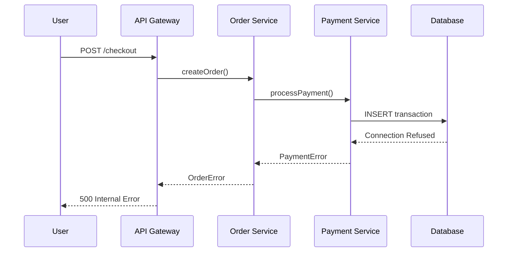
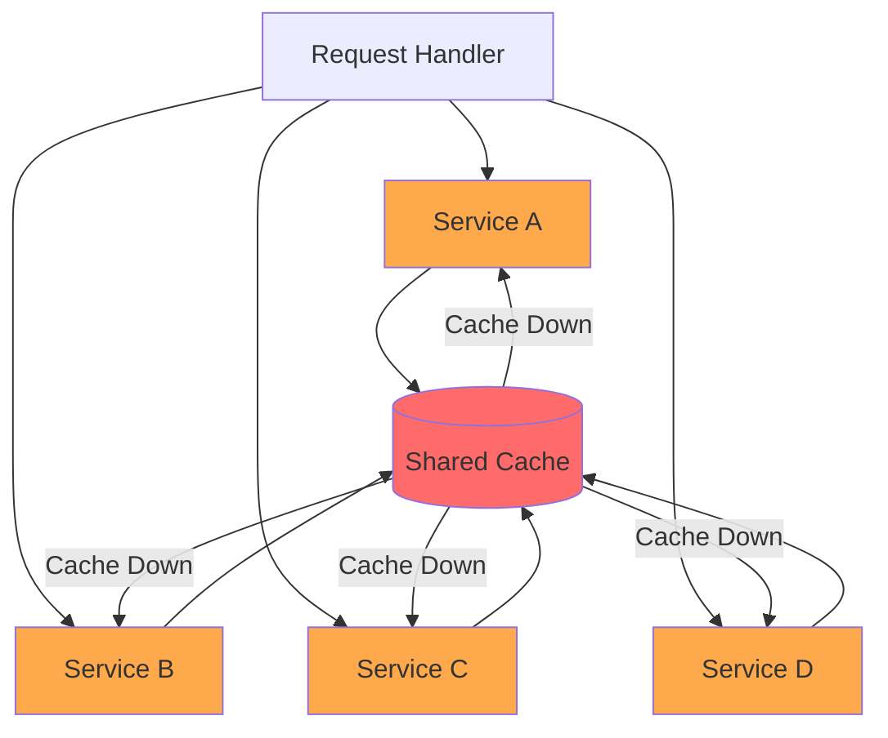
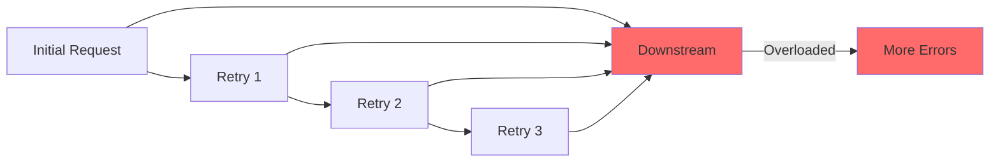
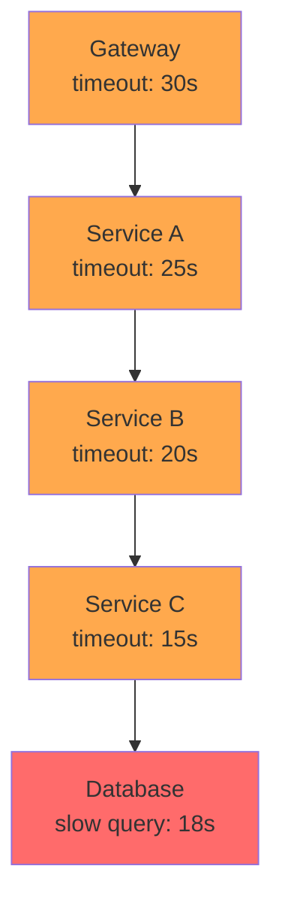
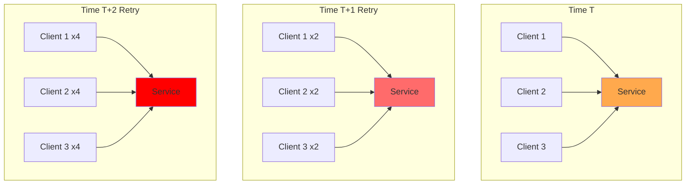
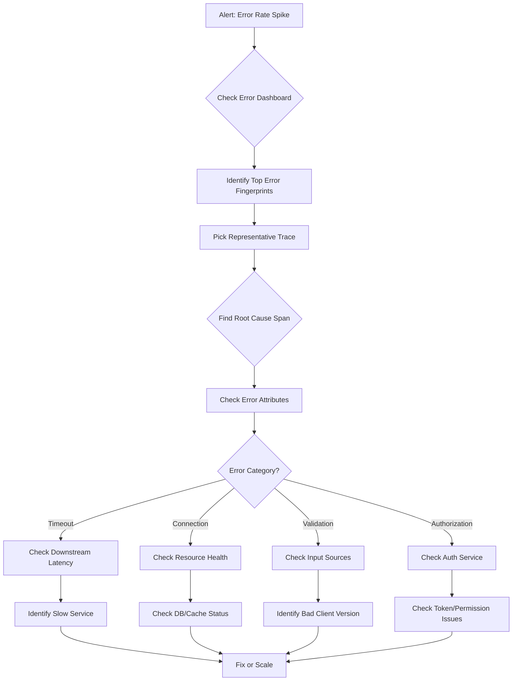

# How to Create Error Analysis: A Practical Guide to Finding Root Causes in Distributed Systems

Author: [nawazdhandala](https://github.com/nawazdhandala)

Tags: Tracing, Error Analysis, Debugging, Observability

Description: Learn how to build effective error analysis workflows using traces, identify root causes quickly, and understand error propagation patterns in distributed systems.

---

It starts with a Slack message: "Users are seeing 500 errors on checkout." You open your dashboard. Error rate is up 3x. But which service? Which endpoint? Which deploy? And most importantly: what actually broke?

This is where error analysis comes in. Not just catching errors, but understanding them. Where did they originate? How did they propagate? What patterns do they follow?

This guide walks through how to build error analysis into your observability stack using distributed traces, practical attribution techniques, and pattern recognition that turns "something broke" into "here's exactly what happened."

---

## Table of Contents

1. What is Error Analysis?
2. Error Attribution: Finding the Source
3. Error Propagation in Distributed Systems
4. Trace-Based Error Analysis
5. Building Error Fingerprints
6. Common Error Patterns
7. Setting Up Error Analysis in Practice
8. Error Analysis Workflow
9. Alerting on Error Patterns
10. Common Mistakes to Avoid

---

## 1. What is Error Analysis?

Error analysis is the systematic process of identifying, categorizing, and understanding errors in your system. It goes beyond simple error counting to answer:

- **Where** did the error originate?
- **How** did it propagate through the system?
- **Why** did it happen?
- **What** is the impact?

| Traditional Error Handling | Error Analysis |
|---------------------------|----------------|
| "500 errors increased" | "Database connection timeout in user-service caused cascading failures in checkout-service" |
| "Error rate is 2%" | "90% of errors are from a single endpoint, triggered by malformed input from mobile clients v2.3.1" |
| "Something is wrong" | "Root cause: Redis cluster failover, error originated in cache layer, propagated to 4 downstream services" |

---

## 2. Error Attribution: Finding the Source

The first step in error analysis is attribution: figuring out where an error actually started.

### The Attribution Problem

In distributed systems, a single root cause can appear as errors in dozens of services. Without proper attribution, you end up chasing symptoms instead of causes.

```
User Request → API Gateway → Order Service → Payment Service → Database
                    ↓              ↓              ↓
                 Error!         Error!         Error! ← Actual source
```

The user sees a 500 from API Gateway. The API Gateway logs show an error from Order Service. Order Service logs show Payment Service failed. But the real problem? A database connection limit.

### Attribution Techniques

**1. First Error in Trace**

Look for the earliest span in the trace with an error status:

```typescript
function findRootCause(trace: Trace): Span | null {
  const errorSpans = trace.spans
    .filter(span => span.status.code === SpanStatusCode.ERROR)
    .sort((a, b) => a.startTime - b.startTime);

  return errorSpans[0] || null;
}
```

**2. Deepest Error in Call Tree**

The deepest nested error span is often the root cause:

```typescript
function findDeepestError(trace: Trace): Span | null {
  let deepest: Span | null = null;
  let maxDepth = -1;

  for (const span of trace.spans) {
    if (span.status.code === SpanStatusCode.ERROR) {
      const depth = getSpanDepth(span, trace);
      if (depth > maxDepth) {
        maxDepth = depth;
        deepest = span;
      }
    }
  }

  return deepest;
}
```

**3. Error Source Attribute**

Tag spans with the originating service when catching and re-throwing:

```typescript
try {
  await paymentService.charge(amount);
} catch (err) {
  span.setAttribute('error.source', 'payment-service');
  span.setAttribute('error.source_operation', 'charge');
  throw err;
}
```

---

## 3. Error Propagation in Distributed Systems

Understanding how errors flow through your system is critical for effective analysis.

### Error Flow Patterns



### Propagation Types

**1. Cascading Failures**

One service fails, causing dependent services to fail in sequence.



**2. Fan-Out Amplification**

A single error gets multiplied across parallel calls:



**3. Retry Storms**

Retries create exponential error growth:



---

## 4. Trace-Based Error Analysis

Distributed traces provide the context needed for meaningful error analysis.

### Instrumenting for Error Analysis

When recording errors, capture enough context to enable analysis:

```typescript
import { trace, SpanStatusCode } from '@opentelemetry/api';

const tracer = trace.getTracer('order-service');

async function processOrder(orderId: string) {
  return tracer.startActiveSpan('order.process', async (span) => {
    span.setAttribute('order.id', orderId);

    try {
      const result = await executeOrder(orderId);
      span.setAttribute('order.status', 'completed');
      return result;
    } catch (err: any) {
      // Record the exception with full context
      span.recordException(err);
      span.setStatus({
        code: SpanStatusCode.ERROR,
        message: err.message
      });

      // Add error analysis attributes
      span.setAttribute('error.type', err.constructor.name);
      span.setAttribute('error.category', categorizeError(err));
      span.setAttribute('error.retriable', isRetriable(err));

      // Preserve error chain for root cause analysis
      if (err.cause) {
        span.setAttribute('error.cause_type', err.cause.constructor.name);
        span.setAttribute('error.cause_message', err.cause.message);
      }

      throw err;
    } finally {
      span.end();
    }
  });
}

function categorizeError(err: Error): string {
  if (err.message.includes('timeout')) return 'timeout';
  if (err.message.includes('connection')) return 'connection';
  if (err.message.includes('permission')) return 'authorization';
  if (err.message.includes('not found')) return 'not_found';
  if (err.message.includes('validation')) return 'validation';
  return 'unknown';
}

function isRetriable(err: Error): boolean {
  const retriableCategories = ['timeout', 'connection'];
  return retriableCategories.includes(categorizeError(err));
}
```

### Error Context Propagation

Pass error context through the trace using span attributes:

```typescript
async function callDownstream(span: Span) {
  try {
    return await downstreamService.call();
  } catch (err: any) {
    // Add downstream error context to current span
    span.setAttribute('downstream.error', true);
    span.setAttribute('downstream.service', 'payment-service');
    span.setAttribute('downstream.error_type', err.constructor.name);

    // Create a wrapped error with context
    const wrappedError = new Error(`Downstream failure: ${err.message}`);
    wrappedError.cause = err;
    throw wrappedError;
  }
}
```

### Querying Error Traces

Build queries to find related errors:

```typescript
// Find all traces with errors in the last hour
const errorTraces = await traceStore.query({
  timeRange: { start: Date.now() - 3600000, end: Date.now() },
  filter: {
    'span.status.code': 'ERROR'
  },
  groupBy: ['span.attributes.error.category', 'resource.service.name'],
  orderBy: { count: 'desc' }
});

// Find traces where error originated in a specific service
const rootCauseTraces = await traceStore.query({
  timeRange: { start: Date.now() - 3600000, end: Date.now() },
  filter: {
    'span.status.code': 'ERROR',
    'span.attributes.error.source': 'database-service',
    'span.parentSpanId': null  // Root span check
  }
});
```

---

## 5. Building Error Fingerprints

Error fingerprints group similar errors together, making patterns visible.

### What Makes a Good Fingerprint?

A fingerprint should be:
- **Stable**: Same root cause produces the same fingerprint
- **Discriminating**: Different root causes produce different fingerprints
- **Actionable**: Groups errors that need the same fix

### Fingerprint Components

```typescript
interface ErrorFingerprint {
  // Where the error occurred
  service: string;
  operation: string;

  // What type of error
  errorType: string;
  errorCategory: string;

  // Normalized error message (remove variable parts)
  normalizedMessage: string;

  // Stack trace signature (top N frames)
  stackSignature: string;
}

function createFingerprint(span: Span, error: Error): string {
  const components: ErrorFingerprint = {
    service: span.resource.attributes['service.name'],
    operation: span.name,
    errorType: error.constructor.name,
    errorCategory: span.attributes['error.category'],
    normalizedMessage: normalizeMessage(error.message),
    stackSignature: extractStackSignature(error.stack, 3)
  };

  return hash(JSON.stringify(components));
}

function normalizeMessage(message: string): string {
  return message
    // Remove UUIDs
    .replace(/[0-9a-f]{8}-[0-9a-f]{4}-[0-9a-f]{4}-[0-9a-f]{4}-[0-9a-f]{12}/gi, '<UUID>')
    // Remove numeric IDs
    .replace(/\b\d{5,}\b/g, '<ID>')
    // Remove timestamps
    .replace(/\d{4}-\d{2}-\d{2}T\d{2}:\d{2}:\d{2}/g, '<TIMESTAMP>')
    // Remove IP addresses
    .replace(/\d{1,3}\.\d{1,3}\.\d{1,3}\.\d{1,3}/g, '<IP>')
    .trim();
}

function extractStackSignature(stack: string, frameCount: number): string {
  const frames = stack
    .split('\n')
    .slice(1, frameCount + 1)  // Skip "Error: message" line
    .map(frame => frame.trim())
    .join('|');

  return hash(frames);
}
```

### Using Fingerprints for Analysis

```typescript
// Group errors by fingerprint
const errorGroups = new Map<string, ErrorGroup>();

for (const errorSpan of errorSpans) {
  const fingerprint = createFingerprint(errorSpan, errorSpan.exception);

  if (!errorGroups.has(fingerprint)) {
    errorGroups.set(fingerprint, {
      fingerprint,
      count: 0,
      firstSeen: errorSpan.startTime,
      lastSeen: errorSpan.startTime,
      examples: [],
      affectedServices: new Set(),
      affectedEndpoints: new Set()
    });
  }

  const group = errorGroups.get(fingerprint)!;
  group.count++;
  group.lastSeen = Math.max(group.lastSeen, errorSpan.startTime);
  group.affectedServices.add(errorSpan.resource.attributes['service.name']);
  group.affectedEndpoints.add(errorSpan.name);

  if (group.examples.length < 5) {
    group.examples.push(errorSpan.traceId);
  }
}
```

---

## 6. Common Error Patterns

Recognizing patterns helps you identify and fix issues faster.

### Pattern 1: Timeout Cascade

**Signature**: Timeout errors propagate up the call chain, each service hitting its own timeout.



**Detection**:
```typescript
function detectTimeoutCascade(trace: Trace): boolean {
  const timeoutSpans = trace.spans.filter(s =>
    s.attributes['error.category'] === 'timeout'
  );

  if (timeoutSpans.length < 2) return false;

  // Check if timeouts form a chain (parent-child relationships)
  for (const span of timeoutSpans) {
    const parent = trace.spans.find(s => s.spanId === span.parentSpanId);
    if (parent && parent.attributes['error.category'] === 'timeout') {
      return true;
    }
  }

  return false;
}
```

**Fix**: Implement deadline propagation where each service subtracts its processing time from the remaining deadline.

### Pattern 2: Connection Pool Exhaustion

**Signature**: Sudden spike in connection errors, often with increasing latency leading up to it.

**Detection**:
```typescript
function detectPoolExhaustion(metrics: MetricSeries[]): boolean {
  const connWait = metrics.find(m => m.name === 'db.connection.wait_time');
  const connErrors = metrics.find(m => m.name === 'db.connection.errors');

  if (!connWait || !connErrors) return false;

  // Look for increasing wait times followed by error spike
  const recentWaits = connWait.values.slice(-10);
  const isIncreasing = recentWaits.every((v, i) =>
    i === 0 || v >= recentWaits[i - 1]
  );

  const recentErrors = connErrors.values.slice(-5);
  const hasSpike = Math.max(...recentErrors) > 3 * average(connErrors.values);

  return isIncreasing && hasSpike;
}
```

**Fix**: Increase pool size, add connection timeouts, implement circuit breakers.

### Pattern 3: Retry Storm

**Signature**: Exponential increase in requests to a failing service, each client retrying independently.



**Detection**:
```typescript
function detectRetryStorm(traces: Trace[]): boolean {
  // Group by target service
  const callsByService = new Map<string, number[]>();

  for (const trace of traces) {
    for (const span of trace.spans) {
      if (span.kind === SpanKind.CLIENT) {
        const target = span.attributes['peer.service'];
        if (!callsByService.has(target)) {
          callsByService.set(target, []);
        }
        callsByService.get(target)!.push(span.startTime);
      }
    }
  }

  // Check for exponential growth pattern
  for (const [service, times] of callsByService) {
    const buckets = bucketBySecond(times);
    if (isExponentialGrowth(buckets)) {
      return true;
    }
  }

  return false;
}
```

**Fix**: Add jitter to retries, implement exponential backoff with caps, use circuit breakers.

### Pattern 4: Partial Deployment Errors

**Signature**: Errors only occur in specific service versions or instances.

**Detection**:
```typescript
function detectPartialDeploymentIssue(errorSpans: Span[]): boolean {
  const errorsByVersion = new Map<string, number>();
  const totalByVersion = new Map<string, number>();

  for (const span of errorSpans) {
    const version = span.resource.attributes['service.version'];
    errorsByVersion.set(version, (errorsByVersion.get(version) || 0) + 1);
  }

  // Compare error rates between versions
  const versions = Array.from(errorsByVersion.keys());
  if (versions.length < 2) return false;

  const rates = versions.map(v => errorsByVersion.get(v)! / totalByVersion.get(v)!);
  const maxRate = Math.max(...rates);
  const minRate = Math.min(...rates);

  // If one version has 10x more errors, likely deployment issue
  return maxRate > minRate * 10;
}
```

**Fix**: Rollback the problematic version, investigate configuration or code differences.

---

## 7. Setting Up Error Analysis in Practice

### Step 1: Instrument Error Boundaries

Add error tracking at service boundaries:

```typescript
// Middleware for Express/Fastify
function errorAnalysisMiddleware(err: Error, req: Request, res: Response, next: NextFunction) {
  const span = trace.getSpan(context.active());

  if (span) {
    span.recordException(err);
    span.setStatus({ code: SpanStatusCode.ERROR, message: err.message });

    // Add analysis attributes
    span.setAttribute('error.type', err.constructor.name);
    span.setAttribute('error.category', categorizeError(err));
    span.setAttribute('http.status_code', getStatusCode(err));

    // Add request context for correlation
    span.setAttribute('request.path', req.path);
    span.setAttribute('request.method', req.method);

    // Client info for partial rollout detection
    span.setAttribute('client.version', req.headers['x-client-version'] || 'unknown');
  }

  next(err);
}
```

### Step 2: Configure Error Sampling

Keep all error traces while sampling success:

```yaml
# OpenTelemetry Collector config
processors:
  tail_sampling:
    decision_wait: 10s
    num_traces: 100000
    policies:
      # Keep all errors
      - name: errors-policy
        type: status_code
        status_code:
          status_codes: [ERROR]

      # Sample successful requests
      - name: success-sample
        type: probabilistic
        probabilistic:
          sampling_percentage: 10
```

### Step 3: Build Error Dashboards

Create views that support analysis:

**Error Rate by Service**
```
sum(rate(span_errors_total[5m])) by (service)
```

**Error Categories Over Time**
```
sum(rate(span_errors_total[5m])) by (error_category)
```

**Top Error Fingerprints**
```
topk(10, sum(rate(span_errors_total[5m])) by (error_fingerprint))
```

### Step 4: Set Up Error Alerts

Alert on meaningful patterns, not just counts:

```yaml
# Alert on new error fingerprints
- alert: NewErrorPattern
  expr: |
    count(span_errors_total) by (error_fingerprint)
    unless
    count(span_errors_total offset 1h) by (error_fingerprint)
  for: 5m
  annotations:
    summary: "New error pattern detected"

# Alert on error rate increase
- alert: ErrorRateSpike
  expr: |
    sum(rate(span_errors_total[5m])) by (service)
    >
    3 * sum(rate(span_errors_total[1h] offset 5m)) by (service)
  for: 2m
  annotations:
    summary: "Error rate spike in {{ $labels.service }}"
```

---

## 8. Error Analysis Workflow

When an error alert fires, follow this workflow:



### Workflow Steps in Detail

**1. Scope the Problem**
- What services are affected?
- When did it start?
- What changed? (deploys, config, traffic)

**2. Find Representative Traces**
- Filter by error status
- Look for common fingerprints
- Pick traces that show the full error path

**3. Identify Root Cause**
- Find the deepest error span
- Check error attributes for category
- Look at surrounding spans for context

**4. Verify the Cause**
- Find other traces with the same root cause
- Check if the fix addresses all error groups
- Validate with metrics (error rate dropping)

**5. Document and Prevent**
- Record the incident
- Add monitoring for this pattern
- Implement prevention measures

---

## 9. Alerting on Error Patterns

Move beyond simple error rate alerts:

### Pattern-Based Alerts

```typescript
// Alert when a new error fingerprint appears in production
async function checkForNewErrors() {
  const recentFingerprints = await getFingerprints({
    timeRange: 'last_5m',
    environment: 'production'
  });

  const historicalFingerprints = await getFingerprints({
    timeRange: 'last_24h',
    environment: 'production'
  });

  const newFingerprints = recentFingerprints.filter(
    fp => !historicalFingerprints.includes(fp)
  );

  if (newFingerprints.length > 0) {
    await alert({
      severity: 'warning',
      title: 'New Error Patterns Detected',
      fingerprints: newFingerprints,
      exampleTraces: await getTracesForFingerprints(newFingerprints)
    });
  }
}

// Alert when errors affect a specific percentage of users
async function checkUserImpact() {
  const errorRate = await query(`
    sum(span_errors_total{endpoint="/checkout"})
    /
    sum(span_total{endpoint="/checkout"})
  `);

  if (errorRate > 0.01) { // 1% of users affected
    await alert({
      severity: 'critical',
      title: 'Checkout Errors Affecting >1% of Users',
      errorRate: errorRate,
      estimatedUsersAffected: await estimateAffectedUsers(errorRate)
    });
  }
}
```

### Correlation Alerts

Alert when errors correlate with specific events:

```typescript
async function checkDeployCorrelation() {
  const recentDeploys = await getRecentDeploys({ timeRange: 'last_30m' });

  for (const deploy of recentDeploys) {
    const preDeployErrors = await getErrorRate({
      service: deploy.service,
      timeRange: { end: deploy.timestamp, duration: '15m' }
    });

    const postDeployErrors = await getErrorRate({
      service: deploy.service,
      timeRange: { start: deploy.timestamp, duration: '15m' }
    });

    if (postDeployErrors > preDeployErrors * 2) {
      await alert({
        severity: 'critical',
        title: `Error spike after deploy in ${deploy.service}`,
        deploy: deploy,
        preRate: preDeployErrors,
        postRate: postDeployErrors
      });
    }
  }
}
```

---

## 10. Common Mistakes to Avoid

**1. Alerting on Every Error**

Not all errors need immediate attention. Focus on:
- User-facing errors
- New error patterns
- Error rate changes (not absolute counts)

**2. Losing Error Context**

When catching and re-throwing, preserve the original error:

```typescript
// Bad: Context lost
try {
  await downstream.call();
} catch (err) {
  throw new Error('Downstream failed');  // Original error gone
}

// Good: Context preserved
try {
  await downstream.call();
} catch (err) {
  const wrapped = new Error('Downstream failed');
  wrapped.cause = err;
  throw wrapped;
}
```

**3. High-Cardinality Error Messages**

Avoid including variable data in error messages used for grouping:

```typescript
// Bad: Creates millions of unique errors
throw new Error(`User ${userId} not found at ${timestamp}`);

// Good: Stable message, context in attributes
const err = new Error('User not found');
span.setAttribute('user.id', userId);
span.setAttribute('error.timestamp', timestamp);
throw err;
```

**4. Ignoring Error Patterns**

Individual errors are often noise. Patterns are signal:
- Same error across multiple services = shared dependency
- Errors only in specific versions = deployment issue
- Errors at specific times = capacity or external dependency

**5. Not Connecting Errors to Impact**

Always link errors to business impact:
- How many users affected?
- What functionality is broken?
- What is the revenue impact?

---

## Summary

| Goal | Approach |
|------|----------|
| Find where errors originate | Attribution via deepest error span, first error in trace |
| Understand how errors spread | Trace error propagation paths, detect cascades |
| Group similar errors | Build fingerprints from service, operation, error type, normalized message |
| Detect patterns | Look for timeout cascades, retry storms, deployment correlation |
| Alert effectively | New patterns, user impact, post-deploy spikes |

Error analysis transforms debugging from "grep and guess" into systematic investigation. With proper instrumentation and trace-based analysis, you can go from alert to root cause in minutes instead of hours.

The key is building errors into your observability strategy from the start: consistent error attributes, meaningful fingerprints, and correlation with traces and metrics. When errors become data you can query and analyze, fixing them becomes engineering instead of archaeology.

---

**Related Reading:**

- [What are Traces and Spans in OpenTelemetry](https://oneuptime.com/blog/post/2025-08-27-traces-and-spans-in-opentelemetry/view)
- [Three Pillars of Observability: Logs, Metrics, Traces](https://oneuptime.com/blog/post/2025-08-20-three-pillars-of-observability-logs-metrics-traces/view)
- [How to Structure Logs Properly in OpenTelemetry](https://oneuptime.com/blog/post/2025-08-28-how-to-structure-logs-properly-in-opentelemetry/view)
