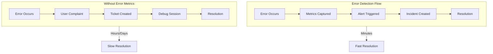
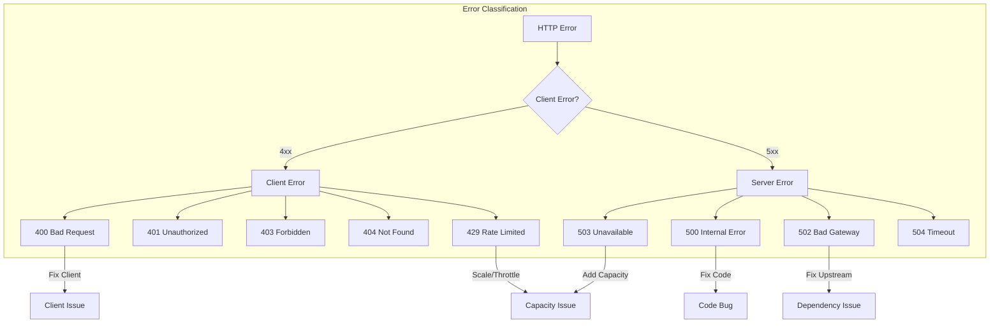
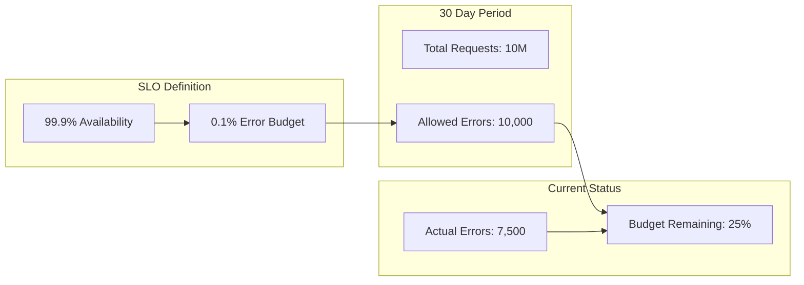
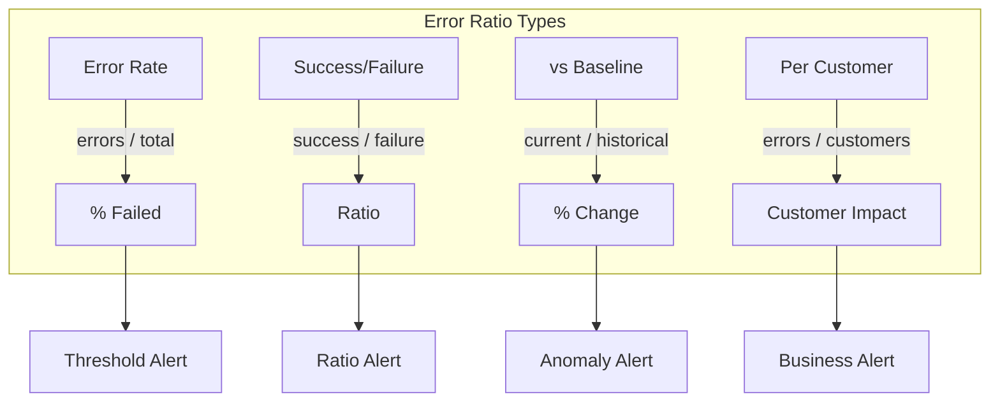
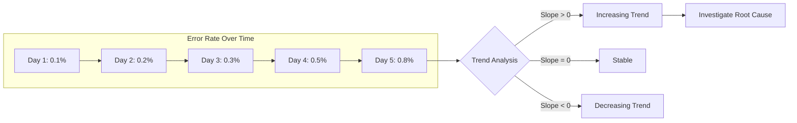
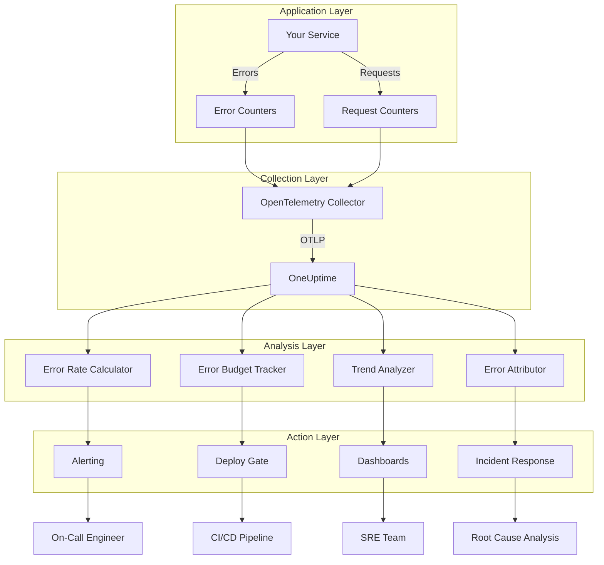

# How to Build Error Metrics

Author: [nawazdhandala](https://github.com/nawazdhandala)

Tags: Observability, Metrics, SRE, Monitoring

Description: Learn how to design and implement error metrics for effective monitoring and alerting.

---

Errors are the heartbeat of system health. When errors increase, something is wrong. When they stay flat, you have stability. Building effective error metrics is not about counting every exception. It is about capturing the right signals that tell you when user experience degrades, when deployments fail, and when dependencies break.

This guide walks you through designing and implementing error metrics from first principles. You will learn to calculate error rates, classify errors by type, track error budget consumption, build ratio metrics, analyze trends, and attribute errors to their sources.

## Why Error Metrics Matter

Error metrics are one of the four golden signals of monitoring alongside latency, traffic, and saturation. They answer the fundamental question: is my system working?

Without error metrics, you discover problems when users complain. With good error metrics, you know about problems before they become incidents. You can deploy with confidence because you will see degradation immediately. You can negotiate SLOs because you have data on actual reliability.



The difference between proactive and reactive operations is measured in minutes during incidents. Error metrics give you that head start.

## Error Rate Calculation

Error rate is the foundation of all error metrics. It measures what percentage of requests fail within a time window. The formula is simple.

```
Error Rate = (Failed Requests / Total Requests) * 100
```

A service processing 100,000 requests per minute with 500 errors has a 0.5% error rate. But not all errors are equal. A 500 Internal Server Error is worse than a 400 Bad Request. Your error rate calculation should reflect this.

### Basic Error Rate Implementation

Here is how to instrument error rate tracking in a Node.js application using OpenTelemetry.

```javascript
// error-metrics.js
const { metrics } = require('@opentelemetry/api');

// Get the meter from OpenTelemetry
const meter = metrics.getMeter('http-server');

// Counter for total requests
const requestCounter = meter.createCounter('http_requests_total', {
  description: 'Total number of HTTP requests',
});

// Counter for error requests (5xx responses)
const errorCounter = meter.createCounter('http_errors_total', {
  description: 'Total number of HTTP errors',
});

// Histogram for request duration (useful for correlated analysis)
const requestDuration = meter.createHistogram('http_request_duration_ms', {
  description: 'Request duration in milliseconds',
});

// Middleware to capture request metrics
function errorMetricsMiddleware(req, res, next) {
  const startTime = Date.now();

  // Capture response finish
  res.on('finish', () => {
    const duration = Date.now() - startTime;
    const attributes = {
      method: req.method,
      path: normalizeRoutePath(req.path),
      status_code: res.statusCode.toString(),
    };

    // Always increment total requests
    requestCounter.add(1, attributes);

    // Record duration
    requestDuration.record(duration, attributes);

    // Increment error counter for server errors
    if (res.statusCode >= 500) {
      errorCounter.add(1, {
        ...attributes,
        error_type: classifyServerError(res.statusCode),
      });
    }
  });

  next();
}

// Normalize paths to avoid cardinality explosion
function normalizeRoutePath(path) {
  // Replace UUIDs and numeric IDs with placeholders
  return path
    .replace(/[0-9a-f]{8}-[0-9a-f]{4}-[0-9a-f]{4}-[0-9a-f]{4}-[0-9a-f]{12}/gi, ':id')
    .replace(/\/\d+/g, '/:id');
}

// Classify server errors for better grouping
function classifyServerError(statusCode) {
  const errorTypes = {
    500: 'internal_server_error',
    501: 'not_implemented',
    502: 'bad_gateway',
    503: 'service_unavailable',
    504: 'gateway_timeout',
  };
  return errorTypes[statusCode] || 'unknown_server_error';
}

module.exports = { errorMetricsMiddleware };
```

This implementation captures three essential metrics: total requests, error requests, and request duration. The labels allow you to slice error rates by endpoint, method, and status code.

### Calculating Error Rate in PromQL

Once metrics are flowing to Prometheus, calculate error rate with this query.

```promql
# Error rate over 5 minutes as a percentage
(
  sum(rate(http_errors_total[5m]))
  /
  sum(rate(http_requests_total[5m]))
) * 100

# Error rate by endpoint
sum by (path) (rate(http_errors_total[5m]))
/
sum by (path) (rate(http_requests_total[5m]))
* 100
```

The `rate()` function calculates the per-second average rate of increase. Dividing error rate by total rate gives you the percentage of requests that failed.

## Error Classification by Type and Code

Not all errors are equal. A 503 Service Unavailable during a dependency outage is different from a 500 caused by a code bug. Classifying errors helps you route them to the right team and prioritize response.



### Error Classification Implementation

```python
# error_classifier.py
from enum import Enum
from dataclasses import dataclass
from typing import Optional, Dict, Any

class ErrorCategory(Enum):
    CLIENT_INPUT = "client_input"       # Bad request, validation failed
    AUTHENTICATION = "authentication"    # Unauthorized, forbidden
    NOT_FOUND = "not_found"             # Resource doesn't exist
    RATE_LIMITED = "rate_limited"        # Too many requests
    INTERNAL_BUG = "internal_bug"        # Code error, unhandled exception
    DEPENDENCY_FAILURE = "dependency"    # Upstream service failed
    CAPACITY = "capacity"                # Service overloaded
    TIMEOUT = "timeout"                  # Request took too long

@dataclass
class ClassifiedError:
    category: ErrorCategory
    status_code: int
    message: str
    retryable: bool
    team_owner: str
    severity: str

def classify_error(
    status_code: int,
    error_message: str = "",
    dependency_name: Optional[str] = None
) -> ClassifiedError:
    """
    Classify an HTTP error for routing and prioritization.

    Args:
        status_code: HTTP status code
        error_message: Error message text
        dependency_name: Name of failed dependency if applicable

    Returns:
        ClassifiedError with routing information
    """

    # Client errors (4xx)
    if status_code == 400:
        return ClassifiedError(
            category=ErrorCategory.CLIENT_INPUT,
            status_code=status_code,
            message=error_message,
            retryable=False,
            team_owner="api_team",
            severity="low"
        )

    if status_code == 401:
        return ClassifiedError(
            category=ErrorCategory.AUTHENTICATION,
            status_code=status_code,
            message=error_message,
            retryable=False,
            team_owner="auth_team",
            severity="medium"
        )

    if status_code == 403:
        return ClassifiedError(
            category=ErrorCategory.AUTHENTICATION,
            status_code=status_code,
            message=error_message,
            retryable=False,
            team_owner="auth_team",
            severity="medium"
        )

    if status_code == 404:
        return ClassifiedError(
            category=ErrorCategory.NOT_FOUND,
            status_code=status_code,
            message=error_message,
            retryable=False,
            team_owner="api_team",
            severity="low"
        )

    if status_code == 429:
        return ClassifiedError(
            category=ErrorCategory.RATE_LIMITED,
            status_code=status_code,
            message=error_message,
            retryable=True,
            team_owner="platform_team",
            severity="medium"
        )

    # Server errors (5xx)
    if status_code == 500:
        return ClassifiedError(
            category=ErrorCategory.INTERNAL_BUG,
            status_code=status_code,
            message=error_message,
            retryable=False,
            team_owner="oncall",
            severity="high"
        )

    if status_code == 502:
        return ClassifiedError(
            category=ErrorCategory.DEPENDENCY_FAILURE,
            status_code=status_code,
            message=f"Dependency failed: {dependency_name or 'unknown'}",
            retryable=True,
            team_owner="platform_team",
            severity="high"
        )

    if status_code == 503:
        return ClassifiedError(
            category=ErrorCategory.CAPACITY,
            status_code=status_code,
            message=error_message,
            retryable=True,
            team_owner="sre_team",
            severity="critical"
        )

    if status_code == 504:
        return ClassifiedError(
            category=ErrorCategory.TIMEOUT,
            status_code=status_code,
            message=error_message,
            retryable=True,
            team_owner="sre_team",
            severity="high"
        )

    # Default for unknown errors
    return ClassifiedError(
        category=ErrorCategory.INTERNAL_BUG,
        status_code=status_code,
        message=error_message,
        retryable=False,
        team_owner="oncall",
        severity="high"
    )
```

### Metrics by Error Category

Record error counts by category for better analysis.

```javascript
// error-category-metrics.js
const { metrics } = require('@opentelemetry/api');

const meter = metrics.getMeter('error-classification');

// Counter by error category
const errorByCategory = meter.createCounter('errors_by_category_total', {
  description: 'Errors grouped by category',
});

function recordClassifiedError(error, attributes = {}) {
  const classification = classifyError(error);

  errorByCategory.add(1, {
    category: classification.category,
    team_owner: classification.teamOwner,
    severity: classification.severity,
    retryable: classification.retryable.toString(),
    ...attributes,
  });
}

function classifyError(error) {
  // Map status codes to categories
  const statusCode = error.statusCode || 500;

  if (statusCode === 400) {
    return { category: 'client_input', teamOwner: 'api_team', severity: 'low', retryable: false };
  }
  if (statusCode === 401 || statusCode === 403) {
    return { category: 'authentication', teamOwner: 'auth_team', severity: 'medium', retryable: false };
  }
  if (statusCode === 429) {
    return { category: 'rate_limited', teamOwner: 'platform_team', severity: 'medium', retryable: true };
  }
  if (statusCode === 502 || statusCode === 503) {
    return { category: 'dependency', teamOwner: 'sre_team', severity: 'high', retryable: true };
  }
  if (statusCode === 504) {
    return { category: 'timeout', teamOwner: 'sre_team', severity: 'high', retryable: true };
  }

  return { category: 'internal_bug', teamOwner: 'oncall', severity: 'high', retryable: false };
}

module.exports = { recordClassifiedError };
```

## Error Budget Consumption

Error budget is the cornerstone of SLO-based operations. It represents how much unreliability your service can have before violating its commitments. When you consume your error budget, you slow down risky changes. When you have budget remaining, you can move fast.



### Error Budget Calculator

```python
# error_budget.py
from dataclasses import dataclass
from datetime import datetime, timedelta
from typing import Optional
import math

@dataclass
class ErrorBudget:
    slo_target: float              # e.g., 0.999 for 99.9%
    window_days: int               # e.g., 30 for monthly
    total_requests: int            # Total requests in window
    error_count: int               # Errors in window
    budget_total: float            # Total allowed errors
    budget_consumed: float         # Percentage of budget used
    budget_remaining: float        # Percentage of budget left
    burn_rate: float               # Current burn rate multiplier
    time_until_exhaustion: Optional[timedelta]  # When budget runs out

def calculate_error_budget(
    slo_target: float,
    window_days: int,
    total_requests: int,
    error_count: int,
    current_error_rate: float = None
) -> ErrorBudget:
    """
    Calculate error budget status for a service.

    Args:
        slo_target: Target availability (e.g., 0.999 for 99.9%)
        window_days: SLO window in days (e.g., 30)
        total_requests: Total requests in the current window
        error_count: Total errors in the current window
        current_error_rate: Current instantaneous error rate (per second)

    Returns:
        ErrorBudget object with full budget analysis
    """

    # Calculate allowed error percentage
    allowed_error_rate = 1 - slo_target  # e.g., 0.001 for 99.9% SLO

    # Calculate total allowed errors
    budget_total = total_requests * allowed_error_rate

    # Calculate consumption
    if budget_total > 0:
        budget_consumed = (error_count / budget_total) * 100
    else:
        budget_consumed = 0.0

    budget_remaining = max(0, 100 - budget_consumed)

    # Calculate burn rate (how fast are we consuming budget)
    # Burn rate of 1.0 means we'll exactly hit the budget at window end
    days_elapsed = window_days * (budget_consumed / 100) if budget_consumed > 0 else 0
    expected_consumption = (days_elapsed / window_days) * 100 if window_days > 0 else 0

    if expected_consumption > 0:
        burn_rate = budget_consumed / expected_consumption
    else:
        burn_rate = 0.0

    # Calculate time until exhaustion at current rate
    time_until_exhaustion = None
    if current_error_rate and current_error_rate > 0:
        remaining_errors = budget_total - error_count
        if remaining_errors > 0:
            seconds_until_exhaustion = remaining_errors / current_error_rate
            time_until_exhaustion = timedelta(seconds=seconds_until_exhaustion)

    return ErrorBudget(
        slo_target=slo_target,
        window_days=window_days,
        total_requests=total_requests,
        error_count=error_count,
        budget_total=budget_total,
        budget_consumed=round(budget_consumed, 2),
        budget_remaining=round(budget_remaining, 2),
        burn_rate=round(burn_rate, 2),
        time_until_exhaustion=time_until_exhaustion
    )


def get_budget_status_message(budget: ErrorBudget) -> str:
    """Generate a human-readable status message for the error budget."""

    if budget.budget_remaining > 75:
        status = "HEALTHY"
        action = "Safe to deploy risky changes"
    elif budget.budget_remaining > 50:
        status = "CAUTION"
        action = "Proceed with moderate risk changes only"
    elif budget.budget_remaining > 25:
        status = "WARNING"
        action = "Focus on reliability, limit feature deployments"
    else:
        status = "CRITICAL"
        action = "Stop feature work, focus entirely on reliability"

    message = f"""
Error Budget Status: {status}
SLO Target: {budget.slo_target * 100:.2f}%
Budget Consumed: {budget.budget_consumed:.1f}%
Budget Remaining: {budget.budget_remaining:.1f}%
Burn Rate: {budget.burn_rate:.1f}x
Recommended Action: {action}
"""

    if budget.time_until_exhaustion:
        hours = budget.time_until_exhaustion.total_seconds() / 3600
        message += f"Time Until Exhaustion: {hours:.1f} hours at current rate\n"

    return message


# Example usage
if __name__ == "__main__":
    budget = calculate_error_budget(
        slo_target=0.999,           # 99.9% availability
        window_days=30,             # Monthly window
        total_requests=10_000_000,  # 10M requests this month
        error_count=7500,           # 7,500 errors so far
        current_error_rate=0.5      # 0.5 errors per second currently
    )

    print(get_budget_status_message(budget))
```

### Prometheus Alerting for Error Budget

Set up multi-window burn rate alerts to catch budget consumption early.

```yaml
# error-budget-alerts.yaml
groups:
  - name: error_budget_alerts
    rules:
      # Fast burn - 2% of monthly budget consumed in 1 hour
      # This catches severe incidents quickly
      - alert: ErrorBudgetFastBurn
        expr: |
          (
            sum(rate(http_errors_total[1h]))
            /
            sum(rate(http_requests_total[1h]))
          ) > (14.4 * 0.001)
        for: 2m
        labels:
          severity: critical
          budget_window: fast
        annotations:
          summary: "Error budget burning 14.4x normal rate"
          description: "At this rate, monthly error budget will be exhausted in 2 days"

      # Slow burn - 5% of monthly budget consumed in 6 hours
      # This catches gradual degradation
      - alert: ErrorBudgetSlowBurn
        expr: |
          (
            sum(rate(http_errors_total[6h]))
            /
            sum(rate(http_requests_total[6h]))
          ) > (6 * 0.001)
        for: 15m
        labels:
          severity: warning
          budget_window: slow
        annotations:
          summary: "Error budget burning 6x normal rate"
          description: "At this rate, monthly error budget will be exhausted in 5 days"

      # Budget exhaustion - notify when budget is almost gone
      - alert: ErrorBudgetExhausted
        expr: |
          (
            1 - (
              sum(increase(http_errors_total[30d]))
              /
              (sum(increase(http_requests_total[30d])) * 0.001)
            )
          ) < 0.10
        for: 5m
        labels:
          severity: critical
        annotations:
          summary: "Less than 10% error budget remaining"
          description: "Error budget nearly exhausted. Halt risky deployments."
```

## Error Ratio Metrics

Error ratios compare errors against different baselines to provide context. A raw error count of 1,000 means nothing without knowing total traffic or comparing to historical norms.



### Multi-Ratio Error Metrics

```javascript
// error-ratios.js
const { metrics } = require('@opentelemetry/api');

const meter = metrics.getMeter('error-ratios');

// Observable gauges for ratio metrics
// These are calculated periodically, not on every request

class ErrorRatioCalculator {
  constructor() {
    this.successCount = 0;
    this.errorCount = 0;
    this.totalRequests = 0;
    this.errorsByCustomer = new Map();
    this.historicalErrorRate = 0.005; // 0.5% baseline

    // Create observable gauges
    meter.createObservableGauge('error_rate_percent', {
      description: 'Current error rate as percentage',
    }, (observableResult) => {
      const rate = this.calculateErrorRate();
      observableResult.observe(rate);
    });

    meter.createObservableGauge('success_failure_ratio', {
      description: 'Ratio of successful to failed requests',
    }, (observableResult) => {
      const ratio = this.calculateSuccessFailureRatio();
      observableResult.observe(ratio);
    });

    meter.createObservableGauge('error_rate_vs_baseline', {
      description: 'Current error rate relative to historical baseline',
    }, (observableResult) => {
      const change = this.calculateVsBaseline();
      observableResult.observe(change);
    });

    meter.createObservableGauge('customers_affected_percent', {
      description: 'Percentage of customers experiencing errors',
    }, (observableResult) => {
      const affected = this.calculateCustomersAffected();
      observableResult.observe(affected);
    });
  }

  recordRequest(success, customerId) {
    this.totalRequests++;

    if (success) {
      this.successCount++;
    } else {
      this.errorCount++;

      // Track errors per customer
      const customerErrors = this.errorsByCustomer.get(customerId) || 0;
      this.errorsByCustomer.set(customerId, customerErrors + 1);
    }
  }

  calculateErrorRate() {
    if (this.totalRequests === 0) return 0;
    return (this.errorCount / this.totalRequests) * 100;
  }

  calculateSuccessFailureRatio() {
    if (this.errorCount === 0) return Infinity;
    return this.successCount / this.errorCount;
  }

  calculateVsBaseline() {
    const currentRate = this.calculateErrorRate() / 100;
    if (this.historicalErrorRate === 0) return 0;
    return ((currentRate - this.historicalErrorRate) / this.historicalErrorRate) * 100;
  }

  calculateCustomersAffected() {
    const totalCustomers = this.errorsByCustomer.size +
      Math.floor(this.successCount / 10); // Rough estimate of successful customers

    if (totalCustomers === 0) return 0;

    const affectedCustomers = this.errorsByCustomer.size;
    return (affectedCustomers / totalCustomers) * 100;
  }

  reset() {
    this.successCount = 0;
    this.errorCount = 0;
    this.totalRequests = 0;
    this.errorsByCustomer.clear();
  }
}

module.exports = { ErrorRatioCalculator };
```

### PromQL Queries for Error Ratios

```promql
# Basic error rate
sum(rate(http_errors_total[5m])) / sum(rate(http_requests_total[5m])) * 100

# Success to failure ratio
sum(rate(http_requests_total{status_code!~"5.."}[5m]))
/
sum(rate(http_requests_total{status_code=~"5.."}[5m]))

# Error rate vs 24-hour baseline (percentage change)
(
  (sum(rate(http_errors_total[5m])) / sum(rate(http_requests_total[5m])))
  -
  (sum(rate(http_errors_total[24h])) / sum(rate(http_requests_total[24h])))
)
/
(sum(rate(http_errors_total[24h])) / sum(rate(http_requests_total[24h])))
* 100

# Error rate by customer tier (weighted impact)
sum by (customer_tier) (rate(http_errors_total[5m]))
/
sum by (customer_tier) (rate(http_requests_total[5m])) * 100
```

## Error Trend Analysis

Trends reveal patterns that point values hide. A 1% error rate is fine if it has been stable for weeks. The same 1% is alarming if yesterday was 0.1%. Trend analysis helps you understand whether things are getting better or worse.



### Trend Detection Implementation

```python
# error_trends.py
import numpy as np
from dataclasses import dataclass
from typing import List, Tuple
from datetime import datetime, timedelta

@dataclass
class TrendAnalysis:
    direction: str              # "increasing", "stable", "decreasing"
    slope: float                # Rate of change per hour
    r_squared: float            # How well the line fits (0-1)
    prediction_next_hour: float # Predicted error rate
    anomaly_detected: bool      # Is current value anomalous
    confidence: str             # "high", "medium", "low"

def analyze_error_trend(
    timestamps: List[datetime],
    error_rates: List[float],
    current_rate: float
) -> TrendAnalysis:
    """
    Analyze error rate trend over time.

    Args:
        timestamps: List of measurement times
        error_rates: List of error rate values (%)
        current_rate: Current error rate to check for anomaly

    Returns:
        TrendAnalysis with direction and predictions
    """

    if len(error_rates) < 3:
        return TrendAnalysis(
            direction="unknown",
            slope=0.0,
            r_squared=0.0,
            prediction_next_hour=current_rate,
            anomaly_detected=False,
            confidence="low"
        )

    # Convert timestamps to hours from start
    start_time = timestamps[0]
    hours = [(t - start_time).total_seconds() / 3600 for t in timestamps]

    # Linear regression
    x = np.array(hours)
    y = np.array(error_rates)

    # Calculate slope and intercept
    n = len(x)
    sum_x = np.sum(x)
    sum_y = np.sum(y)
    sum_xy = np.sum(x * y)
    sum_x2 = np.sum(x * x)

    slope = (n * sum_xy - sum_x * sum_y) / (n * sum_x2 - sum_x * sum_x)
    intercept = (sum_y - slope * sum_x) / n

    # Calculate R-squared
    y_pred = slope * x + intercept
    ss_res = np.sum((y - y_pred) ** 2)
    ss_tot = np.sum((y - np.mean(y)) ** 2)
    r_squared = 1 - (ss_res / ss_tot) if ss_tot > 0 else 0

    # Determine direction
    if abs(slope) < 0.01:  # Less than 0.01% change per hour
        direction = "stable"
    elif slope > 0:
        direction = "increasing"
    else:
        direction = "decreasing"

    # Predict next hour
    next_hour = hours[-1] + 1
    prediction = slope * next_hour + intercept

    # Anomaly detection using standard deviation
    std_dev = np.std(error_rates)
    mean = np.mean(error_rates)
    z_score = abs(current_rate - mean) / std_dev if std_dev > 0 else 0
    anomaly_detected = z_score > 2  # More than 2 standard deviations

    # Confidence based on R-squared
    if r_squared > 0.8:
        confidence = "high"
    elif r_squared > 0.5:
        confidence = "medium"
    else:
        confidence = "low"

    return TrendAnalysis(
        direction=direction,
        slope=round(slope, 4),
        r_squared=round(r_squared, 3),
        prediction_next_hour=round(max(0, prediction), 3),
        anomaly_detected=anomaly_detected,
        confidence=confidence
    )


def detect_change_point(error_rates: List[float], threshold: float = 2.0) -> int:
    """
    Detect where a significant change in error rate occurred.

    Returns the index of the change point, or -1 if no change detected.
    """

    if len(error_rates) < 10:
        return -1

    # Use CUSUM (Cumulative Sum) for change detection
    mean = np.mean(error_rates)
    cumsum = np.cumsum(np.array(error_rates) - mean)

    # Find the point of maximum deviation
    max_idx = np.argmax(np.abs(cumsum))

    # Check if the change is significant
    before = error_rates[:max_idx] if max_idx > 0 else [error_rates[0]]
    after = error_rates[max_idx:] if max_idx < len(error_rates) else [error_rates[-1]]

    before_mean = np.mean(before)
    after_mean = np.mean(after)
    pooled_std = np.std(error_rates)

    if pooled_std > 0:
        change_magnitude = abs(after_mean - before_mean) / pooled_std
        if change_magnitude > threshold:
            return max_idx

    return -1


# Example usage for alerting
def should_alert_on_trend(trend: TrendAnalysis) -> Tuple[bool, str]:
    """Determine if the trend warrants an alert."""

    if trend.anomaly_detected:
        return True, "Anomaly detected: current rate significantly deviates from recent pattern"

    if trend.direction == "increasing" and trend.confidence == "high":
        if trend.slope > 0.1:  # More than 0.1% increase per hour
            return True, f"Error rate increasing at {trend.slope}% per hour with high confidence"

    if trend.prediction_next_hour > 1.0:  # Predicting > 1% error rate
        return True, f"Error rate predicted to reach {trend.prediction_next_hour}% in next hour"

    return False, "No alert needed"
```

## Error Attribution and Breakdown

When errors spike, you need to know why. Attribution breaks down errors by their source: which service, which endpoint, which deployment, which dependency caused the problem.

```mermaid
flowchart TB
    subgraph Attribution["Error Attribution"]
        Total[Total Errors: 1000] --> ByService{By Service}
        ByService --> API[API: 450]
        ByService --> Auth[Auth: 350]
        ByService --> Payment[Payment: 200]

        API --> ByEndpoint{By Endpoint}
        ByEndpoint --> Users[/users: 200]
        ByEndpoint --> Orders[/orders: 150]
        ByEndpoint --> Other[Other: 100]

        Users --> ByDeploy{By Deploy}
        ByDeploy --> V123[v1.2.3: 180]
        ByDeploy --> V122[v1.2.2: 20]
    end

    V123 --> RootCause[Root Cause: Recent Deploy]
```

### Error Attribution Implementation

```python
# error_attribution.py
from collections import defaultdict
from dataclasses import dataclass
from typing import Dict, List, Optional
from datetime import datetime

@dataclass
class ErrorAttribution:
    dimension: str
    value: str
    count: int
    percentage: float
    error_rate: float

@dataclass
class AttributionReport:
    total_errors: int
    time_window: str
    by_service: List[ErrorAttribution]
    by_endpoint: List[ErrorAttribution]
    by_error_type: List[ErrorAttribution]
    by_deployment: List[ErrorAttribution]
    top_contributor: ErrorAttribution

class ErrorAttributor:
    """
    Tracks and attributes errors to their sources for root cause analysis.
    """

    def __init__(self):
        self.errors = []
        self.requests_by_service = defaultdict(int)

    def record_error(
        self,
        service: str,
        endpoint: str,
        error_type: str,
        deployment_version: str,
        timestamp: datetime = None,
        metadata: Optional[Dict] = None
    ):
        """Record an error with its attribution dimensions."""

        self.errors.append({
            'service': service,
            'endpoint': endpoint,
            'error_type': error_type,
            'deployment_version': deployment_version,
            'timestamp': timestamp or datetime.utcnow(),
            'metadata': metadata or {}
        })

    def record_request(self, service: str):
        """Record total request for error rate calculation."""
        self.requests_by_service[service] += 1

    def generate_report(self, time_window: str = "5m") -> AttributionReport:
        """Generate attribution report for current errors."""

        total_errors = len(self.errors)

        if total_errors == 0:
            return AttributionReport(
                total_errors=0,
                time_window=time_window,
                by_service=[],
                by_endpoint=[],
                by_error_type=[],
                by_deployment=[],
                top_contributor=None
            )

        # Count errors by each dimension
        by_service = self._count_by_dimension('service')
        by_endpoint = self._count_by_dimension('endpoint')
        by_error_type = self._count_by_dimension('error_type')
        by_deployment = self._count_by_dimension('deployment_version')

        # Find top contributor
        all_attributions = by_service + by_endpoint + by_error_type + by_deployment
        top_contributor = max(all_attributions, key=lambda x: x.count) if all_attributions else None

        return AttributionReport(
            total_errors=total_errors,
            time_window=time_window,
            by_service=sorted(by_service, key=lambda x: x.count, reverse=True),
            by_endpoint=sorted(by_endpoint, key=lambda x: x.count, reverse=True),
            by_error_type=sorted(by_error_type, key=lambda x: x.count, reverse=True),
            by_deployment=sorted(by_deployment, key=lambda x: x.count, reverse=True),
            top_contributor=top_contributor
        )

    def _count_by_dimension(self, dimension: str) -> List[ErrorAttribution]:
        """Count errors grouped by a specific dimension."""

        counts = defaultdict(int)
        for error in self.errors:
            value = error.get(dimension, 'unknown')
            counts[value] += 1

        total = len(self.errors)
        attributions = []

        for value, count in counts.items():
            # Calculate error rate if we have request data
            total_requests = self.requests_by_service.get(value, 0)
            error_rate = (count / total_requests * 100) if total_requests > 0 else 0

            attributions.append(ErrorAttribution(
                dimension=dimension,
                value=value,
                count=count,
                percentage=round(count / total * 100, 2),
                error_rate=round(error_rate, 4)
            ))

        return attributions

    def get_root_cause_candidates(self) -> List[Dict]:
        """
        Identify likely root causes based on error patterns.
        """

        report = self.generate_report()
        candidates = []

        # Check for deployment correlation
        if report.by_deployment:
            top_deploy = report.by_deployment[0]
            if top_deploy.percentage > 80:
                candidates.append({
                    'type': 'deployment',
                    'value': top_deploy.value,
                    'confidence': 'high',
                    'evidence': f"{top_deploy.percentage}% of errors from version {top_deploy.value}"
                })

        # Check for endpoint concentration
        if report.by_endpoint:
            top_endpoint = report.by_endpoint[0]
            if top_endpoint.percentage > 70:
                candidates.append({
                    'type': 'endpoint',
                    'value': top_endpoint.value,
                    'confidence': 'high',
                    'evidence': f"{top_endpoint.percentage}% of errors from {top_endpoint.value}"
                })

        # Check for error type concentration
        if report.by_error_type:
            top_error = report.by_error_type[0]
            if top_error.percentage > 60:
                candidates.append({
                    'type': 'error_type',
                    'value': top_error.value,
                    'confidence': 'medium',
                    'evidence': f"{top_error.percentage}% of errors are {top_error.value}"
                })

        return sorted(candidates, key=lambda x: x['confidence'] == 'high', reverse=True)


def format_attribution_report(report: AttributionReport) -> str:
    """Format attribution report as human-readable text."""

    lines = [
        f"Error Attribution Report ({report.time_window} window)",
        f"Total Errors: {report.total_errors}",
        "",
        "By Service:",
    ]

    for attr in report.by_service[:5]:
        lines.append(f"  {attr.value}: {attr.count} ({attr.percentage}%)")

    lines.extend(["", "By Endpoint:"])
    for attr in report.by_endpoint[:5]:
        lines.append(f"  {attr.value}: {attr.count} ({attr.percentage}%)")

    lines.extend(["", "By Error Type:"])
    for attr in report.by_error_type[:5]:
        lines.append(f"  {attr.value}: {attr.count} ({attr.percentage}%)")

    lines.extend(["", "By Deployment:"])
    for attr in report.by_deployment[:5]:
        lines.append(f"  {attr.value}: {attr.count} ({attr.percentage}%)")

    if report.top_contributor:
        lines.extend([
            "",
            f"Top Contributor: {report.top_contributor.value} "
            f"({report.top_contributor.dimension}) - "
            f"{report.top_contributor.count} errors"
        ])

    return "\n".join(lines)
```

### Attribution Queries in PromQL

```promql
# Error breakdown by service
sum by (service) (rate(http_errors_total[5m]))

# Error breakdown by endpoint with percentage
sum by (path) (rate(http_errors_total[5m]))
/ ignoring(path) group_left
sum(rate(http_errors_total[5m]))
* 100

# Errors by deployment version
sum by (deployment_version) (rate(http_errors_total[5m]))

# Find endpoints with error rate above threshold
sum by (path) (rate(http_errors_total[5m]))
/
sum by (path) (rate(http_requests_total[5m]))
* 100 > 1

# Compare error contribution before and after deploy
(
  sum by (service) (rate(http_errors_total{deployment_version="v1.2.3"}[1h]))
  /
  sum(rate(http_errors_total[1h]))
)
-
(
  sum by (service) (rate(http_errors_total{deployment_version="v1.2.2"}[1h] offset 1h))
  /
  sum(rate(http_errors_total[1h] offset 1h))
)
```

## Putting It All Together

Error metrics work best when integrated into your operational workflow. Here is the complete architecture.



### Complete Integration Example

```javascript
// complete-error-metrics.js
const { metrics, trace } = require('@opentelemetry/api');
const { OTLPMetricExporter } = require('@opentelemetry/exporter-metrics-otlp-http');

// Initialize meter
const meter = metrics.getMeter('complete-error-metrics', '1.0.0');

// Core counters
const requestsTotal = meter.createCounter('http_requests_total');
const errorsTotal = meter.createCounter('http_errors_total');

// Histograms for latency correlation
const requestDuration = meter.createHistogram('http_request_duration_ms');

// Budget tracking gauges
const errorBudgetRemaining = meter.createObservableGauge('error_budget_remaining_percent');
const errorBurnRate = meter.createObservableGauge('error_burn_rate');

// State for budget calculation
let windowErrors = 0;
let windowRequests = 0;
const SLO_TARGET = 0.999; // 99.9%

// Register budget observers
errorBudgetRemaining.addCallback((observableResult) => {
  if (windowRequests === 0) {
    observableResult.observe(100);
    return;
  }

  const errorRate = windowErrors / windowRequests;
  const allowedErrorRate = 1 - SLO_TARGET;
  const budgetUsed = (errorRate / allowedErrorRate) * 100;
  const remaining = Math.max(0, 100 - budgetUsed);

  observableResult.observe(remaining);
});

errorBurnRate.addCallback((observableResult) => {
  // Calculate burn rate as errors per hour normalized to budget
  const errorsPerHour = windowErrors; // Simplified
  const budgetPerHour = (windowRequests * (1 - SLO_TARGET)) / 720; // 30 days

  const burnRate = budgetPerHour > 0 ? errorsPerHour / budgetPerHour : 0;
  observableResult.observe(burnRate);
});

// Complete middleware
function completeErrorMetricsMiddleware(req, res, next) {
  const startTime = Date.now();
  const span = trace.getActiveSpan();

  res.on('finish', () => {
    const duration = Date.now() - startTime;

    const attributes = {
      method: req.method,
      path: normalizePath(req.path),
      status_code: res.statusCode.toString(),
      deployment_version: process.env.DEPLOYMENT_VERSION || 'unknown',
      service: process.env.SERVICE_NAME || 'unknown',
    };

    // Record request
    requestsTotal.add(1, attributes);
    windowRequests++;

    // Record duration
    requestDuration.record(duration, attributes);

    // Record errors with classification
    if (res.statusCode >= 500) {
      const errorAttributes = {
        ...attributes,
        error_type: classifyError(res.statusCode),
        error_category: categorizeError(res.statusCode),
        retryable: isRetryable(res.statusCode).toString(),
      };

      // Add trace context if available
      if (span) {
        errorAttributes.trace_id = span.spanContext().traceId;
      }

      errorsTotal.add(1, errorAttributes);
      windowErrors++;
    }
  });

  next();
}

function normalizePath(path) {
  return path
    .replace(/[0-9a-f]{8}-[0-9a-f]{4}-[0-9a-f]{4}-[0-9a-f]{4}-[0-9a-f]{12}/gi, ':id')
    .replace(/\/\d+/g, '/:id');
}

function classifyError(statusCode) {
  const types = {
    500: 'internal_server_error',
    501: 'not_implemented',
    502: 'bad_gateway',
    503: 'service_unavailable',
    504: 'gateway_timeout',
  };
  return types[statusCode] || 'server_error';
}

function categorizeError(statusCode) {
  if (statusCode === 502 || statusCode === 503) return 'dependency';
  if (statusCode === 504) return 'timeout';
  return 'internal';
}

function isRetryable(statusCode) {
  return [502, 503, 504].includes(statusCode);
}

// Reset window counters periodically (for budget calculation)
setInterval(() => {
  windowErrors = 0;
  windowRequests = 0;
}, 3600000); // Reset hourly

module.exports = { completeErrorMetricsMiddleware };
```

## Best Practices

1. **Use consistent labels across all error metrics.** Service name, endpoint, error type, and deployment version should be present everywhere.

2. **Normalize paths to prevent cardinality explosion.** Replace IDs and dynamic segments with placeholders.

3. **Calculate error rate at query time, not collection time.** Store counters, compute rates when needed.

4. **Set up both absolute and relative alerts.** Absolute catches sustained problems. Relative catches sudden changes.

5. **Track error budget continuously.** Make it visible in dashboards and CI/CD gates.

6. **Correlate errors with traces.** Add trace_id to error metrics for drill-down debugging.

7. **Review error classification quarterly.** As your system evolves, error categories need updates.

8. **Automate attribution reports for incidents.** During an outage, you need instant breakdown, not manual queries.

## Conclusion

Error metrics are your first line of defense against service degradation. Start with basic error rate calculation. Add classification to route errors to the right teams. Implement error budget tracking to balance reliability and velocity. Use trend analysis to catch problems before they become incidents. Build attribution to speed up root cause analysis.

The goal is not to eliminate all errors. The goal is to know about errors before users do, understand why they happen, and fix them faster. Good error metrics make that possible.

Start simple. Instrument error rate today. Add budget tracking this week. Build attribution this month. Each layer gives you more visibility and control.
