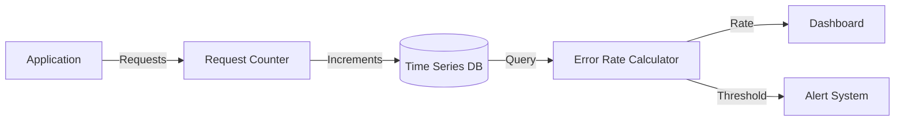
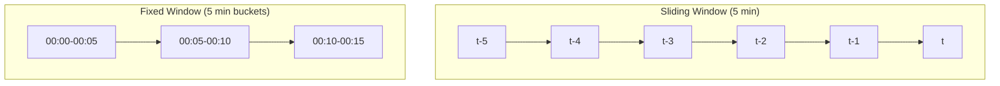
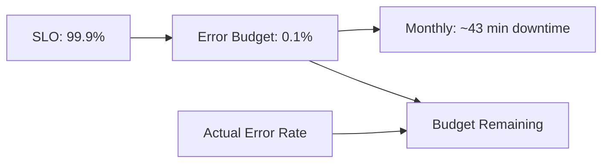

# How to Implement Error Rate Calculation

Author: [nawazdhandala](https://github.com/nawazdhandala)

Tags: Metrics, Error Rate, SRE, Monitoring

Description: Learn to implement error rate calculation for measuring service reliability.

---

Error rate is one of the four golden signals of monitoring. It tells you what percentage of requests are failing. A sudden spike means something broke. A gradual increase signals degradation. Without error rate tracking, you are flying blind.

This guide shows you how to implement error rate calculation from scratch. You will learn the math, see working code, and understand how to integrate error rate into your monitoring stack.

## What Error Rate Actually Measures

Error rate is the ratio of failed requests to total requests over a time window. The formula is straightforward.

```
Error Rate = (Failed Requests / Total Requests) * 100
```

A service handling 10,000 requests with 50 failures has an error rate of 0.5%. That number means different things for different services. A payment API at 0.5% error rate is a crisis. A log ingestion service at 0.5% might be acceptable.

The key insight is that error rate is always relative to your service level objectives. Define what acceptable looks like before you start measuring.

## The Data Flow

Before writing code, understand how error rate data flows through your system.



Your application increments counters on each request. The time series database stores those counts. The calculator queries recent data and computes the rate. Dashboards visualize trends. Alerts fire when thresholds are breached.

## Instrumenting Your Application

The first step is counting requests. You need two counters: total requests and failed requests. Here is how to instrument a Node.js Express application.

```javascript
// metrics.js
const { Counter, Registry } = require('prom-client');

// Create a dedicated registry for your metrics
const registry = new Registry();

// Counter for all HTTP requests
const httpRequestsTotal = new Counter({
  name: 'http_requests_total',
  help: 'Total number of HTTP requests',
  labelNames: ['method', 'path', 'status_code'],
  registers: [registry]
});

// Counter specifically for errors (5xx responses)
const httpErrorsTotal = new Counter({
  name: 'http_errors_total',
  help: 'Total number of HTTP errors',
  labelNames: ['method', 'path', 'error_type'],
  registers: [registry]
});

// Middleware to count all requests
function metricsMiddleware(req, res, next) {
  // Capture the original end function
  const originalEnd = res.end;

  res.end = function(...args) {
    // Increment total requests counter
    httpRequestsTotal.inc({
      method: req.method,
      path: req.route?.path || req.path,
      status_code: res.statusCode
    });

    // Increment error counter for 5xx responses
    if (res.statusCode >= 500) {
      httpErrorsTotal.inc({
        method: req.method,
        path: req.route?.path || req.path,
        error_type: 'server_error'
      });
    }

    return originalEnd.apply(this, args);
  };

  next();
}

module.exports = { registry, httpRequestsTotal, httpErrorsTotal, metricsMiddleware };
```

The middleware wraps the response to capture the final status code. It increments both counters appropriately. Labels like method and path let you slice error rates by endpoint later.

## Calculating Error Rate

With counters in place, you can calculate error rate. The calculation happens at query time, not at collection time. This gives you flexibility to compute rates over different time windows.

Here is a Python function that calculates error rate from Prometheus metrics.

```python
# error_rate.py
import requests
from datetime import datetime, timedelta

def calculate_error_rate(prometheus_url: str,
                         service: str,
                         window_minutes: int = 5) -> dict:
    """
    Calculate error rate for a service over a time window.

    Args:
        prometheus_url: Base URL of Prometheus server
        service: Name of the service to query
        window_minutes: Size of the time window in minutes

    Returns:
        Dictionary with error rate and request counts
    """

    # Query for error count (5xx responses) over the window
    error_query = f'''
        sum(increase(http_requests_total{{
            service="{service}",
            status_code=~"5.."
        }}[{window_minutes}m]))
    '''

    # Query for total request count over the window
    total_query = f'''
        sum(increase(http_requests_total{{
            service="{service}"
        }}[{window_minutes}m]))
    '''

    # Execute queries against Prometheus
    error_count = execute_query(prometheus_url, error_query)
    total_count = execute_query(prometheus_url, total_query)

    # Handle edge case of no traffic
    if total_count == 0:
        return {
            'error_rate': 0.0,
            'error_count': 0,
            'total_count': 0,
            'window_minutes': window_minutes,
            'status': 'no_traffic'
        }

    # Calculate the rate as a percentage
    error_rate = (error_count / total_count) * 100

    return {
        'error_rate': round(error_rate, 4),
        'error_count': int(error_count),
        'total_count': int(total_count),
        'window_minutes': window_minutes,
        'status': 'ok'
    }

def execute_query(prometheus_url: str, query: str) -> float:
    """Execute a PromQL query and return the scalar result."""
    response = requests.get(
        f"{prometheus_url}/api/v1/query",
        params={'query': query}
    )
    data = response.json()

    if data['status'] != 'success':
        raise Exception(f"Query failed: {data.get('error', 'unknown')}")

    # Extract the value from the result
    result = data['data']['result']
    if not result:
        return 0.0

    return float(result[0]['value'][1])
```

The `increase()` function in PromQL gives you the total count change over a time window. This handles counter resets from service restarts automatically.

## Sliding Window vs Fixed Window

Error rate calculations use either sliding windows or fixed windows. Each has tradeoffs.



**Sliding windows** move with the current time. They give smooth, continuous updates. A 5-minute sliding window always covers the last 5 minutes of data. Use sliding windows for real-time dashboards and alerting.

**Fixed windows** cover discrete time periods. They simplify aggregation and storage. Use fixed windows for historical reports and SLO calculations.

Most monitoring systems default to sliding windows for operational metrics. Use fixed windows when you need to compare specific time periods or generate reports.

## Setting Alert Thresholds

Raw error rate numbers need context. A 1% error rate that was 0.1% an hour ago is worth investigating. A steady 1% error rate might be normal for your service.

Here is how to set up error rate alerting with Prometheus alerting rules.

```yaml
# alert_rules.yaml
groups:
  - name: error_rate_alerts
    rules:
      # Alert when error rate exceeds absolute threshold
      - alert: HighErrorRate
        expr: |
          (
            sum(rate(http_requests_total{status_code=~"5.."}[5m]))
            /
            sum(rate(http_requests_total[5m]))
          ) * 100 > 1
        for: 5m
        labels:
          severity: warning
        annotations:
          summary: "High error rate detected"
          description: "Error rate is {{ $value | printf \"%.2f\" }}% over the last 5 minutes"

      # Alert on sudden increase compared to baseline
      - alert: ErrorRateSpike
        expr: |
          (
            sum(rate(http_requests_total{status_code=~"5.."}[5m]))
            /
            sum(rate(http_requests_total[5m]))
          )
          >
          (
            sum(rate(http_requests_total{status_code=~"5.."}[1h] offset 5m))
            /
            sum(rate(http_requests_total[1h] offset 5m))
          ) * 3
        for: 2m
        labels:
          severity: critical
        annotations:
          summary: "Error rate spike detected"
          description: "Error rate jumped 3x compared to the previous hour"
```

The first alert fires on an absolute threshold. The second alert detects relative spikes by comparing current rate to historical baseline. Both patterns are useful. Absolute thresholds catch sustained problems. Relative thresholds catch sudden changes.

## Breaking Down Error Rate by Dimension

Aggregate error rate hides important details. A 2% overall error rate might mean one endpoint is completely broken while others are fine. Always track error rate by relevant dimensions.

Common dimensions to track include endpoint, HTTP method, error type, user segment, and deployment version.

```python
# dimensional_error_rate.py
def calculate_error_rate_by_endpoint(prometheus_url: str,
                                      service: str,
                                      window_minutes: int = 5) -> list:
    """Calculate error rate broken down by endpoint."""

    query = f'''
        sum by (path) (
            rate(http_requests_total{{
                service="{service}",
                status_code=~"5.."
            }}[{window_minutes}m])
        )
        /
        sum by (path) (
            rate(http_requests_total{{
                service="{service}"
            }}[{window_minutes}m])
        ) * 100
    '''

    response = requests.get(
        f"{prometheus_url}/api/v1/query",
        params={'query': query}
    )

    data = response.json()
    results = []

    for item in data['data']['result']:
        results.append({
            'path': item['metric']['path'],
            'error_rate': round(float(item['value'][1]), 4)
        })

    # Sort by error rate descending to surface problems
    return sorted(results, key=lambda x: x['error_rate'], reverse=True)
```

This function returns error rates per endpoint, sorted with the worst offenders first. During an incident, this breakdown immediately tells you which endpoint needs attention.

## Connecting Error Rate to SLOs

Error rate feeds directly into service level objectives. An SLO like "99.9% of requests succeed" translates to an error rate target of 0.1% or less.

Track your error budget, which is the total errors allowed before violating your SLO.



If your SLO allows 0.1% errors over a 30-day period and you have already used 0.08%, you have 20% of your error budget remaining. This tells you whether you can ship risky changes or need to focus on reliability.

## What to Do Next

Start by instrumenting your critical services with request and error counters. Add labels for endpoint and error type. Set up a basic dashboard showing error rate over time. Create alerts for both absolute thresholds and relative spikes.

Once you have baseline data, define SLOs based on what your users actually need. Track error budget consumption. Use error rate trends to decide when to ship features versus when to pay down reliability debt.

Error rate is the foundation of reliability measurement. Get it right, and you have a clear signal for service health. Ignore it, and you will learn about problems from angry users instead of your monitoring system.
