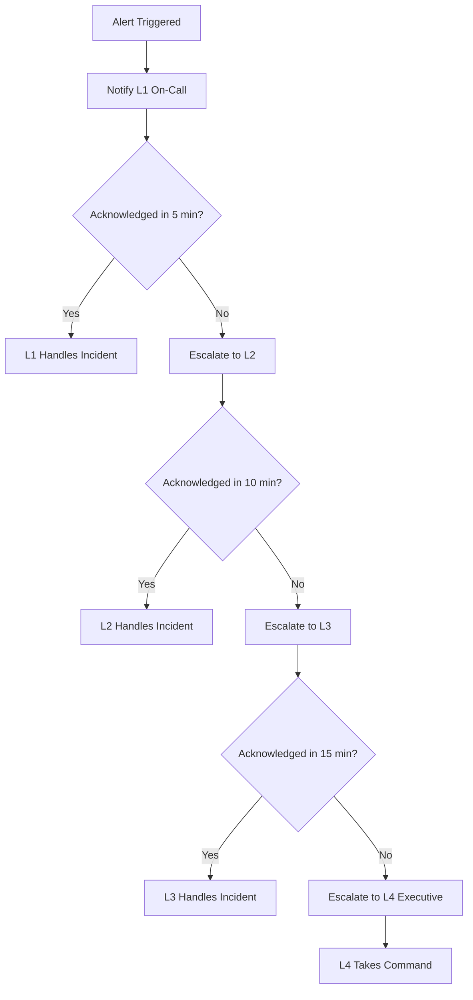
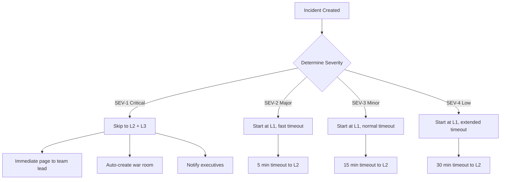
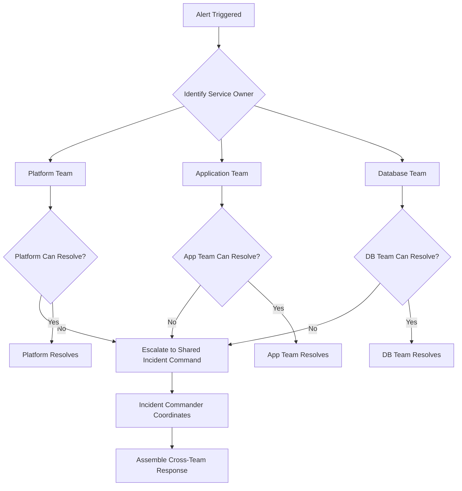
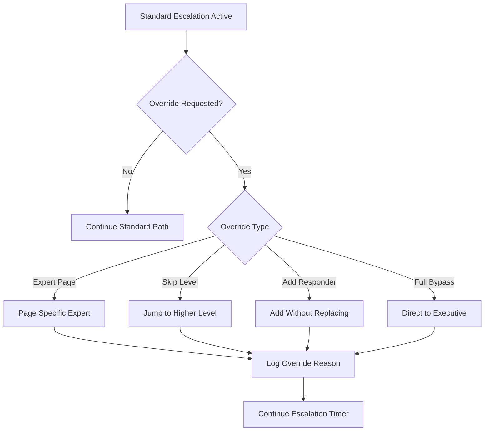

# How to Build Escalation Policies

Author: [nawazdhandala](https://github.com/nawazdhandala)

Tags: SRE, IncidentManagement, Escalation, OnCall

Description: A practical guide to designing escalation policies that route incidents to the right responders at the right time.

---

## What Is an Escalation Policy?

An escalation policy is a structured ruleset that determines who gets notified when an incident occurs, in what order, and under what conditions. It bridges the gap between automated alerting and human response, ensuring that critical issues reach someone who can act on them without delay.

Without a well-defined escalation policy, alerts either drown in noise or slip through unnoticed. With one, your team responds faster, reduces mean time to resolution (MTTR), and avoids burnout from constant firefighting.

---

## Defining Your Escalation Path

An escalation path is the ordered sequence of responders who receive alerts for an incident. Each level in the path represents a fallback if the previous responder does not acknowledge or resolve the issue.

### Core Components of an Escalation Path

1. **Level 1 (L1):** Primary on-call engineer. First to receive the alert.
2. **Level 2 (L2):** Secondary on-call or senior engineer. Engaged if L1 does not respond.
3. **Level 3 (L3):** Team lead or manager. Escalated for prolonged or high-severity incidents.
4. **Level 4 (L4):** Executive or incident commander. Reserved for business-critical outages.

### Example Escalation Path

```yaml
# escalation-policy.yaml
# Defines the order and timing of alert escalation

escalation_policy:
  name: "Production Services"
  description: "Primary escalation policy for production infrastructure"

  levels:
    - level: 1
      targets:
        - type: "on_call_schedule"
          schedule: "primary-oncall"
      timeout_minutes: 5  # Time before escalating to next level

    - level: 2
      targets:
        - type: "on_call_schedule"
          schedule: "secondary-oncall"
        - type: "user"
          email: "senior-sre@company.com"
      timeout_minutes: 10

    - level: 3
      targets:
        - type: "user"
          email: "team-lead@company.com"
        - type: "channel"
          slack: "#incident-response"
      timeout_minutes: 15

    - level: 4
      targets:
        - type: "user"
          email: "vp-engineering@company.com"
      timeout_minutes: 0  # Final level, no further escalation
```

---

## Time-Based Escalation

Time-based escalation automatically promotes an incident to the next level when a responder fails to acknowledge within a specified window. This prevents alerts from going stale.

### Time-Based Escalation Flow



### Implementation Example

```python
# escalation_timer.py
# Manages time-based escalation logic for incidents

import asyncio
from datetime import datetime, timedelta
from dataclasses import dataclass
from enum import Enum
from typing import Optional, Callable

class EscalationLevel(Enum):
    L1_PRIMARY = 1
    L2_SECONDARY = 2
    L3_TEAM_LEAD = 3
    L4_EXECUTIVE = 4

@dataclass
class EscalationRule:
    """Defines timeout and targets for each escalation level."""
    level: EscalationLevel
    timeout_minutes: int
    notify_targets: list[str]  # List of user IDs or schedule names

@dataclass
class Incident:
    """Represents an active incident being tracked."""
    id: str
    title: str
    severity: str
    created_at: datetime
    acknowledged_at: Optional[datetime] = None
    current_level: EscalationLevel = EscalationLevel.L1_PRIMARY

class EscalationManager:
    """Handles time-based escalation for incidents."""

    def __init__(self, notify_callback: Callable):
        # Callback function to send notifications
        self.notify = notify_callback

        # Define escalation rules with timeouts
        self.rules = [
            EscalationRule(
                level=EscalationLevel.L1_PRIMARY,
                timeout_minutes=5,
                notify_targets=["primary-oncall"]
            ),
            EscalationRule(
                level=EscalationLevel.L2_SECONDARY,
                timeout_minutes=10,
                notify_targets=["secondary-oncall", "senior-sre"]
            ),
            EscalationRule(
                level=EscalationLevel.L3_TEAM_LEAD,
                timeout_minutes=15,
                notify_targets=["team-lead", "incident-channel"]
            ),
            EscalationRule(
                level=EscalationLevel.L4_EXECUTIVE,
                timeout_minutes=0,  # Final level
                notify_targets=["vp-engineering"]
            ),
        ]

    async def start_escalation(self, incident: Incident) -> None:
        """Begin the escalation process for a new incident."""
        # Notify L1 immediately
        await self._notify_level(incident, self.rules[0])

        # Start the escalation timer loop
        await self._escalation_loop(incident)

    async def _escalation_loop(self, incident: Incident) -> None:
        """Loop through escalation levels until acknowledged."""
        for rule in self.rules:
            if incident.acknowledged_at:
                # Incident was acknowledged, stop escalating
                print(f"Incident {incident.id} acknowledged at {rule.level.name}")
                return

            if rule.timeout_minutes > 0:
                # Wait for the timeout period
                await asyncio.sleep(rule.timeout_minutes * 60)

            if not incident.acknowledged_at:
                # Still not acknowledged, escalate to next level
                incident.current_level = rule.level
                await self._notify_level(incident, rule)

        # Reached final level without acknowledgment
        print(f"Incident {incident.id} reached final escalation level")

    async def _notify_level(self, incident: Incident, rule: EscalationRule) -> None:
        """Send notifications to all targets at the current level."""
        for target in rule.notify_targets:
            await self.notify(
                target=target,
                incident_id=incident.id,
                title=incident.title,
                severity=incident.severity,
                escalation_level=rule.level.name
            )
```

---

## Severity-Based Escalation

Not all incidents are equal. Severity-based escalation adjusts the response based on the impact and urgency of the incident.

### Severity Definitions

| Severity | Description | Response Time | Example |
|----------|-------------|---------------|---------|
| **SEV-1** | Critical outage affecting all users | Immediate | Complete service down |
| **SEV-2** | Major degradation affecting many users | 15 minutes | Payment processing failing |
| **SEV-3** | Minor issue affecting some users | 1 hour | Slow response times |
| **SEV-4** | Low impact, no immediate user effect | 4 hours | Non-critical job failed |

### Severity-Based Escalation Flow



### Implementation Example

```python
# severity_escalation.py
# Routes incidents based on severity with different escalation paths

from dataclasses import dataclass
from enum import Enum
from typing import Optional

class Severity(Enum):
    SEV_1 = 1  # Critical
    SEV_2 = 2  # Major
    SEV_3 = 3  # Minor
    SEV_4 = 4  # Low

@dataclass
class SeverityConfig:
    """Configuration for each severity level."""
    severity: Severity
    initial_level: int           # Starting escalation level
    timeout_minutes: int         # Time before first escalation
    auto_create_war_room: bool   # Whether to create a war room
    notify_executives: bool      # Whether to page executives immediately

class SeverityRouter:
    """Routes incidents based on severity classification."""

    def __init__(self):
        # Define behavior for each severity level
        self.configs = {
            Severity.SEV_1: SeverityConfig(
                severity=Severity.SEV_1,
                initial_level=2,        # Skip L1, start at L2
                timeout_minutes=5,      # Fast escalation
                auto_create_war_room=True,
                notify_executives=True
            ),
            Severity.SEV_2: SeverityConfig(
                severity=Severity.SEV_2,
                initial_level=1,        # Start at L1
                timeout_minutes=5,      # Fast timeout
                auto_create_war_room=True,
                notify_executives=False
            ),
            Severity.SEV_3: SeverityConfig(
                severity=Severity.SEV_3,
                initial_level=1,
                timeout_minutes=15,     # Normal timeout
                auto_create_war_room=False,
                notify_executives=False
            ),
            Severity.SEV_4: SeverityConfig(
                severity=Severity.SEV_4,
                initial_level=1,
                timeout_minutes=30,     # Extended timeout
                auto_create_war_room=False,
                notify_executives=False
            ),
        }

    def get_escalation_config(self, severity: Severity) -> SeverityConfig:
        """Return the escalation configuration for a given severity."""
        return self.configs[severity]

    def classify_severity(self, incident_data: dict) -> Severity:
        """
        Classify incident severity based on impact metrics.

        Uses factors like:
        - Number of affected users
        - Revenue impact
        - Service criticality
        - Error rate percentage
        """
        affected_users = incident_data.get("affected_users", 0)
        error_rate = incident_data.get("error_rate", 0)
        is_critical_service = incident_data.get("is_critical_service", False)

        # SEV-1: Critical service down or massive user impact
        if is_critical_service and error_rate > 90:
            return Severity.SEV_1

        # SEV-2: Major degradation
        if affected_users > 1000 or error_rate > 50:
            return Severity.SEV_2

        # SEV-3: Minor issues
        if affected_users > 100 or error_rate > 10:
            return Severity.SEV_3

        # SEV-4: Low impact
        return Severity.SEV_4

# Example usage
def handle_new_incident(incident_data: dict) -> None:
    """Process a new incident and determine escalation path."""
    router = SeverityRouter()

    # Classify the incident severity
    severity = router.classify_severity(incident_data)
    config = router.get_escalation_config(severity)

    print(f"Incident classified as {severity.name}")
    print(f"Starting at escalation level: L{config.initial_level}")
    print(f"Timeout before escalation: {config.timeout_minutes} minutes")

    if config.auto_create_war_room:
        print("Creating war room channel...")

    if config.notify_executives:
        print("Notifying executive team...")
```

---

## Multi-Team Escalation Coordination

Large organizations often need to coordinate escalation across multiple teams. This requires clear ownership boundaries and handoff protocols.

### Multi-Team Escalation Flow



### Implementation Example

```python
# multi_team_escalation.py
# Coordinates escalation across multiple teams

from dataclasses import dataclass, field
from enum import Enum
from typing import Optional

class Team(Enum):
    PLATFORM = "platform"
    APPLICATION = "application"
    DATABASE = "database"
    SECURITY = "security"
    NETWORK = "network"

@dataclass
class TeamEscalationPolicy:
    """Escalation policy for a specific team."""
    team: Team
    primary_schedule: str
    secondary_schedule: str
    lead_user: str
    slack_channel: str

@dataclass
class ServiceOwnership:
    """Maps services to their owning teams."""
    service_name: str
    primary_team: Team
    supporting_teams: list[Team] = field(default_factory=list)

class MultiTeamCoordinator:
    """Coordinates escalation across multiple teams."""

    def __init__(self):
        # Define team escalation policies
        self.team_policies = {
            Team.PLATFORM: TeamEscalationPolicy(
                team=Team.PLATFORM,
                primary_schedule="platform-primary",
                secondary_schedule="platform-secondary",
                lead_user="platform-lead@company.com",
                slack_channel="#platform-incidents"
            ),
            Team.APPLICATION: TeamEscalationPolicy(
                team=Team.APPLICATION,
                primary_schedule="app-primary",
                secondary_schedule="app-secondary",
                lead_user="app-lead@company.com",
                slack_channel="#app-incidents"
            ),
            Team.DATABASE: TeamEscalationPolicy(
                team=Team.DATABASE,
                primary_schedule="db-primary",
                secondary_schedule="db-secondary",
                lead_user="db-lead@company.com",
                slack_channel="#db-incidents"
            ),
        }

        # Define service ownership mapping
        self.service_map = {
            "api-gateway": ServiceOwnership(
                service_name="api-gateway",
                primary_team=Team.PLATFORM,
                supporting_teams=[Team.NETWORK]
            ),
            "user-service": ServiceOwnership(
                service_name="user-service",
                primary_team=Team.APPLICATION,
                supporting_teams=[Team.DATABASE]
            ),
            "postgres-cluster": ServiceOwnership(
                service_name="postgres-cluster",
                primary_team=Team.DATABASE,
                supporting_teams=[Team.PLATFORM]
            ),
        }

    def route_incident(self, service_name: str) -> dict:
        """
        Determine which teams to notify for an incident.
        Returns the primary team policy and supporting team policies.
        """
        ownership = self.service_map.get(service_name)

        if not ownership:
            # Unknown service, route to platform team as default
            return {
                "primary": self.team_policies[Team.PLATFORM],
                "supporting": []
            }

        primary_policy = self.team_policies[ownership.primary_team]
        supporting_policies = [
            self.team_policies[team]
            for team in ownership.supporting_teams
        ]

        return {
            "primary": primary_policy,
            "supporting": supporting_policies
        }

    def initiate_cross_team_incident(
        self,
        incident_id: str,
        affected_services: list[str]
    ) -> dict:
        """
        Create a cross-team incident when multiple services are affected.
        Returns coordination details for incident command.
        """
        teams_involved = set()
        channels_to_notify = set()

        for service in affected_services:
            routing = self.route_incident(service)

            # Add primary team
            teams_involved.add(routing["primary"].team)
            channels_to_notify.add(routing["primary"].slack_channel)

            # Add supporting teams
            for policy in routing["supporting"]:
                teams_involved.add(policy.team)
                channels_to_notify.add(policy.slack_channel)

        return {
            "incident_id": incident_id,
            "teams_involved": list(teams_involved),
            "channels": list(channels_to_notify),
            "war_room": f"#incident-{incident_id}",
            "incident_commander_needed": len(teams_involved) > 1
        }
```

---

## Override and Bypass Procedures

Sometimes the standard escalation path needs to be bypassed. Override procedures allow for manual intervention while maintaining accountability.

### Override Scenarios

1. **Subject Matter Expert Required:** The on-call engineer knows a specific person has the expertise to resolve the issue faster.
2. **Availability Override:** The scheduled responder is unavailable (traveling, sick, in a meeting).
3. **Severity Reclassification:** The incident is more severe than initially classified.
4. **Executive Bypass:** Leadership needs to be informed immediately regardless of severity.

### Override Flow



### Implementation Example

```python
# escalation_override.py
# Handles manual overrides and bypasses in the escalation process

from dataclasses import dataclass
from datetime import datetime
from enum import Enum
from typing import Optional

class OverrideType(Enum):
    EXPERT_PAGE = "expert_page"       # Page a specific expert
    SKIP_LEVEL = "skip_level"         # Jump to a higher level
    ADD_RESPONDER = "add_responder"   # Add without replacing current
    FULL_BYPASS = "full_bypass"       # Direct executive notification
    AVAILABILITY = "availability"     # Responder unavailable

@dataclass
class OverrideRequest:
    """Records an override action for audit purposes."""
    incident_id: str
    override_type: OverrideType
    requested_by: str
    reason: str
    target_user: Optional[str] = None
    target_level: Optional[int] = None
    timestamp: datetime = None

    def __post_init__(self):
        if self.timestamp is None:
            self.timestamp = datetime.utcnow()

class EscalationOverrideManager:
    """Manages override and bypass procedures."""

    def __init__(self, notification_service, audit_log):
        self.notification_service = notification_service
        self.audit_log = audit_log

    async def request_override(
        self,
        override: OverrideRequest
    ) -> dict:
        """
        Process an override request.
        All overrides are logged for accountability.
        """
        # Log the override for audit trail
        await self.audit_log.record(
            event_type="escalation_override",
            incident_id=override.incident_id,
            details={
                "type": override.override_type.value,
                "requested_by": override.requested_by,
                "reason": override.reason,
                "target_user": override.target_user,
                "target_level": override.target_level
            }
        )

        # Execute the override based on type
        if override.override_type == OverrideType.EXPERT_PAGE:
            return await self._page_expert(override)

        elif override.override_type == OverrideType.SKIP_LEVEL:
            return await self._skip_to_level(override)

        elif override.override_type == OverrideType.ADD_RESPONDER:
            return await self._add_responder(override)

        elif override.override_type == OverrideType.FULL_BYPASS:
            return await self._executive_bypass(override)

        elif override.override_type == OverrideType.AVAILABILITY:
            return await self._handle_unavailable(override)

    async def _page_expert(self, override: OverrideRequest) -> dict:
        """Page a specific expert without changing the escalation level."""
        await self.notification_service.page_user(
            user=override.target_user,
            incident_id=override.incident_id,
            message=f"Expert page requested: {override.reason}",
            priority="high"
        )
        return {
            "status": "success",
            "action": "expert_paged",
            "user": override.target_user
        }

    async def _skip_to_level(self, override: OverrideRequest) -> dict:
        """Jump directly to a higher escalation level."""
        # Get targets for the requested level
        level_targets = self._get_level_targets(override.target_level)

        for target in level_targets:
            await self.notification_service.page_user(
                user=target,
                incident_id=override.incident_id,
                message=f"Escalation level skip: {override.reason}",
                priority="urgent"
            )

        return {
            "status": "success",
            "action": "level_skipped",
            "new_level": override.target_level
        }

    async def _add_responder(self, override: OverrideRequest) -> dict:
        """Add an additional responder without replacing current ones."""
        await self.notification_service.page_user(
            user=override.target_user,
            incident_id=override.incident_id,
            message=f"Added to incident: {override.reason}",
            priority="high"
        )
        return {
            "status": "success",
            "action": "responder_added",
            "user": override.target_user
        }

    async def _executive_bypass(self, override: OverrideRequest) -> dict:
        """Immediately notify executive leadership."""
        executives = ["cto@company.com", "vp-eng@company.com"]

        for exec_user in executives:
            await self.notification_service.page_user(
                user=exec_user,
                incident_id=override.incident_id,
                message=f"EXECUTIVE BYPASS: {override.reason}",
                priority="critical"
            )

        return {
            "status": "success",
            "action": "executive_bypass",
            "notified": executives
        }

    async def _handle_unavailable(self, override: OverrideRequest) -> dict:
        """Handle responder unavailability by moving to next in line."""
        # Find next available responder in the rotation
        next_responder = await self._find_next_available(
            incident_id=override.incident_id,
            unavailable_user=override.target_user
        )

        await self.notification_service.page_user(
            user=next_responder,
            incident_id=override.incident_id,
            message=f"Reassigned: {override.target_user} unavailable",
            priority="high"
        )

        return {
            "status": "success",
            "action": "responder_reassigned",
            "from_user": override.target_user,
            "to_user": next_responder
        }

    def _get_level_targets(self, level: int) -> list[str]:
        """Get notification targets for a specific escalation level."""
        # This would typically query the escalation policy configuration
        level_mapping = {
            2: ["secondary-oncall", "senior-sre@company.com"],
            3: ["team-lead@company.com"],
            4: ["vp-engineering@company.com"]
        }
        return level_mapping.get(level, [])

    async def _find_next_available(
        self,
        incident_id: str,
        unavailable_user: str
    ) -> str:
        """Find the next available responder in the rotation."""
        # This would query the on-call schedule service
        # For example purposes, returning a placeholder
        return "backup-oncall@company.com"
```

---

## Complete Escalation Policy Configuration

Here is a comprehensive configuration that ties together all the concepts discussed.

```yaml
# complete-escalation-policy.yaml
# Full escalation policy configuration for production services

metadata:
  name: "production-critical"
  version: "2.0"
  description: "Escalation policy for production critical services"
  owner: "sre-team"

# Severity definitions and their escalation behavior
severity_rules:
  sev_1:
    initial_level: 2
    timeout_minutes: 5
    auto_war_room: true
    notify_executives: true
    channels: ["#incident-sev1", "#executive-alerts"]

  sev_2:
    initial_level: 1
    timeout_minutes: 5
    auto_war_room: true
    notify_executives: false
    channels: ["#incident-response"]

  sev_3:
    initial_level: 1
    timeout_minutes: 15
    auto_war_room: false
    notify_executives: false
    channels: ["#alerts"]

  sev_4:
    initial_level: 1
    timeout_minutes: 30
    auto_war_room: false
    notify_executives: false
    channels: ["#alerts-low"]

# Escalation levels with targets and timeouts
escalation_levels:
  - level: 1
    name: "Primary On-Call"
    targets:
      - type: "schedule"
        id: "primary-oncall"
      - type: "channel"
        id: "#alerts"
    notification_methods: ["push", "sms"]
    timeout_minutes: 5
    repeat_count: 2  # Retry twice before escalating

  - level: 2
    name: "Secondary and Senior"
    targets:
      - type: "schedule"
        id: "secondary-oncall"
      - type: "user"
        id: "senior-sre@company.com"
    notification_methods: ["push", "sms", "phone"]
    timeout_minutes: 10
    repeat_count: 2

  - level: 3
    name: "Team Leadership"
    targets:
      - type: "user"
        id: "team-lead@company.com"
      - type: "user"
        id: "eng-manager@company.com"
      - type: "channel"
        id: "#leadership-alerts"
    notification_methods: ["push", "sms", "phone"]
    timeout_minutes: 15
    repeat_count: 3

  - level: 4
    name: "Executive"
    targets:
      - type: "user"
        id: "vp-engineering@company.com"
      - type: "user"
        id: "cto@company.com"
    notification_methods: ["push", "sms", "phone"]
    timeout_minutes: 0  # Final level
    repeat_count: 5

# Override permissions
override_rules:
  expert_page:
    allowed_roles: ["on-call", "team-lead", "manager"]
    requires_reason: true

  skip_level:
    allowed_roles: ["team-lead", "manager", "incident-commander"]
    requires_reason: true
    max_skip: 2  # Can skip at most 2 levels

  full_bypass:
    allowed_roles: ["incident-commander", "director", "executive"]
    requires_reason: true
    audit_alert: true  # Send alert to security team

# Business hours adjustments
time_based_rules:
  business_hours:
    start: "09:00"
    end: "18:00"
    timezone: "America/New_York"

  after_hours:
    # Extend timeouts after hours to reduce false escalations
    timeout_multiplier: 1.5

  weekends:
    # Different escalation path on weekends
    skip_level_3: true  # Go directly from L2 to L4

# Integration hooks
integrations:
  slack:
    enabled: true
    war_room_prefix: "incident-"

  pagerduty:
    enabled: true
    service_id: "PXXXXXX"

  oneuptime:
    enabled: true
    project_id: "prod-critical"
```

---

## Best Practices Summary

1. **Define clear ownership.** Every service should have an explicit owner and escalation path.

2. **Set appropriate timeouts.** Too short causes alert fatigue; too long delays response.

3. **Match severity to impact.** Ensure your severity definitions align with actual business impact.

4. **Document override procedures.** Make it easy to bypass the standard path when needed, but always log the reason.

5. **Review and iterate.** Analyze escalation metrics monthly. Adjust timeouts and paths based on actual response patterns.

6. **Test your policies.** Run regular drills to ensure escalation paths work as expected before a real incident occurs.

7. **Keep contact information current.** Stale phone numbers or email addresses break escalation chains.

8. **Integrate with your tooling.** Connect your escalation policies to monitoring (OneUptime), communication (Slack), and ticketing systems for seamless response.

---

## Conclusion

Escalation policies are the backbone of effective incident response. They ensure that alerts reach the right people at the right time, prevent incidents from slipping through the cracks, and provide a clear structure for handling emergencies.

Start with a simple policy that matches your team size and service criticality. As your organization grows, layer in severity-based routing, multi-team coordination, and override procedures. The goal is not to build the most complex system, but to build one that reliably connects incidents to responders who can resolve them.
