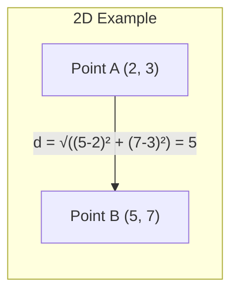
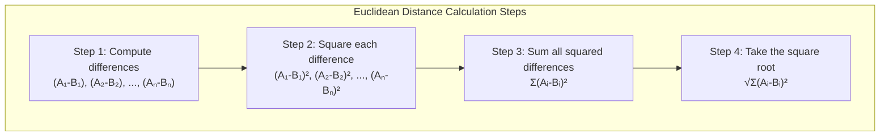
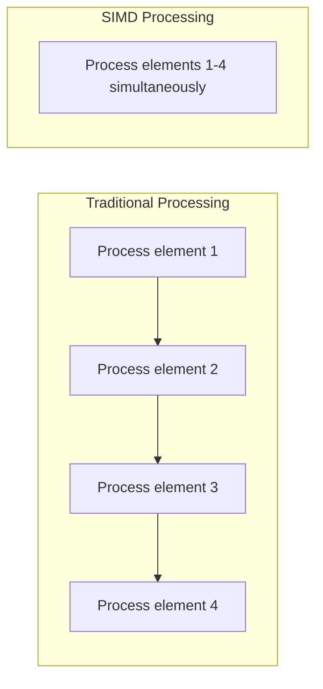
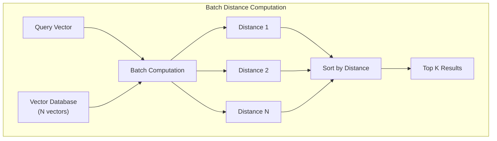
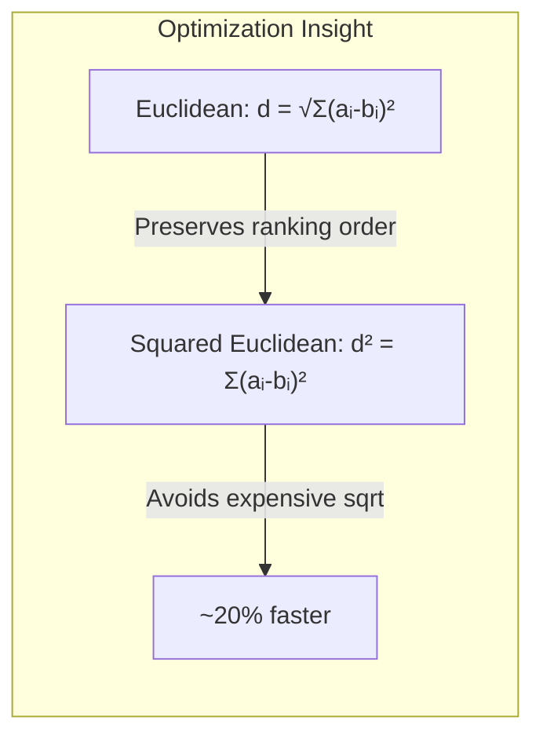
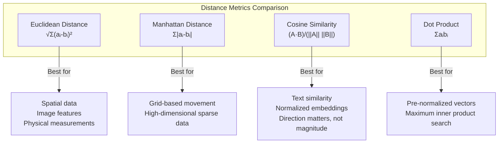

# How to Create Euclidean Distance

Author: [nawazdhandala](https://github.com/nawazdhandala)

Tags: Vector Search, Distance Metrics, Machine Learning, Embeddings

Description: Learn to implement Euclidean distance for vector similarity with SIMD optimization, batch computation, and use case selection for spatial similarity search.

---

## Introduction

Euclidean distance is one of the most intuitive and widely used distance metrics for measuring similarity between vectors. Named after the ancient Greek mathematician Euclid, this metric calculates the straight-line distance between two points in multi-dimensional space. In the context of vector similarity search, Euclidean distance helps determine how "close" two data points are - the smaller the distance, the more similar the vectors.

This post will guide you through the mathematical foundations, practical implementations, optimization techniques, and real-world applications of Euclidean distance for vector similarity.

## Mathematical Foundation

### The Formula

Euclidean distance between two n-dimensional vectors A and B is calculated as:

$$d(A, B) = \sqrt{\sum_{i=1}^{n} (A_i - B_i)^2}$$

Where:
- A = (A₁, A₂, ..., Aₙ) is the first vector
- B = (B₁, B₂, ..., Bₙ) is the second vector
- n is the number of dimensions

### Visual Representation



### Geometric Intuition

In two dimensions, Euclidean distance is simply the length of the line segment connecting two points - what you would measure with a ruler. This concept extends naturally to higher dimensions used in machine learning and embeddings.



## Basic Implementation

Let us start with a straightforward implementation in Python:

```python
import math
from typing import List

def euclidean_distance(vector_a: List[float], vector_b: List[float]) -> float:
    """
    Calculate the Euclidean distance between two vectors.

    Args:
        vector_a: First vector as a list of floats
        vector_b: Second vector as a list of floats

    Returns:
        The Euclidean distance between the two vectors

    Raises:
        ValueError: If vectors have different dimensions
    """
    if len(vector_a) != len(vector_b):
        raise ValueError("Vectors must have the same dimensions")

    squared_sum = 0.0
    for a, b in zip(vector_a, vector_b):
        diff = a - b
        squared_sum += diff * diff

    return math.sqrt(squared_sum)


# Example usage
vector1 = [1.0, 2.0, 3.0]
vector2 = [4.0, 5.0, 6.0]

distance = euclidean_distance(vector1, vector2)
print(f"Distance: {distance}")  # Output: Distance: 5.196152422706632
```

### Using NumPy for Better Performance

NumPy provides optimized array operations that significantly improve performance:

```python
import numpy as np

def euclidean_distance_numpy(vector_a: np.ndarray, vector_b: np.ndarray) -> float:
    """
    Calculate Euclidean distance using NumPy.

    This implementation leverages NumPy's vectorized operations
    for better performance on large vectors.
    """
    diff = vector_a - vector_b
    return np.sqrt(np.dot(diff, diff))


# Alternative using NumPy's built-in function
def euclidean_distance_linalg(vector_a: np.ndarray, vector_b: np.ndarray) -> float:
    """Calculate Euclidean distance using NumPy's linear algebra module."""
    return np.linalg.norm(vector_a - vector_b)


# Example usage
v1 = np.array([1.0, 2.0, 3.0])
v2 = np.array([4.0, 5.0, 6.0])

print(f"Using dot product: {euclidean_distance_numpy(v1, v2)}")
print(f"Using linalg.norm: {euclidean_distance_linalg(v1, v2)}")
```

## SIMD Optimization

Single Instruction, Multiple Data (SIMD) allows processing multiple data points in a single CPU instruction. This is crucial for high-performance vector similarity computations.



### Python Implementation with NumPy SIMD

NumPy automatically uses SIMD instructions when available:

```python
import numpy as np

def euclidean_distance_simd_optimized(
    vector_a: np.ndarray,
    vector_b: np.ndarray
) -> float:
    """
    SIMD-optimized Euclidean distance.

    NumPy operations are implemented in C and automatically
    utilize SIMD instructions (SSE, AVX) when available.

    For best performance:
    - Use contiguous arrays (C-order)
    - Ensure proper memory alignment
    - Use float32 for wider SIMD lanes
    """
    # Ensure contiguous memory layout for optimal SIMD
    a = np.ascontiguousarray(vector_a, dtype=np.float32)
    b = np.ascontiguousarray(vector_b, dtype=np.float32)

    diff = a - b
    return float(np.sqrt(np.dot(diff, diff)))


# For even better SIMD utilization, use einsum
def euclidean_distance_einsum(vector_a: np.ndarray, vector_b: np.ndarray) -> float:
    """Euclidean distance using Einstein summation convention."""
    diff = vector_a - vector_b
    return np.sqrt(np.einsum('i,i->', diff, diff))
```

### Rust Implementation with Explicit SIMD

For maximum control over SIMD operations:

```rust
use std::arch::x86_64::*;

/// Calculate Euclidean distance using AVX2 SIMD instructions
///
/// # Safety
/// This function requires AVX2 support on the CPU
#[target_feature(enable = "avx2")]
unsafe fn euclidean_distance_avx2(a: &[f32], b: &[f32]) -> f32 {
    assert_eq!(a.len(), b.len());

    let mut sum = _mm256_setzero_ps();
    let chunks = a.len() / 8;

    for i in 0..chunks {
        let offset = i * 8;

        // Load 8 floats at a time
        let va = _mm256_loadu_ps(a.as_ptr().add(offset));
        let vb = _mm256_loadu_ps(b.as_ptr().add(offset));

        // Compute difference
        let diff = _mm256_sub_ps(va, vb);

        // Square and accumulate
        sum = _mm256_fmadd_ps(diff, diff, sum);
    }

    // Horizontal sum of the 8 floats
    let sum_array: [f32; 8] = std::mem::transmute(sum);
    let mut total: f32 = sum_array.iter().sum();

    // Handle remaining elements
    for i in (chunks * 8)..a.len() {
        let diff = a[i] - b[i];
        total += diff * diff;
    }

    total.sqrt()
}
```

## Batch Processing

When computing distances between many vectors, batch processing provides significant performance improvements.



### Batch Implementation

```python
import numpy as np
from typing import Tuple

class EuclideanDistanceBatch:
    """
    Efficient batch computation of Euclidean distances.

    Optimized for computing distances between a query vector
    and a large database of vectors.
    """

    def __init__(self, vectors: np.ndarray):
        """
        Initialize with a database of vectors.

        Args:
            vectors: 2D array of shape (n_vectors, dimensions)
        """
        self.vectors = np.ascontiguousarray(vectors, dtype=np.float32)
        # Precompute squared norms for optimization
        self.squared_norms = np.einsum('ij,ij->i', self.vectors, self.vectors)

    def compute_distances(self, query: np.ndarray) -> np.ndarray:
        """
        Compute distances from query to all database vectors.

        Uses the identity: ||a-b||² = ||a||² + ||b||² - 2*a·b
        This allows using optimized matrix multiplication.

        Args:
            query: 1D query vector

        Returns:
            Array of distances to each database vector
        """
        query = np.ascontiguousarray(query, dtype=np.float32)
        query_norm_sq = np.dot(query, query)

        # Compute dot products with all vectors at once
        dot_products = self.vectors @ query

        # Apply the identity
        squared_distances = (
            self.squared_norms + query_norm_sq - 2 * dot_products
        )

        # Handle numerical precision issues
        squared_distances = np.maximum(squared_distances, 0)

        return np.sqrt(squared_distances)

    def find_nearest(
        self,
        query: np.ndarray,
        k: int = 10
    ) -> Tuple[np.ndarray, np.ndarray]:
        """
        Find the k nearest neighbors to the query.

        Args:
            query: Query vector
            k: Number of nearest neighbors to return

        Returns:
            Tuple of (indices, distances) for the k nearest neighbors
        """
        distances = self.compute_distances(query)

        # Use argpartition for O(n) selection of top k
        if k < len(distances):
            indices = np.argpartition(distances, k)[:k]
            # Sort the top k by distance
            sorted_order = np.argsort(distances[indices])
            indices = indices[sorted_order]
        else:
            indices = np.argsort(distances)

        return indices, distances[indices]


# Example usage
np.random.seed(42)
database = np.random.randn(10000, 128).astype(np.float32)
query = np.random.randn(128).astype(np.float32)

batch_calculator = EuclideanDistanceBatch(database)
indices, distances = batch_calculator.find_nearest(query, k=5)

print("Top 5 nearest neighbors:")
for i, (idx, dist) in enumerate(zip(indices, distances)):
    print(f"  {i+1}. Index {idx}, Distance: {dist:.4f}")
```

### Multi-Query Batch Processing

```python
def batch_pairwise_distances(
    queries: np.ndarray,
    database: np.ndarray
) -> np.ndarray:
    """
    Compute pairwise distances between query set and database.

    Args:
        queries: Shape (n_queries, dimensions)
        database: Shape (n_database, dimensions)

    Returns:
        Distance matrix of shape (n_queries, n_database)
    """
    # Compute squared norms
    queries_sq = np.einsum('ij,ij->i', queries, queries)[:, np.newaxis]
    database_sq = np.einsum('ij,ij->i', database, database)[np.newaxis, :]

    # Compute cross terms using matrix multiplication
    cross_term = queries @ database.T

    # Combine using the identity
    squared_distances = queries_sq + database_sq - 2 * cross_term
    squared_distances = np.maximum(squared_distances, 0)

    return np.sqrt(squared_distances)
```

## Squared Euclidean Distance Optimization

For many applications, especially ranking and nearest neighbor search, you can skip the square root operation entirely:



```python
def squared_euclidean_distance(
    vector_a: np.ndarray,
    vector_b: np.ndarray
) -> float:
    """
    Compute squared Euclidean distance.

    Use this when you only need to compare or rank distances,
    as it avoids the expensive square root operation.

    Note: d²(A,B) < d²(A,C) implies d(A,B) < d(A,C)
    """
    diff = vector_a - vector_b
    return np.dot(diff, diff)


# For nearest neighbor search, squared distance preserves ranking
def find_nearest_optimized(
    query: np.ndarray,
    database: np.ndarray,
    k: int
) -> np.ndarray:
    """Find k nearest neighbors using squared distance for speed."""
    # Compute squared distances (no sqrt needed for ranking)
    diff = database - query
    squared_distances = np.einsum('ij,ij->i', diff, diff)

    # Find k smallest
    return np.argpartition(squared_distances, k)[:k]
```

## Comparison with Other Distance Metrics

Understanding when to use Euclidean distance versus other metrics is crucial for optimal results.



### Comparison Implementation

```python
import numpy as np
from typing import Dict

def compare_distance_metrics(
    vector_a: np.ndarray,
    vector_b: np.ndarray
) -> Dict[str, float]:
    """
    Compare different distance and similarity metrics.

    Args:
        vector_a: First vector
        vector_b: Second vector

    Returns:
        Dictionary with metric names and their values
    """
    results = {}

    # Euclidean distance
    diff = vector_a - vector_b
    results['euclidean'] = np.sqrt(np.dot(diff, diff))

    # Manhattan distance (L1)
    results['manhattan'] = np.sum(np.abs(diff))

    # Cosine similarity
    norm_a = np.linalg.norm(vector_a)
    norm_b = np.linalg.norm(vector_b)
    results['cosine_similarity'] = np.dot(vector_a, vector_b) / (norm_a * norm_b)

    # Cosine distance (1 - similarity)
    results['cosine_distance'] = 1 - results['cosine_similarity']

    # Dot product
    results['dot_product'] = np.dot(vector_a, vector_b)

    # Chebyshev distance (L-infinity)
    results['chebyshev'] = np.max(np.abs(diff))

    return results


# Example comparison
v1 = np.array([1.0, 2.0, 3.0, 4.0])
v2 = np.array([2.0, 3.0, 4.0, 5.0])

metrics = compare_distance_metrics(v1, v2)
print("Distance Metrics Comparison:")
for metric, value in metrics.items():
    print(f"  {metric}: {value:.4f}")
```

### When to Use Each Metric

| Metric | Use Case | Properties |
|--------|----------|------------|
| Euclidean | Image similarity, spatial data, physical distances | Scale-sensitive, intuitive geometry |
| Manhattan | Grid navigation, sparse high-dimensional data | Robust to outliers, axis-aligned |
| Cosine | Text embeddings, document similarity | Scale-invariant, measures angle |
| Dot Product | Recommendation systems, pre-normalized vectors | Fast computation, unbounded |

## Real-World Application: Image Similarity Search

```python
import numpy as np
from typing import List, Tuple

class ImageSimilaritySearch:
    """
    Image similarity search using Euclidean distance on feature vectors.

    This example demonstrates a practical application where images
    are represented as feature vectors extracted from a neural network.
    """

    def __init__(self, feature_dim: int = 512):
        self.feature_dim = feature_dim
        self.features: List[np.ndarray] = []
        self.image_ids: List[str] = []

    def add_image(self, image_id: str, features: np.ndarray) -> None:
        """Add an image's feature vector to the index."""
        if features.shape[0] != self.feature_dim:
            raise ValueError(f"Expected {self.feature_dim} dimensions")

        self.features.append(features.astype(np.float32))
        self.image_ids.append(image_id)

    def build_index(self) -> None:
        """Build optimized index for fast searching."""
        self.feature_matrix = np.vstack(self.features)
        # Precompute norms for optimized distance calculation
        self.norms_squared = np.einsum(
            'ij,ij->i',
            self.feature_matrix,
            self.feature_matrix
        )

    def search(
        self,
        query_features: np.ndarray,
        k: int = 10
    ) -> List[Tuple[str, float]]:
        """
        Find k most similar images to the query.

        Args:
            query_features: Feature vector of the query image
            k: Number of results to return

        Returns:
            List of (image_id, distance) tuples, sorted by similarity
        """
        query = query_features.astype(np.float32)
        query_norm_sq = np.dot(query, query)

        # Compute all distances efficiently
        dot_products = self.feature_matrix @ query
        squared_distances = (
            self.norms_squared + query_norm_sq - 2 * dot_products
        )
        squared_distances = np.maximum(squared_distances, 0)
        distances = np.sqrt(squared_distances)

        # Get top k
        top_indices = np.argpartition(distances, k)[:k]
        top_indices = top_indices[np.argsort(distances[top_indices])]

        return [
            (self.image_ids[i], float(distances[i]))
            for i in top_indices
        ]


# Example usage
search_engine = ImageSimilaritySearch(feature_dim=512)

# Simulate adding images with random feature vectors
np.random.seed(42)
for i in range(1000):
    features = np.random.randn(512)
    search_engine.add_image(f"image_{i:04d}", features)

search_engine.build_index()

# Search for similar images
query = np.random.randn(512)
results = search_engine.search(query, k=5)

print("Similar images found:")
for image_id, distance in results:
    print(f"  {image_id}: distance = {distance:.4f}")
```

## Performance Benchmarks

```python
import numpy as np
import time
from typing import Callable, Dict

def benchmark_distance_functions(
    dimensions: int = 512,
    n_iterations: int = 10000
) -> Dict[str, float]:
    """Benchmark different Euclidean distance implementations."""

    results = {}

    # Generate test vectors
    np.random.seed(42)
    v1 = np.random.randn(dimensions).astype(np.float32)
    v2 = np.random.randn(dimensions).astype(np.float32)

    # Implementation 1: Pure Python
    def python_euclidean(a, b):
        total = 0.0
        for i in range(len(a)):
            diff = a[i] - b[i]
            total += diff * diff
        return total ** 0.5

    # Implementation 2: NumPy basic
    def numpy_basic(a, b):
        return np.sqrt(np.sum((a - b) ** 2))

    # Implementation 3: NumPy optimized
    def numpy_optimized(a, b):
        diff = a - b
        return np.sqrt(np.dot(diff, diff))

    # Implementation 4: NumPy linalg
    def numpy_linalg(a, b):
        return np.linalg.norm(a - b)

    implementations = {
        'pure_python': (python_euclidean, list(v1), list(v2)),
        'numpy_basic': (numpy_basic, v1, v2),
        'numpy_optimized': (numpy_optimized, v1, v2),
        'numpy_linalg': (numpy_linalg, v1, v2),
    }

    for name, (func, a, b) in implementations.items():
        start = time.perf_counter()
        for _ in range(n_iterations):
            _ = func(a, b)
        elapsed = time.perf_counter() - start
        results[name] = elapsed / n_iterations * 1e6  # microseconds

    return results


# Run benchmark
benchmark_results = benchmark_distance_functions()
print("Performance (microseconds per call):")
for impl, time_us in sorted(benchmark_results.items(), key=lambda x: x[1]):
    print(f"  {impl}: {time_us:.2f} us")
```

## Handling Edge Cases

```python
import numpy as np
from typing import Optional

def safe_euclidean_distance(
    vector_a: np.ndarray,
    vector_b: np.ndarray,
    epsilon: float = 1e-10
) -> Optional[float]:
    """
    Compute Euclidean distance with comprehensive error handling.

    Args:
        vector_a: First vector
        vector_b: Second vector
        epsilon: Small value to handle numerical precision

    Returns:
        Distance or None if computation fails
    """
    # Check for None inputs
    if vector_a is None or vector_b is None:
        return None

    # Convert to numpy arrays
    a = np.asarray(vector_a, dtype=np.float64)
    b = np.asarray(vector_b, dtype=np.float64)

    # Check dimensions match
    if a.shape != b.shape:
        raise ValueError(
            f"Dimension mismatch: {a.shape} vs {b.shape}"
        )

    # Check for NaN or Inf values
    if np.any(np.isnan(a)) or np.any(np.isnan(b)):
        return float('nan')

    if np.any(np.isinf(a)) or np.any(np.isinf(b)):
        return float('inf')

    # Compute distance
    diff = a - b
    squared_sum = np.dot(diff, diff)

    # Handle numerical precision
    if squared_sum < epsilon:
        return 0.0

    return float(np.sqrt(squared_sum))
```

## Conclusion

Euclidean distance is a fundamental tool for vector similarity search, offering intuitive geometric interpretation and efficient computation. Key takeaways from this guide:

1. **Mathematical Foundation**: Euclidean distance measures straight-line distance in n-dimensional space, making it ideal for spatial similarity tasks.

2. **Implementation Options**: From pure Python for clarity to NumPy for performance, choose the implementation that fits your needs.

3. **SIMD Optimization**: Leverage vectorized operations through NumPy or explicit SIMD instructions for maximum throughput.

4. **Batch Processing**: When dealing with large datasets, batch computation using matrix operations provides significant speedups.

5. **Squared Distance Optimization**: Skip the square root when only ranking matters - it preserves order and saves computation.

6. **Metric Selection**: Euclidean distance works best for:
   - Image and video feature similarity
   - Spatial and geographic data
   - Dense embeddings with meaningful magnitude
   - Physical measurement comparisons

For text embeddings or scenarios where direction matters more than magnitude, consider cosine similarity instead. The choice of distance metric should align with your data characteristics and application requirements.

## Further Reading

- Introduction to Information Retrieval - Manning, Raghavan, Schutze
- Mining of Massive Datasets - Leskovec, Rajaraman, Ullman
- NumPy documentation on linear algebra operations
- FAISS library for production-scale similarity search
