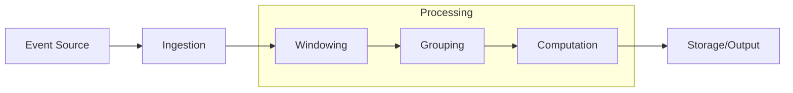
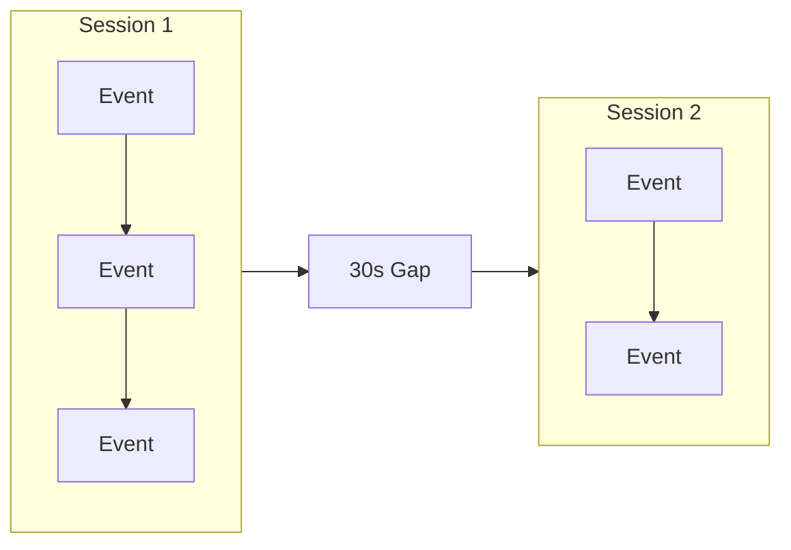
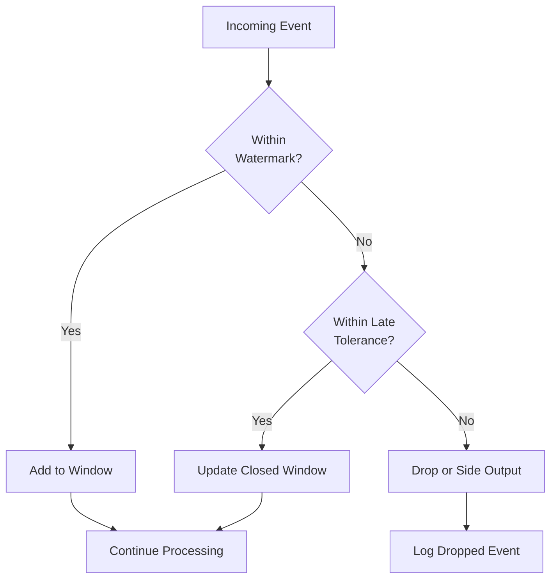
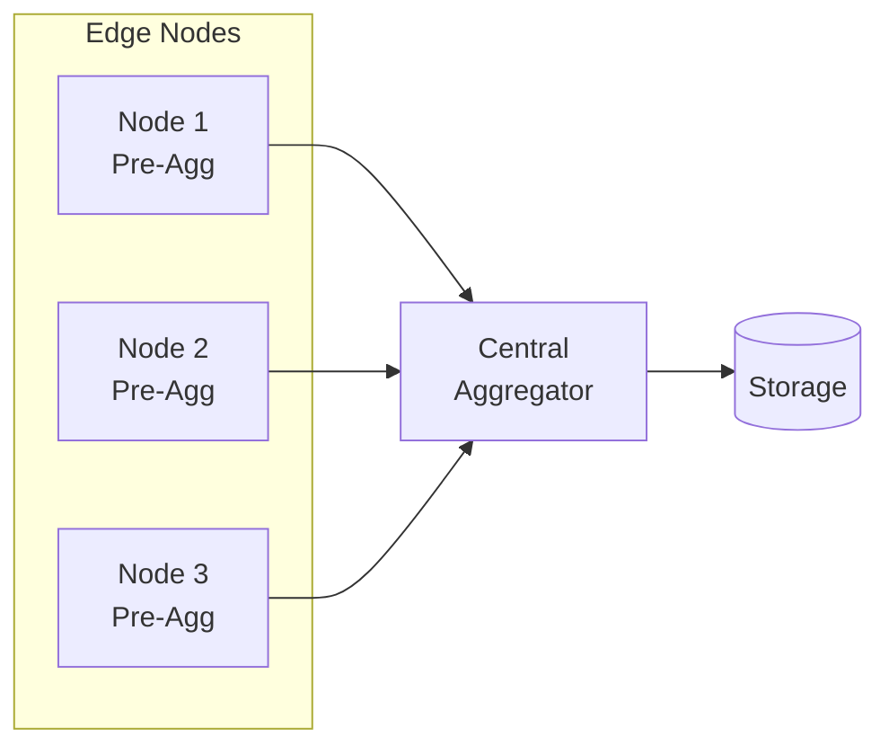
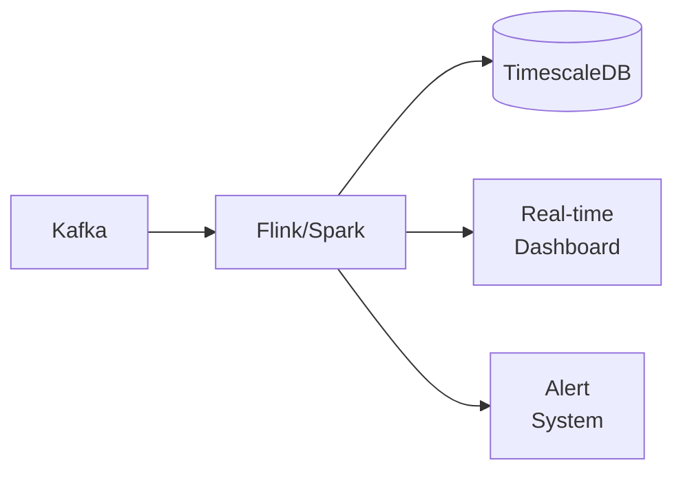

# How to Create Event Aggregation

Author: [nawazdhandala](https://github.com/nawazdhandala)

Tags: Event-Driven, Aggregation, Streaming, Analytics

Description: Learn to create event aggregation patterns for summarizing and combining event streams into meaningful insights.

---

Raw events are noisy. Thousands of clicks, transactions, or sensor readings per second tell you very little on their own. Event aggregation transforms this chaos into actionable summaries - counts, averages, rates, and percentiles computed over time windows.

This guide walks through core aggregation patterns, windowing strategies, and practical implementations you can deploy in production systems.

---

## Why Aggregate Events?

Individual events answer "what happened?" Aggregates answer "what matters?"

| Raw Events | Aggregated Data |
|------------|-----------------|
| 50,000 page view events | 8,333 views/minute average |
| 12,847 purchase transactions | $127.43 average order value |
| 3.2M API calls | 99.2% success rate |
| 847 login attempts | 12 failed logins from suspicious IPs |

Aggregation reduces storage costs, speeds up queries, and surfaces patterns that individual events hide.

---

## Core Aggregation Operations

The building blocks of event aggregation are straightforward mathematical operations applied to grouped events.

| Operation | Use Case | Example |
|-----------|----------|---------|
| COUNT | Volume tracking | Requests per second |
| SUM | Total accumulation | Revenue per hour |
| AVG | Central tendency | Average response time |
| MIN/MAX | Boundary detection | Peak memory usage |
| PERCENTILE | Distribution analysis | p99 latency |
| DISTINCT | Cardinality measurement | Unique users |

---

## The Aggregation Pipeline

Event aggregation flows through a predictable pipeline. Understanding each stage helps you design systems that scale.



Events arrive continuously, get assigned to time windows, group by dimensions (like user_id or region), compute aggregates, and emit results.

---

## Windowing Strategies

Windows define the time boundaries for aggregation. Choose based on your latency requirements and data characteristics.

### Tumbling Windows

Non-overlapping, fixed-size windows. Each event belongs to exactly one window.

```mermaid
gantt
    title Tumbling Windows (5-minute)
    dateFormat HH:mm
    axisFormat %H:%M

    section Windows
    Window 1    :w1, 00:00, 5m
    Window 2    :w2, 00:05, 5m
    Window 3    :w3, 00:10, 5m
```



Best for periodic reporting where you need clean boundaries - hourly summaries, daily totals, minute-by-minute metrics.

### Sliding Windows

Overlapping windows that move with each event or fixed interval. The same event can appear in multiple windows.

```mermaid
gantt
    title Sliding Windows (5min size, 1min slide)
    dateFormat HH:mm
    axisFormat %H:%M

    section Windows
    Window 1    :w1, 00:00, 5m
    Window 2    :w2, 00:01, 5m
    Window 3    :w3, 00:02, 5m
```



Best for smoothing out spikes and detecting trends - moving averages, rate limiting, anomaly detection.

### Session Windows

Dynamic windows that group events by activity periods with configurable gaps.



Best for user behavior analysis - session duration, actions per visit, conversion funnels.

---

## Implementation: In-Memory Aggregator

This TypeScript implementation shows a basic tumbling window aggregator. It buffers events, computes aggregates when windows close, and handles late arrivals within a tolerance period.

```typescript
// Define the structure for incoming events
interface Event {
  timestamp: number;      // Unix timestamp in milliseconds
  dimensions: {           // Grouping keys for the aggregate
    [key: string]: string;
  };
  value: number;          // The numeric value to aggregate
}

// Aggregated result emitted when a window closes
interface AggregateResult {
  windowStart: number;
  windowEnd: number;
  dimensions: { [key: string]: string };
  count: number;
  sum: number;
  min: number;
  max: number;
  avg: number;
}

class TumblingWindowAggregator {
  private windowSizeMs: number;
  private lateArrivalToleranceMs: number;
  // Nested map: windowKey -> dimensionKey -> accumulated values
  private windows: Map<string, Map<string, {
    count: number;
    sum: number;
    min: number;
    max: number
  }>>;
  private onEmit: (result: AggregateResult) => void;

  constructor(
    windowSizeMs: number,
    lateArrivalToleranceMs: number,
    onEmit: (result: AggregateResult) => void
  ) {
    this.windowSizeMs = windowSizeMs;
    this.lateArrivalToleranceMs = lateArrivalToleranceMs;
    this.windows = new Map();
    this.onEmit = onEmit;
  }

  // Calculate which window an event belongs to
  private getWindowKey(timestamp: number): string {
    const windowStart = Math.floor(timestamp / this.windowSizeMs) * this.windowSizeMs;
    return `${windowStart}`;
  }

  // Create a unique key from dimension values
  private getDimensionKey(dimensions: { [key: string]: string }): string {
    return Object.entries(dimensions)
      .sort(([a], [b]) => a.localeCompare(b))
      .map(([k, v]) => `${k}=${v}`)
      .join('|');
  }

  // Process an incoming event
  add(event: Event): void {
    const windowKey = this.getWindowKey(event.timestamp);
    const dimKey = this.getDimensionKey(event.dimensions);

    // Initialize window if needed
    if (!this.windows.has(windowKey)) {
      this.windows.set(windowKey, new Map());
    }

    const window = this.windows.get(windowKey)!;

    // Initialize dimension bucket if needed
    if (!window.has(dimKey)) {
      window.set(dimKey, {
        count: 0,
        sum: 0,
        min: Infinity,
        max: -Infinity
      });
    }

    // Update running aggregates
    const bucket = window.get(dimKey)!;
    bucket.count += 1;
    bucket.sum += event.value;
    bucket.min = Math.min(bucket.min, event.value);
    bucket.max = Math.max(bucket.max, event.value);
  }

  // Check for windows ready to close and emit results
  tick(currentTime: number): void {
    const cutoff = currentTime - this.windowSizeMs - this.lateArrivalToleranceMs;

    for (const [windowKey, dimensionMap] of this.windows.entries()) {
      const windowStart = parseInt(windowKey, 10);

      // Window is complete when current time exceeds window end plus tolerance
      if (windowStart < cutoff) {
        // Emit aggregate for each dimension combination
        for (const [dimKey, bucket] of dimensionMap.entries()) {
          const dimensions = Object.fromEntries(
            dimKey.split('|').map(pair => pair.split('='))
          );

          this.onEmit({
            windowStart,
            windowEnd: windowStart + this.windowSizeMs,
            dimensions,
            count: bucket.count,
            sum: bucket.sum,
            min: bucket.min,
            max: bucket.max,
            avg: bucket.sum / bucket.count
          });
        }

        // Remove closed window from memory
        this.windows.delete(windowKey);
      }
    }
  }
}
```

Usage example showing how to instantiate and feed events into the aggregator.

```typescript
// Create aggregator with 1-minute windows and 10-second late arrival tolerance
const aggregator = new TumblingWindowAggregator(
  60_000,   // 1 minute window
  10_000,   // 10 second late tolerance
  (result) => {
    console.log('Aggregate:', JSON.stringify(result, null, 2));
    // Store to database, send to dashboard, trigger alerts
  }
);

// Simulate incoming events
const events: Event[] = [
  { timestamp: Date.now(), dimensions: { region: 'us-east', service: 'api' }, value: 145 },
  { timestamp: Date.now(), dimensions: { region: 'us-west', service: 'api' }, value: 203 },
  { timestamp: Date.now(), dimensions: { region: 'us-east', service: 'api' }, value: 98 },
];

events.forEach(e => aggregator.add(e));

// Call tick periodically to emit completed windows
setInterval(() => aggregator.tick(Date.now()), 5000);
```

---

## Implementation: Redis-Based Distributed Aggregator

For high-throughput systems, use Redis to aggregate across multiple application instances. This approach handles millions of events per second while maintaining exactly-once semantics.

```typescript
import Redis from 'ioredis';

class RedisAggregator {
  private redis: Redis;
  private windowSizeMs: number;
  private keyPrefix: string;

  constructor(redis: Redis, windowSizeMs: number, keyPrefix: string = 'agg') {
    this.redis = redis;
    this.windowSizeMs = windowSizeMs;
    this.keyPrefix = keyPrefix;
  }

  // Build Redis key for a specific window and dimension
  private buildKey(windowStart: number, dimensions: { [key: string]: string }): string {
    const dimStr = Object.entries(dimensions)
      .sort(([a], [b]) => a.localeCompare(b))
      .map(([k, v]) => `${k}:${v}`)
      .join(':');
    return `${this.keyPrefix}:${windowStart}:${dimStr}`;
  }

  // Atomically increment aggregates using Redis hash
  async add(timestamp: number, dimensions: { [key: string]: string }, value: number): Promise<void> {
    const windowStart = Math.floor(timestamp / this.windowSizeMs) * this.windowSizeMs;
    const key = this.buildKey(windowStart, dimensions);

    // Use pipeline for atomic multi-field update
    const pipeline = this.redis.pipeline();
    pipeline.hincrby(key, 'count', 1);
    pipeline.hincrbyfloat(key, 'sum', value);
    // Track min/max using sorted sets or Lua scripts for atomicity
    pipeline.expire(key, Math.ceil(this.windowSizeMs / 1000) * 2);
    await pipeline.exec();
  }

  // Retrieve aggregate for a completed window
  async getAggregate(
    windowStart: number,
    dimensions: { [key: string]: string }
  ): Promise<AggregateResult | null> {
    const key = this.buildKey(windowStart, dimensions);
    const data = await this.redis.hgetall(key);

    if (!data.count) return null;

    const count = parseInt(data.count, 10);
    const sum = parseFloat(data.sum);

    return {
      windowStart,
      windowEnd: windowStart + this.windowSizeMs,
      dimensions,
      count,
      sum,
      min: parseFloat(data.min || '0'),
      max: parseFloat(data.max || '0'),
      avg: sum / count
    };
  }
}
```

---

## Handling Late and Out-of-Order Events

Real systems deal with events arriving late or out of sequence. Network delays, retries, and batch uploads all contribute to this problem.



Strategies for handling late data include watermarks (a timestamp threshold below which events are considered late), allowed lateness windows (a grace period after window close), and side outputs (routing late events to a separate stream for reprocessing).

---

## Aggregation at Scale: Architecture Patterns

### Pattern 1: Two-Stage Aggregation

Pre-aggregate at edge nodes, then combine centrally. Reduces network traffic and central processing load.



### Pattern 2: Stream Processing Pipeline

Use dedicated stream processors for complex aggregations with exactly-once guarantees.



---

## Choosing Window Size

Window size affects latency, accuracy, and resource usage. Consider these trade-offs.

| Window Size | Latency | Granularity | Memory Usage | Use Case |
|-------------|---------|-------------|--------------|----------|
| 1 second | Very low | High | High | Real-time dashboards |
| 1 minute | Low | Medium | Medium | Operational metrics |
| 5 minutes | Medium | Medium | Low | SLO tracking |
| 1 hour | High | Low | Very low | Capacity planning |

Start with 1-minute windows for most operational metrics. Adjust based on your alerting thresholds and dashboard refresh rates.

---

## Common Pitfalls

**High cardinality dimensions**: Grouping by user_id or request_id creates millions of buckets. Aggregate by bounded dimensions like region, service, or status_code instead.

**Ignoring clock skew**: Distributed systems have clock drift. Use event timestamps, not processing time, and account for reasonable skew in your late arrival tolerance.

**Memory exhaustion**: Unbounded windows or too many open windows consume memory. Set explicit limits and evict aggressively.

**Losing precision**: Floating point arithmetic accumulates errors. Use integers (multiply by 100 for cents) or high-precision libraries for financial data.

---

## Monitoring Your Aggregator

Track these metrics for your aggregation pipeline.

| Metric | Alert Threshold | Indicates |
|--------|-----------------|-----------|
| Events processed/sec | Sudden drop > 50% | Upstream failure |
| Late event ratio | > 5% | Clock skew or network issues |
| Window close latency | > 2x window size | Processing bottleneck |
| Memory usage | > 80% capacity | Cardinality explosion |
| Dropped events | > 0.1% | Tolerance too strict |

---

## Summary

Event aggregation transforms high-volume streams into actionable summaries. The key decisions are window type (tumbling for clean boundaries, sliding for smoothing, session for behavior), window size (balance latency against resource usage), grouping dimensions (keep cardinality bounded), and late arrival handling (watermarks plus tolerance windows).

Start simple with in-memory tumbling windows. Graduate to Redis or dedicated stream processors as volume grows. Monitor your aggregator as carefully as you monitor your application.

---

**Related Reading:**

- [What is OpenTelemetry Collector and Why Use One?](https://oneuptime.com/blog/post/2025-09-18-what-is-opentelemetry-collector-and-why-use-one/view)
- [How to Reduce Noise in OpenTelemetry](https://oneuptime.com/blog/post/2025-08-25-how-to-reduce-noise-in-opentelemetry/view)
- [Traces and Spans in OpenTelemetry](https://oneuptime.com/blog/post/2025-08-27-traces-and-spans-in-opentelemetry/view)
