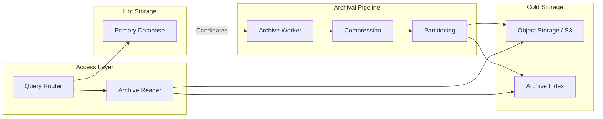
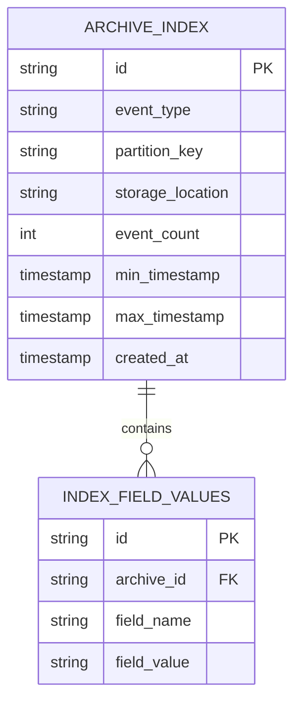

# How to Build Event Archival

Author: [nawazdhandala](https://github.com/nawazdhandala)

Tags: Event-Driven, Archival, Data Management, Compliance

Description: Learn to build event archival strategies for long-term storage, compliance, and historical data analysis.

---

> Events are the lifeblood of modern systems. But keeping every event forever in your primary datastore is expensive and slow. Event archival gives you the best of both worlds: fast operational queries and affordable long-term retention.

This guide walks through building a production-ready event archival system - from deciding what to archive, to implementing tiered storage, to querying historical data when you need it.

---

## Why Archive Events?

Most systems generate far more events than they need for day-to-day operations. A typical e-commerce platform might process millions of order events, inventory updates, and user actions daily. Keeping all of this in hot storage (your primary database) creates problems:

| Problem | Impact |
|---------|--------|
| Storage costs | Hot storage (SSD, managed databases) costs 10-50x more than cold storage |
| Query performance | Large tables slow down operational queries |
| Backup complexity | Larger datasets mean longer backup windows and restore times |
| Compliance risk | Mixing current and historical data complicates data retention policies |

Event archival solves these by moving older events to cheaper storage while keeping them accessible when needed.

---

## The Event Archival Pipeline

A well-designed archival system has distinct stages for identifying, moving, and accessing archived events.



The pipeline identifies archival candidates based on age or status, compresses and partitions the data for efficient storage, writes to cold storage, and maintains an index for later retrieval.

---

## Defining Your Archival Strategy

Before writing code, define clear policies for what gets archived and when. This configuration approach lets you adjust policies without code changes.

```typescript
// archival-config.ts - Define archival policies per event type

interface ArchivalPolicy {
  eventType: string;           // Which events this policy applies to
  retentionDays: number;       // Days to keep in hot storage
  archiveFormat: 'json' | 'parquet' | 'avro';  // Storage format
  compressionType: 'gzip' | 'zstd' | 'snappy'; // Compression algorithm
  partitionBy: 'day' | 'week' | 'month';       // How to partition archives
  indexFields: string[];       // Fields to index for fast retrieval
}

// Define policies for different event types
const archivalPolicies: ArchivalPolicy[] = [
  {
    eventType: 'order.completed',
    retentionDays: 90,         // Keep completed orders hot for 90 days
    archiveFormat: 'parquet',  // Columnar format for analytics queries
    compressionType: 'zstd',   // Good compression ratio and speed
    partitionBy: 'day',        // Daily partitions for granular access
    indexFields: ['orderId', 'customerId', 'timestamp'],
  },
  {
    eventType: 'audit.log',
    retentionDays: 30,         // Audit logs move to archive quickly
    archiveFormat: 'json',     // Preserve full structure for compliance
    compressionType: 'gzip',   // Wide compatibility
    partitionBy: 'day',
    indexFields: ['userId', 'action', 'resourceId', 'timestamp'],
  },
  {
    eventType: 'telemetry.metric',
    retentionDays: 7,          // High-volume metrics archive fast
    archiveFormat: 'parquet',  // Efficient for numeric data
    compressionType: 'snappy', // Fast decompression for analytics
    partitionBy: 'day',
    indexFields: ['metricName', 'timestamp'],
  },
];

export { ArchivalPolicy, archivalPolicies };
```

---

## The Archive Worker

The archive worker runs periodically to identify and move events that meet archival criteria. This implementation uses batching to handle large volumes without overwhelming your database.

```typescript
// archive-worker.ts - Core archival logic

import { archivalPolicies, ArchivalPolicy } from './archival-config';
import { EventStore } from './event-store';
import { ArchiveWriter } from './archive-writer';
import { ArchiveIndex } from './archive-index';

interface ArchiveBatch {
  events: Event[];
  policy: ArchivalPolicy;
  partitionKey: string;
}

class ArchiveWorker {
  private eventStore: EventStore;
  private archiveWriter: ArchiveWriter;
  private archiveIndex: ArchiveIndex;
  private batchSize: number;

  constructor(
    eventStore: EventStore,
    archiveWriter: ArchiveWriter,
    archiveIndex: ArchiveIndex,
    batchSize: number = 1000
  ) {
    this.eventStore = eventStore;
    this.archiveWriter = archiveWriter;
    this.archiveIndex = archiveIndex;
    this.batchSize = batchSize;
  }

  // Main entry point - process all policies
  async runArchival(): Promise<void> {
    for (const policy of archivalPolicies) {
      await this.archiveEventsForPolicy(policy);
    }
  }

  // Archive events matching a specific policy
  private async archiveEventsForPolicy(policy: ArchivalPolicy): Promise<void> {
    const cutoffDate = this.calculateCutoffDate(policy.retentionDays);
    let cursor: string | null = null;
    let totalArchived = 0;

    // Process in batches to avoid memory issues with large datasets
    while (true) {
      const batch = await this.eventStore.getEventsForArchival({
        eventType: policy.eventType,
        olderThan: cutoffDate,
        limit: this.batchSize,
        cursor: cursor,
      });

      if (batch.events.length === 0) {
        break;
      }

      // Group events by partition for efficient storage
      const partitionedBatches = this.partitionEvents(batch.events, policy);

      // Write each partition to cold storage
      for (const archiveBatch of partitionedBatches) {
        await this.writeArchiveBatch(archiveBatch);
      }

      // Remove archived events from hot storage
      const eventIds = batch.events.map(e => e.id);
      await this.eventStore.deleteEvents(eventIds);

      totalArchived += batch.events.length;
      cursor = batch.nextCursor;

      console.log(`Archived ${totalArchived} ${policy.eventType} events`);
    }
  }

  // Calculate the date before which events should be archived
  private calculateCutoffDate(retentionDays: number): Date {
    const cutoff = new Date();
    cutoff.setDate(cutoff.getDate() - retentionDays);
    return cutoff;
  }

  // Group events into partitions based on policy
  private partitionEvents(
    events: Event[],
    policy: ArchivalPolicy
  ): ArchiveBatch[] {
    const partitions = new Map<string, Event[]>();

    for (const event of events) {
      const partitionKey = this.getPartitionKey(event.timestamp, policy.partitionBy);

      if (!partitions.has(partitionKey)) {
        partitions.set(partitionKey, []);
      }
      partitions.get(partitionKey)!.push(event);
    }

    return Array.from(partitions.entries()).map(([key, events]) => ({
      events,
      policy,
      partitionKey: key,
    }));
  }

  // Generate partition key from timestamp
  private getPartitionKey(timestamp: Date, partitionBy: string): string {
    const year = timestamp.getFullYear();
    const month = String(timestamp.getMonth() + 1).padStart(2, '0');
    const day = String(timestamp.getDate()).padStart(2, '0');

    switch (partitionBy) {
      case 'day':
        return `${year}/${month}/${day}`;
      case 'week':
        const weekNum = this.getWeekNumber(timestamp);
        return `${year}/week-${weekNum}`;
      case 'month':
        return `${year}/${month}`;
      default:
        return `${year}/${month}/${day}`;
    }
  }

  // Write a batch of events to cold storage
  private async writeArchiveBatch(batch: ArchiveBatch): Promise<void> {
    // Construct the storage path
    const storagePath = this.buildStoragePath(batch);

    // Compress and write the events
    const archiveLocation = await this.archiveWriter.write({
      events: batch.events,
      path: storagePath,
      format: batch.policy.archiveFormat,
      compression: batch.policy.compressionType,
    });

    // Update the index with metadata for later retrieval
    await this.archiveIndex.addEntry({
      eventType: batch.policy.eventType,
      partitionKey: batch.partitionKey,
      location: archiveLocation,
      eventCount: batch.events.length,
      minTimestamp: batch.events[0].timestamp,
      maxTimestamp: batch.events[batch.events.length - 1].timestamp,
      indexedFields: this.extractIndexedValues(batch.events, batch.policy.indexFields),
    });
  }

  private buildStoragePath(batch: ArchiveBatch): string {
    return `archives/${batch.policy.eventType}/${batch.partitionKey}`;
  }

  private getWeekNumber(date: Date): number {
    const firstDayOfYear = new Date(date.getFullYear(), 0, 1);
    const daysSinceStart = Math.floor(
      (date.getTime() - firstDayOfYear.getTime()) / (24 * 60 * 60 * 1000)
    );
    return Math.ceil((daysSinceStart + 1) / 7);
  }

  // Extract values for indexed fields to enable fast lookups
  private extractIndexedValues(
    events: Event[],
    indexFields: string[]
  ): Record<string, Set<string>> {
    const indexed: Record<string, Set<string>> = {};

    for (const field of indexFields) {
      indexed[field] = new Set();
    }

    for (const event of events) {
      for (const field of indexFields) {
        const value = this.getNestedValue(event, field);
        if (value !== undefined) {
          indexed[field].add(String(value));
        }
      }
    }

    return indexed;
  }

  private getNestedValue(obj: any, path: string): any {
    return path.split('.').reduce((curr, key) => curr?.[key], obj);
  }
}

export { ArchiveWorker };
```

---

## Archive Index Design

The archive index tracks where events are stored and what they contain. Without it, you would need to scan every archive file to find specific events. This design uses a lightweight database to store metadata about each archive partition.



The schema below creates the index tables. The separate field values table allows efficient lookups by any indexed field without loading full archive metadata.

```sql
-- archive-index-schema.sql

-- Main index table tracks archive file locations
CREATE TABLE archive_index (
    id UUID PRIMARY KEY DEFAULT gen_random_uuid(),
    event_type VARCHAR(255) NOT NULL,
    partition_key VARCHAR(100) NOT NULL,
    storage_location TEXT NOT NULL,
    event_count INTEGER NOT NULL,
    min_timestamp TIMESTAMPTZ NOT NULL,
    max_timestamp TIMESTAMPTZ NOT NULL,
    created_at TIMESTAMPTZ DEFAULT NOW(),

    -- Composite index for time-range queries on specific event types
    CONSTRAINT unique_partition UNIQUE (event_type, partition_key)
);

CREATE INDEX idx_archive_event_type_time
    ON archive_index (event_type, min_timestamp, max_timestamp);

-- Indexed field values for fast lookups by business keys
CREATE TABLE archive_field_values (
    id UUID PRIMARY KEY DEFAULT gen_random_uuid(),
    archive_id UUID REFERENCES archive_index(id) ON DELETE CASCADE,
    field_name VARCHAR(100) NOT NULL,
    field_value VARCHAR(500) NOT NULL
);

-- Index for looking up archives by field value
CREATE INDEX idx_field_lookup
    ON archive_field_values (field_name, field_value);
```

---

## Querying Archived Events

When you need historical events, the query router checks both hot storage and the archive index, then fetches from the appropriate location.

```typescript
// archive-reader.ts - Retrieve events from archives

import { ArchiveIndex } from './archive-index';
import { ObjectStorage } from './object-storage';

interface ArchiveQuery {
  eventType: string;
  startTime?: Date;
  endTime?: Date;
  filters?: Record<string, string>;  // Field-value pairs to match
}

interface QueryResult {
  events: Event[];
  source: 'hot' | 'archive' | 'both';
  archiveFilesScanned: number;
}

class ArchiveReader {
  private archiveIndex: ArchiveIndex;
  private objectStorage: ObjectStorage;

  constructor(archiveIndex: ArchiveIndex, objectStorage: ObjectStorage) {
    this.archiveIndex = archiveIndex;
    this.objectStorage = objectStorage;
  }

  // Find archived events matching the query criteria
  async queryArchives(query: ArchiveQuery): Promise<QueryResult> {
    // First, find relevant archive partitions using the index
    const archiveEntries = await this.archiveIndex.findPartitions({
      eventType: query.eventType,
      startTime: query.startTime,
      endTime: query.endTime,
      fieldFilters: query.filters,
    });

    if (archiveEntries.length === 0) {
      return { events: [], source: 'archive', archiveFilesScanned: 0 };
    }

    // Fetch and filter events from each relevant partition
    const allEvents: Event[] = [];

    for (const entry of archiveEntries) {
      const events = await this.readArchivePartition(entry.location);
      const filtered = this.applyFilters(events, query);
      allEvents.push(...filtered);
    }

    // Sort by timestamp for consistent ordering
    allEvents.sort((a, b) => a.timestamp.getTime() - b.timestamp.getTime());

    return {
      events: allEvents,
      source: 'archive',
      archiveFilesScanned: archiveEntries.length,
    };
  }

  // Read and decompress a single archive partition
  private async readArchivePartition(location: string): Promise<Event[]> {
    const compressed = await this.objectStorage.download(location);
    const decompressed = await this.decompress(compressed);
    return this.parseEvents(decompressed, location);
  }

  // Apply query filters to events
  private applyFilters(events: Event[], query: ArchiveQuery): Event[] {
    return events.filter(event => {
      // Time range filter
      if (query.startTime && event.timestamp < query.startTime) {
        return false;
      }
      if (query.endTime && event.timestamp > query.endTime) {
        return false;
      }

      // Field filters
      if (query.filters) {
        for (const [field, value] of Object.entries(query.filters)) {
          const eventValue = this.getNestedValue(event, field);
          if (String(eventValue) !== value) {
            return false;
          }
        }
      }

      return true;
    });
  }

  private async decompress(data: Buffer): Promise<Buffer> {
    // Detect compression type from file header and decompress
    // Implementation depends on your compression library
    return data;
  }

  private parseEvents(data: Buffer, location: string): Event[] {
    // Parse based on file extension or stored metadata
    if (location.endsWith('.parquet')) {
      return this.parseParquet(data);
    }
    return JSON.parse(data.toString());
  }

  private parseParquet(data: Buffer): Event[] {
    // Use a parquet library to parse columnar data
    return [];
  }

  private getNestedValue(obj: any, path: string): any {
    return path.split('.').reduce((curr, key) => curr?.[key], obj);
  }
}

export { ArchiveReader, ArchiveQuery, QueryResult };
```

---

## Storage Format Comparison

Choosing the right storage format affects both storage costs and query performance.

| Format | Compression | Query Speed | Best For |
|--------|-------------|-------------|----------|
| JSON + gzip | Good (60-70%) | Slow (full scan) | Compliance, audit logs |
| Parquet + zstd | Excellent (80-90%) | Fast (columnar) | Analytics, metrics |
| Avro + snappy | Good (65-75%) | Medium | Schema evolution, streaming |

Parquet works well for most archival use cases because it stores data in columns, allowing queries to read only the fields they need. JSON is better when you need to preserve exact structure for compliance or legal requirements.

---

## Running the Archive Worker

Schedule the archive worker to run during low-traffic periods. This cron-based approach lets you control timing and monitor execution.

```typescript
// archive-scheduler.ts - Schedule and monitor archival jobs

import { ArchiveWorker } from './archive-worker';
import { CronJob } from 'cron';

class ArchiveScheduler {
  private worker: ArchiveWorker;
  private job: CronJob;

  constructor(worker: ArchiveWorker) {
    this.worker = worker;

    // Run at 2 AM daily during low-traffic window
    this.job = new CronJob('0 2 * * *', async () => {
      await this.executeArchival();
    });
  }

  start(): void {
    this.job.start();
    console.log('Archive scheduler started - runs daily at 2 AM');
  }

  private async executeArchival(): Promise<void> {
    const startTime = Date.now();
    console.log('Starting scheduled archival run');

    try {
      await this.worker.runArchival();
      const duration = Date.now() - startTime;
      console.log(`Archival completed in ${duration}ms`);
    } catch (error) {
      console.error('Archival failed:', error);
      // Send alert to on-call team
    }
  }
}

export { ArchiveScheduler };
```

---

## Best Practices

**Test restoration regularly.** Archives are worthless if you cannot read them when needed. Run monthly restore tests to verify your archive reader works correctly.

**Monitor archive growth.** Track storage costs and archive sizes over time. Unexpected growth might indicate a bug in your archival policies or a change in event volume.

**Version your archive format.** Include format version in archive metadata so future code can handle older archives even after schema changes.

**Keep archival and deletion separate.** Archive first, verify the archive is readable, then delete from hot storage. Never delete before confirming the archive write succeeded.

**Consider compliance requirements.** Some regulations require specific retention periods. Build your policies around these requirements from the start rather than retrofitting later.

---

## Wrapping Up

Event archival is not glamorous, but it is essential for systems that generate significant event volume. The core pattern is straightforward: define what to archive, move it to cheap storage with good indexing, and provide a way to query it when needed.

Start with time-based archival for your highest-volume event types. Add field indexing for events you query frequently. Monitor your storage costs and query patterns to refine the approach over time.

The goal is simple: keep your operational database fast and focused while preserving historical data for compliance, debugging, and analysis.

---

*Building an event-driven system and need observability across your event pipeline? [OneUptime](https://oneuptime.com) provides complete monitoring for event-driven architectures with support for traces, metrics, and logs - helping you track events from production through archival.*
