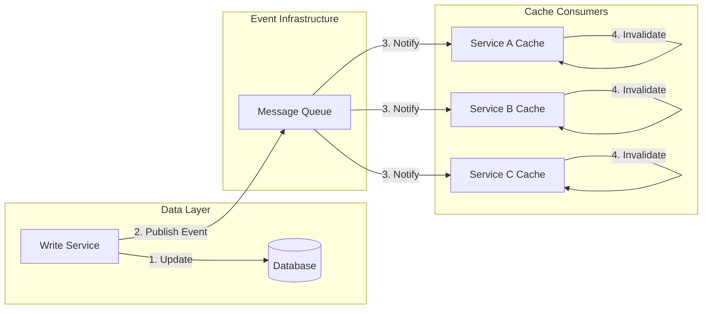
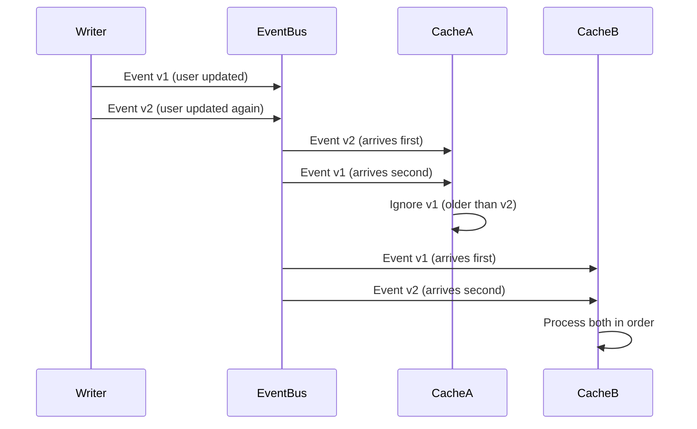

# How to Create Event-Based Invalidation

Author: [nawazdhandala](https://github.com/nawazdhandala)

Tags: Caching, Events, Invalidation, Real-Time

Description: Learn to create event-based cache invalidation for real-time data consistency.

---

Caching improves performance, but stale data creates bugs. Time-based expiration (TTL) is simple but wasteful: you either expire too early and lose cache benefits, or expire too late and serve stale data. Event-based invalidation solves this by invalidating cache entries precisely when the underlying data changes.

## Why Event-Based Invalidation?

| Approach | Pros | Cons |
|----------|------|------|
| **TTL-based** | Simple to implement | Data can be stale until expiry |
| **Write-through** | Always consistent | Tight coupling, slower writes |
| **Event-based** | Real-time consistency | Requires event infrastructure |
| **Hybrid (TTL + events)** | Best of both worlds | More complex to implement |

Event-based invalidation decouples your cache from your data layer. When data changes, an event is published, and any service holding cached copies can respond by invalidating or updating their local cache.

## Architecture Overview

The following diagram shows how events flow from data changes to cache invalidation across multiple services.



## Event Types for Cache Invalidation

Define specific event types for cache operations. This event structure includes the entity type, operation performed, and affected keys. The `affectedKeys` array allows batch invalidation when a single change affects multiple cache entries.

```typescript
// Define event types for different cache operations
// Each event carries enough context to determine which cache entries to invalidate
interface CacheInvalidationEvent {
  eventType: 'CREATED' | 'UPDATED' | 'DELETED' | 'BULK_UPDATE';
  entityType: string;       // e.g., 'user', 'product', 'order'
  entityId: string;         // Primary identifier
  affectedKeys: string[];   // All cache keys that should be invalidated
  timestamp: number;        // For ordering and deduplication
  correlationId: string;    // For tracing across services
}

// Example events for a user update
const userUpdateEvent: CacheInvalidationEvent = {
  eventType: 'UPDATED',
  entityType: 'user',
  entityId: 'user-123',
  affectedKeys: [
    'user:123',              // Direct user cache
    'user:123:profile',      // User profile cache
    'team:456:members',      // Team membership list
    'org:789:users',         // Organization users list
  ],
  timestamp: Date.now(),
  correlationId: 'req-abc-123',
};
```

## Publisher Implementation

The publisher wraps data operations to emit invalidation events after successful writes. This class uses a transaction pattern to ensure events are only published when the database write succeeds.

```typescript
import { EventEmitter } from 'events';
import { Redis } from 'ioredis';

// CacheEventPublisher handles publishing invalidation events
// after successful data mutations
class CacheEventPublisher {
  private redis: Redis;
  private localEmitter: EventEmitter;
  private channel: string;

  constructor(redis: Redis, channel: string = 'cache-invalidation') {
    this.redis = redis;
    this.channel = channel;
    this.localEmitter = new EventEmitter();
  }

  // Publish event to Redis pub/sub for distributed invalidation
  async publish(event: CacheInvalidationEvent): Promise<void> {
    const message = JSON.stringify(event);

    // Publish to Redis for cross-service invalidation
    await this.redis.publish(this.channel, message);

    // Also emit locally for same-process caches
    this.localEmitter.emit('invalidate', event);

    console.log(`Published invalidation event: ${event.entityType}:${event.entityId}`);
  }

  // Helper to wrap data operations with event publishing
  async withInvalidation<T>(
    operation: () => Promise<T>,
    getEvent: (result: T) => CacheInvalidationEvent
  ): Promise<T> {
    const result = await operation();
    const event = getEvent(result);
    await this.publish(event);
    return result;
  }

  onLocalInvalidation(handler: (event: CacheInvalidationEvent) => void): void {
    this.localEmitter.on('invalidate', handler);
  }
}

// Usage in a user service
class UserService {
  private db: Database;
  private publisher: CacheEventPublisher;

  async updateUser(userId: string, data: UserUpdate): Promise<User> {
    return this.publisher.withInvalidation(
      // The actual database operation
      async () => {
        return await this.db.users.update(userId, data);
      },
      // Generate the invalidation event from the result
      (user) => ({
        eventType: 'UPDATED',
        entityType: 'user',
        entityId: userId,
        affectedKeys: this.getAffectedCacheKeys(user),
        timestamp: Date.now(),
        correlationId: getCurrentCorrelationId(),
      })
    );
  }

  private getAffectedCacheKeys(user: User): string[] {
    // Return all cache keys that might contain this user's data
    return [
      `user:${user.id}`,
      `user:${user.id}:profile`,
      `user:email:${user.email}`,
      `team:${user.teamId}:members`,
    ];
  }
}
```

## Subscriber Implementation

The subscriber listens for invalidation events and removes affected entries from the local cache. It handles both pattern-based and exact key matching for flexibility.

```typescript
import { Redis } from 'ioredis';

// CacheInvalidationSubscriber listens for events and invalidates local cache
class CacheInvalidationSubscriber {
  private subscriber: Redis;
  private cache: Map<string, CacheEntry>;
  private handlers: Map<string, InvalidationHandler>;
  private channel: string;

  constructor(redis: Redis, channel: string = 'cache-invalidation') {
    // Create a dedicated connection for subscribing
    this.subscriber = redis.duplicate();
    this.cache = new Map();
    this.handlers = new Map();
    this.channel = channel;
  }

  async start(): Promise<void> {
    await this.subscriber.subscribe(this.channel);

    this.subscriber.on('message', (channel, message) => {
      if (channel === this.channel) {
        this.handleMessage(message);
      }
    });

    console.log(`Subscribed to cache invalidation channel: ${this.channel}`);
  }

  private handleMessage(message: string): void {
    try {
      const event: CacheInvalidationEvent = JSON.parse(message);

      // Deduplicate based on timestamp
      if (this.isDuplicate(event)) {
        return;
      }

      // Invalidate all affected keys
      for (const key of event.affectedKeys) {
        this.invalidateKey(key);
      }

      // Call entity-specific handlers if registered
      const handler = this.handlers.get(event.entityType);
      if (handler) {
        handler(event);
      }

      console.log(
        `Invalidated ${event.affectedKeys.length} keys for ` +
        `${event.entityType}:${event.entityId}`
      );
    } catch (error) {
      console.error('Failed to process invalidation event:', error);
    }
  }

  private invalidateKey(key: string): void {
    // Support wildcard patterns like "user:123:*"
    if (key.includes('*')) {
      const pattern = new RegExp('^' + key.replace(/\*/g, '.*') + '$');
      for (const cacheKey of this.cache.keys()) {
        if (pattern.test(cacheKey)) {
          this.cache.delete(cacheKey);
        }
      }
    } else {
      this.cache.delete(key);
    }
  }

  // Register custom handler for specific entity types
  onEntityInvalidation(
    entityType: string,
    handler: InvalidationHandler
  ): void {
    this.handlers.set(entityType, handler);
  }

  private recentEvents = new Map<string, number>();

  private isDuplicate(event: CacheInvalidationEvent): boolean {
    const key = `${event.entityType}:${event.entityId}:${event.timestamp}`;
    if (this.recentEvents.has(key)) {
      return true;
    }
    this.recentEvents.set(key, Date.now());
    // Clean old entries periodically
    if (this.recentEvents.size > 10000) {
      const cutoff = Date.now() - 60000;
      for (const [k, t] of this.recentEvents) {
        if (t < cutoff) this.recentEvents.delete(k);
      }
    }
    return false;
  }
}
```

## Cache Manager with Event Support

This cache manager combines local caching with event-based invalidation. It automatically subscribes to invalidation events and removes stale entries. The `getOrSet` method provides the standard cache-aside pattern with built-in event support.

```typescript
// Full cache manager that integrates with the event system
class EventAwareCacheManager {
  private cache: Map<string, CacheEntry>;
  private publisher: CacheEventPublisher;
  private subscriber: CacheInvalidationSubscriber;
  private defaultTTL: number;

  constructor(
    redis: Redis,
    options: { defaultTTL?: number; channel?: string } = {}
  ) {
    this.cache = new Map();
    this.defaultTTL = options.defaultTTL || 300000; // 5 minutes
    this.publisher = new CacheEventPublisher(redis, options.channel);
    this.subscriber = new CacheInvalidationSubscriber(redis, options.channel);

    // Wire up local invalidation
    this.publisher.onLocalInvalidation((event) => {
      for (const key of event.affectedKeys) {
        this.cache.delete(key);
      }
    });
  }

  async start(): Promise<void> {
    await this.subscriber.start();
  }

  // Standard cache-aside pattern with event awareness
  async getOrSet<T>(
    key: string,
    fetcher: () => Promise<T>,
    ttl: number = this.defaultTTL
  ): Promise<T> {
    const cached = this.cache.get(key);

    if (cached && cached.expiresAt > Date.now()) {
      return cached.value as T;
    }

    const value = await fetcher();

    this.cache.set(key, {
      value,
      expiresAt: Date.now() + ttl,
      createdAt: Date.now(),
    });

    return value;
  }

  // Invalidate and publish event
  async invalidate(event: CacheInvalidationEvent): Promise<void> {
    // Local invalidation happens via the publisher's local emitter
    await this.publisher.publish(event);
  }

  // Get cache statistics for monitoring
  getStats(): CacheStats {
    let validEntries = 0;
    let expiredEntries = 0;
    const now = Date.now();

    for (const entry of this.cache.values()) {
      if (entry.expiresAt > now) {
        validEntries++;
      } else {
        expiredEntries++;
      }
    }

    return {
      totalEntries: this.cache.size,
      validEntries,
      expiredEntries,
    };
  }
}

interface CacheEntry {
  value: unknown;
  expiresAt: number;
  createdAt: number;
}

interface CacheStats {
  totalEntries: number;
  validEntries: number;
  expiredEntries: number;
}
```

## Handling Event Ordering

Events can arrive out of order in distributed systems. The following diagram shows how to handle this using version numbers or timestamps.



Use version tracking to handle out-of-order events correctly.

```typescript
// Version-aware cache that handles out-of-order events
class VersionedCache {
  private cache: Map<string, VersionedEntry>;

  constructor() {
    this.cache = new Map();
  }

  set(key: string, value: unknown, version: number): boolean {
    const existing = this.cache.get(key);

    // Only update if this version is newer
    if (existing && existing.version >= version) {
      console.log(`Ignoring stale update for ${key}: v${version} <= v${existing.version}`);
      return false;
    }

    this.cache.set(key, { value, version, updatedAt: Date.now() });
    return true;
  }

  invalidate(key: string, version: number): boolean {
    const existing = this.cache.get(key);

    // Only invalidate if this version is newer or equal
    if (existing && existing.version > version) {
      console.log(`Ignoring stale invalidation for ${key}`);
      return false;
    }

    this.cache.delete(key);
    return true;
  }

  get(key: string): unknown | undefined {
    return this.cache.get(key)?.value;
  }
}
```

## Invalidation Patterns

Different scenarios require different invalidation strategies.

| Pattern | When to Use | Example |
|---------|-------------|---------|
| **Single key** | One entity changed | User profile update |
| **Pattern-based** | Related entities | All user sessions |
| **Tag-based** | Logical groupings | All product listings |
| **Cascade** | Parent-child relationships | Category and all products |

This helper class implements tag-based invalidation, where cache entries are tagged with labels. Invalidating a tag removes all entries with that tag.

```typescript
// Tag-based invalidation for logical groupings
class TaggedCache {
  private cache: Map<string, TaggedEntry>;
  private tagIndex: Map<string, Set<string>>; // tag -> keys

  constructor() {
    this.cache = new Map();
    this.tagIndex = new Map();
  }

  set(key: string, value: unknown, tags: string[]): void {
    // Store the entry
    this.cache.set(key, { value, tags, createdAt: Date.now() });

    // Update tag index
    for (const tag of tags) {
      if (!this.tagIndex.has(tag)) {
        this.tagIndex.set(tag, new Set());
      }
      this.tagIndex.get(tag)!.add(key);
    }
  }

  // Invalidate all entries with a specific tag
  invalidateByTag(tag: string): number {
    const keys = this.tagIndex.get(tag);
    if (!keys) return 0;

    let count = 0;
    for (const key of keys) {
      const entry = this.cache.get(key);
      if (entry) {
        // Remove from other tag indexes
        for (const t of entry.tags) {
          this.tagIndex.get(t)?.delete(key);
        }
        this.cache.delete(key);
        count++;
      }
    }

    this.tagIndex.delete(tag);
    return count;
  }
}

// Usage: tag cache entries by entity relationships
const cache = new TaggedCache();

cache.set('product:123', productData, [
  'product:123',
  'category:electronics',
  'vendor:456',
]);

// Invalidate all products in electronics category
cache.invalidateByTag('category:electronics');
```

## Monitoring Invalidation Events

Track invalidation metrics to understand cache behavior and detect issues. High invalidation rates might indicate a write-heavy workload that needs a different caching strategy.

```typescript
// Prometheus metrics for cache invalidation monitoring
const prometheus = require('prom-client');

const invalidationCounter = new prometheus.Counter({
  name: 'cache_invalidations_total',
  help: 'Total cache invalidations',
  labelNames: ['entity_type', 'event_type', 'source'],
});

const invalidationLatency = new prometheus.Histogram({
  name: 'cache_invalidation_latency_seconds',
  help: 'Time from event publish to local invalidation',
  labelNames: ['entity_type'],
  buckets: [0.001, 0.005, 0.01, 0.05, 0.1, 0.5],
});

const staleEventsCounter = new prometheus.Counter({
  name: 'cache_stale_events_total',
  help: 'Events ignored due to version ordering',
  labelNames: ['entity_type'],
});
```

## Summary

Event-based cache invalidation provides real-time data consistency without sacrificing cache performance. The key principles are:

1. **Publish events after successful writes** to notify all cache holders
2. **Handle out-of-order events** using version numbers or timestamps
3. **Use patterns and tags** for efficient bulk invalidation
4. **Monitor invalidation metrics** to detect issues early
5. **Combine with TTL** as a safety net for missed events

This approach scales well because cache consumers react to events independently. Adding more services or cache instances does not increase load on the data layer.
