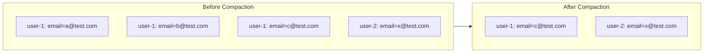
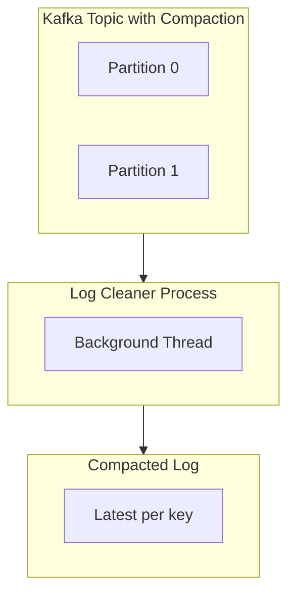
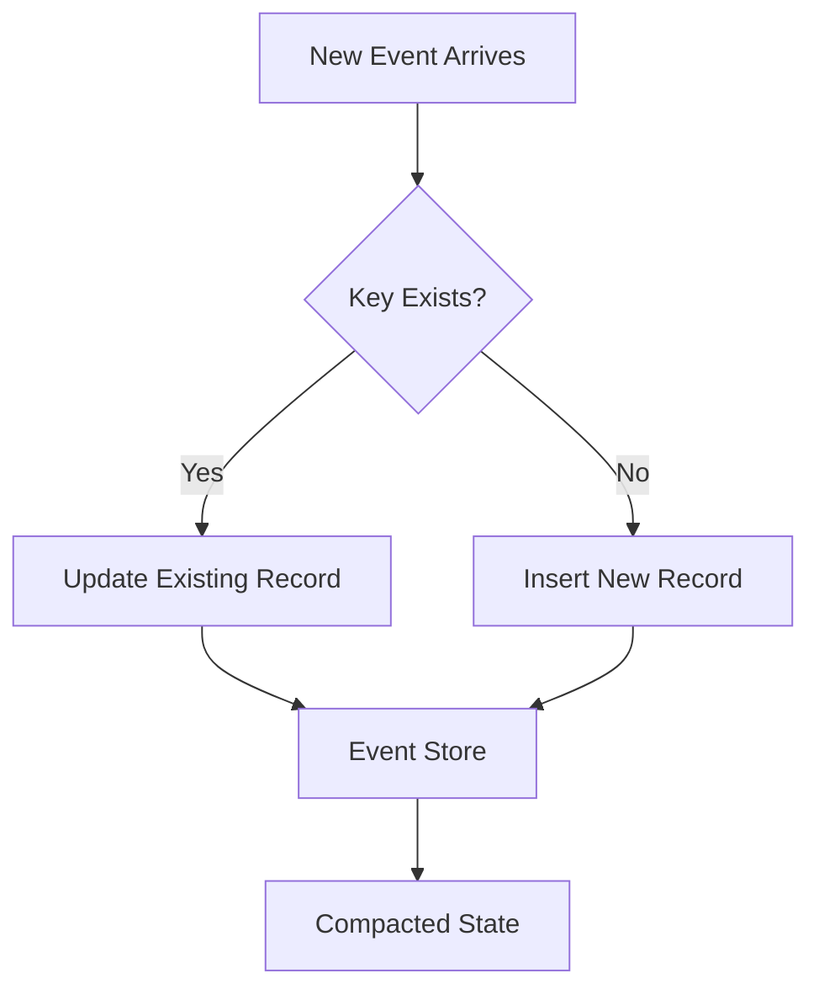
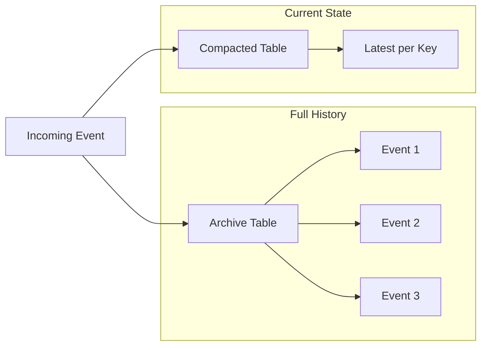

# How to Create Event Compaction

Author: [nawazdhandala](https://github.com/nawazdhandala)

Tags: Event-Driven, Kafka, Storage, Data Management

Description: Learn to create event compaction strategies for reducing storage and maintaining the latest state per key.

---

Event-driven systems generate massive amounts of data. Every state change, every update, every action produces an event. Without proper management, your storage costs balloon and query performance degrades. Event compaction solves this by keeping only the most recent event per key while discarding older, obsolete records.

This guide walks through event compaction concepts, implementation patterns, and practical code examples you can apply to your systems today.

## What is Event Compaction?

Event compaction is a storage optimization technique that retains only the latest event for each unique key. Instead of storing the complete history of every change, you keep just the current state.

Consider a user profile system. Over time, a single user might update their email 10 times. Without compaction, you store all 10 events. With compaction, you store only the final email value.



## When to Use Event Compaction

Event compaction works well for specific use cases. Here is a breakdown of when to apply it.

| Use Case | Compaction Suitable | Reason |
|----------|---------------------|--------|
| User profile updates | Yes | Only current state matters |
| Inventory levels | Yes | Current count is what you need |
| Configuration changes | Yes | Latest config is active |
| Audit logs | No | Full history required for compliance |
| Financial transactions | No | Complete record needed |
| Session events | Depends | May need history for analytics |

The key question: Do you need the full event history, or just the current state per key?

## Kafka Log Compaction

Apache Kafka provides built-in log compaction. When enabled on a topic, Kafka retains only the latest record for each key, periodically removing older duplicates.



### Configuring Kafka Topic for Compaction

Create a compacted topic with the following configuration.

```bash
# Create a compacted topic using kafka-topics command
kafka-topics.sh --create \
  --bootstrap-server localhost:9092 \
  --topic user-profiles \
  --partitions 6 \
  --replication-factor 3 \
  --config cleanup.policy=compact \
  --config min.cleanable.dirty.ratio=0.5 \
  --config segment.ms=86400000 \
  --config delete.retention.ms=86400000
```

The configuration parameters control compaction behavior.

| Parameter | Value | Purpose |
|-----------|-------|---------|
| cleanup.policy | compact | Enables log compaction |
| min.cleanable.dirty.ratio | 0.5 | Triggers cleaning when 50% is dirty |
| segment.ms | 86400000 | Closes segments after 24 hours |
| delete.retention.ms | 86400000 | Retains tombstones for 24 hours |

### Producing Events with Keys

For compaction to work, every message must have a key. The key determines which records get deduplicated.

```python
from kafka import KafkaProducer
import json

# Initialize the producer with JSON serialization
producer = KafkaProducer(
    bootstrap_servers=['localhost:9092'],
    key_serializer=lambda k: k.encode('utf-8'),
    value_serializer=lambda v: json.dumps(v).encode('utf-8')
)

def publish_user_update(user_id: str, profile_data: dict):
    """
    Publish a user profile update event.
    The user_id serves as the key for compaction.
    Only the latest event per user_id will be retained.
    """
    producer.send(
        topic='user-profiles',
        key=user_id,  # Key determines compaction grouping
        value=profile_data
    )
    producer.flush()

# Example usage - only the last update per user survives compaction
publish_user_update('user-123', {'email': 'old@example.com', 'name': 'Alice'})
publish_user_update('user-123', {'email': 'new@example.com', 'name': 'Alice'})
publish_user_update('user-456', {'email': 'bob@example.com', 'name': 'Bob'})
```

### Tombstone Messages for Deletion

To remove a key entirely from a compacted topic, send a tombstone - a message with a null value.

```python
def delete_user(user_id: str):
    """
    Send a tombstone message to delete a user from the compacted topic.
    A null value signals that this key should be removed during compaction.
    """
    producer.send(
        topic='user-profiles',
        key=user_id,
        value=None  # Null value creates a tombstone
    )
    producer.flush()

# This removes user-123 from the compacted log after retention period
delete_user('user-123')
```

## Building Custom Event Compaction

Not every system uses Kafka. Here is how to implement event compaction in a database-backed event store.



### PostgreSQL Implementation

Use upsert operations to maintain only the latest event per key.

```sql
-- Create a table designed for event compaction
CREATE TABLE compacted_events (
    event_key VARCHAR(255) PRIMARY KEY,
    event_type VARCHAR(100) NOT NULL,
    payload JSONB NOT NULL,
    version BIGINT NOT NULL DEFAULT 1,
    created_at TIMESTAMP DEFAULT NOW(),
    updated_at TIMESTAMP DEFAULT NOW()
);

-- Create an index for efficient queries by event type
CREATE INDEX idx_compacted_events_type ON compacted_events(event_type);

-- Create a trigger to auto-update the timestamp
CREATE OR REPLACE FUNCTION update_timestamp()
RETURNS TRIGGER AS $$
BEGIN
    NEW.updated_at = NOW();
    NEW.version = OLD.version + 1;
    RETURN NEW;
END;
$$ LANGUAGE plpgsql;

CREATE TRIGGER compacted_events_update
    BEFORE UPDATE ON compacted_events
    FOR EACH ROW
    EXECUTE FUNCTION update_timestamp();
```

Insert or update events using upsert logic.

```python
import psycopg2
import json
from datetime import datetime

def upsert_event(conn, event_key: str, event_type: str, payload: dict):
    """
    Insert a new event or update existing one with the same key.
    This maintains only the latest state per key - manual compaction.
    """
    cursor = conn.cursor()

    # Use INSERT ... ON CONFLICT for atomic upsert
    query = """
        INSERT INTO compacted_events (event_key, event_type, payload)
        VALUES (%s, %s, %s)
        ON CONFLICT (event_key)
        DO UPDATE SET
            event_type = EXCLUDED.event_type,
            payload = EXCLUDED.payload
        RETURNING version;
    """

    cursor.execute(query, (event_key, event_type, json.dumps(payload)))
    version = cursor.fetchone()[0]
    conn.commit()

    return version

# Usage example
conn = psycopg2.connect("postgresql://localhost/events")

# First update
upsert_event(conn, 'order-789', 'order.updated', {
    'status': 'processing',
    'items': 3
})

# Second update - replaces the first
upsert_event(conn, 'order-789', 'order.updated', {
    'status': 'shipped',
    'items': 3,
    'tracking': 'ABC123'
})
```

## Hybrid Approach - Archive Then Compact

Sometimes you need both the full history and a compacted view. Use a two-table approach.



```python
def store_event_hybrid(conn, event_key: str, event_type: str, payload: dict):
    """
    Store event in both archive (full history) and compacted (latest only) tables.
    Archive for audit trails, compacted for fast current state lookups.
    """
    cursor = conn.cursor()

    # Insert into archive - keeps full history
    archive_query = """
        INSERT INTO event_archive (event_key, event_type, payload, created_at)
        VALUES (%s, %s, %s, NOW());
    """
    cursor.execute(archive_query, (event_key, event_type, json.dumps(payload)))

    # Upsert into compacted table - keeps only latest
    compact_query = """
        INSERT INTO compacted_events (event_key, event_type, payload)
        VALUES (%s, %s, %s)
        ON CONFLICT (event_key)
        DO UPDATE SET
            event_type = EXCLUDED.event_type,
            payload = EXCLUDED.payload;
    """
    cursor.execute(compact_query, (event_key, event_type, json.dumps(payload)))

    conn.commit()
```

## Performance Considerations

Event compaction affects system performance in several ways.

| Aspect | Impact | Mitigation |
|--------|--------|------------|
| Write latency | Slightly higher due to upsert logic | Use batch writes |
| Read latency | Much faster for current state | Primary benefit |
| Storage | Significantly reduced | Main goal achieved |
| Compaction CPU | Background processing overhead | Schedule during low traffic |
| Recovery time | Faster - less data to replay | Secondary benefit |

### Monitoring Compaction Health

Track these metrics to verify compaction works correctly.

```python
def get_compaction_metrics(conn) -> dict:
    """
    Gather metrics about compaction effectiveness.
    Compare archive size vs compacted size to measure reduction.
    """
    cursor = conn.cursor()

    # Count records in each table
    cursor.execute("SELECT COUNT(*) FROM event_archive;")
    archive_count = cursor.fetchone()[0]

    cursor.execute("SELECT COUNT(*) FROM compacted_events;")
    compacted_count = cursor.fetchone()[0]

    # Calculate compression ratio
    ratio = archive_count / compacted_count if compacted_count > 0 else 0

    return {
        'archive_events': archive_count,
        'compacted_events': compacted_count,
        'compression_ratio': round(ratio, 2),
        'space_saved_percent': round((1 - 1/ratio) * 100, 2) if ratio > 0 else 0
    }
```

## Key Takeaways

Event compaction reduces storage costs and improves query performance for current state lookups. Here is what to remember.

- Use compaction when you only need the latest state per key
- Kafka provides built-in compaction - enable it with cleanup.policy=compact
- Every message needs a key for compaction to work
- Tombstones (null values) delete keys from compacted logs
- For custom implementations, use database upserts
- Consider hybrid approaches when you need both history and current state
- Monitor compaction metrics to verify effectiveness

Event compaction is not about losing data - it is about keeping the right data. Apply it where full history is not required, and your systems will be leaner and faster.

---

**Related Reading:**

- [What is OpenTelemetry Collector and Why Use One?](https://oneuptime.com/blog/post/2025-09-18-what-is-opentelemetry-collector-and-why-use-one/view)
- [How to Reduce Noise in OpenTelemetry](https://oneuptime.com/blog/post/2025-08-25-how-to-reduce-noise-in-opentelemetry/view)
