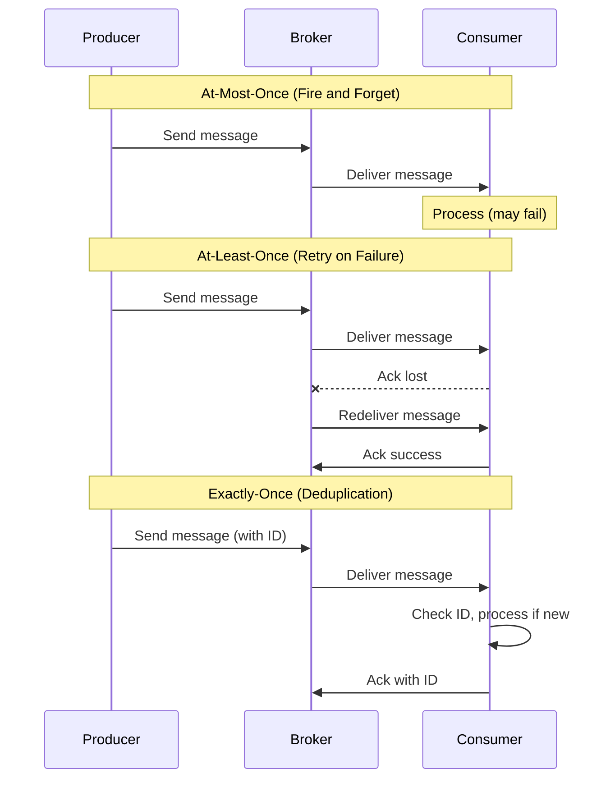
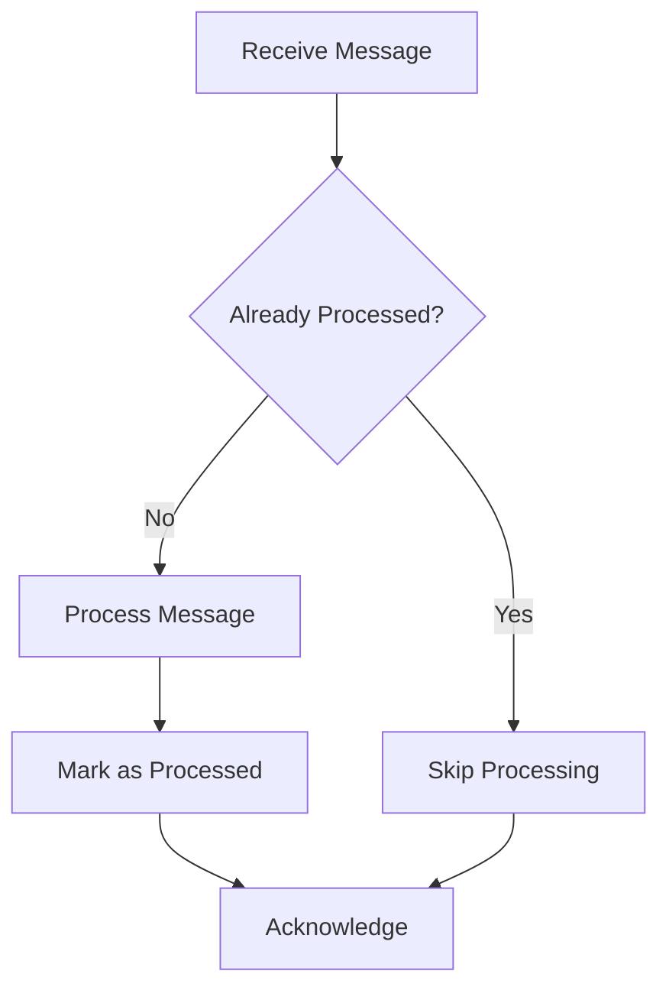
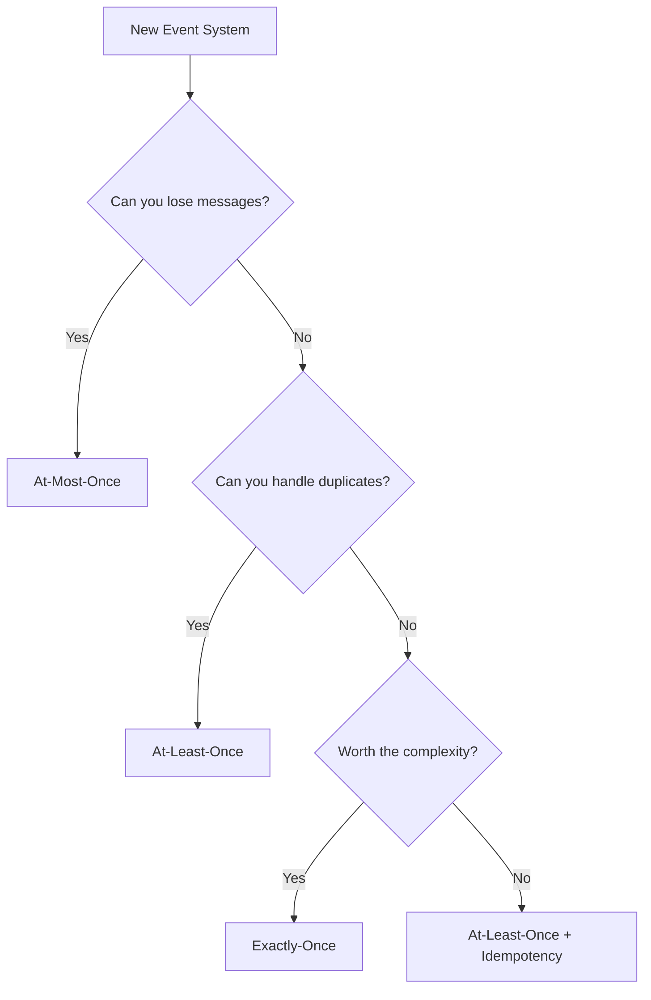

# How to Create Event Delivery Semantics

Author: [nawazdhandala](https://github.com/nawazdhandala)

Tags: Event-Driven, Messaging, Reliability, Architecture

Description: Learn to implement different event delivery semantics including at-least-once, at-most-once, and exactly-once guarantees.

---

Event-driven architectures power modern distributed systems - from payment processing to real-time analytics. But here is the hard truth: sending an event is easy, guaranteeing it arrives correctly is not. The difference between a reliable system and a broken one often comes down to understanding delivery semantics.

This guide walks through the three main delivery guarantees, when to use each, and how to implement them with practical code examples.

---

## Table of Contents

1. Understanding Delivery Guarantees
2. At-Most-Once Delivery
3. At-Least-Once Delivery
4. Exactly-Once Delivery
5. Choosing the Right Semantic
6. Implementation Patterns
7. Common Pitfalls

---

## 1. Understanding Delivery Guarantees

Every message system faces the same fundamental problem: networks fail, processes crash, and timeouts happen. How you handle these failures defines your delivery guarantee.

| Guarantee | Description | Trade-off |
|-----------|-------------|-----------|
| At-Most-Once | Message delivered zero or one time | Fast but may lose messages |
| At-Least-Once | Message delivered one or more times | Reliable but may duplicate |
| Exactly-Once | Message delivered precisely once | Ideal but complex to implement |

The following diagram shows how each guarantee handles a failed acknowledgment scenario.



---

## 2. At-Most-Once Delivery

At-most-once is the simplest approach - send the message and move on. If it fails, you do not retry.

This works well for use cases where losing occasional messages is acceptable: metrics collection, logging, or status updates where the next message will contain fresh data anyway.

The following producer sends events without waiting for confirmation.

```typescript
// at-most-once-producer.ts
// Fire-and-forget producer - prioritizes speed over reliability

import { Kafka } from 'kafkajs';

const kafka = new Kafka({ brokers: ['localhost:9092'] });
const producer = kafka.producer();

async function sendMetric(metric: { name: string; value: number }) {
    // No retries, no waiting for acks
    // If this fails, the metric is simply lost
    await producer.send({
        topic: 'metrics',
        messages: [{ value: JSON.stringify(metric) }],
        acks: 0,  // Do not wait for broker acknowledgment
    });
}

// Usage: acceptable to lose some metrics
setInterval(() => {
    sendMetric({ name: 'cpu_usage', value: Math.random() * 100 });
}, 1000);
```

The trade-off is clear: you get low latency and high throughput, but some messages will disappear during network blips or broker restarts.

---

## 3. At-Least-Once Delivery

At-least-once guarantees the message arrives, but it might arrive multiple times. This is the default for most message queues and is suitable for many production systems.

The key is making your consumer idempotent - processing the same message twice should produce the same result as processing it once.



The following consumer uses a database to track processed message IDs.

```typescript
// at-least-once-consumer.ts
// Idempotent consumer that safely handles duplicate messages

import { Kafka } from 'kafkajs';
import { Pool } from 'pg';

const kafka = new Kafka({ brokers: ['localhost:9092'] });
const consumer = kafka.consumer({ groupId: 'order-processor' });
const db = new Pool();

interface OrderEvent {
    orderId: string;
    amount: number;
    timestamp: number;
}

async function processOrder(event: OrderEvent): Promise<void> {
    // Start a transaction to ensure atomicity
    const client = await db.connect();

    try {
        await client.query('BEGIN');

        // Check if we already processed this order
        // This query also locks the row to prevent race conditions
        const existing = await client.query(
            'SELECT 1 FROM processed_orders WHERE order_id = $1 FOR UPDATE',
            [event.orderId]
        );

        if (existing.rows.length > 0) {
            // Already processed - skip but still acknowledge
            console.log(`Order ${event.orderId} already processed, skipping`);
            await client.query('COMMIT');
            return;
        }

        // Process the order - this is the actual business logic
        await client.query(
            'INSERT INTO orders (id, amount, created_at) VALUES ($1, $2, $3)',
            [event.orderId, event.amount, new Date(event.timestamp)]
        );

        // Mark as processed to prevent future duplicates
        await client.query(
            'INSERT INTO processed_orders (order_id, processed_at) VALUES ($1, NOW())',
            [event.orderId]
        );

        await client.query('COMMIT');
    } catch (error) {
        await client.query('ROLLBACK');
        throw error;  // Let the consumer retry
    } finally {
        client.release();
    }
}

async function startConsumer() {
    await consumer.connect();
    await consumer.subscribe({ topic: 'orders', fromBeginning: true });

    await consumer.run({
        eachMessage: async ({ message }) => {
            const event: OrderEvent = JSON.parse(message.value!.toString());
            await processOrder(event);
            // Kafka auto-commits after successful processing
        },
    });
}

startConsumer();
```

The processed_orders table acts as a deduplication log. Without it, a redelivered message could charge a customer twice or ship two packages.

---

## 4. Exactly-Once Delivery

Exactly-once is what everyone wants but few achieve correctly. True exactly-once requires coordination between producer, broker, and consumer - and it comes with performance costs.

Kafka supports exactly-once semantics through idempotent producers and transactional messaging. The following example shows how to implement it.

```typescript
// exactly-once-producer.ts
// Transactional producer that guarantees exactly-once delivery

import { Kafka, CompressionTypes } from 'kafkajs';

const kafka = new Kafka({
    brokers: ['localhost:9092'],
    clientId: 'payment-service',
});

// Enable idempotent producer with transactional support
const producer = kafka.producer({
    idempotent: true,
    transactionalId: 'payment-producer-1',  // Must be unique per producer instance
    maxInFlightRequests: 1,  // Required for exactly-once
});

interface PaymentEvent {
    paymentId: string;
    userId: string;
    amount: number;
}

async function processPayment(payment: PaymentEvent): Promise<void> {
    const transaction = await producer.transaction();

    try {
        // All messages in this block are atomic
        // Either all succeed or all fail
        await transaction.send({
            topic: 'payments-processed',
            messages: [{
                key: payment.paymentId,
                value: JSON.stringify(payment),
            }],
        });

        // You can send to multiple topics in the same transaction
        await transaction.send({
            topic: 'user-notifications',
            messages: [{
                key: payment.userId,
                value: JSON.stringify({
                    type: 'payment_success',
                    paymentId: payment.paymentId,
                }),
            }],
        });

        // Commit the transaction - all messages become visible atomically
        await transaction.commit();
    } catch (error) {
        // Abort on any failure - no partial writes
        await transaction.abort();
        throw error;
    }
}

async function main() {
    await producer.connect();

    await processPayment({
        paymentId: 'pay_123',
        userId: 'user_456',
        amount: 99.99,
    });

    await producer.disconnect();
}

main();
```

For consume-transform-produce patterns, you need to combine transactional producing with consumer offset management.

```typescript
// exactly-once-stream.ts
// Consume-transform-produce with exactly-once guarantees

import { Kafka } from 'kafkajs';

const kafka = new Kafka({ brokers: ['localhost:9092'] });

const consumer = kafka.consumer({
    groupId: 'enrichment-service',
    // Read only committed messages from other transactions
    readUncommitted: false,
});

const producer = kafka.producer({
    idempotent: true,
    transactionalId: 'enrichment-producer-1',
});

async function runEnrichmentPipeline() {
    await producer.connect();
    await consumer.connect();
    await consumer.subscribe({ topic: 'raw-events' });

    await consumer.run({
        eachBatchAutoResolve: false,
        eachBatch: async ({ batch, resolveOffset, heartbeat }) => {
            const transaction = await producer.transaction();

            try {
                for (const message of batch.messages) {
                    // Transform the message
                    const raw = JSON.parse(message.value!.toString());
                    const enriched = {
                        ...raw,
                        processedAt: Date.now(),
                        version: 'v2',
                    };

                    // Produce enriched message within transaction
                    await transaction.send({
                        topic: 'enriched-events',
                        messages: [{ value: JSON.stringify(enriched) }],
                    });

                    resolveOffset(message.offset);
                    await heartbeat();
                }

                // Commit consumer offsets as part of the transaction
                await transaction.sendOffsets({
                    consumerGroupId: 'enrichment-service',
                    topics: [{
                        topic: batch.topic,
                        partitions: [{
                            partition: batch.partition,
                            offset: (parseInt(batch.messages[batch.messages.length - 1].offset) + 1).toString(),
                        }],
                    }],
                });

                await transaction.commit();
            } catch (error) {
                await transaction.abort();
                throw error;
            }
        },
    });
}

runEnrichmentPipeline();
```

---

## 5. Choosing the Right Semantic

The right choice depends on your use case and tolerance for different failure modes.

| Use Case | Recommended | Reason |
|----------|-------------|--------|
| Metrics/Telemetry | At-Most-Once | Loss is acceptable, speed matters |
| Order Processing | At-Least-Once | Duplicates are safer than losses |
| Financial Transactions | Exactly-Once | Neither loss nor duplication acceptable |
| Log Aggregation | At-Least-Once | Duplicate logs are annoying but safe |
| Inventory Updates | Exactly-Once | Duplicates cause incorrect counts |
| Email Notifications | At-Least-Once | Better to send twice than not at all |

The following decision tree can help you choose.



Most production systems use at-least-once with idempotent consumers. It provides a good balance of reliability and simplicity.

---

## 6. Implementation Patterns

### Idempotency Keys

The most practical pattern for achieving exactly-once-like behavior is using idempotency keys.

```typescript
// idempotency-middleware.ts
// Generic idempotency layer for any event processor

import { createHash } from 'crypto';
import Redis from 'ioredis';

const redis = new Redis();

interface IdempotencyConfig {
    keyPrefix: string;
    ttlSeconds: number;  // How long to remember processed events
}

// Generate a unique key from the event payload
function generateIdempotencyKey(event: any, prefix: string): string {
    // Use event ID if available, otherwise hash the content
    if (event.id) {
        return `${prefix}:${event.id}`;
    }
    const hash = createHash('sha256')
        .update(JSON.stringify(event))
        .digest('hex');
    return `${prefix}:${hash}`;
}

// Wrap any processor with idempotency protection
export function withIdempotency<T>(
    processor: (event: T) => Promise<void>,
    config: IdempotencyConfig
) {
    return async (event: T): Promise<void> => {
        const key = generateIdempotencyKey(event, config.keyPrefix);

        // Try to set the key - only succeeds if it does not exist
        const acquired = await redis.set(
            key,
            'processing',
            'EX', config.ttlSeconds,
            'NX'  // Only set if not exists
        );

        if (!acquired) {
            // Already processed or being processed
            console.log(`Event ${key} already handled, skipping`);
            return;
        }

        try {
            await processor(event);
            // Mark as successfully processed
            await redis.set(key, 'done', 'EX', config.ttlSeconds);
        } catch (error) {
            // Delete key so retries can attempt processing
            await redis.del(key);
            throw error;
        }
    };
}

// Usage example
const processPayment = withIdempotency(
    async (event: { paymentId: string; amount: number }) => {
        // Your payment logic here
        console.log(`Processing payment ${event.paymentId}`);
    },
    { keyPrefix: 'payment', ttlSeconds: 86400 }  // Remember for 24 hours
);
```

### Outbox Pattern

For systems that need to update a database and send an event atomically, the outbox pattern is essential.

```typescript
// outbox-pattern.ts
// Reliable event publishing using the transactional outbox pattern

import { Pool } from 'pg';

const db = new Pool();

interface OutboxEvent {
    aggregateId: string;
    eventType: string;
    payload: object;
}

// Write business data and event in the same transaction
async function createOrderWithEvent(order: { id: string; items: string[] }) {
    const client = await db.connect();

    try {
        await client.query('BEGIN');

        // Business operation
        await client.query(
            'INSERT INTO orders (id, items) VALUES ($1, $2)',
            [order.id, JSON.stringify(order.items)]
        );

        // Write event to outbox table - same transaction
        const event: OutboxEvent = {
            aggregateId: order.id,
            eventType: 'OrderCreated',
            payload: order,
        };

        await client.query(
            `INSERT INTO outbox (aggregate_id, event_type, payload, created_at)
             VALUES ($1, $2, $3, NOW())`,
            [event.aggregateId, event.eventType, JSON.stringify(event.payload)]
        );

        await client.query('COMMIT');
    } catch (error) {
        await client.query('ROLLBACK');
        throw error;
    } finally {
        client.release();
    }
}

// Separate process polls outbox and publishes events
async function publishOutboxEvents(publisher: (event: OutboxEvent) => Promise<void>) {
    const client = await db.connect();

    try {
        // Lock and fetch unpublished events
        const result = await client.query(
            `SELECT id, aggregate_id, event_type, payload
             FROM outbox
             WHERE published_at IS NULL
             ORDER BY created_at
             LIMIT 100
             FOR UPDATE SKIP LOCKED`
        );

        for (const row of result.rows) {
            await publisher({
                aggregateId: row.aggregate_id,
                eventType: row.event_type,
                payload: row.payload,
            });

            // Mark as published
            await client.query(
                'UPDATE outbox SET published_at = NOW() WHERE id = $1',
                [row.id]
            );
        }
    } finally {
        client.release();
    }
}
```

---

## 7. Common Pitfalls

Avoid these mistakes when implementing delivery semantics:

**Assuming the network is reliable.** Networks fail. Always design for retries and timeouts.

**Forgetting about rebalances.** Consumer group rebalances in Kafka can cause duplicate processing. Your idempotency layer must handle this.

**Using timestamps as idempotency keys.** Clock skew between servers makes timestamps unreliable. Use UUIDs or sequence numbers instead.

**Not setting TTLs on deduplication records.** Your processed_events table will grow forever without cleanup.

**Mixing semantics in a single pipeline.** If one stage is at-most-once and another is exactly-once, the whole pipeline is only as strong as the weakest link.

---

## Summary

| Guarantee | Implementation | Best For |
|-----------|----------------|----------|
| At-Most-Once | Fire and forget, acks=0 | Metrics, logs, status updates |
| At-Least-Once | Retries + idempotent consumers | Most production workloads |
| Exactly-Once | Transactions + idempotency keys | Financial, inventory systems |

Start with at-least-once and add idempotency. Move to exactly-once only when the complexity is justified by your requirements. The goal is not perfect delivery - it is building a system that behaves correctly despite imperfect delivery.

---

*Building event-driven systems? [OneUptime](https://oneuptime.com) helps you monitor message queues, track delivery latency, and alert on processing failures across your distributed architecture.*
