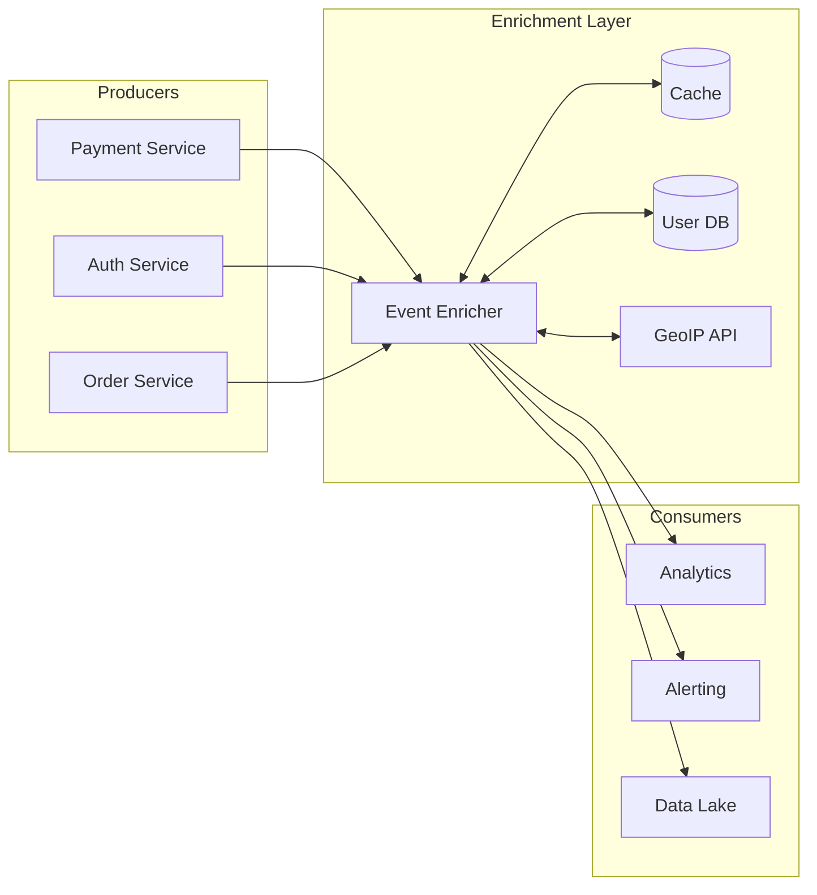
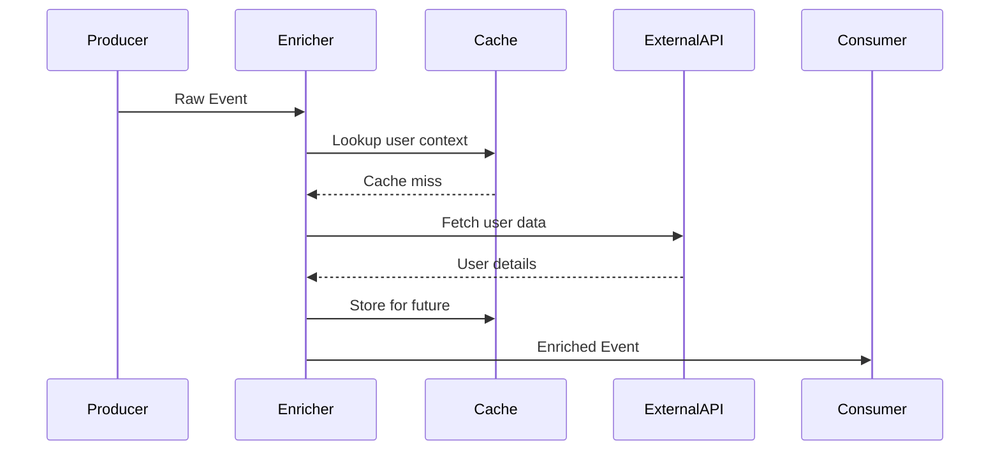
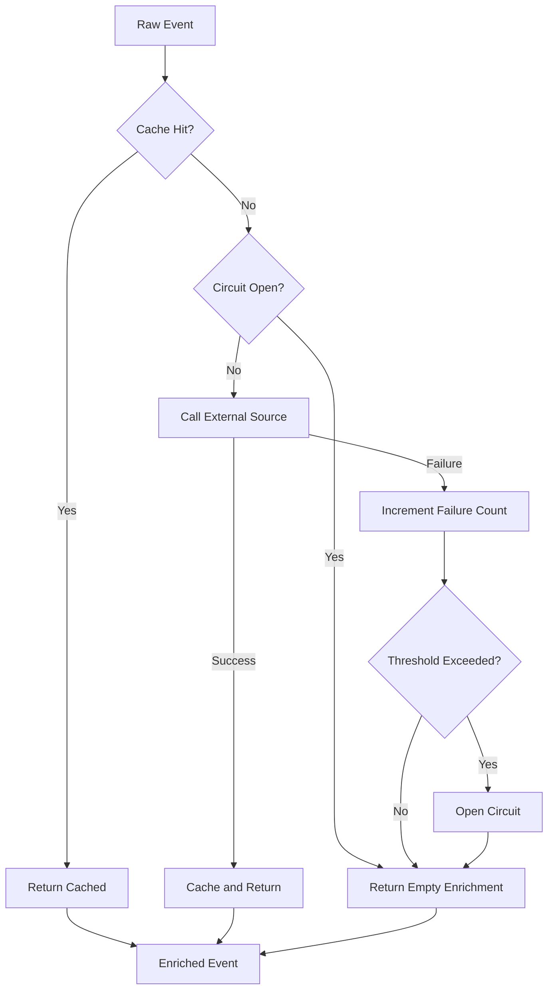

# How to Create Event Enrichment

Author: [nawazdhandala](https://github.com/nawazdhandala)

Tags: Event-Driven, Enrichment, Data Processing, Streaming

Description: Learn to create event enrichment patterns for adding contextual data to events from external sources.

---

Raw events tell you *what* happened. Enriched events tell you *why it matters*. When your payment service emits a transaction event, it contains an amount and a user ID. But to understand the business impact, you need to know: Is this user a VIP? What region are they in? What is their lifetime value? Event enrichment bridges that gap.

This guide walks through practical patterns for adding contextual data to events in real-time, covering architecture choices, implementation strategies, and production considerations.

---

## What Is Event Enrichment?

Event enrichment is the process of augmenting raw events with additional context from external data sources before they reach downstream consumers or storage. The goal is to produce self-contained events that carry all the information needed for processing, alerting, and analysis - without requiring consumers to make their own lookups.

| Raw Event | Enriched Event |
|-----------|----------------|
| `user_id: u_12345` | `user_id: u_12345, user_tier: enterprise, region: us-west-2` |
| `product_id: p_789` | `product_id: p_789, product_name: "Pro Plan", category: "subscription"` |
| `ip: 203.0.113.42` | `ip: 203.0.113.42, geo_country: US, geo_city: Seattle, is_vpn: false` |

---

## Architecture Overview

The following diagram shows a typical event enrichment pipeline. Events flow from producers through an enrichment service that pulls context from various sources before forwarding to consumers.



---

## Enrichment Patterns

### Pattern 1: Inline Enrichment

The enricher sits in the event path and enriches synchronously before forwarding. This is the simplest approach but adds latency.



### Pattern 2: Async Enrichment with Join

Events are published to a stream, and a separate process joins them with enrichment data. Better for high-throughput systems where latency tolerance exists.

### Pattern 3: Pre-computed Enrichment Tables

Enrichment data is materialized into lookup tables that update independently. The enricher performs simple key-value lookups with no external calls at request time.

---

## Implementation: Node.js Event Enricher

The following example shows a production-ready event enricher service. It uses a layered cache strategy and handles failures gracefully.

First, define the core enricher class that orchestrates lookups from multiple sources.

```typescript
// enricher.ts - Core event enrichment service
import { Redis } from 'ioredis';
import { Pool } from 'pg';

interface RawEvent {
  event_type: string;
  timestamp: string;
  user_id?: string;
  ip_address?: string;
  product_id?: string;
  payload: Record<string, unknown>;
}

interface EnrichedEvent extends RawEvent {
  enrichment: {
    user?: UserContext;
    geo?: GeoContext;
    product?: ProductContext;
    enriched_at: string;
  };
}

interface UserContext {
  tier: string;
  region: string;
  account_age_days: number;
  lifetime_value: number;
}

interface GeoContext {
  country: string;
  city: string;
  is_vpn: boolean;
}

interface ProductContext {
  name: string;
  category: string;
  price_cents: number;
}

export class EventEnricher {
  private redis: Redis;
  private db: Pool;
  private geoipEndpoint: string;

  // Cache TTLs in seconds
  private readonly USER_CACHE_TTL = 300;    // 5 minutes
  private readonly GEO_CACHE_TTL = 3600;    // 1 hour
  private readonly PRODUCT_CACHE_TTL = 600; // 10 minutes

  constructor(redis: Redis, db: Pool, geoipEndpoint: string) {
    this.redis = redis;
    this.db = db;
    this.geoipEndpoint = geoipEndpoint;
  }

  // Main enrichment method - runs all enrichers in parallel
  async enrich(event: RawEvent): Promise<EnrichedEvent> {
    const enrichmentPromises: Promise<void>[] = [];
    const enrichment: EnrichedEvent['enrichment'] = {
      enriched_at: new Date().toISOString()
    };

    // Queue up enrichment tasks based on available identifiers
    if (event.user_id) {
      enrichmentPromises.push(
        this.enrichUser(event.user_id)
          .then(ctx => { enrichment.user = ctx; })
          .catch(err => console.error('User enrichment failed:', err))
      );
    }

    if (event.ip_address) {
      enrichmentPromises.push(
        this.enrichGeo(event.ip_address)
          .then(ctx => { enrichment.geo = ctx; })
          .catch(err => console.error('Geo enrichment failed:', err))
      );
    }

    if (event.product_id) {
      enrichmentPromises.push(
        this.enrichProduct(event.product_id)
          .then(ctx => { enrichment.product = ctx; })
          .catch(err => console.error('Product enrichment failed:', err))
      );
    }

    // Wait for all enrichments to complete (with individual error handling)
    await Promise.all(enrichmentPromises);

    return { ...event, enrichment };
  }
}
```

Next, implement the individual enrichment methods with cache-aside pattern.

```typescript
// enricher.ts - continued: Individual enrichment methods

  // Fetch user context with cache-aside pattern
  private async enrichUser(userId: string): Promise<UserContext | undefined> {
    const cacheKey = `user:${userId}`;

    // Try cache first
    const cached = await this.redis.get(cacheKey);
    if (cached) {
      return JSON.parse(cached);
    }

    // Cache miss - fetch from database
    const result = await this.db.query<UserContext>(
      `SELECT tier, region,
              EXTRACT(DAY FROM NOW() - created_at) as account_age_days,
              lifetime_value
       FROM users WHERE id = $1`,
      [userId]
    );

    if (result.rows.length === 0) {
      return undefined;
    }

    const userContext = result.rows[0];

    // Store in cache for future requests
    await this.redis.setex(cacheKey, this.USER_CACHE_TTL, JSON.stringify(userContext));

    return userContext;
  }

  // Fetch geo context from external API with caching
  private async enrichGeo(ipAddress: string): Promise<GeoContext | undefined> {
    const cacheKey = `geo:${ipAddress}`;

    const cached = await this.redis.get(cacheKey);
    if (cached) {
      return JSON.parse(cached);
    }

    // Call external GeoIP service
    const response = await fetch(`${this.geoipEndpoint}/lookup?ip=${ipAddress}`);
    if (!response.ok) {
      return undefined;
    }

    const data = await response.json();
    const geoContext: GeoContext = {
      country: data.country_code,
      city: data.city,
      is_vpn: data.is_anonymous
    };

    await this.redis.setex(cacheKey, this.GEO_CACHE_TTL, JSON.stringify(geoContext));

    return geoContext;
  }

  // Fetch product context from database
  private async enrichProduct(productId: string): Promise<ProductContext | undefined> {
    const cacheKey = `product:${productId}`;

    const cached = await this.redis.get(cacheKey);
    if (cached) {
      return JSON.parse(cached);
    }

    const result = await this.db.query<ProductContext>(
      `SELECT name, category, price_cents
       FROM products WHERE id = $1`,
      [productId]
    );

    if (result.rows.length === 0) {
      return undefined;
    }

    const productContext = result.rows[0];
    await this.redis.setex(cacheKey, this.PRODUCT_CACHE_TTL, JSON.stringify(productContext));

    return productContext;
  }
```

---

## Stream Processing Integration

For high-volume systems, integrate the enricher with a message broker. This example shows a Kafka consumer that enriches events and publishes to an output topic.

```typescript
// stream-processor.ts - Kafka integration for event enrichment
import { Kafka, Consumer, Producer, EachMessagePayload } from 'kafkajs';
import { EventEnricher } from './enricher';

export class EnrichmentStreamProcessor {
  private consumer: Consumer;
  private producer: Producer;
  private enricher: EventEnricher;
  private inputTopic: string;
  private outputTopic: string;

  constructor(
    kafka: Kafka,
    enricher: EventEnricher,
    inputTopic: string,
    outputTopic: string
  ) {
    this.consumer = kafka.consumer({ groupId: 'event-enrichment-group' });
    this.producer = kafka.producer();
    this.enricher = enricher;
    this.inputTopic = inputTopic;
    this.outputTopic = outputTopic;
  }

  async start(): Promise<void> {
    await this.consumer.connect();
    await this.producer.connect();
    await this.consumer.subscribe({ topic: this.inputTopic });

    // Process messages with concurrency control
    await this.consumer.run({
      eachMessage: async (payload: EachMessagePayload) => {
        const { message } = payload;

        if (!message.value) return;

        const rawEvent = JSON.parse(message.value.toString());
        const enrichedEvent = await this.enricher.enrich(rawEvent);

        // Publish enriched event to output topic
        await this.producer.send({
          topic: this.outputTopic,
          messages: [{
            key: message.key,
            value: JSON.stringify(enrichedEvent),
            headers: {
              'enriched-at': Buffer.from(enrichedEvent.enrichment.enriched_at)
            }
          }]
        });
      }
    });
  }
}
```

---

## OpenTelemetry Collector Enrichment

For observability pipelines, the OpenTelemetry Collector provides built-in processors for event enrichment. This configuration adds resource attributes and transforms span data.

```yaml
# otel-collector-config.yaml - Enrichment processors for telemetry
processors:
  # Add static resource attributes to all telemetry
  resource:
    attributes:
      - key: deployment.environment
        value: production
        action: upsert
      - key: service.namespace
        value: payments
        action: upsert

  # Enrich spans with computed attributes
  attributes:
    actions:
      # Add region based on service name pattern
      - key: cloud.region
        value: us-west-2
        action: insert
      # Copy user tier from resource to span for easier querying
      - key: user.tier
        from_attribute: resource.user.tier
        action: insert

  # Transform processor for conditional enrichment
  transform:
    trace_statements:
      - context: span
        statements:
          # Mark high-value transactions
          - set(attributes["transaction.priority"], "high")
            where attributes["payment.amount"] > 10000
          # Add latency classification
          - set(attributes["latency.class"], "slow")
            where duration > 500000000

service:
  pipelines:
    traces:
      receivers: [otlp]
      processors: [resource, attributes, transform, batch]
      exporters: [otlp]
```

---

## Enrichment Best Practices

| Practice | Why It Matters |
|----------|---------------|
| Cache aggressively | External lookups are the primary latency source |
| Fail open | Missing enrichment should not block event flow |
| Enrich in parallel | Fetch user, geo, and product data concurrently |
| Set TTLs appropriately | Balance freshness against lookup cost |
| Monitor cache hit rates | Low hit rates indicate wasted resources |
| Version your enrichment schema | Consumers need to handle schema evolution |

---

## Handling Enrichment Failures

Events should flow even when enrichment sources are unavailable. Implement circuit breakers and fallback strategies.



---

## Monitoring Your Enrichment Pipeline

Track these metrics to ensure your enrichment layer is healthy:

- **Enrichment latency (p50, p95, p99)** - How long enrichment adds to event processing
- **Cache hit rate per source** - User cache, geo cache, product cache
- **Enrichment success rate** - Percentage of events successfully enriched
- **Circuit breaker state** - Open/closed status for each external dependency
- **Queue depth** - For async enrichment, monitor backlog growth

---

## When to Enrich vs. Join Later

Not every piece of context needs to be attached at event time. Consider this decision matrix:

| Enrich at Event Time | Join at Query Time |
|---------------------|-------------------|
| Data changes rarely | Data changes frequently |
| Consumers need it immediately | Only analytics needs it |
| Multiple consumers need same enrichment | Single consumer use case |
| Lookup latency is low | Lookup is expensive |
| Compliance requires self-contained events | Storage cost is a concern |

---

## Summary

Event enrichment transforms raw operational data into actionable intelligence. By adding context at the point of collection, you enable faster alerting, richer analytics, and simpler consumer logic. Start with inline enrichment for simplicity, add caching to reduce latency, and evolve to stream processing as volume grows.

The key principles: cache everything, fail gracefully, enrich in parallel, and monitor relentlessly. Your downstream systems will thank you.

---

**Related Reading:**

- [OpenTelemetry Collector: What It Is, When You Need It](https://oneuptime.com/blog/post/2025-09-18-what-is-opentelemetry-collector-and-why-use-one/view)
- [How to Reduce Noise in OpenTelemetry](https://oneuptime.com/blog/post/2025-08-25-how-to-reduce-noise-in-opentelemetry/view)
- [Traces and Spans in OpenTelemetry: A Practical Guide](https://oneuptime.com/blog/post/2025-08-27-traces-and-spans-in-opentelemetry/view)
