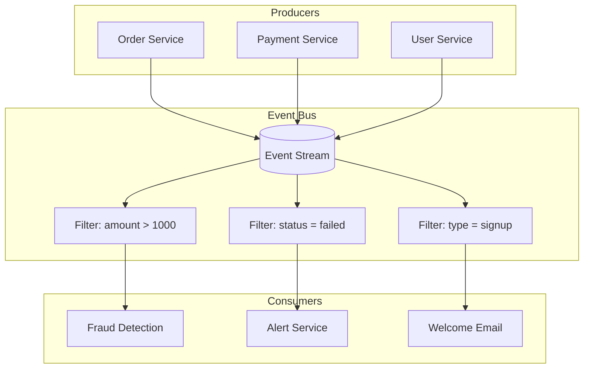
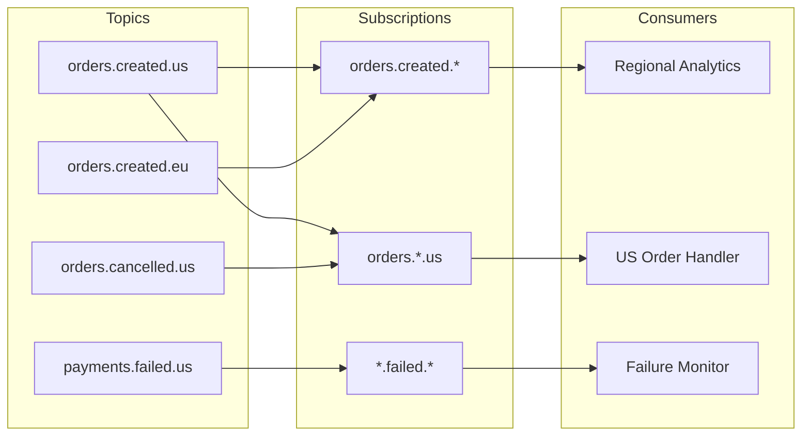
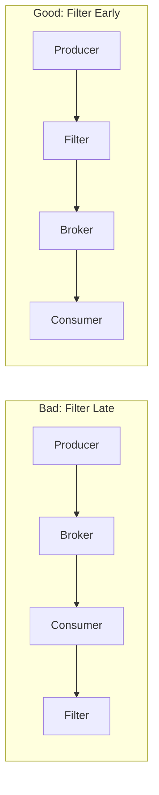

# How to Build Event Filtering Patterns

Author: [nawazdhandala](https://github.com/nawazdhandala)

Tags: Event-Driven, Filtering, Streaming, Data Processing

Description: Learn to build event filtering patterns for selective processing based on content, metadata, and rules.

---

Event-driven architectures generate massive volumes of data. Not every event matters to every consumer. Event filtering lets you route relevant events to the right places while discarding noise. This reduces processing costs, lowers latency, and keeps systems focused on what matters.

## Why Event Filtering Matters

In a typical event-driven system, producers emit events without knowing who consumes them. A payment service might emit thousands of transaction events per second. But the fraud detection system only cares about high-value transactions. The analytics pipeline wants everything. The notification service needs failed payments only.

Without filtering, every consumer processes every event. This wastes compute resources and increases complexity. Filtering solves this by letting each consumer specify exactly what it needs.

## Event Filtering Architecture



## Core Filtering Patterns

There are three fundamental patterns for filtering events. Each serves different use cases.

### Pattern 1: Content-Based Filtering

Content-based filtering examines the event payload and routes based on field values. This is the most common pattern.

The following example shows a content-based filter that routes events based on their properties.

```typescript
// content-filter.ts
// Filter events based on payload content

interface Event {
  id: string;
  type: string;
  timestamp: Date;
  payload: Record<string, unknown>;
}

interface FilterRule {
  field: string;           // Path to the field (supports dot notation)
  operator: FilterOperator;
  value: unknown;
}

type FilterOperator =
  | 'equals'
  | 'not_equals'
  | 'greater_than'
  | 'less_than'
  | 'contains'
  | 'starts_with'
  | 'in'
  | 'exists';

class ContentFilter {
  private rules: FilterRule[];

  constructor(rules: FilterRule[]) {
    this.rules = rules;
  }

  // Extract nested field value using dot notation
  // Example: getFieldValue(event, 'payload.order.amount')
  private getFieldValue(event: Event, path: string): unknown {
    const parts = path.split('.');
    let current: unknown = event;

    for (const part of parts) {
      if (current === null || current === undefined) {
        return undefined;
      }
      current = (current as Record<string, unknown>)[part];
    }

    return current;
  }

  // Evaluate a single rule against an event
  private evaluateRule(event: Event, rule: FilterRule): boolean {
    const fieldValue = this.getFieldValue(event, rule.field);

    switch (rule.operator) {
      case 'equals':
        return fieldValue === rule.value;

      case 'not_equals':
        return fieldValue !== rule.value;

      case 'greater_than':
        return Number(fieldValue) > Number(rule.value);

      case 'less_than':
        return Number(fieldValue) < Number(rule.value);

      case 'contains':
        return String(fieldValue).includes(String(rule.value));

      case 'starts_with':
        return String(fieldValue).startsWith(String(rule.value));

      case 'in':
        return Array.isArray(rule.value) && rule.value.includes(fieldValue);

      case 'exists':
        return fieldValue !== undefined && fieldValue !== null;

      default:
        return false;
    }
  }

  // Check if event matches all filter rules
  matches(event: Event): boolean {
    // All rules must match (AND logic)
    return this.rules.every(rule => this.evaluateRule(event, rule));
  }
}

// Usage example
const fraudFilter = new ContentFilter([
  { field: 'type', operator: 'equals', value: 'payment.completed' },
  { field: 'payload.amount', operator: 'greater_than', value: 1000 },
  { field: 'payload.currency', operator: 'in', value: ['USD', 'EUR', 'GBP'] }
]);

const event: Event = {
  id: 'evt_123',
  type: 'payment.completed',
  timestamp: new Date(),
  payload: { amount: 5000, currency: 'USD', customerId: 'cust_456' }
};

if (fraudFilter.matches(event)) {
  console.log('Event matched - sending to fraud detection');
}
```

### Pattern 2: Topic-Based Filtering

Topic-based filtering uses hierarchical topics to route events. Consumers subscribe to topic patterns using wildcards.



The following implementation shows how to build a topic-based routing system with wildcard support.

```python
# topic_filter.py
# Topic-based event filtering with wildcard support

import re
from typing import Callable, Dict, List, Set
from dataclasses import dataclass

@dataclass
class Event:
    topic: str
    payload: dict

class TopicFilter:
    """
    Routes events based on hierarchical topic patterns.
    Supports wildcards:
      - * matches a single segment
      - # matches zero or more segments (must be last)
    """

    def __init__(self):
        # Map of pattern to list of callback functions
        self.subscriptions: Dict[str, List[Callable]] = {}
        # Cache compiled regex patterns for performance
        self.pattern_cache: Dict[str, re.Pattern] = {}

    def _pattern_to_regex(self, pattern: str) -> re.Pattern:
        """
        Convert topic pattern to regex.
        orders.* becomes orders\.[^.]+
        orders.# becomes orders\..*
        """
        if pattern in self.pattern_cache:
            return self.pattern_cache[pattern]

        # Escape dots for regex
        regex_str = pattern.replace('.', r'\.')

        # Replace * with single segment match
        regex_str = regex_str.replace('*', r'[^.]+')

        # Replace # with multi-segment match
        regex_str = regex_str.replace('#', r'.*')

        # Anchor the pattern
        regex_str = f'^{regex_str}$'

        compiled = re.compile(regex_str)
        self.pattern_cache[pattern] = compiled
        return compiled

    def subscribe(self, pattern: str, callback: Callable[[Event], None]):
        """
        Subscribe to events matching a topic pattern.

        Examples:
          - 'orders.created' - exact match
          - 'orders.*' - matches orders.created, orders.cancelled
          - 'orders.#' - matches orders.created.us, orders.created.eu.west
        """
        if pattern not in self.subscriptions:
            self.subscriptions[pattern] = []

        self.subscriptions[pattern].append(callback)
        print(f"Subscribed to pattern: {pattern}")

    def unsubscribe(self, pattern: str, callback: Callable):
        """Remove a subscription."""
        if pattern in self.subscriptions:
            self.subscriptions[pattern].remove(callback)

    def publish(self, event: Event):
        """
        Publish an event to all matching subscribers.
        """
        matched_callbacks: Set[Callable] = set()

        # Check each subscription pattern
        for pattern, callbacks in self.subscriptions.items():
            regex = self._pattern_to_regex(pattern)

            if regex.match(event.topic):
                for callback in callbacks:
                    matched_callbacks.add(callback)

        # Invoke each matched callback once
        for callback in matched_callbacks:
            try:
                callback(event)
            except Exception as e:
                print(f"Error in callback: {e}")

        return len(matched_callbacks)


# Usage example
def handle_us_orders(event: Event):
    print(f"US order handler: {event.topic}")

def handle_all_failures(event: Event):
    print(f"Failure monitor: {event.topic}")

def handle_payment_events(event: Event):
    print(f"Payment processor: {event.topic}")


router = TopicFilter()

# Subscribe to different patterns
router.subscribe('orders.*.us', handle_us_orders)
router.subscribe('*.failed.#', handle_all_failures)
router.subscribe('payments.#', handle_payment_events)

# Publish events
router.publish(Event(topic='orders.created.us', payload={'id': 1}))
router.publish(Event(topic='payments.failed.us.west', payload={'id': 2}))
router.publish(Event(topic='payments.completed', payload={'id': 3}))
```

### Pattern 3: Header-Based Filtering

Header-based filtering routes events using metadata headers rather than payload content. This allows filtering without parsing the event body - useful for high-throughput scenarios.

```typescript
// header-filter.ts
// Filter events based on metadata headers

interface EventHeaders {
  [key: string]: string | number | boolean;
}

interface EventWithHeaders {
  headers: EventHeaders;
  body: unknown;
}

interface HeaderFilterConfig {
  // Headers that must match exactly
  requiredHeaders?: Record<string, string | number | boolean>;
  // Headers that must exist (any value)
  presentHeaders?: string[];
  // Headers that must not exist
  absentHeaders?: string[];
  // Custom predicate for complex logic
  customPredicate?: (headers: EventHeaders) => boolean;
}

class HeaderFilter {
  private config: HeaderFilterConfig;

  constructor(config: HeaderFilterConfig) {
    this.config = config;
  }

  matches(event: EventWithHeaders): boolean {
    const { headers } = event;

    // Check required header values
    if (this.config.requiredHeaders) {
      for (const [key, value] of Object.entries(this.config.requiredHeaders)) {
        if (headers[key] !== value) {
          return false;
        }
      }
    }

    // Check headers that must be present
    if (this.config.presentHeaders) {
      for (const key of this.config.presentHeaders) {
        if (!(key in headers)) {
          return false;
        }
      }
    }

    // Check headers that must be absent
    if (this.config.absentHeaders) {
      for (const key of this.config.absentHeaders) {
        if (key in headers) {
          return false;
        }
      }
    }

    // Run custom predicate if provided
    if (this.config.customPredicate) {
      if (!this.config.customPredicate(headers)) {
        return false;
      }
    }

    return true;
  }
}

// Usage: Route high-priority events from production
const priorityFilter = new HeaderFilter({
  requiredHeaders: {
    'x-environment': 'production',
    'x-priority': 'high'
  },
  absentHeaders: ['x-test-event'],
  customPredicate: (headers) => {
    // Custom logic: only events from approved services
    const allowedServices = ['payment-service', 'order-service'];
    return allowedServices.includes(String(headers['x-source-service']));
  }
});
```

## Combining Filters with Boolean Logic

Real-world scenarios often require combining multiple filters. The following pattern supports AND, OR, and NOT operations.

```python
# composite_filter.py
# Combine multiple filters with boolean logic

from abc import ABC, abstractmethod
from typing import List
from dataclasses import dataclass

@dataclass
class Event:
    type: str
    payload: dict
    headers: dict

class Filter(ABC):
    """Base class for all filters."""

    @abstractmethod
    def matches(self, event: Event) -> bool:
        pass

class AndFilter(Filter):
    """Matches if ALL child filters match."""

    def __init__(self, filters: List[Filter]):
        self.filters = filters

    def matches(self, event: Event) -> bool:
        return all(f.matches(event) for f in self.filters)

class OrFilter(Filter):
    """Matches if ANY child filter matches."""

    def __init__(self, filters: List[Filter]):
        self.filters = filters

    def matches(self, event: Event) -> bool:
        return any(f.matches(event) for f in self.filters)

class NotFilter(Filter):
    """Inverts the result of another filter."""

    def __init__(self, filter: Filter):
        self.filter = filter

    def matches(self, event: Event) -> bool:
        return not self.filter.matches(event)

class FieldFilter(Filter):
    """Matches based on a payload field value."""

    def __init__(self, field: str, expected_value):
        self.field = field
        self.expected_value = expected_value

    def matches(self, event: Event) -> bool:
        return event.payload.get(self.field) == self.expected_value

class TypeFilter(Filter):
    """Matches based on event type."""

    def __init__(self, event_type: str):
        self.event_type = event_type

    def matches(self, event: Event) -> bool:
        return event.type == self.event_type


# Build complex filter expression
# Match: (payment.failed OR payment.declined) AND country=US AND NOT test_mode
complex_filter = AndFilter([
    OrFilter([
        TypeFilter('payment.failed'),
        TypeFilter('payment.declined')
    ]),
    FieldFilter('country', 'US'),
    NotFilter(FieldFilter('test_mode', True))
])
```

## Filter Patterns Comparison

| Pattern | Best For | Pros | Cons |
|---------|----------|------|------|
| Content-Based | Complex payload conditions | Flexible, expressive | Higher parsing overhead |
| Topic-Based | Hierarchical event routing | Fast matching, simple subscriptions | Requires topic naming discipline |
| Header-Based | High-throughput filtering | No payload parsing needed | Limited to metadata |
| Composite | Complex business rules | Combines multiple approaches | Can become hard to debug |

## Event Filtering in Message Brokers

Most message brokers support native filtering. Here are examples for popular platforms.

### Apache Kafka with Kafka Streams

```java
// KafkaFilterExample.java
// Filter events using Kafka Streams

import org.apache.kafka.streams.StreamsBuilder;
import org.apache.kafka.streams.kstream.KStream;
import org.apache.kafka.streams.kstream.Predicate;

public class PaymentFilter {

    public void buildTopology(StreamsBuilder builder) {
        // Read from source topic
        KStream<String, PaymentEvent> payments = builder.stream("payments");

        // Define filter predicates
        Predicate<String, PaymentEvent> isHighValue =
            (key, event) -> event.getAmount() > 10000;

        Predicate<String, PaymentEvent> isFailed =
            (key, event) -> "FAILED".equals(event.getStatus());

        // Branch into multiple output streams based on filters
        // Index 0: high value payments
        // Index 1: failed payments
        // Index 2: everything else
        KStream<String, PaymentEvent>[] branches = payments.branch(
            isHighValue,
            isFailed,
            (key, event) -> true  // Default branch
        );

        // Route filtered streams to different topics
        branches[0].to("high-value-payments");
        branches[1].to("failed-payments");
        branches[2].to("standard-payments");
    }
}
```

### AWS EventBridge Rules

EventBridge supports content-based filtering through event patterns.

```json
{
  "source": ["com.myapp.payments"],
  "detail-type": ["Payment Processed"],
  "detail": {
    "amount": [{
      "numeric": [">", 1000]
    }],
    "status": ["COMPLETED", "PENDING"],
    "metadata": {
      "region": [{
        "prefix": "us-"
      }]
    }
  }
}
```

## Performance Optimization

Filtering at scale requires careful optimization. Here are key strategies.

### Index Frequently Filtered Fields

```typescript
// indexed-filter.ts
// Use indexes for fast field lookups

class IndexedEventStore {
  private events: Map<string, Event> = new Map();

  // Secondary indexes for common filter fields
  private typeIndex: Map<string, Set<string>> = new Map();
  private statusIndex: Map<string, Set<string>> = new Map();

  addEvent(event: Event): void {
    this.events.set(event.id, event);

    // Update type index
    if (!this.typeIndex.has(event.type)) {
      this.typeIndex.set(event.type, new Set());
    }
    this.typeIndex.get(event.type)!.add(event.id);

    // Update status index
    const status = String(event.payload.status);
    if (!this.statusIndex.has(status)) {
      this.statusIndex.set(status, new Set());
    }
    this.statusIndex.get(status)!.add(event.id);
  }

  // Fast lookup using index
  findByType(type: string): Event[] {
    const ids = this.typeIndex.get(type) || new Set();
    return Array.from(ids).map(id => this.events.get(id)!);
  }

  // Combine indexes for compound queries
  findByTypeAndStatus(type: string, status: string): Event[] {
    const typeIds = this.typeIndex.get(type) || new Set();
    const statusIds = this.statusIndex.get(status) || new Set();

    // Intersection of both sets
    const matchingIds = new Set(
      [...typeIds].filter(id => statusIds.has(id))
    );

    return Array.from(matchingIds).map(id => this.events.get(id)!);
  }
}
```

### Filter Early in the Pipeline

Push filters as close to the source as possible. This reduces network transfer and downstream processing.



## Summary

Event filtering is fundamental to building efficient event-driven systems. Start with the simplest pattern that meets your needs - topic-based filtering works well for most cases. Add content-based filtering when you need to route on payload fields. Use header-based filtering for high-throughput scenarios where parsing overhead matters.

Key takeaways:

- **Content-based filtering** examines payloads - flexible but has parsing overhead
- **Topic-based filtering** uses hierarchical naming - fast and simple to understand
- **Header-based filtering** inspects metadata - efficient for high-volume streams
- **Composite filters** combine patterns with boolean logic for complex rules
- **Filter early** in the pipeline to reduce unnecessary data transfer
- **Index common fields** when filtering against stored events

Choose the right pattern for your throughput requirements and filtering complexity. Most production systems use a combination of these patterns at different points in the event pipeline.
