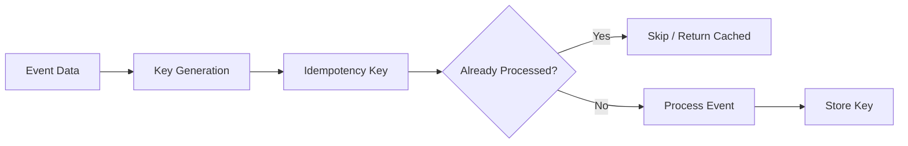
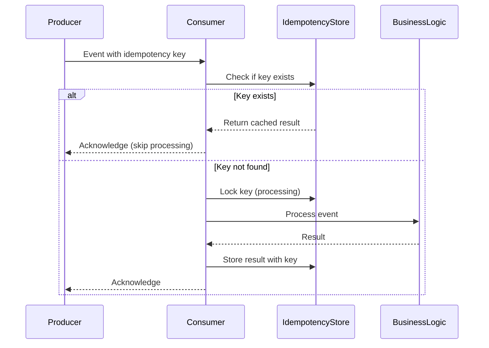

# How to Create Event Idempotency Keys

Author: [nawazdhandala](https://github.com/nawazdhandala)

Tags: Event-Driven, Idempotency, Distributed Systems, Reliability

Description: Learn to create idempotency keys for events to ensure exactly-once processing semantics in distributed systems.

---

In distributed systems, events can be delivered more than once. Network failures, retries, and message broker redeliveries all cause duplicate events. Without idempotency, your system processes the same event multiple times - charging customers twice, sending duplicate emails, or corrupting data. Idempotency keys solve this by giving each event a unique identifier that allows receivers to detect and skip duplicates.

## Why Events Get Duplicated

| Cause | Description |
|-------|-------------|
| **Producer retries** | Network timeout before acknowledgment, producer resends |
| **Broker redelivery** | Consumer crashes before committing offset, broker redelivers |
| **At-least-once delivery** | Most message systems guarantee at-least-once, not exactly-once |
| **Distributed transactions** | Partial failures in multi-step workflows trigger replays |

The solution is not to prevent duplicates (you cannot), but to make processing idempotent - producing the same result regardless of how many times an event is processed.

## Anatomy of an Idempotency Key

An idempotency key must be:

1. **Deterministic** - Same input always produces the same key
2. **Unique** - Different events produce different keys
3. **Stable** - Key does not change if the event is retried



## Key Generation Strategies

### Strategy 1: Client-Provided Keys

The event producer includes an idempotency key. This is the most reliable approach because the producer knows the business intent.

```typescript
// Producer side: Generate key before sending
// Use a deterministic combination of business identifiers
interface PaymentEvent {
  idempotencyKey: string;  // Client-generated unique key
  orderId: string;
  amount: number;
  currency: string;
  timestamp: number;
}

function createPaymentEvent(orderId: string, amount: number, currency: string): PaymentEvent {
  // Key combines order ID with a client-side request ID
  // This ensures retries of the same payment use the same key
  const requestId = crypto.randomUUID();

  return {
    idempotencyKey: `payment:${orderId}:${requestId}`,
    orderId,
    amount,
    currency,
    timestamp: Date.now(),
  };
}
```

### Strategy 2: Content-Based Hashing

Generate keys from event content. Useful when you cannot modify the producer.

```typescript
import crypto from 'crypto';

// Hash event content to create a deterministic key
// Same content always produces the same key
function generateContentKey(event: Record<string, unknown>): string {
  // Select fields that define event uniqueness
  // Exclude timestamps and other variable fields
  const relevantFields = {
    type: event.type,
    entityId: event.entityId,
    action: event.action,
    payload: event.payload,
  };

  const content = JSON.stringify(relevantFields, Object.keys(relevantFields).sort());

  return crypto
    .createHash('sha256')
    .update(content)
    .digest('hex')
    .substring(0, 32);  // Truncate for storage efficiency
}

// Example usage
const event = {
  type: 'order.created',
  entityId: 'order-123',
  action: 'create',
  payload: { items: ['item-1', 'item-2'], total: 99.99 },
  timestamp: Date.now(),  // Excluded from hash
};

const key = generateContentKey(event);
// Result: 'a1b2c3d4e5f6...' - same for identical content
```

### Strategy 3: Entity-Operation Keys

Combine entity identifier with operation type for natural business idempotency.

```typescript
// Generate key from entity ID and operation
// Prevents duplicate operations on the same entity
function generateEntityOperationKey(
  entityType: string,
  entityId: string,
  operation: string,
  version?: number
): string {
  // Version allows intentional re-processing
  const versionSuffix = version ? `:v${version}` : '';
  return `${entityType}:${entityId}:${operation}${versionSuffix}`;
}

// Examples of generated keys
generateEntityOperationKey('user', 'usr-123', 'welcome-email');
// Result: 'user:usr-123:welcome-email'

generateEntityOperationKey('order', 'ord-456', 'fulfill', 2);
// Result: 'order:ord-456:fulfill:v2'
```

### Strategy 4: Time-Windowed Keys

Allow the same operation to run again after a time window.

```typescript
// Include time bucket in key for periodic operations
// Same operation can run again in the next time window
function generateTimeWindowedKey(
  operation: string,
  entityId: string,
  windowMinutes: number = 60
): string {
  // Calculate time bucket
  const now = Date.now();
  const bucket = Math.floor(now / (windowMinutes * 60 * 1000));

  return `${operation}:${entityId}:window-${bucket}`;
}

// Example: Daily summary email
// User can receive one summary per day
const key = generateTimeWindowedKey('daily-summary', 'usr-123', 1440);
// Result: 'daily-summary:usr-123:window-1234567'
```

## Implementing Idempotency Checks

The key alone is not enough. You need storage and lookup logic to detect duplicates.



### Redis-Based Implementation

Redis provides fast lookups and automatic expiration for idempotency keys.

```typescript
import Redis from 'ioredis';

interface IdempotencyResult {
  processed: boolean;
  result?: unknown;
}

class IdempotencyStore {
  private redis: Redis;
  private ttlSeconds: number;

  constructor(redis: Redis, ttlSeconds: number = 86400) {
    this.redis = redis;
    this.ttlSeconds = ttlSeconds;  // Default: 24 hours
  }

  // Check if event was already processed
  // Returns cached result if available
  async check(key: string): Promise<IdempotencyResult> {
    const stored = await this.redis.get(`idempotency:${key}`);

    if (stored === null) {
      return { processed: false };
    }

    return {
      processed: true,
      result: JSON.parse(stored),
    };
  }

  // Attempt to acquire processing lock
  // Returns true if lock acquired, false if already locked
  async tryLock(key: string, lockTtlMs: number = 30000): Promise<boolean> {
    const lockKey = `idempotency:lock:${key}`;

    // SET NX with expiration - atomic lock acquisition
    const acquired = await this.redis.set(
      lockKey,
      'processing',
      'PX',
      lockTtlMs,
      'NX'
    );

    return acquired === 'OK';
  }

  // Store processing result and release lock
  async complete(key: string, result: unknown): Promise<void> {
    const multi = this.redis.multi();

    // Store result with TTL
    multi.set(
      `idempotency:${key}`,
      JSON.stringify(result),
      'EX',
      this.ttlSeconds
    );

    // Remove lock
    multi.del(`idempotency:lock:${key}`);

    await multi.exec();
  }

  // Release lock without storing result (on failure)
  async releaseLock(key: string): Promise<void> {
    await this.redis.del(`idempotency:lock:${key}`);
  }
}
```

### Event Processor with Idempotency

Wrap your event handler with idempotency logic.

```typescript
type EventHandler<T, R> = (event: T) => Promise<R>;

class IdempotentEventProcessor<T extends { idempotencyKey: string }, R> {
  private store: IdempotencyStore;
  private handler: EventHandler<T, R>;

  constructor(store: IdempotencyStore, handler: EventHandler<T, R>) {
    this.store = store;
    this.handler = handler;
  }

  async process(event: T): Promise<R> {
    const key = event.idempotencyKey;

    // Step 1: Check if already processed
    const existing = await this.store.check(key);
    if (existing.processed) {
      console.log(`Event ${key} already processed, returning cached result`);
      return existing.result as R;
    }

    // Step 2: Acquire lock
    const locked = await this.store.tryLock(key);
    if (!locked) {
      // Another processor is handling this event
      // Wait and retry or throw
      throw new Error(`Event ${key} is being processed by another worker`);
    }

    try {
      // Step 3: Process event
      const result = await this.handler(event);

      // Step 4: Store result
      await this.store.complete(key, result);

      return result;
    } catch (error) {
      // Release lock on failure to allow retry
      await this.store.releaseLock(key);
      throw error;
    }
  }
}

// Usage example
const redis = new Redis();
const store = new IdempotencyStore(redis);

const paymentProcessor = new IdempotentEventProcessor(
  store,
  async (event: PaymentEvent) => {
    // Your business logic here
    // This only runs once per idempotency key
    const result = await chargePayment(event.orderId, event.amount);
    return result;
  }
);

// Process event - safe to call multiple times
await paymentProcessor.process(paymentEvent);
```

## Database-Based Idempotency

For systems without Redis, use your database with unique constraints.

```typescript
// PostgreSQL schema for idempotency tracking
const createTableSQL = `
CREATE TABLE IF NOT EXISTS idempotency_keys (
  key VARCHAR(255) PRIMARY KEY,
  result JSONB,
  created_at TIMESTAMP DEFAULT NOW(),
  expires_at TIMESTAMP
);

CREATE INDEX idx_idempotency_expires ON idempotency_keys(expires_at);
`;

// Database-based idempotency store
class DatabaseIdempotencyStore {
  private db: Pool;
  private ttlHours: number;

  constructor(db: Pool, ttlHours: number = 24) {
    this.db = db;
    this.ttlHours = ttlHours;
  }

  async processWithIdempotency<T>(
    key: string,
    handler: () => Promise<T>
  ): Promise<T> {
    const client = await this.db.connect();

    try {
      await client.query('BEGIN');

      // Try to insert key - fails if duplicate
      const insertResult = await client.query(
        `INSERT INTO idempotency_keys (key, expires_at)
         VALUES ($1, NOW() + INTERVAL '${this.ttlHours} hours')
         ON CONFLICT (key) DO NOTHING
         RETURNING key`,
        [key]
      );

      if (insertResult.rowCount === 0) {
        // Key exists - fetch cached result
        const existing = await client.query(
          'SELECT result FROM idempotency_keys WHERE key = $1',
          [key]
        );
        await client.query('COMMIT');
        return existing.rows[0].result as T;
      }

      // Key inserted - process event
      const result = await handler();

      // Store result
      await client.query(
        'UPDATE idempotency_keys SET result = $2 WHERE key = $1',
        [key, JSON.stringify(result)]
      );

      await client.query('COMMIT');
      return result;
    } catch (error) {
      await client.query('ROLLBACK');
      throw error;
    } finally {
      client.release();
    }
  }
}
```

## Best Practices

| Practice | Reason |
|----------|--------|
| **Include business identifiers in keys** | Natural deduplication based on intent |
| **Set appropriate TTL** | Balance between catching retries and storage costs |
| **Handle concurrent processing** | Use locks to prevent race conditions |
| **Store results, not just keys** | Allow returning cached responses |
| **Log duplicate detections** | Monitor for systemic issues |
| **Clean up expired keys** | Prevent unbounded storage growth |

## Common Pitfalls

1. **Using timestamps in keys** - Different retry attempts get different keys, defeating idempotency
2. **Forgetting lock expiration** - Crashed processors hold locks forever
3. **Not storing failure state** - Retries re-attempt already-failed operations
4. **Key collisions from poor hashing** - Use cryptographic hashes, not simple concatenation
5. **Ignoring partial processing** - Use transactions or compensating actions

## Summary

Event idempotency keys transform at-least-once delivery into effectively exactly-once processing. The key generation strategy depends on your use case - client-provided keys for maximum control, content hashing for producer compatibility, or entity-operation keys for natural business semantics.

Combine deterministic key generation with proper storage, locking, and TTL management to build event-driven systems that handle duplicates gracefully. Your users will never see double charges, duplicate notifications, or corrupted state from retry storms.
