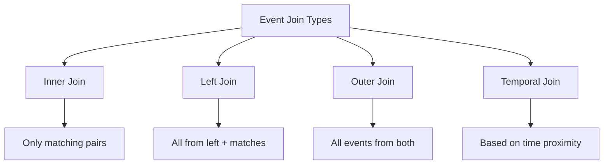
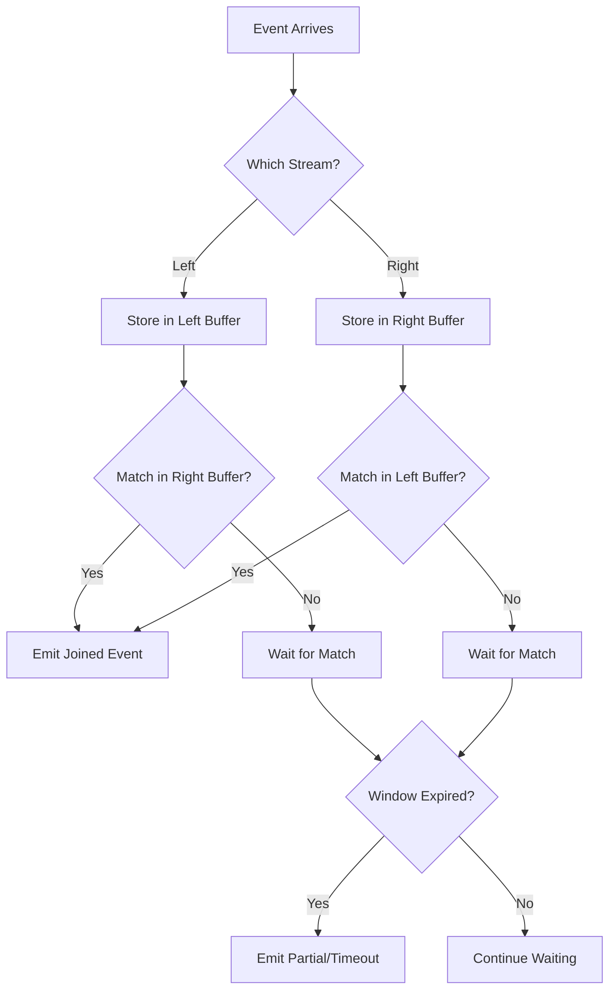
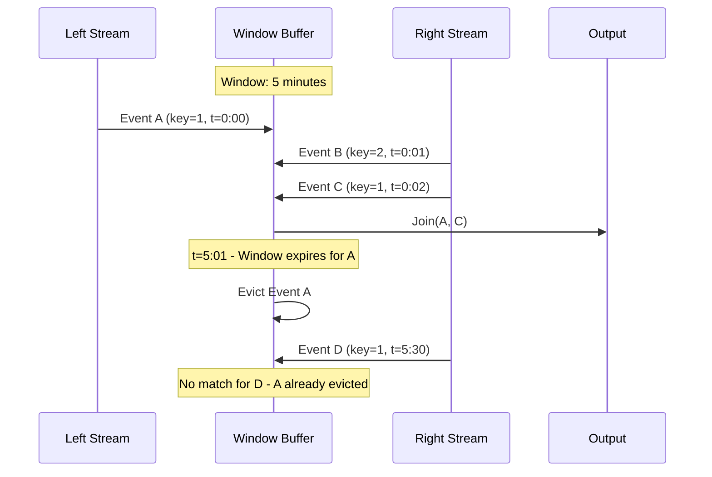
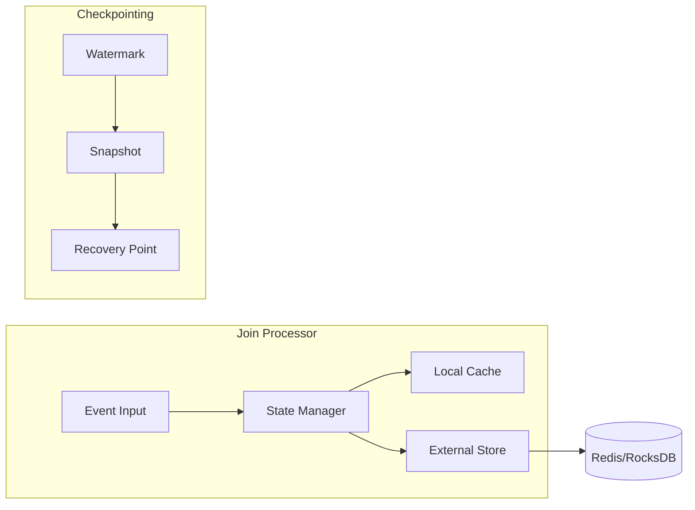
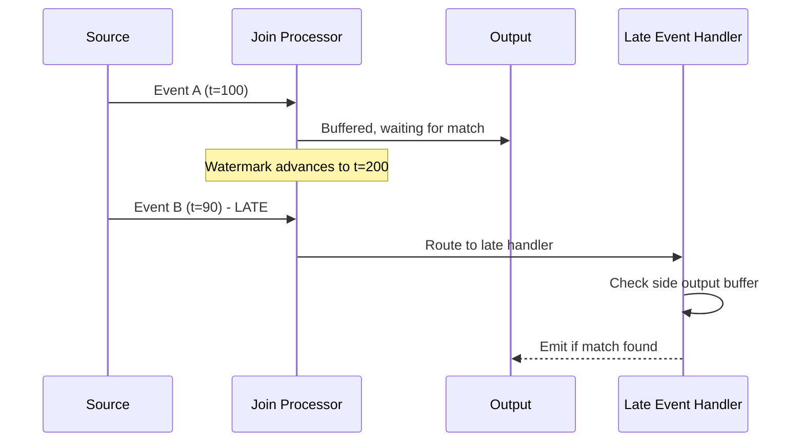

# How to Implement Event Joining

Author: [nawazdhandala](https://github.com/nawazdhandala)

Tags: Event-Driven, Streaming, Joins, Data Integration

Description: Learn to implement event joining patterns for combining related events from multiple streams in real-time.

---

Event joining is the process of combining related events from different streams based on shared keys or time windows. This is essential for building complete pictures from fragmented data - like matching orders with payments, or correlating user actions with system responses. This guide covers practical patterns for implementing event joins in streaming systems.

---

## Table of Contents

1. Why Event Joining Matters
2. Types of Event Joins
3. Join Semantics
4. Windowed Join Implementation
5. State Management
6. Handling Late Events
7. Performance Considerations
8. Common Pitfalls

---

## 1. Why Event Joining Matters

In distributed systems, related data often arrives through different streams. A single business transaction might generate events from payment services, inventory systems, and notification services - each arriving independently with no guarantee of order.

| Scenario | Streams to Join | Join Key |
|----------|-----------------|----------|
| Order fulfillment | Orders + Payments + Shipments | order_id |
| User session analysis | Clicks + Page views + Purchases | session_id |
| Fraud detection | Transactions + Device fingerprints | user_id |
| IoT correlation | Sensor readings + Device status | device_id |

Without event joining, you would need to query multiple databases to reconstruct these relationships - adding latency and complexity to your system.

---

## 2. Types of Event Joins

Different join types serve different business requirements. The choice depends on whether you need all events or only matching ones.



| Join Type | Output | Use Case |
|-----------|--------|----------|
| Inner | Only matching pairs | Order-payment reconciliation |
| Left | All left events + matches | Enrich events with optional context |
| Outer | All events from both streams | Complete audit trails |
| Temporal | Events within time window | Session reconstruction |

---

## 3. Join Semantics

Understanding join semantics is critical for correct implementation. The key decisions are when to emit results and how to handle multiple matches.

The following diagram shows the decision flow for processing join events.



### Join Cardinality

Events can match one-to-one, one-to-many, or many-to-many. Your implementation must handle all cases.

```typescript
// Define the basic event structure with required fields
interface StreamEvent {
  id: string;
  key: string;        // Join key for matching events
  timestamp: number;  // Event time in milliseconds
  payload: Record<string, unknown>;
}

// Result of joining two events together
interface JoinedEvent {
  leftEvent: StreamEvent;
  rightEvent: StreamEvent;
  joinTimestamp: number;  // When the join occurred
}

// One-to-many join: one left event can match multiple right events
// Example: one order matching multiple line items
class OneToManyJoin {
  private leftBuffer: Map<string, StreamEvent> = new Map();
  private rightBuffer: Map<string, StreamEvent[]> = new Map();

  // Process event from the left stream
  processLeft(event: StreamEvent): JoinedEvent[] {
    const results: JoinedEvent[] = [];

    // Store the left event for future matches
    this.leftBuffer.set(event.key, event);

    // Check for existing matches in right buffer
    const rightEvents = this.rightBuffer.get(event.key) || [];
    for (const rightEvent of rightEvents) {
      results.push({
        leftEvent: event,
        rightEvent,
        joinTimestamp: Date.now(),
      });
    }

    return results;
  }

  // Process event from the right stream
  processRight(event: StreamEvent): JoinedEvent[] {
    const results: JoinedEvent[] = [];

    // Add to right buffer (append to existing array)
    const existing = this.rightBuffer.get(event.key) || [];
    existing.push(event);
    this.rightBuffer.set(event.key, existing);

    // Check for match in left buffer
    const leftEvent = this.leftBuffer.get(event.key);
    if (leftEvent) {
      results.push({
        leftEvent,
        rightEvent: event,
        joinTimestamp: Date.now(),
      });
    }

    return results;
  }
}
```

---

## 4. Windowed Join Implementation

Time windows bound how long events wait for matches. Without windows, state grows unbounded and memory exhaustion becomes inevitable.



The following implementation handles windowed joins with configurable duration.

```typescript
// Configuration for windowed join behavior
interface WindowConfig {
  windowSizeMs: number;      // How long events stay in buffer
  allowedLatenessMs: number; // Grace period for late arrivals
}

// Event with expiration tracking
interface BufferedEvent {
  event: StreamEvent;
  expiresAt: number;  // When this event should be evicted
}

// Windowed join processor with automatic expiration
class WindowedJoin {
  private leftBuffer: Map<string, BufferedEvent[]> = new Map();
  private rightBuffer: Map<string, BufferedEvent[]> = new Map();
  private config: WindowConfig;

  constructor(config: WindowConfig) {
    this.config = config;
  }

  // Add event to left stream buffer
  processLeft(event: StreamEvent): JoinedEvent[] {
    this.evictExpired();  // Clean up old events first

    const expiresAt = event.timestamp + this.config.windowSizeMs;
    const buffered: BufferedEvent = { event, expiresAt };

    // Add to buffer
    const existing = this.leftBuffer.get(event.key) || [];
    existing.push(buffered);
    this.leftBuffer.set(event.key, existing);

    // Find matches in right buffer
    return this.findMatches(event, this.rightBuffer);
  }

  // Add event to right stream buffer
  processRight(event: StreamEvent): JoinedEvent[] {
    this.evictExpired();

    const expiresAt = event.timestamp + this.config.windowSizeMs;
    const buffered: BufferedEvent = { event, expiresAt };

    const existing = this.rightBuffer.get(event.key) || [];
    existing.push(buffered);
    this.rightBuffer.set(event.key, existing);

    return this.findMatches(event, this.leftBuffer);
  }

  // Search buffer for matching events within window
  private findMatches(
    event: StreamEvent,
    buffer: Map<string, BufferedEvent[]>
  ): JoinedEvent[] {
    const results: JoinedEvent[] = [];
    const matches = buffer.get(event.key) || [];

    for (const buffered of matches) {
      // Check if events are within the time window
      const timeDiff = Math.abs(event.timestamp - buffered.event.timestamp);
      if (timeDiff <= this.config.windowSizeMs) {
        results.push({
          leftEvent: buffered.event,
          rightEvent: event,
          joinTimestamp: Date.now(),
        });
      }
    }

    return results;
  }

  // Remove events that have exceeded their window
  private evictExpired(): void {
    const now = Date.now();

    for (const [key, events] of this.leftBuffer) {
      const valid = events.filter(e => e.expiresAt > now);
      if (valid.length === 0) {
        this.leftBuffer.delete(key);
      } else {
        this.leftBuffer.set(key, valid);
      }
    }

    // Same for right buffer
    for (const [key, events] of this.rightBuffer) {
      const valid = events.filter(e => e.expiresAt > now);
      if (valid.length === 0) {
        this.rightBuffer.delete(key);
      } else {
        this.rightBuffer.set(key, valid);
      }
    }
  }
}
```

---

## 5. State Management

Join state must survive process restarts and scale across multiple instances. The state includes buffered events and watermarks.



| Storage Option | Latency | Durability | Scalability |
|----------------|---------|------------|-------------|
| In-memory Map | Microseconds | None | Single node |
| Redis | Low milliseconds | Optional persistence | Cluster support |
| RocksDB | Microseconds | Persistent | Single node |
| Kafka state store | Milliseconds | Changelog backed | Partition-based |

The following example shows state management with external storage.

```typescript
// Interface for pluggable state storage backends
interface StateStore {
  get(key: string): Promise<BufferedEvent[] | null>;
  set(key: string, events: BufferedEvent[]): Promise<void>;
  delete(key: string): Promise<void>;
  scan(prefix: string): AsyncIterable<[string, BufferedEvent[]]>;
}

// Join processor with external state management
class StatefulJoin {
  private leftStore: StateStore;
  private rightStore: StateStore;
  private config: WindowConfig;

  constructor(
    leftStore: StateStore,
    rightStore: StateStore,
    config: WindowConfig
  ) {
    this.leftStore = leftStore;
    this.rightStore = rightStore;
    this.config = config;
  }

  // Process with async state access
  async processLeft(event: StreamEvent): Promise<JoinedEvent[]> {
    const stateKey = `left:${event.key}`;
    const expiresAt = event.timestamp + this.config.windowSizeMs;

    // Read current state
    const existing = await this.leftStore.get(stateKey) || [];

    // Append new event
    existing.push({ event, expiresAt });
    await this.leftStore.set(stateKey, existing);

    // Find matches in right store
    const rightKey = `right:${event.key}`;
    const rightEvents = await this.rightStore.get(rightKey) || [];

    return rightEvents
      .filter(e => Math.abs(event.timestamp - e.event.timestamp) <= this.config.windowSizeMs)
      .map(e => ({
        leftEvent: event,
        rightEvent: e.event,
        joinTimestamp: Date.now(),
      }));
  }
}
```

---

## 6. Handling Late Events

Events arrive late due to network delays, retries, or clock skew. Your join implementation must handle late arrivals gracefully.



The implementation below tracks watermarks and handles late events separately.

```typescript
// Result types for different event outcomes
type JoinResult =
  | { type: 'joined'; event: JoinedEvent }
  | { type: 'late'; event: StreamEvent; watermark: number }
  | { type: 'buffered'; event: StreamEvent };

// Join processor with watermark tracking and late event handling
class WatermarkedJoin {
  private watermark: number = 0;
  private lateEventBuffer: Map<string, StreamEvent[]> = new Map();
  private config: WindowConfig;

  constructor(config: WindowConfig) {
    this.config = config;
  }

  // Update watermark based on event timestamps
  advanceWatermark(timestamp: number): void {
    // Watermark is the minimum timestamp we expect to see
    // Events with timestamp < watermark are considered late
    this.watermark = Math.max(this.watermark, timestamp - this.config.allowedLatenessMs);
  }

  // Check if event arrived after its window closed
  isLate(event: StreamEvent): boolean {
    return event.timestamp < this.watermark;
  }

  // Process event with late detection
  process(event: StreamEvent, stream: 'left' | 'right'): JoinResult {
    if (this.isLate(event)) {
      // Event arrived too late for normal processing
      // Store in separate buffer for potential recovery
      const lateKey = `${stream}:${event.key}`;
      const existing = this.lateEventBuffer.get(lateKey) || [];
      existing.push(event);
      this.lateEventBuffer.set(lateKey, existing);

      return {
        type: 'late',
        event,
        watermark: this.watermark,
      };
    }

    // Normal processing path
    this.advanceWatermark(event.timestamp);
    return { type: 'buffered', event };
  }

  // Attempt to join late events with existing matches
  recoverLateEvent(event: StreamEvent): JoinedEvent | null {
    // Implementation would check if a match exists
    // in the extended grace period buffer
    return null;
  }
}
```

---

## 7. Performance Considerations

Join performance depends on buffer size, key distribution, and eviction strategy. Monitor these metrics to maintain throughput.

| Metric | Target | Impact |
|--------|--------|--------|
| Buffer size per key | < 1000 events | Memory usage |
| Average join latency | < 10ms | End-to-end delay |
| Eviction rate | Matches arrival rate | Memory stability |
| Key cardinality | Bounded | State store size |

Hot keys - where many events share the same join key - require special handling.

```typescript
// Configuration for handling high-volume keys
interface HotKeyConfig {
  maxEventsPerKey: number;   // Limit buffer size
  samplingRate: number;      // Sample if exceeded (0.0-1.0)
}

// Join processor with hot key protection
class ProtectedJoin {
  private config: HotKeyConfig;
  private keyCounters: Map<string, number> = new Map();

  constructor(config: HotKeyConfig) {
    this.config = config;
  }

  // Check if key has exceeded buffer limit
  shouldProcess(event: StreamEvent): boolean {
    const count = this.keyCounters.get(event.key) || 0;

    if (count >= this.config.maxEventsPerKey) {
      // Apply sampling for hot keys
      return Math.random() < this.config.samplingRate;
    }

    this.keyCounters.set(event.key, count + 1);
    return true;
  }

  // Reset counters periodically (call from timer)
  resetCounters(): void {
    this.keyCounters.clear();
  }
}
```

---

## 8. Common Pitfalls

Avoid these mistakes when implementing event joins.

| Pitfall | Problem | Solution |
|---------|---------|----------|
| Unbounded buffers | Memory exhaustion | Always use time windows |
| Missing null checks | Crashes on partial joins | Handle unmatched events explicitly |
| Clock skew ignorance | Wrong join results | Use event time, not processing time |
| Single-threaded processing | Throughput bottleneck | Partition by key for parallelism |
| No backpressure | Overwhelmed downstream | Implement flow control |

The most dangerous pitfall is assuming events arrive in order. Always design for out-of-order delivery.

```typescript
// Defensive join implementation
function safeJoin(
  left: StreamEvent | null,
  right: StreamEvent | null
): Partial<JoinedEvent> | null {
  // Handle all possible combinations
  if (!left && !right) {
    return null;
  }

  if (!left) {
    // Right-only event - might be useful for outer joins
    return { rightEvent: right!, joinTimestamp: Date.now() };
  }

  if (!right) {
    // Left-only event
    return { leftEvent: left, joinTimestamp: Date.now() };
  }

  // Both present - full join
  return {
    leftEvent: left,
    rightEvent: right,
    joinTimestamp: Date.now(),
  };
}
```

---

## Summary

| Requirement | Recommended Approach |
|-------------|---------------------|
| Simple key matching | Hash-based inner join |
| Time-bounded correlation | Windowed join with eviction |
| Fault tolerance | External state store with checkpoints |
| Late event handling | Watermarks with grace periods |
| High throughput | Partition by join key |

Event joining requires balancing correctness, latency, and resource usage. Start with simple windowed joins, add state persistence when you need fault tolerance, and implement hot key protection before going to production.

---

*Building event-driven systems with OneUptime? Our platform correlates events across services automatically using trace context. Check out [OneUptime](https://oneuptime.com) for end-to-end observability of your streaming pipelines.*

---

### Related Reading

- [How to Implement Event Timestamps](/blog/post/2026-01-30-event-timestamps/) - Foundation for time-based event joining
- [What are Traces and Spans in OpenTelemetry](/blog/post/2025-08-27-traces-and-spans-in-opentelemetry/) - Correlating events across distributed services
