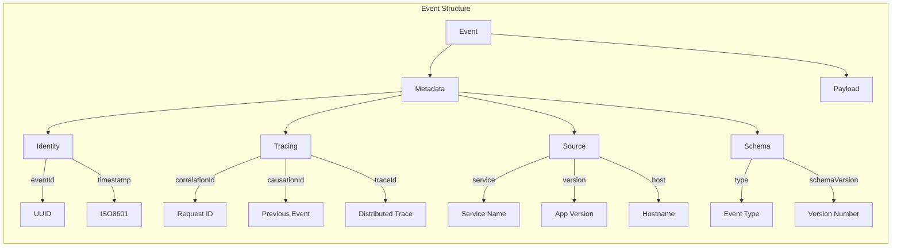
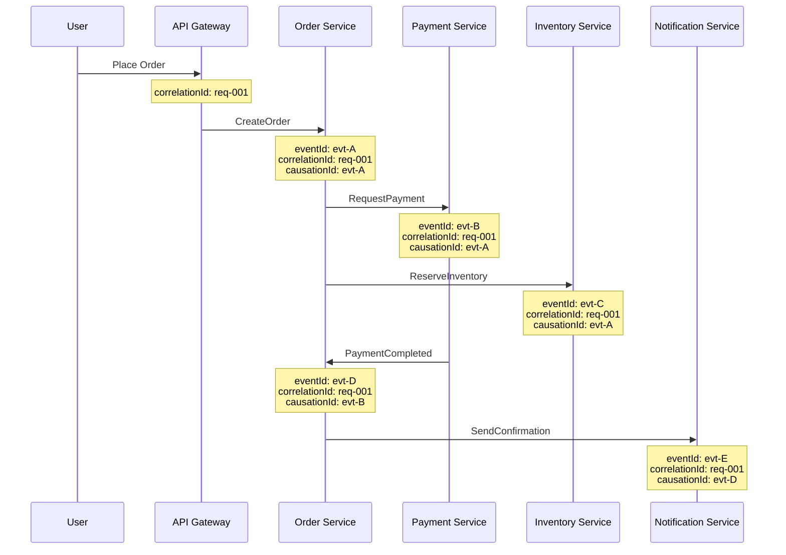
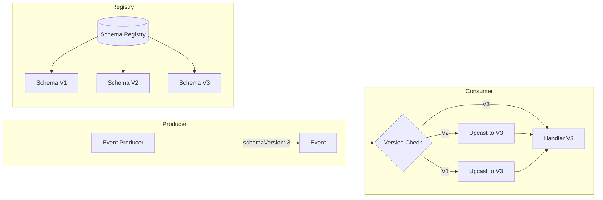
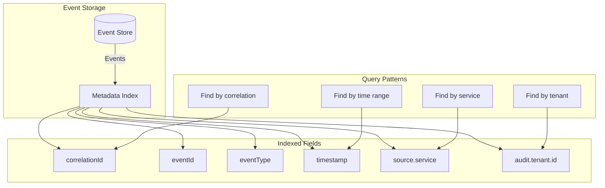

# How to Implement Event Metadata Design

Author: [nawazdhandala](https://github.com/nawazdhandala)

Tags: Event-Driven, Architecture, Metadata, Observability, Distributed-Systems

Description: Learn how to design comprehensive event metadata structures that enable tracing, debugging, replay, and auditing in production event-driven systems.

---

## Introduction

Every event in your system tells a story. The payload says what happened, but metadata tells you when, where, why, and how. Without proper metadata design, debugging distributed systems becomes a nightmare of correlating timestamps and guessing at causality.

This guide covers practical patterns for designing event metadata that makes your systems observable, debuggable, and maintainable in production.

## Why Event Metadata Matters

Consider a simple order event:

```json
{
  "orderId": "ORD-12345",
  "customerId": "CUST-789",
  "total": 99.99
}
```

When something goes wrong, you need answers: Which service produced this? What triggered it? How does it relate to other events? What version of the schema is this? Without metadata, you are left digging through logs and guessing.

### Common Questions Metadata Should Answer

| Question | Required Metadata |
|----------|-------------------|
| When did this happen? | Timestamp, timezone |
| What service produced it? | Source service, host, instance |
| How do I trace it? | Correlation ID, trace ID, span ID |
| What caused it? | Causation ID, parent event |
| Can I trust it? | Schema version, checksum |
| Who is responsible? | Actor ID, tenant ID |

## Core Metadata Structure

A well-designed event has two parts: metadata (the envelope) and payload (the content). Here is a production-ready structure.



### Base Metadata Interface

This TypeScript interface defines the essential metadata fields every event should carry.

```typescript
// Core metadata interface that all events must include
// These fields enable tracing, debugging, and auditing
interface EventMetadata {
  // Unique identifier for this specific event instance
  eventId: string;

  // ISO 8601 timestamp when the event was created
  timestamp: string;

  // Event type name following domain.entity.action pattern
  eventType: string;

  // Schema version for payload deserialization
  schemaVersion: number;

  // Tracing identifiers for distributed systems
  correlationId: string;   // Groups related events from same user action
  causationId: string;     // ID of the event that triggered this one
  traceId?: string;        // OpenTelemetry trace ID
  spanId?: string;         // OpenTelemetry span ID

  // Source identification
  source: {
    service: string;       // Producing service name
    version: string;       // Application version
    host: string;          // Hostname or pod name
    environment: string;   // prod, staging, dev
  };

  // Actor information for audit trails
  actor?: {
    type: 'user' | 'service' | 'system';
    id: string;
    tenantId?: string;
  };
}

// Complete event structure combining metadata and payload
interface Event<T> {
  metadata: EventMetadata;
  payload: T;
}
```

### Event Factory Implementation

Building events manually leads to inconsistency. Use a factory that enforces your metadata standards.

```typescript
import { randomUUID } from 'crypto';

// Configuration for the event factory
interface EventFactoryConfig {
  serviceName: string;
  serviceVersion: string;
  environment: string;
}

// Context passed when creating events to link them together
interface EventContext {
  correlationId?: string;
  causationId?: string;
  traceId?: string;
  spanId?: string;
  actor?: EventMetadata['actor'];
}

class EventFactory {
  private hostname: string;

  constructor(private config: EventFactoryConfig) {
    // Cache hostname at startup to avoid repeated lookups
    this.hostname = process.env.HOSTNAME || 'unknown';
  }

  // Creates a new event with complete metadata
  // The schemaVersion parameter ensures explicit versioning
  create<T>(
    eventType: string,
    schemaVersion: number,
    payload: T,
    context: EventContext = {}
  ): Event<T> {
    const eventId = randomUUID();

    return {
      metadata: {
        eventId,
        timestamp: new Date().toISOString(),
        eventType,
        schemaVersion,

        // Use provided correlation ID or generate new one
        // This links all events from the same user request
        correlationId: context.correlationId || randomUUID(),

        // Causation ID tracks the chain of events
        // If not provided, this event is the root cause
        causationId: context.causationId || eventId,

        // OpenTelemetry integration
        traceId: context.traceId,
        spanId: context.spanId,

        source: {
          service: this.config.serviceName,
          version: this.config.serviceVersion,
          host: this.hostname,
          environment: this.config.environment
        },

        actor: context.actor
      },
      payload
    };
  }

  // Creates a child event that was caused by another event
  // Maintains the correlation chain for distributed tracing
  createChild<T>(
    eventType: string,
    schemaVersion: number,
    payload: T,
    parentEvent: Event<unknown>
  ): Event<T> {
    return this.create(eventType, schemaVersion, payload, {
      correlationId: parentEvent.metadata.correlationId,
      causationId: parentEvent.metadata.eventId,
      traceId: parentEvent.metadata.traceId,
      spanId: parentEvent.metadata.spanId,
      actor: parentEvent.metadata.actor
    });
  }
}

// Usage example
const factory = new EventFactory({
  serviceName: 'order-service',
  serviceVersion: '2.3.1',
  environment: 'production'
});

// Create root event from user action
const orderPlaced = factory.create(
  'orders.order.placed',
  3,
  { orderId: 'ORD-123', total: 99.99 },
  {
    correlationId: 'req-abc-123',  // From HTTP request
    actor: { type: 'user', id: 'user-456', tenantId: 'tenant-789' }
  }
);

// Create child event triggered by the order
const paymentRequested = factory.createChild(
  'payments.payment.requested',
  1,
  { orderId: 'ORD-123', amount: 99.99 },
  orderPlaced
);
```

## Correlation and Causation Patterns

Understanding the difference between correlation and causation IDs is critical for debugging.



### Correlation ID Propagation

The correlation ID must flow through every system boundary. Here is how to propagate it in an Express middleware.

```typescript
import { Request, Response, NextFunction } from 'express';
import { AsyncLocalStorage } from 'async_hooks';

// AsyncLocalStorage provides context that follows async operations
// This allows any code in the request chain to access the correlation ID
const correlationStorage = new AsyncLocalStorage<CorrelationContext>();

interface CorrelationContext {
  correlationId: string;
  traceId?: string;
  spanId?: string;
  actor?: EventMetadata['actor'];
}

// Middleware extracts correlation ID from headers or generates new one
function correlationMiddleware(req: Request, res: Response, next: NextFunction): void {
  // Check standard header names for existing correlation ID
  const correlationId =
    req.headers['x-correlation-id'] as string ||
    req.headers['x-request-id'] as string ||
    randomUUID();

  // Extract OpenTelemetry trace context if present
  const traceId = req.headers['traceparent']?.toString().split('-')[1];
  const spanId = req.headers['traceparent']?.toString().split('-')[2];

  const context: CorrelationContext = {
    correlationId,
    traceId,
    spanId
  };

  // Set correlation ID in response for client debugging
  res.setHeader('x-correlation-id', correlationId);

  // Run the rest of the request within this context
  correlationStorage.run(context, () => next());
}

// Helper to get current correlation context from anywhere in the code
function getCorrelationContext(): CorrelationContext | undefined {
  return correlationStorage.getStore();
}

// Integration with event factory
class ContextAwareEventFactory extends EventFactory {
  createFromContext<T>(
    eventType: string,
    schemaVersion: number,
    payload: T
  ): Event<T> {
    const context = getCorrelationContext();

    return this.create(eventType, schemaVersion, payload, {
      correlationId: context?.correlationId,
      traceId: context?.traceId,
      spanId: context?.spanId,
      actor: context?.actor
    });
  }
}
```

### Building Event Chains

When one event triggers another, maintain the causation chain.

```typescript
// Event handler that creates child events
class OrderEventHandler {
  constructor(
    private eventFactory: EventFactory,
    private eventBus: EventBus
  ) {}

  async handleOrderPlaced(event: Event<OrderPlacedPayload>): Promise<void> {
    const { payload, metadata } = event;

    // Process the order
    const inventoryReserved = await this.reserveInventory(payload.orderId);

    // Create child event maintaining the causation chain
    // This event was caused by the OrderPlaced event
    const inventoryEvent = this.eventFactory.createChild(
      'inventory.stock.reserved',
      1,
      {
        orderId: payload.orderId,
        items: inventoryReserved.items,
        warehouseId: inventoryReserved.warehouseId
      },
      event  // Parent event provides correlation and causation context
    );

    await this.eventBus.publish(inventoryEvent);

    // Create payment request event
    const paymentEvent = this.eventFactory.createChild(
      'payments.payment.requested',
      2,
      {
        orderId: payload.orderId,
        amount: payload.total,
        currency: payload.currency
      },
      event
    );

    await this.eventBus.publish(paymentEvent);
  }

  private async reserveInventory(orderId: string): Promise<InventoryReservation> {
    // Inventory reservation logic
    return { items: [], warehouseId: 'WH-001' };
  }
}

interface OrderPlacedPayload {
  orderId: string;
  total: number;
  currency: string;
}

interface InventoryReservation {
  items: unknown[];
  warehouseId: string;
}
```

## Source Metadata for Debugging

Source metadata identifies where events came from. This is invaluable when debugging production issues.

```typescript
// Extended source information for comprehensive debugging
interface ExtendedSourceMetadata {
  service: string;
  version: string;
  host: string;
  environment: string;

  // Deployment information
  deployment?: {
    id: string;           // Deployment or release ID
    timestamp: string;    // When this version was deployed
    commitSha: string;    // Git commit hash
  };

  // Runtime information
  runtime?: {
    nodeVersion: string;
    platform: string;
    pid: number;
    uptime: number;       // Process uptime in seconds
  };

  // Kubernetes-specific metadata
  kubernetes?: {
    namespace: string;
    podName: string;
    nodeName: string;
    containerName: string;
  };
}

// Factory that captures rich source metadata
class ProductionEventFactory extends EventFactory {
  private sourceMetadata: ExtendedSourceMetadata;

  constructor(config: EventFactoryConfig) {
    super(config);

    // Capture source metadata once at startup
    this.sourceMetadata = {
      service: config.serviceName,
      version: config.serviceVersion,
      host: process.env.HOSTNAME || 'unknown',
      environment: config.environment,

      deployment: {
        id: process.env.DEPLOYMENT_ID || 'unknown',
        timestamp: process.env.DEPLOYMENT_TIMESTAMP || new Date().toISOString(),
        commitSha: process.env.GIT_COMMIT_SHA || 'unknown'
      },

      runtime: {
        nodeVersion: process.version,
        platform: process.platform,
        pid: process.pid,
        uptime: process.uptime()
      },

      kubernetes: this.getKubernetesMetadata()
    };
  }

  private getKubernetesMetadata(): ExtendedSourceMetadata['kubernetes'] | undefined {
    // Kubernetes injects these environment variables into pods
    if (!process.env.KUBERNETES_SERVICE_HOST) {
      return undefined;
    }

    return {
      namespace: process.env.POD_NAMESPACE || 'default',
      podName: process.env.POD_NAME || 'unknown',
      nodeName: process.env.NODE_NAME || 'unknown',
      containerName: process.env.CONTAINER_NAME || 'unknown'
    };
  }

  getSourceMetadata(): ExtendedSourceMetadata {
    // Update uptime on each call
    return {
      ...this.sourceMetadata,
      runtime: {
        ...this.sourceMetadata.runtime!,
        uptime: process.uptime()
      }
    };
  }
}
```

## Schema Versioning in Metadata

Schema versioning enables safe evolution of your event structures.



### Schema-Aware Metadata

Include schema information that helps consumers deserialize correctly.

```typescript
// Schema metadata for validation and compatibility checking
interface SchemaMetadata {
  // Schema version number (incrementing integer)
  version: number;

  // Fully qualified schema name
  schemaName: string;

  // Content type for serialization
  contentType: 'application/json' | 'application/avro' | 'application/protobuf';

  // Optional checksum for integrity verification
  checksum?: string;

  // Schema registry ID if using centralized registry
  registryId?: number;
}

// Event with explicit schema metadata
interface SchemaAwareEvent<T> {
  metadata: EventMetadata & {
    schema: SchemaMetadata;
  };
  payload: T;
}

// Factory method for schema-aware events
function createSchemaAwareEvent<T>(
  baseMetadata: EventMetadata,
  schemaName: string,
  schemaVersion: number,
  payload: T
): SchemaAwareEvent<T> {
  // Calculate checksum for payload integrity
  const payloadString = JSON.stringify(payload);
  const checksum = createHash('sha256').update(payloadString).digest('hex').slice(0, 16);

  return {
    metadata: {
      ...baseMetadata,
      schema: {
        version: schemaVersion,
        schemaName,
        contentType: 'application/json',
        checksum
      }
    },
    payload
  };
}
```

## Temporal Metadata

Time-related metadata enables replay, debugging, and compliance.

```typescript
// Comprehensive temporal metadata
interface TemporalMetadata {
  // When the event was created (producer time)
  createdAt: string;

  // When the event was published to the message broker
  publishedAt?: string;

  // When the event was received by the consumer
  receivedAt?: string;

  // When the business action occurred (may differ from creation time)
  occurredAt: string;

  // Timezone of the originating system
  timezone: string;

  // Sequence number within a stream for ordering
  sequenceNumber?: number;

  // Logical timestamp for distributed ordering
  vectorClock?: Record<string, number>;
}

// Event factory with temporal awareness
class TemporalEventFactory extends EventFactory {
  private sequenceCounters: Map<string, number> = new Map();

  createWithTemporal<T>(
    eventType: string,
    schemaVersion: number,
    payload: T,
    context: EventContext & { occurredAt?: string }
  ): Event<T> & { temporal: TemporalMetadata } {
    const baseEvent = this.create(eventType, schemaVersion, payload, context);

    // Increment sequence counter for this event type
    const currentSeq = this.sequenceCounters.get(eventType) || 0;
    this.sequenceCounters.set(eventType, currentSeq + 1);

    const temporal: TemporalMetadata = {
      createdAt: baseEvent.metadata.timestamp,
      occurredAt: context.occurredAt || baseEvent.metadata.timestamp,
      timezone: Intl.DateTimeFormat().resolvedOptions().timeZone,
      sequenceNumber: currentSeq + 1
    };

    return {
      ...baseEvent,
      temporal
    };
  }
}

// Consumer that tracks temporal gaps
class TemporalEventConsumer {
  private lastSequence: Map<string, number> = new Map();

  async processEvent(event: Event<unknown> & { temporal: TemporalMetadata }): Promise<void> {
    const { eventType } = event.metadata;
    const { sequenceNumber, createdAt, receivedAt } = event.temporal;

    // Check for sequence gaps that might indicate missed events
    if (sequenceNumber) {
      const lastSeq = this.lastSequence.get(eventType) || 0;

      if (sequenceNumber > lastSeq + 1) {
        console.warn(
          `Sequence gap detected for ${eventType}: ` +
          `expected ${lastSeq + 1}, got ${sequenceNumber}`
        );
        // Trigger replay for missing events
        await this.requestReplay(eventType, lastSeq + 1, sequenceNumber - 1);
      }

      this.lastSequence.set(eventType, sequenceNumber);
    }

    // Calculate and log latency
    if (receivedAt && createdAt) {
      const latencyMs = new Date(receivedAt).getTime() - new Date(createdAt).getTime();
      console.log(`Event latency: ${latencyMs}ms`);
    }
  }

  private async requestReplay(
    eventType: string,
    fromSeq: number,
    toSeq: number
  ): Promise<void> {
    // Request missing events from event store
    console.log(`Requesting replay of ${eventType} from ${fromSeq} to ${toSeq}`);
  }
}
```

## Security and Audit Metadata

For compliance and security, track who did what and when.

```typescript
// Security-focused metadata for audit trails
interface AuditMetadata {
  // Actor who triggered the event
  actor: {
    type: 'user' | 'service' | 'system' | 'anonymous';
    id: string;
    email?: string;
    roles?: string[];
  };

  // Tenant for multi-tenant systems
  tenant: {
    id: string;
    name: string;
    region?: string;
  };

  // Authentication context
  auth?: {
    method: 'jwt' | 'api-key' | 'oauth' | 'mtls';
    sessionId?: string;
    tokenId?: string;
    scopes?: string[];
  };

  // Request origin
  origin?: {
    ip: string;
    userAgent?: string;
    geoLocation?: {
      country: string;
      region?: string;
    };
  };

  // Data classification
  classification?: 'public' | 'internal' | 'confidential' | 'restricted';
}

// Audit-aware event factory
class AuditEventFactory extends EventFactory {
  createAuditable<T>(
    eventType: string,
    schemaVersion: number,
    payload: T,
    context: EventContext,
    audit: AuditMetadata
  ): Event<T> & { audit: AuditMetadata } {
    const baseEvent = this.create(eventType, schemaVersion, payload, context);

    // Redact sensitive fields based on classification
    const sanitizedAudit = this.sanitizeAuditMetadata(audit);

    return {
      ...baseEvent,
      audit: sanitizedAudit
    };
  }

  private sanitizeAuditMetadata(audit: AuditMetadata): AuditMetadata {
    const sanitized = { ...audit };

    // Mask IP addresses for privacy compliance
    if (sanitized.origin?.ip) {
      const parts = sanitized.origin.ip.split('.');
      if (parts.length === 4) {
        sanitized.origin.ip = `${parts[0]}.${parts[1]}.xxx.xxx`;
      }
    }

    // Remove email from non-restricted events
    if (audit.classification !== 'restricted' && sanitized.actor.email) {
      delete sanitized.actor.email;
    }

    return sanitized;
  }
}

// Usage in Express handler
async function createOrderHandler(req: Request, res: Response): Promise<void> {
  const factory = new AuditEventFactory({
    serviceName: 'order-service',
    serviceVersion: '2.0.0',
    environment: 'production'
  });

  const audit: AuditMetadata = {
    actor: {
      type: 'user',
      id: req.user.id,
      email: req.user.email,
      roles: req.user.roles
    },
    tenant: {
      id: req.tenant.id,
      name: req.tenant.name,
      region: req.tenant.region
    },
    auth: {
      method: 'jwt',
      sessionId: req.session?.id,
      scopes: req.tokenScopes
    },
    origin: {
      ip: req.ip,
      userAgent: req.headers['user-agent']
    },
    classification: 'confidential'
  };

  const event = factory.createAuditable(
    'orders.order.created',
    3,
    { orderId: 'ORD-123', items: req.body.items },
    { correlationId: req.headers['x-correlation-id'] as string },
    audit
  );

  await eventBus.publish(event);
  res.json({ orderId: event.payload.orderId });
}
```

## Metadata Storage and Indexing

Design your metadata to be queryable for debugging and analytics.



### PostgreSQL Schema for Event Metadata

```sql
-- Event metadata table optimized for common query patterns
CREATE TABLE event_metadata (
    -- Primary identifier
    event_id UUID PRIMARY KEY,

    -- Event classification
    event_type VARCHAR(255) NOT NULL,
    schema_version INTEGER NOT NULL,

    -- Temporal fields with timezone
    created_at TIMESTAMPTZ NOT NULL,
    occurred_at TIMESTAMPTZ NOT NULL,

    -- Tracing identifiers
    correlation_id UUID NOT NULL,
    causation_id UUID NOT NULL,
    trace_id VARCHAR(32),
    span_id VARCHAR(16),

    -- Source information stored as JSONB for flexibility
    source JSONB NOT NULL,

    -- Audit information
    actor_type VARCHAR(50),
    actor_id VARCHAR(255),
    tenant_id VARCHAR(255),

    -- The actual event payload
    payload JSONB NOT NULL,

    -- Optimized indexes for common queries
    CONSTRAINT fk_causation FOREIGN KEY (causation_id)
        REFERENCES event_metadata(event_id)
        ON DELETE SET NULL
        DEFERRABLE INITIALLY DEFERRED
);

-- Index for correlation-based queries (most common)
CREATE INDEX idx_events_correlation ON event_metadata(correlation_id);

-- Index for time-range queries
CREATE INDEX idx_events_created_at ON event_metadata(created_at);

-- Index for event type filtering
CREATE INDEX idx_events_type ON event_metadata(event_type);

-- Composite index for tenant-scoped queries
CREATE INDEX idx_events_tenant_type ON event_metadata(tenant_id, event_type, created_at);

-- GIN index for JSONB source queries
CREATE INDEX idx_events_source ON event_metadata USING GIN(source);

-- Partial index for trace queries (only events with trace IDs)
CREATE INDEX idx_events_trace ON event_metadata(trace_id)
    WHERE trace_id IS NOT NULL;
```

### Query Examples

```typescript
// Repository for querying event metadata
class EventMetadataRepository {
  constructor(private db: Pool) {}

  // Find all events in a correlation chain
  async findByCorrelation(correlationId: string): Promise<StoredEvent[]> {
    const result = await this.db.query(
      `SELECT * FROM event_metadata
       WHERE correlation_id = $1
       ORDER BY created_at ASC`,
      [correlationId]
    );
    return result.rows;
  }

  // Rebuild causation tree for debugging
  async buildCausationTree(rootEventId: string): Promise<CausationNode> {
    const result = await this.db.query(
      `WITH RECURSIVE event_tree AS (
         -- Base case: start with root event
         SELECT event_id, causation_id, event_type, created_at, 0 as depth
         FROM event_metadata
         WHERE event_id = $1

         UNION ALL

         -- Recursive case: find events caused by current events
         SELECT e.event_id, e.causation_id, e.event_type, e.created_at, et.depth + 1
         FROM event_metadata e
         INNER JOIN event_tree et ON e.causation_id = et.event_id
         WHERE et.depth < 10  -- Limit recursion depth
       )
       SELECT * FROM event_tree ORDER BY depth, created_at`,
      [rootEventId]
    );

    return this.buildTree(result.rows);
  }

  // Find events by tenant and time range
  async findByTenantAndTimeRange(
    tenantId: string,
    startTime: Date,
    endTime: Date,
    eventTypes?: string[]
  ): Promise<StoredEvent[]> {
    let query = `
      SELECT * FROM event_metadata
      WHERE tenant_id = $1
        AND created_at BETWEEN $2 AND $3
    `;
    const params: unknown[] = [tenantId, startTime, endTime];

    if (eventTypes && eventTypes.length > 0) {
      query += ` AND event_type = ANY($4)`;
      params.push(eventTypes);
    }

    query += ` ORDER BY created_at ASC LIMIT 1000`;

    const result = await this.db.query(query, params);
    return result.rows;
  }

  private buildTree(rows: EventRow[]): CausationNode {
    // Build tree structure from flat results
    const nodes = new Map<string, CausationNode>();

    for (const row of rows) {
      nodes.set(row.event_id, {
        eventId: row.event_id,
        eventType: row.event_type,
        createdAt: row.created_at,
        children: []
      });
    }

    let root: CausationNode | undefined;

    for (const row of rows) {
      const node = nodes.get(row.event_id)!;

      if (row.causation_id === row.event_id) {
        root = node;
      } else {
        const parent = nodes.get(row.causation_id);
        if (parent) {
          parent.children.push(node);
        }
      }
    }

    return root!;
  }
}

interface CausationNode {
  eventId: string;
  eventType: string;
  createdAt: Date;
  children: CausationNode[];
}

interface EventRow {
  event_id: string;
  causation_id: string;
  event_type: string;
  created_at: Date;
  depth: number;
}

interface StoredEvent {
  event_id: string;
  event_type: string;
  schema_version: number;
  created_at: Date;
  correlation_id: string;
  causation_id: string;
  payload: unknown;
}
```

## OpenTelemetry Integration

Integrate event metadata with distributed tracing for full observability.

```typescript
import { trace, context, SpanKind, SpanStatusCode } from '@opentelemetry/api';

// Event publisher with OpenTelemetry integration
class TracedEventPublisher {
  private tracer = trace.getTracer('event-publisher');

  constructor(
    private eventFactory: EventFactory,
    private transport: EventTransport
  ) {}

  async publish<T>(
    eventType: string,
    schemaVersion: number,
    payload: T,
    eventContext: EventContext = {}
  ): Promise<Event<T>> {
    // Create a span for the publish operation
    return this.tracer.startActiveSpan(
      `publish ${eventType}`,
      { kind: SpanKind.PRODUCER },
      async (span) => {
        try {
          // Extract current trace context
          const currentSpan = trace.getActiveSpan();
          const traceId = currentSpan?.spanContext().traceId;
          const spanId = currentSpan?.spanContext().spanId;

          // Create event with trace context embedded
          const event = this.eventFactory.create(
            eventType,
            schemaVersion,
            payload,
            {
              ...eventContext,
              traceId,
              spanId
            }
          );

          // Add event metadata as span attributes
          span.setAttributes({
            'event.id': event.metadata.eventId,
            'event.type': eventType,
            'event.correlation_id': event.metadata.correlationId,
            'event.schema_version': schemaVersion
          });

          // Publish to transport
          await this.transport.send(event);

          span.setStatus({ code: SpanStatusCode.OK });
          return event;

        } catch (error) {
          span.setStatus({
            code: SpanStatusCode.ERROR,
            message: error instanceof Error ? error.message : 'Unknown error'
          });
          span.recordException(error as Error);
          throw error;
        } finally {
          span.end();
        }
      }
    );
  }
}

// Event consumer with trace context propagation
class TracedEventConsumer {
  private tracer = trace.getTracer('event-consumer');

  async processEvent<T>(event: Event<T>): Promise<void> {
    // Reconstruct trace context from event metadata
    const traceContext = this.extractTraceContext(event.metadata);

    // Create consumer span linked to producer span
    return context.with(traceContext, () => {
      return this.tracer.startActiveSpan(
        `process ${event.metadata.eventType}`,
        { kind: SpanKind.CONSUMER },
        async (span) => {
          try {
            span.setAttributes({
              'event.id': event.metadata.eventId,
              'event.type': event.metadata.eventType,
              'event.correlation_id': event.metadata.correlationId,
              'event.source.service': event.metadata.source.service
            });

            // Process the event
            await this.handleEvent(event);

            span.setStatus({ code: SpanStatusCode.OK });

          } catch (error) {
            span.setStatus({
              code: SpanStatusCode.ERROR,
              message: error instanceof Error ? error.message : 'Unknown error'
            });
            throw error;
          } finally {
            span.end();
          }
        }
      );
    });
  }

  private extractTraceContext(metadata: EventMetadata): context.Context {
    // Extract W3C trace context from metadata
    if (metadata.traceId && metadata.spanId) {
      // Reconstruct traceparent header format
      const traceparent = `00-${metadata.traceId}-${metadata.spanId}-01`;
      // Use OpenTelemetry propagator to extract context
      // Implementation depends on your propagator setup
    }
    return context.active();
  }

  private async handleEvent<T>(event: Event<T>): Promise<void> {
    // Event processing logic
    console.log(`Processing event: ${event.metadata.eventId}`);
  }
}

interface EventTransport {
  send(event: Event<unknown>): Promise<void>;
}
```

## Best Practices Summary

### Do

1. **Generate unique event IDs at creation time** - Use UUIDs or ULIDs for global uniqueness.

2. **Always include correlation ID** - Link related events across service boundaries.

3. **Track causation chains** - Know which event triggered which.

4. **Version your schemas explicitly** - Include schema version in every event.

5. **Capture source metadata** - Know exactly where events originated.

6. **Index metadata for queries** - Design for debugging and analytics access patterns.

### Avoid

1. **Mutable metadata** - Event metadata should be immutable after creation.

2. **PII in metadata** - Keep personally identifiable information in the payload, not metadata.

3. **Large metadata** - Keep metadata small and move heavy data to the payload.

4. **Timestamp without timezone** - Always use ISO 8601 with timezone information.

5. **Missing actor information** - Audit trails require knowing who triggered events.

## Conclusion

Event metadata design is foundational to building observable, debuggable, and maintainable event-driven systems. The metadata envelope around your events enables tracing requests across services, replaying events when failures occur, auditing actions for compliance, and debugging production issues efficiently.

Start with the core fields (event ID, timestamp, correlation ID, causation ID, source, and schema version), then add audit and temporal metadata as your requirements grow. Design your metadata schema early because changing it later requires coordinating across all producers and consumers.

The investment in proper metadata design pays dividends every time you need to debug a production incident or trace a transaction through your distributed system.
