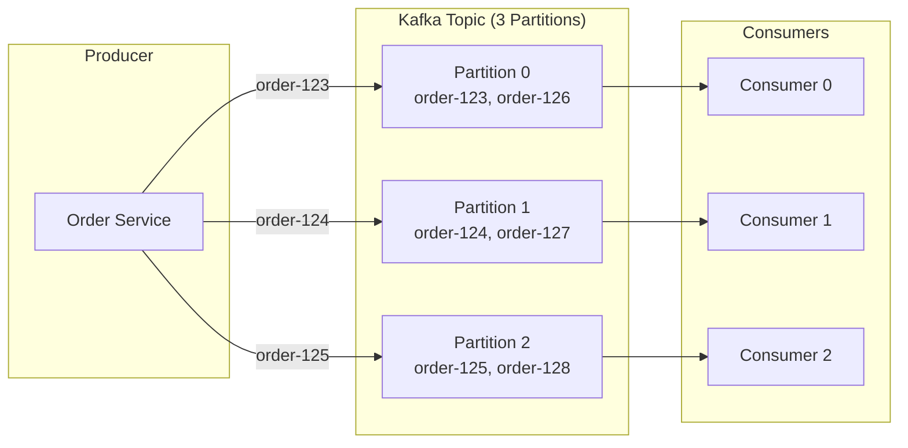
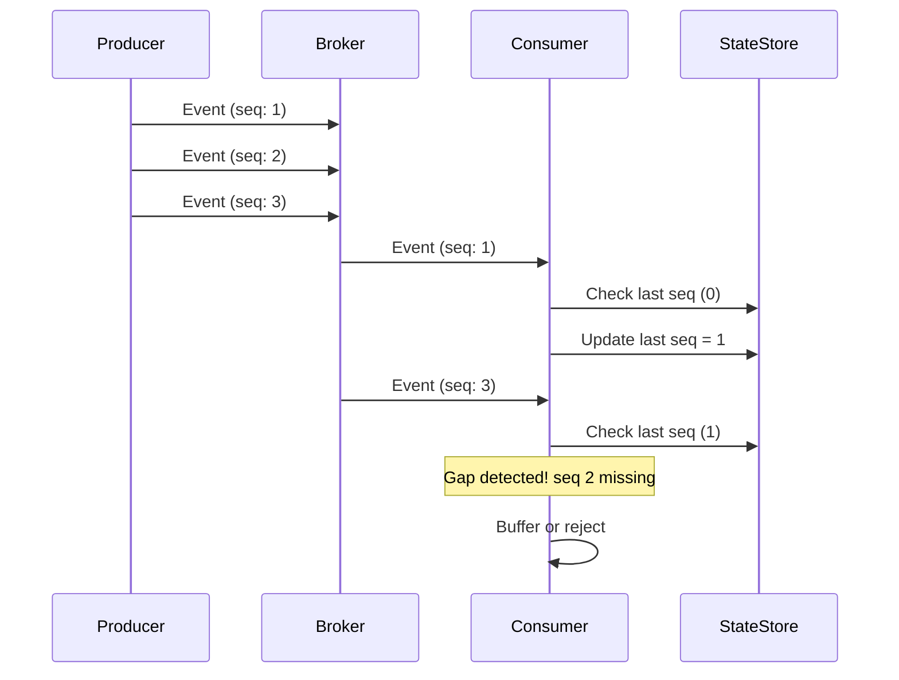
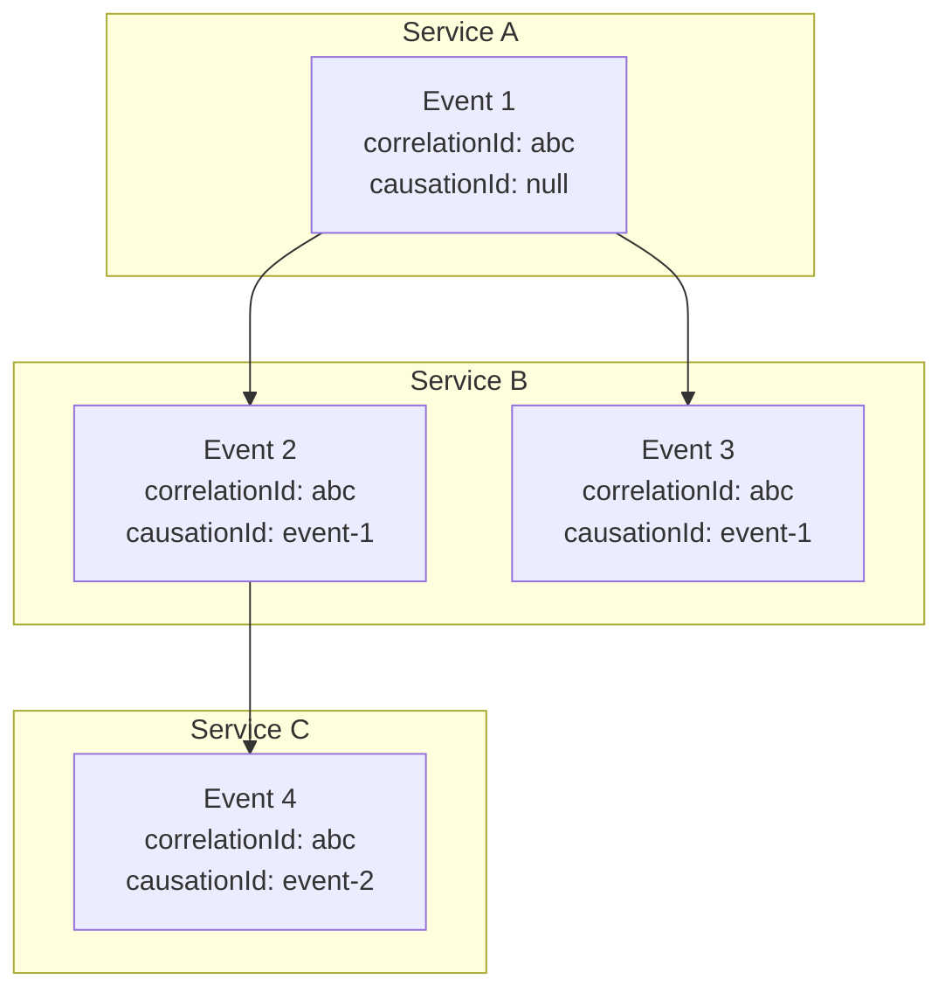

# How to Implement Event Ordering Guarantees

Author: [nawazdhandala](https://github.com/nawazdhandala)

Tags: Event-Driven, Ordering, Distributed Systems, Reliability

Description: Learn to implement event ordering guarantees to ensure correct sequence of event processing across distributed systems.

---

When you build event-driven systems, one question comes up repeatedly: "Will my events arrive in the right order?" The answer depends on how you design your architecture. This guide walks through practical strategies to guarantee event ordering - from partition-based approaches to sequence numbers and idempotent consumers.

---

## Why Event Ordering Matters

Consider an e-commerce system processing order events:

1. `OrderCreated` - Customer places order
2. `PaymentReceived` - Payment confirmed
3. `OrderShipped` - Package sent

If `OrderShipped` arrives before `OrderCreated`, your system breaks. The shipping service has no order to ship. Out-of-order events cause data inconsistencies, failed transactions, and frustrated customers.

---

## Ordering Strategies Overview

| Strategy | Guarantee Level | Complexity | Use Case |
|----------|----------------|------------|----------|
| Partition Key | Per-entity ordering | Low | Most common scenarios |
| Sequence Numbers | Strict global ordering | Medium | Financial transactions |
| Vector Clocks | Causal ordering | High | Multi-writer scenarios |
| Single Partition | Total ordering | Low | Simple, low-throughput |

---

## Strategy 1: Partition-Based Ordering

Most message brokers (Kafka, AWS Kinesis, Azure Event Hubs) guarantee ordering within a partition. Events with the same partition key always go to the same partition and arrive in order.

The flow looks like this:



Here is a TypeScript implementation using Kafka. The key insight is that we use the order ID as the partition key, so all events for the same order land in the same partition.

```typescript
// producer.ts - Publishing events with partition keys
import { Kafka, Partitioners } from 'kafkajs';

const kafka = new Kafka({
  clientId: 'order-service',
  brokers: ['localhost:9092']
});

const producer = kafka.producer({
  // Use default partitioner which hashes the key
  createPartitioner: Partitioners.DefaultPartitioner
});

interface OrderEvent {
  eventType: string;
  orderId: string;
  timestamp: number;
  payload: Record<string, unknown>;
}

// Publish an event with the orderId as the partition key
// All events for the same order go to the same partition
async function publishOrderEvent(event: OrderEvent): Promise<void> {
  await producer.send({
    topic: 'order-events',
    messages: [{
      // The key determines the partition - same key = same partition
      key: event.orderId,
      value: JSON.stringify(event),
      // Optional: include timestamp for debugging
      timestamp: String(event.timestamp)
    }]
  });
}

// Example usage showing three events for one order
async function processOrder(orderId: string): Promise<void> {
  // These three events will always arrive in this exact order
  // because they share the same partition key (orderId)
  await publishOrderEvent({
    eventType: 'OrderCreated',
    orderId,
    timestamp: Date.now(),
    payload: { items: ['item-1', 'item-2'], total: 99.99 }
  });

  await publishOrderEvent({
    eventType: 'PaymentReceived',
    orderId,
    timestamp: Date.now(),
    payload: { transactionId: 'txn-456', amount: 99.99 }
  });

  await publishOrderEvent({
    eventType: 'OrderShipped',
    orderId,
    timestamp: Date.now(),
    payload: { trackingNumber: 'TRACK-789', carrier: 'FedEx' }
  });
}
```

The consumer reads events from its assigned partition in order. No extra logic needed - the broker handles sequencing.

```typescript
// consumer.ts - Reading events in order
import { Kafka, EachMessagePayload } from 'kafkajs';

const kafka = new Kafka({
  clientId: 'order-processor',
  brokers: ['localhost:9092']
});

const consumer = kafka.consumer({ groupId: 'order-processors' });

async function startConsumer(): Promise<void> {
  await consumer.connect();
  await consumer.subscribe({ topic: 'order-events', fromBeginning: false });

  await consumer.run({
    // Process one message at a time to maintain order
    // Setting partitionsConsumedConcurrently: 1 ensures this
    eachMessage: async ({ topic, partition, message }: EachMessagePayload) => {
      const event: OrderEvent = JSON.parse(message.value!.toString());

      console.log(`Processing ${event.eventType} for order ${event.orderId}`);

      // Handle each event type
      switch (event.eventType) {
        case 'OrderCreated':
          await handleOrderCreated(event);
          break;
        case 'PaymentReceived':
          await handlePaymentReceived(event);
          break;
        case 'OrderShipped':
          await handleOrderShipped(event);
          break;
      }
    }
  });
}
```

---

## Strategy 2: Sequence Numbers

When you need strict ordering verification, add sequence numbers to your events. The consumer tracks the last processed sequence and rejects out-of-order messages.



This implementation shows how to track sequence numbers and handle gaps. The producer increments a counter per entity, and the consumer validates the sequence before processing.

```typescript
// sequence-tracker.ts - Handling sequence numbers
interface SequencedEvent {
  entityId: string;
  sequenceNumber: number;
  eventType: string;
  payload: unknown;
}

class SequenceTracker {
  // Track last processed sequence per entity
  private lastSequence: Map<string, number> = new Map();
  // Buffer for out-of-order events waiting for gaps to fill
  private pendingEvents: Map<string, SequencedEvent[]> = new Map();

  // Process an event, handling gaps appropriately
  async processEvent(event: SequencedEvent): Promise<boolean> {
    const lastSeq = this.lastSequence.get(event.entityId) ?? 0;
    const expectedSeq = lastSeq + 1;

    if (event.sequenceNumber === expectedSeq) {
      // Event is in order - process it
      await this.handleEvent(event);
      this.lastSequence.set(event.entityId, event.sequenceNumber);

      // Check if we can process any buffered events now
      await this.processBufferedEvents(event.entityId);
      return true;
    }

    if (event.sequenceNumber > expectedSeq) {
      // Gap detected - buffer this event for later
      console.warn(
        `Gap detected for ${event.entityId}: expected ${expectedSeq}, got ${event.sequenceNumber}`
      );
      this.bufferEvent(event);
      return false;
    }

    // Duplicate or old event - skip it
    console.log(`Skipping duplicate event ${event.sequenceNumber} for ${event.entityId}`);
    return true;
  }

  // Buffer an out-of-order event
  private bufferEvent(event: SequencedEvent): void {
    const buffer = this.pendingEvents.get(event.entityId) ?? [];
    buffer.push(event);
    // Sort by sequence number for efficient processing later
    buffer.sort((a, b) => a.sequenceNumber - b.sequenceNumber);
    this.pendingEvents.set(event.entityId, buffer);
  }

  // Try to process buffered events after filling a gap
  private async processBufferedEvents(entityId: string): Promise<void> {
    const buffer = this.pendingEvents.get(entityId);
    if (!buffer || buffer.length === 0) return;

    let lastSeq = this.lastSequence.get(entityId) ?? 0;

    // Process events in order from the buffer
    while (buffer.length > 0 && buffer[0].sequenceNumber === lastSeq + 1) {
      const event = buffer.shift()!;
      await this.handleEvent(event);
      lastSeq = event.sequenceNumber;
      this.lastSequence.set(entityId, lastSeq);
    }
  }

  private async handleEvent(event: SequencedEvent): Promise<void> {
    console.log(`Processing event ${event.sequenceNumber}: ${event.eventType}`);
    // Actual event handling logic here
  }
}
```

---

## Strategy 3: Idempotent Consumers

Even with ordering guarantees, network issues can cause duplicate deliveries. Build idempotent consumers that produce the same result regardless of how many times they process an event.

The key techniques are shown in this table:

| Technique | Implementation | Best For |
|-----------|---------------|----------|
| Event ID tracking | Store processed event IDs | All event types |
| Upsert operations | INSERT ON CONFLICT UPDATE | State changes |
| Conditional updates | UPDATE WHERE version = X | Concurrent writes |
| Idempotency keys | Client-provided unique keys | API requests |

Here is a practical implementation using PostgreSQL for deduplication. Each event gets a unique ID, and we check against a processed events table before handling.

```typescript
// idempotent-consumer.ts - Deduplication with database
import { Pool } from 'pg';

const pool = new Pool({ connectionString: process.env.DATABASE_URL });

interface Event {
  eventId: string;
  entityId: string;
  eventType: string;
  payload: unknown;
  timestamp: number;
}

// Process an event exactly once using database deduplication
async function processEventIdempotently(event: Event): Promise<void> {
  const client = await pool.connect();

  try {
    await client.query('BEGIN');

    // Try to insert the event ID - fails if already processed
    const result = await client.query(
      `INSERT INTO processed_events (event_id, entity_id, processed_at)
       VALUES ($1, $2, NOW())
       ON CONFLICT (event_id) DO NOTHING
       RETURNING event_id`,
      [event.eventId, event.entityId]
    );

    if (result.rowCount === 0) {
      // Event already processed - skip
      console.log(`Skipping duplicate event: ${event.eventId}`);
      await client.query('ROLLBACK');
      return;
    }

    // Process the event within the same transaction
    await handleEventInTransaction(client, event);

    await client.query('COMMIT');
    console.log(`Successfully processed event: ${event.eventId}`);
  } catch (error) {
    await client.query('ROLLBACK');
    throw error;
  } finally {
    client.release();
  }
}

// Handle the event with optimistic locking
async function handleEventInTransaction(client: any, event: Event): Promise<void> {
  if (event.eventType === 'OrderStatusChanged') {
    // Use optimistic locking - only update if version matches
    const updateResult = await client.query(
      `UPDATE orders
       SET status = $1, version = version + 1, updated_at = NOW()
       WHERE id = $2 AND version = $3
       RETURNING id`,
      [event.payload.newStatus, event.entityId, event.payload.expectedVersion]
    );

    if (updateResult.rowCount === 0) {
      throw new Error(`Optimistic lock failed for order ${event.entityId}`);
    }
  }
}
```

---

## Handling Ordering Across Services

When events flow through multiple services, maintaining order gets harder. Use correlation IDs and causation tracking to preserve relationships.



Each event carries two IDs: the correlation ID (shared across the entire flow) and the causation ID (pointing to the event that triggered this one). This lets you reconstruct the exact causal chain.

```typescript
// correlation.ts - Tracking event causation
interface CausalEvent {
  eventId: string;
  correlationId: string;  // Shared across entire flow
  causationId: string | null;  // ID of event that caused this one
  eventType: string;
  payload: unknown;
}

// When creating a derived event, link it to its cause
function createDerivedEvent(
  sourceEvent: CausalEvent,
  eventType: string,
  payload: unknown
): CausalEvent {
  return {
    eventId: generateUUID(),
    // Preserve correlation ID to link entire flow
    correlationId: sourceEvent.correlationId,
    // Point to the event that triggered this one
    causationId: sourceEvent.eventId,
    eventType,
    payload
  };
}

// Reconstruct event order using causation chain
function orderEventsByCausation(events: CausalEvent[]): CausalEvent[] {
  const ordered: CausalEvent[] = [];
  const remaining = new Set(events);

  // Find root events (no causation ID)
  for (const event of events) {
    if (!event.causationId) {
      ordered.push(event);
      remaining.delete(event);
    }
  }

  // Add events whose cause has been processed
  while (remaining.size > 0) {
    for (const event of remaining) {
      const causeProcessed = ordered.some(e => e.eventId === event.causationId);
      if (causeProcessed) {
        ordered.push(event);
        remaining.delete(event);
      }
    }
  }

  return ordered;
}
```

---

## Common Pitfalls

Watch out for these issues when implementing ordering guarantees:

1. **Consumer parallelism** - Multiple consumers processing the same partition breaks ordering. Use one consumer per partition or process sequentially within each partition.

2. **Retries without deduplication** - Retrying failed events without idempotency causes duplicates. Always combine ordering with exactly-once processing.

3. **Time-based assumptions** - Do not rely on timestamps for ordering. Clocks drift, and network delays vary. Use sequence numbers or partition ordering instead.

4. **Cross-partition queries** - Aggregating data across partitions gives inconsistent views. Design your partition keys around query patterns.

---

## Summary

Event ordering in distributed systems requires deliberate design choices:

- Use **partition keys** to group related events on the same partition
- Add **sequence numbers** when you need strict verification
- Build **idempotent consumers** to handle duplicates safely
- Track **correlation and causation IDs** for cross-service flows

Start with partition-based ordering - it covers most use cases with minimal complexity. Add sequence tracking only when your domain requires strict ordering verification. Always implement idempotency regardless of your ordering strategy.

---

**Related Reading:**

- [What are Traces and Spans in OpenTelemetry](https://oneuptime.com/blog/post/2025-08-27-traces-and-spans-in-opentelemetry/view)
- [SRE Best Practices](https://oneuptime.com/blog/post/2025-11-28-sre-best-practices/view)
