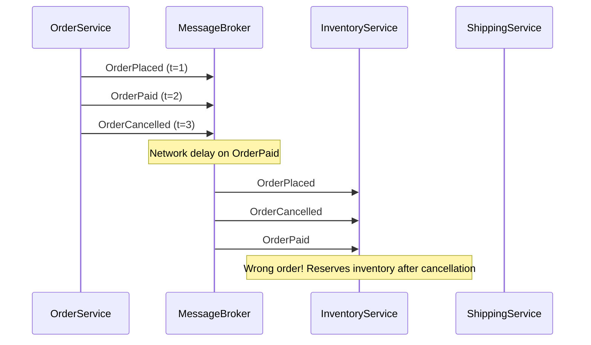
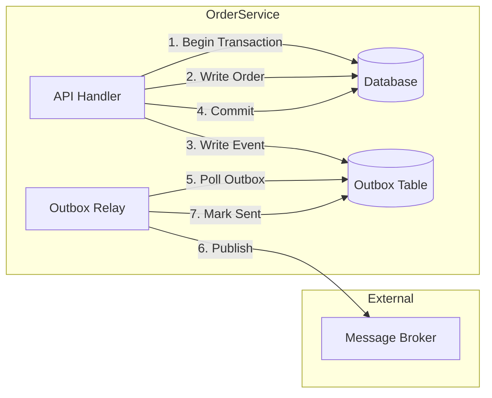
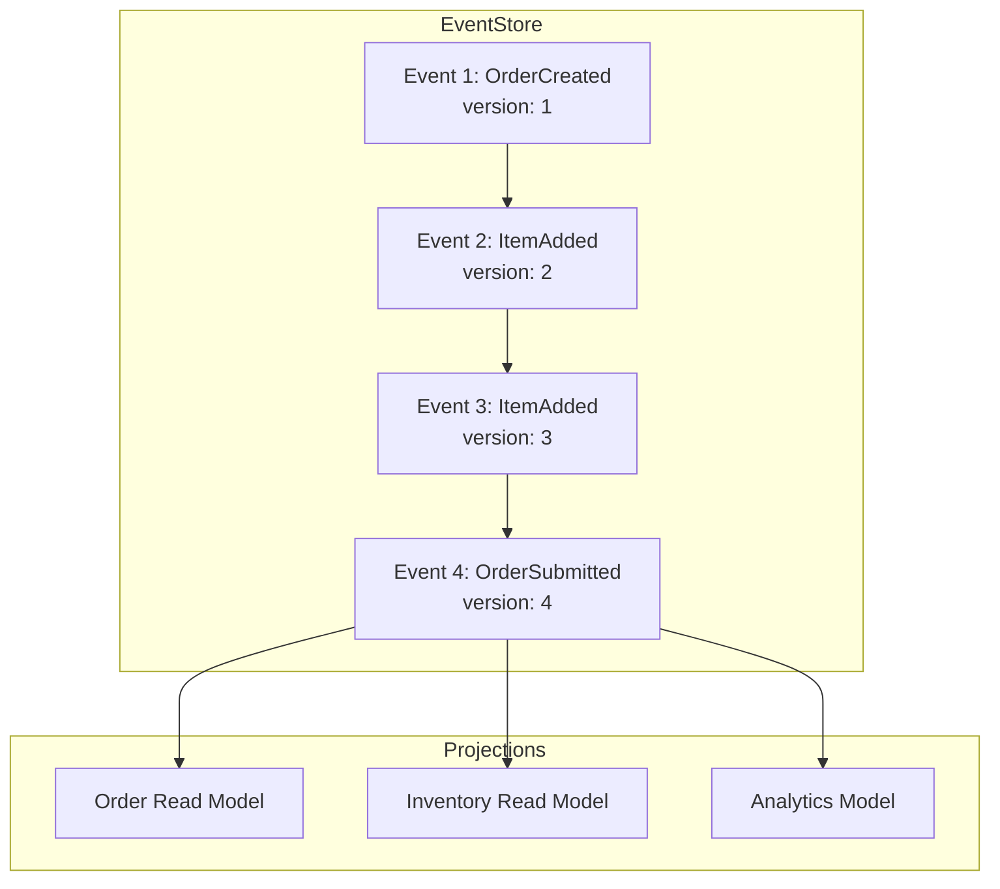
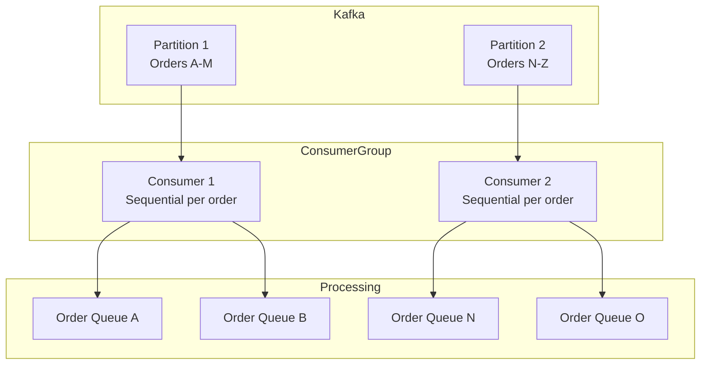
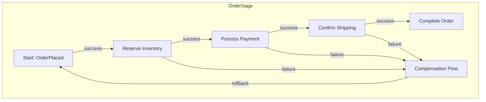

# How to Implement Event Ordering in Microservices

Author: [nawazdhandala](https://github.com/nawazdhandala)

Tags: Microservices, Event-Driven Architecture, Distributed Systems, Outbox Pattern, Event Sourcing

Description: A practical guide to maintaining event order across microservices using the Outbox Pattern, transactional messaging, and event sourcing techniques.

---

Microservices communicate through events. When Service A publishes an event, Service B reacts. Simple enough until you realize events can arrive out of order, get lost, or duplicate. This guide shows you how to implement reliable event ordering patterns that work in production.

---

## The Core Problem

In a monolith, method calls happen in sequence. In microservices, that guarantee disappears. Consider this order processing flow:



The inventory service receives `OrderCancelled` before `OrderPaid`. It cancels an order that looks unpaid, then receives payment confirmation for a cancelled order. Data inconsistency follows.

---

## Pattern 1: The Outbox Pattern

The Outbox Pattern solves the dual-write problem: you need to update your database AND publish an event, but either operation can fail independently.



The key insight: write the event to a local outbox table in the same database transaction as your business data. A separate process reads the outbox and publishes events. If publishing fails, the relay retries. Events always match the database state and maintain their order.

Here is the database schema for the outbox table. We include a sequence number per aggregate to guarantee ordering.

```sql
-- outbox_events table stores events until they're published
-- The sequence_number ensures ordering within each aggregate
CREATE TABLE outbox_events (
    id UUID PRIMARY KEY DEFAULT gen_random_uuid(),
    aggregate_type VARCHAR(255) NOT NULL,
    aggregate_id VARCHAR(255) NOT NULL,
    event_type VARCHAR(255) NOT NULL,
    payload JSONB NOT NULL,
    sequence_number BIGINT NOT NULL,
    created_at TIMESTAMP DEFAULT NOW(),
    published_at TIMESTAMP NULL,

    -- Ensure unique sequence per aggregate
    UNIQUE(aggregate_type, aggregate_id, sequence_number)
);

-- Index for efficient polling of unpublished events
CREATE INDEX idx_outbox_unpublished
ON outbox_events(created_at)
WHERE published_at IS NULL;
```

This TypeScript implementation shows how to write to the outbox within your business transaction.

```typescript
// outbox-writer.ts
import { Pool, PoolClient } from 'pg';

interface OutboxEvent {
  aggregateType: string;
  aggregateId: string;
  eventType: string;
  payload: Record<string, unknown>;
}

export class OutboxWriter {
  constructor(private pool: Pool) {}

  // Write business data and event in one transaction
  // This guarantees atomicity - either both succeed or both fail
  async executeWithOutbox<T>(
    operation: (client: PoolClient) => Promise<T>,
    event: OutboxEvent
  ): Promise<T> {
    const client = await this.pool.connect();

    try {
      await client.query('BEGIN');

      // Execute the business operation first
      const result = await operation(client);

      // Get next sequence number for this aggregate
      // Using COALESCE handles the first event case
      const seqResult = await client.query(
        `SELECT COALESCE(MAX(sequence_number), 0) + 1 as next_seq
         FROM outbox_events
         WHERE aggregate_type = $1 AND aggregate_id = $2`,
        [event.aggregateType, event.aggregateId]
      );
      const sequenceNumber = seqResult.rows[0].next_seq;

      // Insert into outbox table within the same transaction
      await client.query(
        `INSERT INTO outbox_events
         (aggregate_type, aggregate_id, event_type, payload, sequence_number)
         VALUES ($1, $2, $3, $4, $5)`,
        [
          event.aggregateType,
          event.aggregateId,
          event.eventType,
          JSON.stringify(event.payload),
          sequenceNumber
        ]
      );

      await client.query('COMMIT');
      return result;
    } catch (error) {
      await client.query('ROLLBACK');
      throw error;
    } finally {
      client.release();
    }
  }
}
```

The outbox relay polls the table and publishes events. It processes events in order per aggregate.

```typescript
// outbox-relay.ts
import { Pool } from 'pg';
import { Kafka, Producer } from 'kafkajs';

export class OutboxRelay {
  private producer: Producer;
  private running = false;

  constructor(
    private pool: Pool,
    kafka: Kafka,
    private pollIntervalMs = 100
  ) {
    this.producer = kafka.producer();
  }

  async start(): Promise<void> {
    await this.producer.connect();
    this.running = true;

    // Continuous polling loop
    while (this.running) {
      await this.processOutbox();
      await this.sleep(this.pollIntervalMs);
    }
  }

  async stop(): Promise<void> {
    this.running = false;
    await this.producer.disconnect();
  }

  private async processOutbox(): Promise<void> {
    const client = await this.pool.connect();

    try {
      // Lock and fetch unpublished events ordered by sequence
      // FOR UPDATE SKIP LOCKED prevents multiple relays from processing same events
      const result = await client.query(
        `SELECT id, aggregate_type, aggregate_id, event_type, payload, sequence_number
         FROM outbox_events
         WHERE published_at IS NULL
         ORDER BY aggregate_type, aggregate_id, sequence_number
         LIMIT 100
         FOR UPDATE SKIP LOCKED`
      );

      for (const row of result.rows) {
        // Use aggregate_id as partition key for ordering within Kafka
        await this.producer.send({
          topic: `${row.aggregate_type}-events`,
          messages: [{
            key: row.aggregate_id,
            value: JSON.stringify({
              eventId: row.id,
              eventType: row.event_type,
              aggregateId: row.aggregate_id,
              sequenceNumber: row.sequence_number,
              payload: row.payload,
              timestamp: Date.now()
            })
          }]
        });

        // Mark as published after successful send
        await client.query(
          `UPDATE outbox_events SET published_at = NOW() WHERE id = $1`,
          [row.id]
        );
      }
    } finally {
      client.release();
    }
  }

  private sleep(ms: number): Promise<void> {
    return new Promise(resolve => setTimeout(resolve, ms));
  }
}
```

---

## Pattern 2: Event Sourcing for Natural Ordering

Event sourcing stores all changes as an ordered sequence of events. The event log becomes your source of truth, and ordering is built into the design.



This implementation shows an event-sourced aggregate with version tracking. The version number guarantees ordering and enables optimistic concurrency.

```typescript
// event-sourcing.ts

// Base event interface with ordering metadata
interface DomainEvent {
  eventId: string;
  aggregateId: string;
  version: number;
  eventType: string;
  timestamp: number;
  payload: Record<string, unknown>;
}

// Order aggregate maintains its state through events
class Order {
  private id: string;
  private status: string = 'draft';
  private items: string[] = [];
  private version: number = 0;
  private uncommittedEvents: DomainEvent[] = [];

  constructor(id: string) {
    this.id = id;
  }

  // Reconstruct state by replaying events in order
  // Events must be applied in version sequence
  static fromEvents(id: string, events: DomainEvent[]): Order {
    const order = new Order(id);

    // Sort by version to ensure correct order
    const sorted = events.sort((a, b) => a.version - b.version);

    for (const event of sorted) {
      order.applyEvent(event, false);
    }

    return order;
  }

  addItem(itemId: string): void {
    if (this.status !== 'draft') {
      throw new Error('Cannot add items to submitted order');
    }

    // Record the event with next version number
    this.recordEvent('ItemAdded', { itemId });
  }

  submit(): void {
    if (this.items.length === 0) {
      throw new Error('Cannot submit empty order');
    }

    this.recordEvent('OrderSubmitted', {});
  }

  // Apply event to update internal state
  private applyEvent(event: DomainEvent, isNew: boolean): void {
    switch (event.eventType) {
      case 'OrderCreated':
        this.status = 'draft';
        break;
      case 'ItemAdded':
        this.items.push(event.payload.itemId as string);
        break;
      case 'OrderSubmitted':
        this.status = 'submitted';
        break;
    }

    this.version = event.version;

    if (isNew) {
      this.uncommittedEvents.push(event);
    }
  }

  private recordEvent(eventType: string, payload: Record<string, unknown>): void {
    const event: DomainEvent = {
      eventId: crypto.randomUUID(),
      aggregateId: this.id,
      version: this.version + 1,
      eventType,
      timestamp: Date.now(),
      payload
    };

    this.applyEvent(event, true);
  }

  getUncommittedEvents(): DomainEvent[] {
    return [...this.uncommittedEvents];
  }

  clearUncommittedEvents(): void {
    this.uncommittedEvents = [];
  }

  getVersion(): number {
    return this.version;
  }
}
```

The event store persists events with optimistic locking. If two processes try to append events with the same version, one fails and must retry.

```typescript
// event-store.ts
import { Pool } from 'pg';

export class EventStore {
  constructor(private pool: Pool) {}

  // Append events with optimistic concurrency control
  // Expected version must match current version in store
  async appendEvents(
    aggregateId: string,
    events: DomainEvent[],
    expectedVersion: number
  ): Promise<void> {
    const client = await this.pool.connect();

    try {
      await client.query('BEGIN');

      // Check current version matches expected
      // This prevents concurrent writes from corrupting order
      const versionCheck = await client.query(
        `SELECT COALESCE(MAX(version), 0) as current_version
         FROM events
         WHERE aggregate_id = $1`,
        [aggregateId]
      );

      const currentVersion = versionCheck.rows[0].current_version;

      if (currentVersion !== expectedVersion) {
        throw new Error(
          `Concurrency conflict: expected version ${expectedVersion}, found ${currentVersion}`
        );
      }

      // Insert all events in order
      for (const event of events) {
        await client.query(
          `INSERT INTO events
           (event_id, aggregate_id, version, event_type, payload, timestamp)
           VALUES ($1, $2, $3, $4, $5, $6)`,
          [
            event.eventId,
            event.aggregateId,
            event.version,
            event.eventType,
            JSON.stringify(event.payload),
            new Date(event.timestamp)
          ]
        );
      }

      await client.query('COMMIT');
    } catch (error) {
      await client.query('ROLLBACK');
      throw error;
    } finally {
      client.release();
    }
  }

  // Load all events for an aggregate in version order
  async loadEvents(aggregateId: string): Promise<DomainEvent[]> {
    const result = await this.pool.query(
      `SELECT event_id, aggregate_id, version, event_type, payload, timestamp
       FROM events
       WHERE aggregate_id = $1
       ORDER BY version ASC`,
      [aggregateId]
    );

    return result.rows.map(row => ({
      eventId: row.event_id,
      aggregateId: row.aggregate_id,
      version: row.version,
      eventType: row.event_type,
      payload: row.payload,
      timestamp: row.timestamp.getTime()
    }));
  }
}
```

---

## Pattern 3: Ordered Event Consumers

Even with properly ordered publishing, consumers can break ordering through parallel processing. This pattern shows how to maintain order while still achieving throughput.



The consumer uses per-entity queues to process events for different entities in parallel while maintaining strict ordering within each entity.

```typescript
// ordered-consumer.ts
import { Kafka, Consumer, EachMessagePayload } from 'kafkajs';

interface OrderedEvent {
  eventId: string;
  aggregateId: string;
  sequenceNumber: number;
  eventType: string;
  payload: Record<string, unknown>;
}

export class OrderedEventConsumer {
  private consumer: Consumer;
  // Track last processed sequence per aggregate
  private lastProcessed: Map<string, number> = new Map();
  // Buffer for out-of-order events
  private pendingEvents: Map<string, OrderedEvent[]> = new Map();
  // Locks to prevent parallel processing of same aggregate
  private processingLocks: Set<string> = new Set();

  constructor(kafka: Kafka, groupId: string) {
    this.consumer = kafka.consumer({ groupId });
  }

  async start(
    topic: string,
    handler: (event: OrderedEvent) => Promise<void>
  ): Promise<void> {
    await this.consumer.connect();
    await this.consumer.subscribe({ topic, fromBeginning: false });

    await this.consumer.run({
      // Process messages from each partition sequentially
      // This maintains partition-level ordering
      partitionsConsumedConcurrently: 1,

      eachMessage: async ({ message }: EachMessagePayload) => {
        const event: OrderedEvent = JSON.parse(message.value!.toString());
        await this.processWithOrdering(event, handler);
      }
    });
  }

  private async processWithOrdering(
    event: OrderedEvent,
    handler: (event: OrderedEvent) => Promise<void>
  ): Promise<void> {
    const { aggregateId, sequenceNumber } = event;

    // Wait if another event for this aggregate is being processed
    while (this.processingLocks.has(aggregateId)) {
      await this.sleep(10);
    }

    this.processingLocks.add(aggregateId);

    try {
      const lastSeq = this.lastProcessed.get(aggregateId) ?? 0;
      const expectedSeq = lastSeq + 1;

      if (sequenceNumber === expectedSeq) {
        // Process in-order event
        await handler(event);
        this.lastProcessed.set(aggregateId, sequenceNumber);

        // Try to process any buffered events
        await this.drainPendingEvents(aggregateId, handler);
      } else if (sequenceNumber > expectedSeq) {
        // Buffer out-of-order event
        this.bufferEvent(event);

        // Log gap for monitoring
        console.warn(
          `Event gap for ${aggregateId}: expected ${expectedSeq}, got ${sequenceNumber}`
        );
      }
      // Skip if sequenceNumber <= lastSeq (duplicate)
    } finally {
      this.processingLocks.delete(aggregateId);
    }
  }

  private bufferEvent(event: OrderedEvent): void {
    const buffer = this.pendingEvents.get(event.aggregateId) ?? [];
    buffer.push(event);
    buffer.sort((a, b) => a.sequenceNumber - b.sequenceNumber);
    this.pendingEvents.set(event.aggregateId, buffer);
  }

  private async drainPendingEvents(
    aggregateId: string,
    handler: (event: OrderedEvent) => Promise<void>
  ): Promise<void> {
    const buffer = this.pendingEvents.get(aggregateId);
    if (!buffer || buffer.length === 0) return;

    let lastSeq = this.lastProcessed.get(aggregateId) ?? 0;

    while (buffer.length > 0 && buffer[0].sequenceNumber === lastSeq + 1) {
      const event = buffer.shift()!;
      await handler(event);
      lastSeq = event.sequenceNumber;
      this.lastProcessed.set(aggregateId, lastSeq);
    }

    if (buffer.length === 0) {
      this.pendingEvents.delete(aggregateId);
    }
  }

  private sleep(ms: number): Promise<void> {
    return new Promise(resolve => setTimeout(resolve, ms));
  }
}
```

---

## Pattern 4: Saga Coordination

When a business process spans multiple services, you need to coordinate events across boundaries. The Saga pattern orchestrates this while maintaining ordering guarantees.



This saga implementation tracks state and ensures events are processed in the correct order.

```typescript
// saga-orchestrator.ts

type SagaStatus = 'pending' | 'running' | 'completed' | 'compensating' | 'failed';

interface SagaStep {
  name: string;
  execute: (context: Record<string, unknown>) => Promise<void>;
  compensate: (context: Record<string, unknown>) => Promise<void>;
}

interface SagaState {
  sagaId: string;
  status: SagaStatus;
  currentStep: number;
  completedSteps: string[];
  context: Record<string, unknown>;
  createdAt: number;
  updatedAt: number;
}

export class SagaOrchestrator {
  private steps: SagaStep[] = [];

  constructor(private stateStore: SagaStateStore) {}

  // Define saga steps in order
  // Each step has an execute and compensate function
  addStep(step: SagaStep): this {
    this.steps.push(step);
    return this;
  }

  async execute(sagaId: string, initialContext: Record<string, unknown>): Promise<void> {
    // Initialize saga state
    let state: SagaState = {
      sagaId,
      status: 'running',
      currentStep: 0,
      completedSteps: [],
      context: initialContext,
      createdAt: Date.now(),
      updatedAt: Date.now()
    };

    await this.stateStore.save(state);

    // Execute steps in order
    for (let i = 0; i < this.steps.length; i++) {
      const step = this.steps[i];
      state.currentStep = i;

      try {
        console.log(`Executing step: ${step.name}`);
        await step.execute(state.context);

        state.completedSteps.push(step.name);
        state.updatedAt = Date.now();
        await this.stateStore.save(state);
      } catch (error) {
        console.error(`Step ${step.name} failed:`, error);
        state.status = 'compensating';
        await this.stateStore.save(state);

        // Run compensation in reverse order
        await this.compensate(state);
        return;
      }
    }

    state.status = 'completed';
    state.updatedAt = Date.now();
    await this.stateStore.save(state);
  }

  // Compensate completed steps in reverse order
  // This maintains consistency when a step fails
  private async compensate(state: SagaState): Promise<void> {
    // Reverse through completed steps
    for (let i = state.completedSteps.length - 1; i >= 0; i--) {
      const stepName = state.completedSteps[i];
      const step = this.steps.find(s => s.name === stepName);

      if (step) {
        try {
          console.log(`Compensating step: ${step.name}`);
          await step.compensate(state.context);
        } catch (compensateError) {
          // Log but continue compensating other steps
          console.error(`Compensation failed for ${step.name}:`, compensateError);
        }
      }
    }

    state.status = 'failed';
    state.updatedAt = Date.now();
    await this.stateStore.save(state);
  }
}

// Example: Order processing saga
function createOrderSaga(stateStore: SagaStateStore): SagaOrchestrator {
  return new SagaOrchestrator(stateStore)
    .addStep({
      name: 'reserveInventory',
      execute: async (ctx) => {
        // Call inventory service
        const reservation = await inventoryService.reserve(ctx.orderId, ctx.items);
        ctx.reservationId = reservation.id;
      },
      compensate: async (ctx) => {
        // Release inventory reservation
        await inventoryService.release(ctx.reservationId);
      }
    })
    .addStep({
      name: 'processPayment',
      execute: async (ctx) => {
        // Charge customer
        const payment = await paymentService.charge(ctx.customerId, ctx.amount);
        ctx.paymentId = payment.id;
      },
      compensate: async (ctx) => {
        // Refund payment
        await paymentService.refund(ctx.paymentId);
      }
    })
    .addStep({
      name: 'confirmShipping',
      execute: async (ctx) => {
        // Schedule shipment
        const shipment = await shippingService.schedule(ctx.orderId, ctx.address);
        ctx.shipmentId = shipment.id;
      },
      compensate: async (ctx) => {
        // Cancel shipment
        await shippingService.cancel(ctx.shipmentId);
      }
    });
}
```

---

## Testing Event Ordering

Verifying ordering guarantees requires specific test patterns. Here is how to test that your system handles ordering correctly.

```typescript
// ordering-tests.ts
import { describe, it, expect, beforeEach } from 'vitest';

describe('Event Ordering', () => {
  let consumer: OrderedEventConsumer;
  let processedEvents: OrderedEvent[];

  beforeEach(() => {
    processedEvents = [];
    consumer = new OrderedEventConsumer(kafka, 'test-group');
  });

  it('processes events in sequence order', async () => {
    // Simulate events arriving out of order
    const events = [
      { aggregateId: 'order-1', sequenceNumber: 3, eventType: 'C' },
      { aggregateId: 'order-1', sequenceNumber: 1, eventType: 'A' },
      { aggregateId: 'order-1', sequenceNumber: 2, eventType: 'B' }
    ];

    for (const event of events) {
      await consumer.processWithOrdering(event, async (e) => {
        processedEvents.push(e);
      });
    }

    // Events should be processed in order despite arrival order
    expect(processedEvents.map(e => e.eventType)).toEqual(['A', 'B', 'C']);
  });

  it('handles events for different aggregates independently', async () => {
    const events = [
      { aggregateId: 'order-1', sequenceNumber: 1, eventType: 'A1' },
      { aggregateId: 'order-2', sequenceNumber: 1, eventType: 'B1' },
      { aggregateId: 'order-1', sequenceNumber: 2, eventType: 'A2' },
      { aggregateId: 'order-2', sequenceNumber: 2, eventType: 'B2' }
    ];

    for (const event of events) {
      await consumer.processWithOrdering(event, async (e) => {
        processedEvents.push(e);
      });
    }

    // Order-1 events maintain order relative to each other
    const order1Events = processedEvents
      .filter(e => e.aggregateId === 'order-1')
      .map(e => e.sequenceNumber);
    expect(order1Events).toEqual([1, 2]);

    // Order-2 events maintain order relative to each other
    const order2Events = processedEvents
      .filter(e => e.aggregateId === 'order-2')
      .map(e => e.sequenceNumber);
    expect(order2Events).toEqual([1, 2]);
  });

  it('skips duplicate events', async () => {
    const events = [
      { aggregateId: 'order-1', sequenceNumber: 1, eventType: 'A' },
      { aggregateId: 'order-1', sequenceNumber: 1, eventType: 'A' }, // duplicate
      { aggregateId: 'order-1', sequenceNumber: 2, eventType: 'B' }
    ];

    for (const event of events) {
      await consumer.processWithOrdering(event, async (e) => {
        processedEvents.push(e);
      });
    }

    // Duplicate should be skipped
    expect(processedEvents.length).toBe(2);
    expect(processedEvents.map(e => e.eventType)).toEqual(['A', 'B']);
  });
});
```

---

## Monitoring Event Order

Track these metrics to catch ordering issues before they impact users:

| Metric | Description | Alert Threshold |
|--------|-------------|-----------------|
| event_gap_count | Number of sequence gaps detected | > 0 |
| buffer_size | Events waiting in reorder buffer | > 1000 |
| processing_lag | Time between event creation and processing | > 5s |
| duplicate_count | Events skipped as duplicates | Trend increase |
| compensation_triggered | Saga compensations executed | Any occurrence |

```typescript
// metrics.ts - Example Prometheus metrics
import { Counter, Gauge, Histogram } from 'prom-client';

export const eventMetrics = {
  // Count sequence gaps by aggregate type
  gapCount: new Counter({
    name: 'event_ordering_gaps_total',
    help: 'Number of sequence gaps detected',
    labelNames: ['aggregate_type']
  }),

  // Track buffer size per consumer
  bufferSize: new Gauge({
    name: 'event_ordering_buffer_size',
    help: 'Events in reorder buffer',
    labelNames: ['consumer_id']
  }),

  // Measure end-to-end latency
  processingLag: new Histogram({
    name: 'event_processing_lag_seconds',
    help: 'Time from event creation to processing',
    labelNames: ['event_type'],
    buckets: [0.1, 0.5, 1, 2, 5, 10]
  })
};
```

---

## Key Takeaways

Event ordering in microservices requires deliberate architecture choices:

1. **Use the Outbox Pattern** to guarantee events match database state and publish in order
2. **Consider Event Sourcing** when ordering is central to your domain model
3. **Process sequentially per entity** while parallelizing across entities
4. **Implement Sagas** for multi-service transactions with clear compensation paths
5. **Monitor ordering metrics** to catch issues early

Start with the Outbox Pattern for most use cases. It provides strong guarantees with moderate complexity. Add event sourcing only if your domain naturally fits an append-only event log. Always test ordering explicitly since ordering bugs are subtle and hard to debug in production.

---

**Related Reading:**

- [Event Ordering Guarantees in Distributed Systems](https://oneuptime.com/blog/post/2026-01-30-event-ordering-guarantees/view)
- [What are Traces and Spans in OpenTelemetry](https://oneuptime.com/blog/post/2025-08-27-traces-and-spans-in-opentelemetry/view)
- [SRE Best Practices](https://oneuptime.com/blog/post/2025-11-28-sre-best-practices/view)
