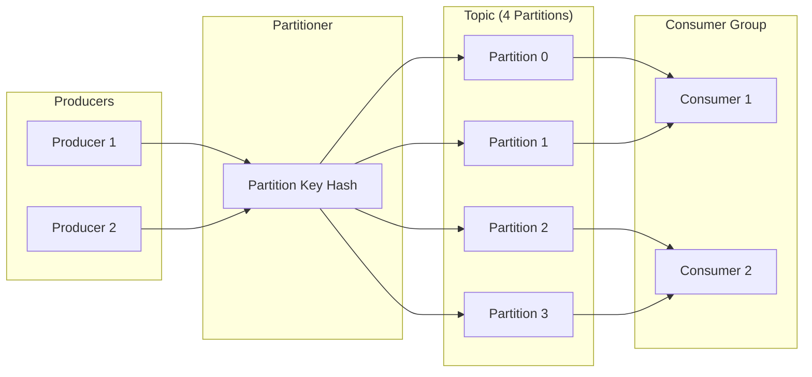
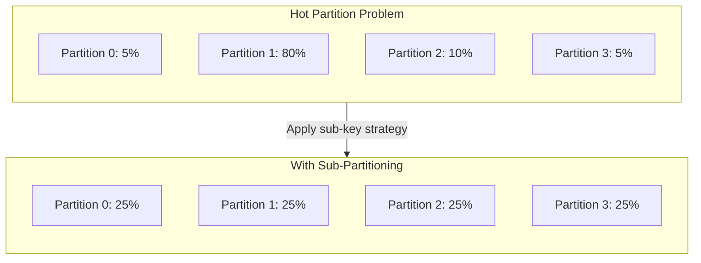
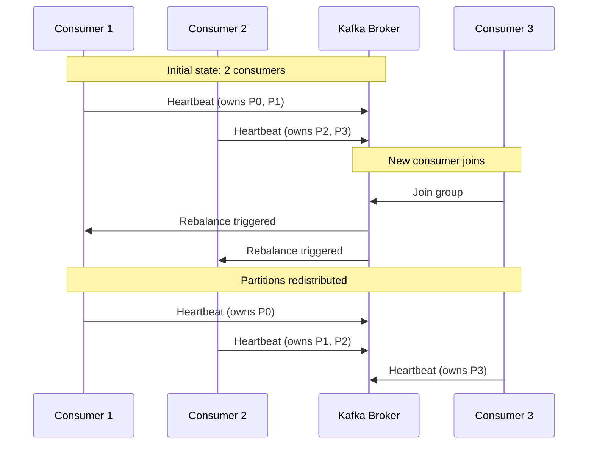

# How to Build Event Partitioning Strategies

Author: [nawazdhandala](https://github.com/nawazdhandala)

Tags: Event-Driven, Partitioning, Kafka, Scalability

Description: Learn to build event partitioning strategies for scalable and ordered event processing in distributed systems.

---

Event-driven architectures depend on how you distribute events across partitions. Get it wrong and you end up with hot partitions, out-of-order processing, or throughput bottlenecks. Get it right and your system scales horizontally while maintaining the ordering guarantees your business logic requires.

This guide covers practical partitioning strategies, when to use each one, and how to implement them in production systems.

---

## Why Partitioning Matters

Partitioning serves two primary purposes: parallelism and ordering. Events in the same partition are processed sequentially by a single consumer, while events in different partitions can be processed in parallel by multiple consumers.

| Goal | Partitioning Approach |
|------|----------------------|
| Maximize throughput | Spread events evenly across many partitions |
| Guarantee ordering for related events | Group related events in the same partition |
| Balance both | Choose partition keys that achieve natural distribution while respecting ordering requirements |

The fundamental trade-off: more partitions enable more parallelism but make ordering harder to reason about.

---

## How Event Routing Works

The diagram below shows how events flow from producers through partition assignment to consumers.



Each producer sends events with a partition key. The partitioner hashes the key and assigns the event to a specific partition. Consumers in a group each handle a subset of partitions.

---

## Common Partitioning Strategies

### 1. Entity-Based Partitioning

Partition by entity ID when you need all events for a specific entity processed in order.

The following code demonstrates partitioning order events by customer ID. This ensures all orders from the same customer are processed sequentially.

```typescript
// partition-by-entity.ts
import { Kafka, Partitioners } from 'kafkajs';

const kafka = new Kafka({
  clientId: 'order-service',
  brokers: ['localhost:9092']
});

const producer = kafka.producer({
  // Use default partitioner which hashes the key
  createPartitioner: Partitioners.DefaultPartitioner
});

interface OrderEvent {
  orderId: string;
  customerId: string;
  items: Array<{ sku: string; quantity: number }>;
  total: number;
  timestamp: number;
}

// Send order events partitioned by customer ID
// All events for the same customer go to the same partition
async function publishOrderEvent(event: OrderEvent): Promise<void> {
  await producer.send({
    topic: 'orders',
    messages: [{
      // Customer ID as partition key ensures ordering per customer
      key: event.customerId,
      value: JSON.stringify(event),
      headers: {
        'event-type': 'order.created'
      }
    }]
  });
}
```

Use entity-based partitioning when:
- Event ordering matters per entity (orders for a customer, transactions for an account)
- Downstream consumers need to build entity state from event sequences
- You have many distinct entities to achieve good distribution

### 2. Time-Based Partitioning

Partition by time windows when events do not require strict ordering but you need predictable data distribution and retention.

This approach assigns events to partitions based on time buckets. It works well for analytics pipelines where you process data in time windows.

```typescript
// partition-by-time.ts
import { Kafka } from 'kafkajs';

const kafka = new Kafka({
  clientId: 'metrics-collector',
  brokers: ['localhost:9092']
});

const producer = kafka.producer();

interface MetricEvent {
  metricName: string;
  value: number;
  tags: Record<string, string>;
  timestamp: number;
}

// Calculate partition based on time bucket (hourly windows)
// Events from the same hour go to the same partition
function getTimePartitionKey(timestamp: number): string {
  const date = new Date(timestamp);
  const hourBucket = Math.floor(date.getTime() / (1000 * 60 * 60));
  return `hour-${hourBucket}`;
}

async function publishMetric(event: MetricEvent): Promise<void> {
  const partitionKey = getTimePartitionKey(event.timestamp);

  await producer.send({
    topic: 'metrics',
    messages: [{
      key: partitionKey,
      value: JSON.stringify(event)
    }]
  });
}
```

### 3. Composite Key Partitioning

Combine multiple attributes when you need ordering within a specific scope. For example, ordering events per user within each tenant.

The composite key approach creates a partition key from multiple fields. This maintains ordering at the combined scope level.

```typescript
// partition-composite.ts
import { Kafka } from 'kafkajs';
import { createHash } from 'crypto';

const kafka = new Kafka({
  clientId: 'multi-tenant-service',
  brokers: ['localhost:9092']
});

const producer = kafka.producer();

interface TenantUserEvent {
  tenantId: string;
  userId: string;
  action: string;
  payload: Record<string, unknown>;
  timestamp: number;
}

// Build composite key for tenant-scoped user ordering
// All events for the same user within the same tenant are ordered
function buildCompositeKey(tenantId: string, userId: string): string {
  return `${tenantId}:${userId}`;
}

async function publishTenantEvent(event: TenantUserEvent): Promise<void> {
  const compositeKey = buildCompositeKey(event.tenantId, event.userId);

  await producer.send({
    topic: 'tenant-events',
    messages: [{
      key: compositeKey,
      value: JSON.stringify(event)
    }]
  });
}
```

---

## Handling Hot Partitions

Hot partitions occur when certain keys receive disproportionate traffic. A single high-volume customer can overwhelm one partition while others sit idle.



The solution is to add a sub-key that spreads load while maintaining ordering where it matters most. The following code shows how to implement sub-partitioning for high-volume entities.

```typescript
// hot-partition-mitigation.ts
import { Kafka } from 'kafkajs';

const kafka = new Kafka({
  clientId: 'event-processor',
  brokers: ['localhost:9092']
});

const producer = kafka.producer();

// Track high-volume entities (could be loaded from config or metrics)
const highVolumeEntities = new Set(['customer-123', 'customer-456']);
const SUB_PARTITION_COUNT = 8;

interface Event {
  entityId: string;
  eventId: string;
  type: string;
  data: Record<string, unknown>;
}

// Spread high-volume entities across sub-partitions
// Use event ID to distribute while keeping some locality
function getPartitionKey(event: Event): string {
  if (highVolumeEntities.has(event.entityId)) {
    // Hash event ID to get consistent sub-partition assignment
    const subPartition = hashToNumber(event.eventId) % SUB_PARTITION_COUNT;
    return `${event.entityId}:sub-${subPartition}`;
  }
  // Normal entities use their ID directly
  return event.entityId;
}

function hashToNumber(str: string): number {
  let hash = 0;
  for (let i = 0; i < str.length; i++) {
    hash = ((hash << 5) - hash) + str.charCodeAt(i);
    hash = hash & hash;
  }
  return Math.abs(hash);
}

async function publishEvent(event: Event): Promise<void> {
  await producer.send({
    topic: 'events',
    messages: [{
      key: getPartitionKey(event),
      value: JSON.stringify(event)
    }]
  });
}
```

---

## Strategy Selection Guide

Use this table to choose the right partitioning strategy for your use case.

| Use Case | Recommended Strategy | Partition Key Example |
|----------|---------------------|----------------------|
| Order processing | Entity-based | `customer-{customerId}` |
| Financial transactions | Entity-based | `account-{accountId}` |
| Time-series metrics | Time-based | `hour-{hourBucket}` |
| Multi-tenant SaaS | Composite | `{tenantId}:{userId}` |
| IoT sensor data | Entity or time | `device-{deviceId}` or `minute-{bucket}` |
| Session tracking | Entity-based | `session-{sessionId}` |
| Audit logs | Time-based | `day-{datestamp}` |

---

## Consumer-Side Considerations

Partition strategy affects how consumers process events. The consumer implementation below handles events from multiple partitions while respecting ordering within each partition.

```typescript
// consumer-handler.ts
import { Kafka, EachMessagePayload } from 'kafkajs';

const kafka = new Kafka({
  clientId: 'order-processor',
  brokers: ['localhost:9092']
});

const consumer = kafka.consumer({
  groupId: 'order-processing-group'
});

// Track last processed offset per partition for exactly-once semantics
const partitionOffsets = new Map<number, string>();

async function processMessage({
  topic,
  partition,
  message
}: EachMessagePayload): Promise<void> {
  const event = JSON.parse(message.value?.toString() || '{}');
  const key = message.key?.toString();

  console.log(`Processing event from partition ${partition}, key: ${key}`);

  // Process the event - ordering guaranteed within partition
  await handleOrderEvent(event);

  // Track offset for checkpointing
  partitionOffsets.set(partition, message.offset);
}

async function handleOrderEvent(event: Record<string, unknown>): Promise<void> {
  // Business logic here
  // Events for the same partition key arrive in order
}

async function startConsumer(): Promise<void> {
  await consumer.connect();
  await consumer.subscribe({ topic: 'orders', fromBeginning: false });

  await consumer.run({
    // Process one message at a time per partition
    eachMessage: processMessage
  });
}
```

---

## Partition Count Planning

The number of partitions determines your maximum parallelism. Here are guidelines for sizing.

| Factor | Recommendation |
|--------|---------------|
| Consumer instances | At least as many partitions as max consumers |
| Throughput target | Around 10 MB/s per partition is a reasonable ceiling |
| Ordering requirements | Fewer partitions mean simpler ordering |
| Future growth | Partition count increases are disruptive - plan ahead |

Start with 2-3x your expected consumer count. For a system expecting 10 consumers at peak, use 20-30 partitions.

---

## Rebalancing and Partition Assignment

When consumers join or leave, partitions get reassigned. The diagram below shows how Kafka rebalances partitions across consumers.



During rebalancing, processing pauses briefly. Design your partition keys to minimize the impact - events that were in progress on one consumer might resume on another.

---

## Summary

Effective event partitioning balances three concerns: throughput through parallelism, ordering guarantees for related events, and even distribution to avoid hot partitions.

Key takeaways:

- Use entity-based partitioning when you need ordering per entity
- Use time-based partitioning for analytics and time-windowed processing
- Use composite keys for multi-dimensional ordering requirements
- Monitor partition distribution and implement sub-partitioning for hot keys
- Plan partition counts for your expected consumer scale with room to grow

The right strategy depends on your specific ordering requirements and scale targets. Start simple with entity-based partitioning for most transactional systems, and evolve to more sophisticated approaches as your traffic patterns emerge.

---

**Related Reading:**

- [Traces and Spans in OpenTelemetry](https://oneuptime.com/blog/post/2025-08-27-traces-and-spans-in-opentelemetry/view) - Monitor your event processing pipelines with distributed tracing
- [What is OpenTelemetry Collector and Why Use One](https://oneuptime.com/blog/post/2025-09-18-what-is-opentelemetry-collector-and-why-use-one/view) - Collect metrics from your Kafka consumers
