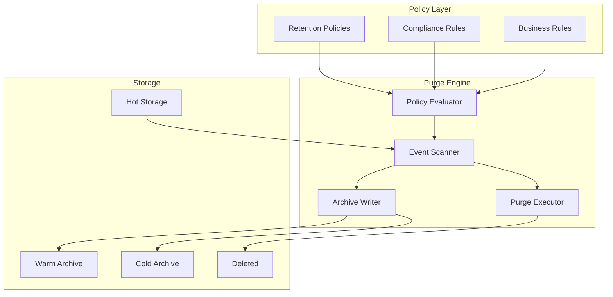
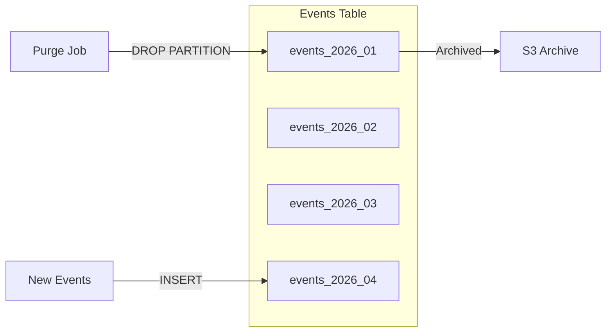
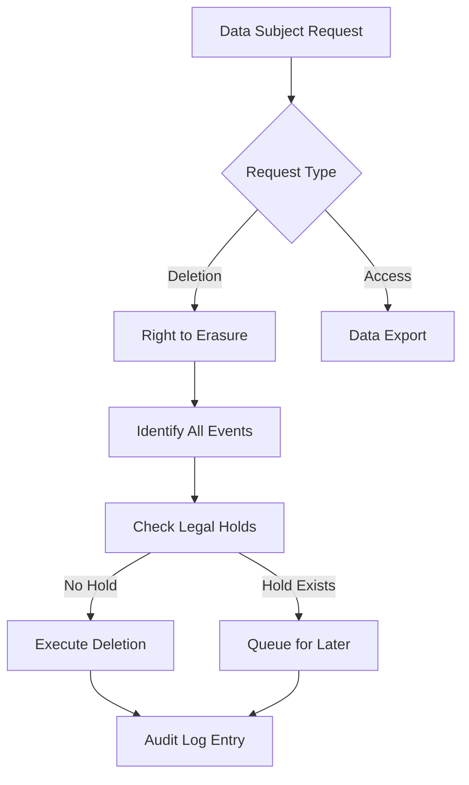
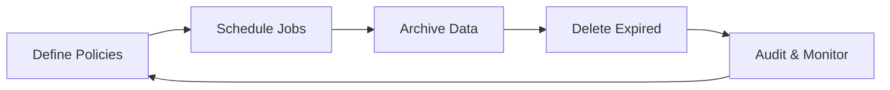

# How to Implement Event Purging

Author: [nawazdhandala](https://github.com/nawazdhandala)

Tags: Event-Driven, Data Retention, Compliance, Storage

Description: Learn to implement event purging strategies for data retention compliance and storage management.

---

Event-driven systems accumulate data at a rapid pace. Without proper purging strategies, storage costs balloon, query performance degrades, and regulatory compliance becomes a nightmare. This guide covers practical approaches to implementing event purging that balances data retention requirements with operational efficiency.

## Why Event Purging Matters

Every event your system produces consumes storage. A modestly sized application generating 1,000 events per second accumulates 86 million events daily. At 500 bytes per event, that translates to 43GB per day or roughly 1.3TB monthly.

Beyond storage costs, unbounded event retention creates several problems:

| Problem | Impact |
|---------|--------|
| Storage costs | Linear growth with no upper bound |
| Query performance | Indexes grow, scans slow down |
| Backup duration | Larger datasets take longer to backup and restore |
| Compliance risk | Retaining PII beyond legal limits triggers fines |
| Recovery complexity | Point-in-time recovery becomes impractical |

Event purging is not about deleting data carelessly. It is about defining clear retention policies and automating their enforcement.

## Event Purging Architecture

A well-designed purging system separates policy definition from execution. This allows different event types to have different retention periods while using a unified purging engine.



## Defining Retention Policies

Start by categorizing your events and assigning retention periods based on business value and compliance requirements. The following table shows common retention tiers.

| Event Category | Hot Retention | Warm Archive | Cold Archive | Delete After |
|----------------|---------------|--------------|--------------|--------------|
| User interactions | 30 days | 90 days | 1 year | 1 year |
| Transactions | 90 days | 1 year | 7 years | 7 years |
| System metrics | 7 days | 30 days | None | 30 days |
| Audit logs | 1 year | 3 years | 7 years | Never |
| Debug events | 24 hours | None | None | 24 hours |

The policy configuration should be stored separately from application code so operations teams can adjust retention without deployments.

```javascript
// retention-policies.json
// Define retention periods for each event type
{
  "policies": [
    {
      "eventType": "user.*",
      "hotRetentionDays": 30,
      "warmRetentionDays": 90,
      "coldRetentionDays": 365,
      "deleteAfterDays": 365
    },
    {
      "eventType": "transaction.*",
      "hotRetentionDays": 90,
      "warmRetentionDays": 365,
      "coldRetentionDays": 2555,
      "deleteAfterDays": 2555
    },
    {
      "eventType": "audit.*",
      "hotRetentionDays": 365,
      "warmRetentionDays": 1095,
      "coldRetentionDays": 2555,
      "deleteAfterDays": null
    },
    {
      "eventType": "debug.*",
      "hotRetentionDays": 1,
      "warmRetentionDays": null,
      "coldRetentionDays": null,
      "deleteAfterDays": 1
    }
  ]
}
```

## Implementing the Purge Engine

The purge engine runs on a schedule, evaluates policies, and moves or deletes events accordingly. Here is a practical implementation using Node.js.

```javascript
// purge-engine.js
const policies = require('./retention-policies.json');

class PurgeEngine {
  constructor(db, archiveStorage) {
    this.db = db;
    this.archiveStorage = archiveStorage;
  }

  // Match event type against policy patterns
  findPolicy(eventType) {
    return policies.policies.find(policy => {
      // Convert glob pattern to regex
      const pattern = policy.eventType
        .replace('.', '\\.')
        .replace('*', '.*');
      return new RegExp(`^${pattern}$`).test(eventType);
    });
  }

  // Calculate cutoff dates for each retention tier
  calculateCutoffs(policy) {
    const now = new Date();
    return {
      hotCutoff: this.subtractDays(now, policy.hotRetentionDays),
      warmCutoff: this.subtractDays(now, policy.warmRetentionDays),
      coldCutoff: this.subtractDays(now, policy.coldRetentionDays),
      deleteCutoff: this.subtractDays(now, policy.deleteAfterDays)
    };
  }

  subtractDays(date, days) {
    if (!days) return null;
    const result = new Date(date);
    result.setDate(result.getDate() - days);
    return result;
  }

  // Main purge execution loop
  async executePurge(batchSize = 1000) {
    const eventTypes = await this.db.getDistinctEventTypes();

    for (const eventType of eventTypes) {
      const policy = this.findPolicy(eventType);
      if (!policy) {
        console.warn(`No policy found for ${eventType}, skipping`);
        continue;
      }

      const cutoffs = this.calculateCutoffs(policy);
      await this.processEventType(eventType, cutoffs, batchSize);
    }
  }

  async processEventType(eventType, cutoffs, batchSize) {
    // Archive events beyond hot retention
    if (cutoffs.hotCutoff && cutoffs.warmCutoff) {
      await this.archiveEvents(
        eventType,
        cutoffs.hotCutoff,
        cutoffs.warmCutoff,
        'warm'
      );
    }

    // Move warm to cold storage
    if (cutoffs.warmCutoff && cutoffs.coldCutoff) {
      await this.archiveEvents(
        eventType,
        cutoffs.warmCutoff,
        cutoffs.coldCutoff,
        'cold'
      );
    }

    // Delete events beyond final retention
    if (cutoffs.deleteCutoff) {
      await this.deleteEvents(eventType, cutoffs.deleteCutoff, batchSize);
    }
  }

  async archiveEvents(eventType, startDate, endDate, tier) {
    console.log(`Archiving ${eventType} to ${tier}: ${startDate} - ${endDate}`);

    const events = await this.db.findEvents({
      type: eventType,
      timestamp: { $gte: endDate, $lt: startDate },
      archived: { $ne: tier }
    });

    // Write to archive storage in batches
    for (const batch of this.chunk(events, 100)) {
      await this.archiveStorage.write(tier, batch);
      await this.db.markArchived(batch.map(e => e.id), tier);
    }
  }

  async deleteEvents(eventType, cutoff, batchSize) {
    console.log(`Deleting ${eventType} before ${cutoff}`);

    let deleted = 0;
    let hasMore = true;

    // Delete in batches to avoid locking issues
    while (hasMore) {
      const result = await this.db.deleteEvents({
        type: eventType,
        timestamp: { $lt: cutoff },
        limit: batchSize
      });

      deleted += result.deletedCount;
      hasMore = result.deletedCount === batchSize;

      // Yield to prevent blocking
      await new Promise(resolve => setTimeout(resolve, 100));
    }

    console.log(`Deleted ${deleted} events of type ${eventType}`);
  }

  chunk(array, size) {
    const chunks = [];
    for (let i = 0; i < array.length; i += size) {
      chunks.push(array.slice(i, i + size));
    }
    return chunks;
  }
}
```

## Database-Level Purging with Partitioning

For high-volume systems, application-level deletion is too slow. Time-based partitioning allows you to drop entire partitions instantly rather than deleting rows one by one.

The following diagram illustrates how partitioned tables enable efficient purging.



Here is how to set up partitioned tables in PostgreSQL.

```sql
-- Create partitioned events table
CREATE TABLE events (
    id UUID NOT NULL,
    event_type VARCHAR(100) NOT NULL,
    payload JSONB NOT NULL,
    created_at TIMESTAMP NOT NULL,
    PRIMARY KEY (id, created_at)
) PARTITION BY RANGE (created_at);

-- Create monthly partitions
CREATE TABLE events_2026_01 PARTITION OF events
    FOR VALUES FROM ('2026-01-01') TO ('2026-02-01');

CREATE TABLE events_2026_02 PARTITION OF events
    FOR VALUES FROM ('2026-02-01') TO ('2026-03-01');

-- Create index on partition key for fast lookups
CREATE INDEX idx_events_created_at ON events (created_at);
CREATE INDEX idx_events_type ON events (event_type);
```

The purge process for partitioned tables becomes straightforward.

```sql
-- Archive partition data to S3 before dropping
COPY events_2025_01 TO 's3://archive/events/2025-01/' FORMAT PARQUET;

-- Drop entire partition instantly
DROP TABLE events_2025_01;

-- Create future partitions automatically
CREATE TABLE events_2026_05 PARTITION OF events
    FOR VALUES FROM ('2026-05-01') TO ('2026-06-01');
```

## Kafka Topic Retention

When using Kafka for event streaming, configure topic-level retention to handle purging automatically.

```properties
# kafka topic configuration
# Retain messages for 7 days
log.retention.hours=168

# Or retain up to 100GB per partition
log.retention.bytes=107374182400

# Clean up segments older than retention
log.cleanup.policy=delete

# For compacted topics (keep latest per key)
# log.cleanup.policy=compact
```

You can also set per-topic retention using the Kafka CLI.

```bash
# Set 30-day retention for user events
kafka-configs.sh --bootstrap-server localhost:9092 \
  --entity-type topics \
  --entity-name user-events \
  --alter \
  --add-config retention.ms=2592000000

# Set 7-day retention for debug events
kafka-configs.sh --bootstrap-server localhost:9092 \
  --entity-type topics \
  --entity-name debug-events \
  --alter \
  --add-config retention.ms=604800000
```

## Compliance Considerations

Regulatory frameworks like GDPR and CCPA impose specific requirements on data retention and deletion.



When implementing GDPR-compliant purging, you must handle deletion requests separately from scheduled retention purges.

```javascript
// gdpr-handler.js
async function handleDeletionRequest(userId, requestId) {
  // Log the request for audit purposes
  await auditLog.record({
    type: 'gdpr.deletion_request',
    userId: userId,
    requestId: requestId,
    timestamp: new Date()
  });

  // Check for legal holds
  const holds = await legalHoldService.checkHolds(userId);
  if (holds.length > 0) {
    await notifyLegalTeam(userId, holds);
    return { status: 'held', reason: 'legal_hold', holds };
  }

  // Find all events containing user data
  const eventIds = await db.findEventsByUserId(userId);

  // Execute deletion across all storage tiers
  await Promise.all([
    db.deleteEvents({ userId }),
    archiveStorage.deleteByUser('warm', userId),
    archiveStorage.deleteByUser('cold', userId),
    kafkaAdmin.deleteRecords('user-events', userId)
  ]);

  // Record completion
  await auditLog.record({
    type: 'gdpr.deletion_completed',
    userId: userId,
    requestId: requestId,
    eventsDeleted: eventIds.length,
    timestamp: new Date()
  });

  return { status: 'completed', eventsDeleted: eventIds.length };
}
```

## Monitoring Purge Operations

Track purge operations to ensure policies are being enforced and catch anomalies early.

| Metric | Purpose | Alert Threshold |
|--------|---------|-----------------|
| events_purged_total | Total events deleted per run | Variance > 50% from baseline |
| purge_duration_seconds | Time taken for purge job | > 2x normal duration |
| archive_bytes_written | Data archived per run | Storage quota > 80% |
| purge_errors_total | Failed deletion attempts | Any errors |
| retention_violations | Events exceeding policy age | Any violations |

## Best Practices

**Run purges during low-traffic periods.** Schedule purge jobs during maintenance windows to minimize impact on production workloads.

**Always archive before deleting.** Even if you think you will never need the data, archive it first. Storage is cheap; recreating deleted data is impossible.

**Test purge logic in staging.** Verify that your retention policies delete exactly what you expect before running in production.

**Implement dry-run mode.** Allow purge jobs to report what they would delete without actually deleting, useful for policy validation.

**Keep audit trails.** Log every purge operation with counts and timestamps. This documentation is essential for compliance audits.

**Handle partial failures gracefully.** If a purge job fails midway, it should be resumable without causing duplicate deletions or data inconsistencies.

## Summary

Event purging is essential for managing storage costs, maintaining query performance, and meeting compliance requirements. The key components work together to automate data lifecycle management.



Start with simple time-based retention policies, then add complexity as your compliance requirements evolve. Combine application-level purging with database partitioning for optimal performance at scale.

Event purging pairs well with observability tools to track storage growth and purge job health. OneUptime can monitor your purge pipelines and alert when retention policies are not being enforced correctly.

**Related Reading:**

- [Event Stream Processing](https://oneuptime.com/blog/post/2026-01-30-event-stream-processing/view)
- [How to Reduce Noise in OpenTelemetry](https://oneuptime.com/blog/post/2025-08-25-how-to-reduce-noise-in-opentelemetry/view)
- [How to Structure Logs Properly in OpenTelemetry](https://oneuptime.com/blog/post/2025-08-28-how-to-structure-logs-properly-in-opentelemetry/view)
