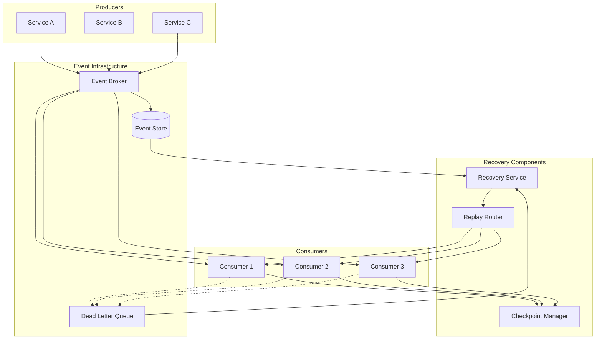
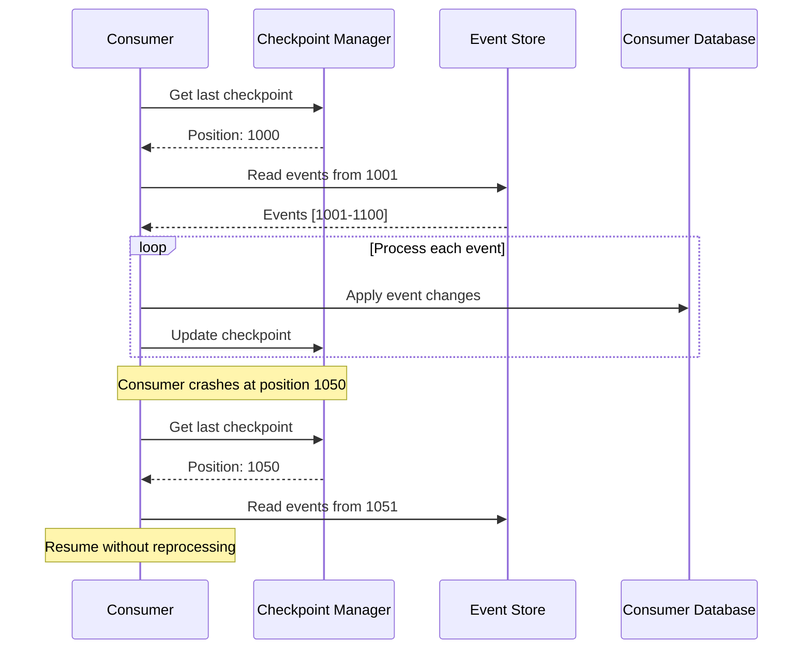
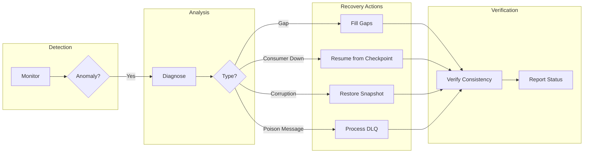

# How to Create Event Recovery

Author: [nawazdhandala](https://github.com/nawazdhandala)

Tags: Event-Driven, Recovery, Disaster Recovery, Resilience

Description: Learn to create event recovery mechanisms for restoring event streams after failures or data loss.

---

Event-driven systems are powerful but fragile. When events are lost, downstream services fall out of sync, data becomes inconsistent, and debugging turns into a nightmare. Event recovery mechanisms ensure you can restore event streams after failures, replay missed events, and maintain system integrity. Here is how to build them.

## Why Event Recovery Matters

In event-driven architectures, events are the source of truth. A single lost event can cascade into widespread data inconsistencies. Consider an e-commerce system where an "OrderPlaced" event fails to reach the inventory service. The order proceeds, but inventory is never decremented. The customer receives confirmation, but the warehouse has no record.

| Failure Type | Impact | Recovery Need |
|--------------|--------|---------------|
| Broker crash | All in-flight events lost | Full stream replay |
| Consumer failure | Events processed but not acknowledged | Partial replay with deduplication |
| Network partition | Events published but never delivered | Gap detection and filling |
| Poison message | Consumer crashes repeatedly | Dead letter queue processing |
| Data corruption | Events stored incorrectly | Point-in-time restoration |

## Event Recovery Architecture

A well-designed event recovery system has multiple layers working together.



## Implementing Event Sourcing for Recovery

Event sourcing provides the foundation for recovery by storing every state change as an immutable event. This gives you a complete audit trail and the ability to rebuild state at any point in time.

```typescript
// Event store interface for persisting and retrieving events
interface EventStore {
  // Append events to a stream with optimistic concurrency
  append(streamId: string, events: Event[], expectedVersion: number): Promise<void>;

  // Read events from a specific position
  read(streamId: string, fromVersion: number): Promise<Event[]>;

  // Read all events across streams for global replay
  readAll(fromPosition: number, batchSize: number): Promise<Event[]>;

  // Get the current position for a stream
  getVersion(streamId: string): Promise<number>;
}

// Event structure with metadata for recovery
interface Event {
  id: string;              // Unique event identifier for deduplication
  streamId: string;        // Aggregate or entity identifier
  type: string;            // Event type name
  data: unknown;           // Event payload
  metadata: {
    timestamp: Date;       // When the event occurred
    version: number;       // Position in the stream
    correlationId: string; // For tracing related events
    causationId: string;   // The event that caused this one
  };
}
```

Here is a PostgreSQL-based event store implementation that supports recovery operations.

```typescript
// PostgreSQL event store with recovery capabilities
class PostgresEventStore implements EventStore {
  constructor(private pool: Pool) {}

  async append(streamId: string, events: Event[], expectedVersion: number): Promise<void> {
    const client = await this.pool.connect();

    try {
      await client.query('BEGIN');

      // Check for optimistic concurrency
      const versionResult = await client.query(
        'SELECT COALESCE(MAX(version), 0) as version FROM events WHERE stream_id = $1 FOR UPDATE',
        [streamId]
      );

      const currentVersion = versionResult.rows[0].version;
      if (currentVersion !== expectedVersion) {
        throw new ConcurrencyError(`Expected version ${expectedVersion}, got ${currentVersion}`);
      }

      // Insert events with sequential versions
      for (let i = 0; i < events.length; i++) {
        const event = events[i];
        const version = expectedVersion + i + 1;

        await client.query(
          `INSERT INTO events (id, stream_id, type, data, metadata, version, created_at)
           VALUES ($1, $2, $3, $4, $5, $6, NOW())`,
          [event.id, streamId, event.type, event.data, event.metadata, version]
        );
      }

      await client.query('COMMIT');
    } catch (error) {
      await client.query('ROLLBACK');
      throw error;
    } finally {
      client.release();
    }
  }

  // Read events for replay with pagination
  async readAll(fromPosition: number, batchSize: number): Promise<Event[]> {
    const result = await this.pool.query(
      `SELECT * FROM events
       WHERE global_position > $1
       ORDER BY global_position ASC
       LIMIT $2`,
      [fromPosition, batchSize]
    );

    return result.rows.map(this.rowToEvent);
  }
}
```

## Checkpoint Management

Checkpoints track the last successfully processed event for each consumer. They enable resumption from the exact point of failure.



The checkpoint manager stores consumer progress and handles the complexity of tracking multiple consumers across multiple streams.

```typescript
// Checkpoint manager for tracking consumer progress
class CheckpointManager {
  constructor(private redis: Redis) {}

  // Get the last processed position for a consumer
  async getCheckpoint(consumerId: string, streamId: string): Promise<number> {
    const key = `checkpoint:${consumerId}:${streamId}`;
    const value = await this.redis.get(key);
    return value ? parseInt(value, 10) : 0;
  }

  // Update checkpoint after successful processing
  async saveCheckpoint(consumerId: string, streamId: string, position: number): Promise<void> {
    const key = `checkpoint:${consumerId}:${streamId}`;
    await this.redis.set(key, position.toString());
  }

  // Atomic checkpoint update with event processing
  async processWithCheckpoint(
    consumerId: string,
    streamId: string,
    position: number,
    processor: () => Promise<void>
  ): Promise<void> {
    // Use a distributed lock to prevent duplicate processing
    const lockKey = `lock:${consumerId}:${streamId}`;
    const lock = await this.redis.set(lockKey, '1', 'NX', 'EX', 30);

    if (!lock) {
      throw new Error('Could not acquire processing lock');
    }

    try {
      await processor();
      await this.saveCheckpoint(consumerId, streamId, position);
    } finally {
      await this.redis.del(lockKey);
    }
  }
}
```

## Dead Letter Queue Processing

When events cannot be processed after multiple retries, they go to a dead letter queue. A recovery service monitors this queue and provides options for handling failed events.

```typescript
// Dead letter queue handler for failed events
class DeadLetterProcessor {
  constructor(
    private dlqConsumer: Consumer,
    private eventStore: EventStore,
    private alertService: AlertService
  ) {}

  async start(): Promise<void> {
    await this.dlqConsumer.subscribe('dead-letter-queue', async (message) => {
      const failedEvent = JSON.parse(message.value);

      // Log the failure with full context
      console.error('Dead letter event received', {
        eventId: failedEvent.originalEvent.id,
        eventType: failedEvent.originalEvent.type,
        failureReason: failedEvent.error,
        retryCount: failedEvent.retryCount,
        originalTimestamp: failedEvent.originalEvent.metadata.timestamp
      });

      // Alert on-call team for manual intervention
      await this.alertService.sendAlert({
        severity: 'high',
        title: 'Event Processing Failure',
        description: `Event ${failedEvent.originalEvent.id} failed after ${failedEvent.retryCount} retries`,
        metadata: failedEvent
      });

      // Store in a recovery table for later analysis
      await this.storeForRecovery(failedEvent);
    });
  }

  // Retry a specific failed event after fixing the issue
  async retryEvent(eventId: string): Promise<void> {
    const failedEvent = await this.getFailedEvent(eventId);

    // Republish to the original topic
    await this.eventStore.republish(
      failedEvent.originalTopic,
      failedEvent.originalEvent
    );
  }

  // Bulk retry all events of a specific type
  async retryByType(eventType: string): Promise<number> {
    const failedEvents = await this.getFailedEventsByType(eventType);
    let retryCount = 0;

    for (const event of failedEvents) {
      await this.retryEvent(event.id);
      retryCount++;
    }

    return retryCount;
  }
}
```

## Idempotent Event Handlers

Recovery often means reprocessing events that may have been partially handled. Idempotent handlers ensure that processing the same event multiple times produces the same result.

```typescript
// Idempotent event handler with deduplication
class IdempotentEventHandler {
  constructor(
    private processedEvents: Set<string>,
    private redis: Redis
  ) {}

  async handle(event: Event, processor: (event: Event) => Promise<void>): Promise<void> {
    const eventKey = `processed:${event.id}`;

    // Check if already processed using Redis for distributed systems
    const alreadyProcessed = await this.redis.get(eventKey);

    if (alreadyProcessed) {
      console.log(`Event ${event.id} already processed, skipping`);
      return;
    }

    // Use optimistic locking to prevent race conditions
    const lockAcquired = await this.redis.set(eventKey, 'processing', 'NX', 'EX', 300);

    if (!lockAcquired) {
      console.log(`Event ${event.id} is being processed by another instance`);
      return;
    }

    try {
      await processor(event);
      // Mark as permanently processed with long TTL
      await this.redis.set(eventKey, 'completed', 'EX', 86400 * 7);
    } catch (error) {
      // Remove lock on failure to allow retry
      await this.redis.del(eventKey);
      throw error;
    }
  }
}
```

## Recovery Strategies Comparison

Different failure scenarios require different recovery approaches.

| Strategy | Use Case | Pros | Cons |
|----------|----------|------|------|
| Full Replay | Complete data loss | Guaranteed consistency | Slow, resource intensive |
| Checkpoint Resume | Consumer crash | Fast recovery | Requires checkpoint persistence |
| Gap Detection | Network partitions | Targeted recovery | Complex implementation |
| Snapshot + Replay | Large event volumes | Balanced speed/consistency | Storage overhead |
| Dead Letter Retry | Poison messages | Isolates bad events | Requires manual intervention |

## Recovery Service Implementation

The recovery service orchestrates the entire recovery process based on the type of failure detected.



```typescript
// Main recovery service coordinating all recovery operations
class EventRecoveryService {
  constructor(
    private eventStore: EventStore,
    private checkpointManager: CheckpointManager,
    private dlqProcessor: DeadLetterProcessor
  ) {}

  // Recover a consumer from its last checkpoint
  async recoverConsumer(consumerId: string, streamId: string): Promise<RecoveryResult> {
    const checkpoint = await this.checkpointManager.getCheckpoint(consumerId, streamId);
    const currentPosition = await this.eventStore.getVersion(streamId);

    const missedEvents = currentPosition - checkpoint;

    console.log(`Recovering consumer ${consumerId} from position ${checkpoint}`);
    console.log(`Missed events: ${missedEvents}`);

    return {
      consumerId,
      streamId,
      fromPosition: checkpoint,
      toPosition: currentPosition,
      missedEvents,
      status: 'ready_for_replay'
    };
  }

  // Detect and fill gaps in event processing
  async detectGaps(consumerId: string, streamId: string): Promise<Gap[]> {
    const processedPositions = await this.getProcessedPositions(consumerId, streamId);
    const gaps: Gap[] = [];

    for (let i = 1; i < processedPositions.length; i++) {
      const expected = processedPositions[i - 1] + 1;
      const actual = processedPositions[i];

      if (actual !== expected) {
        gaps.push({
          start: expected,
          end: actual - 1,
          count: actual - expected
        });
      }
    }

    return gaps;
  }

  // Replay events for a specific time range
  async replayTimeRange(
    streamId: string,
    startTime: Date,
    endTime: Date,
    targetConsumer: string
  ): Promise<void> {
    const events = await this.eventStore.readByTimeRange(streamId, startTime, endTime);

    console.log(`Replaying ${events.length} events to ${targetConsumer}`);

    for (const event of events) {
      await this.publishToConsumer(targetConsumer, event);
    }
  }
}
```

## Testing Your Recovery Mechanisms

Recovery code that has never been tested will fail when you need it most. Build chaos engineering into your testing strategy.

```typescript
// Recovery testing utilities
class RecoveryTestSuite {
  // Simulate consumer crash and verify recovery
  async testConsumerRecovery(): Promise<void> {
    // Publish 100 events
    for (let i = 0; i < 100; i++) {
      await this.eventStore.append('test-stream', [createTestEvent(i)], i);
    }

    // Process 50 events then simulate crash
    const consumer = new TestConsumer();
    await consumer.processUntil(50);
    await consumer.simulateCrash();

    // Recover and verify
    const recovered = new TestConsumer();
    await recovered.recoverFromCheckpoint();

    // Should resume from event 51
    expect(recovered.lastProcessed).toBe(50);
    await recovered.processRemaining();
    expect(recovered.totalProcessed).toBe(100);
  }
}
```

## Best Practices

1. **Store events durably**: Use a database or distributed log that survives restarts
2. **Make handlers idempotent**: Assume every event might be processed multiple times
3. **Checkpoint frequently**: Balance between performance and recovery granularity
4. **Monitor lag**: Alert when consumers fall behind event producers
5. **Test recovery regularly**: Run recovery drills monthly
6. **Document procedures**: Create runbooks for each failure scenario
7. **Use correlation IDs**: Trace events across services during debugging

---

Event recovery is insurance for your distributed system. The time to build these mechanisms is before you need them. Start with checkpointing and idempotent handlers. Add event sourcing for full auditability. Implement dead letter queues for graceful degradation. Your future self, debugging a production incident at 3 AM, will thank you.
