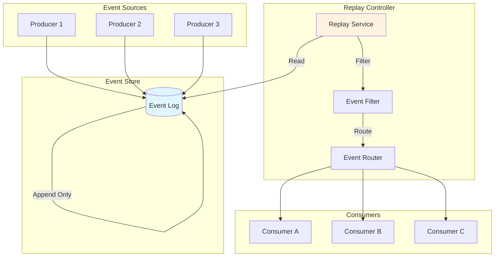
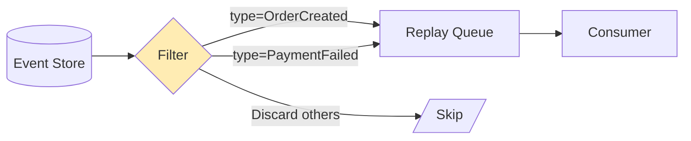
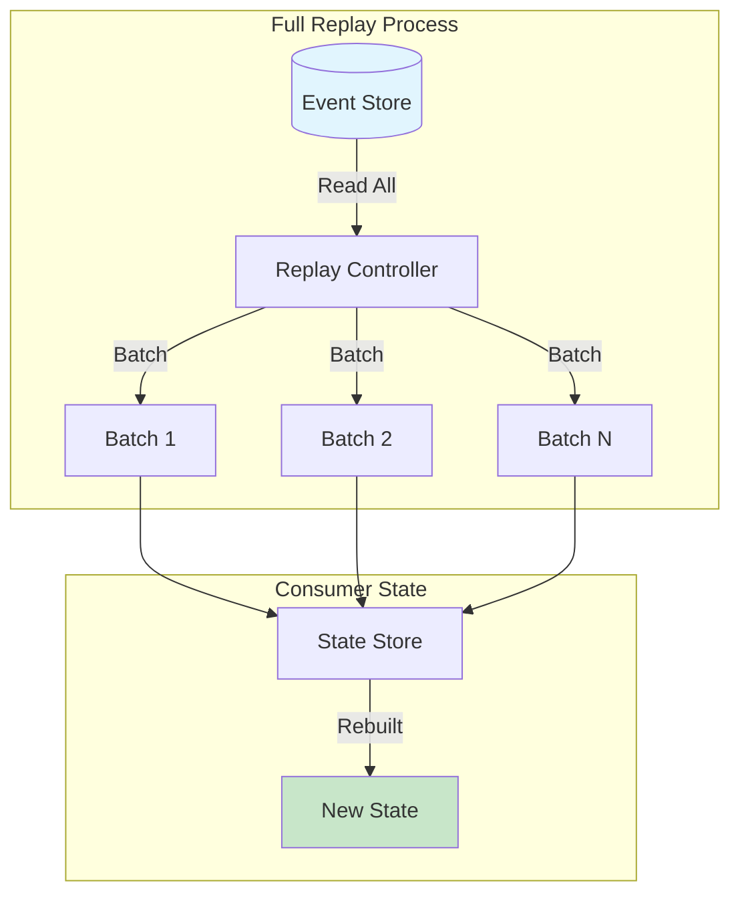
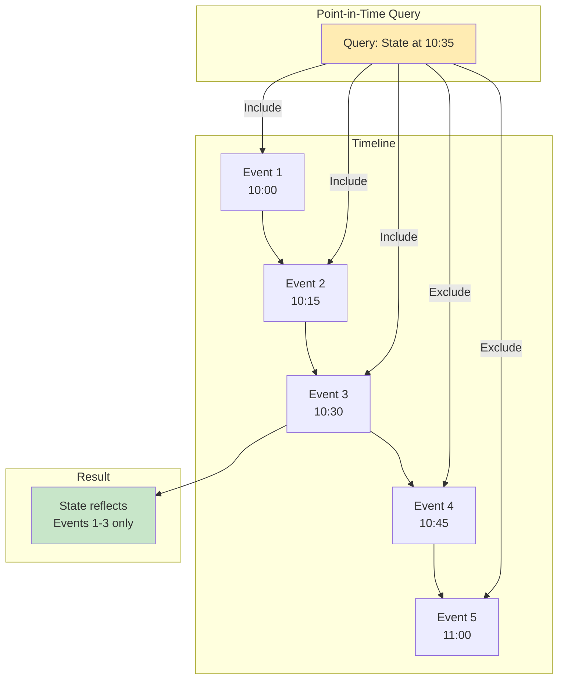
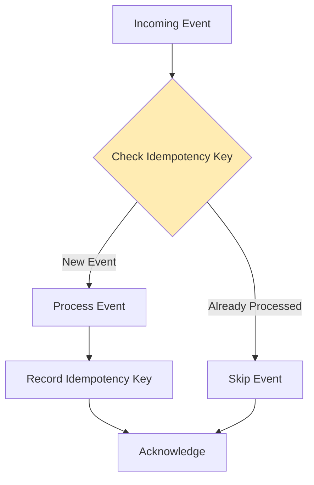
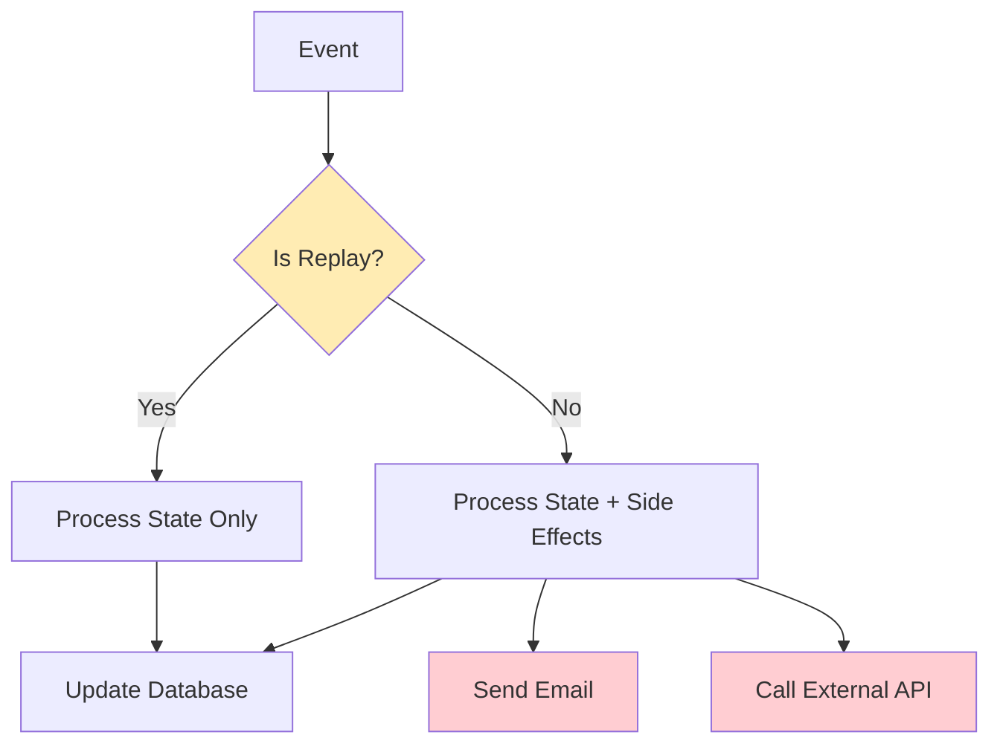
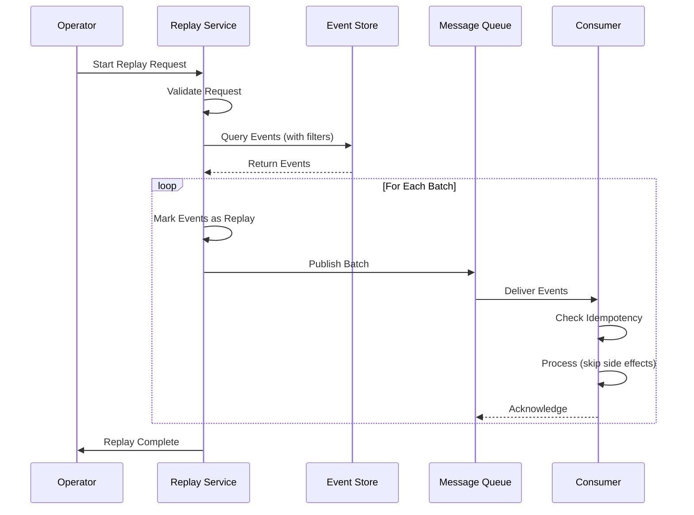

# How to Build Event Replay Strategies

Author: [nawazdhandala](https://github.com/nawazdhandala)

Tags: Event-Driven, Replay, Recovery, Architecture

Description: Learn how to implement selective replay, full replay, and point-in-time recovery strategies for event-driven systems.

---

Your payment service crashed. Thousands of transactions processed but downstream systems never got the events. The events are sitting in your event store, but how do you replay them without duplicating charges or corrupting state?

This is the problem event replay solves. Done right, it turns catastrophic failures into minor inconveniences. Done wrong, it creates more problems than it fixes.

## Why Event Replay Matters

Event-driven architectures decouple services through asynchronous messaging. Events flow through queues, streams, or logs. When something breaks, you need a way to reprocess events without starting from scratch.

Common scenarios requiring replay:

- Consumer service went down and missed events
- Bug in processing logic corrupted downstream data
- New service needs historical data to initialize state
- Audit requirements demand reprocessing with updated logic
- Testing production event flows in staging

## Event Replay Architecture Overview



The key components:

1. **Event Store**: Immutable log of all events with timestamps and sequence numbers
2. **Replay Controller**: Service that reads from the store and republishes events
3. **Event Filter**: Selects which events to replay based on criteria
4. **Event Router**: Directs replayed events to appropriate consumers

## Three Replay Strategies

### 1. Selective Replay

Replay specific events based on filters like event type, time range, or entity ID. Use this when you know exactly what needs reprocessing.



**When to use:**
- Single consumer missed specific event types
- Need to reprocess events for a specific customer
- Bug affected only certain event categories

**Implementation:**

```typescript
interface ReplayFilter {
  eventTypes?: string[];
  startTime?: Date;
  endTime?: Date;
  entityIds?: string[];
  correlationIds?: string[];
}

class SelectiveReplayService {
  constructor(
    private eventStore: EventStore,
    private publisher: EventPublisher
  ) {}

  async replay(filter: ReplayFilter, targetQueue: string): Promise<ReplayResult> {
    const events = await this.eventStore.query({
      types: filter.eventTypes,
      from: filter.startTime,
      to: filter.endTime,
      entities: filter.entityIds
    });

    let processed = 0;
    let failed = 0;

    for (const event of events) {
      try {
        // Mark as replay to prevent side effects
        const replayEvent = {
          ...event,
          metadata: {
            ...event.metadata,
            isReplay: true,
            originalTimestamp: event.timestamp,
            replayTimestamp: new Date()
          }
        };

        await this.publisher.publish(targetQueue, replayEvent);
        processed++;
      } catch (error) {
        failed++;
        console.error(`Failed to replay event ${event.id}:`, error);
      }
    }

    return { processed, failed, total: events.length };
  }
}
```

### 2. Full Replay

Rebuild entire system state by replaying all events from the beginning. Use this for disaster recovery or initializing new services.



**When to use:**
- Database corruption requires complete rebuild
- Deploying new read model or projection
- Migrating to new data schema
- Creating new aggregate from historical events

**Implementation:**

```typescript
class FullReplayService {
  constructor(
    private eventStore: EventStore,
    private stateStore: StateStore
  ) {}

  async fullReplay(
    aggregateType: string,
    batchSize: number = 1000
  ): Promise<void> {
    // Clear existing state
    await this.stateStore.clear(aggregateType);

    let offset = 0;
    let hasMore = true;

    while (hasMore) {
      const batch = await this.eventStore.readBatch({
        aggregateType,
        offset,
        limit: batchSize
      });

      if (batch.length === 0) {
        hasMore = false;
        continue;
      }

      // Process batch with transaction
      await this.stateStore.transaction(async (tx) => {
        for (const event of batch) {
          await this.applyEvent(event, tx);
        }
      });

      offset += batch.length;
      console.log(`Processed ${offset} events`);
    }

    console.log(`Full replay complete. Total events: ${offset}`);
  }

  private async applyEvent(event: Event, tx: Transaction): Promise<void> {
    const handler = this.getHandler(event.type);
    if (handler) {
      await handler(event, tx);
    }
  }
}
```

### 3. Point-in-Time Recovery

Rebuild state as it existed at a specific moment. Critical for auditing, debugging, and regulatory compliance.



**When to use:**
- Investigating what state looked like when bug occurred
- Regulatory audit requiring historical snapshots
- Comparing state before and after specific changes
- Rolling back to known good state

**Implementation:**

```typescript
class PointInTimeRecovery {
  constructor(private eventStore: EventStore) {}

  async getStateAt<T>(
    aggregateId: string,
    timestamp: Date
  ): Promise<T | null> {
    // Get all events up to the target timestamp
    const events = await this.eventStore.query({
      aggregateId,
      to: timestamp,
      orderBy: 'timestamp',
      order: 'asc'
    });

    if (events.length === 0) {
      return null;
    }

    // Rebuild state by applying events in order
    let state: T = this.getInitialState<T>();

    for (const event of events) {
      state = this.applyEvent(state, event);
    }

    return state;
  }

  async compareStates<T>(
    aggregateId: string,
    time1: Date,
    time2: Date
  ): Promise<{ before: T | null; after: T | null; diff: Diff }> {
    const before = await this.getStateAt<T>(aggregateId, time1);
    const after = await this.getStateAt<T>(aggregateId, time2);

    return {
      before,
      after,
      diff: this.calculateDiff(before, after)
    };
  }

  private applyEvent<T>(state: T, event: Event): T {
    // Event sourcing reducer pattern
    switch (event.type) {
      case 'OrderCreated':
        return { ...state, ...event.data, status: 'created' } as T;
      case 'OrderUpdated':
        return { ...state, ...event.data } as T;
      case 'OrderCancelled':
        return { ...state, status: 'cancelled' } as T;
      default:
        return state;
    }
  }
}
```

## Handling Idempotency

Replay without idempotency guarantees leads to duplicate processing. Every consumer must handle repeated events gracefully.



**Implementation patterns:**

```typescript
class IdempotentConsumer {
  constructor(
    private idempotencyStore: IdempotencyStore,
    private handler: EventHandler
  ) {}

  async process(event: Event): Promise<void> {
    const idempotencyKey = this.getIdempotencyKey(event);

    // Check if already processed
    const existing = await this.idempotencyStore.get(idempotencyKey);
    if (existing) {
      console.log(`Event ${event.id} already processed, skipping`);
      return;
    }

    // Process the event
    await this.handler.handle(event);

    // Record successful processing
    await this.idempotencyStore.set(idempotencyKey, {
      eventId: event.id,
      processedAt: new Date(),
      result: 'success'
    });
  }

  private getIdempotencyKey(event: Event): string {
    // Use event ID combined with consumer identifier
    return `${this.handler.name}:${event.id}`;
  }
}
```

## Replay with Side Effects

Some events trigger external actions: sending emails, calling APIs, charging credit cards. During replay, you usually want to skip these.



**Implementation:**

```typescript
class ReplayAwareHandler {
  async handle(event: Event): Promise<void> {
    const isReplay = event.metadata?.isReplay === true;

    // Always update internal state
    await this.updateState(event);

    // Skip side effects during replay
    if (!isReplay) {
      await this.performSideEffects(event);
    }
  }

  private async updateState(event: Event): Promise<void> {
    // Database updates, state changes
    await this.repository.save(event.data);
  }

  private async performSideEffects(event: Event): Promise<void> {
    // External calls, notifications
    if (event.type === 'OrderCompleted') {
      await this.emailService.sendConfirmation(event.data.customerId);
      await this.inventoryService.reserve(event.data.items);
    }
  }
}
```

## Building a Replay Service

Here is a complete replay service implementation:

```typescript
interface ReplayRequest {
  id: string;
  strategy: 'selective' | 'full' | 'point-in-time';
  filter?: ReplayFilter;
  targetTimestamp?: Date;
  targetConsumers: string[];
  options: {
    batchSize: number;
    delayBetweenBatches: number;
    skipSideEffects: boolean;
  };
}

interface ReplayStatus {
  id: string;
  status: 'pending' | 'running' | 'completed' | 'failed';
  progress: {
    total: number;
    processed: number;
    failed: number;
  };
  startedAt?: Date;
  completedAt?: Date;
  error?: string;
}

class ReplayService {
  private activeReplays: Map<string, ReplayStatus> = new Map();

  constructor(
    private eventStore: EventStore,
    private publisher: EventPublisher,
    private statusStore: ReplayStatusStore
  ) {}

  async startReplay(request: ReplayRequest): Promise<string> {
    const status: ReplayStatus = {
      id: request.id,
      status: 'pending',
      progress: { total: 0, processed: 0, failed: 0 }
    };

    this.activeReplays.set(request.id, status);
    await this.statusStore.save(status);

    // Run replay asynchronously
    this.executeReplay(request).catch(error => {
      this.updateStatus(request.id, {
        status: 'failed',
        error: error.message
      });
    });

    return request.id;
  }

  async getStatus(replayId: string): Promise<ReplayStatus | null> {
    return this.activeReplays.get(replayId) ||
           await this.statusStore.get(replayId);
  }

  private async executeReplay(request: ReplayRequest): Promise<void> {
    this.updateStatus(request.id, { status: 'running', startedAt: new Date() });

    const events = await this.queryEvents(request);
    this.updateStatus(request.id, {
      progress: { total: events.length, processed: 0, failed: 0 }
    });

    const batches = this.createBatches(events, request.options.batchSize);

    for (const batch of batches) {
      await this.processBatch(request, batch);
      await this.delay(request.options.delayBetweenBatches);
    }

    this.updateStatus(request.id, { status: 'completed', completedAt: new Date() });
  }

  private async queryEvents(request: ReplayRequest): Promise<Event[]> {
    switch (request.strategy) {
      case 'selective':
        return this.eventStore.query(request.filter!);
      case 'full':
        return this.eventStore.readAll();
      case 'point-in-time':
        return this.eventStore.query({ to: request.targetTimestamp });
      default:
        throw new Error(`Unknown strategy: ${request.strategy}`);
    }
  }

  private async processBatch(request: ReplayRequest, batch: Event[]): Promise<void> {
    const status = this.activeReplays.get(request.id)!;

    for (const event of batch) {
      try {
        const replayEvent = this.wrapForReplay(event, request);

        for (const consumer of request.targetConsumers) {
          await this.publisher.publish(consumer, replayEvent);
        }

        status.progress.processed++;
      } catch (error) {
        status.progress.failed++;
        console.error(`Replay failed for event ${event.id}:`, error);
      }
    }

    await this.statusStore.save(status);
  }

  private wrapForReplay(event: Event, request: ReplayRequest): Event {
    return {
      ...event,
      metadata: {
        ...event.metadata,
        isReplay: true,
        replayId: request.id,
        skipSideEffects: request.options.skipSideEffects,
        originalTimestamp: event.timestamp,
        replayTimestamp: new Date()
      }
    };
  }
}
```

## Replay Workflow Diagram



## Monitoring Replays

Track replay operations to catch issues early:

```typescript
interface ReplayMetrics {
  replayId: string;
  eventsPerSecond: number;
  avgProcessingTime: number;
  errorRate: number;
  queueDepth: number;
}

class ReplayMonitor {
  async collectMetrics(replayId: string): Promise<ReplayMetrics> {
    const status = await this.replayService.getStatus(replayId);
    const queueStats = await this.queueService.getStats();

    return {
      replayId,
      eventsPerSecond: this.calculateThroughput(status),
      avgProcessingTime: this.getAvgProcessingTime(status),
      errorRate: status.progress.failed / status.progress.total,
      queueDepth: queueStats.depth
    };
  }

  async alertOnIssues(metrics: ReplayMetrics): Promise<void> {
    if (metrics.errorRate > 0.01) {
      await this.alertService.send({
        severity: 'warning',
        message: `Replay ${metrics.replayId} has ${metrics.errorRate * 100}% error rate`
      });
    }

    if (metrics.queueDepth > 10000) {
      await this.alertService.send({
        severity: 'warning',
        message: `Queue backlog during replay: ${metrics.queueDepth} messages`
      });
    }
  }
}
```

## Best Practices

1. **Always mark replayed events**: Include metadata so consumers know it is a replay
2. **Implement idempotency everywhere**: Consumers must handle duplicate events
3. **Control replay speed**: Throttle to avoid overwhelming downstream systems
4. **Test your replay**: Run replay drills before you need them in production
5. **Log replay operations**: Track what was replayed, when, and by whom
6. **Separate replay queues**: Use dedicated queues to avoid mixing with live traffic
7. **Validate before full replay**: Sample events first to verify filters work correctly
8. **Plan for rollback**: Know how to undo a replay if something goes wrong

## Common Pitfalls

| Problem | Cause | Solution |
|---------|-------|----------|
| Duplicate data | Missing idempotency checks | Store processed event IDs |
| Spam emails sent | Side effects during replay | Check replay flag before external calls |
| System overload | Replay too fast | Add delays between batches |
| Missing events | Incorrect time filters | Use sequence numbers, not just timestamps |
| State corruption | Wrong replay order | Ensure events processed in original order |
| Replay never ends | Events still being produced | Snapshot cutoff point before starting |

## When to Use Each Strategy

| Scenario | Strategy | Why |
|----------|----------|-----|
| Consumer missed some events | Selective | Target only the gap period |
| Deploying new read model | Full | Need complete historical state |
| Debug production issue | Point-in-time | See exact state when bug occurred |
| Data migration | Full | Rebuild everything with new schema |
| Audit investigation | Point-in-time | Reconstruct historical snapshot |
| Single entity corrupted | Selective | Filter by entity ID only |

---

Event replay is insurance for your event-driven system. The time you invest building it pays off the first time a consumer crashes at 3 AM. Start with idempotent consumers and event metadata. Add selective replay next. Point-in-time recovery can wait until you need it for compliance or debugging.

Build replay before you need it. Test it regularly. When disaster strikes, you will be glad you did.
