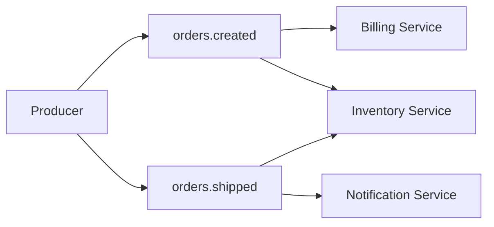
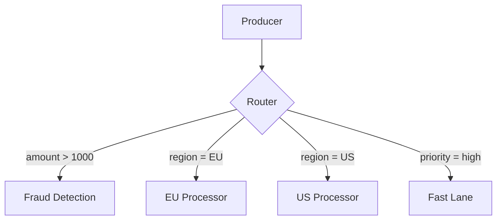
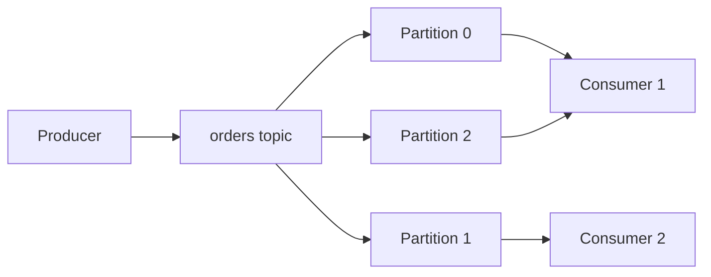
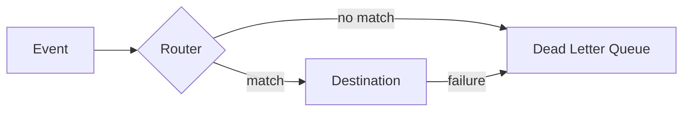

# How to Implement Event Routing

Author: [nawazdhandala](https://github.com/nawazdhandala)

Tags: Event-Driven, Routing, Message Broker, Architecture

Description: Learn to implement event routing strategies for directing events to appropriate consumers based on rules.

---

Your application publishes an order event. Three services need it: inventory, billing, and notifications. Without proper routing, you either broadcast everything everywhere (waste) or hardcode destinations (fragile). Event routing solves this by directing events to the right consumers based on configurable rules.

This guide walks through practical routing patterns, implementation strategies, and code you can adapt for production systems.

---

## What is Event Routing?

Event routing is the mechanism that determines where events go after they are published. Instead of producers knowing about all consumers, a routing layer sits between them and makes delivery decisions based on event attributes, content, or predefined rules.

| Concept | Description |
|---------|-------------|
| Producer | Service that publishes events |
| Consumer | Service that receives and processes events |
| Router | Component that evaluates events and determines destinations |
| Routing Key | Attribute used to match events to destinations |
| Filter | Rule that includes or excludes events based on criteria |

---

## Why Event Routing Matters

Without routing, you face two bad options:

1. **Fan-out everything** - Every consumer receives every event and filters locally. This wastes bandwidth, processing, and creates tight coupling.

2. **Point-to-point connections** - Producers know exactly which consumers need each event. This creates a dependency graph that becomes unmaintainable.

Routing gives you a third option: producers publish events with metadata, and a routing layer handles distribution based on rules you control.

---

## Core Routing Patterns

### Pattern 1: Topic-Based Routing

Events are published to named topics. Consumers subscribe to topics they care about.



This pattern works well when event types map cleanly to consumer needs.

### Pattern 2: Content-Based Routing

The router inspects event payload and routes based on content. This handles complex scenarios where the same event type needs different handling based on data.



### Pattern 3: Header-Based Routing

Events carry routing metadata in headers separate from the payload. This keeps routing concerns out of business data.

| Header | Purpose | Example |
|--------|---------|---------|
| event-type | Primary classification | order.created |
| priority | Processing urgency | high, normal, low |
| region | Geographic routing | us-east, eu-west |
| version | Schema version | v2 |
| tenant-id | Multi-tenant routing | acme-corp |

---

## Implementation: Building a Router

Here is a TypeScript implementation of a content-based router that you can extend for your needs.

First, define the core types that represent events and routing rules.

```typescript
// types.ts - Core type definitions for the routing system

// Event structure with metadata and payload
interface Event {
  id: string;
  type: string;
  timestamp: Date;
  headers: Record<string, string>;
  payload: Record<string, unknown>;
}

// Operators for comparing values in routing rules
type Operator = 'equals' | 'contains' | 'gt' | 'lt' | 'regex' | 'exists';

// A single condition that must be met for routing
interface Condition {
  field: string;      // Path to check (e.g., "payload.amount")
  operator: Operator; // How to compare
  value: unknown;     // Expected value
}

// A rule combines conditions with a destination
interface RoutingRule {
  name: string;
  conditions: Condition[];
  destination: string;
  priority: number;   // Higher priority rules evaluated first
}
```

Next, implement the router class that evaluates events against rules.

```typescript
// router.ts - Main routing logic

class EventRouter {
  private rules: RoutingRule[] = [];
  private destinations: Map<string, (event: Event) => Promise<void>> = new Map();

  // Register a new routing rule
  addRule(rule: RoutingRule): void {
    this.rules.push(rule);
    // Sort by priority descending so high-priority rules match first
    this.rules.sort((a, b) => b.priority - a.priority);
  }

  // Register a destination handler
  registerDestination(name: string, handler: (event: Event) => Promise<void>): void {
    this.destinations.set(name, handler);
  }

  // Route an event to matching destinations
  async route(event: Event): Promise<string[]> {
    const matchedDestinations: string[] = [];

    for (const rule of this.rules) {
      if (this.evaluateRule(rule, event)) {
        matchedDestinations.push(rule.destination);
        const handler = this.destinations.get(rule.destination);
        if (handler) {
          await handler(event);
        }
      }
    }

    return matchedDestinations;
  }

  // Check if all conditions in a rule are satisfied
  private evaluateRule(rule: RoutingRule, event: Event): boolean {
    return rule.conditions.every(condition =>
      this.evaluateCondition(condition, event)
    );
  }

  // Evaluate a single condition against the event
  private evaluateCondition(condition: Condition, event: Event): boolean {
    const value = this.getFieldValue(event, condition.field);

    switch (condition.operator) {
      case 'equals':
        return value === condition.value;
      case 'contains':
        return String(value).includes(String(condition.value));
      case 'gt':
        return Number(value) > Number(condition.value);
      case 'lt':
        return Number(value) < Number(condition.value);
      case 'regex':
        return new RegExp(String(condition.value)).test(String(value));
      case 'exists':
        return value !== undefined && value !== null;
      default:
        return false;
    }
  }

  // Extract a nested field value using dot notation
  private getFieldValue(event: Event, path: string): unknown {
    const parts = path.split('.');
    let current: unknown = event;

    for (const part of parts) {
      if (current === null || current === undefined) return undefined;
      current = (current as Record<string, unknown>)[part];
    }

    return current;
  }
}
```

Now see how to use the router in practice.

```typescript
// usage.ts - Putting it all together

const router = new EventRouter();

// Define routing rules for different scenarios
router.addRule({
  name: 'high-value-orders',
  conditions: [
    { field: 'type', operator: 'equals', value: 'order.created' },
    { field: 'payload.amount', operator: 'gt', value: 1000 }
  ],
  destination: 'fraud-detection',
  priority: 100  // High priority - check fraud first
});

router.addRule({
  name: 'eu-orders',
  conditions: [
    { field: 'type', operator: 'equals', value: 'order.created' },
    { field: 'payload.region', operator: 'equals', value: 'EU' }
  ],
  destination: 'eu-processor',
  priority: 50
});

router.addRule({
  name: 'all-orders',
  conditions: [
    { field: 'type', operator: 'equals', value: 'order.created' }
  ],
  destination: 'order-analytics',
  priority: 10  // Low priority - runs after specific rules
});

// Register destination handlers
router.registerDestination('fraud-detection', async (event) => {
  console.log(`Fraud check for order ${event.id}`);
});

router.registerDestination('eu-processor', async (event) => {
  console.log(`EU processing for order ${event.id}`);
});

router.registerDestination('order-analytics', async (event) => {
  console.log(`Analytics recorded for order ${event.id}`);
});

// Route an event
const event: Event = {
  id: 'ord-123',
  type: 'order.created',
  timestamp: new Date(),
  headers: { 'correlation-id': 'abc-456' },
  payload: { amount: 1500, region: 'EU', customerId: 'cust-789' }
};

// This event matches all three rules
const destinations = await router.route(event);
// Output: ['fraud-detection', 'eu-processor', 'order-analytics']
```

---

## Using Message Brokers for Routing

Most production systems use message brokers that provide built-in routing capabilities.

### RabbitMQ Exchange Types

| Exchange Type | Routing Behavior | Use Case |
|---------------|------------------|----------|
| Direct | Exact routing key match | Simple topic routing |
| Topic | Wildcard pattern matching | Hierarchical topics |
| Fanout | Broadcast to all queues | Notifications |
| Headers | Match on message headers | Complex attribute routing |

### Kafka Topic Partitioning

Kafka routes by partition key within topics. Consumers in the same group share partitions.



---

## Best Practices

### 1. Keep Routing Logic External

Store routing rules in configuration, not code. This lets you change routing without deployments.

```yaml
# routing-rules.yaml
rules:
  - name: high-value-fraud-check
    conditions:
      - field: payload.amount
        operator: gt
        value: 1000
    destination: fraud-service
    priority: 100
```

### 2. Add Dead Letter Handling

Events that fail routing or processing need somewhere to go.



### 3. Include Correlation IDs

Trace events through the routing system by including correlation IDs in headers.

```typescript
// Add correlation ID if missing
if (!event.headers['correlation-id']) {
  event.headers['correlation-id'] = generateUUID();
}
```

### 4. Monitor Routing Decisions

Track which rules match, how often, and processing times. This data helps optimize routing configuration.

| Metric | Purpose |
|--------|---------|
| Events routed per rule | Identify hot paths |
| Routing latency | Detect slow rule evaluation |
| Unrouted events | Find gaps in rules |
| Destination failures | Track downstream health |

---

## Common Pitfalls

**Over-complicated rules** - If a single rule has more than 5 conditions, consider breaking it into multiple simpler rules or restructuring your event types.

**Missing default routes** - Always have a catch-all rule or dead letter queue for events that match nothing.

**Tight coupling to payload structure** - Use stable field paths. If payloads change frequently, route on headers or event type instead.

**No rule versioning** - Keep routing rules in version control and audit changes.

---

## Summary

Event routing decouples producers from consumers and gives you centralized control over event flow. Start with topic-based routing for simple cases, add content-based routing when you need finer control, and always plan for events that match no rules.

| Pattern | Complexity | Best For |
|---------|------------|----------|
| Topic-based | Low | Clear event type separation |
| Header-based | Medium | Multi-tenant, priority routing |
| Content-based | High | Complex business rules |

The implementation in this guide provides a foundation you can extend. For production systems, consider using established message brokers that handle durability, scaling, and failure recovery.

---

**Related Reading:**

- [Traces and Spans in OpenTelemetry](https://oneuptime.com/blog/post/2025-08-27-traces-and-spans-in-opentelemetry/view)
- [The Three Pillars of Observability](https://oneuptime.com/blog/post/2025-08-20-three-pillars-of-observability-logs-metrics-traces/view)
