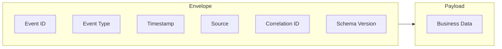
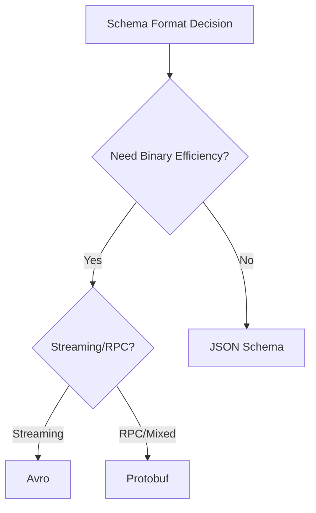
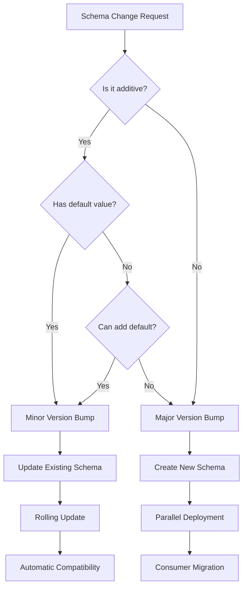
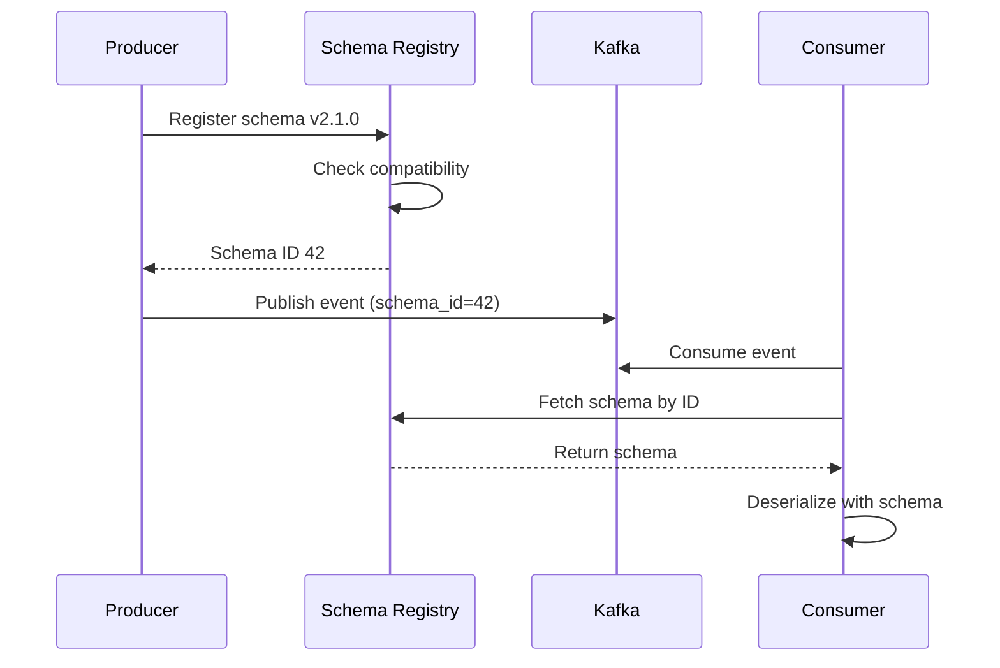

# How to Build Event Schema Design

Author: [nawazdhandala](https://github.com/nawazdhandala)

Tags: Event-Driven, Schema, Design, Architecture

Description: A practical guide to designing event schemas that evolve gracefully, covering envelopes, metadata, payloads, and versioning with Avro, JSON Schema, and Protobuf examples.

---

Event-driven systems live or die by schema design. Get it right and your services decouple cleanly, evolve independently, and communicate without friction. Get it wrong and you spend months untangling breaking changes, debugging serialization failures, and writing custom migration scripts.

This guide covers the building blocks of event schema design: the envelope pattern, metadata standards, payload structures, and versioning strategies. We will walk through concrete examples in Avro, JSON Schema, and Protobuf so you can pick the right tool for your stack.

---

## Table of Contents

1. Why Event Schemas Matter
2. The Event Envelope Pattern
3. Metadata Design
4. Payload Structure
5. Schema Formats Compared
6. Avro Event Examples
7. JSON Schema Event Examples
8. Protobuf Event Examples
9. Schema Evolution and Versioning
10. Common Pitfalls
11. Putting It Together

---

## 1. Why Event Schemas Matter

Events are contracts. When Service A publishes an `OrderCreated` event, every downstream consumer depends on that shape. Without a schema:

- Consumers guess at field names and types
- Breaking changes slip through unnoticed until production
- Documentation drifts from reality
- Validation happens too late (or never)

A well-designed schema provides:

| Benefit | Description |
|---------|-------------|
| Type Safety | Catch mismatches at compile time or serialization |
| Documentation | Schema is the source of truth |
| Evolution Rules | Define what changes are safe |
| Tooling | Generate code, validate payloads, run compatibility checks |

---

## 2. The Event Envelope Pattern

Wrap every event in a standard envelope. The envelope carries routing and metadata; the payload carries business data. This separation lets infrastructure handle events generically while consumers focus on domain logic.



Standard envelope fields:

| Field | Type | Purpose |
|-------|------|---------|
| event_id | string (UUID) | Unique identifier for deduplication |
| event_type | string | Fully qualified event name |
| timestamp | ISO 8601 | When the event occurred |
| source | string | Service or system that produced it |
| correlation_id | string | Links related events across services |
| schema_version | string | Schema version for evolution |
| payload | object | The actual business data |

---

## 3. Metadata Design

Good metadata enables observability, debugging, and routing without touching the payload.

### Core Metadata

```json
{
  "event_id": "550e8400-e29b-41d4-a716-446655440000",
  "event_type": "com.example.orders.OrderCreated",
  "timestamp": "2026-01-30T14:30:00.000Z",
  "source": "order-service",
  "correlation_id": "req-abc-123",
  "schema_version": "1.2.0"
}
```

### Extended Metadata (Optional)

| Field | Use Case |
|-------|----------|
| trace_id | OpenTelemetry trace correlation |
| span_id | Span-level linking |
| causation_id | The event that caused this one |
| user_id | Actor who triggered the action (if applicable) |
| tenant_id | Multi-tenant isolation |
| content_type | Serialization format hint |

### Metadata Guidelines

1. Keep metadata flat and primitive types only
2. Use consistent naming (snake_case or camelCase, pick one)
3. Never put business logic in metadata
4. Make trace IDs optional but supported everywhere

---

## 4. Payload Structure

The payload is your domain model in motion. Design it for clarity, evolution, and minimal coupling.

### Payload Principles

1. **Self-Describing**: Include enough context to process without external lookups
2. **Aggregate Boundaries**: Match your domain aggregates
3. **Immutable Snapshots**: Events describe what happened, not what to do
4. **Minimal but Complete**: Include what consumers need, nothing more

### Example Payload Structure

```json
{
  "order_id": "ord-12345",
  "customer": {
    "id": "cust-67890",
    "email": "user@example.com"
  },
  "items": [
    {
      "sku": "WIDGET-001",
      "quantity": 2,
      "unit_price": 29.99
    }
  ],
  "total": 59.98,
  "currency": "USD",
  "status": "created"
}
```

### Payload Anti-Patterns

| Anti-Pattern | Problem | Fix |
|--------------|---------|-----|
| Embedding foreign keys only | Consumers need extra calls | Include denormalized data |
| Deeply nested objects | Hard to evolve | Flatten or use references |
| Sensitive data in events | Compliance risk | Encrypt or omit |
| Commands disguised as events | Breaks event sourcing semantics | Use past tense naming |

---

## 5. Schema Formats Compared



| Feature | JSON Schema | Avro | Protobuf |
|---------|-------------|------|----------|
| Encoding | JSON (text) | Binary | Binary |
| Schema Evolution | Manual validation | Built-in rules | Built-in rules |
| Code Generation | Limited | Strong | Strong |
| Human Readable | Yes | Schema only | Schema only |
| Kafka Integration | Basic | Native | Good |
| Size Efficiency | Low | High | High |
| Learning Curve | Low | Medium | Medium |

---

## 6. Avro Event Examples

Avro excels in Kafka ecosystems with its schema registry integration and compact binary format.

### Avro Envelope Schema

```json
{
  "type": "record",
  "name": "EventEnvelope",
  "namespace": "com.example.events",
  "fields": [
    {"name": "event_id", "type": "string"},
    {"name": "event_type", "type": "string"},
    {"name": "timestamp", "type": "string"},
    {"name": "source", "type": "string"},
    {"name": "correlation_id", "type": ["null", "string"], "default": null},
    {"name": "schema_version", "type": "string"},
    {"name": "trace_id", "type": ["null", "string"], "default": null},
    {"name": "payload", "type": "bytes"}
  ]
}
```

### Avro OrderCreated Payload

```json
{
  "type": "record",
  "name": "OrderCreated",
  "namespace": "com.example.orders",
  "fields": [
    {"name": "order_id", "type": "string"},
    {
      "name": "customer",
      "type": {
        "type": "record",
        "name": "Customer",
        "fields": [
          {"name": "id", "type": "string"},
          {"name": "email", "type": "string"}
        ]
      }
    },
    {
      "name": "items",
      "type": {
        "type": "array",
        "items": {
          "type": "record",
          "name": "LineItem",
          "fields": [
            {"name": "sku", "type": "string"},
            {"name": "quantity", "type": "int"},
            {"name": "unit_price", "type": "double"}
          ]
        }
      }
    },
    {"name": "total", "type": "double"},
    {"name": "currency", "type": "string", "default": "USD"},
    {"name": "status", "type": "string"},
    {"name": "notes", "type": ["null", "string"], "default": null}
  ]
}
```

### Avro Evolution Rules

| Change | Backward Compatible | Forward Compatible |
|--------|--------------------|--------------------|
| Add field with default | Yes | Yes |
| Remove field with default | Yes | Yes |
| Add field without default | No | Yes |
| Remove field without default | Yes | No |
| Rename field | No | No |
| Change type | Usually No | Usually No |

---

## 7. JSON Schema Event Examples

JSON Schema works well for REST APIs, webhooks, and systems where human readability matters.

### JSON Schema Envelope

```json
{
  "$schema": "https://json-schema.org/draft/2020-12/schema",
  "$id": "https://example.com/schemas/event-envelope.json",
  "title": "EventEnvelope",
  "type": "object",
  "required": ["event_id", "event_type", "timestamp", "source", "schema_version", "payload"],
  "properties": {
    "event_id": {
      "type": "string",
      "format": "uuid",
      "description": "Unique event identifier"
    },
    "event_type": {
      "type": "string",
      "pattern": "^[a-z]+\\.[a-z]+\\.[A-Z][a-zA-Z]+$",
      "description": "Fully qualified event type"
    },
    "timestamp": {
      "type": "string",
      "format": "date-time"
    },
    "source": {
      "type": "string"
    },
    "correlation_id": {
      "type": "string"
    },
    "schema_version": {
      "type": "string",
      "pattern": "^\\d+\\.\\d+\\.\\d+$"
    },
    "trace_id": {
      "type": "string"
    },
    "payload": {
      "type": "object"
    }
  }
}
```

### JSON Schema OrderCreated Payload

```json
{
  "$schema": "https://json-schema.org/draft/2020-12/schema",
  "$id": "https://example.com/schemas/orders/order-created.json",
  "title": "OrderCreated",
  "type": "object",
  "required": ["order_id", "customer", "items", "total", "currency", "status"],
  "properties": {
    "order_id": {
      "type": "string",
      "pattern": "^ord-[a-z0-9]+$"
    },
    "customer": {
      "$ref": "#/$defs/Customer"
    },
    "items": {
      "type": "array",
      "minItems": 1,
      "items": {
        "$ref": "#/$defs/LineItem"
      }
    },
    "total": {
      "type": "number",
      "minimum": 0
    },
    "currency": {
      "type": "string",
      "enum": ["USD", "EUR", "GBP"]
    },
    "status": {
      "type": "string",
      "enum": ["created", "confirmed", "shipped", "delivered", "cancelled"]
    },
    "notes": {
      "type": "string"
    }
  },
  "$defs": {
    "Customer": {
      "type": "object",
      "required": ["id", "email"],
      "properties": {
        "id": {"type": "string"},
        "email": {"type": "string", "format": "email"}
      }
    },
    "LineItem": {
      "type": "object",
      "required": ["sku", "quantity", "unit_price"],
      "properties": {
        "sku": {"type": "string"},
        "quantity": {"type": "integer", "minimum": 1},
        "unit_price": {"type": "number", "minimum": 0}
      }
    }
  }
}
```

---

## 8. Protobuf Event Examples

Protobuf shines in polyglot environments and when you need strong code generation with compact payloads.

### Protobuf Envelope

```protobuf
syntax = "proto3";

package example.events;

import "google/protobuf/timestamp.proto";
import "google/protobuf/any.proto";

message EventEnvelope {
  string event_id = 1;
  string event_type = 2;
  google.protobuf.Timestamp timestamp = 3;
  string source = 4;
  optional string correlation_id = 5;
  string schema_version = 6;
  optional string trace_id = 7;
  google.protobuf.Any payload = 8;
}
```

### Protobuf OrderCreated Payload

```protobuf
syntax = "proto3";

package example.orders;

message Customer {
  string id = 1;
  string email = 2;
}

message LineItem {
  string sku = 1;
  int32 quantity = 2;
  double unit_price = 3;
}

message OrderCreated {
  string order_id = 1;
  Customer customer = 2;
  repeated LineItem items = 3;
  double total = 4;
  string currency = 5;
  OrderStatus status = 6;
  optional string notes = 7;
}

enum OrderStatus {
  ORDER_STATUS_UNSPECIFIED = 0;
  ORDER_STATUS_CREATED = 1;
  ORDER_STATUS_CONFIRMED = 2;
  ORDER_STATUS_SHIPPED = 3;
  ORDER_STATUS_DELIVERED = 4;
  ORDER_STATUS_CANCELLED = 5;
}
```

### Protobuf Evolution Rules

| Change | Safe? | Notes |
|--------|-------|-------|
| Add optional field | Yes | Use new field number |
| Remove field | Yes | Keep field number reserved |
| Rename field | Yes | Field numbers matter, not names |
| Change field number | No | Breaks wire format |
| Change type | Sometimes | int32 to int64 works |
| Add enum value | Yes | Add to end |
| Remove enum value | No | Use reserved |

---

## 9. Schema Evolution and Versioning

Schema evolution is where designs succeed or fail. Plan for change from day one.



### Versioning Strategies

**Semantic Versioning (Recommended)**

```
event_type: com.example.orders.OrderCreated
schema_version: 2.1.0

Major: Breaking changes (removed required field)
Minor: Backward compatible additions
Patch: Documentation or metadata only
```

**URL-Based Versioning**

```
event_type: com.example.orders.v2.OrderCreated
```

**Header-Based Versioning**

```
schema_version: 2
content_type: application/vnd.example.order-created.v2+json
```

### Evolution Best Practices

1. **Never remove required fields in minor versions**
2. **Always add defaults for new fields**
3. **Use schema registry for enforcement**
4. **Test compatibility before deployment**
5. **Support N-1 versions during migration**

### Schema Registry Flow



---

## 10. Common Pitfalls

### Pitfall 1: No Schema at All

Starting without schemas leads to tribal knowledge and implicit contracts that break silently.

**Fix**: Define schemas from the first event. Use JSON Schema for quick starts, migrate to Avro or Protobuf as you scale.

### Pitfall 2: Overly Generic Events

```json
{
  "type": "EntityChanged",
  "entity_type": "order",
  "entity_id": "12345",
  "changes": {"status": "shipped"}
}
```

This pushes complexity to consumers who must interpret `changes` dynamically.

**Fix**: Use specific event types: `OrderShipped`, `OrderCancelled`, `OrderUpdated`.

### Pitfall 3: Missing Envelope

Embedding metadata inconsistently across event types makes routing and observability painful.

**Fix**: Standardize on one envelope schema for all events.

### Pitfall 4: Tight Coupling to Internal Models

Exposing database entities directly as events couples consumers to your implementation.

**Fix**: Define explicit public event schemas separate from internal models.

### Pitfall 5: Ignoring Time Zones

Using local time or Unix timestamps without timezone info causes silent bugs.

**Fix**: Always use ISO 8601 with explicit timezone (preferably UTC).

```json
{
  "timestamp": "2026-01-30T14:30:00.000Z"
}
```

---

## 11. Putting It Together

Here is a complete event example combining envelope, metadata, and payload:

### Full Event (JSON)

```json
{
  "event_id": "550e8400-e29b-41d4-a716-446655440000",
  "event_type": "com.example.orders.OrderCreated",
  "timestamp": "2026-01-30T14:30:00.000Z",
  "source": "order-service",
  "correlation_id": "req-abc-123",
  "schema_version": "1.2.0",
  "trace_id": "4f3ae9d1c044abcd",
  "payload": {
    "order_id": "ord-12345",
    "customer": {
      "id": "cust-67890",
      "email": "user@example.com"
    },
    "items": [
      {
        "sku": "WIDGET-001",
        "quantity": 2,
        "unit_price": 29.99
      }
    ],
    "total": 59.98,
    "currency": "USD",
    "status": "created"
  }
}
```

### Validation Checklist

- [ ] Event ID is a valid UUID
- [ ] Event type follows naming convention
- [ ] Timestamp is ISO 8601 with timezone
- [ ] Schema version is semver format
- [ ] Payload matches schema for version
- [ ] Required fields are present
- [ ] No PII in unencrypted fields

### Implementation Steps

1. **Define envelope schema** in your chosen format
2. **Create payload schemas** for each event type
3. **Set up schema registry** (Confluent, Apicurio, or custom)
4. **Configure compatibility rules** (backward, forward, or full)
5. **Generate code** from schemas for type safety
6. **Add validation** to producers and consumers
7. **Monitor schema evolution** through CI/CD checks

---

## Summary

| Component | Purpose | Key Decisions |
|-----------|---------|---------------|
| Envelope | Routing and metadata | Standardize across all events |
| Metadata | Observability and correlation | Include trace IDs, keep flat |
| Payload | Business data | Match domain aggregates |
| Versioning | Safe evolution | Semantic versioning with registry |
| Format | Serialization | JSON Schema for readability, Avro/Protobuf for performance |

Event schema design is an investment that pays dividends as your system grows. Start simple with JSON Schema if you need to move fast. Migrate to Avro or Protobuf when throughput and strong typing become priorities. Either way, the envelope pattern and versioning discipline will keep your event-driven architecture healthy.

---

*Building event-driven systems with OpenTelemetry? [OneUptime](https://oneuptime.com) provides unified observability for traces, logs, and metrics so you can correlate events with system behavior and debug issues faster.*

---

**Related Reading:**

- [Traces and Spans in OpenTelemetry](https://oneuptime.com/blog/post/2025-08-27-traces-and-spans-in-opentelemetry/view)
- [Three Pillars of Observability](https://oneuptime.com/blog/post/2025-08-20-three-pillars-of-observability-logs-metrics-traces/view)
- [How to Structure Logs Properly in OpenTelemetry](https://oneuptime.com/blog/post/2025-08-28-how-to-structure-logs-properly-in-opentelemetry/view)
