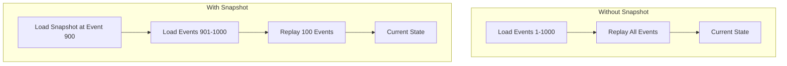
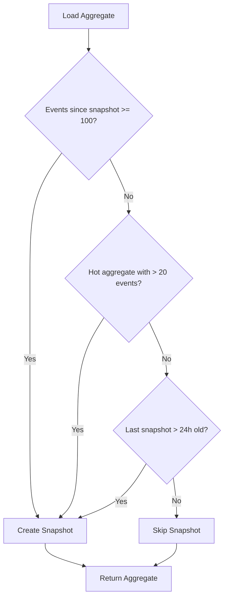

# How to Implement Event Snapshotting

Author: [nawazdhandala](https://github.com/nawazdhandala)

Tags: Event Sourcing, Snapshots, Performance, State Management

Description: Learn to implement event snapshotting for faster state reconstruction and improved event sourcing performance.

---

Event sourcing stores every state change as an immutable event. This approach provides a complete audit trail and enables time-travel debugging - but replaying thousands of events to reconstruct current state gets slow. Event snapshotting solves this by periodically capturing state at a point in time, allowing you to replay only the events that occurred after the snapshot.

This guide walks through implementing event snapshotting from scratch, covering the core patterns, practical code examples, and strategies for choosing when to create snapshots.

---

## Table of Contents

1. Why Snapshotting Matters
2. How Snapshotting Works
3. Snapshot Storage Strategies
4. Implementation in TypeScript
5. Snapshot Frequency Strategies
6. Versioning and Schema Evolution
7. Performance Considerations
8. Common Pitfalls

---

## 1. Why Snapshotting Matters

Without snapshotting, reconstructing an aggregate's current state requires replaying every event from the beginning. For a shopping cart with 10 events, this is negligible. For an account with 50,000 transactions spanning five years, it becomes a problem.

| Scenario | Events to Replay | Approximate Load Time |
|----------|------------------|----------------------|
| New user account | 50 | < 10ms |
| Active user (1 year) | 2,000 | 100-200ms |
| High-volume account (5 years) | 50,000 | 2-5 seconds |
| With snapshot every 100 events | 0-100 | < 20ms |

Snapshotting trades storage space for read performance. You store periodic state checkpoints and only replay events that occurred after the most recent snapshot.

---

## 2. How Snapshotting Works

The snapshotting process involves three phases: detecting when a snapshot is needed, capturing the current state, and using that snapshot during reconstruction.

The following diagram illustrates the state reconstruction process with and without snapshots.



The snapshot contains the aggregate's complete state at a specific event version. When loading the aggregate later, you first load the snapshot, then replay only the events that occurred after that snapshot version.

---

## 3. Snapshot Storage Strategies

You have several options for where to store snapshots, each with different tradeoffs.

| Strategy | Pros | Cons | Best For |
|----------|------|------|----------|
| Same database, separate table | Transactional consistency, simple queries | Increased DB size | Most applications |
| Separate database | Independent scaling | Eventual consistency | High-volume systems |
| Object storage (S3, GCS) | Cheap, unlimited scale | Higher latency | Large snapshots, archival |
| In-memory cache | Fastest reads | Memory limits, cold starts | Hot aggregates |

For most applications, storing snapshots in a dedicated table within your event store database provides the best balance of simplicity and performance.

---

## 4. Implementation in TypeScript

Let's build a complete snapshotting system. We start with the core interfaces that define our domain model.

```typescript
// types.ts - Core interfaces for our event sourcing system
interface Event {
  id: string;
  aggregateId: string;
  type: string;
  data: Record<string, unknown>;
  version: number;
  timestamp: Date;
}

interface Snapshot<T> {
  aggregateId: string;
  state: T;
  version: number;        // Event version this snapshot represents
  timestamp: Date;
  schemaVersion: number;  // For handling migrations
}

interface Aggregate<T> {
  id: string;
  state: T;
  version: number;
}
```

Next, we implement the snapshot store that handles persistence. This class manages saving and retrieving snapshots from the database.

```typescript
// snapshot-store.ts - Handles snapshot persistence
class SnapshotStore<T> {
  constructor(private db: Database) {}

  // Save a snapshot after applying events
  async save(snapshot: Snapshot<T>): Promise<void> {
    await this.db.query(
      `INSERT INTO snapshots (aggregate_id, state, version, schema_version, timestamp)
       VALUES ($1, $2, $3, $4, $5)
       ON CONFLICT (aggregate_id)
       DO UPDATE SET state = $2, version = $3, schema_version = $4, timestamp = $5`,
      [
        snapshot.aggregateId,
        JSON.stringify(snapshot.state),
        snapshot.version,
        snapshot.schemaVersion,
        snapshot.timestamp
      ]
    );
  }

  // Retrieve the most recent snapshot for an aggregate
  async load(aggregateId: string): Promise<Snapshot<T> | null> {
    const result = await this.db.query(
      `SELECT state, version, schema_version, timestamp
       FROM snapshots
       WHERE aggregate_id = $1`,
      [aggregateId]
    );

    if (result.rows.length === 0) return null;

    const row = result.rows[0];
    return {
      aggregateId,
      state: JSON.parse(row.state),
      version: row.version,
      schemaVersion: row.schema_version,
      timestamp: row.timestamp
    };
  }
}
```

The aggregate repository ties everything together. It loads aggregates by first checking for a snapshot, then replaying any subsequent events.

```typescript
// aggregate-repository.ts - Loads aggregates using snapshots
class AggregateRepository<T> {
  private snapshotThreshold = 100;  // Create snapshot every 100 events

  constructor(
    private eventStore: EventStore,
    private snapshotStore: SnapshotStore<T>,
    private reducer: (state: T, event: Event) => T,
    private initialState: () => T
  ) {}

  async load(aggregateId: string): Promise<Aggregate<T>> {
    // Step 1: Try to load existing snapshot
    const snapshot = await this.snapshotStore.load(aggregateId);

    // Step 2: Determine starting point for event replay
    const fromVersion = snapshot ? snapshot.version + 1 : 0;
    let state = snapshot ? snapshot.state : this.initialState();
    let version = snapshot ? snapshot.version : 0;

    // Step 3: Load and replay events after snapshot
    const events = await this.eventStore.getEvents(aggregateId, fromVersion);

    for (const event of events) {
      state = this.reducer(state, event);
      version = event.version;
    }

    // Step 4: Create new snapshot if threshold exceeded
    const eventsSinceSnapshot = snapshot
      ? version - snapshot.version
      : version;

    if (eventsSinceSnapshot >= this.snapshotThreshold) {
      await this.createSnapshot(aggregateId, state, version);
    }

    return { id: aggregateId, state, version };
  }

  private async createSnapshot(
    aggregateId: string,
    state: T,
    version: number
  ): Promise<void> {
    await this.snapshotStore.save({
      aggregateId,
      state,
      version,
      schemaVersion: 1,
      timestamp: new Date()
    });
  }
}
```

Here is a practical example applying these patterns to a bank account aggregate.

```typescript
// account-example.ts - Bank account with snapshotting
interface AccountState {
  balance: number;
  currency: string;
  transactionCount: number;
  lastTransactionDate: Date | null;
}

// Reducer applies events to build current state
function accountReducer(state: AccountState, event: Event): AccountState {
  switch (event.type) {
    case 'AccountOpened':
      return {
        ...state,
        currency: event.data.currency as string,
        balance: event.data.initialDeposit as number
      };

    case 'MoneyDeposited':
      return {
        ...state,
        balance: state.balance + (event.data.amount as number),
        transactionCount: state.transactionCount + 1,
        lastTransactionDate: event.timestamp
      };

    case 'MoneyWithdrawn':
      return {
        ...state,
        balance: state.balance - (event.data.amount as number),
        transactionCount: state.transactionCount + 1,
        lastTransactionDate: event.timestamp
      };

    default:
      return state;
  }
}

// Initialize repository with snapshotting support
const accountRepo = new AggregateRepository<AccountState>(
  eventStore,
  new SnapshotStore<AccountState>(db),
  accountReducer,
  () => ({ balance: 0, currency: 'USD', transactionCount: 0, lastTransactionDate: null })
);

// Load account - automatically uses snapshot if available
const account = await accountRepo.load('account-123');
```

---

## 5. Snapshot Frequency Strategies

Choosing when to create snapshots involves balancing storage costs against read performance. Here are the main approaches.

**Event count threshold** creates a snapshot after a fixed number of events. This is simple to implement and predictable, but does not account for event complexity or aggregate access patterns.

**Time-based snapshots** create checkpoints at regular intervals (hourly, daily). This works well for aggregates with consistent activity levels.

**Hybrid approach** combines both strategies and adds access-pattern awareness.

```typescript
// snapshot-strategy.ts - Intelligent snapshot decisions
class SnapshotStrategy {
  private eventThreshold = 100;
  private timeThresholdMs = 24 * 60 * 60 * 1000;  // 24 hours
  private accessCount = new Map<string, number>();

  shouldSnapshot(
    aggregateId: string,
    eventsSinceSnapshot: number,
    lastSnapshotTime: Date | null
  ): boolean {
    // Always snapshot after threshold events
    if (eventsSinceSnapshot >= this.eventThreshold) {
      return true;
    }

    // Snapshot hot aggregates more frequently
    const accesses = this.accessCount.get(aggregateId) || 0;
    if (accesses > 10 && eventsSinceSnapshot > 20) {
      return true;
    }

    // Time-based snapshot for stale data
    if (lastSnapshotTime) {
      const timeSinceSnapshot = Date.now() - lastSnapshotTime.getTime();
      if (timeSinceSnapshot > this.timeThresholdMs && eventsSinceSnapshot > 0) {
        return true;
      }
    }

    return false;
  }

  recordAccess(aggregateId: string): void {
    const current = this.accessCount.get(aggregateId) || 0;
    this.accessCount.set(aggregateId, current + 1);
  }
}
```

The following diagram shows how the snapshot decision process works.



---

## 6. Versioning and Schema Evolution

As your application evolves, snapshot schemas will change. Without versioning, old snapshots become unusable. The solution is to version your snapshots and write migration functions.

```typescript
// snapshot-migrator.ts - Handle schema changes over time
type MigrationFn<T> = (oldState: unknown) => T;

class SnapshotMigrator<T> {
  private migrations: Map<number, MigrationFn<T>> = new Map();
  private currentVersion = 2;

  constructor() {
    // Register migrations from old versions to current
    this.migrations.set(1, this.migrateV1toV2.bind(this));
  }

  migrate(snapshot: Snapshot<unknown>): Snapshot<T> {
    let state = snapshot.state;
    let version = snapshot.schemaVersion;

    // Apply migrations sequentially until current
    while (version < this.currentVersion) {
      const migration = this.migrations.get(version);
      if (!migration) {
        throw new Error(`Missing migration from version ${version}`);
      }
      state = migration(state);
      version++;
    }

    return {
      ...snapshot,
      state: state as T,
      schemaVersion: this.currentVersion
    };
  }

  // Example migration: added currency field in v2
  private migrateV1toV2(oldState: unknown): T {
    const v1 = oldState as { balance: number; transactionCount: number };
    return {
      balance: v1.balance,
      currency: 'USD',  // Default for existing accounts
      transactionCount: v1.transactionCount,
      lastTransactionDate: null
    } as T;
  }
}
```

---

## 7. Performance Considerations

Snapshotting introduces its own performance characteristics that you should monitor.

| Metric | Target | Warning Sign |
|--------|--------|--------------|
| Snapshot size | < 1 MB | Bloated state, consider splitting aggregate |
| Snapshot creation time | < 100ms | Complex serialization, optimize state structure |
| Events replayed after snapshot | < 100 | Threshold too high or snapshots failing |
| Snapshot hit rate | > 90% | Snapshots expiring too quickly |

For large-scale systems, consider these optimizations.

**Async snapshot creation** prevents blocking the main request path. Create snapshots in a background job after returning the response.

**Compression** reduces storage costs for large snapshots. Use gzip or similar compression before persisting.

**Snapshot warming** pre-loads frequently accessed aggregates into cache during off-peak hours.

---

## 8. Common Pitfalls

**Snapshotting too frequently** wastes storage and creates unnecessary write load. Start with a threshold of 100 events and adjust based on your access patterns.

**Forgetting to version snapshots** causes failures when you change your state schema. Always include a schema version from day one.

**Storing derived data in snapshots** creates consistency issues. Snapshots should contain only the data needed to reconstruct state - derived values should be recomputed.

**Not testing snapshot restoration** leads to production surprises. Write tests that create a snapshot, add events, load the aggregate, and verify the final state.

```typescript
// snapshot.test.ts - Verify snapshot behavior
describe('Snapshot restoration', () => {
  it('should restore state correctly from snapshot plus events', async () => {
    // Create initial state and snapshot
    await eventStore.append('acc-1', [
      { type: 'AccountOpened', data: { currency: 'USD', initialDeposit: 100 } },
      { type: 'MoneyDeposited', data: { amount: 50 } }
    ]);

    const firstLoad = await repo.load('acc-1');
    expect(firstLoad.state.balance).toBe(150);

    // Add more events after snapshot
    await eventStore.append('acc-1', [
      { type: 'MoneyWithdrawn', data: { amount: 30 } }
    ]);

    // Load again - should use snapshot + replay new event
    const secondLoad = await repo.load('acc-1');
    expect(secondLoad.state.balance).toBe(120);
  });
});
```

---

## Summary

Event snapshotting provides a practical solution to the performance challenges of event sourcing. By periodically capturing state, you avoid replaying the full event history while preserving the benefits of event sourcing - complete audit trails, temporal queries, and event-driven architectures.

Start simple with a fixed event threshold, add schema versioning from the beginning, and monitor your snapshot hit rates in production. As your system grows, consider more sophisticated strategies like access-pattern-aware snapshotting and async snapshot creation.

---

**Related Reading:**

- [Event Sourcing Basics](https://martinfowler.com/eaaDev/EventSourcing.html)
- [CQRS and Event Sourcing](https://docs.microsoft.com/en-us/azure/architecture/patterns/cqrs)
- [Traces and Spans in OpenTelemetry](/blog/post/2025-08-27-traces-and-spans-in-opentelemetry/) - Monitor your event sourcing system with distributed tracing
