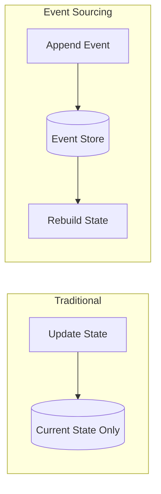
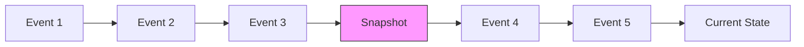
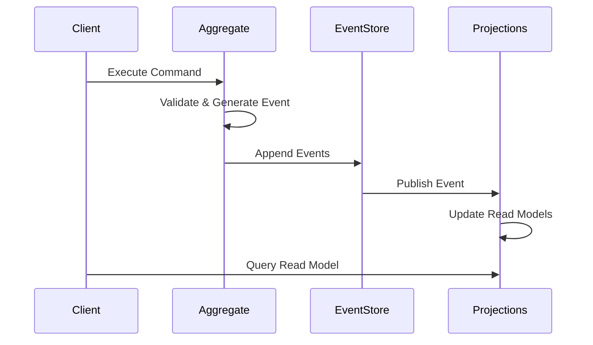

# How to Build Event Sourcing Implementation

Author: [nawazdhandala](https://www.github.com/nawazdhandala)

Tags: Event Sourcing, CQRS, Architecture, Microservices, Event Store

Description: Implement event sourcing from scratch with event stores, snapshots, projections, and replay capabilities for audit-ready systems.

---

Event sourcing is one of those patterns that sounds complicated until you actually build it. Instead of storing the current state of your data, you store a sequence of events that led to that state. Think of it like a bank statement - you do not just see your balance, you see every transaction that got you there.

In this guide, we will build a complete event sourcing system from the ground up, covering event stores, snapshots, projections, and replay capabilities.

## Why Event Sourcing?

Before diving into code, let us understand what makes event sourcing valuable:

- **Complete audit trail**: Every change is recorded as an immutable event
- **Temporal queries**: You can reconstruct state at any point in time
- **Event replay**: Rebuild read models or fix bugs by replaying events
- **Debugging**: Trace exactly what happened and when

Here is how traditional state storage compares to event sourcing:



## Core Building Blocks

Let us start by defining the fundamental components of our event sourcing system.

### Event Base Class

Every event in our system needs common properties for identification and ordering.

```typescript
// Base interface that all domain events must implement
interface DomainEvent {
  // Unique identifier for this specific event instance
  eventId: string;

  // Type of event for deserialization and routing
  eventType: string;

  // ID of the aggregate this event belongs to
  aggregateId: string;

  // Version number for optimistic concurrency control
  version: number;

  // When the event occurred
  timestamp: Date;

  // The actual event payload
  payload: Record<string, unknown>;
}

// Helper function to create new events with auto-generated metadata
function createEvent(
  eventType: string,
  aggregateId: string,
  version: number,
  payload: Record<string, unknown>
): DomainEvent {
  return {
    eventId: crypto.randomUUID(),
    eventType,
    aggregateId,
    version,
    timestamp: new Date(),
    payload,
  };
}
```

### The Event Store

The event store is the heart of our system. It handles persisting events and retrieving them for replay.

```typescript
// In-memory event store for demonstration
// Replace with PostgreSQL, EventStoreDB, or similar in production
class EventStore {
  // Events grouped by aggregate ID for efficient retrieval
  private events: Map<string, DomainEvent[]> = new Map();

  // Global event log for cross-aggregate queries
  private globalLog: DomainEvent[] = [];

  // Subscribers for real-time event notifications
  private subscribers: ((event: DomainEvent) => void)[] = [];

  // Append new events to the store with optimistic concurrency check
  async append(
    aggregateId: string,
    events: DomainEvent[],
    expectedVersion: number
  ): Promise<void> {
    const existingEvents = this.events.get(aggregateId) || [];
    const currentVersion = existingEvents.length;

    // Concurrency check - prevents lost updates
    if (currentVersion !== expectedVersion) {
      throw new Error(
        `Concurrency conflict: expected version ${expectedVersion}, ` +
        `but current version is ${currentVersion}`
      );
    }

    // Append events atomically
    for (const event of events) {
      existingEvents.push(event);
      this.globalLog.push(event);

      // Notify subscribers for projections and integrations
      this.subscribers.forEach(sub => sub(event));
    }

    this.events.set(aggregateId, existingEvents);
  }

  // Retrieve all events for a specific aggregate
  async getEvents(aggregateId: string): Promise<DomainEvent[]> {
    return this.events.get(aggregateId) || [];
  }

  // Get events starting from a specific version (for partial replay)
  async getEventsFromVersion(
    aggregateId: string,
    fromVersion: number
  ): Promise<DomainEvent[]> {
    const events = this.events.get(aggregateId) || [];
    return events.filter(e => e.version >= fromVersion);
  }

  // Subscribe to new events for building projections
  subscribe(handler: (event: DomainEvent) => void): void {
    this.subscribers.push(handler);
  }
}
```

## Building an Aggregate

Aggregates are domain objects that generate and apply events. Here is a complete example using a shopping cart.

```typescript
// Define specific events for our shopping cart domain
interface ItemAddedEvent extends DomainEvent {
  eventType: 'ItemAdded';
  payload: {
    productId: string;
    quantity: number;
    price: number;
  };
}

interface ItemRemovedEvent extends DomainEvent {
  eventType: 'ItemRemoved';
  payload: {
    productId: string;
  };
}

interface CartCheckedOutEvent extends DomainEvent {
  eventType: 'CartCheckedOut';
  payload: {
    totalAmount: number;
  };
}

// Shopping cart aggregate with event sourcing
class ShoppingCart {
  private id: string;
  private version: number = 0;
  private items: Map<string, { quantity: number; price: number }> = new Map();
  private checkedOut: boolean = false;

  // Uncommitted events waiting to be persisted
  private uncommittedEvents: DomainEvent[] = [];

  constructor(id: string) {
    this.id = id;
  }

  // Command: Add item to cart
  addItem(productId: string, quantity: number, price: number): void {
    if (this.checkedOut) {
      throw new Error('Cannot modify checked out cart');
    }

    // Generate and apply the event
    const event = createEvent('ItemAdded', this.id, this.version + 1, {
      productId,
      quantity,
      price,
    });

    this.apply(event);
    this.uncommittedEvents.push(event);
  }

  // Command: Remove item from cart
  removeItem(productId: string): void {
    if (!this.items.has(productId)) {
      throw new Error('Item not in cart');
    }

    const event = createEvent('ItemRemoved', this.id, this.version + 1, {
      productId,
    });

    this.apply(event);
    this.uncommittedEvents.push(event);
  }

  // Command: Checkout the cart
  checkout(): void {
    if (this.items.size === 0) {
      throw new Error('Cannot checkout empty cart');
    }

    const totalAmount = this.calculateTotal();
    const event = createEvent('CartCheckedOut', this.id, this.version + 1, {
      totalAmount,
    });

    this.apply(event);
    this.uncommittedEvents.push(event);
  }

  // Apply an event to update internal state
  private apply(event: DomainEvent): void {
    switch (event.eventType) {
      case 'ItemAdded': {
        const { productId, quantity, price } = event.payload as ItemAddedEvent['payload'];
        const existing = this.items.get(productId);
        this.items.set(productId, {
          quantity: (existing?.quantity || 0) + quantity,
          price,
        });
        break;
      }
      case 'ItemRemoved': {
        const { productId } = event.payload as ItemRemovedEvent['payload'];
        this.items.delete(productId);
        break;
      }
      case 'CartCheckedOut':
        this.checkedOut = true;
        break;
    }
    this.version = event.version;
  }

  // Rebuild aggregate state from event history
  static fromEvents(id: string, events: DomainEvent[]): ShoppingCart {
    const cart = new ShoppingCart(id);
    for (const event of events) {
      cart.apply(event);
    }
    return cart;
  }

  // Get events that need to be persisted
  getUncommittedEvents(): DomainEvent[] {
    return [...this.uncommittedEvents];
  }

  // Clear uncommitted events after successful save
  markEventsAsCommitted(): void {
    this.uncommittedEvents = [];
  }

  private calculateTotal(): number {
    let total = 0;
    this.items.forEach(item => {
      total += item.quantity * item.price;
    });
    return total;
  }
}
```

## Implementing Snapshots

As aggregates accumulate events, replaying from the beginning becomes slow. Snapshots solve this by periodically saving the current state.



```typescript
// Snapshot storage for aggregate state
interface Snapshot {
  aggregateId: string;
  version: number;
  state: Record<string, unknown>;
  timestamp: Date;
}

class SnapshotStore {
  private snapshots: Map<string, Snapshot> = new Map();

  // How many events before we create a new snapshot
  private snapshotInterval: number = 100;

  async save(aggregateId: string, version: number, state: Record<string, unknown>): Promise<void> {
    this.snapshots.set(aggregateId, {
      aggregateId,
      version,
      state,
      timestamp: new Date(),
    });
  }

  async get(aggregateId: string): Promise<Snapshot | null> {
    return this.snapshots.get(aggregateId) || null;
  }

  shouldSnapshot(eventCount: number): boolean {
    return eventCount % this.snapshotInterval === 0;
  }
}

// Enhanced repository that uses snapshots
class ShoppingCartRepository {
  constructor(
    private eventStore: EventStore,
    private snapshotStore: SnapshotStore
  ) {}

  async load(cartId: string): Promise<ShoppingCart> {
    // Try to load from snapshot first
    const snapshot = await this.snapshotStore.get(cartId);

    if (snapshot) {
      // Restore from snapshot, then apply newer events
      const cart = ShoppingCart.fromSnapshot(cartId, snapshot);
      const newEvents = await this.eventStore.getEventsFromVersion(
        cartId,
        snapshot.version + 1
      );

      for (const event of newEvents) {
        cart.applyEvent(event);
      }

      return cart;
    }

    // No snapshot - replay all events
    const events = await this.eventStore.getEvents(cartId);
    return ShoppingCart.fromEvents(cartId, events);
  }

  async save(cart: ShoppingCart): Promise<void> {
    const events = cart.getUncommittedEvents();
    await this.eventStore.append(cart.id, events, cart.version - events.length);
    cart.markEventsAsCommitted();

    // Create snapshot if needed
    if (this.snapshotStore.shouldSnapshot(cart.version)) {
      await this.snapshotStore.save(cart.id, cart.version, cart.toSnapshot());
    }
  }
}
```

## Building Projections

Projections transform event streams into read-optimized views. They run asynchronously and can be rebuilt at any time.

```typescript
// Projection for tracking sales analytics
class SalesProjection {
  // Read model optimized for queries
  private salesByProduct: Map<string, { quantity: number; revenue: number }> = new Map();
  private dailySales: Map<string, number> = new Map();

  // Called for each relevant event
  handle(event: DomainEvent): void {
    if (event.eventType === 'CartCheckedOut') {
      const dateKey = event.timestamp.toISOString().split('T')[0];
      const { totalAmount } = event.payload as { totalAmount: number };

      // Update daily sales totals
      const currentDaily = this.dailySales.get(dateKey) || 0;
      this.dailySales.set(dateKey, currentDaily + totalAmount);
    }

    if (event.eventType === 'ItemAdded') {
      const { productId, quantity, price } = event.payload as {
        productId: string;
        quantity: number;
        price: number;
      };

      // Update product sales metrics
      const current = this.salesByProduct.get(productId) || { quantity: 0, revenue: 0 };
      this.salesByProduct.set(productId, {
        quantity: current.quantity + quantity,
        revenue: current.revenue + (quantity * price),
      });
    }
  }

  // Query methods for the read model
  getProductSales(productId: string) {
    return this.salesByProduct.get(productId);
  }

  getDailySales(date: string) {
    return this.dailySales.get(date) || 0;
  }
}

// Projection manager handles subscriptions and replay
class ProjectionManager {
  private projections: { name: string; handler: (event: DomainEvent) => void }[] = [];

  register(name: string, handler: (event: DomainEvent) => void): void {
    this.projections.push({ name, handler });
  }

  // Process a single event through all projections
  process(event: DomainEvent): void {
    for (const projection of this.projections) {
      try {
        projection.handler(event);
      } catch (error) {
        console.error(`Projection ${projection.name} failed:`, error);
      }
    }
  }

  // Rebuild all projections from event history
  async rebuild(eventStore: EventStore): Promise<void> {
    const allEvents = await eventStore.getAllEvents();
    for (const event of allEvents) {
      this.process(event);
    }
  }
}
```

## Event Replay for Recovery

One of the most powerful features of event sourcing is the ability to replay events. This enables bug fixes, new projections, and disaster recovery.

```typescript
// Event replayer with progress tracking and filtering
class EventReplayer {
  constructor(private eventStore: EventStore) {}

  // Replay events with optional filtering and progress callback
  async replay(options: {
    fromTimestamp?: Date;
    toTimestamp?: Date;
    eventTypes?: string[];
    onEvent: (event: DomainEvent) => Promise<void>;
    onProgress?: (processed: number, total: number) => void;
  }): Promise<void> {
    const allEvents = await this.eventStore.getAllEvents();

    // Filter events based on criteria
    const filteredEvents = allEvents.filter(event => {
      if (options.fromTimestamp && event.timestamp < options.fromTimestamp) {
        return false;
      }
      if (options.toTimestamp && event.timestamp > options.toTimestamp) {
        return false;
      }
      if (options.eventTypes && !options.eventTypes.includes(event.eventType)) {
        return false;
      }
      return true;
    });

    // Process events in order
    for (let i = 0; i < filteredEvents.length; i++) {
      await options.onEvent(filteredEvents[i]);

      if (options.onProgress) {
        options.onProgress(i + 1, filteredEvents.length);
      }
    }
  }
}

// Example: Rebuild a projection after a bug fix
async function rebuildSalesProjection(
  eventStore: EventStore,
  replayer: EventReplayer
): Promise<SalesProjection> {
  const projection = new SalesProjection();

  await replayer.replay({
    eventTypes: ['ItemAdded', 'CartCheckedOut'],
    onEvent: async (event) => {
      projection.handle(event);
    },
    onProgress: (processed, total) => {
      console.log(`Rebuilding: ${processed}/${total} events processed`);
    },
  });

  return projection;
}
```

## Putting It All Together

Here is how all the pieces work together in a typical flow:



## Production Considerations

When moving to production, keep these points in mind:

1. **Use a proper event store**: PostgreSQL with JSONB, EventStoreDB, or Apache Kafka all work well
2. **Handle schema evolution**: Events are immutable, so plan for versioning with upcasters
3. **Monitor event store growth**: Set up retention policies and archival for old events
4. **Test replay thoroughly**: Ensure projections produce consistent results after replay
5. **Consider event ordering**: Use timestamps and sequence numbers to handle distributed scenarios

## Wrapping Up

Event sourcing provides a robust foundation for systems that need complete audit trails and the ability to understand exactly how data changed over time. The patterns we covered - event stores, snapshots, projections, and replay - form the building blocks you will use regardless of your tech stack.

Start with a simple implementation like we built here, then evolve it based on your specific requirements. The beauty of event sourcing is that you can always go back and rebuild your read models as your understanding of the domain grows.
