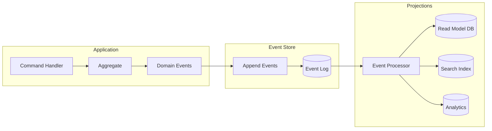
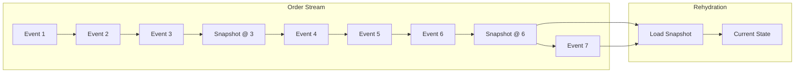
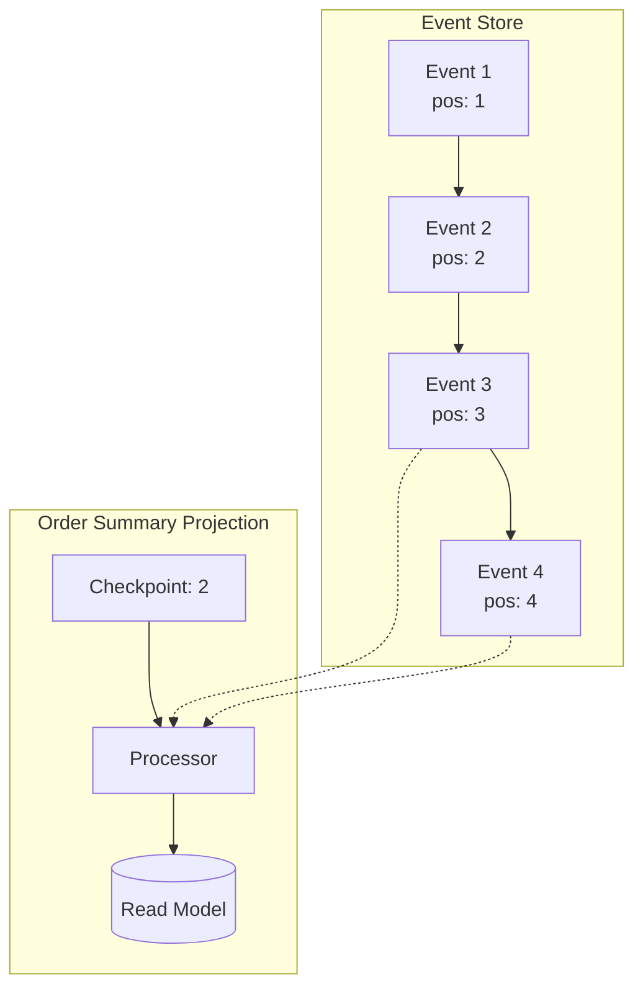
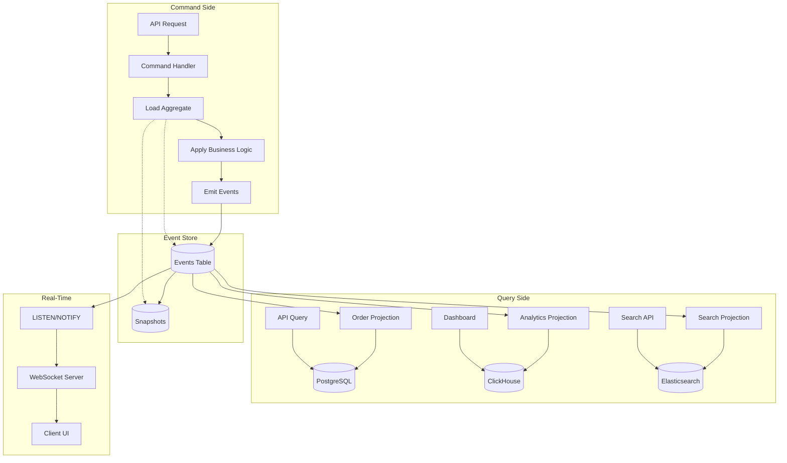

# How to Build Event Store Design

Author: [nawazdhandala](https://github.com/nawazdhandala)

Tags: Event Sourcing, Database, Architecture, DevOps

Description: A practical guide to designing and building an event store from scratch, covering schema design, append-only writes, snapshots, and projection patterns for reliable event-sourced systems.

---

Event sourcing flips the traditional database mindset on its head. Instead of storing the current state of your entities, you store every change that led to that state. The result is a complete, immutable audit trail that can be replayed, analyzed, or projected into any shape you need.

But building an event store that performs well at scale requires careful design choices. This guide walks through the core patterns, schema decisions, and implementation strategies you need to build a production-ready event store.

## What Is an Event Store?

An event store is a specialized database (or layer on top of a general-purpose database) optimized for:

- **Append-only writes**: Events are immutable; you never update or delete them.
- **Stream-based reads**: Events are grouped into streams (typically per aggregate).
- **Sequential ordering**: Events have a strict order within a stream and globally.
- **Subscription support**: Consumers can follow new events as they arrive.



## Core Schema Design

The foundation of any event store is its schema. Here is a minimal but complete design for PostgreSQL.

The events table stores every domain event with metadata for ordering, correlation, and replay.

```sql
-- Core events table: the append-only log of all domain events
CREATE TABLE events (
    -- Global sequence number for total ordering across all streams
    global_position BIGSERIAL PRIMARY KEY,

    -- Stream identifier (e.g., "order-123", "user-456")
    stream_id VARCHAR(255) NOT NULL,

    -- Position within the stream (starts at 1 for each stream)
    stream_position BIGINT NOT NULL,

    -- Event type for deserialization (e.g., "OrderPlaced", "PaymentReceived")
    event_type VARCHAR(255) NOT NULL,

    -- The actual event payload as JSON
    data JSONB NOT NULL,

    -- Optional metadata (correlation IDs, causation IDs, user context)
    metadata JSONB DEFAULT '{}',

    -- Timestamp when the event was recorded
    created_at TIMESTAMPTZ NOT NULL DEFAULT NOW(),

    -- Ensure exactly one event per stream position
    CONSTRAINT unique_stream_position UNIQUE (stream_id, stream_position)
);

-- Index for efficient stream reads
CREATE INDEX idx_events_stream_id ON events (stream_id, stream_position);

-- Index for global subscription catchup
CREATE INDEX idx_events_global_position ON events (global_position);

-- Index for querying by event type (useful for projections)
CREATE INDEX idx_events_event_type ON events (event_type);
```

## Append-Only Write Pattern

The key invariant of an event store is that events are immutable. You append new events; you never modify existing ones. This requires optimistic concurrency control to prevent conflicting writes.

The following function appends events to a stream while checking the expected version. This prevents lost updates when multiple processes try to write to the same stream.

```typescript
// types.ts - Core event store types
interface DomainEvent {
  eventType: string;
  data: Record<string, unknown>;
  metadata?: Record<string, unknown>;
}

interface StoredEvent extends DomainEvent {
  globalPosition: bigint;
  streamId: string;
  streamPosition: bigint;
  createdAt: Date;
}

// Represents the expected state of a stream before appending
type ExpectedVersion =
  | { type: "any" }           // Accept any current version
  | { type: "noStream" }      // Stream must not exist
  | { type: "exact"; version: bigint }; // Stream must be at this version
```

```typescript
// event-store.ts - Append implementation with optimistic concurrency
import { Pool } from "pg";

export class EventStore {
  constructor(private pool: Pool) {}

  async appendToStream(
    streamId: string,
    events: DomainEvent[],
    expectedVersion: ExpectedVersion
  ): Promise<StoredEvent[]> {
    const client = await this.pool.connect();

    try {
      await client.query("BEGIN");

      // Get current stream version with row-level lock
      const versionResult = await client.query(
        `SELECT COALESCE(MAX(stream_position), 0) as current_version
         FROM events
         WHERE stream_id = $1
         FOR UPDATE`,
        [streamId]
      );

      const currentVersion = BigInt(versionResult.rows[0].current_version);

      // Validate expected version matches actual state
      this.validateExpectedVersion(expectedVersion, currentVersion, streamId);

      // Append each event with incrementing stream position
      const storedEvents: StoredEvent[] = [];
      let nextPosition = currentVersion + 1n;

      for (const event of events) {
        const result = await client.query(
          `INSERT INTO events (stream_id, stream_position, event_type, data, metadata)
           VALUES ($1, $2, $3, $4, $5)
           RETURNING global_position, created_at`,
          [
            streamId,
            nextPosition,
            event.eventType,
            JSON.stringify(event.data),
            JSON.stringify(event.metadata || {}),
          ]
        );

        storedEvents.push({
          ...event,
          globalPosition: BigInt(result.rows[0].global_position),
          streamId,
          streamPosition: nextPosition,
          createdAt: result.rows[0].created_at,
        });

        nextPosition++;
      }

      await client.query("COMMIT");
      return storedEvents;

    } catch (error) {
      await client.query("ROLLBACK");
      throw error;
    } finally {
      client.release();
    }
  }

  private validateExpectedVersion(
    expected: ExpectedVersion,
    actual: bigint,
    streamId: string
  ): void {
    switch (expected.type) {
      case "any":
        return; // Always valid
      case "noStream":
        if (actual !== 0n) {
          throw new ConcurrencyError(
            `Stream ${streamId} already exists at version ${actual}`
          );
        }
        return;
      case "exact":
        if (actual !== expected.version) {
          throw new ConcurrencyError(
            `Stream ${streamId} at version ${actual}, expected ${expected.version}`
          );
        }
        return;
    }
  }
}

class ConcurrencyError extends Error {
  constructor(message: string) {
    super(message);
    this.name = "ConcurrencyError";
  }
}
```

## Reading Events from Streams

Reading events is straightforward since the schema supports efficient lookups by stream ID and position.

```typescript
// Reading a single stream (for aggregate rehydration)
async readStream(
  streamId: string,
  fromPosition: bigint = 1n,
  maxCount: number = 1000
): Promise<StoredEvent[]> {
  const result = await this.pool.query(
    `SELECT global_position, stream_id, stream_position,
            event_type, data, metadata, created_at
     FROM events
     WHERE stream_id = $1 AND stream_position >= $2
     ORDER BY stream_position ASC
     LIMIT $3`,
    [streamId, fromPosition, maxCount]
  );

  return result.rows.map(this.rowToStoredEvent);
}

// Reading all events globally (for projections and subscriptions)
async readAll(
  fromPosition: bigint = 0n,
  maxCount: number = 1000
): Promise<StoredEvent[]> {
  const result = await this.pool.query(
    `SELECT global_position, stream_id, stream_position,
            event_type, data, metadata, created_at
     FROM events
     WHERE global_position > $1
     ORDER BY global_position ASC
     LIMIT $2`,
    [fromPosition, maxCount]
  );

  return result.rows.map(this.rowToStoredEvent);
}

private rowToStoredEvent(row: any): StoredEvent {
  return {
    globalPosition: BigInt(row.global_position),
    streamId: row.stream_id,
    streamPosition: BigInt(row.stream_position),
    eventType: row.event_type,
    data: row.data,
    metadata: row.metadata,
    createdAt: row.created_at,
  };
}
```

## Snapshots for Long-Lived Aggregates

When a stream grows to thousands of events, replaying from the beginning becomes expensive. Snapshots solve this by periodically capturing the aggregate state.



The snapshots table stores periodic state captures alongside the stream position they represent.

```sql
-- Snapshots table for aggregate state caching
CREATE TABLE snapshots (
    stream_id VARCHAR(255) NOT NULL,
    stream_position BIGINT NOT NULL,

    -- Aggregate type for deserialization
    aggregate_type VARCHAR(255) NOT NULL,

    -- Serialized aggregate state
    state JSONB NOT NULL,

    created_at TIMESTAMPTZ NOT NULL DEFAULT NOW(),

    PRIMARY KEY (stream_id, stream_position)
);

-- Index to find the latest snapshot for a stream
CREATE INDEX idx_snapshots_latest
ON snapshots (stream_id, stream_position DESC);
```

```typescript
// snapshot-store.ts - Snapshot read and write operations
interface Snapshot<T> {
  streamId: string;
  streamPosition: bigint;
  aggregateType: string;
  state: T;
  createdAt: Date;
}

export class SnapshotStore {
  constructor(private pool: Pool) {}

  // Load the most recent snapshot for a stream
  async loadSnapshot<T>(streamId: string): Promise<Snapshot<T> | null> {
    const result = await this.pool.query(
      `SELECT stream_id, stream_position, aggregate_type, state, created_at
       FROM snapshots
       WHERE stream_id = $1
       ORDER BY stream_position DESC
       LIMIT 1`,
      [streamId]
    );

    if (result.rows.length === 0) {
      return null;
    }

    const row = result.rows[0];
    return {
      streamId: row.stream_id,
      streamPosition: BigInt(row.stream_position),
      aggregateType: row.aggregate_type,
      state: row.state as T,
      createdAt: row.created_at,
    };
  }

  // Save a snapshot (typically after N events or on a schedule)
  async saveSnapshot<T>(
    streamId: string,
    streamPosition: bigint,
    aggregateType: string,
    state: T
  ): Promise<void> {
    await this.pool.query(
      `INSERT INTO snapshots (stream_id, stream_position, aggregate_type, state)
       VALUES ($1, $2, $3, $4)
       ON CONFLICT (stream_id, stream_position) DO UPDATE
       SET state = EXCLUDED.state, created_at = NOW()`,
      [streamId, streamPosition, aggregateType, JSON.stringify(state)]
    );
  }
}
```

## Aggregate Rehydration with Snapshots

Combining the event store and snapshot store, here is how you efficiently load an aggregate.

```typescript
// aggregate-repository.ts - Loading aggregates with snapshot optimization
interface Aggregate<TState, TEvent> {
  state: TState;
  version: bigint;
  apply(event: TEvent): TState;
  getInitialState(): TState;
}

export class AggregateRepository<TState, TEvent extends DomainEvent> {
  constructor(
    private eventStore: EventStore,
    private snapshotStore: SnapshotStore,
    private aggregateType: string,
    private snapshotInterval: number = 100 // Snapshot every 100 events
  ) {}

  async load(
    streamId: string,
    aggregateFactory: () => Aggregate<TState, TEvent>
  ): Promise<{ aggregate: Aggregate<TState, TEvent>; version: bigint }> {
    const aggregate = aggregateFactory();

    // Try to load from snapshot first
    const snapshot = await this.snapshotStore.loadSnapshot<TState>(streamId);

    let state = snapshot?.state ?? aggregate.getInitialState();
    let fromPosition = snapshot ? snapshot.streamPosition + 1n : 1n;

    // Replay events since the snapshot
    const events = await this.eventStore.readStream(streamId, fromPosition);

    for (const event of events) {
      state = aggregate.apply(event as TEvent);
    }

    const currentVersion = snapshot
      ? snapshot.streamPosition + BigInt(events.length)
      : BigInt(events.length);

    return {
      aggregate: { ...aggregate, state, version: currentVersion },
      version: currentVersion,
    };
  }

  async save(
    streamId: string,
    aggregate: Aggregate<TState, TEvent>,
    newEvents: TEvent[],
    expectedVersion: bigint
  ): Promise<void> {
    // Append new events with optimistic concurrency
    await this.eventStore.appendToStream(
      streamId,
      newEvents,
      { type: "exact", version: expectedVersion }
    );

    const newVersion = expectedVersion + BigInt(newEvents.length);

    // Create snapshot if we have crossed the interval threshold
    if (newVersion % BigInt(this.snapshotInterval) === 0n) {
      await this.snapshotStore.saveSnapshot(
        streamId,
        newVersion,
        this.aggregateType,
        aggregate.state
      );
    }
  }
}
```

## Building Projections

Projections transform your event stream into read-optimized views. The pattern involves tracking a checkpoint and processing events in order.



```typescript
// projection.ts - Base projection with checkpoint tracking
interface ProjectionCheckpoint {
  projectionName: string;
  lastProcessedPosition: bigint;
  updatedAt: Date;
}

export abstract class Projection {
  abstract readonly name: string;
  abstract handle(event: StoredEvent): Promise<void>;

  constructor(
    protected eventStore: EventStore,
    protected pool: Pool
  ) {}

  // Run the projection, processing new events since last checkpoint
  async run(): Promise<number> {
    const checkpoint = await this.loadCheckpoint();
    const events = await this.eventStore.readAll(
      checkpoint?.lastProcessedPosition ?? 0n,
      1000
    );

    let processed = 0;

    for (const event of events) {
      await this.handle(event);
      await this.saveCheckpoint(event.globalPosition);
      processed++;
    }

    return processed;
  }

  private async loadCheckpoint(): Promise<ProjectionCheckpoint | null> {
    const result = await this.pool.query(
      `SELECT projection_name, last_processed_position, updated_at
       FROM projection_checkpoints
       WHERE projection_name = $1`,
      [this.name]
    );

    if (result.rows.length === 0) return null;

    return {
      projectionName: result.rows[0].projection_name,
      lastProcessedPosition: BigInt(result.rows[0].last_processed_position),
      updatedAt: result.rows[0].updated_at,
    };
  }

  private async saveCheckpoint(position: bigint): Promise<void> {
    await this.pool.query(
      `INSERT INTO projection_checkpoints (projection_name, last_processed_position)
       VALUES ($1, $2)
       ON CONFLICT (projection_name) DO UPDATE
       SET last_processed_position = EXCLUDED.last_processed_position,
           updated_at = NOW()`,
      [this.name, position]
    );
  }
}
```

Here is a concrete projection that builds an order summary read model.

```typescript
// order-summary-projection.ts - Example projection implementation
interface OrderSummary {
  orderId: string;
  customerId: string;
  status: string;
  totalAmount: number;
  itemCount: number;
  createdAt: Date;
  updatedAt: Date;
}

export class OrderSummaryProjection extends Projection {
  readonly name = "order-summary";

  async handle(event: StoredEvent): Promise<void> {
    // Route to the appropriate handler based on event type
    switch (event.eventType) {
      case "OrderPlaced":
        await this.onOrderPlaced(event);
        break;
      case "OrderItemAdded":
        await this.onOrderItemAdded(event);
        break;
      case "OrderShipped":
        await this.onOrderShipped(event);
        break;
      case "OrderCancelled":
        await this.onOrderCancelled(event);
        break;
    }
  }

  private async onOrderPlaced(event: StoredEvent): Promise<void> {
    const data = event.data as {
      orderId: string;
      customerId: string;
      items: Array<{ price: number }>;
    };

    await this.pool.query(
      `INSERT INTO order_summaries
       (order_id, customer_id, status, total_amount, item_count, created_at, updated_at)
       VALUES ($1, $2, $3, $4, $5, $6, $6)`,
      [
        data.orderId,
        data.customerId,
        "placed",
        data.items.reduce((sum, item) => sum + item.price, 0),
        data.items.length,
        event.createdAt,
      ]
    );
  }

  private async onOrderItemAdded(event: StoredEvent): Promise<void> {
    const data = event.data as { orderId: string; price: number };

    await this.pool.query(
      `UPDATE order_summaries
       SET item_count = item_count + 1,
           total_amount = total_amount + $2,
           updated_at = NOW()
       WHERE order_id = $1`,
      [data.orderId, data.price]
    );
  }

  private async onOrderShipped(event: StoredEvent): Promise<void> {
    const data = event.data as { orderId: string };

    await this.pool.query(
      `UPDATE order_summaries SET status = 'shipped', updated_at = NOW()
       WHERE order_id = $1`,
      [data.orderId]
    );
  }

  private async onOrderCancelled(event: StoredEvent): Promise<void> {
    const data = event.data as { orderId: string };

    await this.pool.query(
      `UPDATE order_summaries SET status = 'cancelled', updated_at = NOW()
       WHERE order_id = $1`,
      [data.orderId]
    );
  }
}
```

## Real-Time Subscriptions with LISTEN/NOTIFY

For real-time projections, you can use PostgreSQL's LISTEN/NOTIFY to push new events to subscribers.

```sql
-- Function to notify subscribers when events are inserted
CREATE OR REPLACE FUNCTION notify_new_event()
RETURNS TRIGGER AS $$
BEGIN
    PERFORM pg_notify(
        'new_event',
        json_build_object(
            'global_position', NEW.global_position,
            'stream_id', NEW.stream_id,
            'event_type', NEW.event_type
        )::text
    );
    RETURN NEW;
END;
$$ LANGUAGE plpgsql;

-- Trigger to call the notification function after each insert
CREATE TRIGGER event_inserted
AFTER INSERT ON events
FOR EACH ROW
EXECUTE FUNCTION notify_new_event();
```

```typescript
// subscription.ts - Real-time event subscription using pg LISTEN
import { Client } from "pg";

export class EventSubscription {
  private client: Client;
  private running = false;

  constructor(
    connectionString: string,
    private handler: (event: StoredEvent) => Promise<void>,
    private eventStore: EventStore
  ) {
    this.client = new Client({ connectionString });
  }

  async start(fromPosition: bigint = 0n): Promise<void> {
    await this.client.connect();
    this.running = true;

    // First, catch up on any missed events
    await this.catchUp(fromPosition);

    // Then listen for new events
    await this.client.query("LISTEN new_event");

    this.client.on("notification", async (msg) => {
      if (!this.running || !msg.payload) return;

      const notification = JSON.parse(msg.payload);
      const events = await this.eventStore.readAll(
        BigInt(notification.global_position) - 1n,
        1
      );

      if (events.length > 0) {
        await this.handler(events[0]);
      }
    });
  }

  private async catchUp(fromPosition: bigint): Promise<void> {
    let position = fromPosition;

    while (this.running) {
      const events = await this.eventStore.readAll(position, 100);
      if (events.length === 0) break;

      for (const event of events) {
        await this.handler(event);
        position = event.globalPosition;
      }
    }
  }

  async stop(): Promise<void> {
    this.running = false;
    await this.client.end();
  }
}
```

## Performance Considerations

When scaling your event store, keep these factors in mind:

| Factor | Problem | Solution |
|--------|---------|----------|
| Write contention | Multiple writers to same stream | Use optimistic concurrency; retry on conflict |
| Read latency | Long streams slow to replay | Implement snapshots; tune snapshot interval |
| Projection lag | Consumers fall behind | Batch processing; parallel projections by partition |
| Storage growth | Events accumulate forever | Archive old events to cold storage; keep hot window |
| Index bloat | Indexes grow with table | Periodic REINDEX; consider partitioning by time |

## Partitioning for Scale

For high-volume systems, partition the events table by time range. This keeps hot data fast while allowing cold data to be archived.

```sql
-- Partitioned events table by month
CREATE TABLE events (
    global_position BIGSERIAL,
    stream_id VARCHAR(255) NOT NULL,
    stream_position BIGINT NOT NULL,
    event_type VARCHAR(255) NOT NULL,
    data JSONB NOT NULL,
    metadata JSONB DEFAULT '{}',
    created_at TIMESTAMPTZ NOT NULL DEFAULT NOW(),

    PRIMARY KEY (global_position, created_at),
    UNIQUE (stream_id, stream_position, created_at)
) PARTITION BY RANGE (created_at);

-- Create partitions for each month
CREATE TABLE events_2026_01 PARTITION OF events
    FOR VALUES FROM ('2026-01-01') TO ('2026-02-01');

CREATE TABLE events_2026_02 PARTITION OF events
    FOR VALUES FROM ('2026-02-01') TO ('2026-03-01');

-- Automate partition creation with pg_partman or a cron job
```

## Complete Architecture Overview

Here is how all the pieces fit together in a production event-sourced system.



## Key Takeaways

Building an event store is not complicated, but it requires discipline around a few core principles:

1. **Events are immutable.** Never update or delete events. Your append-only log is your source of truth.

2. **Optimistic concurrency protects consistency.** Always validate expected versions before appending to prevent lost updates.

3. **Snapshots are an optimization, not a requirement.** Start without them; add them when stream replay becomes a bottleneck.

4. **Projections are disposable.** Since you can always rebuild from events, treat read models as cached views that can be recreated.

5. **Global ordering enables powerful patterns.** The global position lets you build exactly-once projections and reliable subscriptions.

Event sourcing trades write complexity for read flexibility. Once you have the event store in place, you can project your data into any shape, replay history for debugging, and maintain a complete audit trail without additional effort.

---

**Related Reading:**

- [When Performance Matters, Skip the ORM](https://oneuptime.com/blog/post/2025-11-13-when-performance-matters-skip-the-orm/view)
- [Three Pillars of Observability: Logs, Metrics, Traces](https://oneuptime.com/blog/post/2025-08-20-three-pillars-of-observability-logs-metrics-traces/view)
