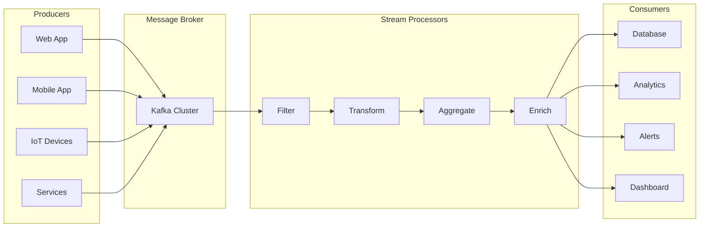
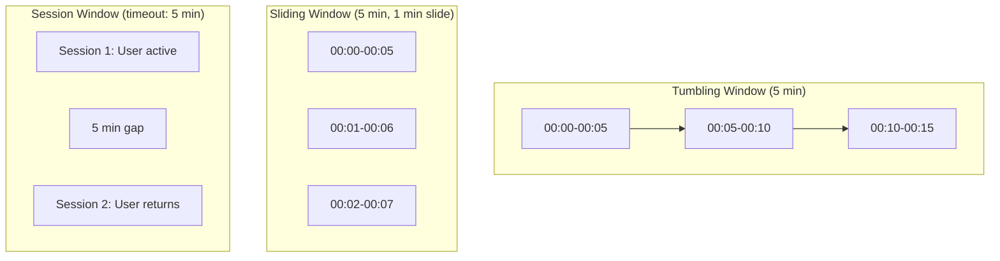
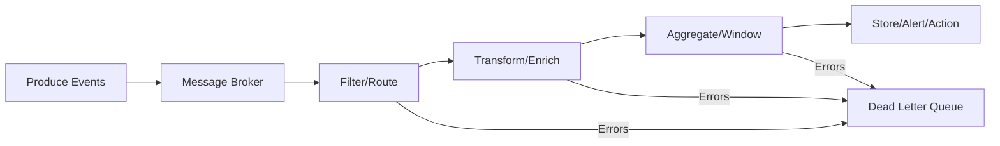

# How to Implement Event Stream Processing

Author: [nawazdhandala](https://github.com/nawazdhandala)

Tags: Event-Driven, Streaming, Kafka, Real-Time

Description: Learn to implement event stream processing for real-time data transformation and analysis pipelines.

---

Event stream processing has become fundamental to modern distributed systems. Whether you are building real-time analytics, monitoring pipelines, or event-driven microservices, understanding how to process continuous data streams is a critical skill.

This guide walks through the core concepts, architecture patterns, and practical implementations for building event stream processing systems.

## What is Event Stream Processing?

Event stream processing (ESP) involves continuously ingesting, processing, and reacting to sequences of events in real-time. Unlike batch processing where you collect data and process it periodically, stream processing handles events as they arrive - often within milliseconds.

Common use cases include:

- Real-time fraud detection in financial transactions
- Live monitoring and alerting for infrastructure
- User activity tracking and personalization
- IoT sensor data aggregation
- Log aggregation and analysis

## Stream Processing Architecture

A typical event stream processing architecture consists of producers, a message broker, processors, and consumers.



## Key Concepts

Before diving into implementation, here are the fundamental concepts you need to understand:

| Concept | Description |
|---------|-------------|
| **Event** | An immutable record of something that happened at a point in time |
| **Stream** | An unbounded, continuously updating sequence of events |
| **Topic** | A named channel for organizing related events |
| **Partition** | A subdivision of a topic for parallel processing |
| **Consumer Group** | A set of consumers that coordinate to process events |
| **Offset** | A position marker indicating which events have been processed |
| **Windowing** | Grouping events by time intervals for aggregation |

## Setting Up Kafka

Apache Kafka is the most widely used platform for event streaming. Start by setting up a local Kafka cluster using Docker Compose.

```yaml
# docker-compose.yml
version: '3.8'
services:
  zookeeper:
    image: confluentinc/cp-zookeeper:7.5.0
    environment:
      ZOOKEEPER_CLIENT_PORT: 2181
      ZOOKEEPER_TICK_TIME: 2000
    ports:
      - "2181:2181"

  kafka:
    image: confluentinc/cp-kafka:7.5.0
    depends_on:
      - zookeeper
    ports:
      - "9092:9092"
    environment:
      # Broker configuration
      KAFKA_BROKER_ID: 1
      KAFKA_ZOOKEEPER_CONNECT: zookeeper:2181
      # Listener configuration for local development
      KAFKA_ADVERTISED_LISTENERS: PLAINTEXT://localhost:9092
      KAFKA_OFFSETS_TOPIC_REPLICATION_FACTOR: 1
      # Auto-create topics for development
      KAFKA_AUTO_CREATE_TOPICS_ENABLE: "true"
```

Start the cluster with `docker-compose up -d` and create your first topic.

```bash
# Create a topic with 3 partitions for parallel processing
docker exec -it kafka kafka-topics --create \
  --topic events \
  --bootstrap-server localhost:9092 \
  --partitions 3 \
  --replication-factor 1
```

## Producing Events

Events should follow a consistent schema. Using a structured format makes downstream processing predictable and maintainable.

The following producer implementation demonstrates how to publish events with proper error handling and delivery confirmation.

```javascript
// producer.js
const { Kafka, Partitioners } = require('kafkajs');

// Initialize Kafka client with broker connection
const kafka = new Kafka({
  clientId: 'event-producer',
  brokers: ['localhost:9092'],
  // Retry configuration for resilience
  retry: {
    initialRetryTime: 100,
    retries: 8
  }
});

const producer = kafka.producer({
  // Use default partitioner for key-based routing
  createPartitioner: Partitioners.DefaultPartitioner
});

// Event schema - consistent structure for all events
function createEvent(type, data, metadata = {}) {
  return {
    // Unique identifier for deduplication
    id: crypto.randomUUID(),
    // Event type determines processing logic
    type: type,
    // Timestamp for ordering and windowing
    timestamp: new Date().toISOString(),
    // The actual event payload
    data: data,
    // Additional context like source, correlation ID
    metadata: {
      source: 'web-app',
      version: '1.0',
      ...metadata
    }
  };
}

async function publishEvent(topic, key, event) {
  await producer.connect();

  try {
    // Send event to Kafka
    const result = await producer.send({
      topic: topic,
      messages: [{
        // Key determines partition assignment
        key: key,
        // Serialize event as JSON
        value: JSON.stringify(event),
        // Headers for routing without parsing body
        headers: {
          'event-type': event.type,
          'correlation-id': event.metadata.correlationId || event.id
        }
      }]
    });

    console.log(`Event published to partition ${result[0].partition}`);
    return result;
  } catch (error) {
    console.error('Failed to publish event:', error);
    throw error;
  }
}

// Example: Publish a user action event
const event = createEvent('user.clicked', {
  userId: 'user-123',
  elementId: 'checkout-button',
  page: '/cart'
});

publishEvent('events', event.data.userId, event);
```

## Consuming and Processing Events

Stream processors consume events, apply transformations, and either produce new events or trigger side effects. The consumer below demonstrates the core patterns for reliable event processing.

```javascript
// consumer.js
const { Kafka } = require('kafkajs');

const kafka = new Kafka({
  clientId: 'event-processor',
  brokers: ['localhost:9092']
});

// Consumer group ensures each event is processed once
const consumer = kafka.consumer({
  groupId: 'event-processors',
  // Start from earliest unprocessed event on new consumer
  sessionTimeout: 30000,
  heartbeatInterval: 3000
});

// Event handlers mapped by event type
const handlers = {
  'user.clicked': async (event) => {
    // Track click analytics
    await trackClick(event.data);
  },
  'user.purchased': async (event) => {
    // Update inventory and send confirmation
    await processOrder(event.data);
    await sendConfirmation(event.data.userId);
  },
  'user.signup': async (event) => {
    // Initialize user profile
    await createUserProfile(event.data);
  }
};

async function startConsumer() {
  await consumer.connect();

  // Subscribe to topic - fromBeginning only on first join
  await consumer.subscribe({
    topic: 'events',
    fromBeginning: false
  });

  await consumer.run({
    // Process events one at a time for ordering guarantees
    eachMessage: async ({ topic, partition, message }) => {
      const event = JSON.parse(message.value.toString());

      console.log({
        partition,
        offset: message.offset,
        eventType: event.type,
        eventId: event.id
      });

      // Route to appropriate handler
      const handler = handlers[event.type];
      if (handler) {
        try {
          await handler(event);
        } catch (error) {
          // Log error but don't crash - implement retry logic
          console.error(`Handler failed for ${event.type}:`, error);
          await handleProcessingError(event, error);
        }
      } else {
        console.warn(`No handler for event type: ${event.type}`);
      }
    }
  });
}

startConsumer().catch(console.error);
```

## Stream Processing Patterns

### Filtering

Filter events based on criteria to route only relevant events downstream.

```javascript
// Filter processor - only passes events matching criteria
async function filterProcessor(event) {
  // Define filter rules
  const rules = {
    // Only process events from production
    isProduction: event.metadata.environment === 'production',
    // Only high-value transactions
    isHighValue: event.data.amount > 1000,
    // Exclude test users
    isRealUser: !event.data.userId.startsWith('test-')
  };

  // Check if event passes all rules
  const passesFilter = Object.values(rules).every(Boolean);

  if (passesFilter) {
    // Forward to next processor
    await publishEvent('filtered-events', event.data.userId, event);
  }
}
```

### Transformation

Transform events to normalize data or enrich with additional context.

```javascript
// Transform processor - modify event structure
async function transformProcessor(event) {
  const transformed = {
    ...event,
    data: {
      ...event.data,
      // Normalize currency to USD
      amountUSD: convertToUSD(event.data.amount, event.data.currency),
      // Add derived fields
      dayOfWeek: new Date(event.timestamp).getDay(),
      hourOfDay: new Date(event.timestamp).getHours(),
      // Mask sensitive data
      email: maskEmail(event.data.email)
    },
    metadata: {
      ...event.metadata,
      processedAt: new Date().toISOString(),
      processorVersion: '2.0'
    }
  };

  await publishEvent('transformed-events', transformed.data.userId, transformed);
}
```

### Aggregation with Windowing

Aggregate events over time windows to compute metrics like counts, sums, or averages.



The following implementation shows how to aggregate events using a tumbling window pattern.

```javascript
// Windowed aggregation processor
class WindowedAggregator {
  constructor(windowSizeMs = 60000) {
    this.windowSizeMs = windowSizeMs;
    // Store aggregations by window key
    this.windows = new Map();
  }

  // Get window key for timestamp
  getWindowKey(timestamp) {
    const time = new Date(timestamp).getTime();
    const windowStart = Math.floor(time / this.windowSizeMs) * this.windowSizeMs;
    return windowStart;
  }

  // Process incoming event
  process(event) {
    const windowKey = this.getWindowKey(event.timestamp);
    const aggregationKey = `${windowKey}-${event.data.userId}`;

    if (!this.windows.has(aggregationKey)) {
      // Initialize new window
      this.windows.set(aggregationKey, {
        windowStart: new Date(windowKey).toISOString(),
        windowEnd: new Date(windowKey + this.windowSizeMs).toISOString(),
        userId: event.data.userId,
        count: 0,
        totalAmount: 0,
        events: []
      });
    }

    // Update aggregation
    const agg = this.windows.get(aggregationKey);
    agg.count++;
    agg.totalAmount += event.data.amount || 0;
    agg.events.push(event.id);

    return agg;
  }

  // Emit completed windows
  async emitCompletedWindows() {
    const now = Date.now();

    for (const [key, agg] of this.windows.entries()) {
      const windowEnd = new Date(agg.windowEnd).getTime();

      // Window is complete when current time exceeds window end
      if (now > windowEnd + 5000) { // 5s grace period for late events
        await publishEvent('aggregated-events', agg.userId, {
          type: 'window.completed',
          timestamp: new Date().toISOString(),
          data: agg
        });

        this.windows.delete(key);
      }
    }
  }
}
```

## Error Handling and Dead Letter Queues

Production systems need robust error handling. Events that fail processing should be routed to a dead letter queue (DLQ) for later analysis and reprocessing.

```javascript
// Dead letter queue handler
async function handleProcessingError(event, error) {
  const deadLetterEvent = {
    originalEvent: event,
    error: {
      message: error.message,
      stack: error.stack,
      name: error.name
    },
    failedAt: new Date().toISOString(),
    retryCount: (event.metadata?.retryCount || 0) + 1
  };

  // Route to DLQ topic
  await publishEvent('events-dlq', event.data.userId, deadLetterEvent);

  // Alert if retry threshold exceeded
  if (deadLetterEvent.retryCount >= 3) {
    await sendAlert({
      severity: 'high',
      message: `Event ${event.id} failed ${deadLetterEvent.retryCount} times`,
      eventType: event.type
    });
  }
}
```

## Monitoring Your Stream Pipeline

Effective monitoring is essential for maintaining healthy stream processing. Track these key metrics:

| Metric | Description | Alert Threshold |
|--------|-------------|-----------------|
| Consumer Lag | Events waiting to be processed | > 10,000 events |
| Processing Rate | Events processed per second | < 80% of production rate |
| Error Rate | Failed events percentage | > 1% |
| Processing Latency | Time from event creation to processing | > 500ms p99 |
| Partition Balance | Event distribution across partitions | > 20% skew |

For detailed monitoring with OpenTelemetry, see our guide on [traces and spans](https://oneuptime.com/blog/post/2025-08-27-traces-and-spans-in-opentelemetry/view).

## Production Considerations

When deploying event stream processing to production, keep these factors in mind:

**Exactly-Once Processing**: Kafka supports exactly-once semantics with transactional producers and idempotent consumers. Enable these for financial or critical data.

**Schema Evolution**: Use a schema registry to manage event schema changes without breaking consumers. Avro or Protocol Buffers provide better forward/backward compatibility than JSON.

**Backpressure**: Implement backpressure mechanisms to prevent overwhelming downstream systems when event volume spikes.

**Partitioning Strategy**: Choose partition keys carefully. Using user ID ensures all events for a user go to the same partition, maintaining ordering.

**Retention Policies**: Configure appropriate retention for your topics. Some data needs 7 days, some needs indefinite retention for replay capability.

## Summary

Event stream processing enables real-time data pipelines that react to events as they happen. The key components work together in a flow.



Start with simple filter and transform processors, then add windowed aggregations as your needs grow. Focus on idempotent processing and proper error handling from the beginning - retrofitting these patterns is significantly harder than building them in.

Event streaming pairs well with observability tools to monitor pipeline health. OneUptime can ingest your stream processing metrics and provide alerting when consumer lag or error rates indicate problems.

**Related Reading:**

- [Traces and Spans in OpenTelemetry](https://oneuptime.com/blog/post/2025-08-27-traces-and-spans-in-opentelemetry/view)
- [How to Structure Logs Properly in OpenTelemetry](https://oneuptime.com/blog/post/2025-08-28-how-to-structure-logs-properly-in-opentelemetry/view)
- [Three Pillars of Observability](https://oneuptime.com/blog/post/2025-08-20-three-pillars-of-observability-logs-metrics-traces/view)
