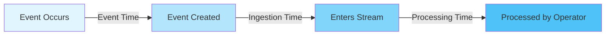
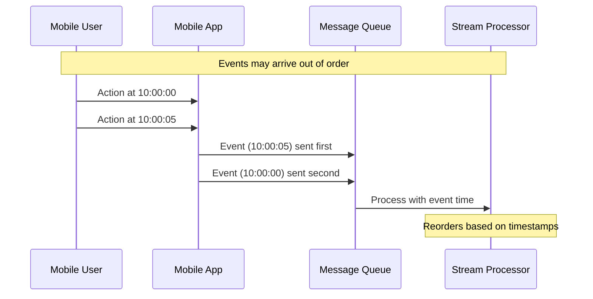
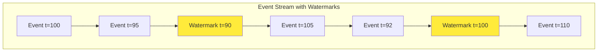
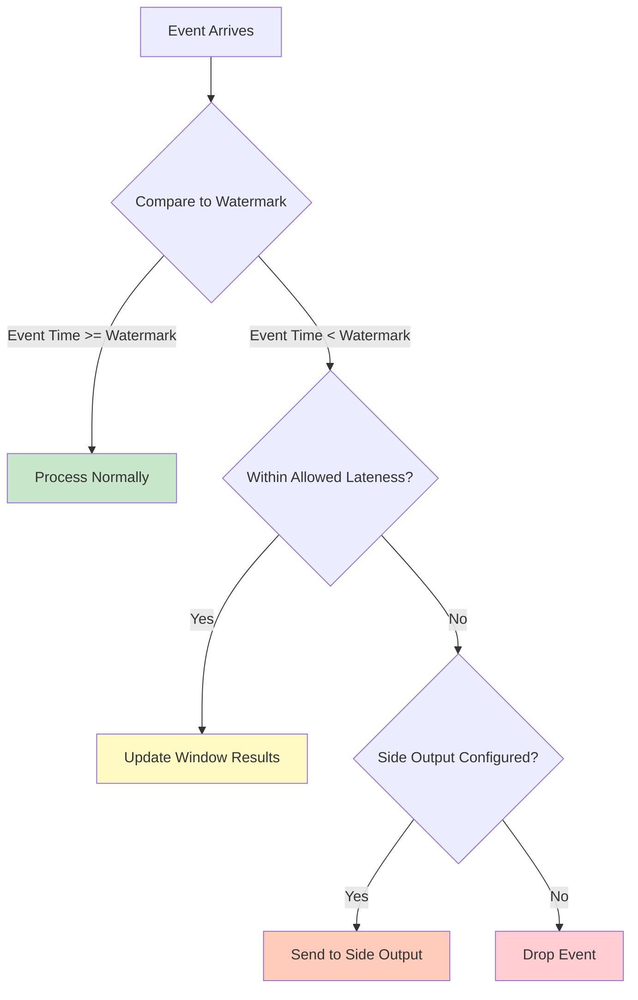
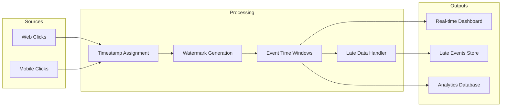

# How to Implement Event Time Processing

Author: [nawazdhandala](https://github.com/nawazdhandala)

Tags: Stream Processing, Event Time, Kafka, Apache Flink

Description: Learn how to implement event time processing for accurate stream analytics with out-of-order events.

---

## Introduction

When processing real-time data streams, one of the most critical decisions you will make is how to handle time. Should you use the time when an event arrives at your system (processing time) or the time when the event actually occurred (event time)? For most analytical use cases, event time processing provides more accurate and reproducible results.

This guide will walk you through implementing event time processing in stream processing systems, covering timestamps, watermarks, and late data handling with practical examples in both Apache Kafka Streams and Apache Flink.

## Understanding Time Semantics

Stream processing systems typically support three notions of time:

1. **Event Time**: The time when an event actually occurred at the source
2. **Ingestion Time**: The time when an event enters the stream processing system
3. **Processing Time**: The time when an event is processed by an operator



### Why Event Time Matters

Consider a mobile analytics scenario where users interact with your app. Network delays, offline usage, and batch uploads mean events often arrive out of order. Processing time would give you inaccurate results, while event time reflects what actually happened.



## Event Timestamps

Every event in an event time system must carry a timestamp. This timestamp should be embedded in the event payload and extracted consistently.

### Kafka Streams: Timestamp Extractors

In Kafka Streams, you implement a `TimestampExtractor` to tell the framework how to extract event time from your records.

```java
import org.apache.kafka.clients.consumer.ConsumerRecord;
import org.apache.kafka.streams.processor.TimestampExtractor;

/**
 * Custom timestamp extractor that pulls the event time from
 * the event payload rather than using Kafka's metadata timestamp.
 *
 * This extractor handles cases where the timestamp field might be
 * missing by falling back to the current wall clock time.
 */
public class EventTimeExtractor implements TimestampExtractor {

    @Override
    public long extract(ConsumerRecord<Object, Object> record, long partitionTime) {
        // Cast the value to your event type
        MyEvent event = (MyEvent) record.value();

        // Extract the timestamp from the event payload
        if (event != null && event.getEventTime() != null) {
            return event.getEventTime().toEpochMilli();
        }

        // Fallback: use the partition time (time of the previous record)
        // This handles malformed events gracefully
        if (partitionTime >= 0) {
            return partitionTime;
        }

        // Last resort: use current time (not recommended for production)
        return System.currentTimeMillis();
    }
}
```

Configure the extractor in your Kafka Streams application:

```java
import org.apache.kafka.streams.StreamsConfig;
import java.util.Properties;

/**
 * Configure Kafka Streams to use event time processing
 * with our custom timestamp extractor.
 */
public class StreamsConfiguration {

    public static Properties createConfig() {
        Properties props = new Properties();

        // Basic configuration
        props.put(StreamsConfig.APPLICATION_ID_CONFIG, "event-time-app");
        props.put(StreamsConfig.BOOTSTRAP_SERVERS_CONFIG, "localhost:9092");

        // Set the default timestamp extractor for all streams
        props.put(
            StreamsConfig.DEFAULT_TIMESTAMP_EXTRACTOR_CLASS_CONFIG,
            EventTimeExtractor.class.getName()
        );

        return props;
    }
}
```

### Apache Flink: Timestamp Assigners

Flink uses `WatermarkStrategy` to assign timestamps and generate watermarks in a unified way.

```java
import org.apache.flink.api.common.eventtime.WatermarkStrategy;
import org.apache.flink.api.common.eventtime.SerializableTimestampAssigner;
import org.apache.flink.streaming.api.datastream.DataStream;
import org.apache.flink.streaming.api.environment.StreamExecutionEnvironment;
import java.time.Duration;

/**
 * Demonstrates how to configure event time processing in Flink
 * with timestamp assignment and watermark generation.
 */
public class FlinkEventTimeSetup {

    public static DataStream<MyEvent> configureEventTime(
            StreamExecutionEnvironment env,
            DataStream<MyEvent> inputStream) {

        // Create a watermark strategy that:
        // 1. Extracts timestamps from events
        // 2. Generates watermarks with bounded out-of-orderness
        WatermarkStrategy<MyEvent> strategy = WatermarkStrategy
            // Allow events to be up to 5 seconds out of order
            .<MyEvent>forBoundedOutOfOrderness(Duration.ofSeconds(5))
            // Extract the timestamp from each event
            .withTimestampAssigner(new SerializableTimestampAssigner<MyEvent>() {
                @Override
                public long extractTimestamp(MyEvent event, long recordTimestamp) {
                    // Return the event time in milliseconds
                    return event.getEventTime().toEpochMilli();
                }
            });

        // Apply the watermark strategy to the stream
        return inputStream.assignTimestampsAndWatermarks(strategy);
    }
}
```

## Watermarks: Tracking Event Time Progress

Watermarks are the mechanism that allows stream processors to track the progress of event time. A watermark with timestamp `t` declares that the stream has (likely) seen all events with timestamps less than or equal to `t`.



### Watermark Generation Strategies

There are two main approaches to generating watermarks:

#### Periodic Watermarks

Generate watermarks at fixed intervals based on the maximum observed timestamp.

```java
import org.apache.flink.api.common.eventtime.Watermark;
import org.apache.flink.api.common.eventtime.WatermarkGenerator;
import org.apache.flink.api.common.eventtime.WatermarkOutput;
import org.apache.flink.api.common.eventtime.WatermarkGeneratorSupplier;

/**
 * A periodic watermark generator that emits watermarks
 * based on the maximum timestamp seen so far, minus a tolerance
 * for out-of-order events.
 */
public class BoundedOutOfOrdernessGenerator
        implements WatermarkGenerator<MyEvent> {

    // Maximum allowed lateness for out-of-order events
    private final long maxOutOfOrderness;

    // Track the highest timestamp seen so far
    private long currentMaxTimestamp = Long.MIN_VALUE;

    public BoundedOutOfOrdernessGenerator(long maxOutOfOrderness) {
        this.maxOutOfOrderness = maxOutOfOrderness;
    }

    /**
     * Called for each event. Updates the maximum timestamp
     * if this event has a higher timestamp than previously seen.
     */
    @Override
    public void onEvent(MyEvent event, long eventTimestamp, WatermarkOutput output) {
        // Update the max timestamp when we see a new event
        currentMaxTimestamp = Math.max(currentMaxTimestamp, eventTimestamp);
    }

    /**
     * Called periodically to emit watermarks.
     * The watermark is set to the max timestamp minus the allowed lateness.
     */
    @Override
    public void onPeriodicEmit(WatermarkOutput output) {
        // Emit watermark: max timestamp minus out-of-orderness tolerance
        output.emitWatermark(
            new Watermark(currentMaxTimestamp - maxOutOfOrderness)
        );
    }
}
```

#### Punctuated Watermarks

Generate watermarks based on special marker events in the stream.

```java
import org.apache.flink.api.common.eventtime.Watermark;
import org.apache.flink.api.common.eventtime.WatermarkGenerator;
import org.apache.flink.api.common.eventtime.WatermarkOutput;

/**
 * A punctuated watermark generator that emits a watermark
 * whenever it encounters a special marker event in the stream.
 *
 * Useful when data sources embed watermark information directly
 * in the event stream (common in IoT scenarios).
 */
public class PunctuatedWatermarkGenerator
        implements WatermarkGenerator<MyEvent> {

    @Override
    public void onEvent(MyEvent event, long eventTimestamp, WatermarkOutput output) {
        // Check if this event is a watermark marker
        if (event.isWatermarkMarker()) {
            // Emit a watermark based on the marker's timestamp
            output.emitWatermark(new Watermark(event.getWatermarkTimestamp()));
        }
    }

    @Override
    public void onPeriodicEmit(WatermarkOutput output) {
        // No periodic watermarks in punctuated mode
        // All watermarks come from the onEvent method
    }
}
```

### Kafka Streams: Grace Period for Windows

Kafka Streams handles watermark-like behavior through the grace period concept in windowed operations.

```java
import org.apache.kafka.streams.StreamsBuilder;
import org.apache.kafka.streams.kstream.KStream;
import org.apache.kafka.streams.kstream.TimeWindows;
import org.apache.kafka.streams.kstream.Materialized;
import org.apache.kafka.streams.kstream.Suppressed;
import java.time.Duration;

/**
 * Demonstrates windowed aggregation with event time semantics
 * in Kafka Streams, using grace periods for late data.
 */
public class KafkaStreamsWindowing {

    public static void buildTopology(StreamsBuilder builder) {
        KStream<String, MyEvent> events = builder.stream("events-topic");

        events
            // Group events by their key for aggregation
            .groupByKey()
            // Define tumbling windows of 5 minutes
            // with a 1 minute grace period for late events
            .windowedBy(
                TimeWindows
                    .ofSizeWithNoGrace(Duration.ofMinutes(5))
                    .grace(Duration.ofMinutes(1))
            )
            // Count events in each window
            .count(Materialized.as("event-counts"))
            // Suppress intermediate results until the window closes
            // This ensures we emit final results only
            .suppress(
                Suppressed.untilWindowCloses(
                    Suppressed.BufferConfig.unbounded()
                )
            )
            // Convert back to a stream and output
            .toStream()
            .foreach((windowedKey, count) -> {
                System.out.printf(
                    "Window [%s - %s] Key: %s Count: %d%n",
                    windowedKey.window().startTime(),
                    windowedKey.window().endTime(),
                    windowedKey.key(),
                    count
                );
            });
    }
}
```

## Handling Late Data

Even with generous watermarks, some events will inevitably arrive late. You need a strategy for handling these late arrivals.



### Flink: Allowed Lateness and Side Outputs

Flink provides fine-grained control over late data with allowed lateness and side outputs.

```java
import org.apache.flink.streaming.api.datastream.DataStream;
import org.apache.flink.streaming.api.datastream.SingleOutputStreamOperator;
import org.apache.flink.streaming.api.windowing.assigners.TumblingEventTimeWindows;
import org.apache.flink.streaming.api.windowing.time.Time;
import org.apache.flink.util.OutputTag;
import java.time.Duration;

/**
 * Demonstrates comprehensive late data handling in Flink
 * using allowed lateness and side outputs.
 */
public class LateDataHandling {

    // Define a side output tag for late events
    // Late events will be sent here instead of being dropped
    private static final OutputTag<MyEvent> LATE_EVENTS_TAG =
        new OutputTag<MyEvent>("late-events") {};

    public static void processWithLateDataHandling(
            DataStream<MyEvent> eventStream) {

        SingleOutputStreamOperator<WindowResult> mainOutput = eventStream
            // Key by user ID
            .keyBy(event -> event.getUserId())
            // Define 10-minute tumbling windows
            .window(TumblingEventTimeWindows.of(Time.minutes(10)))
            // Allow events up to 5 minutes late to update window results
            .allowedLateness(Time.minutes(5))
            // Events later than 5 minutes go to side output
            .sideOutputLateData(LATE_EVENTS_TAG)
            // Aggregate events in each window
            .aggregate(new EventAggregator());

        // Process the main output stream (normal results)
        mainOutput.addSink(new ResultSink());

        // Get the side output stream containing late events
        DataStream<MyEvent> lateEvents = mainOutput.getSideOutput(LATE_EVENTS_TAG);

        // Handle late events separately
        // Options include: logging, storing for manual review,
        // or processing with a different logic
        lateEvents.addSink(new LateEventSink());
    }
}
```

### Kafka Streams: Processing Late Data

In Kafka Streams, you handle late data through the grace period and by monitoring window store state.

```java
import org.apache.kafka.streams.StreamsBuilder;
import org.apache.kafka.streams.kstream.KStream;
import org.apache.kafka.streams.kstream.TimeWindows;
import org.apache.kafka.streams.kstream.Materialized;
import org.apache.kafka.streams.processor.api.Processor;
import org.apache.kafka.streams.processor.api.ProcessorContext;
import org.apache.kafka.streams.processor.api.Record;
import org.apache.kafka.streams.state.WindowStore;
import java.time.Duration;
import java.time.Instant;

/**
 * Custom processor that detects and handles late events
 * in Kafka Streams by comparing event time to stream time.
 */
public class LateEventProcessor implements Processor<String, MyEvent, String, MyEvent> {

    private ProcessorContext<String, MyEvent> context;

    // Threshold for considering an event "late"
    private static final long LATE_THRESHOLD_MS = 60_000; // 1 minute

    @Override
    public void init(ProcessorContext<String, MyEvent> context) {
        this.context = context;
    }

    @Override
    public void process(Record<String, MyEvent> record) {
        MyEvent event = record.value();
        long eventTime = event.getEventTime().toEpochMilli();

        // Stream time is the maximum timestamp seen so far
        long streamTime = context.currentStreamTimeMs();

        // Calculate how late this event is
        long lateness = streamTime - eventTime;

        if (lateness > LATE_THRESHOLD_MS) {
            // Event is significantly late
            // Log it for monitoring and analysis
            System.out.printf(
                "Late event detected: key=%s, eventTime=%s, lateness=%dms%n",
                record.key(),
                Instant.ofEpochMilli(eventTime),
                lateness
            );

            // Forward to a special topic for late events
            context.forward(record.withValue(event), "late-events-sink");
        } else {
            // Event is on time, process normally
            context.forward(record);
        }
    }

    @Override
    public void close() {
        // Cleanup resources if needed
    }
}
```

## Complete Example: Real-Time Analytics Pipeline

Let us put everything together with a complete example of a real-time analytics pipeline that processes user click events.



### Flink Implementation

```java
import org.apache.flink.api.common.eventtime.WatermarkStrategy;
import org.apache.flink.api.common.functions.AggregateFunction;
import org.apache.flink.streaming.api.datastream.DataStream;
import org.apache.flink.streaming.api.environment.StreamExecutionEnvironment;
import org.apache.flink.streaming.api.windowing.assigners.TumblingEventTimeWindows;
import org.apache.flink.streaming.api.windowing.time.Time;
import org.apache.flink.util.OutputTag;
import java.time.Duration;

/**
 * Complete real-time click analytics pipeline using Flink
 * with event time processing, watermarks, and late data handling.
 */
public class ClickAnalyticsPipeline {

    // Side output for late clicks
    private static final OutputTag<ClickEvent> LATE_CLICKS =
        new OutputTag<ClickEvent>("late-clicks") {};

    public static void main(String[] args) throws Exception {
        // Create the execution environment
        StreamExecutionEnvironment env =
            StreamExecutionEnvironment.getExecutionEnvironment();

        // Read click events from Kafka
        DataStream<ClickEvent> clicks = env
            .addSource(new KafkaClickSource())
            // Assign timestamps and watermarks
            .assignTimestampsAndWatermarks(
                WatermarkStrategy
                    // Allow up to 10 seconds of out-of-orderness
                    .<ClickEvent>forBoundedOutOfOrderness(Duration.ofSeconds(10))
                    // Handle idle sources (no events for 30 seconds)
                    .withIdleness(Duration.ofSeconds(30))
                    // Extract timestamp from the click event
                    .withTimestampAssigner((click, ts) -> click.getTimestamp())
            );

        // Compute click counts per page in 1-minute windows
        var clickCounts = clicks
            .keyBy(ClickEvent::getPageId)
            .window(TumblingEventTimeWindows.of(Time.minutes(1)))
            // Allow updates for late events up to 2 minutes
            .allowedLateness(Time.minutes(2))
            // Send very late events to side output
            .sideOutputLateData(LATE_CLICKS)
            // Aggregate clicks
            .aggregate(new ClickCountAggregator());

        // Output results to dashboard sink
        clickCounts.addSink(new DashboardSink());

        // Handle late events
        clickCounts
            .getSideOutput(LATE_CLICKS)
            .addSink(new LateClickSink());

        // Execute the pipeline
        env.execute("Click Analytics Pipeline");
    }

    /**
     * Aggregator that counts clicks and tracks the window time range.
     */
    public static class ClickCountAggregator
            implements AggregateFunction<ClickEvent, ClickAccumulator, ClickStats> {

        @Override
        public ClickAccumulator createAccumulator() {
            return new ClickAccumulator();
        }

        @Override
        public ClickAccumulator add(ClickEvent click, ClickAccumulator acc) {
            acc.count++;
            acc.pageId = click.getPageId();
            // Track min and max timestamps for debugging
            acc.minTimestamp = Math.min(acc.minTimestamp, click.getTimestamp());
            acc.maxTimestamp = Math.max(acc.maxTimestamp, click.getTimestamp());
            return acc;
        }

        @Override
        public ClickStats getResult(ClickAccumulator acc) {
            return new ClickStats(
                acc.pageId,
                acc.count,
                acc.minTimestamp,
                acc.maxTimestamp
            );
        }

        @Override
        public ClickAccumulator merge(ClickAccumulator a, ClickAccumulator b) {
            a.count += b.count;
            a.minTimestamp = Math.min(a.minTimestamp, b.minTimestamp);
            a.maxTimestamp = Math.max(a.maxTimestamp, b.maxTimestamp);
            return a;
        }
    }
}
```

### Kafka Streams Implementation

```java
import org.apache.kafka.common.serialization.Serdes;
import org.apache.kafka.streams.KafkaStreams;
import org.apache.kafka.streams.StreamsBuilder;
import org.apache.kafka.streams.StreamsConfig;
import org.apache.kafka.streams.kstream.Consumed;
import org.apache.kafka.streams.kstream.Grouped;
import org.apache.kafka.streams.kstream.KStream;
import org.apache.kafka.streams.kstream.Materialized;
import org.apache.kafka.streams.kstream.Produced;
import org.apache.kafka.streams.kstream.Suppressed;
import org.apache.kafka.streams.kstream.TimeWindows;
import java.time.Duration;
import java.util.Properties;

/**
 * Complete real-time click analytics pipeline using Kafka Streams
 * with event time processing and windowed aggregations.
 */
public class KafkaClickAnalytics {

    public static void main(String[] args) {
        // Configure Kafka Streams
        Properties props = new Properties();
        props.put(StreamsConfig.APPLICATION_ID_CONFIG, "click-analytics");
        props.put(StreamsConfig.BOOTSTRAP_SERVERS_CONFIG, "localhost:9092");

        // Use our custom timestamp extractor for event time
        props.put(
            StreamsConfig.DEFAULT_TIMESTAMP_EXTRACTOR_CLASS_CONFIG,
            ClickTimestampExtractor.class.getName()
        );

        // Build the topology
        StreamsBuilder builder = new StreamsBuilder();

        // Read click events from the input topic
        KStream<String, ClickEvent> clicks = builder.stream(
            "clicks",
            Consumed.with(Serdes.String(), new ClickEventSerde())
        );

        // Process clicks: count per page in 1-minute windows
        clicks
            // Rekey by page ID for aggregation
            .selectKey((key, click) -> click.getPageId())
            // Group by the new key
            .groupByKey(Grouped.with(Serdes.String(), new ClickEventSerde()))
            // Define 1-minute tumbling windows with 2-minute grace period
            .windowedBy(
                TimeWindows
                    .ofSizeWithNoGrace(Duration.ofMinutes(1))
                    .grace(Duration.ofMinutes(2))
            )
            // Count events per window
            .count(Materialized.as("click-counts-store"))
            // Suppress until window closes to get final results
            .suppress(
                Suppressed.untilWindowCloses(
                    Suppressed.BufferConfig
                        .unbounded()
                        .shutDownWhenFull()
                )
            )
            // Convert to a regular stream
            .toStream()
            // Map to output format
            .mapValues((windowedKey, count) -> {
                return new ClickStats(
                    windowedKey.key(),
                    count,
                    windowedKey.window().startTime().toEpochMilli(),
                    windowedKey.window().endTime().toEpochMilli()
                );
            })
            // Output to the results topic
            .to(
                "click-stats",
                Produced.with(new WindowedSerde(), new ClickStatsSerde())
            );

        // Build and start the streams application
        KafkaStreams streams = new KafkaStreams(builder.build(), props);

        // Add shutdown hook for graceful termination
        Runtime.getRuntime().addShutdownHook(new Thread(streams::close));

        // Start processing
        streams.start();
    }
}
```

## Best Practices

### 1. Choose Appropriate Watermark Delays

The watermark delay is a trade-off between latency and completeness. Too short, and you will drop many late events. Too long, and your results will be delayed.

```java
/**
 * Dynamic watermark generator that adjusts the out-of-orderness
 * threshold based on observed lateness patterns.
 */
public class AdaptiveWatermarkGenerator
        implements WatermarkGenerator<MyEvent> {

    // Start with a conservative estimate
    private long currentMaxOutOfOrderness = 5000; // 5 seconds

    // Track statistics to adapt the threshold
    private long totalEvents = 0;
    private long lateEvents = 0;
    private long currentMaxTimestamp = Long.MIN_VALUE;

    @Override
    public void onEvent(MyEvent event, long eventTimestamp, WatermarkOutput output) {
        totalEvents++;

        // Check if this event would be late with current settings
        if (eventTimestamp < currentMaxTimestamp - currentMaxOutOfOrderness) {
            lateEvents++;

            // If too many events are late, increase the threshold
            double lateRatio = (double) lateEvents / totalEvents;
            if (lateRatio > 0.01 && totalEvents > 1000) {
                // More than 1% late events, increase threshold
                currentMaxOutOfOrderness = Math.min(
                    currentMaxOutOfOrderness * 2,
                    60000 // Cap at 1 minute
                );
                // Reset counters
                totalEvents = 0;
                lateEvents = 0;
            }
        }

        currentMaxTimestamp = Math.max(currentMaxTimestamp, eventTimestamp);
    }

    @Override
    public void onPeriodicEmit(WatermarkOutput output) {
        output.emitWatermark(
            new Watermark(currentMaxTimestamp - currentMaxOutOfOrderness)
        );
    }
}
```

### 2. Monitor Watermark Progress

Always monitor your watermarks to detect processing issues early.

```java
import org.apache.flink.metrics.Gauge;
import org.apache.flink.streaming.api.functions.ProcessFunction;
import org.apache.flink.util.Collector;

/**
 * Process function that monitors watermark progress
 * and exposes metrics for alerting.
 */
public class WatermarkMonitor extends ProcessFunction<MyEvent, MyEvent> {

    private transient long lastWatermark = Long.MIN_VALUE;
    private transient long watermarkLag = 0;

    @Override
    public void open(org.apache.flink.configuration.Configuration parameters) {
        // Register watermark lag as a metric
        getRuntimeContext()
            .getMetricGroup()
            .gauge("watermarkLag", (Gauge<Long>) () -> watermarkLag);
    }

    @Override
    public void processElement(
            MyEvent event,
            Context ctx,
            Collector<MyEvent> out) {

        // Update watermark lag metric
        long currentWatermark = ctx.timerService().currentWatermark();
        if (currentWatermark > lastWatermark) {
            lastWatermark = currentWatermark;
        }

        // Calculate lag between event time and watermark
        watermarkLag = event.getEventTime().toEpochMilli() - currentWatermark;

        // Forward the event
        out.collect(event);
    }
}
```

### 3. Handle Clock Skew

Different sources may have slightly different clocks. Handle this by normalizing timestamps or using a reference time source.

```java
/**
 * Timestamp normalizer that adjusts for known clock skew
 * between different data sources.
 */
public class ClockSkewNormalizer {

    // Map of source IDs to their clock offset in milliseconds
    // Positive means the source clock is ahead
    private final Map<String, Long> sourceOffsets;

    public ClockSkewNormalizer(Map<String, Long> sourceOffsets) {
        this.sourceOffsets = sourceOffsets;
    }

    /**
     * Normalize an event timestamp by adjusting for the known
     * clock skew of its source.
     */
    public long normalizeTimestamp(String sourceId, long rawTimestamp) {
        Long offset = sourceOffsets.get(sourceId);
        if (offset != null) {
            return rawTimestamp - offset;
        }
        return rawTimestamp;
    }
}
```

## Conclusion

Event time processing is essential for accurate stream analytics when dealing with real-world data that arrives out of order. The key concepts to remember are:

1. **Timestamps**: Embed event timestamps in your data and extract them consistently
2. **Watermarks**: Use watermarks to track event time progress and trigger window computations
3. **Late Data**: Plan for late arrivals with allowed lateness, grace periods, and side outputs

Both Kafka Streams and Apache Flink provide robust support for event time processing. Choose the appropriate tool based on your use case:

- **Kafka Streams**: Great for Kafka-centric architectures with simpler processing needs
- **Apache Flink**: Better for complex event processing with fine-grained control over time and state

Start with conservative watermark delays and tune based on your observed data patterns. Monitor your watermarks and late event rates to ensure your pipeline is performing as expected.

## Further Reading

- [Apache Flink Documentation: Event Time](https://nightlies.apache.org/flink/flink-docs-stable/docs/concepts/time/)
- [Kafka Streams Documentation: Time and Windows](https://kafka.apache.org/documentation/streams/)
- [The Dataflow Model Paper](https://research.google/pubs/pub43864/)
- [Streaming Systems by Tyler Akidau](https://www.oreilly.com/library/view/streaming-systems/9781491983867/)
