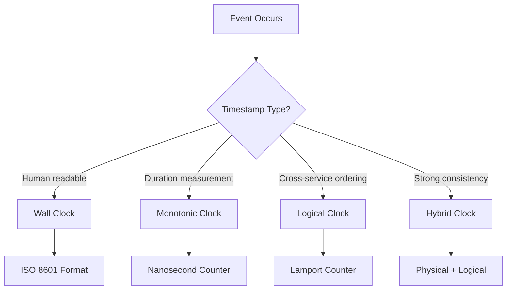
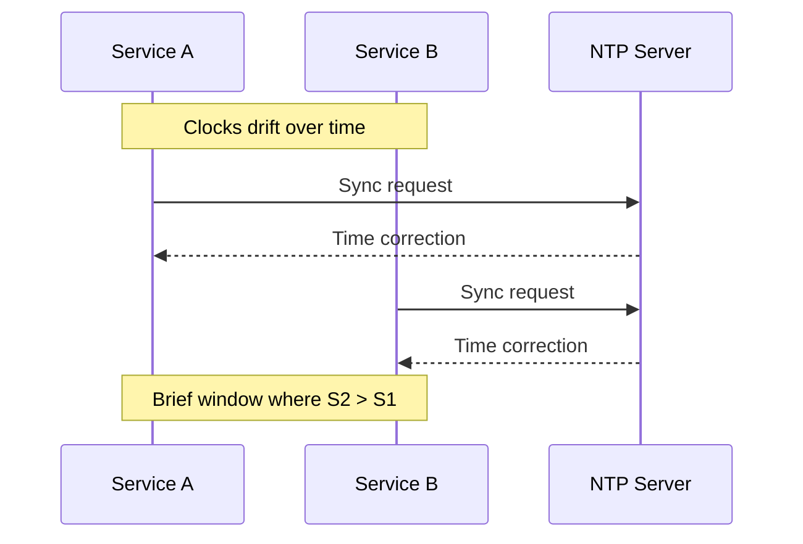
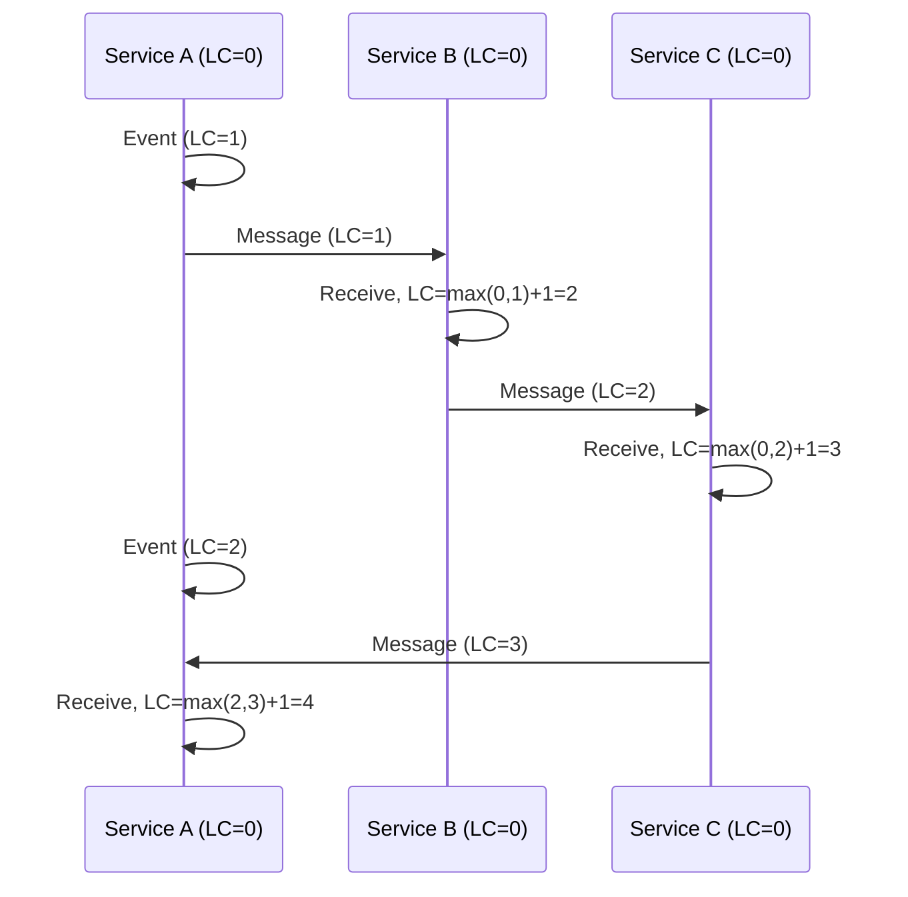
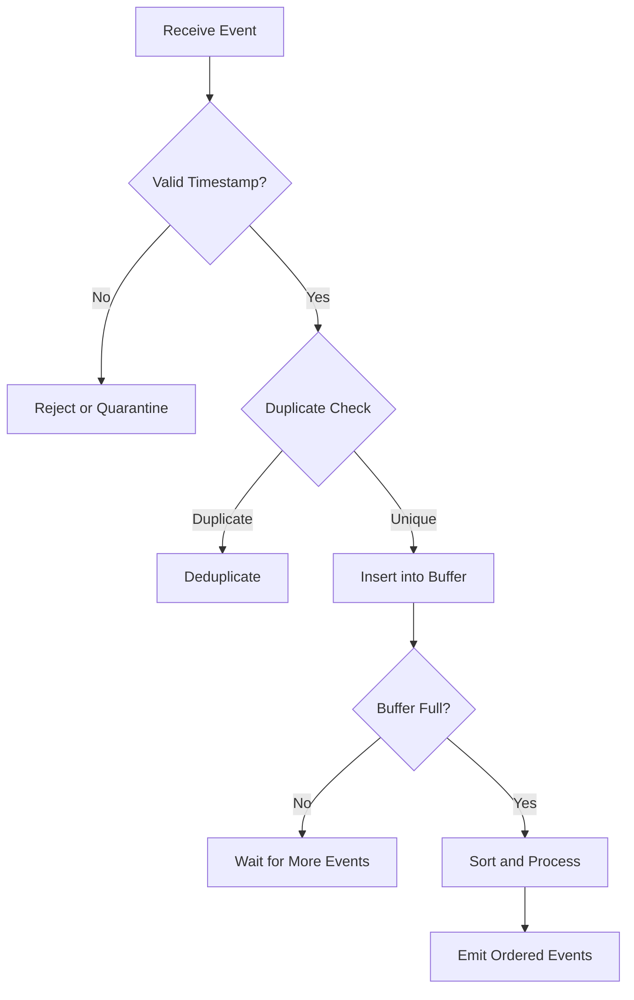

# How to Implement Event Timestamps

Author: [nawazdhandala](https://github.com/nawazdhandala)

Tags: Event-Driven, Timestamps, Distributed Systems, Architecture

Description: Learn to implement event timestamps for reliable event ordering and time-based processing in distributed systems.

---

Event timestamps are foundational to building reliable distributed systems. Without accurate timestamps, you cannot order events correctly, debug production issues, or implement time-based business logic. This guide covers practical strategies for implementing event timestamps that work at scale.

---

## Table of Contents

1. Why Event Timestamps Matter
2. Types of Timestamps
3. Clock Synchronization Challenges
4. Implementation Patterns
5. Timestamp Storage and Precision
6. Handling Clock Drift
7. Event Ordering Strategies
8. Common Pitfalls

---

## 1. Why Event Timestamps Matter

Timestamps serve three critical purposes in distributed systems.

| Purpose | Description | Example |
|---------|-------------|---------|
| Ordering | Determine which event happened first | User clicked "buy" before payment failed |
| Debugging | Correlate events across services | Trace request flow through microservices |
| Business Logic | Time-based rules and expiration | Session timeout after 30 minutes of inactivity |

Without reliable timestamps, you cannot answer basic questions like "What happened and when?"

---

## 2. Types of Timestamps

Different timestamp types solve different problems. Choose based on your requirements.

| Timestamp Type | Source | Best For |
|----------------|--------|----------|
| Wall Clock | System time (NTP synced) | Human-readable logs, audit trails |
| Monotonic | CPU counter | Measuring durations within one process |
| Logical | Lamport/Vector clocks | Causal ordering across nodes |
| Hybrid | Combination approach | Google Spanner-style strong consistency |

The following diagram shows how these timestamp types relate to each other.



---

## 3. Clock Synchronization Challenges

Distributed systems face a fundamental problem - clocks on different machines drift apart. NTP typically keeps clocks within 1-10 milliseconds, but spikes can occur.



Consider this scenario: Service A timestamps an event at 10:00:00.100, then sends it to Service B which receives it at 10:00:00.095 (because B's clock is 5ms behind). The receive timestamp is earlier than the send timestamp - a logical impossibility.

---

## 4. Implementation Patterns

### Basic Wall Clock Timestamp

The simplest approach uses the system clock. This works well for logging and auditing where slight inaccuracies are acceptable.

```typescript
// Define the event interface with required timestamp fields
interface Event {
  id: string;
  type: string;
  payload: Record<string, unknown>;
  timestamp: string;      // ISO 8601 format for readability
  timestampMs: number;    // Milliseconds since epoch for sorting
}

// Factory function to create timestamped events
function createEvent(type: string, payload: Record<string, unknown>): Event {
  const now = new Date();

  return {
    id: crypto.randomUUID(),
    type,
    payload,
    // Human-readable format with timezone
    timestamp: now.toISOString(),
    // Numeric format for fast comparisons
    timestampMs: now.getTime(),
  };
}

// Usage example
const orderEvent = createEvent('order.created', {
  orderId: 'ord_123',
  customerId: 'cust_456',
  total: 99.99,
});
```

### High-Resolution Timestamps

When millisecond precision is not enough, use high-resolution time sources. Node.js provides `process.hrtime.bigint()` for nanosecond precision.

```typescript
// High-resolution timestamp for performance-critical events
interface HighResEvent {
  id: string;
  type: string;
  payload: Record<string, unknown>;
  // Wall clock for cross-service correlation
  wallClockMs: number;
  // High-resolution monotonic time for local ordering
  hrtimeNs: bigint;
}

function createHighResEvent(
  type: string,
  payload: Record<string, unknown>
): HighResEvent {
  return {
    id: crypto.randomUUID(),
    type,
    payload,
    wallClockMs: Date.now(),
    // Nanoseconds since arbitrary point - only valid within this process
    hrtimeNs: process.hrtime.bigint(),
  };
}
```

### Lamport Timestamps

Lamport timestamps provide causal ordering guarantees. If event A caused event B, then A's timestamp will always be less than B's timestamp.

```typescript
// Lamport clock implementation for causal ordering
class LamportClock {
  // Internal counter starts at zero
  private counter: number = 0;

  // Increment before sending or local event
  tick(): number {
    this.counter += 1;
    return this.counter;
  }

  // Update when receiving a message from another node
  // Take max of local and received, then increment
  receive(incomingTimestamp: number): number {
    this.counter = Math.max(this.counter, incomingTimestamp) + 1;
    return this.counter;
  }

  // Read current value without incrementing
  current(): number {
    return this.counter;
  }
}

// Event with Lamport timestamp for distributed ordering
interface CausalEvent {
  id: string;
  type: string;
  payload: Record<string, unknown>;
  lamportTime: number;  // Logical timestamp
  nodeId: string;       // Source node identifier
  wallClockMs: number;  // Physical time for debugging
}

// Service that produces causally ordered events
class EventProducer {
  private clock: LamportClock;
  private nodeId: string;

  constructor(nodeId: string) {
    this.clock = new LamportClock();
    this.nodeId = nodeId;
  }

  // Create a new event with current Lamport time
  createEvent(type: string, payload: Record<string, unknown>): CausalEvent {
    return {
      id: crypto.randomUUID(),
      type,
      payload,
      lamportTime: this.clock.tick(),
      nodeId: this.nodeId,
      wallClockMs: Date.now(),
    };
  }

  // Process incoming event and update local clock
  processIncoming(event: CausalEvent): void {
    this.clock.receive(event.lamportTime);
    // Now any events we create will have higher timestamps
  }
}
```

The following diagram shows how Lamport timestamps maintain causal order across services.



---

## 5. Timestamp Storage and Precision

Choose your storage format based on precision requirements and query patterns.

| Format | Precision | Storage Size | Query Performance |
|--------|-----------|--------------|-------------------|
| UNIX timestamp (seconds) | 1 second | 4 bytes | Excellent |
| UNIX timestamp (milliseconds) | 1 millisecond | 8 bytes | Excellent |
| ISO 8601 string | 1 millisecond | 24+ bytes | Good (with index) |
| UUID v7 | 1 millisecond | 16 bytes | Excellent (sortable) |
| Custom (micros/nanos) | Sub-millisecond | 8+ bytes | Excellent |

UUID v7 deserves special mention - it embeds a timestamp in a sortable format, giving you both a unique identifier and temporal ordering in one field.

```typescript
// UUID v7 provides timestamp-sortable unique IDs
// The first 48 bits contain milliseconds since epoch
function extractTimestampFromUUIDv7(uuid: string): number {
  // Remove hyphens and get first 12 hex characters
  const hex = uuid.replace(/-/g, '').slice(0, 12);
  // Convert to milliseconds
  return parseInt(hex, 16);
}

// Modern runtimes support crypto.randomUUID() but for v7
// you may need a library like 'uuid' with v7 support
```

---

## 6. Handling Clock Drift

Clock drift is inevitable. Build systems that tolerate it rather than assuming perfect synchronization.

```typescript
// Timestamp validator that detects suspicious clock drift
class TimestampValidator {
  // Maximum acceptable drift from current time
  private maxDriftMs: number;

  constructor(maxDriftMs: number = 5000) {
    this.maxDriftMs = maxDriftMs;
  }

  // Check if timestamp is within acceptable bounds
  validate(eventTimestamp: number): ValidationResult {
    const now = Date.now();
    const drift = eventTimestamp - now;

    // Event from the future suggests clock skew
    if (drift > this.maxDriftMs) {
      return {
        valid: false,
        reason: 'future_timestamp',
        driftMs: drift,
      };
    }

    // Event too far in the past might indicate replay
    if (drift < -this.maxDriftMs * 10) {
      return {
        valid: false,
        reason: 'stale_timestamp',
        driftMs: drift,
      };
    }

    return { valid: true, driftMs: drift };
  }
}

interface ValidationResult {
  valid: boolean;
  reason?: string;
  driftMs: number;
}
```

---

## 7. Event Ordering Strategies

When multiple events have the same timestamp, you need a tiebreaker. This implementation combines timestamp with node ID and sequence number.

```typescript
// Composite key for total ordering of events
interface OrderableEvent {
  timestampMs: number;   // Primary sort key
  nodeId: string;        // Secondary sort key (tiebreaker)
  sequence: number;      // Tertiary sort key (per-node counter)
  payload: unknown;
}

// Comparator for sorting events in deterministic order
function compareEvents(a: OrderableEvent, b: OrderableEvent): number {
  // First compare by timestamp
  if (a.timestampMs !== b.timestampMs) {
    return a.timestampMs - b.timestampMs;
  }

  // Same timestamp - use node ID as tiebreaker
  if (a.nodeId !== b.nodeId) {
    return a.nodeId.localeCompare(b.nodeId);
  }

  // Same node - use sequence number
  return a.sequence - b.sequence;
}

// Event buffer that maintains sorted order
class OrderedEventBuffer {
  private events: OrderableEvent[] = [];

  // Insert event in sorted position
  insert(event: OrderableEvent): void {
    const index = this.findInsertPosition(event);
    this.events.splice(index, 0, event);
  }

  // Binary search for correct position
  private findInsertPosition(event: OrderableEvent): number {
    let low = 0;
    let high = this.events.length;

    while (low < high) {
      const mid = Math.floor((low + high) / 2);
      if (compareEvents(this.events[mid], event) < 0) {
        low = mid + 1;
      } else {
        high = mid;
      }
    }

    return low;
  }

  // Get events in order
  drain(): OrderableEvent[] {
    const result = this.events;
    this.events = [];
    return result;
  }
}
```

The following diagram illustrates the decision flow for handling event ordering.



---

## 8. Common Pitfalls

Avoid these mistakes when implementing event timestamps.

| Pitfall | Problem | Solution |
|---------|---------|----------|
| Trusting client timestamps | Clients can lie or have skewed clocks | Use server timestamp as source of truth |
| Ignoring timezone | Comparing timestamps from different zones | Always store in UTC |
| Insufficient precision | Collisions during high throughput | Use milliseconds minimum, consider microseconds |
| No tiebreaker | Non-deterministic ordering | Add node ID and sequence number |
| Blocking on NTP | Service hangs if NTP unavailable | Use cached time with drift detection |

The most common mistake is trusting timestamps from external sources. Always validate and potentially override with your own timestamp.

```typescript
// Sanitize incoming event timestamps
function sanitizeEventTimestamp(event: {
  clientTimestamp?: number;
  payload: unknown;
}): { serverTimestamp: number; clientTimestamp?: number; payload: unknown } {
  const serverTimestamp = Date.now();

  // Keep client timestamp for debugging but use server time for ordering
  return {
    serverTimestamp,
    clientTimestamp: event.clientTimestamp,
    payload: event.payload,
  };
}
```

---

## Summary

| Requirement | Recommended Approach |
|-------------|---------------------|
| Basic logging | Wall clock with ISO 8601 |
| Performance measurement | Monotonic clock (hrtime) |
| Cross-service ordering | Lamport or vector clocks |
| Strong consistency | Hybrid logical clocks |
| Storage efficiency | UUID v7 or numeric milliseconds |

Event timestamps require careful thought in distributed systems. Start with wall clock timestamps for simplicity, add logical timestamps when you need causal ordering, and always validate timestamps from external sources.

---

*Building event-driven systems with OneUptime? Our platform automatically correlates events across services using trace IDs and timestamps. Check out [OneUptime](https://oneuptime.com) for end-to-end observability.*

---

### Related Reading

- [What are Traces and Spans in OpenTelemetry](/blog/post/2025-08-27-traces-and-spans-in-opentelemetry/) - Learn how timestamps work within distributed tracing
- [How to Structure Logs Properly in OpenTelemetry](/blog/post/2025-08-28-how-to-structure-logs-properly-in-opentelemetry/) - Timestamp best practices for structured logging
