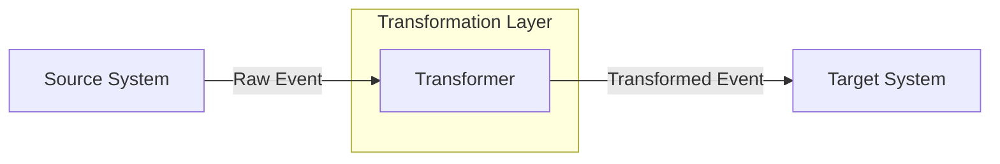
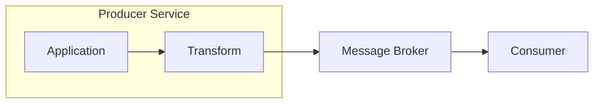
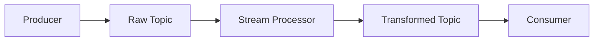
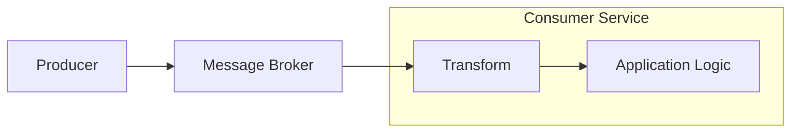
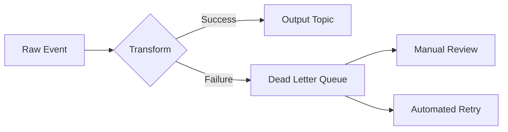

# How to Create Event Transformation

Author: [nawazdhandala](https://github.com/nawazdhandala)

Tags: Event-Driven, Transformation, Data Processing, ETL

Description: Learn to create event transformation patterns for converting event formats and structures across systems.

---

Event transformation sits at the core of modern data pipelines. When systems speak different dialects - one emits JSON, another expects Avro, a third needs flattened key-value pairs - you need a translation layer. This guide walks through practical patterns for building event transformations that bridge these gaps without creating maintenance nightmares.

---

## What Is Event Transformation?

Event transformation converts data from one format or structure to another as it flows between systems. The source system produces events in its native format. The transformation layer reshapes that data. The target system receives events in the format it expects.



Common transformation operations include:

| Operation | Description | Example |
|-----------|-------------|---------|
| Field Mapping | Rename fields to match target schema | `user_id` to `userId` |
| Type Conversion | Change data types | String timestamp to Unix epoch |
| Enrichment | Add data from external sources | Append geo data from IP address |
| Filtering | Remove unwanted fields or events | Strip PII before analytics |
| Aggregation | Combine multiple events | Batch user actions into sessions |
| Splitting | Break one event into many | Fan-out order to inventory updates |

---

## Transformation Architecture Patterns

Three patterns dominate event transformation architecture. Your choice depends on latency requirements, complexity, and operational constraints.

### Pattern 1: Inline Transformation

The producer transforms events before publishing. Simple but couples transformation logic to the source.



### Pattern 2: Stream Processor

A dedicated service reads raw events, transforms them, and writes to a new topic. Decouples concerns but adds infrastructure.



### Pattern 3: Consumer-Side Transformation

The consumer handles transformation. Useful when you cannot modify upstream systems.



---

## Building a Transformation Pipeline

A well-structured transformation pipeline separates concerns into distinct stages. Each stage handles one responsibility, making the code testable and maintainable.

The following TypeScript example shows a pipeline that processes order events. It validates incoming data, maps fields to the target schema, enriches with customer data, and filters out test orders.

```typescript
// types.ts - Define input and output event shapes
interface RawOrderEvent {
  order_id: string;
  customer_id: string;
  items: Array<{ sku: string; qty: number; price: number }>;
  created_at: string;
  is_test: boolean;
}

interface TransformedOrderEvent {
  orderId: string;
  customerId: string;
  customerName: string;
  lineItems: Array<{ productId: string; quantity: number; unitPrice: number }>;
  totalAmount: number;
  createdTimestamp: number;
}
```

The transformer class chains operations together. Each method returns the instance, enabling a fluent API.

```typescript
// transformer.ts - Core transformation logic
class OrderTransformer {
  private event: RawOrderEvent;
  private result: Partial<TransformedOrderEvent> = {};
  private shouldProcess: boolean = true;

  constructor(event: RawOrderEvent) {
    this.event = event;
  }

  // Validate required fields exist and have correct types
  validate(): OrderTransformer {
    if (!this.event.order_id || typeof this.event.order_id !== 'string') {
      throw new Error('Invalid order_id');
    }
    if (!Array.isArray(this.event.items) || this.event.items.length === 0) {
      throw new Error('Order must have at least one item');
    }
    return this;
  }

  // Filter out events that should not be processed
  filter(): OrderTransformer {
    if (this.event.is_test) {
      this.shouldProcess = false;
    }
    return this;
  }

  // Map fields from source schema to target schema
  mapFields(): OrderTransformer {
    if (!this.shouldProcess) return this;

    this.result.orderId = this.event.order_id;
    this.result.customerId = this.event.customer_id;
    this.result.createdTimestamp = new Date(this.event.created_at).getTime();

    // Transform nested array with field renaming
    this.result.lineItems = this.event.items.map(item => ({
      productId: item.sku,
      quantity: item.qty,
      unitPrice: item.price
    }));

    return this;
  }

  // Calculate derived fields from existing data
  aggregate(): OrderTransformer {
    if (!this.shouldProcess) return this;

    this.result.totalAmount = this.event.items.reduce(
      (sum, item) => sum + (item.qty * item.price),
      0
    );

    return this;
  }

  // Add data from external sources
  async enrich(customerService: CustomerService): Promise<OrderTransformer> {
    if (!this.shouldProcess) return this;

    const customer = await customerService.getById(this.event.customer_id);
    this.result.customerName = customer.name;

    return this;
  }

  // Return final transformed event or null if filtered
  build(): TransformedOrderEvent | null {
    if (!this.shouldProcess) return null;
    return this.result as TransformedOrderEvent;
  }
}
```

The pipeline executor orchestrates the transformation stages and handles errors.

```typescript
// pipeline.ts - Execute transformation with error handling
async function processOrderEvent(
  rawEvent: RawOrderEvent,
  customerService: CustomerService
): Promise<TransformedOrderEvent | null> {
  try {
    const transformer = new OrderTransformer(rawEvent);

    // Chain transformation stages
    transformer.validate();
    transformer.filter();
    transformer.mapFields();
    transformer.aggregate();
    await transformer.enrich(customerService);

    return transformer.build();
  } catch (error) {
    // Log error with event context for debugging
    console.error('Transformation failed', {
      orderId: rawEvent.order_id,
      error: error.message
    });

    // Decide: throw, return null, or send to dead letter queue
    return null;
  }
}
```

---

## Handling Schema Evolution

Schemas change over time. Field names get updated. New fields appear. Old fields disappear. Your transformation layer needs to handle these changes gracefully.

Version detection examines the event structure to determine which transformation path to use.

```typescript
// schema-evolution.ts - Handle multiple event versions
interface EventV1 {
  version?: undefined;
  user: string;
  action: string;
}

interface EventV2 {
  version: 2;
  userId: string;
  actionType: string;
  metadata: Record<string, unknown>;
}

type IncomingEvent = EventV1 | EventV2;

interface NormalizedEvent {
  userId: string;
  action: string;
  metadata: Record<string, unknown>;
}

function normalizeEvent(event: IncomingEvent): NormalizedEvent {
  // Detect version by checking for version field or structure
  if ('version' in event && event.version === 2) {
    // V2 events have the new schema
    return {
      userId: event.userId,
      action: event.actionType,
      metadata: event.metadata
    };
  }

  // V1 events (no version field) use old schema
  return {
    userId: event.user,
    action: event.action,
    metadata: {}
  };
}
```

---

## Transformation Strategies Comparison

Different use cases call for different transformation approaches. This table summarizes when to use each strategy.

| Strategy | Latency | Complexity | Use Case |
|----------|---------|------------|----------|
| Synchronous | Low | Low | Simple field mapping, small payloads |
| Async/Streaming | Medium | Medium | Enrichment requiring external calls |
| Batch | High | High | Aggregations, large-scale ETL |
| Schema Registry | Low | Medium | Strongly typed events, Avro/Protobuf |

---

## Error Handling Patterns

Transformations fail. Invalid data arrives. External services timeout. A robust pipeline handles these scenarios without losing events.

The dead letter queue pattern preserves failed events for later analysis or reprocessing.



Implement retry logic with exponential backoff for transient failures.

```typescript
// retry.ts - Retry with exponential backoff
async function transformWithRetry<T, R>(
  event: T,
  transformer: (e: T) => Promise<R>,
  maxRetries: number = 3
): Promise<R> {
  let lastError: Error;

  for (let attempt = 0; attempt < maxRetries; attempt++) {
    try {
      return await transformer(event);
    } catch (error) {
      lastError = error;

      // Check if error is retryable (network issues, timeouts)
      if (!isRetryableError(error)) {
        throw error;
      }

      // Exponential backoff: 100ms, 200ms, 400ms...
      const delay = Math.pow(2, attempt) * 100;
      await sleep(delay);
    }
  }

  throw lastError;
}

function isRetryableError(error: Error): boolean {
  const retryableCodes = ['ECONNRESET', 'ETIMEDOUT', 'ENOTFOUND'];
  return retryableCodes.some(code => error.message.includes(code));
}
```

---

## Testing Transformations

Transformation logic is pure functions at its core - given input X, produce output Y. This makes them straightforward to test.

```typescript
// transformer.test.ts - Unit tests for transformation logic
describe('OrderTransformer', () => {
  it('maps fields correctly', () => {
    const raw: RawOrderEvent = {
      order_id: 'ORD-123',
      customer_id: 'CUST-456',
      items: [{ sku: 'PROD-1', qty: 2, price: 25.00 }],
      created_at: '2026-01-30T10:00:00Z',
      is_test: false
    };

    const transformer = new OrderTransformer(raw);
    transformer.validate().filter().mapFields().aggregate();
    const result = transformer.build();

    expect(result.orderId).toBe('ORD-123');
    expect(result.lineItems[0].productId).toBe('PROD-1');
    expect(result.totalAmount).toBe(50.00);
  });

  it('filters test orders', () => {
    const raw: RawOrderEvent = {
      order_id: 'ORD-TEST',
      customer_id: 'CUST-456',
      items: [{ sku: 'PROD-1', qty: 1, price: 10.00 }],
      created_at: '2026-01-30T10:00:00Z',
      is_test: true
    };

    const transformer = new OrderTransformer(raw);
    transformer.validate().filter().mapFields();
    const result = transformer.build();

    expect(result).toBeNull();
  });
});
```

---

## Production Checklist

Before deploying event transformations to production, verify these items:

- **Idempotency**: Can the same event be processed multiple times without side effects?
- **Ordering**: Does your pipeline preserve event order when required?
- **Backpressure**: What happens when downstream systems slow down?
- **Monitoring**: Are you tracking transformation latency, success rate, and error types?
- **Dead Letter Handling**: How do you handle and replay failed events?
- **Schema Validation**: Are you validating events against expected schemas?
- **Resource Limits**: Have you set memory and CPU limits to prevent runaway processes?

---

## Summary

Event transformation bridges the gap between systems that speak different data languages. Start simple with inline transformations for basic field mapping. Move to dedicated stream processors when complexity grows. Always plan for schema evolution and build robust error handling from the start.

The patterns shown here - validation, mapping, enrichment, filtering, and aggregation - form the building blocks for any transformation pipeline. Combine them based on your specific requirements and iterate as your needs evolve.

---

**Related Reading:**

- [What is OpenTelemetry Collector and Why Use One](https://oneuptime.com/blog/post/2025-09-18-what-is-opentelemetry-collector-and-why-use-one/view)
- [How to Structure Logs Properly in OpenTelemetry](https://oneuptime.com/blog/post/2025-08-28-how-to-structure-logs-properly-in-opentelemetry/view)
- [Traces and Spans in OpenTelemetry](https://oneuptime.com/blog/post/2025-08-27-traces-and-spans-in-opentelemetry/view)
