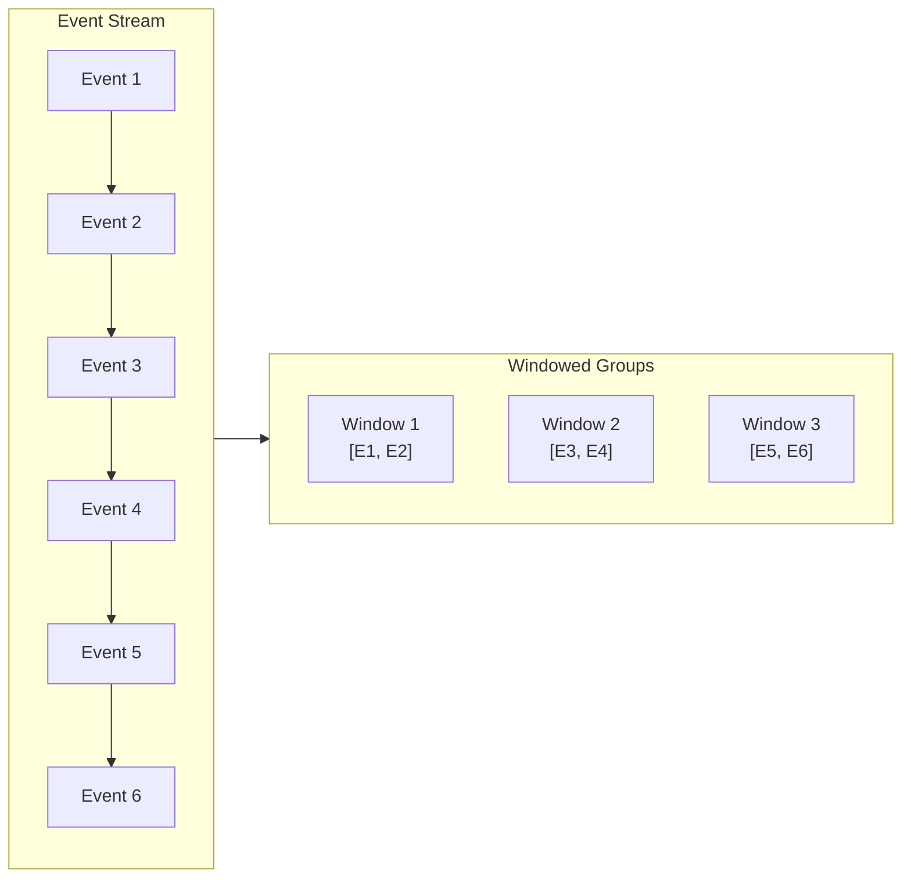
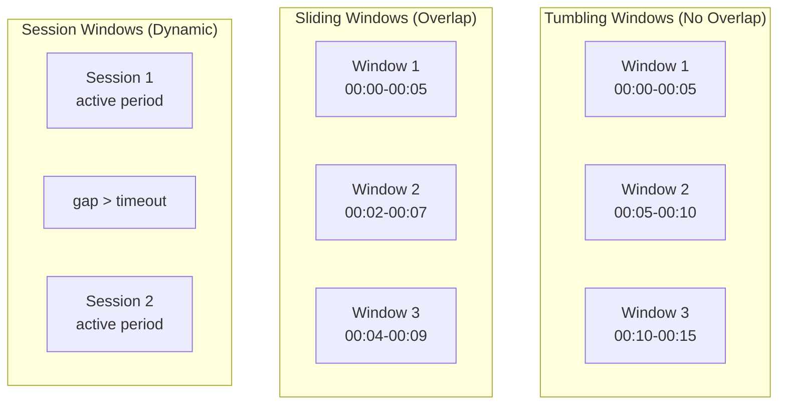
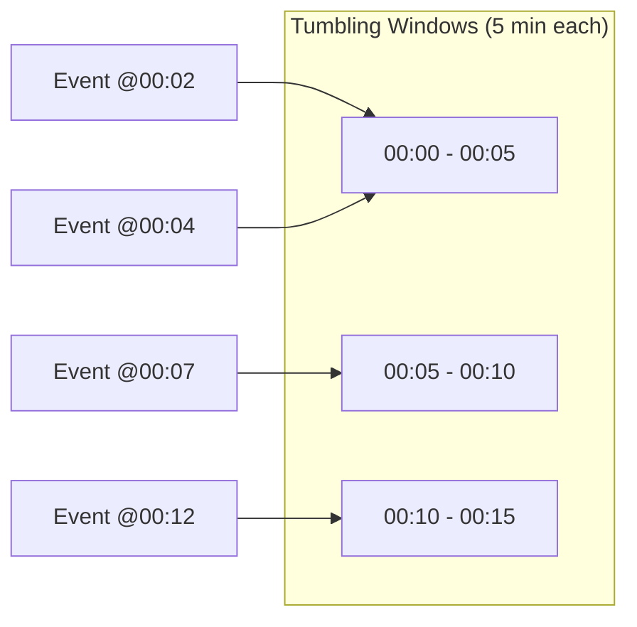
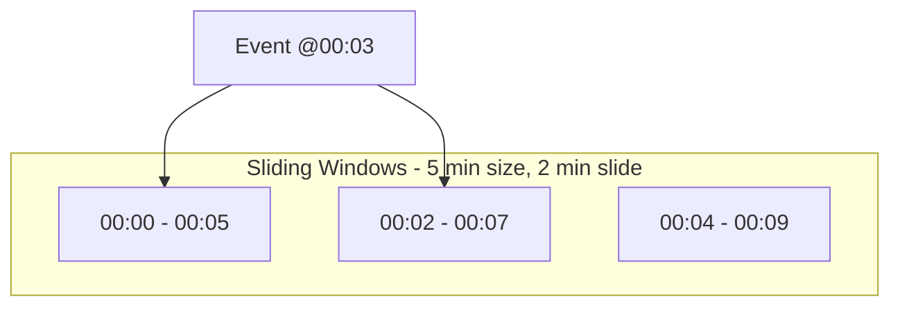
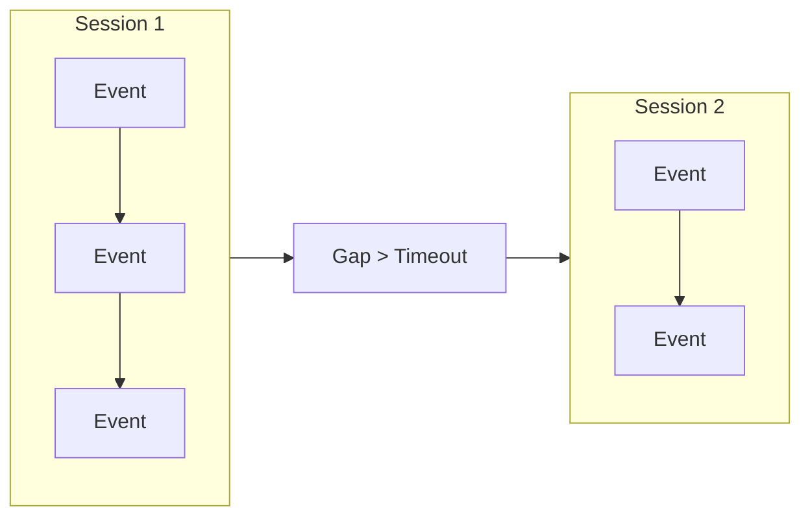
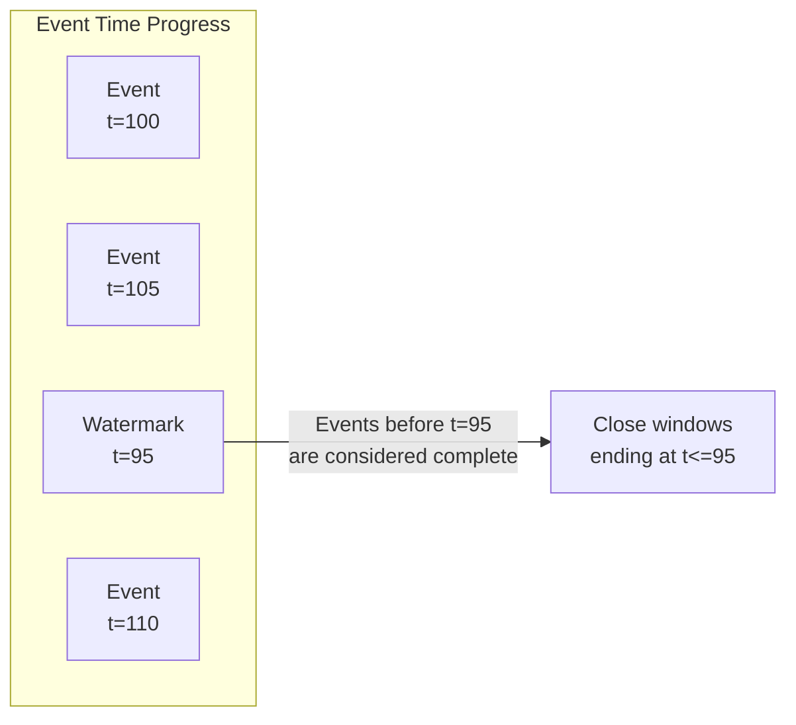
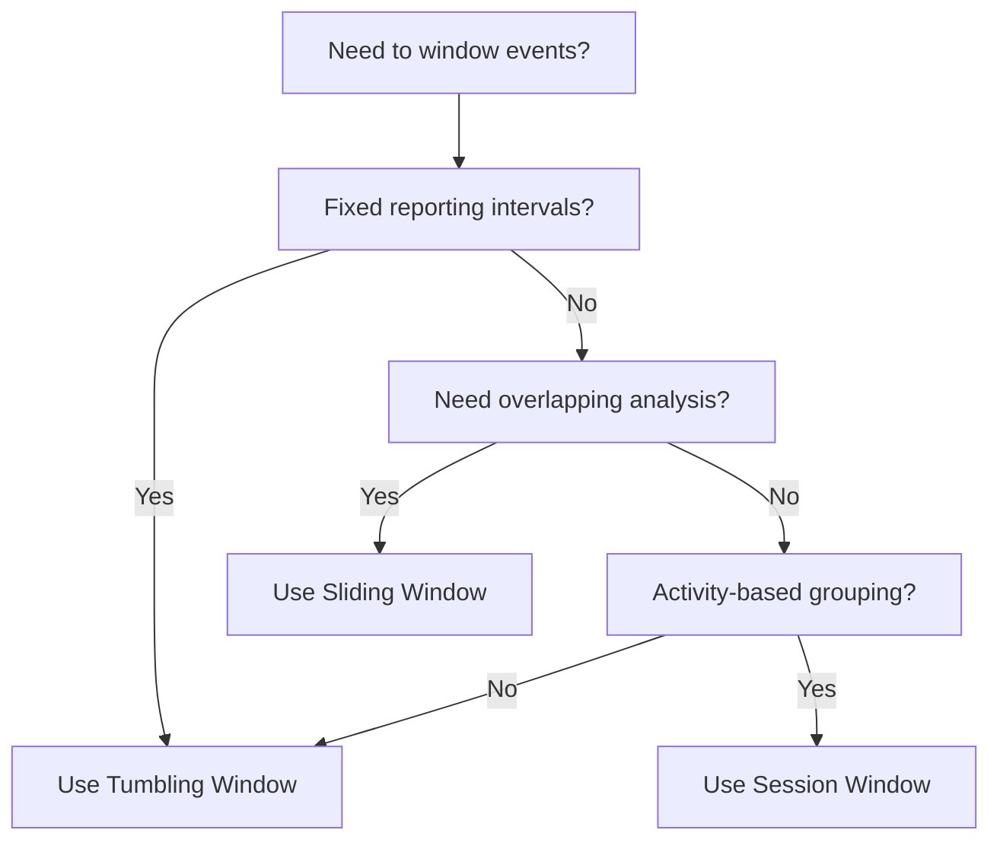

# How to Build Event Windowing

Author: [nawazdhandala](https://github.com/nawazdhandala)

Tags: Event-Driven, Windowing, Streaming, Time-Series

Description: Learn to build event windowing strategies including tumbling, sliding, and session windows for stream processing.

---

When processing continuous data streams, you rarely want to act on individual events. Instead, you group events into bounded chunks called windows - enabling aggregations like counting requests per minute, detecting anomalies over rolling periods, or tracking user sessions.

This guide covers the three fundamental windowing strategies: tumbling, sliding, and session windows. You will learn how each works, when to use them, and how to implement them from scratch.

---

## Table of Contents

1. What is Event Windowing?
2. Window Types Comparison
3. Tumbling Windows
4. Sliding Windows
5. Session Windows
6. Handling Late Events
7. Watermarks and Event Time
8. Implementation Patterns
9. Choosing the Right Window

---

## 1. What is Event Windowing?

Event windowing divides an unbounded stream of events into finite, manageable chunks based on time or count. Each window collects events that belong together, then triggers a computation when the window closes.

The following diagram shows how a continuous event stream gets partitioned into windows.



Key concepts:

| Term | Definition |
|------|------------|
| Window | A bounded collection of events grouped by time or count |
| Window Start | The timestamp when a window begins accepting events |
| Window End | The timestamp when a window closes and triggers computation |
| Trigger | The condition that fires the window computation |
| Watermark | A marker indicating that no events older than this time will arrive |

---

## 2. Window Types Comparison

Each window type serves different use cases. Here is a quick comparison.

| Window Type | Overlap | Use Case | Complexity |
|-------------|---------|----------|------------|
| Tumbling | None | Fixed-interval metrics (requests/minute) | Low |
| Sliding | Yes | Moving averages, trend detection | Medium |
| Session | Dynamic | User activity tracking, conversation grouping | High |

The following diagram illustrates how events map to windows in each strategy.



---

## 3. Tumbling Windows

Tumbling windows are fixed-size, non-overlapping time intervals. Each event belongs to exactly one window.



The implementation aligns each event to its window boundary using integer division.

```typescript
// TumblingWindow class manages fixed-size, non-overlapping windows
// Events are assigned to exactly one window based on their timestamp

interface Event {
  timestamp: number;  // Unix timestamp in milliseconds
  data: any;
}

interface WindowResult<T> {
  windowStart: number;
  windowEnd: number;
  events: Event[];
  result: T;
}

class TumblingWindow<T> {
  private windowSizeMs: number;
  private windows: Map<number, Event[]> = new Map();
  private aggregator: (events: Event[]) => T;

  constructor(windowSizeMs: number, aggregator: (events: Event[]) => T) {
    // Store the window duration for boundary calculations
    this.windowSizeMs = windowSizeMs;
    // Aggregator function computes the final result when window closes
    this.aggregator = aggregator;
  }

  // Calculate which window an event belongs to using floor division
  // This ensures all events within the same interval map to the same key
  private getWindowKey(timestamp: number): number {
    return Math.floor(timestamp / this.windowSizeMs) * this.windowSizeMs;
  }

  // Add an event to its corresponding window bucket
  add(event: Event): void {
    const key = this.getWindowKey(event.timestamp);

    if (!this.windows.has(key)) {
      this.windows.set(key, []);
    }

    this.windows.get(key)!.push(event);
  }

  // Close all windows that have ended relative to the watermark
  // Returns aggregated results and removes closed windows from memory
  closeWindows(watermark: number): WindowResult<T>[] {
    const results: WindowResult<T>[] = [];

    for (const [windowStart, events] of this.windows.entries()) {
      const windowEnd = windowStart + this.windowSizeMs;

      // Only close windows that are fully past the watermark
      if (windowEnd <= watermark) {
        results.push({
          windowStart,
          windowEnd,
          events,
          result: this.aggregator(events)
        });

        // Free memory by removing closed windows
        this.windows.delete(windowStart);
      }
    }

    return results;
  }
}

// Usage: Count HTTP requests per minute
const requestCounter = new TumblingWindow<number>(
  60 * 1000,  // 1 minute windows
  (events) => events.length  // Count events
);

// Simulate incoming requests
requestCounter.add({ timestamp: Date.now(), data: { path: '/api/users' } });
requestCounter.add({ timestamp: Date.now() + 500, data: { path: '/api/orders' } });

// Close windows when watermark advances
const results = requestCounter.closeWindows(Date.now() + 60000);
console.log(results);  // [{ windowStart: ..., result: 2 }]
```

---

## 4. Sliding Windows

Sliding windows have a fixed size but can overlap. Each event may belong to multiple windows. This is useful for computing moving averages or detecting trends.



The sliding window implementation tracks which windows each event contributes to.

```typescript
// SlidingWindow computes overlapping windows
// Each event can appear in multiple window results

class SlidingWindow<T> {
  private windowSizeMs: number;
  private slideSizeMs: number;
  private events: Event[] = [];
  private aggregator: (events: Event[]) => T;

  constructor(
    windowSizeMs: number,
    slideSizeMs: number,
    aggregator: (events: Event[]) => T
  ) {
    // Window size determines how far back each window looks
    this.windowSizeMs = windowSizeMs;
    // Slide size controls how frequently new windows are created
    this.slideSizeMs = slideSizeMs;
    this.aggregator = aggregator;
  }

  add(event: Event): void {
    this.events.push(event);
    // Keep events sorted for efficient range queries
    this.events.sort((a, b) => a.timestamp - b.timestamp);
  }

  // Compute all windows that can be closed given the current watermark
  closeWindows(watermark: number): WindowResult<T>[] {
    const results: WindowResult<T>[] = [];

    if (this.events.length === 0) return results;

    // Find the earliest window that contains our oldest event
    const minTime = this.events[0].timestamp;
    const firstWindowStart = Math.floor(minTime / this.slideSizeMs) * this.slideSizeMs;

    // Iterate through all window start times up to the watermark
    for (
      let windowStart = firstWindowStart;
      windowStart + this.windowSizeMs <= watermark;
      windowStart += this.slideSizeMs
    ) {
      const windowEnd = windowStart + this.windowSizeMs;

      // Filter events that fall within this window's time range
      const windowEvents = this.events.filter(
        e => e.timestamp >= windowStart && e.timestamp < windowEnd
      );

      if (windowEvents.length > 0) {
        results.push({
          windowStart,
          windowEnd,
          events: windowEvents,
          result: this.aggregator(windowEvents)
        });
      }
    }

    // Prune old events that cannot contribute to future windows
    const cutoff = watermark - this.windowSizeMs;
    this.events = this.events.filter(e => e.timestamp >= cutoff);

    return results;
  }
}

// Usage: 5-minute moving average with 1-minute slides
const movingAvg = new SlidingWindow<number>(
  5 * 60 * 1000,  // 5 minute window
  60 * 1000,       // 1 minute slide
  (events) => {
    const sum = events.reduce((acc, e) => acc + e.data.value, 0);
    return sum / events.length;
  }
);
```

---

## 5. Session Windows

Session windows group events by activity periods. A session ends when no events arrive within the gap timeout. This is ideal for tracking user sessions or conversation threads.



Session windows require tracking per-key state and merging overlapping sessions.

```typescript
// SessionWindow groups events by activity periods
// Sessions close after a configurable gap of inactivity

interface Session {
  key: string;
  events: Event[];
  lastEventTime: number;
}

class SessionWindow<T> {
  private gapTimeoutMs: number;
  private sessions: Map<string, Session> = new Map();
  private aggregator: (events: Event[]) => T;
  private keyExtractor: (event: Event) => string;

  constructor(
    gapTimeoutMs: number,
    keyExtractor: (event: Event) => string,
    aggregator: (events: Event[]) => T
  ) {
    // Gap timeout determines when a session is considered complete
    this.gapTimeoutMs = gapTimeoutMs;
    // Key extractor groups events by user, device, or other identifier
    this.keyExtractor = keyExtractor;
    this.aggregator = aggregator;
  }

  add(event: Event): void {
    const key = this.keyExtractor(event);
    const existing = this.sessions.get(key);

    if (existing) {
      // Check if this event extends the current session or starts a new one
      const gap = event.timestamp - existing.lastEventTime;

      if (gap <= this.gapTimeoutMs) {
        // Extend existing session
        existing.events.push(event);
        existing.lastEventTime = event.timestamp;
      } else {
        // Gap exceeded - this will be handled in closeWindows
        // For now, start tracking the new session
        this.sessions.set(key, {
          key,
          events: [event],
          lastEventTime: event.timestamp
        });
      }
    } else {
      // First event for this key - create new session
      this.sessions.set(key, {
        key,
        events: [event],
        lastEventTime: event.timestamp
      });
    }
  }

  // Close sessions that have been inactive longer than the gap timeout
  closeWindows(watermark: number): WindowResult<T>[] {
    const results: WindowResult<T>[] = [];

    for (const [key, session] of this.sessions.entries()) {
      const timeSinceLastEvent = watermark - session.lastEventTime;

      // Session is complete if no activity within gap timeout
      if (timeSinceLastEvent >= this.gapTimeoutMs) {
        const windowStart = session.events[0].timestamp;
        const windowEnd = session.lastEventTime;

        results.push({
          windowStart,
          windowEnd,
          events: session.events,
          result: this.aggregator(session.events)
        });

        this.sessions.delete(key);
      }
    }

    return results;
  }
}

// Usage: Track user sessions with 30-minute inactivity timeout
const userSessions = new SessionWindow<{ pageViews: number; duration: number }>(
  30 * 60 * 1000,  // 30 minute gap timeout
  (event) => event.data.userId,  // Group by user ID
  (events) => ({
    pageViews: events.length,
    duration: events[events.length - 1].timestamp - events[0].timestamp
  })
);
```

---

## 6. Handling Late Events

Events can arrive out of order due to network delays or distributed system timing. You need a strategy for late arrivals.

| Strategy | Description | Trade-off |
|----------|-------------|-----------|
| Drop | Ignore events after window closes | Simple but loses data |
| Recompute | Reopen window and emit updated result | Accurate but expensive |
| Side Output | Route late events to separate stream | Flexible but adds complexity |

The following code demonstrates the side output pattern.

```typescript
// LateEventHandler routes late arrivals to a separate processing path
// This preserves data while keeping main pipeline efficient

interface LateEventHandler {
  onLateEvent: (event: Event, windowEnd: number) => void;
}

class WindowWithLateHandling<T> extends TumblingWindow<T> {
  private allowedLateness: number;
  private lateHandler: LateEventHandler;
  private closedWindows: Map<number, number> = new Map();  // windowStart -> closeTime

  constructor(
    windowSizeMs: number,
    aggregator: (events: Event[]) => T,
    allowedLateness: number,
    lateHandler: LateEventHandler
  ) {
    super(windowSizeMs, aggregator);
    // Grace period for accepting late events
    this.allowedLateness = allowedLateness;
    this.lateHandler = lateHandler;
  }

  addWithLateHandling(event: Event, watermark: number): boolean {
    const windowEnd = this.getWindowKey(event.timestamp) + this.windowSizeMs;

    // Check if event is late (its window has already closed)
    if (windowEnd <= watermark) {
      // Check if within allowed lateness grace period
      if (watermark - windowEnd <= this.allowedLateness) {
        // Accept late event - trigger recomputation
        super.add(event);
        return true;
      } else {
        // Too late - route to side output
        this.lateHandler.onLateEvent(event, windowEnd);
        return false;
      }
    }

    // Event is on time
    super.add(event);
    return true;
  }
}
```

---

## 7. Watermarks and Event Time

Watermarks track progress through event time, indicating that no events older than the watermark should arrive. This enables processing with out-of-order events.



A basic watermark generator tracks the maximum observed timestamp minus a tolerance.

```typescript
// WatermarkGenerator estimates event time progress
// Allows for bounded out-of-order events

class WatermarkGenerator {
  private maxObservedTimestamp: number = 0;
  private maxOutOfOrderness: number;

  constructor(maxOutOfOrderness: number) {
    // Tolerance for how late events can be relative to latest seen
    this.maxOutOfOrderness = maxOutOfOrderness;
  }

  // Update watermark based on newly observed event
  observe(eventTimestamp: number): void {
    if (eventTimestamp > this.maxObservedTimestamp) {
      this.maxObservedTimestamp = eventTimestamp;
    }
  }

  // Get current watermark - all events before this time are assumed arrived
  getWatermark(): number {
    return this.maxObservedTimestamp - this.maxOutOfOrderness;
  }
}

// Usage with tumbling window
const watermarkGen = new WatermarkGenerator(5000);  // 5 second tolerance
const window = new TumblingWindow<number>(60000, events => events.length);

function processEvent(event: Event) {
  watermarkGen.observe(event.timestamp);
  window.add(event);

  // Periodically close windows based on watermark
  const watermark = watermarkGen.getWatermark();
  const results = window.closeWindows(watermark);

  for (const result of results) {
    console.log(`Window [${result.windowStart} - ${result.windowEnd}]: ${result.result}`);
  }
}
```

---

## 8. Implementation Patterns

Here is a complete stream processor that combines all windowing concepts.

```typescript
// StreamProcessor ties together events, watermarks, and windows
// Production systems would add persistence and checkpointing

class StreamProcessor<T> {
  private window: TumblingWindow<T> | SlidingWindow<T> | SessionWindow<T>;
  private watermarkGen: WatermarkGenerator;
  private onResult: (result: WindowResult<T>) => void;

  constructor(
    window: TumblingWindow<T> | SlidingWindow<T> | SessionWindow<T>,
    maxOutOfOrderness: number,
    onResult: (result: WindowResult<T>) => void
  ) {
    this.window = window;
    this.watermarkGen = new WatermarkGenerator(maxOutOfOrderness);
    this.onResult = onResult;
  }

  // Process a single event through the pipeline
  process(event: Event): void {
    // 1. Update watermark tracking
    this.watermarkGen.observe(event.timestamp);

    // 2. Add event to window
    this.window.add(event);

    // 3. Check for windows ready to close
    const watermark = this.watermarkGen.getWatermark();
    const results = this.window.closeWindows(watermark);

    // 4. Emit completed window results
    for (const result of results) {
      this.onResult(result);
    }
  }

  // Force flush remaining windows (for shutdown)
  flush(): void {
    const results = this.window.closeWindows(Number.MAX_SAFE_INTEGER);
    for (const result of results) {
      this.onResult(result);
    }
  }
}

// Example: Error rate monitoring with 1-minute tumbling windows
const errorMonitor = new StreamProcessor(
  new TumblingWindow<{ total: number; errors: number }>(
    60000,
    (events) => ({
      total: events.length,
      errors: events.filter(e => e.data.status >= 500).length
    })
  ),
  10000,  // 10 second out-of-order tolerance
  (result) => {
    const errorRate = result.result.errors / result.result.total;
    if (errorRate > 0.05) {
      console.log(`Alert: Error rate ${(errorRate * 100).toFixed(1)}% in window`);
    }
  }
);
```

---

## 9. Choosing the Right Window

Use this decision guide to select the appropriate window type.

| Requirement | Recommended Window |
|-------------|-------------------|
| Fixed-interval reporting (requests/min) | Tumbling |
| Smooth trend analysis (moving average) | Sliding |
| User behavior tracking | Session |
| Real-time alerting with low latency | Tumbling (smaller size) |
| Anomaly detection with context | Sliding |
| Billing by usage period | Tumbling |



---

## Summary

Event windowing transforms unbounded streams into bounded computations. Tumbling windows provide clean, non-overlapping intervals for metrics. Sliding windows enable trend detection through overlapping analysis. Session windows track user activity with dynamic boundaries.

The key implementation details are: calculating window boundaries from timestamps, managing per-window state efficiently, using watermarks to handle out-of-order events, and choosing appropriate strategies for late arrivals.

Start with tumbling windows for most use cases - they are simple to reason about and efficient to implement. Graduate to sliding or session windows when your analysis requires overlap or activity-based grouping.

---

*Building an observability pipeline? [OneUptime](https://oneuptime.com) processes streaming telemetry with built-in windowing for metrics aggregation, alerting, and anomaly detection.*
