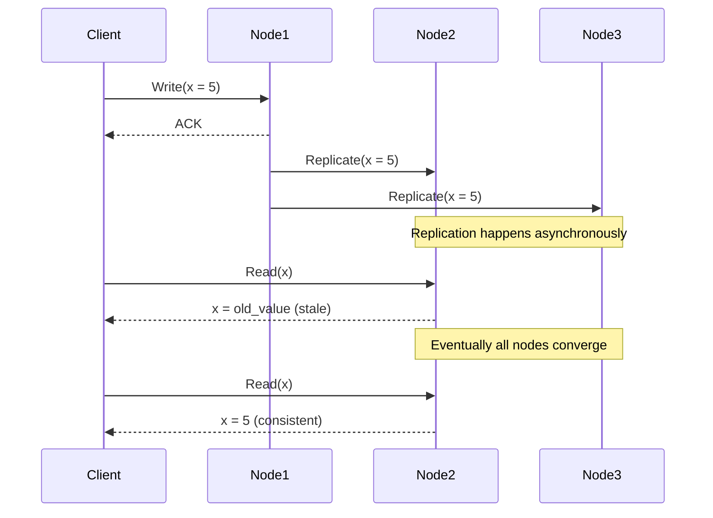
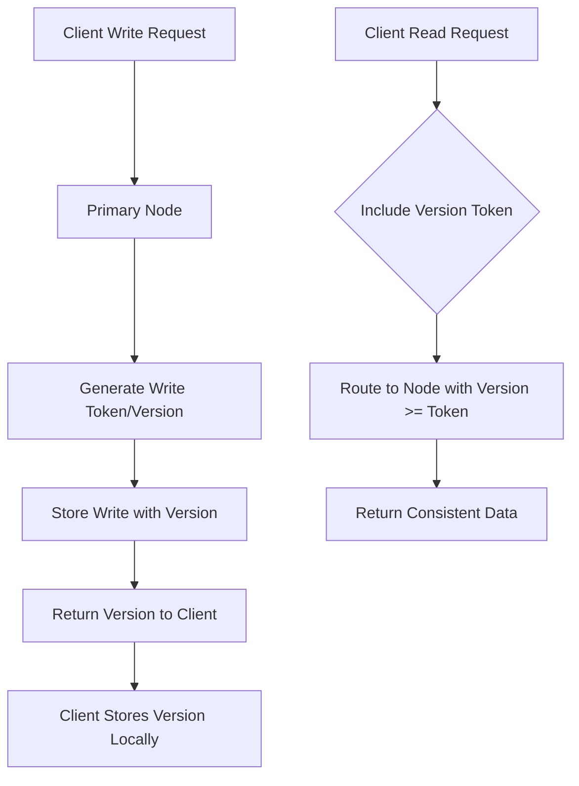
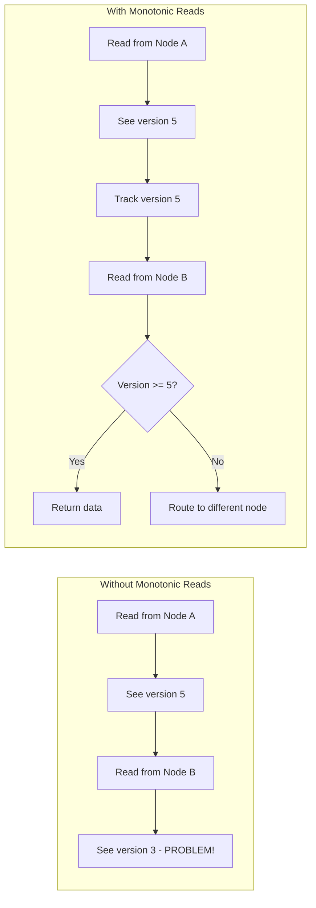
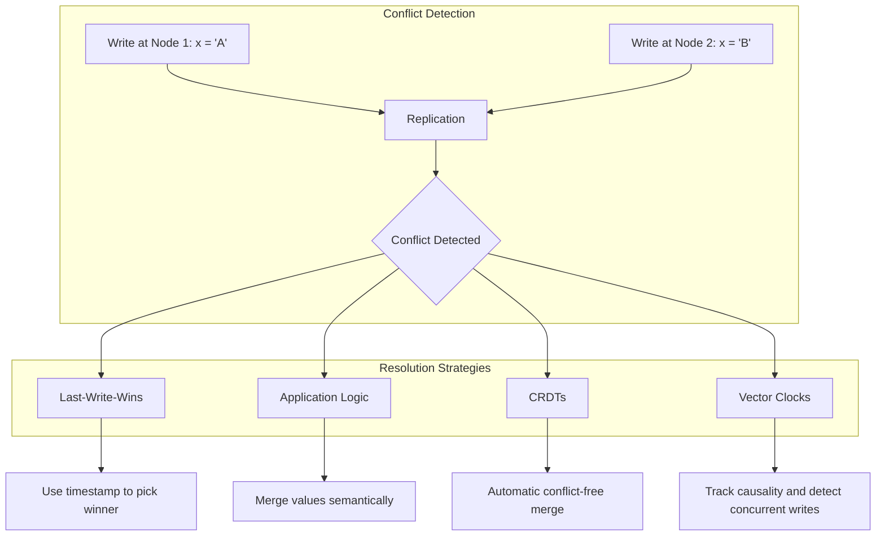

# How to Build Eventual Consistency Patterns

Author: [nawazdhandala](https://github.com/nawazdhandala)

Tags: Distributed Systems, Consistency, Architecture, Database

Description: Learn how to implement eventual consistency patterns for scalable distributed systems.

---

In distributed systems, achieving strong consistency across all nodes comes at a significant cost: availability and latency. Eventual consistency offers a practical alternative where all replicas converge to the same state given enough time without new updates. This post explores three essential patterns for building eventually consistent systems: read-your-writes, monotonic reads, and conflict resolution.

## Understanding Eventual Consistency

Before diving into patterns, let us understand what eventual consistency means. In an eventually consistent system, after a write completes, reads may not immediately reflect that write. However, if no new writes occur, all replicas will eventually return the same value.



## Pattern 1: Read-Your-Writes Consistency

Read-your-writes (also called read-your-own-writes) guarantees that once a client writes a value, subsequent reads by the same client will always see that write or a more recent value. This prevents the confusing scenario where a user updates their profile but then sees the old version.

### Implementation Strategy



### Code Example: Read-Your-Writes with Version Vectors

```typescript
// Interface for tracking write versions per client session
interface SessionState {
    // Maps entity ID to the last write version seen by this session
    lastWriteVersions: Map<string, number>;
}

// Database node that handles reads and writes
class DatabaseNode {
    private data: Map<string, { value: any; version: number }> = new Map();
    private currentVersion: number = 0;

    // Write operation that returns the version number
    write(key: string, value: any): number {
        this.currentVersion++;
        this.data.set(key, { value, version: this.currentVersion });
        return this.currentVersion;
    }

    // Read operation that can specify a minimum version requirement
    read(key: string, minVersion: number = 0): { value: any; version: number } | null {
        const entry = this.data.get(key);

        // If data exists and meets version requirement, return it
        if (entry && entry.version >= minVersion) {
            return entry;
        }

        // If version requirement not met, return null to signal retry needed
        if (entry && entry.version < minVersion) {
            return null; // Indicates stale data, need to route elsewhere
        }

        return entry || null;
    }

    getVersion(): number {
        return this.currentVersion;
    }
}

// Client wrapper that maintains session state for read-your-writes
class ConsistentClient {
    private session: SessionState = { lastWriteVersions: new Map() };
    private nodes: DatabaseNode[];

    constructor(nodes: DatabaseNode[]) {
        this.nodes = nodes;
    }

    // Write to primary and track the version
    async write(key: string, value: any): Promise<void> {
        // Write to primary node (index 0)
        const version = this.nodes[0].write(key, value);

        // Track this write version for future reads
        this.session.lastWriteVersions.set(key, version);

        console.log(`Wrote key=${key} at version=${version}`);
    }

    // Read with guarantee to see own writes
    async read(key: string): Promise<any> {
        // Get the minimum version we need to see for this key
        const minVersion = this.session.lastWriteVersions.get(key) || 0;

        // Try each node until we find one with sufficient version
        for (const node of this.nodes) {
            const result = node.read(key, minVersion);

            if (result !== null) {
                // Update session to track the version we read
                // This ensures monotonic reads as well
                if (result.version > (this.session.lastWriteVersions.get(key) || 0)) {
                    this.session.lastWriteVersions.set(key, result.version);
                }
                return result.value;
            }
        }

        // If no node has the required version, wait and retry
        // In production, implement exponential backoff
        throw new Error(`Cannot find version >= ${minVersion} for key ${key}`);
    }
}

// Usage example
async function demonstrateReadYourWrites() {
    // Create three database nodes
    const primary = new DatabaseNode();
    const replica1 = new DatabaseNode();
    const replica2 = new DatabaseNode();

    const client = new ConsistentClient([primary, replica1, replica2]);

    // Write a value
    await client.write("user:123:name", "Alice");

    // This read is guaranteed to see "Alice" even if replicas are behind
    const name = await client.read("user:123:name");
    console.log(`Read back: ${name}`); // Always prints "Alice"
}
```

### Database-Specific Implementation: PostgreSQL with Logical Replication

```sql
-- Create a table to track write versions per session
CREATE TABLE session_write_log (
    session_id UUID NOT NULL,
    entity_key VARCHAR(255) NOT NULL,
    write_version BIGINT NOT NULL,
    written_at TIMESTAMP DEFAULT CURRENT_TIMESTAMP,
    PRIMARY KEY (session_id, entity_key)
);

-- Create index for efficient lookups
CREATE INDEX idx_session_writes ON session_write_log(session_id, entity_key);

-- Function to record a write and return the version
CREATE OR REPLACE FUNCTION record_write(
    p_session_id UUID,
    p_entity_key VARCHAR(255)
) RETURNS BIGINT AS $$
DECLARE
    v_version BIGINT;
BEGIN
    -- Get the current WAL position as version
    SELECT pg_current_wal_lsn()::TEXT::BIGINT INTO v_version;

    -- Upsert the session write log
    INSERT INTO session_write_log (session_id, entity_key, write_version)
    VALUES (p_session_id, p_entity_key, v_version)
    ON CONFLICT (session_id, entity_key)
    DO UPDATE SET write_version = v_version, written_at = CURRENT_TIMESTAMP;

    RETURN v_version;
END;
$$ LANGUAGE plpgsql;

-- Function to check if a replica is caught up for read-your-writes
CREATE OR REPLACE FUNCTION can_serve_read(
    p_session_id UUID,
    p_entity_key VARCHAR(255)
) RETURNS BOOLEAN AS $$
DECLARE
    v_required_version BIGINT;
    v_current_version BIGINT;
BEGIN
    -- Get the version required by this session
    SELECT write_version INTO v_required_version
    FROM session_write_log
    WHERE session_id = p_session_id AND entity_key = p_entity_key;

    -- If no write recorded, any version is fine
    IF v_required_version IS NULL THEN
        RETURN TRUE;
    END IF;

    -- Check if this replica has caught up
    SELECT pg_last_wal_replay_lsn()::TEXT::BIGINT INTO v_current_version;

    RETURN v_current_version >= v_required_version;
END;
$$ LANGUAGE plpgsql;
```

## Pattern 2: Monotonic Reads Consistency

Monotonic reads guarantee that if a client reads a value, any subsequent reads will return the same value or a more recent one. This prevents the scenario where a user sees data go "backward in time."



### Implementation with Sticky Sessions and Version Tracking

```typescript
// Version vector for tracking causality across multiple keys
type VersionVector = Map<string, number>;

// Monotonic read manager that ensures reads never go backward
class MonotonicReadManager {
    // Track the highest version seen for each key by each client
    private clientVersions: Map<string, VersionVector> = new Map();

    // Get or create version vector for a client
    private getClientVector(clientId: string): VersionVector {
        if (!this.clientVersions.has(clientId)) {
            this.clientVersions.set(clientId, new Map());
        }
        return this.clientVersions.get(clientId)!;
    }

    // Record a version that a client has observed
    recordObservedVersion(clientId: string, key: string, version: number): void {
        const vector = this.getClientVector(clientId);
        const currentVersion = vector.get(key) || 0;

        // Only update if new version is higher
        if (version > currentVersion) {
            vector.set(key, version);
        }
    }

    // Get the minimum version a client should accept for a key
    getMinimumVersion(clientId: string, key: string): number {
        const vector = this.getClientVector(clientId);
        return vector.get(key) || 0;
    }

    // Check if a read result is acceptable for monotonic reads
    isReadAcceptable(clientId: string, key: string, offeredVersion: number): boolean {
        const minVersion = this.getMinimumVersion(clientId, key);
        return offeredVersion >= minVersion;
    }
}

// Database replica with version tracking
class VersionedReplica {
    private id: string;
    private data: Map<string, { value: any; version: number }> = new Map();
    private replicaVersion: number = 0;

    constructor(id: string) {
        this.id = id;
    }

    // Apply a replicated write
    applyWrite(key: string, value: any, version: number): void {
        const current = this.data.get(key);

        // Only apply if this is a newer version
        if (!current || version > current.version) {
            this.data.set(key, { value, version });
            this.replicaVersion = Math.max(this.replicaVersion, version);
        }
    }

    // Read with version information
    read(key: string): { value: any; version: number } | null {
        return this.data.get(key) || null;
    }

    // Get the overall replica version for routing decisions
    getReplicaVersion(): number {
        return this.replicaVersion;
    }

    getId(): string {
        return this.id;
    }
}

// Router that ensures monotonic reads
class MonotonicReadRouter {
    private replicas: VersionedReplica[];
    private readManager: MonotonicReadManager;

    // Track which replica each client last read from (sticky sessions)
    private clientAffinity: Map<string, string> = new Map();

    constructor(replicas: VersionedReplica[]) {
        this.replicas = replicas;
        this.readManager = new MonotonicReadManager();
    }

    async read(clientId: string, key: string): Promise<any> {
        const minVersion = this.readManager.getMinimumVersion(clientId, key);

        // First, try the sticky replica if we have one
        const stickyReplicaId = this.clientAffinity.get(clientId);
        if (stickyReplicaId) {
            const stickyReplica = this.replicas.find(r => r.getId() === stickyReplicaId);
            if (stickyReplica) {
                const result = stickyReplica.read(key);
                if (result && result.version >= minVersion) {
                    this.readManager.recordObservedVersion(clientId, key, result.version);
                    return result.value;
                }
            }
        }

        // Find a replica that can serve this read
        for (const replica of this.replicas) {
            const result = replica.read(key);

            if (result && result.version >= minVersion) {
                // Update affinity to this replica
                this.clientAffinity.set(clientId, replica.getId());

                // Record the version we observed
                this.readManager.recordObservedVersion(clientId, key, result.version);

                return result.value;
            }
        }

        // No replica can serve this read with monotonic guarantee
        // In production: wait for replication or return error
        throw new Error(
            `No replica has version >= ${minVersion} for key ${key}. ` +
            `Client ${clientId} requires monotonic reads.`
        );
    }
}
```

### Redis Implementation for Monotonic Reads

```python
import redis
import time
from typing import Optional, Any, Dict
from dataclasses import dataclass

@dataclass
class ReadResult:
    """Result of a read operation with version metadata."""
    value: Any
    version: int
    replica_id: str

class MonotonicRedisClient:
    """
    Redis client that ensures monotonic reads across replicas.
    Uses Redis Cluster with read replicas.
    """

    def __init__(self, master_host: str, replica_hosts: list[str]):
        # Connect to master for writes
        self.master = redis.Redis(host=master_host, port=6379, decode_responses=True)

        # Connect to all replicas for reads
        self.replicas = [
            redis.Redis(host=host, port=6379, decode_responses=True)
            for host in replica_hosts
        ]

        # Track client session versions
        # In production, store this in Redis itself for persistence
        self.client_versions: Dict[str, Dict[str, int]] = {}

    def _get_client_min_version(self, client_id: str, key: str) -> int:
        """Get the minimum version this client should accept."""
        if client_id not in self.client_versions:
            return 0
        return self.client_versions[client_id].get(key, 0)

    def _update_client_version(self, client_id: str, key: str, version: int) -> None:
        """Update the version this client has observed."""
        if client_id not in self.client_versions:
            self.client_versions[client_id] = {}

        current = self.client_versions[client_id].get(key, 0)
        if version > current:
            self.client_versions[client_id][key] = version

    def write(self, client_id: str, key: str, value: Any) -> int:
        """
        Write a value to the master node.
        Returns the version (timestamp) of the write.
        """
        # Use timestamp as version for simplicity
        # In production, consider using Redis INCR for a global counter
        version = int(time.time() * 1000000)  # Microsecond precision

        # Store value with version metadata
        # Using a hash to store both value and version atomically
        pipe = self.master.pipeline()
        pipe.hset(f"data:{key}", mapping={
            "value": value,
            "version": version
        })
        pipe.execute()

        # Update client's observed version
        self._update_client_version(client_id, key, version)

        return version

    def read(self, client_id: str, key: str, max_retries: int = 3) -> Optional[Any]:
        """
        Read a value ensuring monotonic reads for this client.
        Will retry if replicas are behind.
        """
        min_version = self._get_client_min_version(client_id, key)

        for attempt in range(max_retries):
            # Try each replica
            for i, replica in enumerate(self.replicas):
                try:
                    data = replica.hgetall(f"data:{key}")

                    if not data:
                        continue

                    version = int(data.get("version", 0))

                    # Check if this replica meets our version requirement
                    if version >= min_version:
                        # Update observed version for future reads
                        self._update_client_version(client_id, key, version)
                        return data.get("value")

                except redis.RedisError as e:
                    # Log and try next replica
                    print(f"Replica {i} error: {e}")
                    continue

            # No replica could serve the read, wait for replication
            if attempt < max_retries - 1:
                time.sleep(0.01 * (attempt + 1))  # Exponential backoff

        # Fall back to master if replicas are too far behind
        data = self.master.hgetall(f"data:{key}")
        if data:
            version = int(data.get("version", 0))
            self._update_client_version(client_id, key, version)
            return data.get("value")

        return None


# Usage example
def demonstrate_monotonic_reads():
    client = MonotonicRedisClient(
        master_host="redis-master",
        replica_hosts=["redis-replica-1", "redis-replica-2"]
    )

    # Write a value
    client.write("user-123", "profile:name", "Alice")

    # First read - might hit any replica
    name1 = client.read("user-123", "profile:name")
    print(f"First read: {name1}")

    # Second read - guaranteed to see same or newer value
    # Even if routed to a different replica
    name2 = client.read("user-123", "profile:name")
    print(f"Second read: {name2}")
```

## Pattern 3: Conflict Resolution

When multiple nodes accept writes concurrently, conflicts can occur. There are several strategies to resolve these conflicts.



### Strategy 1: Last-Write-Wins (LWW)

The simplest approach where the write with the highest timestamp wins.

```typescript
// Last-Write-Wins register implementation
interface LWWValue<T> {
    value: T;
    timestamp: number;
    nodeId: string;  // For tie-breaking
}

class LWWRegister<T> {
    private state: LWWValue<T> | null = null;

    // Write a new value with timestamp
    write(value: T, timestamp: number, nodeId: string): void {
        if (this.shouldUpdate(timestamp, nodeId)) {
            this.state = { value, timestamp, nodeId };
        }
    }

    // Determine if a new write should overwrite current state
    private shouldUpdate(newTimestamp: number, newNodeId: string): boolean {
        if (this.state === null) {
            return true;
        }

        // Higher timestamp wins
        if (newTimestamp > this.state.timestamp) {
            return true;
        }

        // If timestamps equal, use node ID as tiebreaker
        // This ensures deterministic resolution across all nodes
        if (newTimestamp === this.state.timestamp) {
            return newNodeId > this.state.nodeId;
        }

        return false;
    }

    // Merge state from another node
    merge(other: LWWValue<T>): void {
        this.write(other.value, other.timestamp, other.nodeId);
    }

    // Get current value
    read(): T | null {
        return this.state?.value ?? null;
    }

    // Get full state for replication
    getState(): LWWValue<T> | null {
        return this.state;
    }
}

// Example: User profile with LWW semantics
class UserProfile {
    private name: LWWRegister<string> = new LWWRegister();
    private email: LWWRegister<string> = new LWWRegister();
    private bio: LWWRegister<string> = new LWWRegister();
    private nodeId: string;

    constructor(nodeId: string) {
        this.nodeId = nodeId;
    }

    // Update name with current timestamp
    updateName(name: string): void {
        this.name.write(name, Date.now(), this.nodeId);
    }

    // Merge profile from another node
    mergeFrom(other: {
        name: LWWValue<string> | null;
        email: LWWValue<string> | null;
        bio: LWWValue<string> | null;
    }): void {
        if (other.name) this.name.merge(other.name);
        if (other.email) this.email.merge(other.email);
        if (other.bio) this.bio.merge(other.bio);
    }

    getName(): string | null {
        return this.name.read();
    }
}
```

### Strategy 2: Vector Clocks for Causality Tracking

Vector clocks track the causal relationship between events, allowing you to detect concurrent writes that need explicit resolution.

```typescript
// Vector clock implementation for tracking causality
class VectorClock {
    private clock: Map<string, number> = new Map();

    // Increment the clock for a specific node
    increment(nodeId: string): void {
        const current = this.clock.get(nodeId) || 0;
        this.clock.set(nodeId, current + 1);
    }

    // Merge with another vector clock (take max of each component)
    merge(other: VectorClock): void {
        for (const [nodeId, value] of other.clock) {
            const current = this.clock.get(nodeId) || 0;
            this.clock.set(nodeId, Math.max(current, value));
        }
    }

    // Compare two vector clocks
    // Returns: 'before', 'after', 'concurrent', or 'equal'
    compare(other: VectorClock): 'before' | 'after' | 'concurrent' | 'equal' {
        let dominated = false;  // this < other in at least one component
        let dominates = false;  // this > other in at least one component

        // Get all node IDs from both clocks
        const allNodes = new Set([...this.clock.keys(), ...other.clock.keys()]);

        for (const nodeId of allNodes) {
            const thisValue = this.clock.get(nodeId) || 0;
            const otherValue = other.clock.get(nodeId) || 0;

            if (thisValue < otherValue) {
                dominated = true;
            }
            if (thisValue > otherValue) {
                dominates = true;
            }
        }

        if (dominated && dominates) {
            return 'concurrent';  // Neither dominates - conflict!
        }
        if (dominated) {
            return 'before';  // Other happened after this
        }
        if (dominates) {
            return 'after';  // This happened after other
        }
        return 'equal';
    }

    // Create a copy of this clock
    clone(): VectorClock {
        const copy = new VectorClock();
        for (const [nodeId, value] of this.clock) {
            copy.clock.set(nodeId, value);
        }
        return copy;
    }

    // Serialize for storage/transmission
    toJSON(): Record<string, number> {
        return Object.fromEntries(this.clock);
    }

    // Deserialize from storage/transmission
    static fromJSON(data: Record<string, number>): VectorClock {
        const vc = new VectorClock();
        for (const [nodeId, value] of Object.entries(data)) {
            vc.clock.set(nodeId, value);
        }
        return vc;
    }
}

// Versioned value with vector clock
interface VersionedValue<T> {
    value: T;
    clock: VectorClock;
}

// Database that uses vector clocks for conflict detection
class VectorClockDatabase<T> {
    private data: Map<string, VersionedValue<T>[]> = new Map();
    private nodeId: string;
    private nodeClock: VectorClock = new VectorClock();

    constructor(nodeId: string) {
        this.nodeId = nodeId;
    }

    // Write a value, potentially creating a conflict
    write(key: string, value: T, clientClock?: VectorClock): VersionedValue<T> {
        // Increment our clock
        this.nodeClock.increment(this.nodeId);

        // Create new version's clock
        const newClock = clientClock ? clientClock.clone() : new VectorClock();
        newClock.merge(this.nodeClock);
        newClock.increment(this.nodeId);

        const newVersion: VersionedValue<T> = { value, clock: newClock };

        // Get existing versions for this key
        const existing = this.data.get(key) || [];

        // Filter out versions that are dominated by the new version
        const surviving = existing.filter(v => {
            const comparison = v.clock.compare(newClock);
            // Keep if concurrent (conflict) or if it happened after new version
            return comparison === 'concurrent' || comparison === 'after';
        });

        // Add the new version
        surviving.push(newVersion);
        this.data.set(key, surviving);

        return newVersion;
    }

    // Read a value, returning all concurrent versions if conflict exists
    read(key: string): VersionedValue<T>[] {
        return this.data.get(key) || [];
    }

    // Check if there's a conflict for a key
    hasConflict(key: string): boolean {
        const versions = this.data.get(key) || [];
        return versions.length > 1;
    }

    // Resolve conflict by picking a winner
    resolveConflict(
        key: string,
        resolver: (versions: VersionedValue<T>[]) => T
    ): VersionedValue<T> {
        const versions = this.read(key);

        if (versions.length <= 1) {
            return versions[0];
        }

        // Use resolver function to pick/merge the winning value
        const resolvedValue = resolver(versions);

        // Create a new version that dominates all conflicting versions
        const mergedClock = new VectorClock();
        for (const v of versions) {
            mergedClock.merge(v.clock);
        }

        return this.write(key, resolvedValue, mergedClock);
    }
}

// Example: Shopping cart with conflict resolution
interface CartItem {
    productId: string;
    quantity: number;
}

function mergeShoppingCarts(versions: VersionedValue<CartItem[]>[]): CartItem[] {
    // Merge strategy: take the maximum quantity for each item
    const merged = new Map<string, number>();

    for (const version of versions) {
        for (const item of version.value) {
            const current = merged.get(item.productId) || 0;
            merged.set(item.productId, Math.max(current, item.quantity));
        }
    }

    return Array.from(merged.entries()).map(([productId, quantity]) => ({
        productId,
        quantity
    }));
}
```

### Strategy 3: CRDTs (Conflict-free Replicated Data Types)

CRDTs are data structures designed to be merged automatically without conflicts.

```typescript
// G-Counter: A grow-only counter CRDT
class GCounter {
    // Each node maintains its own count
    private counts: Map<string, number> = new Map();

    constructor(private nodeId: string) {}

    // Increment the counter (can only grow)
    increment(amount: number = 1): void {
        if (amount < 0) {
            throw new Error("G-Counter can only increment");
        }
        const current = this.counts.get(this.nodeId) || 0;
        this.counts.set(this.nodeId, current + amount);
    }

    // Get the total count across all nodes
    value(): number {
        let total = 0;
        for (const count of this.counts.values()) {
            total += count;
        }
        return total;
    }

    // Merge with another G-Counter (take max of each node's count)
    merge(other: GCounter): void {
        for (const [nodeId, count] of other.counts) {
            const current = this.counts.get(nodeId) || 0;
            this.counts.set(nodeId, Math.max(current, count));
        }
    }

    // Get state for replication
    getState(): Map<string, number> {
        return new Map(this.counts);
    }
}

// PN-Counter: A counter that supports both increment and decrement
class PNCounter {
    private increments: GCounter;
    private decrements: GCounter;

    constructor(nodeId: string) {
        this.increments = new GCounter(nodeId);
        this.decrements = new GCounter(nodeId);
    }

    increment(amount: number = 1): void {
        this.increments.increment(amount);
    }

    decrement(amount: number = 1): void {
        this.decrements.increment(amount);
    }

    value(): number {
        return this.increments.value() - this.decrements.value();
    }

    merge(other: PNCounter): void {
        this.increments.merge(other.increments);
        this.decrements.merge(other.decrements);
    }
}

// LWW-Element-Set: A set with add and remove operations
interface LWWElement<T> {
    element: T;
    timestamp: number;
}

class LWWElementSet<T> {
    // Track add timestamps
    private adds: Map<string, LWWElement<T>> = new Map();
    // Track remove timestamps
    private removes: Map<string, number> = new Map();

    private serialize(element: T): string {
        return JSON.stringify(element);
    }

    add(element: T, timestamp: number = Date.now()): void {
        const key = this.serialize(element);
        const existing = this.adds.get(key);

        if (!existing || timestamp > existing.timestamp) {
            this.adds.set(key, { element, timestamp });
        }
    }

    remove(element: T, timestamp: number = Date.now()): void {
        const key = this.serialize(element);
        const existing = this.removes.get(key);

        if (!existing || timestamp > existing) {
            this.removes.set(key, timestamp);
        }
    }

    // Check if element is in the set
    // Element is present if add timestamp > remove timestamp
    has(element: T): boolean {
        const key = this.serialize(element);
        const addEntry = this.adds.get(key);
        const removeTimestamp = this.removes.get(key);

        if (!addEntry) {
            return false;
        }

        if (removeTimestamp === undefined) {
            return true;
        }

        // Bias towards add on equal timestamps
        return addEntry.timestamp >= removeTimestamp;
    }

    // Get all elements currently in the set
    values(): T[] {
        const result: T[] = [];
        for (const [key, entry] of this.adds) {
            if (this.has(entry.element)) {
                result.push(entry.element);
            }
        }
        return result;
    }

    // Merge with another LWW-Element-Set
    merge(other: LWWElementSet<T>): void {
        // Merge adds (take latest timestamp for each element)
        for (const [key, entry] of other.adds) {
            const existing = this.adds.get(key);
            if (!existing || entry.timestamp > existing.timestamp) {
                this.adds.set(key, entry);
            }
        }

        // Merge removes (take latest timestamp for each element)
        for (const [key, timestamp] of other.removes) {
            const existing = this.removes.get(key);
            if (!existing || timestamp > existing) {
                this.removes.set(key, timestamp);
            }
        }
    }
}

// Example: Distributed shopping cart using LWW-Element-Set
class DistributedShoppingCart {
    private items: LWWElementSet<CartItem>;

    constructor() {
        this.items = new LWWElementSet();
    }

    addItem(productId: string, quantity: number): void {
        this.items.add({ productId, quantity });
    }

    removeItem(productId: string): void {
        // Remove all quantities of this product
        for (const item of this.items.values()) {
            if (item.productId === productId) {
                this.items.remove(item);
            }
        }
    }

    getItems(): CartItem[] {
        return this.items.values();
    }

    // Merge with cart from another node
    mergeWith(other: DistributedShoppingCart): void {
        this.items.merge(other.items);
    }
}
```

## Practical Database Example: MongoDB with Conflict Resolution

```javascript
// MongoDB schema with version tracking for eventual consistency
const mongoose = require('mongoose');

// Schema that supports version vectors and conflict detection
const documentSchema = new mongoose.Schema({
    // Business data
    data: mongoose.Schema.Types.Mixed,

    // Version vector for conflict detection
    versionVector: {
        type: Map,
        of: Number,
        default: new Map()
    },

    // Timestamp for LWW fallback
    lastModified: {
        type: Date,
        default: Date.now
    },

    // Node that last modified this document
    lastModifiedBy: String,

    // Flag indicating unresolved conflict
    hasConflict: {
        type: Boolean,
        default: false
    },

    // Conflicting versions stored for manual resolution
    conflictingVersions: [{
        data: mongoose.Schema.Types.Mixed,
        versionVector: Map,
        lastModified: Date,
        lastModifiedBy: String
    }]
});

// Method to update with optimistic concurrency
documentSchema.methods.updateWithVersioning = async function(
    newData,
    nodeId,
    clientVersionVector
) {
    const currentVector = new Map(this.versionVector);
    const clientVector = new Map(clientVersionVector);

    // Check for conflicts
    const comparison = compareVersionVectors(currentVector, clientVector);

    if (comparison === 'concurrent') {
        // Conflict detected - store both versions
        this.hasConflict = true;
        this.conflictingVersions.push({
            data: this.data,
            versionVector: currentVector,
            lastModified: this.lastModified,
            lastModifiedBy: this.lastModifiedBy
        });
    }

    // Update the document
    this.data = newData;
    this.lastModified = new Date();
    this.lastModifiedBy = nodeId;

    // Merge and increment version vector
    for (const [node, version] of currentVector) {
        const clientVersion = clientVector.get(node) || 0;
        this.versionVector.set(node, Math.max(version, clientVersion));
    }
    for (const [node, version] of clientVector) {
        if (!this.versionVector.has(node)) {
            this.versionVector.set(node, version);
        }
    }

    // Increment this node's version
    const nodeVersion = this.versionVector.get(nodeId) || 0;
    this.versionVector.set(nodeId, nodeVersion + 1);

    await this.save();
    return this;
};

// Method to resolve conflict
documentSchema.methods.resolveConflict = async function(
    resolvedData,
    nodeId
) {
    // Merge all version vectors
    const mergedVector = new Map(this.versionVector);

    for (const conflict of this.conflictingVersions) {
        for (const [node, version] of conflict.versionVector) {
            const current = mergedVector.get(node) || 0;
            mergedVector.set(node, Math.max(current, version));
        }
    }

    // Apply resolution
    this.data = resolvedData;
    this.versionVector = mergedVector;
    this.lastModified = new Date();
    this.lastModifiedBy = nodeId;
    this.hasConflict = false;
    this.conflictingVersions = [];

    // Increment version
    const nodeVersion = mergedVector.get(nodeId) || 0;
    this.versionVector.set(nodeId, nodeVersion + 1);

    await this.save();
    return this;
};

// Helper function to compare version vectors
function compareVersionVectors(v1, v2) {
    let v1Dominates = false;
    let v2Dominates = false;

    const allNodes = new Set([...v1.keys(), ...v2.keys()]);

    for (const node of allNodes) {
        const val1 = v1.get(node) || 0;
        const val2 = v2.get(node) || 0;

        if (val1 > val2) v1Dominates = true;
        if (val2 > val1) v2Dominates = true;
    }

    if (v1Dominates && v2Dominates) return 'concurrent';
    if (v1Dominates) return 'after';
    if (v2Dominates) return 'before';
    return 'equal';
}

const Document = mongoose.model('Document', documentSchema);

// Usage example
async function demonstrateMongoDBConflictResolution() {
    // Create initial document
    const doc = new Document({
        data: { name: 'Initial', count: 0 },
        lastModifiedBy: 'node-1'
    });
    doc.versionVector.set('node-1', 1);
    await doc.save();

    // Simulate concurrent updates from different nodes
    const node1Version = new Map(doc.versionVector);
    const node2Version = new Map(doc.versionVector);

    // Node 1 updates
    await doc.updateWithVersioning(
        { name: 'Updated by Node 1', count: 1 },
        'node-1',
        node1Version
    );

    // Node 2 updates concurrently (using old version vector)
    await doc.updateWithVersioning(
        { name: 'Updated by Node 2', count: 2 },
        'node-2',
        node2Version
    );

    // Check for conflict
    if (doc.hasConflict) {
        console.log('Conflict detected! Versions:');
        console.log('Current:', doc.data);
        console.log('Conflicting:', doc.conflictingVersions);

        // Resolve by merging (take higher count, concatenate names)
        const resolved = {
            name: 'Merged: Node 1 + Node 2',
            count: Math.max(
                doc.data.count,
                ...doc.conflictingVersions.map(v => v.data.count)
            )
        };

        await doc.resolveConflict(resolved, 'node-resolver');
        console.log('Resolved:', doc.data);
    }
}
```

## Summary

Building eventually consistent systems requires careful consideration of the consistency guarantees your application needs:

| Pattern | Guarantee | Use Case | Complexity |
|---------|-----------|----------|------------|
| Read-Your-Writes | Client sees own writes | User sessions, profiles | Low |
| Monotonic Reads | No time travel | Timeline feeds, logs | Low |
| LWW Conflict Resolution | Latest write wins | Simple values, settings | Low |
| Vector Clocks | Detect concurrent writes | When conflicts need app logic | Medium |
| CRDTs | Automatic conflict resolution | Counters, sets, collaborative editing | High |

When implementing these patterns, consider:

1. **Start simple**: LWW with timestamps handles many use cases
2. **Add complexity only when needed**: Vector clocks and CRDTs add overhead
3. **Test with network partitions**: Use tools like Jepsen or Chaos Monkey
4. **Monitor replication lag**: Alert when replicas fall too far behind
5. **Design for failure**: Assume nodes will fail and messages will be lost

Eventual consistency is not about giving up on correctness. It is about choosing the right consistency model for your application's needs while maintaining the availability and performance that distributed systems enable.
