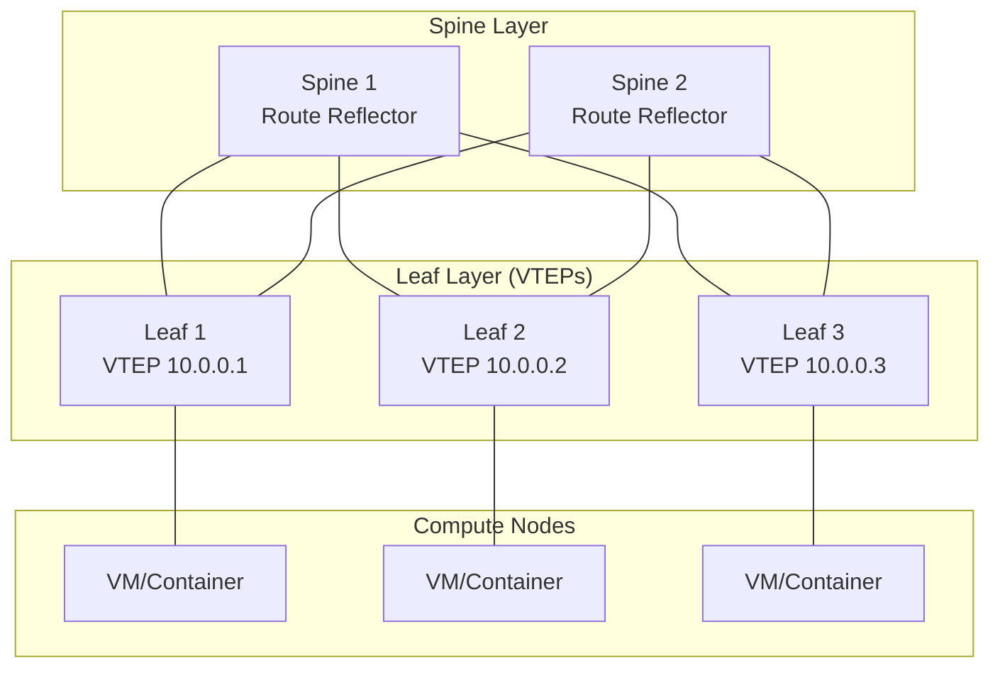
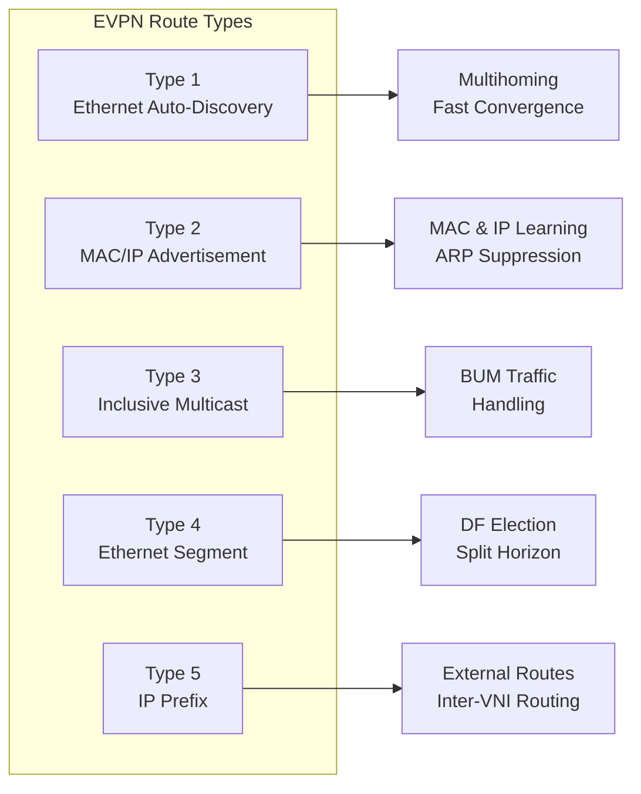
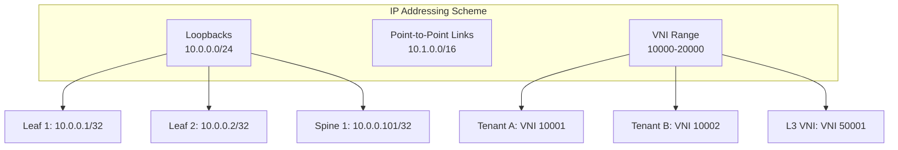
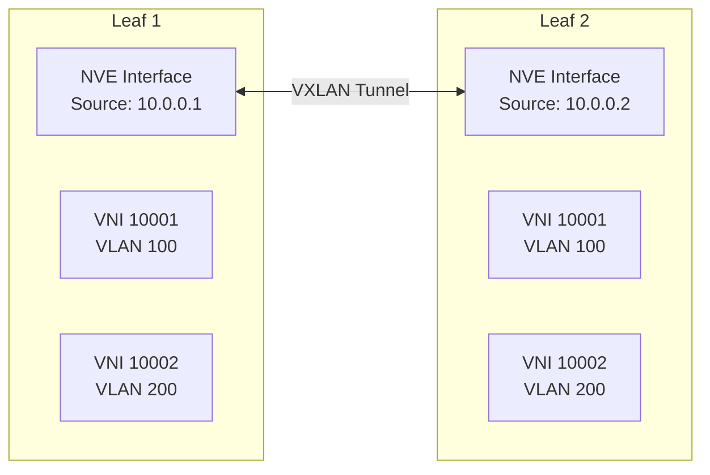
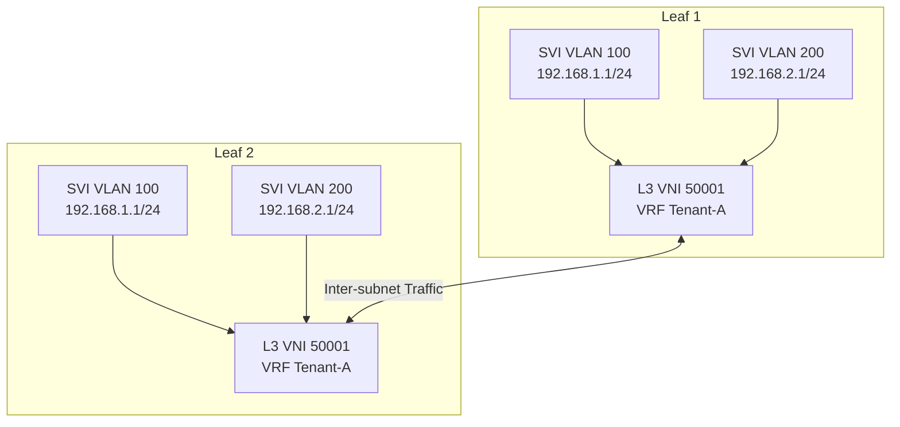
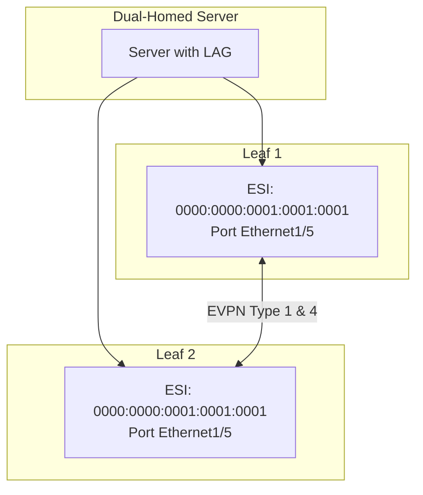

# How to Create EVPN Configuration

Author: [nawazdhandala](https://github.com/nawazdhandala)

Tags: EVPN, Networking, Data Center, BGP

Description: A comprehensive guide to configuring Ethernet VPN (EVPN) in modern data centers. Learn EVPN fundamentals, VXLAN integration, BGP configuration, and practical implementation patterns for Layer 2 and Layer 3 connectivity.

---

> EVPN has become the de facto standard for building scalable, multi-tenant data center networks. It combines the best of Layer 2 flexibility with Layer 3 scalability, enabling seamless workload mobility and efficient resource utilization across your infrastructure.

This guide walks you through EVPN configuration from fundamentals to production-ready implementations.

---

## What is EVPN?

EVPN (Ethernet Virtual Private Network) is a control plane technology defined in RFC 7432 that uses BGP to distribute MAC and IP address information across a network. When combined with VXLAN as the data plane, it provides:

- **MAC learning via control plane** - No flood-and-learn behavior
- **Active-active multihoming** - Redundant connections without spanning tree
- **Integrated routing and bridging** - Seamless Layer 2 and Layer 3 connectivity
- **Multi-tenancy** - Isolated virtual networks for different customers or applications



---

## EVPN Route Types

EVPN uses five route types to distribute different types of information. Understanding these is essential for troubleshooting and design.



| Route Type | Name | Purpose |
|------------|------|---------|
| Type 1 | Ethernet Auto-Discovery | Signals multihomed Ethernet Segments for fast failover |
| Type 2 | MAC/IP Advertisement | Advertises MAC addresses and associated IP addresses |
| Type 3 | Inclusive Multicast Ethernet Tag | Sets up BUM (Broadcast, Unknown unicast, Multicast) forwarding |
| Type 4 | Ethernet Segment | Elects Designated Forwarder for multihomed segments |
| Type 5 | IP Prefix | Advertises IP prefixes for inter-subnet routing |

---

## Prerequisites

Before configuring EVPN, ensure your network meets these requirements:

### Infrastructure Requirements

- Switches supporting EVPN and VXLAN (most modern data center switches)
- IP connectivity between all VTEP (VXLAN Tunnel Endpoint) loopback addresses
- BGP peering established (typically using spine switches as route reflectors)
- Consistent MTU configuration (minimum 1550 bytes, recommended 9000+ for jumbo frames)

### IP Addressing Plan



---

## Underlay Network Configuration

The underlay network provides IP connectivity between all VTEPs. We will use OSPF for simplicity, but eBGP is also common in large-scale deployments.

### Spine Switch Configuration

Configure the spine switch with OSPF and BGP route reflector functionality:

```
! Spine 1 Configuration
! Enable required features
nv overlay evpn
feature ospf
feature bgp
feature nv overlay

! Configure loopback for VTEP and BGP peering
interface loopback0
  description Router-ID and BGP peering
  ip address 10.0.0.101/32
  ip ospf network point-to-point
  ip router ospf UNDERLAY area 0.0.0.0

! Configure spine-to-leaf links
interface Ethernet1/1
  description To Leaf-1
  no switchport
  ip address 10.1.1.0/31
  ip ospf network point-to-point
  ip router ospf UNDERLAY area 0.0.0.0
  mtu 9216
  no shutdown

interface Ethernet1/2
  description To Leaf-2
  no switchport
  ip address 10.1.2.0/31
  ip ospf network point-to-point
  ip router ospf UNDERLAY area 0.0.0.0
  mtu 9216
  no shutdown

interface Ethernet1/3
  description To Leaf-3
  no switchport
  ip address 10.1.3.0/31
  ip ospf network point-to-point
  ip router ospf UNDERLAY area 0.0.0.0
  mtu 9216
  no shutdown

! OSPF configuration for underlay routing
router ospf UNDERLAY
  router-id 10.0.0.101
```

### Leaf Switch Configuration

Configure leaf switches with OSPF participation and VTEP loopbacks:

```
! Leaf 1 Configuration
! Enable required features
nv overlay evpn
feature ospf
feature bgp
feature nv overlay
feature vn-segment-vlan-based
feature interface-vlan

! Configure loopback for VTEP source
interface loopback0
  description Router-ID and VTEP source
  ip address 10.0.0.1/32
  ip ospf network point-to-point
  ip router ospf UNDERLAY area 0.0.0.0

! Configure leaf-to-spine uplinks
interface Ethernet1/49
  description To Spine-1
  no switchport
  ip address 10.1.1.1/31
  ip ospf network point-to-point
  ip router ospf UNDERLAY area 0.0.0.0
  mtu 9216
  no shutdown

interface Ethernet1/50
  description To Spine-2
  no switchport
  ip address 10.2.1.1/31
  ip ospf network point-to-point
  ip router ospf UNDERLAY area 0.0.0.0
  mtu 9216
  no shutdown

! OSPF configuration
router ospf UNDERLAY
  router-id 10.0.0.1
```

---

## BGP EVPN Configuration

BGP carries EVPN routes between VTEPs. The spine switches act as route reflectors to reduce the number of BGP sessions.

### Route Reflector Configuration (Spine)

Configure the spine as a BGP route reflector for EVPN address family:

```
! Spine 1 - BGP Route Reflector Configuration
router bgp 65000
  router-id 10.0.0.101

  ! BGP best practices for data center
  log-neighbor-changes
  bestpath as-path multipath-relax

  ! Define peer group for leaf switches
  template peer LEAF-PEERS
    remote-as 65000
    update-source loopback0
    address-family l2vpn evpn
      send-community extended
      route-reflector-client

  ! Leaf switch neighbors
  neighbor 10.0.0.1
    inherit peer LEAF-PEERS
    description Leaf-1

  neighbor 10.0.0.2
    inherit peer LEAF-PEERS
    description Leaf-2

  neighbor 10.0.0.3
    inherit peer LEAF-PEERS
    description Leaf-3
```

### Leaf Switch BGP Configuration

Configure leaf switches to peer with spine route reflectors:

```
! Leaf 1 - BGP Configuration
router bgp 65000
  router-id 10.0.0.1

  log-neighbor-changes
  bestpath as-path multipath-relax

  ! Define peer group for spine route reflectors
  template peer SPINE-RR
    remote-as 65000
    update-source loopback0
    address-family l2vpn evpn
      send-community extended

  ! Spine neighbors (route reflectors)
  neighbor 10.0.0.101
    inherit peer SPINE-RR
    description Spine-1-RR

  neighbor 10.0.0.102
    inherit peer SPINE-RR
    description Spine-2-RR
```

---

## VXLAN and NVE Configuration

Configure the Network Virtualization Edge (NVE) interface for VXLAN encapsulation:



### NVE Interface Configuration

```
! Leaf 1 - NVE Configuration
! The NVE interface is the VXLAN tunnel endpoint

interface nve1
  description VXLAN VTEP Interface
  no shutdown

  ! Use loopback0 as the source IP for VXLAN tunnels
  source-interface loopback0

  ! Enable BGP for host reachability (MAC/IP learning)
  host-reachability protocol bgp

  ! Map VNI 10001 to EVPN with multicast group
  member vni 10001
    ! Use ingress replication instead of multicast
    ingress-replication protocol bgp

  ! Map VNI 10002 to EVPN
  member vni 10002
    ingress-replication protocol bgp

  ! L3 VNI for inter-VXLAN routing
  member vni 50001 associate-vrf
```

---

## Layer 2 VNI Configuration

Layer 2 VNIs extend VLANs across the VXLAN fabric, providing MAC address mobility.

### VLAN to VNI Mapping

```
! Leaf 1 - Layer 2 VNI Configuration

! Create VLANs and map to VNIs
vlan 100
  name Tenant-A-Web
  vn-segment 10001

vlan 200
  name Tenant-A-App
  vn-segment 10002

vlan 300
  name Tenant-B-Web
  vn-segment 10003

! Configure EVPN for each VNI
evpn
  vni 10001 l2
    rd auto
    route-target import auto
    route-target export auto

  vni 10002 l2
    rd auto
    route-target import auto
    route-target export auto

  vni 10003 l2
    rd auto
    route-target import auto
    route-target export auto
```

### Host-Facing Interface Configuration

Configure access ports connecting to servers or hypervisors:

```
! Leaf 1 - Server-facing ports

interface Ethernet1/1
  description Server-1 Web Tier
  switchport
  switchport mode access
  switchport access vlan 100
  spanning-tree port type edge
  no shutdown

interface Ethernet1/2
  description Server-2 App Tier
  switchport
  switchport mode access
  switchport access vlan 200
  spanning-tree port type edge
  no shutdown

! Trunk port for hypervisor with multiple VLANs
interface Ethernet1/10
  description Hypervisor-1
  switchport
  switchport mode trunk
  switchport trunk allowed vlan 100,200,300
  spanning-tree port type edge trunk
  no shutdown
```

---

## Layer 3 VNI Configuration (Symmetric IRB)

Layer 3 VNIs enable routing between different VNIs using the symmetric IRB (Integrated Routing and Bridging) model.



### VRF Configuration

```
! Leaf 1 - VRF and L3 VNI Configuration

! Create tenant VRF with L3 VNI
vrf context Tenant-A
  vni 50001
  rd auto
  address-family ipv4 unicast
    route-target import auto
    route-target import auto evpn
    route-target export auto
    route-target export auto evpn

! VLAN for L3 VNI (transit VLAN)
vlan 3001
  name Tenant-A-L3VNI
  vn-segment 50001

! SVI for L3 VNI (no IP needed, used for routing)
interface Vlan3001
  description Tenant-A L3VNI
  no shutdown
  vrf member Tenant-A
  ip forward
```

### Anycast Gateway Configuration

Configure distributed anycast gateways for optimal traffic flow:

```
! Global anycast gateway MAC (same on all leaves)
fabric forwarding anycast-gateway-mac 0000.2222.3333

! SVI with anycast gateway for VLAN 100
interface Vlan100
  description Tenant-A Web Tier Gateway
  no shutdown
  vrf member Tenant-A
  ip address 192.168.1.1/24
  fabric forwarding mode anycast-gateway

! SVI with anycast gateway for VLAN 200
interface Vlan200
  description Tenant-A App Tier Gateway
  no shutdown
  vrf member Tenant-A
  ip address 192.168.2.1/24
  fabric forwarding mode anycast-gateway
```

### Update NVE for L3 VNI

```
! Add L3 VNI to NVE interface
interface nve1
  member vni 50001 associate-vrf
```

---

## Multi-Homing Configuration (EVPN-MH)

EVPN multi-homing provides active-active redundancy without spanning tree. This is achieved using Ethernet Segments (ES).



### Ethernet Segment Configuration

Configure the same Ethernet Segment Identifier (ESI) on both leaves:

```
! Leaf 1 - Ethernet Segment Configuration

interface Ethernet1/5
  description Dual-homed Server-1
  switchport
  switchport mode trunk
  switchport trunk allowed vlan 100,200

  ! Configure Ethernet Segment for EVPN multi-homing
  evpn ethernet-segment 1
    identifier 0000:0000:0001:0001:0001
    route-target 00:00:00:01:00:01

  ! Enable LACP for server-side LAG
  channel-group 5 mode active
  no shutdown

interface port-channel5
  description LAG to Dual-homed Server-1
  switchport
  switchport mode trunk
  switchport trunk allowed vlan 100,200

  ! Ethernet Segment on port-channel
  evpn ethernet-segment 1
    identifier 0000:0000:0001:0001:0001
    route-target 00:00:00:01:00:01

  no shutdown
```

```
! Leaf 2 - Matching Ethernet Segment Configuration

interface Ethernet1/5
  description Dual-homed Server-1
  switchport
  switchport mode trunk
  switchport trunk allowed vlan 100,200

  evpn ethernet-segment 1
    identifier 0000:0000:0001:0001:0001
    route-target 00:00:00:01:00:01

  channel-group 5 mode active
  no shutdown

interface port-channel5
  description LAG to Dual-homed Server-1
  switchport
  switchport mode trunk
  switchport trunk allowed vlan 100,200

  evpn ethernet-segment 1
    identifier 0000:0000:0001:0001:0001
    route-target 00:00:00:01:00:01

  no shutdown
```

---

## Verification Commands

Use these commands to verify your EVPN configuration is working correctly.

### BGP EVPN Neighbor Status

```bash
# Check BGP EVPN neighbor status
show bgp l2vpn evpn summary

# Expected output shows established sessions
Neighbor        V    AS    MsgRcvd  MsgSent  State/PfxRcd
10.0.0.101      4    65000    1542     1423    152
10.0.0.102      4    65000    1538     1419    152
```

### EVPN Route Types

```bash
# View all EVPN routes
show bgp l2vpn evpn

# View specific route type (Type 2 - MAC/IP)
show bgp l2vpn evpn route-type 2

# Example Type 2 route output
Route Distinguisher: 10.0.0.2:32867
*>i[2]:[0]:[0]:[48]:[aabb.cc00.0100]:[32]:[192.168.1.10]/272
                      10.0.0.2                      100      0 i
                      RT:65000:10001 ET:8
```

### NVE and VXLAN Status

```bash
# Check NVE interface status
show nve interface nve1

# Check NVE peers (remote VTEPs)
show nve peers

# Expected output shows peer VTEPs
Interface Peer-IP          State LearnType Uptime   Router-Mac
--------- ---------------  ----- --------- -------- -----------------
nve1      10.0.0.2         Up    CP        01:23:45 5002.0000.1b08
nve1      10.0.0.3         Up    CP        01:22:30 5003.0000.1b08

# Check VNI status
show nve vni

# Check VXLAN forwarding table
show l2route evpn mac all
```

### Ethernet Segment Verification

```bash
# Check Ethernet Segment status
show evpn ethernet-segment

# Expected output shows ESI and DF election
ESI: 0000.0000.0001.0001.0001
  Parent interface: port-channel5
  ES State: Up
  Port State: Up
  DF Election: Elected

# Check Designated Forwarder status
show evpn ethernet-segment esi 0000.0000.0001.0001.0001 detail
```

---

## Complete Configuration Example

Here is a complete leaf switch configuration bringing together all components:

```
! Complete Leaf 1 Configuration for EVPN VXLAN

! Enable features
nv overlay evpn
feature ospf
feature bgp
feature nv overlay
feature vn-segment-vlan-based
feature interface-vlan
feature lacp

! Anycast gateway MAC
fabric forwarding anycast-gateway-mac 0000.2222.3333

! VLANs with VNI mapping
vlan 100
  name Tenant-A-Web
  vn-segment 10001

vlan 200
  name Tenant-A-App
  vn-segment 10002

vlan 3001
  name Tenant-A-L3VNI
  vn-segment 50001

! VRF configuration
vrf context Tenant-A
  vni 50001
  rd auto
  address-family ipv4 unicast
    route-target import auto
    route-target import auto evpn
    route-target export auto
    route-target export auto evpn

! Loopback interface
interface loopback0
  ip address 10.0.0.1/32
  ip ospf network point-to-point
  ip router ospf UNDERLAY area 0.0.0.0

! Uplinks to spine
interface Ethernet1/49
  no switchport
  ip address 10.1.1.1/31
  ip ospf network point-to-point
  ip router ospf UNDERLAY area 0.0.0.0
  mtu 9216
  no shutdown

interface Ethernet1/50
  no switchport
  ip address 10.2.1.1/31
  ip ospf network point-to-point
  ip router ospf UNDERLAY area 0.0.0.0
  mtu 9216
  no shutdown

! NVE interface
interface nve1
  no shutdown
  source-interface loopback0
  host-reachability protocol bgp
  member vni 10001
    ingress-replication protocol bgp
  member vni 10002
    ingress-replication protocol bgp
  member vni 50001 associate-vrf

! SVIs
interface Vlan100
  no shutdown
  vrf member Tenant-A
  ip address 192.168.1.1/24
  fabric forwarding mode anycast-gateway

interface Vlan200
  no shutdown
  vrf member Tenant-A
  ip address 192.168.2.1/24
  fabric forwarding mode anycast-gateway

interface Vlan3001
  no shutdown
  vrf member Tenant-A
  ip forward

! Server-facing port
interface Ethernet1/1
  switchport
  switchport mode access
  switchport access vlan 100
  spanning-tree port type edge
  no shutdown

! OSPF
router ospf UNDERLAY
  router-id 10.0.0.1

! BGP
router bgp 65000
  router-id 10.0.0.1
  log-neighbor-changes

  template peer SPINE-RR
    remote-as 65000
    update-source loopback0
    address-family l2vpn evpn
      send-community extended

  neighbor 10.0.0.101
    inherit peer SPINE-RR
  neighbor 10.0.0.102
    inherit peer SPINE-RR

! EVPN configuration
evpn
  vni 10001 l2
    rd auto
    route-target import auto
    route-target export auto
  vni 10002 l2
    rd auto
    route-target import auto
    route-target export auto
```

---

## Troubleshooting Common Issues

### Issue: EVPN Routes Not Being Advertised

**Symptoms:** Hosts in the same VNI on different leaves cannot communicate.

**Diagnostic steps:**

```bash
# Check BGP session status
show bgp l2vpn evpn summary

# Verify NVE interface is up
show nve interface nve1

# Check if VNI is associated with NVE
show nve vni

# Verify route-target configuration
show bgp l2vpn evpn vni-id 10001
```

**Common causes:**
- BGP session not established (check IP connectivity and AS numbers)
- Route-target mismatch between leaves
- NVE interface not sourcing from correct loopback

### Issue: Asymmetric Routing Problems

**Symptoms:** Traffic works one direction but not the other, or intermittent connectivity.

**Diagnostic steps:**

```bash
# Check anycast gateway MAC consistency
show fabric forwarding anycast-gateway-mac

# Verify L3 VNI is configured identically on all leaves
show vrf Tenant-A

# Check route-target import/export for VRF
show bgp l2vpn evpn vrf Tenant-A
```

**Common causes:**
- Anycast gateway MAC not matching across leaves
- L3 VNI not configured on all leaves
- VRF route-target configuration mismatch

### Issue: Multi-Homing DF Election Failure

**Symptoms:** Traffic only flows through one leaf despite dual-homing.

**Diagnostic steps:**

```bash
# Check ES status and DF election
show evpn ethernet-segment detail

# Verify ESI matches on both leaves
show evpn ethernet-segment esi 0000.0000.0001.0001.0001

# Check Type 1 and Type 4 routes
show bgp l2vpn evpn route-type 1
show bgp l2vpn evpn route-type 4
```

**Common causes:**
- ESI mismatch between leaves
- Route-target for ES not matching
- BGP not advertising Type 1/Type 4 routes

---

## Best Practices

### Design Recommendations

1. **Use eBGP for large-scale deployments** - Each leaf has unique AS number, spines act as transit
2. **Plan VNI numbering carefully** - Use consistent scheme (e.g., L2 VNI 10xxx, L3 VNI 50xxx)
3. **Enable ARP suppression** - Reduces broadcast traffic in VXLAN fabric
4. **Use anycast gateways** - Provides optimal routing and eliminates hairpinning
5. **Implement proper MTU** - VXLAN adds 50 bytes overhead; plan accordingly

### Operational Guidelines

1. **Monitor BGP session health** - Set up alerts for session flaps
2. **Track MAC move events** - Frequent moves may indicate loops or misconfigurations
3. **Document ESI assignments** - Maintain inventory of Ethernet Segment Identifiers
4. **Test failover scenarios** - Regularly verify multi-homing works as expected
5. **Keep configurations synchronized** - Use automation to ensure leaf consistency

### Security Considerations

1. **Implement BGP authentication** - Use MD5 or TCP-AO for BGP sessions
2. **Filter EVPN routes** - Only accept routes with expected route-targets
3. **Secure management plane** - Use out-of-band management network
4. **Enable storm control** - Protect against broadcast storms in overlay

---

## Conclusion

EVPN with VXLAN provides a robust, scalable solution for modern data center networking. Key takeaways from this guide:

- **Control plane learning** eliminates flood-and-learn, improving efficiency
- **Anycast gateways** enable distributed routing with optimal traffic paths
- **Multi-homing with EVPN** replaces spanning tree for active-active redundancy
- **Symmetric IRB** provides consistent routing behavior across the fabric

Start with a simple Layer 2 VNI configuration, verify connectivity, then progressively add Layer 3 VNIs and multi-homing as needed. The modular nature of EVPN allows you to evolve your network architecture incrementally.

---

*Building a modern data center network? [OneUptime](https://oneuptime.com) provides comprehensive monitoring for your network infrastructure, with support for BGP session monitoring, interface health tracking, and custom alerting for EVPN fabrics.*
