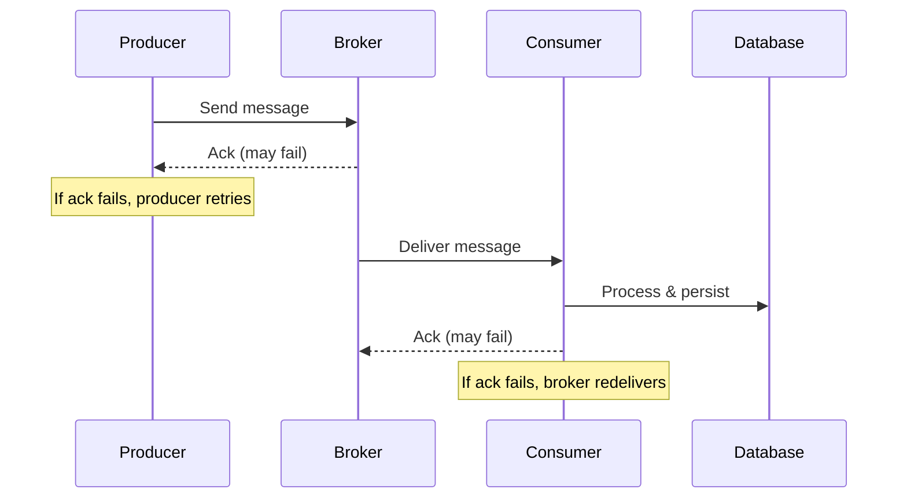
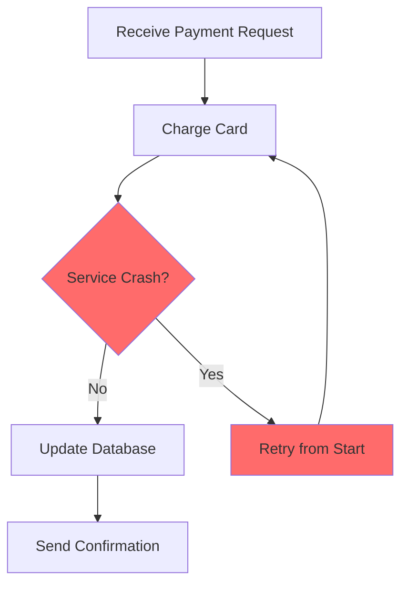
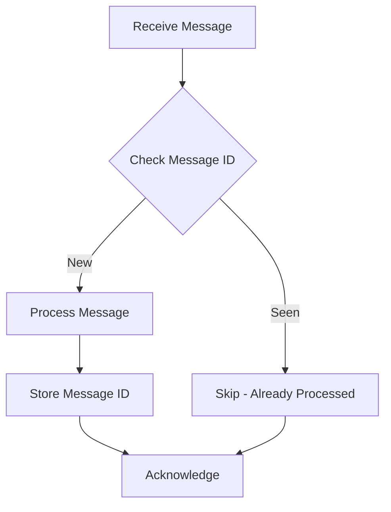
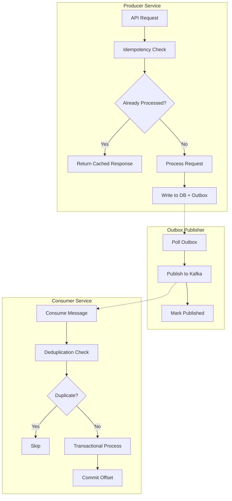

# How to Create Exactly-Once Delivery

Author: [nawazdhandala](https://github.com/nawazdhandala)

Tags: Event-Driven, Messaging, Transactions, Kafka

Description: Learn to implement exactly-once delivery semantics using idempotency and transactional processing patterns.

---

Distributed systems face a fundamental challenge: how do you ensure a message is processed exactly once? Network failures, service crashes, and retries can cause messages to be delivered multiple times or not at all. This guide covers practical patterns for achieving exactly-once semantics in production systems.

---

## Table of Contents

1. Understanding Delivery Guarantees
2. Why Exactly-Once Is Hard
3. Idempotency - The Foundation
4. The Outbox Pattern
5. Kafka Transactions
6. Deduplication Strategies
7. Putting It All Together

---

## 1. Understanding Delivery Guarantees

Message delivery in distributed systems falls into three categories:

| Guarantee | Description | Trade-off |
|-----------|-------------|-----------|
| At-most-once | Fire and forget - message may be lost | Fast, but unreliable |
| At-least-once | Retry until acknowledged - message may be duplicated | Reliable, but requires handling duplicates |
| Exactly-once | Message processed exactly one time | Most complex to implement |

True exactly-once delivery is technically impossible in a distributed system due to the Two Generals Problem. What we actually implement is "effectively exactly-once" - combining at-least-once delivery with idempotent processing.

The following diagram shows how messages flow through a typical system with potential failure points.



---

## 2. Why Exactly-Once Is Hard

Consider a payment processing scenario. A customer submits a payment, and the following sequence occurs:

1. Payment service receives the request
2. Charges the customer's card
3. Updates the database
4. Sends a confirmation event

If the service crashes after step 2 but before step 3, the retry will charge the customer again. This is the core problem.

The following diagram illustrates where failures can cause duplicate processing.



---

## 3. Idempotency - The Foundation

An idempotent operation produces the same result whether executed once or multiple times. This is the key to handling duplicates gracefully.

The following code demonstrates implementing idempotency using a unique key stored in a database.

```typescript
// idempotency-service.ts
import { Pool } from 'pg';

interface IdempotencyRecord {
  key: string;
  response: any;
  createdAt: Date;
}

export class IdempotencyService {
  constructor(private db: Pool) {}

  // Check if this operation was already processed
  async getExistingResult(key: string): Promise<IdempotencyRecord | null> {
    const result = await this.db.query(
      'SELECT key, response, created_at FROM idempotency_keys WHERE key = $1',
      [key]
    );
    return result.rows[0] || null;
  }

  // Store the result of a successful operation
  async storeResult(key: string, response: any): Promise<void> {
    await this.db.query(
      `INSERT INTO idempotency_keys (key, response, created_at)
       VALUES ($1, $2, NOW())
       ON CONFLICT (key) DO NOTHING`,
      [key, JSON.stringify(response)]
    );
  }

  // Execute an operation idempotently
  async executeIdempotent<T>(
    key: string,
    operation: () => Promise<T>
  ): Promise<T> {
    // Check for existing result first
    const existing = await this.getExistingResult(key);
    if (existing) {
      console.log(`Returning cached result for key: ${key}`);
      return JSON.parse(existing.response);
    }

    // Execute the operation
    const result = await operation();

    // Store the result for future duplicate requests
    await this.storeResult(key, result);

    return result;
  }
}
```

The database schema for storing idempotency keys requires a unique constraint and expiration strategy.

```sql
-- Schema for idempotency keys
CREATE TABLE idempotency_keys (
    key VARCHAR(255) PRIMARY KEY,
    response JSONB NOT NULL,
    created_at TIMESTAMP NOT NULL DEFAULT NOW()
);

-- Index for cleanup of old keys
CREATE INDEX idx_idempotency_created_at ON idempotency_keys(created_at);

-- Cleanup job runs periodically to remove keys older than 24 hours
DELETE FROM idempotency_keys WHERE created_at < NOW() - INTERVAL '24 hours';
```

---

## 4. The Outbox Pattern

The outbox pattern solves the dual-write problem - when you need to update a database AND publish an event atomically. Instead of publishing directly, you write the event to an outbox table in the same transaction as your business data.

The following diagram shows the outbox pattern flow.


The following code implements a complete outbox pattern with a publisher that polls for unpublished messages.

```typescript
// outbox-pattern.ts
import { Pool, PoolClient } from 'pg';
import { Kafka, Producer } from 'kafkajs';

interface OutboxMessage {
  id: string;
  aggregateType: string;
  aggregateId: string;
  eventType: string;
  payload: any;
}

export class OutboxService {
  private producer: Producer;

  constructor(private db: Pool, kafka: Kafka) {
    this.producer = kafka.producer();
  }

  // Write business data and event in a single transaction
  async processOrderWithEvent(
    orderId: string,
    orderData: any,
    client: PoolClient
  ): Promise<void> {
    // Update the order - this is your business logic
    await client.query(
      'UPDATE orders SET status = $1, updated_at = NOW() WHERE id = $2',
      [orderData.status, orderId]
    );

    // Write the event to the outbox table in the same transaction
    await client.query(
      `INSERT INTO outbox (id, aggregate_type, aggregate_id, event_type, payload, created_at)
       VALUES ($1, $2, $3, $4, $5, NOW())`,
      [
        crypto.randomUUID(),
        'Order',
        orderId,
        'OrderStatusChanged',
        JSON.stringify(orderData)
      ]
    );
  }

  // Background process that publishes outbox messages
  async publishOutboxMessages(): Promise<void> {
    const client = await this.db.connect();

    try {
      await client.query('BEGIN');

      // Select unpublished messages with a lock to prevent concurrent processing
      const result = await client.query(
        `SELECT id, aggregate_type, aggregate_id, event_type, payload
         FROM outbox
         WHERE published_at IS NULL
         ORDER BY created_at
         LIMIT 100
         FOR UPDATE SKIP LOCKED`
      );

      if (result.rows.length === 0) {
        await client.query('COMMIT');
        return;
      }

      // Publish each message to Kafka
      for (const row of result.rows) {
        await this.producer.send({
          topic: `${row.aggregate_type.toLowerCase()}-events`,
          messages: [{
            key: row.aggregate_id,
            value: JSON.stringify({
              eventType: row.event_type,
              aggregateId: row.aggregate_id,
              payload: row.payload,
              timestamp: new Date().toISOString()
            })
          }]
        });

        // Mark as published after successful send
        await client.query(
          'UPDATE outbox SET published_at = NOW() WHERE id = $1',
          [row.id]
        );
      }

      await client.query('COMMIT');
    } catch (error) {
      await client.query('ROLLBACK');
      throw error;
    } finally {
      client.release();
    }
  }
}
```

---

## 5. Kafka Transactions

Kafka provides built-in support for exactly-once semantics through transactional producers. This allows you to atomically write to multiple partitions and commit consumer offsets together.

| Feature | Purpose |
|---------|---------|
| Idempotent Producer | Prevents duplicate messages from producer retries |
| Transactional Producer | Atomic writes across partitions |
| read_committed | Consumers only see committed messages |

The following code shows how to configure and use Kafka transactions for exactly-once processing.

```typescript
// kafka-transactions.ts
import { Kafka, Producer, Consumer, EachMessagePayload } from 'kafkajs';

export class KafkaTransactionProcessor {
  private producer: Producer;
  private consumer: Consumer;

  constructor(private kafka: Kafka) {
    // Configure producer with idempotence and transactions enabled
    this.producer = kafka.producer({
      idempotent: true,
      transactionalId: 'order-processor-tx',
      maxInFlightRequests: 1
    });

    // Configure consumer to only read committed messages
    this.consumer = kafka.consumer({
      groupId: 'order-processor-group',
      readUncommitted: false  // This is the default - only read committed
    });
  }

  async initialize(): Promise<void> {
    await this.producer.connect();
    await this.consumer.connect();
    await this.consumer.subscribe({ topic: 'orders', fromBeginning: false });
  }

  // Process messages with exactly-once semantics
  async processWithTransaction(
    message: EachMessagePayload,
    processLogic: (payload: any) => Promise<any>
  ): Promise<void> {
    const transaction = await this.producer.transaction();

    try {
      const payload = JSON.parse(message.message.value?.toString() || '{}');

      // Execute business logic
      const result = await processLogic(payload);

      // Send result to output topic within the transaction
      await transaction.send({
        topic: 'order-results',
        messages: [{
          key: message.message.key,
          value: JSON.stringify(result)
        }]
      });

      // Commit consumer offset within the same transaction
      await transaction.sendOffsets({
        consumerGroupId: 'order-processor-group',
        topics: [{
          topic: message.topic,
          partitions: [{
            partition: message.partition,
            offset: (BigInt(message.message.offset) + 1n).toString()
          }]
        }]
      });

      // Commit the transaction - all or nothing
      await transaction.commit();
    } catch (error) {
      // Abort on any failure - no partial state
      await transaction.abort();
      throw error;
    }
  }

  async startProcessing(): Promise<void> {
    await this.consumer.run({
      eachMessage: async (payload) => {
        await this.processWithTransaction(payload, async (data) => {
          // Your business logic here
          console.log('Processing order:', data.orderId);
          return { processed: true, orderId: data.orderId };
        });
      }
    });
  }
}
```

---

## 6. Deduplication Strategies

Even with the patterns above, you may need explicit deduplication at the consumer level. Here are common strategies.

The following diagram shows the decision flow for handling potentially duplicate messages.



The following code implements a consumer with built-in deduplication using a sliding window of recently processed message IDs.

```typescript
// deduplication-consumer.ts
import { Redis } from 'ioredis';

export class DeduplicatingConsumer {
  // TTL for deduplication keys - adjust based on your retry window
  private readonly DEDUP_TTL_SECONDS = 3600;

  constructor(private redis: Redis) {}

  // Generate a deduplication key from the message
  private getDeduplicationKey(message: any): string {
    // Use a combination of fields that uniquely identify the message
    // This could be a message ID, or a hash of the payload
    return `dedup:${message.messageId || this.hashPayload(message)}`;
  }

  private hashPayload(payload: any): string {
    const crypto = require('crypto');
    return crypto
      .createHash('sha256')
      .update(JSON.stringify(payload))
      .digest('hex')
      .substring(0, 16);
  }

  // Process a message with deduplication
  async processWithDeduplication<T>(
    message: any,
    handler: (msg: any) => Promise<T>
  ): Promise<T | null> {
    const dedupKey = this.getDeduplicationKey(message);

    // Try to set the key - only succeeds if it doesn't exist
    const acquired = await this.redis.set(
      dedupKey,
      'processing',
      'EX', this.DEDUP_TTL_SECONDS,
      'NX'  // Only set if not exists
    );

    if (!acquired) {
      // Message was already processed or is being processed
      console.log(`Duplicate message detected: ${dedupKey}`);
      return null;
    }

    try {
      // Process the message
      const result = await handler(message);

      // Update the key to indicate successful processing
      await this.redis.set(
        dedupKey,
        'completed',
        'EX', this.DEDUP_TTL_SECONDS
      );

      return result;
    } catch (error) {
      // Remove the key so the message can be retried
      await this.redis.del(dedupKey);
      throw error;
    }
  }
}
```

---

## 7. Putting It All Together

A production-ready exactly-once system combines multiple patterns. The architecture looks like this.



Here is a summary of when to use each pattern.

| Pattern | Use When |
|---------|----------|
| Idempotency Keys | Handling API request retries |
| Outbox Pattern | Coordinating database updates with event publishing |
| Kafka Transactions | Processing messages and producing outputs atomically |
| Deduplication | Consumer-side protection against redelivery |

Key implementation guidelines:

- Always include a unique message ID or correlation ID in your events
- Set appropriate TTLs for idempotency and deduplication keys
- Monitor for duplicate rates - high rates indicate upstream issues
- Use dead letter queues for messages that fail repeatedly
- Test failure scenarios explicitly - kill services mid-transaction

---

## Summary

Exactly-once delivery in distributed systems requires a layered approach. At the producer level, use idempotency keys and the outbox pattern to prevent duplicate publishes. At the broker level, leverage Kafka transactions for atomic writes. At the consumer level, implement deduplication and idempotent handlers.

The goal is not to prevent duplicates entirely - that is impossible in a distributed system. The goal is to make your system behave correctly regardless of how many times a message is delivered.

---

**Related Reading:**

- [Traces and Spans in OpenTelemetry](/blog/post/2025-08-27-traces-and-spans-in-opentelemetry/view) - Monitor your message processing with distributed tracing
- [What is OpenTelemetry Collector](/blog/post/2025-09-18-what-is-opentelemetry-collector-and-why-use-one/view) - Collect telemetry from your event-driven architecture
