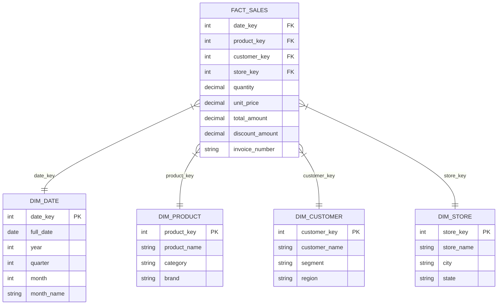
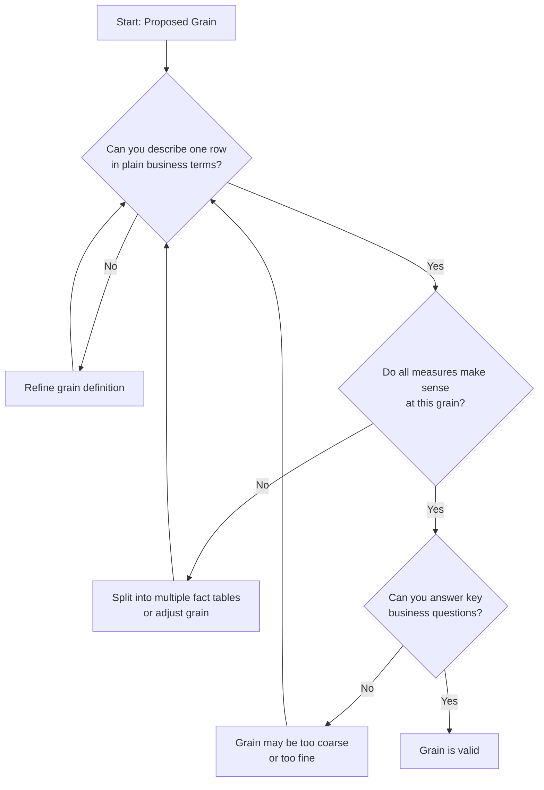
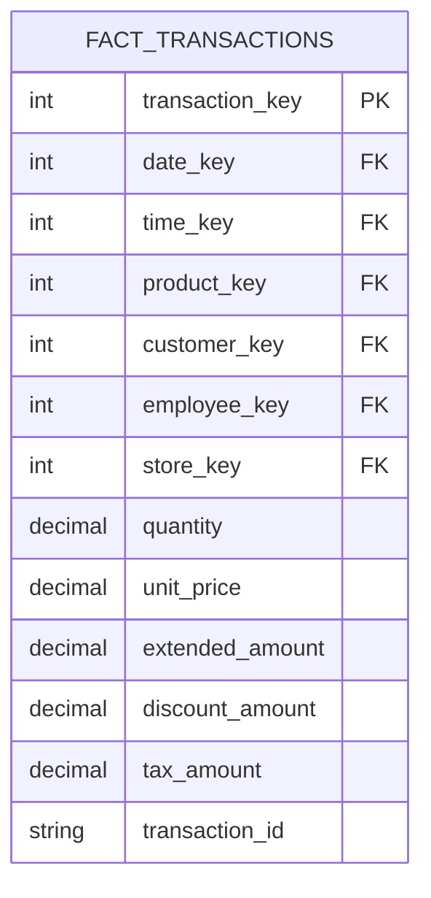
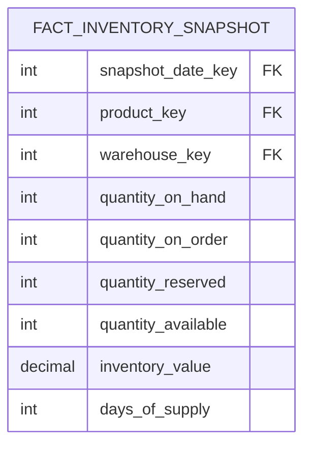
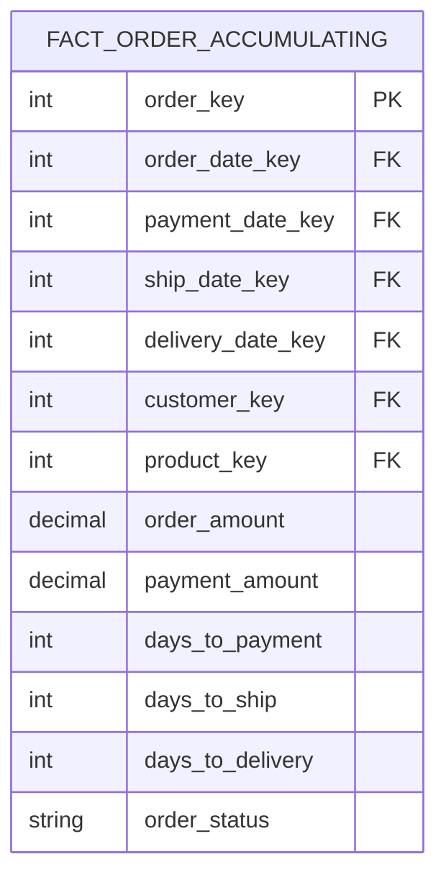
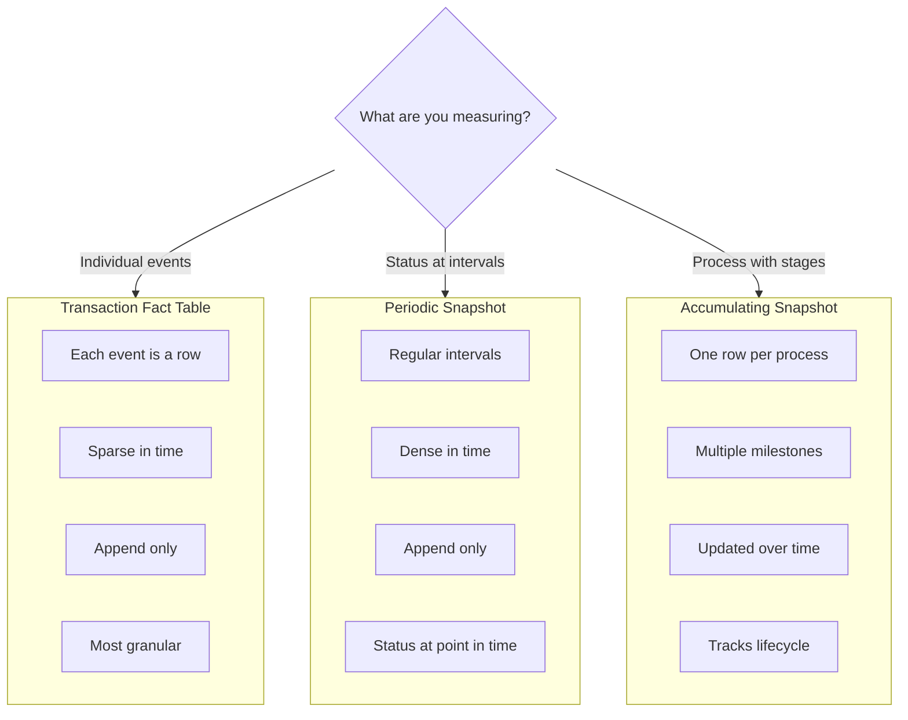
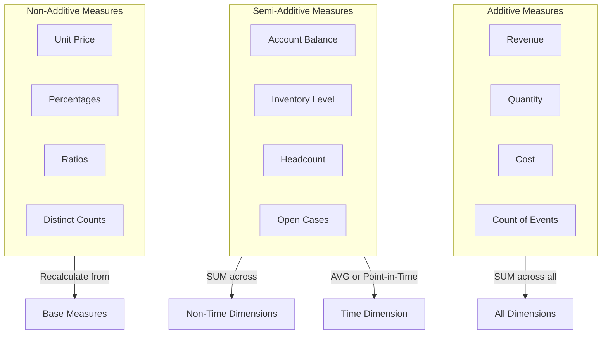
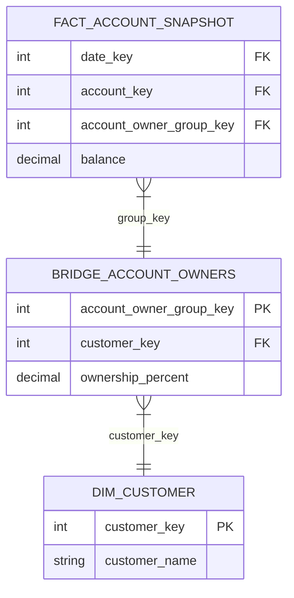
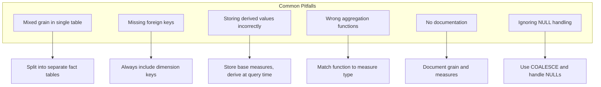
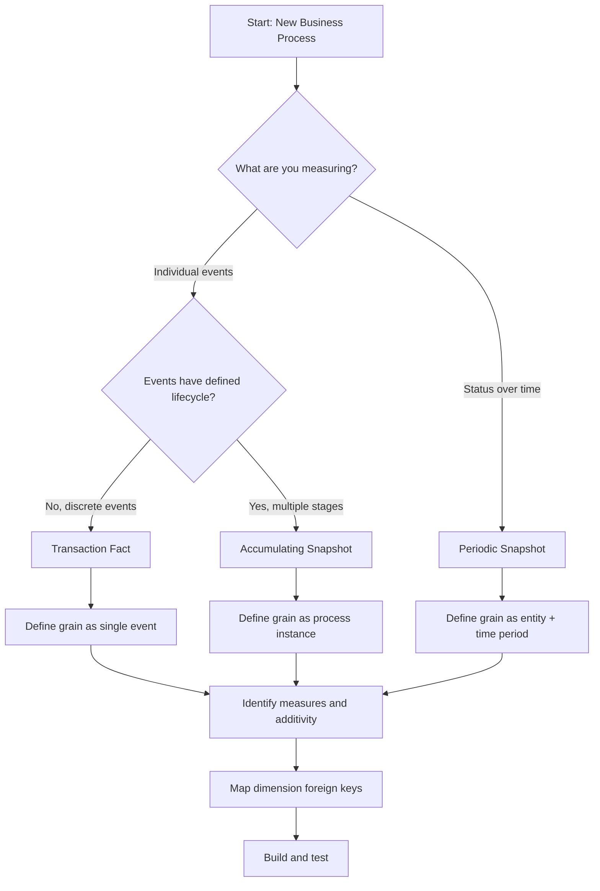

# How to Build Fact Table Design

Author: [nawazdhandala](https://github.com/nawazdhandala)

Tags: Data Warehouse, Dimensional Modeling, Fact Tables, Data Engineering

Description: Learn how to design fact tables for storing measurable business events.

---

Fact tables are the heart of any dimensional data warehouse. They store the measurable, quantitative data about business events that analysts need to answer critical questions. Whether you are tracking sales transactions, monitoring website activity, or measuring manufacturing output, understanding how to design fact tables properly is essential for building a performant and useful data warehouse.

This guide covers the three main types of fact tables, grain definition, measure additivity, and practical implementation patterns with code examples.

---

## Table of Contents

1. What is a Fact Table?
2. Grain Definition
3. Types of Fact Tables
4. Additive, Semi-Additive, and Non-Additive Measures
5. Fact Table Design Patterns
6. Implementing Fact Tables in SQL
7. Common Pitfalls and Best Practices
8. Putting It All Together

---

## 1. What is a Fact Table?

A fact table is a central table in a star or snowflake schema that contains:

- **Foreign keys** to dimension tables (who, what, when, where, why, how)
- **Measures** (numeric facts that can be aggregated)
- **Degenerate dimensions** (dimensional attributes stored directly in the fact table)



The fact table sits at the center of the star schema, connected to dimension tables that provide context for the numerical measurements.

---

## 2. Grain Definition

**Grain is the most critical decision in fact table design.** The grain defines what a single row in the fact table represents. Getting this wrong leads to incorrect aggregations, duplicated data, and confused analysts.

### Steps to Define Grain

1. **State the grain in business terms**: "One row per sales transaction line item"
2. **Identify the dimensionality**: Which dimensions naturally describe this grain?
3. **Validate with stakeholders**: Ensure the grain matches business questions
4. **Document explicitly**: Write it down and keep it visible

### Examples of Grain Statements

| Business Process | Grain Statement |
|-----------------|-----------------|
| Retail Sales | One row per transaction line item |
| Website Clicks | One row per page view event |
| Order Fulfillment | One row per order at each fulfillment milestone |
| Inventory | One row per product per warehouse per day |
| Employee Time | One row per employee per pay period |

### Grain Validation Checklist



### Common Grain Mistakes

1. **Too coarse**: Aggregating prematurely loses detail
2. **Too fine**: Excessive granularity bloats storage and slows queries
3. **Mixed grains**: Combining different grains in one table causes aggregation errors
4. **Undocumented grain**: Teams interpret rows differently

---

## 3. Types of Fact Tables

Dimensional modeling recognizes three primary types of fact tables, each suited to different analytical needs.

### 3.1 Transaction Fact Tables

Transaction fact tables capture individual business events at their atomic grain. Each row represents a discrete event that occurred at a specific point in time.

**Characteristics:**
- One row per event occurrence
- Sparse in time (rows only exist when events happen)
- Largest volume of data
- Most flexible for analysis

**Use Cases:**
- Point-of-sale transactions
- Website clickstream events
- Call center interactions
- Financial trades



**SQL Example:**

```sql
-- Transaction fact table: One row per sales line item
-- Grain: Individual product sale within a transaction

CREATE TABLE fact_sales_transaction (
    -- Surrogate key for the fact row
    transaction_line_key    BIGINT GENERATED ALWAYS AS IDENTITY PRIMARY KEY,

    -- Foreign keys to dimension tables
    date_key               INT NOT NULL REFERENCES dim_date(date_key),
    time_key               INT NOT NULL REFERENCES dim_time(time_key),
    product_key            INT NOT NULL REFERENCES dim_product(product_key),
    customer_key           INT NOT NULL REFERENCES dim_customer(customer_key),
    employee_key           INT NOT NULL REFERENCES dim_employee(employee_key),
    store_key              INT NOT NULL REFERENCES dim_store(store_key),
    promotion_key          INT REFERENCES dim_promotion(promotion_key),

    -- Measures: All additive across all dimensions
    quantity               DECIMAL(10,2) NOT NULL,
    unit_price             DECIMAL(10,2) NOT NULL,
    extended_amount        DECIMAL(12,2) NOT NULL,
    discount_amount        DECIMAL(10,2) DEFAULT 0,
    tax_amount             DECIMAL(10,2) DEFAULT 0,
    net_amount             DECIMAL(12,2) NOT NULL,

    -- Degenerate dimension: No separate dimension table needed
    transaction_id         VARCHAR(50) NOT NULL,
    line_number            INT NOT NULL,

    -- Audit columns
    created_at             TIMESTAMP DEFAULT CURRENT_TIMESTAMP
);

-- Indexes for common query patterns
CREATE INDEX idx_fact_sales_date ON fact_sales_transaction(date_key);
CREATE INDEX idx_fact_sales_product ON fact_sales_transaction(product_key);
CREATE INDEX idx_fact_sales_customer ON fact_sales_transaction(customer_key);
CREATE INDEX idx_fact_sales_store ON fact_sales_transaction(store_key);

-- Composite index for common filter combinations
CREATE INDEX idx_fact_sales_date_store ON fact_sales_transaction(date_key, store_key);
```

### 3.2 Periodic Snapshot Fact Tables

Periodic snapshot fact tables capture the state of a measurement at regular, predictable intervals. Instead of recording individual events, they take a "photograph" of cumulative or status metrics at the end of each period.

**Characteristics:**
- One row per entity per time period
- Dense in time (rows exist for every period)
- Predictable row counts
- Ideal for trending and comparison

**Use Cases:**
- Daily inventory levels
- Monthly account balances
- Weekly sales quotas vs. actuals
- Daily website traffic summaries



**SQL Example:**

```sql
-- Periodic snapshot fact table: Daily inventory levels
-- Grain: One row per product per warehouse per day

CREATE TABLE fact_inventory_daily_snapshot (
    -- Composite primary key defines the grain
    snapshot_date_key      INT NOT NULL REFERENCES dim_date(date_key),
    product_key            INT NOT NULL REFERENCES dim_product(product_key),
    warehouse_key          INT NOT NULL REFERENCES dim_warehouse(warehouse_key),

    -- Semi-additive measures: Additive across products and warehouses
    -- but NOT across time (cannot sum balances across days)
    quantity_on_hand       INT NOT NULL,
    quantity_on_order      INT NOT NULL,
    quantity_reserved      INT NOT NULL,
    quantity_available     INT NOT NULL,  -- Computed: on_hand - reserved

    -- Financial measures
    unit_cost              DECIMAL(10,2) NOT NULL,
    inventory_value        DECIMAL(14,2) NOT NULL,  -- quantity * unit_cost

    -- Derived metrics
    days_of_supply         INT,
    reorder_point          INT,
    is_below_safety_stock  BOOLEAN DEFAULT FALSE,

    -- Audit
    snapshot_timestamp     TIMESTAMP DEFAULT CURRENT_TIMESTAMP,

    PRIMARY KEY (snapshot_date_key, product_key, warehouse_key)
);

-- Index for time-series analysis
CREATE INDEX idx_inventory_snapshot_date ON fact_inventory_daily_snapshot(snapshot_date_key);

-- Index for product-level analysis
CREATE INDEX idx_inventory_snapshot_product ON fact_inventory_daily_snapshot(product_key);

-- ETL procedure to populate daily snapshot
CREATE OR REPLACE PROCEDURE sp_load_inventory_snapshot(p_snapshot_date DATE)
LANGUAGE plpgsql
AS $$
DECLARE
    v_date_key INT;
BEGIN
    -- Get the date key for the snapshot date
    SELECT date_key INTO v_date_key
    FROM dim_date
    WHERE full_date = p_snapshot_date;

    -- Insert snapshot data from operational inventory system
    INSERT INTO fact_inventory_daily_snapshot (
        snapshot_date_key,
        product_key,
        warehouse_key,
        quantity_on_hand,
        quantity_on_order,
        quantity_reserved,
        quantity_available,
        unit_cost,
        inventory_value,
        days_of_supply
    )
    SELECT
        v_date_key,
        p.product_key,
        w.warehouse_key,
        inv.qty_on_hand,
        inv.qty_on_order,
        inv.qty_reserved,
        inv.qty_on_hand - inv.qty_reserved,
        inv.unit_cost,
        inv.qty_on_hand * inv.unit_cost,
        -- Calculate days of supply based on average daily usage
        CASE
            WHEN COALESCE(usage.avg_daily_usage, 0) > 0
            THEN FLOOR(inv.qty_on_hand / usage.avg_daily_usage)
            ELSE NULL
        END
    FROM operational.inventory inv
    JOIN dim_product p ON inv.product_id = p.product_id
    JOIN dim_warehouse w ON inv.warehouse_id = w.warehouse_id
    LEFT JOIN (
        -- Calculate average daily usage over last 30 days
        SELECT
            product_key,
            warehouse_key,
            AVG(quantity_sold) as avg_daily_usage
        FROM fact_sales_daily_summary
        WHERE date_key >= v_date_key - 30
        GROUP BY product_key, warehouse_key
    ) usage ON p.product_key = usage.product_key
           AND w.warehouse_key = usage.warehouse_key
    WHERE inv.snapshot_date = p_snapshot_date;

    COMMIT;
END;
$$;
```

### 3.3 Accumulating Snapshot Fact Tables

Accumulating snapshot fact tables track the complete lifecycle of a process or workflow with a defined beginning and end. They are updated as the entity moves through various milestones.

**Characteristics:**
- One row per entity (order, claim, loan, etc.)
- Rows are updated as milestones are reached
- Multiple date foreign keys (one per milestone)
- Captures lag times between stages

**Use Cases:**
- Order fulfillment pipelines
- Insurance claim processing
- Loan application workflows
- Manufacturing production cycles
- Support ticket resolution



**SQL Example:**

```sql
-- Accumulating snapshot fact table: Order fulfillment pipeline
-- Grain: One row per order, updated as order progresses through stages

CREATE TABLE fact_order_fulfillment (
    -- Primary key
    order_key              BIGINT GENERATED ALWAYS AS IDENTITY PRIMARY KEY,

    -- Natural key from source system
    order_id               VARCHAR(50) NOT NULL UNIQUE,

    -- Milestone date keys: Populated as each stage is reached
    order_date_key         INT NOT NULL REFERENCES dim_date(date_key),
    payment_date_key       INT REFERENCES dim_date(date_key),
    picking_date_key       INT REFERENCES dim_date(date_key),
    packing_date_key       INT REFERENCES dim_date(date_key),
    ship_date_key          INT REFERENCES dim_date(date_key),
    delivery_date_key      INT REFERENCES dim_date(date_key),
    return_date_key        INT REFERENCES dim_date(date_key),

    -- Role-playing dimension keys
    customer_key           INT NOT NULL REFERENCES dim_customer(customer_key),
    ship_to_customer_key   INT REFERENCES dim_customer(customer_key),
    product_key            INT NOT NULL REFERENCES dim_product(product_key),
    warehouse_key          INT REFERENCES dim_warehouse(warehouse_key),
    carrier_key            INT REFERENCES dim_carrier(carrier_key),

    -- Additive measures
    quantity_ordered       INT NOT NULL,
    quantity_shipped       INT DEFAULT 0,
    quantity_returned      INT DEFAULT 0,
    order_amount           DECIMAL(12,2) NOT NULL,
    shipping_cost          DECIMAL(10,2) DEFAULT 0,
    tax_amount             DECIMAL(10,2) DEFAULT 0,
    total_amount           DECIMAL(12,2) NOT NULL,

    -- Lag measures: Calculated duration between milestones
    days_order_to_payment  INT,
    days_payment_to_pick   INT,
    days_pick_to_pack      INT,
    days_pack_to_ship      INT,
    days_ship_to_delivery  INT,
    days_order_to_delivery INT,  -- Total fulfillment time

    -- Status tracking
    order_status           VARCHAR(20) NOT NULL DEFAULT 'ORDERED',
    is_on_time             BOOLEAN,
    promised_delivery_date_key INT REFERENCES dim_date(date_key),

    -- Audit columns
    created_at             TIMESTAMP DEFAULT CURRENT_TIMESTAMP,
    updated_at             TIMESTAMP DEFAULT CURRENT_TIMESTAMP
);

-- Indexes for common access patterns
CREATE INDEX idx_order_fulfillment_order_date ON fact_order_fulfillment(order_date_key);
CREATE INDEX idx_order_fulfillment_status ON fact_order_fulfillment(order_status);
CREATE INDEX idx_order_fulfillment_customer ON fact_order_fulfillment(customer_key);

-- ETL procedure to update accumulating snapshot
CREATE OR REPLACE PROCEDURE sp_update_order_fulfillment(
    p_order_id VARCHAR(50),
    p_milestone VARCHAR(20),
    p_milestone_date DATE
)
LANGUAGE plpgsql
AS $$
DECLARE
    v_date_key INT;
    v_order_date_key INT;
BEGIN
    -- Get the date key for the milestone date
    SELECT date_key INTO v_date_key
    FROM dim_date
    WHERE full_date = p_milestone_date;

    -- Get the original order date key for lag calculations
    SELECT order_date_key INTO v_order_date_key
    FROM fact_order_fulfillment
    WHERE order_id = p_order_id;

    -- Update the appropriate milestone based on the stage
    CASE p_milestone
        WHEN 'PAYMENT' THEN
            UPDATE fact_order_fulfillment
            SET payment_date_key = v_date_key,
                days_order_to_payment = v_date_key - order_date_key,
                order_status = 'PAID',
                updated_at = CURRENT_TIMESTAMP
            WHERE order_id = p_order_id;

        WHEN 'PICKING' THEN
            UPDATE fact_order_fulfillment
            SET picking_date_key = v_date_key,
                days_payment_to_pick = v_date_key - payment_date_key,
                order_status = 'PICKING',
                updated_at = CURRENT_TIMESTAMP
            WHERE order_id = p_order_id;

        WHEN 'PACKING' THEN
            UPDATE fact_order_fulfillment
            SET packing_date_key = v_date_key,
                days_pick_to_pack = v_date_key - picking_date_key,
                order_status = 'PACKING',
                updated_at = CURRENT_TIMESTAMP
            WHERE order_id = p_order_id;

        WHEN 'SHIPPED' THEN
            UPDATE fact_order_fulfillment
            SET ship_date_key = v_date_key,
                days_pack_to_ship = v_date_key - packing_date_key,
                order_status = 'SHIPPED',
                updated_at = CURRENT_TIMESTAMP
            WHERE order_id = p_order_id;

        WHEN 'DELIVERED' THEN
            UPDATE fact_order_fulfillment
            SET delivery_date_key = v_date_key,
                days_ship_to_delivery = v_date_key - ship_date_key,
                days_order_to_delivery = v_date_key - order_date_key,
                order_status = 'DELIVERED',
                is_on_time = (v_date_key <= promised_delivery_date_key),
                updated_at = CURRENT_TIMESTAMP
            WHERE order_id = p_order_id;
    END CASE;

    COMMIT;
END;
$$;
```

### Comparison of Fact Table Types



| Characteristic | Transaction | Periodic Snapshot | Accumulating Snapshot |
|---------------|-------------|-------------------|----------------------|
| **Grain** | One event | One period per entity | One process lifecycle |
| **Row Creation** | Insert only | Insert each period | Insert once, update |
| **Time Density** | Sparse | Dense | Sparse |
| **Date Keys** | Single | Single | Multiple milestones |
| **Primary Use** | Event analysis | Trending, comparison | Pipeline analysis |
| **Example** | Sales receipt | Daily inventory | Order fulfillment |

---

## 4. Additive, Semi-Additive, and Non-Additive Measures

Understanding measure additivity is crucial for correct aggregations. Using the wrong aggregation function produces misleading results.

### Additive Measures

Additive measures can be summed across ALL dimensions. They are the most useful and flexible type of measure.

**Examples:**
- Sales amount
- Quantity sold
- Discount amount
- Number of transactions
- Miles driven
- Hours worked

```sql
-- Additive measure example: Total sales by region and product
-- Safe to SUM across any dimension combination

SELECT
    r.region_name,
    p.category,
    SUM(f.quantity) AS total_quantity,           -- Additive
    SUM(f.extended_amount) AS total_sales,       -- Additive
    SUM(f.discount_amount) AS total_discounts    -- Additive
FROM fact_sales_transaction f
JOIN dim_date d ON f.date_key = d.date_key
JOIN dim_product p ON f.product_key = p.product_key
JOIN dim_store s ON f.store_key = s.store_key
JOIN dim_region r ON s.region_key = r.region_key
WHERE d.year = 2024
GROUP BY r.region_name, p.category
ORDER BY total_sales DESC;
```

### Semi-Additive Measures

Semi-additive measures can be summed across SOME dimensions but not across time. These typically represent balances or levels.

**Examples:**
- Account balance
- Inventory quantity
- Headcount
- Open tickets count
- Available capacity

```sql
-- Semi-additive measure example: Inventory analysis
-- Can SUM across products and warehouses, but NOT across dates

-- CORRECT: Sum inventory across warehouses for a specific date
SELECT
    d.full_date,
    p.category,
    SUM(f.quantity_on_hand) AS total_quantity,     -- Sum across warehouses
    SUM(f.inventory_value) AS total_value
FROM fact_inventory_daily_snapshot f
JOIN dim_date d ON f.snapshot_date_key = d.date_key
JOIN dim_product p ON f.product_key = p.product_key
WHERE d.full_date = '2024-01-15'
GROUP BY d.full_date, p.category;

-- WRONG: This would double-count inventory across days
-- SELECT SUM(quantity_on_hand) FROM fact_inventory_daily_snapshot;

-- CORRECT: For time-series, use AVG or specific point-in-time
SELECT
    d.month_name,
    d.year,
    -- Use the last day of each month for balance reporting
    SUM(f.quantity_on_hand) FILTER (
        WHERE d.is_last_day_of_month = TRUE
    ) AS month_end_quantity,
    -- Or use average for trending
    AVG(f.quantity_on_hand) AS avg_daily_quantity
FROM fact_inventory_daily_snapshot f
JOIN dim_date d ON f.snapshot_date_key = d.date_key
JOIN dim_product p ON f.product_key = p.product_key
WHERE d.year = 2024
GROUP BY d.month_name, d.year, d.month
ORDER BY d.month;
```

### Non-Additive Measures

Non-additive measures cannot be summed across ANY dimension. They require special aggregation functions.

**Examples:**
- Unit price
- Ratios and percentages
- Averages (already aggregated)
- Distinct counts

```sql
-- Non-additive measure example: Margin percentages
-- Cannot sum percentages - must recalculate from components

-- WRONG: Summing or averaging percentages
-- SELECT AVG(margin_percent) -- Misleading!

-- CORRECT: Calculate from additive components
SELECT
    p.category,
    SUM(f.extended_amount) AS total_revenue,
    SUM(f.cost_amount) AS total_cost,
    -- Recalculate percentage from sums
    ROUND(
        (SUM(f.extended_amount) - SUM(f.cost_amount)) /
        NULLIF(SUM(f.extended_amount), 0) * 100,
        2
    ) AS margin_percent
FROM fact_sales_transaction f
JOIN dim_product p ON f.product_key = p.product_key
GROUP BY p.category;

-- For distinct counts, use appropriate functions
SELECT
    d.month_name,
    COUNT(DISTINCT f.customer_key) AS unique_customers,  -- Non-additive
    COUNT(*) AS total_transactions,                       -- Additive
    SUM(f.extended_amount) AS total_sales                -- Additive
FROM fact_sales_transaction f
JOIN dim_date d ON f.date_key = d.date_key
WHERE d.year = 2024
GROUP BY d.month_name, d.month
ORDER BY d.month;
```

### Measure Additivity Reference



---

## 5. Fact Table Design Patterns

### Factless Fact Tables

Factless fact tables record events or relationships without numeric measures. They capture "something happened" or "these things are related."

**Use Cases:**
- Student attendance (student was present)
- Product promotions (which products were on promotion)
- Coverage tables (which products a salesperson can sell)

```sql
-- Factless fact table: Student attendance
-- Grain: One row per student per class session attended

CREATE TABLE fact_student_attendance (
    attendance_key         BIGINT GENERATED ALWAYS AS IDENTITY PRIMARY KEY,
    date_key               INT NOT NULL REFERENCES dim_date(date_key),
    time_key               INT NOT NULL REFERENCES dim_time(time_key),
    student_key            INT NOT NULL REFERENCES dim_student(student_key),
    class_key              INT NOT NULL REFERENCES dim_class(class_key),
    instructor_key         INT NOT NULL REFERENCES dim_instructor(instructor_key),
    room_key               INT NOT NULL REFERENCES dim_room(room_key),

    -- Optional: Add a count of 1 for easier aggregation
    attendance_count       INT DEFAULT 1,

    UNIQUE (date_key, time_key, student_key, class_key)
);

-- Query: Find students who were absent (not in attendance fact)
SELECT
    s.student_name,
    c.class_name,
    d.full_date
FROM dim_student s
CROSS JOIN dim_class c
CROSS JOIN dim_date d
LEFT JOIN fact_student_attendance f
    ON s.student_key = f.student_key
    AND c.class_key = f.class_key
    AND d.date_key = f.date_key
WHERE f.attendance_key IS NULL
  AND d.full_date BETWEEN '2024-01-01' AND '2024-01-31'
  AND d.is_school_day = TRUE;
```

### Consolidated Fact Tables

When multiple business processes share the same grain, consider a consolidated fact table to simplify queries and improve performance.

```sql
-- Consolidated fact table: Combines actuals and forecasts
-- Grain: One row per product per store per day

CREATE TABLE fact_sales_consolidated (
    date_key               INT NOT NULL REFERENCES dim_date(date_key),
    product_key            INT NOT NULL REFERENCES dim_product(product_key),
    store_key              INT NOT NULL REFERENCES dim_store(store_key),

    -- Actual measures (from transaction fact)
    actual_quantity        DECIMAL(10,2) DEFAULT 0,
    actual_amount          DECIMAL(12,2) DEFAULT 0,
    actual_transaction_count INT DEFAULT 0,

    -- Forecast measures (from planning system)
    forecast_quantity      DECIMAL(10,2) DEFAULT 0,
    forecast_amount        DECIMAL(12,2) DEFAULT 0,

    -- Variance calculations (derived)
    quantity_variance      DECIMAL(10,2) GENERATED ALWAYS AS
                          (actual_quantity - forecast_quantity) STORED,
    amount_variance        DECIMAL(12,2) GENERATED ALWAYS AS
                          (actual_amount - forecast_amount) STORED,

    PRIMARY KEY (date_key, product_key, store_key)
);

-- Query: Actual vs Forecast analysis
SELECT
    d.month_name,
    p.category,
    SUM(f.actual_amount) AS actual_sales,
    SUM(f.forecast_amount) AS forecast_sales,
    SUM(f.amount_variance) AS total_variance,
    ROUND(
        SUM(f.actual_amount) / NULLIF(SUM(f.forecast_amount), 0) * 100,
        1
    ) AS achievement_percent
FROM fact_sales_consolidated f
JOIN dim_date d ON f.date_key = d.date_key
JOIN dim_product p ON f.product_key = p.product_key
WHERE d.year = 2024
GROUP BY d.month_name, d.month, p.category
ORDER BY d.month, p.category;
```

### Bridge Tables for Multi-Valued Dimensions

When a fact can have multiple values for a dimension (e.g., an account with multiple owners), use a bridge table.



```sql
-- Bridge table for multi-valued dimension
CREATE TABLE bridge_account_owners (
    account_owner_group_key INT NOT NULL,
    customer_key            INT NOT NULL REFERENCES dim_customer(customer_key),
    ownership_percent       DECIMAL(5,2) NOT NULL,
    is_primary_owner        BOOLEAN DEFAULT FALSE,

    PRIMARY KEY (account_owner_group_key, customer_key),
    CHECK (ownership_percent > 0 AND ownership_percent <= 100)
);

-- Query: Allocate account balance to owners
SELECT
    c.customer_name,
    c.customer_segment,
    SUM(f.balance * b.ownership_percent / 100) AS allocated_balance
FROM fact_account_snapshot f
JOIN bridge_account_owners b ON f.account_owner_group_key = b.account_owner_group_key
JOIN dim_customer c ON b.customer_key = c.customer_key
JOIN dim_date d ON f.date_key = d.date_key
WHERE d.full_date = '2024-01-31'
GROUP BY c.customer_key, c.customer_name, c.customer_segment
ORDER BY allocated_balance DESC;
```

---

## 6. Implementing Fact Tables in SQL

### Complete Example: E-Commerce Data Warehouse

```sql
-- =====================================================
-- E-COMMERCE DATA WAREHOUSE: FACT TABLE IMPLEMENTATION
-- =====================================================

-- Dimension tables (simplified for brevity)

CREATE TABLE dim_date (
    date_key               INT PRIMARY KEY,
    full_date              DATE NOT NULL UNIQUE,
    year                   INT NOT NULL,
    quarter                INT NOT NULL,
    month                  INT NOT NULL,
    month_name             VARCHAR(20) NOT NULL,
    week                   INT NOT NULL,
    day_of_week            INT NOT NULL,
    day_name               VARCHAR(20) NOT NULL,
    is_weekend             BOOLEAN NOT NULL,
    is_holiday             BOOLEAN DEFAULT FALSE,
    is_last_day_of_month   BOOLEAN DEFAULT FALSE
);

CREATE TABLE dim_product (
    product_key            INT PRIMARY KEY,
    product_id             VARCHAR(50) NOT NULL,
    product_name           VARCHAR(200) NOT NULL,
    category               VARCHAR(100),
    subcategory            VARCHAR(100),
    brand                  VARCHAR(100),
    unit_cost              DECIMAL(10,2),
    unit_price             DECIMAL(10,2),
    is_active              BOOLEAN DEFAULT TRUE,
    effective_date         DATE NOT NULL,
    expiration_date        DATE DEFAULT '9999-12-31'
);

CREATE TABLE dim_customer (
    customer_key           INT PRIMARY KEY,
    customer_id            VARCHAR(50) NOT NULL,
    customer_name          VARCHAR(200),
    email                  VARCHAR(200),
    segment                VARCHAR(50),
    city                   VARCHAR(100),
    state                  VARCHAR(50),
    country                VARCHAR(50),
    registration_date      DATE,
    is_active              BOOLEAN DEFAULT TRUE
);

-- =====================================================
-- TRANSACTION FACT TABLE
-- =====================================================

CREATE TABLE fact_order_lines (
    -- Surrogate key
    order_line_key         BIGINT GENERATED ALWAYS AS IDENTITY PRIMARY KEY,

    -- Foreign keys
    order_date_key         INT NOT NULL REFERENCES dim_date(date_key),
    product_key            INT NOT NULL REFERENCES dim_product(product_key),
    customer_key           INT NOT NULL REFERENCES dim_customer(customer_key),

    -- Degenerate dimensions
    order_id               VARCHAR(50) NOT NULL,
    line_number            INT NOT NULL,

    -- Additive measures
    quantity               INT NOT NULL,
    unit_price             DECIMAL(10,2) NOT NULL,
    unit_cost              DECIMAL(10,2) NOT NULL,
    gross_amount           DECIMAL(12,2) NOT NULL,
    discount_amount        DECIMAL(10,2) DEFAULT 0,
    tax_amount             DECIMAL(10,2) DEFAULT 0,
    net_amount             DECIMAL(12,2) NOT NULL,
    profit_amount          DECIMAL(12,2) NOT NULL,

    -- Audit
    etl_batch_id           INT,
    created_at             TIMESTAMP DEFAULT CURRENT_TIMESTAMP,

    -- Ensure uniqueness of source data
    UNIQUE (order_id, line_number)
);

-- Optimized indexes
CREATE INDEX idx_fact_order_lines_date ON fact_order_lines(order_date_key);
CREATE INDEX idx_fact_order_lines_product ON fact_order_lines(product_key);
CREATE INDEX idx_fact_order_lines_customer ON fact_order_lines(customer_key);
CREATE INDEX idx_fact_order_lines_order ON fact_order_lines(order_id);

-- =====================================================
-- PERIODIC SNAPSHOT: Daily Sales Summary
-- =====================================================

CREATE TABLE fact_daily_sales_snapshot (
    -- Grain: One row per product per day
    snapshot_date_key      INT NOT NULL REFERENCES dim_date(date_key),
    product_key            INT NOT NULL REFERENCES dim_product(product_key),

    -- Aggregated measures from transactions
    total_quantity         INT DEFAULT 0,
    total_orders           INT DEFAULT 0,
    total_gross_amount     DECIMAL(14,2) DEFAULT 0,
    total_discount_amount  DECIMAL(12,2) DEFAULT 0,
    total_net_amount       DECIMAL(14,2) DEFAULT 0,
    total_profit_amount    DECIMAL(14,2) DEFAULT 0,

    -- Derived metrics
    avg_order_value        DECIMAL(10,2),
    avg_quantity_per_order DECIMAL(10,2),

    -- Running totals (MTD, YTD)
    mtd_quantity           INT DEFAULT 0,
    mtd_net_amount         DECIMAL(14,2) DEFAULT 0,
    ytd_quantity           INT DEFAULT 0,
    ytd_net_amount         DECIMAL(14,2) DEFAULT 0,

    PRIMARY KEY (snapshot_date_key, product_key)
);

-- Procedure to populate daily snapshot
CREATE OR REPLACE PROCEDURE sp_load_daily_sales_snapshot(p_date DATE)
LANGUAGE plpgsql
AS $$
DECLARE
    v_date_key INT;
    v_month_start_key INT;
    v_year_start_key INT;
BEGIN
    -- Get date keys
    SELECT date_key INTO v_date_key FROM dim_date WHERE full_date = p_date;
    SELECT date_key INTO v_month_start_key FROM dim_date
    WHERE full_date = DATE_TRUNC('month', p_date);
    SELECT date_key INTO v_year_start_key FROM dim_date
    WHERE full_date = DATE_TRUNC('year', p_date);

    -- Insert or update daily snapshot
    INSERT INTO fact_daily_sales_snapshot (
        snapshot_date_key,
        product_key,
        total_quantity,
        total_orders,
        total_gross_amount,
        total_discount_amount,
        total_net_amount,
        total_profit_amount,
        avg_order_value,
        avg_quantity_per_order
    )
    SELECT
        v_date_key,
        f.product_key,
        SUM(f.quantity),
        COUNT(DISTINCT f.order_id),
        SUM(f.gross_amount),
        SUM(f.discount_amount),
        SUM(f.net_amount),
        SUM(f.profit_amount),
        SUM(f.net_amount) / NULLIF(COUNT(DISTINCT f.order_id), 0),
        SUM(f.quantity)::DECIMAL / NULLIF(COUNT(DISTINCT f.order_id), 0)
    FROM fact_order_lines f
    WHERE f.order_date_key = v_date_key
    GROUP BY f.product_key
    ON CONFLICT (snapshot_date_key, product_key)
    DO UPDATE SET
        total_quantity = EXCLUDED.total_quantity,
        total_orders = EXCLUDED.total_orders,
        total_gross_amount = EXCLUDED.total_gross_amount,
        total_discount_amount = EXCLUDED.total_discount_amount,
        total_net_amount = EXCLUDED.total_net_amount,
        total_profit_amount = EXCLUDED.total_profit_amount,
        avg_order_value = EXCLUDED.avg_order_value,
        avg_quantity_per_order = EXCLUDED.avg_quantity_per_order;

    -- Update MTD and YTD totals
    UPDATE fact_daily_sales_snapshot snap
    SET
        mtd_quantity = mtd.total_qty,
        mtd_net_amount = mtd.total_net
    FROM (
        SELECT
            product_key,
            SUM(total_quantity) AS total_qty,
            SUM(total_net_amount) AS total_net
        FROM fact_daily_sales_snapshot
        WHERE snapshot_date_key BETWEEN v_month_start_key AND v_date_key
        GROUP BY product_key
    ) mtd
    WHERE snap.snapshot_date_key = v_date_key
      AND snap.product_key = mtd.product_key;

    UPDATE fact_daily_sales_snapshot snap
    SET
        ytd_quantity = ytd.total_qty,
        ytd_net_amount = ytd.total_net
    FROM (
        SELECT
            product_key,
            SUM(total_quantity) AS total_qty,
            SUM(total_net_amount) AS total_net
        FROM fact_daily_sales_snapshot
        WHERE snapshot_date_key BETWEEN v_year_start_key AND v_date_key
        GROUP BY product_key
    ) ytd
    WHERE snap.snapshot_date_key = v_date_key
      AND snap.product_key = ytd.product_key;

    COMMIT;
END;
$$;

-- =====================================================
-- ACCUMULATING SNAPSHOT: Order Pipeline
-- =====================================================

CREATE TABLE fact_order_pipeline (
    -- Primary key
    order_key              BIGINT GENERATED ALWAYS AS IDENTITY PRIMARY KEY,
    order_id               VARCHAR(50) NOT NULL UNIQUE,

    -- Milestone date keys
    order_date_key         INT NOT NULL REFERENCES dim_date(date_key),
    payment_date_key       INT REFERENCES dim_date(date_key),
    fulfillment_date_key   INT REFERENCES dim_date(date_key),
    ship_date_key          INT REFERENCES dim_date(date_key),
    delivery_date_key      INT REFERENCES dim_date(date_key),

    -- Dimension keys
    customer_key           INT NOT NULL REFERENCES dim_customer(customer_key),

    -- Measures
    line_count             INT NOT NULL,
    total_quantity         INT NOT NULL,
    total_amount           DECIMAL(12,2) NOT NULL,
    shipping_cost          DECIMAL(10,2) DEFAULT 0,

    -- Lag measures (days between milestones)
    days_to_payment        INT,
    days_to_fulfillment    INT,
    days_to_ship           INT,
    days_to_delivery       INT,
    total_cycle_days       INT,

    -- Status
    current_status         VARCHAR(20) DEFAULT 'ORDERED',
    is_complete            BOOLEAN DEFAULT FALSE,

    -- Audit
    created_at             TIMESTAMP DEFAULT CURRENT_TIMESTAMP,
    updated_at             TIMESTAMP DEFAULT CURRENT_TIMESTAMP
);

CREATE INDEX idx_order_pipeline_status ON fact_order_pipeline(current_status);
CREATE INDEX idx_order_pipeline_order_date ON fact_order_pipeline(order_date_key);
```

---

## 7. Common Pitfalls and Best Practices

### Pitfalls to Avoid



### Best Practices Checklist

1. **Always Define Grain First**
   - Document it in business terms
   - Validate with stakeholders
   - Ensure all measures are appropriate for the grain

2. **Use Surrogate Keys**
   - Integer surrogate keys on dimension foreign keys
   - Isolate from source system changes
   - Improve join performance

3. **Separate Fact Tables by Grain**
   - Never mix different grains
   - Create separate tables for different business processes
   - Use consolidated facts only when grains match exactly

4. **Index Strategically**
   - Index all foreign keys
   - Create composite indexes for common query patterns
   - Consider partitioning for very large tables

5. **Handle NULLs Properly**
   - Use special "Unknown" dimension rows instead of NULL foreign keys
   - Use COALESCE for measure calculations
   - Document NULL handling rules

```sql
-- Example: Proper NULL handling with unknown dimension rows

-- Create unknown member in dimension
INSERT INTO dim_customer (customer_key, customer_id, customer_name, segment)
VALUES (0, 'UNKNOWN', 'Unknown Customer', 'Unknown');

-- In ETL, map NULL customer to unknown key
INSERT INTO fact_order_lines (
    order_date_key,
    product_key,
    customer_key,  -- Never NULL
    order_id,
    line_number,
    quantity,
    unit_price,
    unit_cost,
    gross_amount,
    discount_amount,
    tax_amount,
    net_amount,
    profit_amount
)
SELECT
    d.date_key,
    p.product_key,
    COALESCE(c.customer_key, 0),  -- Map NULL to unknown
    src.order_id,
    src.line_number,
    src.quantity,
    src.unit_price,
    COALESCE(src.unit_cost, 0),
    src.quantity * src.unit_price,
    COALESCE(src.discount, 0),
    COALESCE(src.tax, 0),
    src.quantity * src.unit_price - COALESCE(src.discount, 0),
    src.quantity * (src.unit_price - COALESCE(src.unit_cost, 0))
FROM staging.orders src
JOIN dim_date d ON src.order_date = d.full_date
JOIN dim_product p ON src.product_id = p.product_id
LEFT JOIN dim_customer c ON src.customer_id = c.customer_id;
```

---

## 8. Putting It All Together

### Decision Framework

Use this framework to choose the right fact table type:



### Summary Table

| Decision Point | Transaction | Periodic Snapshot | Accumulating Snapshot |
|---------------|-------------|-------------------|----------------------|
| **When to use** | Discrete business events | Regular status capture | Multi-stage workflows |
| **Grain** | One event | Entity + time period | Process lifecycle |
| **Updates** | Insert only | Insert each period | Insert then update |
| **Date keys** | Single | Single | Multiple milestones |
| **Typical measures** | Transaction amounts | Balances, counts | Amounts + lag times |
| **Example** | Sales transaction | Daily inventory | Order fulfillment |

### Final Recommendations

1. **Start with transactions** - They provide the most flexibility and can be aggregated into snapshots
2. **Add periodic snapshots** - When you need trending analysis or point-in-time comparisons
3. **Use accumulating snapshots** - When tracking pipeline efficiency and cycle times matters
4. **Document everything** - Grain, measures, additivity, business rules
5. **Test aggregations** - Verify that SUM, AVG, and COUNT produce expected results at all levels

Fact table design is foundational to dimensional modeling success. Get the grain right, understand your measures, and choose the appropriate fact table type for each business process. With these fundamentals in place, your data warehouse will deliver accurate, performant analytics that drive business decisions.

---

*Building a data warehouse requires careful planning and iteration. Start with clear business requirements, define your grains precisely, and validate your designs with real queries before scaling to production volumes.*

---

### Further Reading

- Kimball, R. & Ross, M. - The Data Warehouse Toolkit
- Dimensional Modeling Techniques - Kimball Group
- Star Schema Design Best Practices
