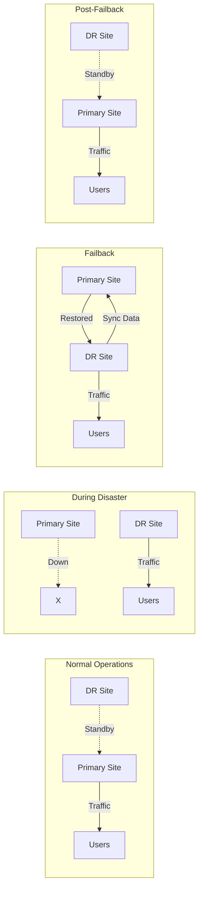
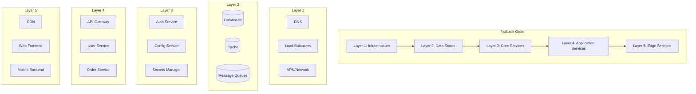

# How to Create Failback Procedures

Author: [nawazdhandala](https://github.com/nawazdhandala)

Tags: Disaster Recovery, Failback, High Availability, Operations

Description: Learn how to plan and execute failback procedures after disaster recovery.

---

Failover gets all the attention, but failback is where things often go wrong. After a disaster recovery event, returning to your primary environment requires careful planning, precise execution, and thorough verification. Here's how to build failback procedures that work.

## Understanding Failback

Failback is the process of returning operations from a disaster recovery (DR) site back to the original production environment after it has been repaired or replaced. Unlike failover, which often happens under pressure, failback can be planned and executed methodically.



## Failback Planning

### 1. Define Recovery Objectives

Before creating failback procedures, establish clear objectives:

```yaml
# failback-objectives.yaml
failback_objectives:
  # Maximum time to complete failback
  recovery_time_objective: "4 hours"

  # Maximum acceptable data loss during failback
  recovery_point_objective: "0 data loss"

  # Acceptable downtime during cutover
  maintenance_window: "30 minutes"

  # Success criteria
  success_criteria:
    - "All services responding within SLA"
    - "Data integrity verified"
    - "Monitoring and alerting functional"
    - "DR site returned to standby mode"
```

### 2. Create a Failback Readiness Checklist

```bash
#!/bin/bash
# failback-readiness-check.sh

echo "=== Failback Readiness Assessment ==="

# Check 1: Primary site availability
echo "[1/8] Checking primary site infrastructure..."
PRIMARY_STATUS=$(curl -s -o /dev/null -w "%{http_code}" https://primary-health.example.com/status)
if [ "$PRIMARY_STATUS" == "200" ]; then
    echo "  PRIMARY SITE: Available"
else
    echo "  PRIMARY SITE: NOT READY"
    exit 1
fi

# Check 2: Network connectivity
echo "[2/8] Testing network connectivity..."
ping -c 3 primary-db.example.com > /dev/null 2>&1
if [ $? -eq 0 ]; then
    echo "  NETWORK: Connected"
else
    echo "  NETWORK: UNREACHABLE"
    exit 1
fi

# Check 3: Storage capacity
echo "[3/8] Verifying storage capacity..."
STORAGE_AVAILABLE=$(ssh primary-server "df -h /data | tail -1 | awk '{print \$5}' | tr -d '%'")
if [ "$STORAGE_AVAILABLE" -lt 80 ]; then
    echo "  STORAGE: Sufficient ($STORAGE_AVAILABLE% used)"
else
    echo "  STORAGE: LOW SPACE ($STORAGE_AVAILABLE% used)"
    exit 1
fi

# Check 4: Database replication status
echo "[4/8] Checking database replication..."
REPLICATION_LAG=$(psql -h primary-db -U admin -d postgres -t -c "SELECT EXTRACT(EPOCH FROM (now() - pg_last_xact_replay_timestamp()))::int;")
if [ "$REPLICATION_LAG" -lt 60 ]; then
    echo "  REPLICATION: Healthy (${REPLICATION_LAG}s lag)"
else
    echo "  REPLICATION: LAGGING (${REPLICATION_LAG}s)"
    exit 1
fi

# Check 5: SSL certificates
echo "[5/8] Validating SSL certificates..."
CERT_EXPIRY=$(echo | openssl s_client -servername primary.example.com -connect primary.example.com:443 2>/dev/null | openssl x509 -noout -enddate | cut -d= -f2)
CERT_DAYS=$(( ($(date -d "$CERT_EXPIRY" +%s) - $(date +%s)) / 86400 ))
if [ "$CERT_DAYS" -gt 30 ]; then
    echo "  CERTIFICATES: Valid ($CERT_DAYS days remaining)"
else
    echo "  CERTIFICATES: EXPIRING SOON ($CERT_DAYS days)"
fi

# Check 6: DNS configuration
echo "[6/8] Verifying DNS readiness..."
DNS_RECORD=$(dig +short primary.example.com)
if [ -n "$DNS_RECORD" ]; then
    echo "  DNS: Configured ($DNS_RECORD)"
else
    echo "  DNS: NOT CONFIGURED"
    exit 1
fi

# Check 7: Monitoring systems
echo "[7/8] Checking monitoring availability..."
PROMETHEUS_STATUS=$(curl -s -o /dev/null -w "%{http_code}" http://prometheus-primary:9090/-/healthy)
if [ "$PROMETHEUS_STATUS" == "200" ]; then
    echo "  MONITORING: Ready"
else
    echo "  MONITORING: NOT READY"
fi

# Check 8: Team readiness
echo "[8/8] Confirming team availability..."
echo "  TEAM: Manual confirmation required"

echo ""
echo "=== Readiness Assessment Complete ==="
```

### 3. Document Service Dependencies



## Data Synchronization

### Bi-Directional Replication Setup

During DR operations, the DR site becomes the source of truth. Before failback, you must sync all changes back to the primary site.

```bash
#!/bin/bash
# setup-reverse-replication.sh

echo "Setting up reverse replication from DR to Primary..."

# PostgreSQL: Configure DR as source, Primary as target
cat << 'EOF' > /tmp/replication-setup.sql
-- On DR site (current primary)
ALTER SYSTEM SET wal_level = replica;
ALTER SYSTEM SET max_wal_senders = 5;
ALTER SYSTEM SET max_replication_slots = 5;
SELECT pg_reload_conf();

-- Create replication slot for primary site
SELECT pg_create_physical_replication_slot('primary_failback_slot');
EOF

psql -h dr-database.example.com -U postgres -f /tmp/replication-setup.sql

# On Primary site - set up as replica
ssh primary-server << 'REMOTE'
    # Stop PostgreSQL
    systemctl stop postgresql

    # Backup current data directory
    mv /var/lib/postgresql/data /var/lib/postgresql/data.backup

    # Set up streaming replication from DR
    pg_basebackup -h dr-database.example.com \
        -D /var/lib/postgresql/data \
        -U replicator \
        -P -R -S primary_failback_slot

    # Configure as standby
    cat >> /var/lib/postgresql/data/postgresql.conf << 'CONF'
primary_conninfo = 'host=dr-database.example.com port=5432 user=replicator password=secret'
primary_slot_name = 'primary_failback_slot'
CONF

    # Create standby signal file
    touch /var/lib/postgresql/data/standby.signal

    # Start PostgreSQL
    systemctl start postgresql
REMOTE

echo "Reverse replication configured. Primary is now syncing from DR."
```

### Monitor Replication Progress

```python
#!/usr/bin/env python3
# monitor_replication.py

import psycopg2
import time
import sys

def check_replication_status(dr_host, primary_host):
    """Monitor replication lag during failback preparation."""

    dr_conn = psycopg2.connect(
        host=dr_host,
        database="postgres",
        user="monitor",
        password="monitor_password"
    )

    primary_conn = psycopg2.connect(
        host=primary_host,
        database="postgres",
        user="monitor",
        password="monitor_password"
    )

    while True:
        # Get current WAL position on DR (source)
        with dr_conn.cursor() as cur:
            cur.execute("SELECT pg_current_wal_lsn();")
            dr_lsn = cur.fetchone()[0]

        # Get replay position on Primary (target)
        with primary_conn.cursor() as cur:
            cur.execute("SELECT pg_last_wal_replay_lsn();")
            primary_lsn = cur.fetchone()[0]

            cur.execute("""
                SELECT EXTRACT(EPOCH FROM (now() - pg_last_xact_replay_timestamp()))::int
                AS lag_seconds;
            """)
            lag_seconds = cur.fetchone()[0]

        # Calculate byte lag
        with dr_conn.cursor() as cur:
            cur.execute(f"SELECT pg_wal_lsn_diff('{dr_lsn}', '{primary_lsn}');")
            byte_lag = cur.fetchone()[0]

        print(f"DR LSN: {dr_lsn} | Primary LSN: {primary_lsn} | "
              f"Lag: {byte_lag} bytes ({lag_seconds}s)")

        # Check if caught up
        if byte_lag == 0:
            print("\n*** REPLICATION CAUGHT UP - READY FOR FAILBACK ***")
            return True

        time.sleep(5)

if __name__ == "__main__":
    check_replication_status(
        dr_host="dr-database.example.com",
        primary_host="primary-database.example.com"
    )
```

### Application Data Sync

```yaml
# data-sync-job.yaml
apiVersion: batch/v1
kind: Job
metadata:
  name: failback-data-sync
  namespace: operations
spec:
  template:
    spec:
      containers:
        - name: data-sync
          image: custom/data-sync:latest
          env:
            - name: SOURCE_DB
              value: "dr-database.example.com"
            - name: TARGET_DB
              value: "primary-database.example.com"
            - name: SYNC_MODE
              value: "incremental"
          command:
            - /bin/sh
            - -c
            - |
              echo "Starting data synchronization..."

              # Sync user-generated content
              echo "Syncing user uploads..."
              rclone sync dr-storage:/uploads primary-storage:/uploads \
                --progress --checksum

              # Sync application state
              echo "Syncing application cache..."
              redis-cli -h dr-redis BGSAVE
              scp dr-redis:/var/lib/redis/dump.rdb /tmp/
              redis-cli -h primary-redis DEBUG RELOAD /tmp/dump.rdb

              # Sync search indices
              echo "Syncing Elasticsearch indices..."
              elasticdump \
                --input=http://dr-elasticsearch:9200/products \
                --output=http://primary-elasticsearch:9200/products \
                --type=data

              echo "Data synchronization complete."
      restartPolicy: Never
```

## Service Restoration Sequence

### Failback Orchestration Script

```bash
#!/bin/bash
# failback-orchestrator.sh

set -e

LOG_FILE="/var/log/failback-$(date +%Y%m%d-%H%M%S).log"
exec 1> >(tee -a "$LOG_FILE") 2>&1

echo "=========================================="
echo "FAILBACK PROCEDURE INITIATED"
echo "Timestamp: $(date)"
echo "=========================================="

# Configuration
PRIMARY_CLUSTER="primary-k8s.example.com"
DR_CLUSTER="dr-k8s.example.com"
NOTIFICATION_WEBHOOK="https://hooks.slack.com/services/xxx"

notify() {
    local message=$1
    local status=$2
    curl -X POST "$NOTIFICATION_WEBHOOK" \
        -H 'Content-type: application/json' \
        -d "{\"text\": \"[$status] Failback: $message\"}"
}

checkpoint() {
    local step=$1
    echo ""
    echo "=== CHECKPOINT: $step ==="
    echo "Press Enter to continue or Ctrl+C to abort..."
    read -r
}

# Phase 1: Pre-failback Verification
echo ""
echo "PHASE 1: Pre-failback Verification"
echo "-----------------------------------"
notify "Starting failback procedure" "INFO"

./failback-readiness-check.sh
if [ $? -ne 0 ]; then
    notify "Readiness check failed" "ERROR"
    exit 1
fi

checkpoint "Pre-failback verification complete"

# Phase 2: Freeze Changes
echo ""
echo "PHASE 2: Freeze Changes"
echo "-----------------------"
notify "Freezing deployments on DR cluster" "INFO"

# Disable deployments on DR
kubectl --context=$DR_CLUSTER annotate deployment --all \
    deployment.kubernetes.io/paused=true -n production

# Disable CI/CD pipelines
curl -X POST "https://ci.example.com/api/v1/pause" \
    -H "Authorization: Bearer $CI_TOKEN"

checkpoint "Change freeze complete"

# Phase 3: Data Synchronization
echo ""
echo "PHASE 3: Final Data Synchronization"
echo "------------------------------------"
notify "Starting final data sync" "INFO"

# Wait for replication to catch up
python3 monitor_replication.py --wait-for-sync --timeout 3600
if [ $? -ne 0 ]; then
    notify "Replication sync failed" "ERROR"
    exit 1
fi

# Verify data integrity
./verify-data-integrity.sh
if [ $? -ne 0 ]; then
    notify "Data integrity check failed" "ERROR"
    exit 1
fi

checkpoint "Data synchronization complete"

# Phase 4: Service Restoration
echo ""
echo "PHASE 4: Service Restoration"
echo "----------------------------"
notify "Beginning service restoration on primary" "INFO"

# Layer 1: Infrastructure
echo "Restoring Layer 1: Infrastructure..."
kubectl --context=$PRIMARY_CLUSTER apply -f infrastructure/

# Wait for infrastructure
kubectl --context=$PRIMARY_CLUSTER wait --for=condition=ready \
    pod -l layer=infrastructure -n kube-system --timeout=300s

# Layer 2: Data Stores
echo "Restoring Layer 2: Data Stores..."

# Promote primary database
psql -h primary-database.example.com -U postgres -c "SELECT pg_promote();"

# Wait for promotion
sleep 30

# Verify database is writable
psql -h primary-database.example.com -U postgres \
    -c "CREATE TABLE failback_test (id int); DROP TABLE failback_test;"

kubectl --context=$PRIMARY_CLUSTER apply -f data-stores/
kubectl --context=$PRIMARY_CLUSTER wait --for=condition=ready \
    pod -l layer=data-stores -n production --timeout=600s

# Layer 3: Core Services
echo "Restoring Layer 3: Core Services..."
kubectl --context=$PRIMARY_CLUSTER apply -f core-services/
kubectl --context=$PRIMARY_CLUSTER wait --for=condition=ready \
    pod -l layer=core-services -n production --timeout=300s

# Layer 4: Application Services
echo "Restoring Layer 4: Application Services..."
kubectl --context=$PRIMARY_CLUSTER apply -f application-services/
kubectl --context=$PRIMARY_CLUSTER wait --for=condition=ready \
    pod -l layer=application-services -n production --timeout=300s

# Layer 5: Edge Services
echo "Restoring Layer 5: Edge Services..."
kubectl --context=$PRIMARY_CLUSTER apply -f edge-services/
kubectl --context=$PRIMARY_CLUSTER wait --for=condition=ready \
    pod -l layer=edge-services -n production --timeout=300s

checkpoint "Service restoration complete"

# Phase 5: Verification
echo ""
echo "PHASE 5: Service Verification"
echo "-----------------------------"
notify "Running verification tests" "INFO"

./run-smoke-tests.sh --environment primary
if [ $? -ne 0 ]; then
    notify "Smoke tests failed - consider rollback" "ERROR"
    exit 1
fi

checkpoint "Verification complete"

# Phase 6: Traffic Cutover (handled separately)
echo ""
echo "PHASE 6: Ready for Traffic Cutover"
echo "-----------------------------------"
notify "Services verified - ready for traffic cutover" "SUCCESS"

echo ""
echo "=========================================="
echo "FAILBACK PREPARATION COMPLETE"
echo "Proceed to traffic cutover when ready."
echo "=========================================="
```

## Verification Checkpoints

### Automated Health Verification

```python
#!/usr/bin/env python3
# verify_services.py

import requests
import sys
import json
from concurrent.futures import ThreadPoolExecutor, as_completed

SERVICES = {
    "api-gateway": {
        "url": "https://api.example.com/health",
        "expected_status": 200,
        "expected_body": {"status": "healthy"}
    },
    "user-service": {
        "url": "https://api.example.com/users/health",
        "expected_status": 200,
        "timeout": 10
    },
    "order-service": {
        "url": "https://api.example.com/orders/health",
        "expected_status": 200,
        "timeout": 10
    },
    "payment-service": {
        "url": "https://api.example.com/payments/health",
        "expected_status": 200,
        "timeout": 10
    },
    "notification-service": {
        "url": "https://api.example.com/notifications/health",
        "expected_status": 200,
        "timeout": 10
    }
}

def check_service(name, config):
    """Check if a service is healthy."""
    try:
        response = requests.get(
            config["url"],
            timeout=config.get("timeout", 30)
        )

        # Check status code
        if response.status_code != config["expected_status"]:
            return {
                "service": name,
                "status": "FAILED",
                "reason": f"Expected status {config['expected_status']}, got {response.status_code}"
            }

        # Check response body if specified
        if "expected_body" in config:
            body = response.json()
            for key, value in config["expected_body"].items():
                if body.get(key) != value:
                    return {
                        "service": name,
                        "status": "FAILED",
                        "reason": f"Expected {key}={value}, got {body.get(key)}"
                    }

        return {
            "service": name,
            "status": "PASSED",
            "response_time_ms": response.elapsed.total_seconds() * 1000
        }

    except requests.exceptions.Timeout:
        return {
            "service": name,
            "status": "FAILED",
            "reason": "Request timed out"
        }
    except Exception as e:
        return {
            "service": name,
            "status": "FAILED",
            "reason": str(e)
        }

def run_verification():
    """Run health checks on all services."""
    print("Running service verification...")
    print("=" * 50)

    results = []
    failed = 0

    with ThreadPoolExecutor(max_workers=10) as executor:
        futures = {
            executor.submit(check_service, name, config): name
            for name, config in SERVICES.items()
        }

        for future in as_completed(futures):
            result = future.result()
            results.append(result)

            if result["status"] == "PASSED":
                print(f"  [PASS] {result['service']} "
                      f"({result['response_time_ms']:.0f}ms)")
            else:
                print(f"  [FAIL] {result['service']}: {result['reason']}")
                failed += 1

    print("=" * 50)
    print(f"Results: {len(results) - failed}/{len(results)} services healthy")

    return failed == 0

def verify_database_connectivity():
    """Verify database connections from application layer."""
    print("\nVerifying database connectivity...")

    try:
        response = requests.get(
            "https://api.example.com/health/database",
            timeout=30
        )

        if response.status_code == 200:
            data = response.json()
            print(f"  Database: {data.get('database', 'unknown')}")
            print(f"  Connection pool: {data.get('pool_size', 'unknown')}")
            print(f"  Active connections: {data.get('active', 'unknown')}")
            return True
        else:
            print(f"  Database health check failed: {response.status_code}")
            return False

    except Exception as e:
        print(f"  Database verification failed: {e}")
        return False

def verify_cache_connectivity():
    """Verify cache is working."""
    print("\nVerifying cache connectivity...")

    try:
        # Write test value
        requests.post(
            "https://api.example.com/health/cache",
            json={"key": "failback_test", "value": "test_value"},
            timeout=10
        )

        # Read test value
        response = requests.get(
            "https://api.example.com/health/cache?key=failback_test",
            timeout=10
        )

        if response.json().get("value") == "test_value":
            print("  Cache: Working correctly")
            return True
        else:
            print("  Cache: Read/write mismatch")
            return False

    except Exception as e:
        print(f"  Cache verification failed: {e}")
        return False

if __name__ == "__main__":
    all_passed = True

    all_passed &= run_verification()
    all_passed &= verify_database_connectivity()
    all_passed &= verify_cache_connectivity()

    if all_passed:
        print("\n*** ALL VERIFICATIONS PASSED ***")
        sys.exit(0)
    else:
        print("\n*** SOME VERIFICATIONS FAILED ***")
        sys.exit(1)
```

### Database Integrity Verification

```bash
#!/bin/bash
# verify-data-integrity.sh

echo "Verifying data integrity..."

# Compare record counts
DR_USER_COUNT=$(psql -h dr-database -U readonly -d app -t -c "SELECT COUNT(*) FROM users;")
PRIMARY_USER_COUNT=$(psql -h primary-database -U readonly -d app -t -c "SELECT COUNT(*) FROM users;")

if [ "$DR_USER_COUNT" -ne "$PRIMARY_USER_COUNT" ]; then
    echo "ERROR: User count mismatch (DR: $DR_USER_COUNT, Primary: $PRIMARY_USER_COUNT)"
    exit 1
fi

# Compare checksums of critical tables
DR_CHECKSUM=$(psql -h dr-database -U readonly -d app -t -c "
    SELECT md5(array_agg(md5((t.*)::varchar))::varchar)
    FROM (SELECT * FROM orders ORDER BY id) t;
")

PRIMARY_CHECKSUM=$(psql -h primary-database -U readonly -d app -t -c "
    SELECT md5(array_agg(md5((t.*)::varchar))::varchar)
    FROM (SELECT * FROM orders ORDER BY id) t;
")

if [ "$DR_CHECKSUM" != "$PRIMARY_CHECKSUM" ]; then
    echo "ERROR: Orders table checksum mismatch"
    exit 1
fi

# Verify referential integrity
INTEGRITY_CHECK=$(psql -h primary-database -U readonly -d app -t -c "
    SELECT COUNT(*) FROM orders o
    LEFT JOIN users u ON o.user_id = u.id
    WHERE u.id IS NULL;
")

if [ "$INTEGRITY_CHECK" -gt 0 ]; then
    echo "ERROR: Referential integrity violation ($INTEGRITY_CHECK orphaned orders)"
    exit 1
fi

echo "Data integrity verification passed."
```

## Gradual Traffic Shifting

### DNS-Based Traffic Shifting

```bash
#!/bin/bash
# traffic-shift.sh

set -e

HOSTED_ZONE_ID="Z1234567890"
DOMAIN="api.example.com"
PRIMARY_TARGET="primary-lb.example.com"
DR_TARGET="dr-lb.example.com"

# Shift traffic percentages: 0% -> 10% -> 25% -> 50% -> 75% -> 100%
WEIGHTS=(0 10 25 50 75 100)
INTERVAL=300  # 5 minutes between shifts

shift_traffic() {
    local primary_weight=$1
    local dr_weight=$((100 - primary_weight))

    echo "Shifting traffic: Primary=$primary_weight%, DR=$dr_weight%"

    aws route53 change-resource-record-sets \
        --hosted-zone-id $HOSTED_ZONE_ID \
        --change-batch "{
            \"Changes\": [
                {
                    \"Action\": \"UPSERT\",
                    \"ResourceRecordSet\": {
                        \"Name\": \"$DOMAIN\",
                        \"Type\": \"CNAME\",
                        \"SetIdentifier\": \"primary\",
                        \"Weight\": $primary_weight,
                        \"TTL\": 60,
                        \"ResourceRecords\": [{\"Value\": \"$PRIMARY_TARGET\"}]
                    }
                },
                {
                    \"Action\": \"UPSERT\",
                    \"ResourceRecordSet\": {
                        \"Name\": \"$DOMAIN\",
                        \"Type\": \"CNAME\",
                        \"SetIdentifier\": \"dr\",
                        \"Weight\": $dr_weight,
                        \"TTL\": 60,
                        \"ResourceRecords\": [{\"Value\": \"$DR_TARGET\"}]
                    }
                }
            ]
        }"
}

check_error_rate() {
    # Query Prometheus for error rate
    ERROR_RATE=$(curl -s "http://prometheus:9090/api/v1/query" \
        --data-urlencode 'query=sum(rate(http_requests_total{status=~"5.."}[5m])) / sum(rate(http_requests_total[5m])) * 100' \
        | jq -r '.data.result[0].value[1]')

    echo "Current error rate: ${ERROR_RATE}%"

    # Threshold: 1%
    if (( $(echo "$ERROR_RATE > 1" | bc -l) )); then
        return 1
    fi
    return 0
}

# Start traffic shifting
for weight in "${WEIGHTS[@]}"; do
    shift_traffic $weight

    if [ $weight -eq 0 ]; then
        echo "Initial state set. Waiting for DNS propagation..."
        sleep 120
    else
        echo "Waiting $INTERVAL seconds before next shift..."
        sleep $INTERVAL
    fi

    # Check error rates
    if ! check_error_rate; then
        echo "ERROR: Error rate threshold exceeded. Initiating rollback..."
        shift_traffic 0  # Shift all traffic back to DR
        exit 1
    fi

    echo "Health check passed at ${weight}%"
done

echo ""
echo "=========================================="
echo "TRAFFIC SHIFT COMPLETE"
echo "100% traffic now on Primary site"
echo "=========================================="
```

### Service Mesh Traffic Shifting

```yaml
# istio-traffic-shift.yaml
apiVersion: networking.istio.io/v1alpha3
kind: VirtualService
metadata:
  name: api-failback
  namespace: production
spec:
  hosts:
    - api.example.com
  http:
    - match:
        - headers:
            x-canary:
              exact: "true"
      route:
        - destination:
            host: api-service
            subset: primary
    - route:
        - destination:
            host: api-service
            subset: dr
          weight: 90
        - destination:
            host: api-service
            subset: primary
          weight: 10
---
apiVersion: networking.istio.io/v1alpha3
kind: DestinationRule
metadata:
  name: api-destinations
  namespace: production
spec:
  host: api-service
  subsets:
    - name: primary
      labels:
        site: primary
    - name: dr
      labels:
        site: dr
```

### Automated Traffic Controller

```python
#!/usr/bin/env python3
# traffic_controller.py

import subprocess
import time
import sys
from prometheus_api_client import PrometheusConnect

class TrafficController:
    def __init__(self, prometheus_url, error_threshold=1.0, latency_threshold_ms=500):
        self.prom = PrometheusConnect(url=prometheus_url)
        self.error_threshold = error_threshold
        self.latency_threshold = latency_threshold_ms
        self.current_weight = 0

    def get_error_rate(self, site):
        """Get 5xx error rate for a site."""
        query = f'''
            sum(rate(http_requests_total{{site="{site}",status=~"5.."}}[5m])) /
            sum(rate(http_requests_total{{site="{site}"}}[5m])) * 100
        '''
        result = self.prom.custom_query(query)
        if result:
            return float(result[0]['value'][1])
        return 0.0

    def get_p99_latency(self, site):
        """Get p99 latency for a site."""
        query = f'''
            histogram_quantile(0.99,
                sum(rate(http_request_duration_seconds_bucket{{site="{site}"}}[5m])) by (le)
            ) * 1000
        '''
        result = self.prom.custom_query(query)
        if result:
            return float(result[0]['value'][1])
        return 0.0

    def check_health(self):
        """Check if primary site is healthy enough for more traffic."""
        error_rate = self.get_error_rate("primary")
        latency = self.get_p99_latency("primary")

        print(f"  Primary metrics: error_rate={error_rate:.2f}%, p99_latency={latency:.0f}ms")

        if error_rate > self.error_threshold:
            print(f"  ERROR: Error rate {error_rate:.2f}% exceeds threshold {self.error_threshold}%")
            return False

        if latency > self.latency_threshold:
            print(f"  ERROR: Latency {latency:.0f}ms exceeds threshold {self.latency_threshold}ms")
            return False

        return True

    def shift_traffic(self, primary_weight):
        """Shift traffic to the specified weight."""
        dr_weight = 100 - primary_weight

        # Update Istio VirtualService
        manifest = f'''
apiVersion: networking.istio.io/v1alpha3
kind: VirtualService
metadata:
  name: api-failback
  namespace: production
spec:
  hosts:
    - api.example.com
  http:
    - route:
        - destination:
            host: api-service
            subset: primary
          weight: {primary_weight}
        - destination:
            host: api-service
            subset: dr
          weight: {dr_weight}
'''

        subprocess.run(
            ["kubectl", "apply", "-f", "-"],
            input=manifest.encode(),
            check=True
        )

        self.current_weight = primary_weight
        print(f"Traffic shifted: Primary={primary_weight}%, DR={dr_weight}%")

    def gradual_shift(self, steps=[10, 25, 50, 75, 100], wait_seconds=300):
        """Gradually shift traffic with health checks."""
        print("Starting gradual traffic shift...")

        for target_weight in steps:
            print(f"\nShifting to {target_weight}%...")
            self.shift_traffic(target_weight)

            # Wait for traffic to stabilize
            print(f"Waiting {wait_seconds}s for stabilization...")
            time.sleep(wait_seconds)

            # Check health
            if not self.check_health():
                print("\nHealth check failed! Rolling back...")
                self.rollback()
                return False

            print(f"Health check passed at {target_weight}%")

        print("\nTraffic shift complete!")
        return True

    def rollback(self):
        """Roll back all traffic to DR."""
        print("Rolling back to DR site...")
        self.shift_traffic(0)
        print("Rollback complete. All traffic on DR site.")

if __name__ == "__main__":
    controller = TrafficController(
        prometheus_url="http://prometheus:9090",
        error_threshold=1.0,
        latency_threshold_ms=500
    )

    success = controller.gradual_shift(
        steps=[10, 25, 50, 75, 100],
        wait_seconds=300
    )

    sys.exit(0 if success else 1)
```

## Documentation and Runbooks

### Failback Runbook Template

```yaml
# failback-runbook.yaml
---
runbook:
  name: "Failback Procedure"
  version: "2.0"
  last_updated: "2025-01-30"
  owner: "SRE Team"

  overview: |
    This runbook describes the procedure for failing back from the DR site
    to the primary production environment after a disaster recovery event.

  prerequisites:
    - "Primary site infrastructure restored and verified"
    - "Network connectivity between DR and Primary sites"
    - "Database replication caught up (lag < 60 seconds)"
    - "At least 2 SRE team members available"
    - "Change management approval obtained"
    - "Communication sent to stakeholders"

  estimated_duration: "2-4 hours"

  rollback_plan: |
    If failback encounters issues, traffic can be immediately shifted
    back to DR site using: ./traffic-shift.sh rollback

  steps:
    - step: 1
      name: "Pre-failback Verification"
      commands:
        - "./failback-readiness-check.sh"
      expected_output: "All checks passed"
      rollback: "Address any failing checks before proceeding"

    - step: 2
      name: "Notify Stakeholders"
      commands:
        - "Send notification to #incidents channel"
        - "Update status page to 'Scheduled Maintenance'"
      manual: true

    - step: 3
      name: "Freeze Changes"
      commands:
        - "kubectl annotate deployment --all deployment.kubernetes.io/paused=true -n production --context=dr-cluster"
      expected_output: "All deployments annotated"
      rollback: "kubectl annotate deployment --all deployment.kubernetes.io/paused- -n production"

    - step: 4
      name: "Verify Replication Sync"
      commands:
        - "python3 monitor_replication.py --wait-for-sync"
      expected_output: "REPLICATION CAUGHT UP"
      timeout: "30 minutes"

    - step: 5
      name: "Promote Primary Database"
      commands:
        - "psql -h primary-db -U postgres -c 'SELECT pg_promote();'"
      expected_output: "t"
      verification:
        - "psql -h primary-db -U postgres -c 'SELECT pg_is_in_recovery();'"
        - "Expected output: f (false)"
      rollback: "Reconfigure primary as replica of DR"

    - step: 6
      name: "Start Services on Primary"
      commands:
        - "./failback-orchestrator.sh --phase services"
      expected_output: "All services started"
      verification:
        - "kubectl get pods -n production --context=primary-cluster"
        - "All pods should be Running"

    - step: 7
      name: "Run Verification Tests"
      commands:
        - "python3 verify_services.py"
      expected_output: "ALL VERIFICATIONS PASSED"

    - step: 8
      name: "Gradual Traffic Shift"
      commands:
        - "python3 traffic_controller.py"
      expected_output: "Traffic shift complete"
      rollback: "./traffic-shift.sh rollback"

    - step: 9
      name: "Final Verification"
      commands:
        - "./run-smoke-tests.sh --full"
      expected_output: "All tests passed"

    - step: 10
      name: "Cleanup"
      commands:
        - "kubectl annotate deployment --all deployment.kubernetes.io/paused- -n production --context=dr-cluster"
        - "Configure DR as standby"
      manual: true

  post_failback:
    - "Update status page to 'Operational'"
    - "Send completion notification"
    - "Schedule post-mortem meeting"
    - "Update documentation with lessons learned"
```

### Automated Runbook Executor

```python
#!/usr/bin/env python3
# runbook_executor.py

import yaml
import subprocess
import time
import sys
from datetime import datetime

class RunbookExecutor:
    def __init__(self, runbook_path):
        with open(runbook_path) as f:
            self.runbook = yaml.safe_load(f)['runbook']

        self.log_file = f"failback-{datetime.now().strftime('%Y%m%d-%H%M%S')}.log"
        self.current_step = 0

    def log(self, message):
        """Log message to file and stdout."""
        timestamp = datetime.now().strftime('%Y-%m-%d %H:%M:%S')
        log_entry = f"[{timestamp}] {message}"
        print(log_entry)
        with open(self.log_file, 'a') as f:
            f.write(log_entry + '\n')

    def confirm(self, prompt):
        """Ask for confirmation before proceeding."""
        response = input(f"\n{prompt} (yes/no): ").strip().lower()
        return response == 'yes'

    def execute_command(self, command):
        """Execute a shell command."""
        try:
            result = subprocess.run(
                command,
                shell=True,
                capture_output=True,
                text=True,
                timeout=300
            )
            return result.returncode == 0, result.stdout, result.stderr
        except subprocess.TimeoutExpired:
            return False, "", "Command timed out"
        except Exception as e:
            return False, "", str(e)

    def execute_step(self, step):
        """Execute a single runbook step."""
        self.log(f"\n{'='*60}")
        self.log(f"STEP {step['step']}: {step['name']}")
        self.log(f"{'='*60}")

        if step.get('manual'):
            self.log("This is a manual step.")
            for cmd in step.get('commands', []):
                self.log(f"  Action: {cmd}")
            if not self.confirm("Have you completed this step?"):
                return False
            return True

        for command in step.get('commands', []):
            self.log(f"Executing: {command}")
            success, stdout, stderr = self.execute_command(command)

            if stdout:
                self.log(f"Output: {stdout.strip()}")

            if not success:
                self.log(f"ERROR: {stderr}")

                if 'rollback' in step:
                    if self.confirm("Execute rollback?"):
                        self.log(f"Rolling back: {step['rollback']}")
                        self.execute_command(step['rollback'])

                return False

        # Run verification if specified
        if 'verification' in step:
            self.log("Running verification...")
            for verify_cmd in step['verification']:
                self.log(f"  {verify_cmd}")

        return True

    def run(self):
        """Execute the full runbook."""
        self.log(f"Starting runbook: {self.runbook['name']}")
        self.log(f"Version: {self.runbook['version']}")
        self.log(f"Estimated duration: {self.runbook['estimated_duration']}")

        # Check prerequisites
        self.log("\nPrerequisites:")
        for prereq in self.runbook['prerequisites']:
            self.log(f"  - {prereq}")

        if not self.confirm("Are all prerequisites met?"):
            self.log("Aborting - prerequisites not met")
            return False

        # Execute steps
        for step in self.runbook['steps']:
            if not self.confirm(f"Proceed with Step {step['step']}: {step['name']}?"):
                self.log("Runbook paused by operator")
                return False

            if not self.execute_step(step):
                self.log(f"Step {step['step']} failed!")
                return False

            self.log(f"Step {step['step']} completed successfully")
            self.current_step = step['step']

        # Post-failback tasks
        self.log("\nPost-failback tasks:")
        for task in self.runbook['post_failback']:
            self.log(f"  - {task}")

        self.log("\n" + "="*60)
        self.log("RUNBOOK COMPLETED SUCCESSFULLY")
        self.log("="*60)

        return True

if __name__ == "__main__":
    executor = RunbookExecutor("failback-runbook.yaml")
    success = executor.run()
    sys.exit(0 if success else 1)
```

## Monitoring and Alerting

### Failback Monitoring Dashboard

```yaml
# grafana-dashboard.yaml
apiVersion: v1
kind: ConfigMap
metadata:
  name: failback-dashboard
  namespace: monitoring
data:
  failback-dashboard.json: |
    {
      "title": "Failback Monitoring",
      "panels": [
        {
          "title": "Traffic Distribution",
          "type": "piechart",
          "targets": [
            {
              "expr": "sum(rate(http_requests_total{site=\"primary\"}[5m]))",
              "legendFormat": "Primary"
            },
            {
              "expr": "sum(rate(http_requests_total{site=\"dr\"}[5m]))",
              "legendFormat": "DR"
            }
          ]
        },
        {
          "title": "Error Rate by Site",
          "type": "timeseries",
          "targets": [
            {
              "expr": "sum(rate(http_requests_total{status=~\"5..\"}[5m])) by (site) / sum(rate(http_requests_total[5m])) by (site) * 100",
              "legendFormat": "{{site}}"
            }
          ],
          "thresholds": [
            {"value": 1, "color": "yellow"},
            {"value": 5, "color": "red"}
          ]
        },
        {
          "title": "P99 Latency by Site",
          "type": "timeseries",
          "targets": [
            {
              "expr": "histogram_quantile(0.99, sum(rate(http_request_duration_seconds_bucket[5m])) by (site, le)) * 1000",
              "legendFormat": "{{site}}"
            }
          ]
        },
        {
          "title": "Database Replication Lag",
          "type": "gauge",
          "targets": [
            {
              "expr": "pg_replication_lag_seconds"
            }
          ],
          "thresholds": [
            {"value": 0, "color": "green"},
            {"value": 60, "color": "yellow"},
            {"value": 300, "color": "red"}
          ]
        },
        {
          "title": "Service Health Status",
          "type": "stat",
          "targets": [
            {
              "expr": "up{job=~\".*primary.*\"}",
              "legendFormat": "{{job}}"
            }
          ]
        }
      ]
    }
```

### Alerting Rules

```yaml
# failback-alerts.yaml
apiVersion: monitoring.coreos.com/v1
kind: PrometheusRule
metadata:
  name: failback-alerts
  namespace: monitoring
spec:
  groups:
    - name: failback
      rules:
        - alert: FailbackErrorRateHigh
          expr: |
            sum(rate(http_requests_total{site="primary",status=~"5.."}[5m])) /
            sum(rate(http_requests_total{site="primary"}[5m])) * 100 > 1
          for: 2m
          labels:
            severity: critical
          annotations:
            summary: "High error rate on primary during failback"
            description: "Error rate {{ $value }}% exceeds 1% threshold"
            runbook: "Consider pausing traffic shift or rolling back"

        - alert: FailbackLatencyHigh
          expr: |
            histogram_quantile(0.99,
              sum(rate(http_request_duration_seconds_bucket{site="primary"}[5m])) by (le)
            ) * 1000 > 500
          for: 2m
          labels:
            severity: warning
          annotations:
            summary: "High latency on primary during failback"
            description: "P99 latency {{ $value }}ms exceeds 500ms threshold"

        - alert: ReplicationLagDuringFailback
          expr: pg_replication_lag_seconds > 60
          for: 5m
          labels:
            severity: critical
          annotations:
            summary: "Database replication lag during failback"
            description: "Replication lag {{ $value }}s - pause failback"

        - alert: PrimaryServiceDown
          expr: up{site="primary"} == 0
          for: 1m
          labels:
            severity: critical
          annotations:
            summary: "Primary service down during failback"
            description: "{{ $labels.job }} is down - immediate attention required"
```

## Best Practices

1. **Test failback regularly** - Run failback drills quarterly to ensure procedures work
2. **Document everything** - Keep runbooks updated with every change
3. **Use automation** - Manual steps introduce errors and delays
4. **Monitor continuously** - Watch metrics closely during the entire failback process
5. **Have rollback ready** - Always be prepared to shift traffic back to DR
6. **Communicate proactively** - Keep stakeholders informed throughout the process
7. **Start small** - Begin with 10% traffic and increase gradually
8. **Verify data integrity** - Never assume replication is perfect
9. **Time it right** - Perform failback during low-traffic periods
10. **Learn from failures** - Conduct post-mortems after every failback

---

Failback is the forgotten step in disaster recovery planning. Many organizations focus on failover but neglect the return journey. By investing in robust failback procedures with proper automation, verification, and documentation, you ensure that recovering from a disaster is just as reliable as surviving one.
