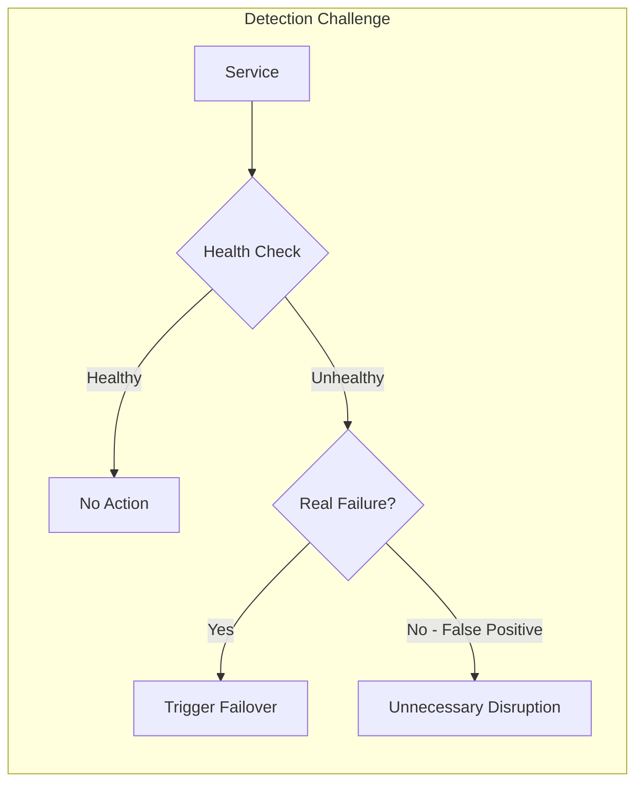
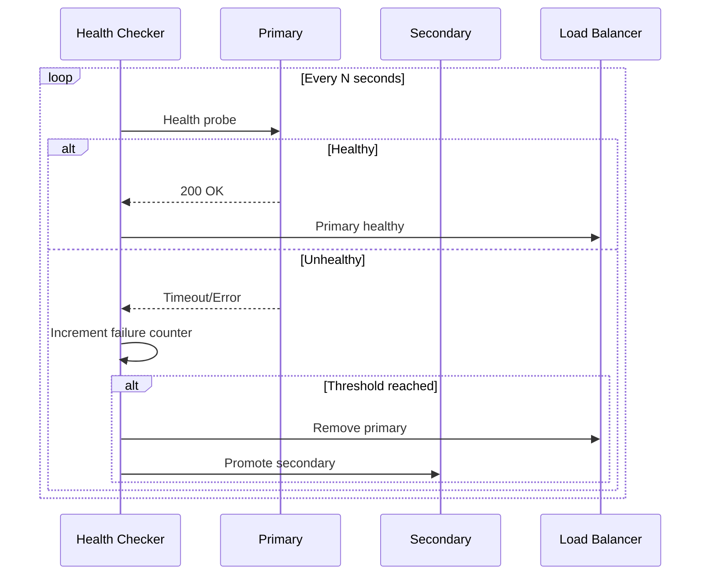
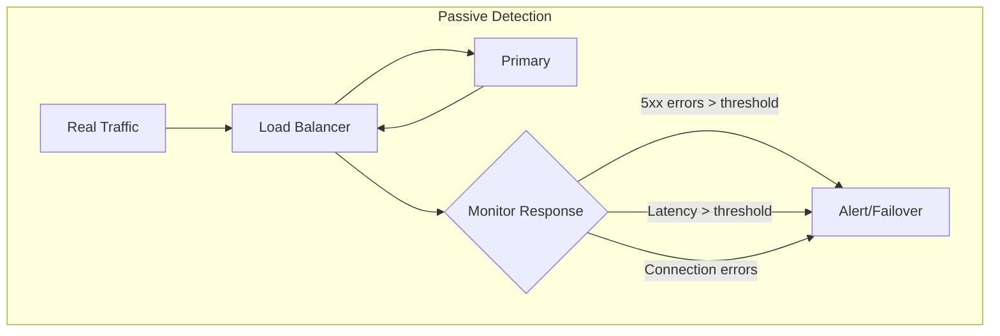
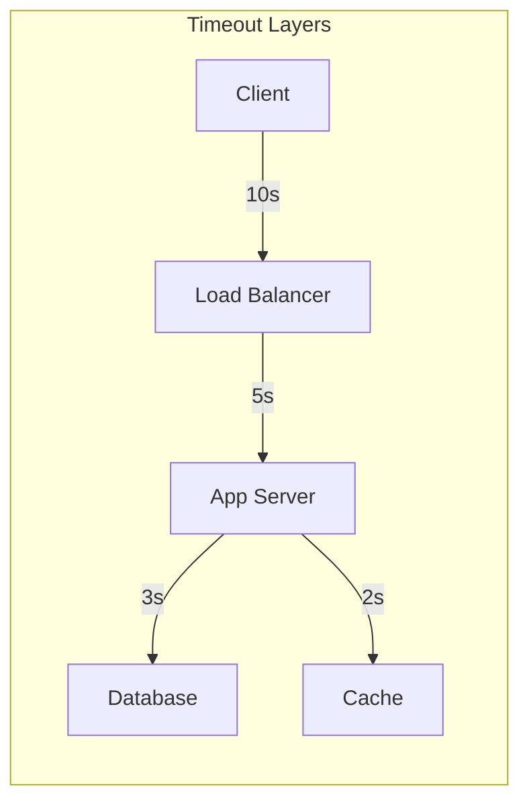
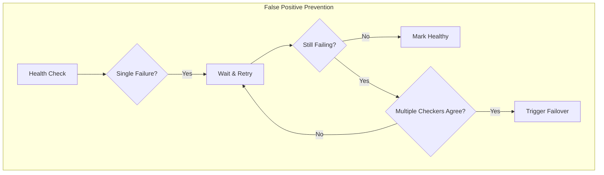
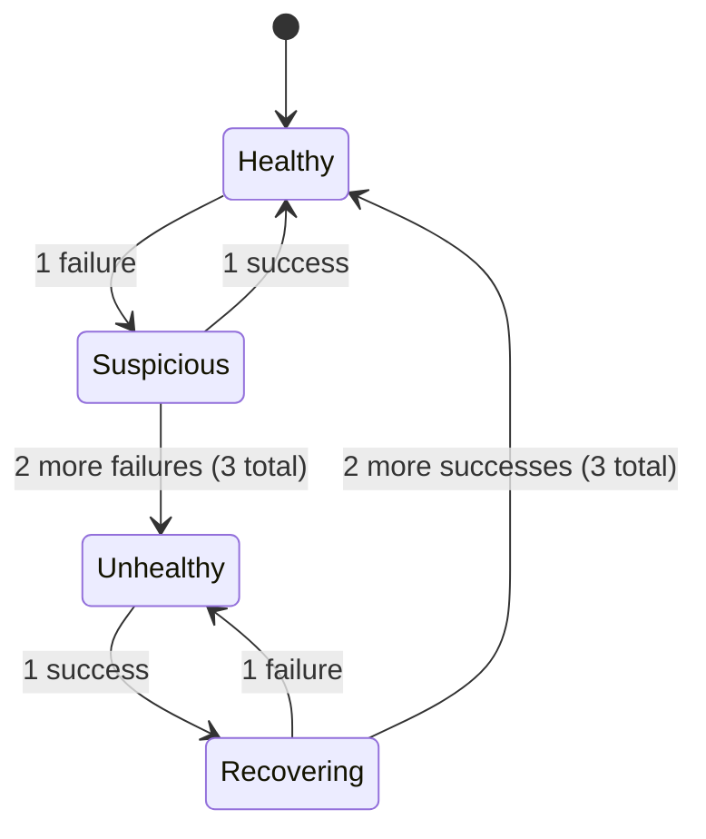
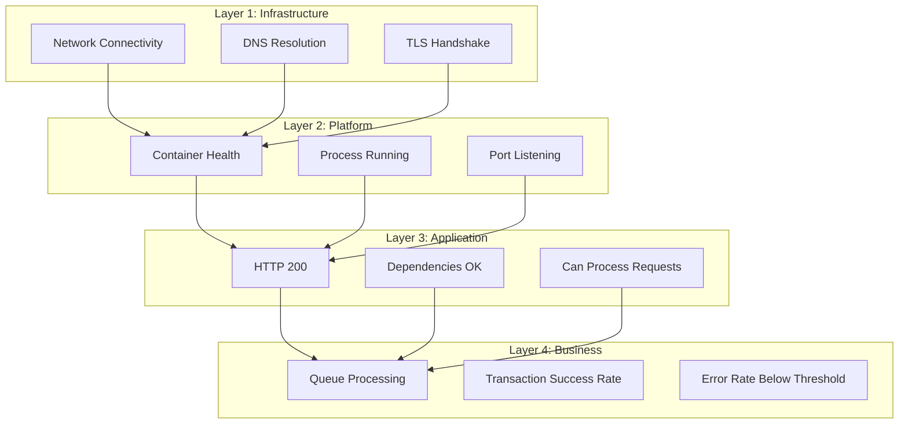
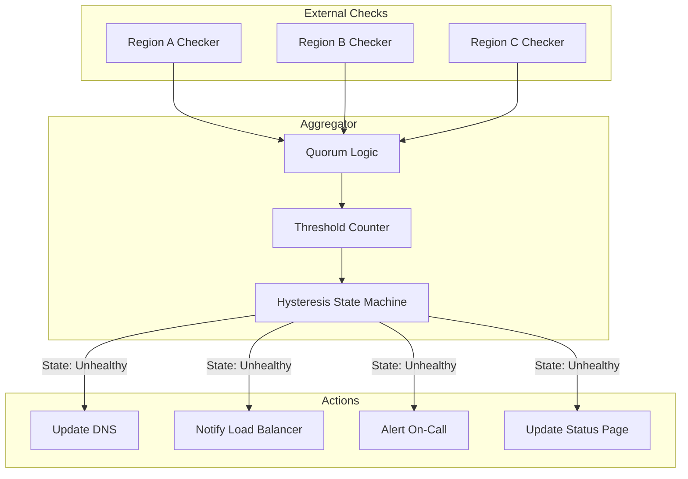

# How to Create Failover Detection

Author: [nawazdhandala](https://github.com/nawazdhandala)

Tags: High Availability, Failover, Detection, SRE

Description: Learn how to detect failures that trigger automatic failover.

---

Failover detection is the nervous system of high availability. Without it, your redundant infrastructure sits idle while users experience downtime. This guide covers how to build detection mechanisms that are fast enough to matter and accurate enough to trust.

## Why Detection is the Hardest Part

Setting up redundant servers is straightforward. Detecting when to switch to them is not. Get it wrong in one direction, and you have false positives triggering unnecessary failovers. Get it wrong in the other, and real outages go undetected.



## Detection Mechanisms

### 1. Active Health Checks

Active health checks probe your services at regular intervals. The probe can be a simple TCP connection, an HTTP request, or a custom script that validates business logic.



**HTTP Health Check Example (Node.js)**

```javascript
const http = require('http');

class HealthChecker {
  constructor(targets, options = {}) {
    this.targets = targets;
    this.interval = options.interval || 5000;
    this.timeout = options.timeout || 3000;
    this.unhealthyThreshold = options.unhealthyThreshold || 3;
    this.healthyThreshold = options.healthyThreshold || 2;
    this.failureCounts = new Map();
    this.healthyCounts = new Map();
    this.status = new Map();
  }

  async checkTarget(target) {
    return new Promise((resolve) => {
      const startTime = Date.now();
      const req = http.get(target.url, { timeout: this.timeout }, (res) => {
        const latency = Date.now() - startTime;
        const healthy = res.statusCode >= 200 && res.statusCode < 300;
        resolve({ healthy, latency, statusCode: res.statusCode });
      });

      req.on('error', () => resolve({ healthy: false, error: 'Connection failed' }));
      req.on('timeout', () => {
        req.destroy();
        resolve({ healthy: false, error: 'Timeout' });
      });
    });
  }

  updateStatus(target, result) {
    const id = target.id;

    if (result.healthy) {
      this.failureCounts.set(id, 0);
      const healthyCount = (this.healthyCounts.get(id) || 0) + 1;
      this.healthyCounts.set(id, healthyCount);

      if (healthyCount >= this.healthyThreshold) {
        if (this.status.get(id) !== 'healthy') {
          this.status.set(id, 'healthy');
          this.onStatusChange(target, 'healthy');
        }
      }
    } else {
      this.healthyCounts.set(id, 0);
      const failureCount = (this.failureCounts.get(id) || 0) + 1;
      this.failureCounts.set(id, failureCount);

      if (failureCount >= this.unhealthyThreshold) {
        if (this.status.get(id) !== 'unhealthy') {
          this.status.set(id, 'unhealthy');
          this.onStatusChange(target, 'unhealthy');
        }
      }
    }
  }

  onStatusChange(target, status) {
    console.log(`[${new Date().toISOString()}] ${target.id} is now ${status}`);
    // Trigger failover logic here
  }

  start() {
    setInterval(async () => {
      for (const target of this.targets) {
        const result = await this.checkTarget(target);
        this.updateStatus(target, result);
      }
    }, this.interval);
  }
}

// Usage
const checker = new HealthChecker([
  { id: 'primary-db', url: 'http://db-primary:5432/health' },
  { id: 'secondary-db', url: 'http://db-secondary:5432/health' }
], {
  interval: 5000,
  timeout: 3000,
  unhealthyThreshold: 3,
  healthyThreshold: 2
});

checker.start();
```

### 2. Passive Health Checks

Passive checks monitor actual traffic rather than synthetic probes. If real requests start failing, you know something is wrong.



**Passive Health Check with NGINX**

```nginx
upstream backend {
    server primary.example.com:8080 max_fails=3 fail_timeout=30s;
    server secondary.example.com:8080 backup;
}

server {
    location / {
        proxy_pass http://backend;
        proxy_next_upstream error timeout http_502 http_503 http_504;
        proxy_next_upstream_tries 2;
        proxy_connect_timeout 5s;
        proxy_read_timeout 30s;
    }
}
```

### 3. Application-Level Health Checks

Deep health checks that verify the application can actually serve requests, not just respond to pings.

```python
from flask import Flask, jsonify
from datetime import datetime, timedelta
import psycopg2
import redis

app = Flask(__name__)

class HealthCheck:
    def __init__(self):
        self.checks = []

    def add_check(self, name, check_func, critical=True):
        self.checks.append({
            'name': name,
            'check': check_func,
            'critical': critical
        })

    def run_all(self):
        results = []
        all_healthy = True

        for check in self.checks:
            try:
                start = datetime.now()
                check['check']()
                latency = (datetime.now() - start).total_seconds() * 1000
                results.append({
                    'name': check['name'],
                    'status': 'healthy',
                    'latency_ms': round(latency, 2)
                })
            except Exception as e:
                results.append({
                    'name': check['name'],
                    'status': 'unhealthy',
                    'error': str(e)
                })
                if check['critical']:
                    all_healthy = False

        return all_healthy, results

health = HealthCheck()

# Database check
def check_database():
    conn = psycopg2.connect(
        host="localhost",
        database="myapp",
        connect_timeout=5
    )
    cursor = conn.cursor()
    cursor.execute("SELECT 1")
    cursor.close()
    conn.close()

# Cache check
def check_redis():
    r = redis.Redis(host='localhost', socket_timeout=2)
    r.ping()

# Dependency check
def check_critical_service():
    import requests
    resp = requests.get('http://critical-service/health', timeout=3)
    resp.raise_for_status()

health.add_check('database', check_database, critical=True)
health.add_check('redis', check_redis, critical=False)
health.add_check('critical_service', check_critical_service, critical=True)

@app.route('/health')
def health_endpoint():
    healthy, results = health.run_all()
    status_code = 200 if healthy else 503
    return jsonify({
        'status': 'healthy' if healthy else 'unhealthy',
        'timestamp': datetime.utcnow().isoformat(),
        'checks': results
    }), status_code

@app.route('/health/live')
def liveness():
    """Kubernetes liveness - is the process running?"""
    return jsonify({'status': 'alive'}), 200

@app.route('/health/ready')
def readiness():
    """Kubernetes readiness - can we serve traffic?"""
    healthy, results = health.run_all()
    return jsonify({
        'status': 'ready' if healthy else 'not_ready',
        'checks': results
    }), 200 if healthy else 503
```

## Timeout Configuration

Timeouts are the most critical and most misunderstood part of failover detection. Too short, and you get false positives. Too long, and real failures take forever to detect.



**Timeout Guidelines**

| Component | Connect Timeout | Read Timeout | Total Timeout |
|-----------|-----------------|--------------|---------------|
| Health Check | 2-5s | 5-10s | 10-15s |
| Load Balancer | 5s | 30s | 60s |
| Service-to-Service | 1-3s | 10-30s | 30s |
| Database | 5s | 30s | 60s |

**Timeout Configuration Example (Go)**

```go
package main

import (
    "context"
    "fmt"
    "net"
    "net/http"
    "time"
)

type FailoverConfig struct {
    ConnectTimeout    time.Duration
    ReadTimeout       time.Duration
    WriteTimeout      time.Duration
    HealthCheckPeriod time.Duration
    FailureThreshold  int
    RecoveryThreshold int
}

func NewFailoverHTTPClient(config FailoverConfig) *http.Client {
    transport := &http.Transport{
        DialContext: (&net.Dialer{
            Timeout:   config.ConnectTimeout,
            KeepAlive: 30 * time.Second,
        }).DialContext,
        MaxIdleConns:          100,
        IdleConnTimeout:       90 * time.Second,
        TLSHandshakeTimeout:   10 * time.Second,
        ExpectContinueTimeout: 1 * time.Second,
        ResponseHeaderTimeout: config.ReadTimeout,
    }

    return &http.Client{
        Transport: transport,
        Timeout:   config.ConnectTimeout + config.ReadTimeout,
    }
}

type HealthChecker struct {
    client     *http.Client
    targets    []string
    config     FailoverConfig
    failures   map[string]int
    healthy    map[string]bool
    onFailover func(failed string, newPrimary string)
}

func (h *HealthChecker) Check(ctx context.Context, target string) error {
    ctx, cancel := context.WithTimeout(ctx, h.config.ConnectTimeout+h.config.ReadTimeout)
    defer cancel()

    req, err := http.NewRequestWithContext(ctx, "GET", target+"/health", nil)
    if err != nil {
        return err
    }

    resp, err := h.client.Do(req)
    if err != nil {
        return err
    }
    defer resp.Body.Close()

    if resp.StatusCode >= 500 {
        return fmt.Errorf("unhealthy status: %d", resp.StatusCode)
    }

    return nil
}

func (h *HealthChecker) Run(ctx context.Context) {
    ticker := time.NewTicker(h.config.HealthCheckPeriod)
    defer ticker.Stop()

    for {
        select {
        case <-ctx.Done():
            return
        case <-ticker.C:
            for _, target := range h.targets {
                if err := h.Check(ctx, target); err != nil {
                    h.failures[target]++
                    if h.failures[target] >= h.config.FailureThreshold {
                        h.healthy[target] = false
                        h.triggerFailover(target)
                    }
                } else {
                    if !h.healthy[target] {
                        h.failures[target] = 0
                        // Require multiple successes before marking healthy
                        // (implement recovery threshold logic here)
                    }
                    h.healthy[target] = true
                }
            }
        }
    }
}

func (h *HealthChecker) triggerFailover(failed string) {
    for _, target := range h.targets {
        if target != failed && h.healthy[target] {
            h.onFailover(failed, target)
            return
        }
    }
}
```

## False Positive Prevention

False positives are worse than slow detection. A spurious failover can cause data inconsistency, service disruption, and operator fatigue.



### Strategies

**1. Threshold-Based Detection**

Never failover on a single failed check. Require N consecutive failures.

```yaml
# Kubernetes probe with failure threshold
livenessProbe:
  httpGet:
    path: /health
    port: 8080
  initialDelaySeconds: 30
  periodSeconds: 10
  timeoutSeconds: 5
  failureThreshold: 3  # 3 failures = 30 seconds before restart
  successThreshold: 1
```

**2. Quorum-Based Detection**

Use multiple independent checkers. Only failover when a majority agree the target is down.

```python
from concurrent.futures import ThreadPoolExecutor, as_completed
from dataclasses import dataclass
from typing import List, Callable
import time

@dataclass
class CheckResult:
    checker_id: str
    target: str
    healthy: bool
    latency_ms: float
    error: str = None

class QuorumHealthChecker:
    def __init__(self, checkers: List[Callable], quorum_size: int = None):
        """
        checkers: List of check functions (can be from different locations/providers)
        quorum_size: Number of checkers that must agree (default: majority)
        """
        self.checkers = checkers
        self.quorum_size = quorum_size or (len(checkers) // 2 + 1)

    def check(self, target: str, timeout: float = 10.0) -> tuple[bool, List[CheckResult]]:
        results = []

        with ThreadPoolExecutor(max_workers=len(self.checkers)) as executor:
            futures = {
                executor.submit(checker, target): f"checker_{i}"
                for i, checker in enumerate(self.checkers)
            }

            for future in as_completed(futures, timeout=timeout):
                checker_id = futures[future]
                try:
                    result = future.result()
                    results.append(CheckResult(
                        checker_id=checker_id,
                        target=target,
                        healthy=result['healthy'],
                        latency_ms=result['latency_ms']
                    ))
                except Exception as e:
                    results.append(CheckResult(
                        checker_id=checker_id,
                        target=target,
                        healthy=False,
                        latency_ms=0,
                        error=str(e)
                    ))

        healthy_count = sum(1 for r in results if r.healthy)
        is_healthy = healthy_count >= self.quorum_size

        return is_healthy, results

# Example checker functions (could be from different cloud regions)
def check_from_us_east(target):
    # Implement actual check
    import requests
    start = time.time()
    try:
        resp = requests.get(f"{target}/health", timeout=5)
        return {
            'healthy': resp.status_code == 200,
            'latency_ms': (time.time() - start) * 1000
        }
    except:
        return {'healthy': False, 'latency_ms': 0}

def check_from_us_west(target):
    # Similar implementation from different location
    pass

def check_from_eu(target):
    # Similar implementation from different location
    pass

# Usage
checker = QuorumHealthChecker(
    checkers=[check_from_us_east, check_from_us_west, check_from_eu],
    quorum_size=2  # 2 out of 3 must agree
)

is_healthy, results = checker.check("https://api.example.com")
```

**3. Hysteresis**

Require different thresholds for going unhealthy vs recovering. This prevents flapping.



```javascript
class HysteresisHealthChecker {
  constructor(options = {}) {
    this.unhealthyThreshold = options.unhealthyThreshold || 3;
    this.healthyThreshold = options.healthyThreshold || 3;  // Higher for recovery
    this.state = 'healthy';
    this.consecutiveFailures = 0;
    this.consecutiveSuccesses = 0;
  }

  recordResult(success) {
    if (success) {
      this.consecutiveFailures = 0;
      this.consecutiveSuccesses++;
    } else {
      this.consecutiveSuccesses = 0;
      this.consecutiveFailures++;
    }

    this.updateState();
    return this.state;
  }

  updateState() {
    switch (this.state) {
      case 'healthy':
        if (this.consecutiveFailures >= this.unhealthyThreshold) {
          this.state = 'unhealthy';
          this.onUnhealthy();
        }
        break;

      case 'unhealthy':
        if (this.consecutiveSuccesses >= this.healthyThreshold) {
          this.state = 'healthy';
          this.onHealthy();
        }
        break;
    }
  }

  onUnhealthy() {
    console.log('Service transitioned to UNHEALTHY - triggering failover');
  }

  onHealthy() {
    console.log('Service transitioned to HEALTHY - can accept traffic');
  }
}
```

## Detection Speed vs Accuracy

There is an inherent trade-off between how fast you detect failures and how confident you are that they are real.

```mermaid
quadrantChart
    title Detection Speed vs Accuracy Trade-off
    x-axis Low Speed --> High Speed
    y-axis Low Accuracy --> High Accuracy
    quadrant-1 Ideal (Hard to Achieve)
    quadrant-2 Conservative (Slow but Safe)
    quadrant-3 Poor (Slow and Unreliable)
    quadrant-4 Aggressive (Fast but Risky)

    Single Check Fast: [0.8, 0.3]
    Quorum Slow: [0.3, 0.85]
    Threshold Based: [0.5, 0.7]
    ML Anomaly Detection: [0.7, 0.75]
```

### Formula for Detection Time

```
Detection Time = (Check Interval × Failure Threshold) + Network Latency + Processing Time
```

**Example Configurations**

| Configuration | Check Interval | Threshold | Detection Time | False Positive Risk |
|--------------|----------------|-----------|----------------|---------------------|
| Aggressive | 1s | 2 | 2-3s | High |
| Balanced | 5s | 3 | 15-20s | Medium |
| Conservative | 10s | 5 | 50-60s | Low |

```yaml
# Balanced configuration for Kubernetes
apiVersion: v1
kind: Service
metadata:
  name: my-service
  annotations:
    # AWS ALB health check settings
    alb.ingress.kubernetes.io/healthcheck-interval-seconds: "5"
    alb.ingress.kubernetes.io/healthcheck-timeout-seconds: "3"
    alb.ingress.kubernetes.io/healthy-threshold-count: "2"
    alb.ingress.kubernetes.io/unhealthy-threshold-count: "3"
```

## Multi-Layer Detection

Production systems need detection at multiple layers. A single layer can miss failures that another layer catches.



### Implementation

```yaml
# Kubernetes multi-layer health checks
apiVersion: v1
kind: Pod
metadata:
  name: my-app
spec:
  containers:
    - name: app
      image: my-app:latest
      ports:
        - containerPort: 8080

      # Layer 2: Is the process alive?
      livenessProbe:
        httpGet:
          path: /health/live
          port: 8080
        initialDelaySeconds: 30
        periodSeconds: 10
        failureThreshold: 3

      # Layer 3: Can it serve traffic?
      readinessProbe:
        httpGet:
          path: /health/ready
          port: 8080
        initialDelaySeconds: 5
        periodSeconds: 5
        failureThreshold: 3

      # Layer 3+: Startup check (for slow-starting apps)
      startupProbe:
        httpGet:
          path: /health/startup
          port: 8080
        failureThreshold: 30
        periodSeconds: 10
```

```go
// Multi-layer health check implementation
package main

import (
    "database/sql"
    "encoding/json"
    "net/http"
    "sync"
    "time"
)

type LayeredHealthCheck struct {
    db           *sql.DB
    redis        RedisClient
    dependencies []string
    mu           sync.RWMutex
    lastResults  map[string]CheckResult
}

type CheckResult struct {
    Healthy   bool          `json:"healthy"`
    Latency   time.Duration `json:"latency"`
    Error     string        `json:"error,omitempty"`
    Timestamp time.Time     `json:"timestamp"`
}

// Layer 1: Infrastructure (handled by Kubernetes/load balancer)

// Layer 2: Process liveness
func (h *LayeredHealthCheck) LivenessHandler(w http.ResponseWriter, r *http.Request) {
    // Just check if we can respond
    w.WriteHeader(http.StatusOK)
    json.NewEncoder(w).Encode(map[string]string{"status": "alive"})
}

// Layer 3: Application readiness
func (h *LayeredHealthCheck) ReadinessHandler(w http.ResponseWriter, r *http.Request) {
    results := make(map[string]CheckResult)
    allHealthy := true

    // Check database
    dbResult := h.checkDatabase()
    results["database"] = dbResult
    if !dbResult.Healthy {
        allHealthy = false
    }

    // Check cache
    cacheResult := h.checkCache()
    results["cache"] = cacheResult
    // Cache is non-critical, don't fail readiness

    // Check critical dependencies
    for _, dep := range h.dependencies {
        depResult := h.checkDependency(dep)
        results[dep] = depResult
        if !depResult.Healthy {
            allHealthy = false
        }
    }

    h.mu.Lock()
    h.lastResults = results
    h.mu.Unlock()

    status := http.StatusOK
    if !allHealthy {
        status = http.StatusServiceUnavailable
    }

    w.WriteHeader(status)
    json.NewEncoder(w).Encode(map[string]interface{}{
        "healthy": allHealthy,
        "checks":  results,
    })
}

// Layer 4: Business health (for monitoring, not failover)
func (h *LayeredHealthCheck) DeepHealthHandler(w http.ResponseWriter, r *http.Request) {
    results := make(map[string]interface{})

    // Include all Layer 3 checks
    h.mu.RLock()
    for k, v := range h.lastResults {
        results[k] = v
    }
    h.mu.RUnlock()

    // Add business metrics
    results["queue_depth"] = h.getQueueDepth()
    results["error_rate_1m"] = h.getErrorRate()
    results["p99_latency_1m"] = h.getP99Latency()

    w.WriteHeader(http.StatusOK)
    json.NewEncoder(w).Encode(results)
}

func (h *LayeredHealthCheck) checkDatabase() CheckResult {
    start := time.Now()
    err := h.db.Ping()
    latency := time.Since(start)

    if err != nil {
        return CheckResult{
            Healthy:   false,
            Latency:   latency,
            Error:     err.Error(),
            Timestamp: time.Now(),
        }
    }

    return CheckResult{
        Healthy:   true,
        Latency:   latency,
        Timestamp: time.Now(),
    }
}

func (h *LayeredHealthCheck) checkCache() CheckResult {
    start := time.Now()
    _, err := h.redis.Ping()
    latency := time.Since(start)

    return CheckResult{
        Healthy:   err == nil,
        Latency:   latency,
        Error:     errorString(err),
        Timestamp: time.Now(),
    }
}

func (h *LayeredHealthCheck) checkDependency(url string) CheckResult {
    start := time.Now()
    client := &http.Client{Timeout: 5 * time.Second}
    resp, err := client.Get(url + "/health")
    latency := time.Since(start)

    if err != nil {
        return CheckResult{
            Healthy:   false,
            Latency:   latency,
            Error:     err.Error(),
            Timestamp: time.Now(),
        }
    }
    defer resp.Body.Close()

    return CheckResult{
        Healthy:   resp.StatusCode == http.StatusOK,
        Latency:   latency,
        Timestamp: time.Now(),
    }
}
```

## Putting It All Together

Here is a complete failover detection system that combines all the concepts.



```python
import asyncio
import aiohttp
from dataclasses import dataclass, field
from datetime import datetime, timedelta
from enum import Enum
from typing import List, Dict, Callable, Optional
import logging

logging.basicConfig(level=logging.INFO)
logger = logging.getLogger(__name__)

class HealthState(Enum):
    HEALTHY = "healthy"
    SUSPICIOUS = "suspicious"
    UNHEALTHY = "unhealthy"
    RECOVERING = "recovering"

@dataclass
class Target:
    id: str
    url: str
    critical: bool = True

@dataclass
class CheckerConfig:
    id: str
    region: str
    weight: float = 1.0

@dataclass
class FailoverConfig:
    check_interval: float = 5.0
    connect_timeout: float = 3.0
    read_timeout: float = 5.0
    unhealthy_threshold: int = 3
    healthy_threshold: int = 3
    quorum_size: int = 2

@dataclass
class TargetState:
    state: HealthState = HealthState.HEALTHY
    consecutive_failures: int = 0
    consecutive_successes: int = 0
    last_check: Optional[datetime] = None
    checker_results: Dict[str, bool] = field(default_factory=dict)

class FailoverDetector:
    def __init__(
        self,
        targets: List[Target],
        checkers: List[CheckerConfig],
        config: FailoverConfig,
        on_failover: Callable[[str], None],
        on_recovery: Callable[[str], None]
    ):
        self.targets = {t.id: t for t in targets}
        self.checkers = checkers
        self.config = config
        self.on_failover = on_failover
        self.on_recovery = on_recovery
        self.states: Dict[str, TargetState] = {
            t.id: TargetState() for t in targets
        }
        self._running = False

    async def check_target(
        self,
        session: aiohttp.ClientSession,
        target: Target,
        checker: CheckerConfig
    ) -> bool:
        """Perform a single health check from one checker."""
        try:
            timeout = aiohttp.ClientTimeout(
                connect=self.config.connect_timeout,
                total=self.config.connect_timeout + self.config.read_timeout
            )
            async with session.get(
                f"{target.url}/health",
                timeout=timeout
            ) as response:
                return 200 <= response.status < 300
        except Exception as e:
            logger.debug(f"Check failed for {target.id} from {checker.id}: {e}")
            return False

    async def check_all_checkers(
        self,
        session: aiohttp.ClientSession,
        target: Target
    ) -> Dict[str, bool]:
        """Run checks from all checkers in parallel."""
        tasks = {
            checker.id: self.check_target(session, target, checker)
            for checker in self.checkers
        }
        results = await asyncio.gather(*tasks.values(), return_exceptions=True)
        return {
            checker_id: result if isinstance(result, bool) else False
            for checker_id, result in zip(tasks.keys(), results)
        }

    def evaluate_quorum(self, results: Dict[str, bool]) -> bool:
        """Determine if target is healthy based on quorum."""
        healthy_count = sum(1 for healthy in results.values() if healthy)
        return healthy_count >= self.config.quorum_size

    def update_state(self, target_id: str, is_healthy: bool):
        """Update state machine with hysteresis."""
        state = self.states[target_id]
        old_state = state.state

        if is_healthy:
            state.consecutive_failures = 0
            state.consecutive_successes += 1
        else:
            state.consecutive_successes = 0
            state.consecutive_failures += 1

        # State transitions with hysteresis
        if state.state == HealthState.HEALTHY:
            if state.consecutive_failures >= self.config.unhealthy_threshold:
                state.state = HealthState.UNHEALTHY
                logger.warning(f"Target {target_id} is now UNHEALTHY")
                self.on_failover(target_id)
            elif state.consecutive_failures > 0:
                state.state = HealthState.SUSPICIOUS

        elif state.state == HealthState.SUSPICIOUS:
            if is_healthy:
                state.state = HealthState.HEALTHY
            elif state.consecutive_failures >= self.config.unhealthy_threshold:
                state.state = HealthState.UNHEALTHY
                logger.warning(f"Target {target_id} is now UNHEALTHY")
                self.on_failover(target_id)

        elif state.state == HealthState.UNHEALTHY:
            if state.consecutive_successes >= self.config.healthy_threshold:
                state.state = HealthState.HEALTHY
                logger.info(f"Target {target_id} has RECOVERED")
                self.on_recovery(target_id)
            elif state.consecutive_successes > 0:
                state.state = HealthState.RECOVERING

        elif state.state == HealthState.RECOVERING:
            if not is_healthy:
                state.state = HealthState.UNHEALTHY
            elif state.consecutive_successes >= self.config.healthy_threshold:
                state.state = HealthState.HEALTHY
                logger.info(f"Target {target_id} has RECOVERED")
                self.on_recovery(target_id)

        state.last_check = datetime.utcnow()

        if old_state != state.state:
            logger.info(f"Target {target_id} transitioned: {old_state} -> {state.state}")

    async def run(self):
        """Main detection loop."""
        self._running = True
        async with aiohttp.ClientSession() as session:
            while self._running:
                for target_id, target in self.targets.items():
                    results = await self.check_all_checkers(session, target)
                    self.states[target_id].checker_results = results
                    is_healthy = self.evaluate_quorum(results)
                    self.update_state(target_id, is_healthy)

                await asyncio.sleep(self.config.check_interval)

    def stop(self):
        self._running = False

    def get_status(self) -> Dict:
        """Get current status of all targets."""
        return {
            target_id: {
                "state": state.state.value,
                "consecutive_failures": state.consecutive_failures,
                "consecutive_successes": state.consecutive_successes,
                "last_check": state.last_check.isoformat() if state.last_check else None,
                "checker_results": state.checker_results
            }
            for target_id, state in self.states.items()
        }


# Usage example
async def main():
    def handle_failover(target_id: str):
        logger.warning(f"FAILOVER TRIGGERED for {target_id}")
        # Update DNS, notify load balancer, alert on-call, etc.

    def handle_recovery(target_id: str):
        logger.info(f"RECOVERY COMPLETE for {target_id}")
        # Restore traffic, update status page, etc.

    detector = FailoverDetector(
        targets=[
            Target(id="primary-api", url="https://api-primary.example.com", critical=True),
            Target(id="secondary-api", url="https://api-secondary.example.com", critical=True),
        ],
        checkers=[
            CheckerConfig(id="us-east", region="us-east-1"),
            CheckerConfig(id="us-west", region="us-west-2"),
            CheckerConfig(id="eu-west", region="eu-west-1"),
        ],
        config=FailoverConfig(
            check_interval=5.0,
            unhealthy_threshold=3,
            healthy_threshold=3,
            quorum_size=2,
        ),
        on_failover=handle_failover,
        on_recovery=handle_recovery,
    )

    await detector.run()

if __name__ == "__main__":
    asyncio.run(main())
```

## Best Practices Summary

1. **Never failover on a single check failure.** Use thresholds to filter transient issues.

2. **Use multiple independent checkers.** A single checker location can have network issues.

3. **Implement hysteresis.** Make it harder to recover than to fail, preventing flapping.

4. **Layer your health checks.** Infrastructure, platform, application, and business health are all different.

5. **Tune timeouts carefully.** Too short causes false positives, too long causes slow detection.

6. **Test your failover detection.** Simulate failures regularly to verify detection works.

7. **Monitor your monitors.** If your health checker goes down, you lose visibility.

8. **Document your thresholds.** Future you needs to know why the threshold is 3 and not 2.

---

Failover detection is not glamorous, but it determines whether your redundant architecture actually provides high availability or just provides a false sense of security. Build it carefully, test it regularly, and tune it based on real-world performance.
