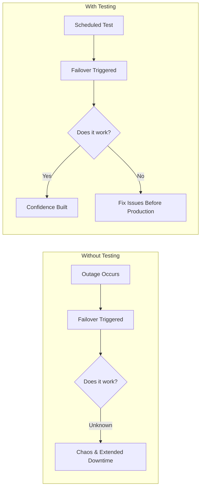
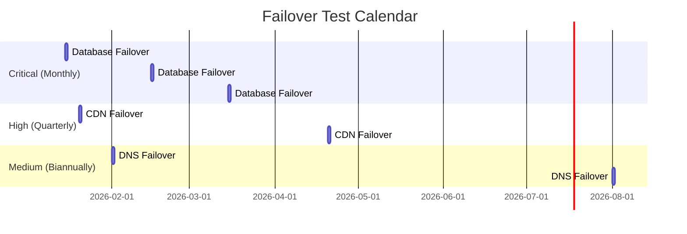
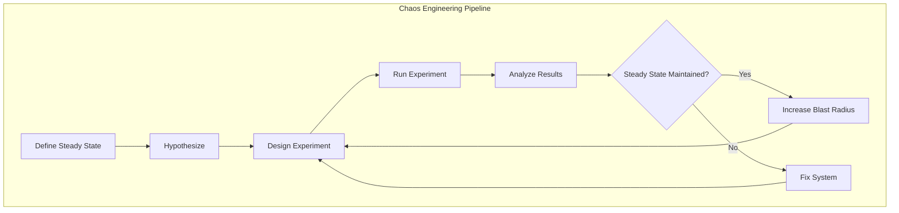
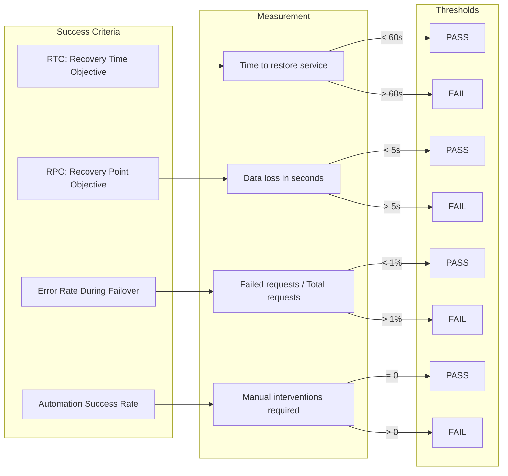
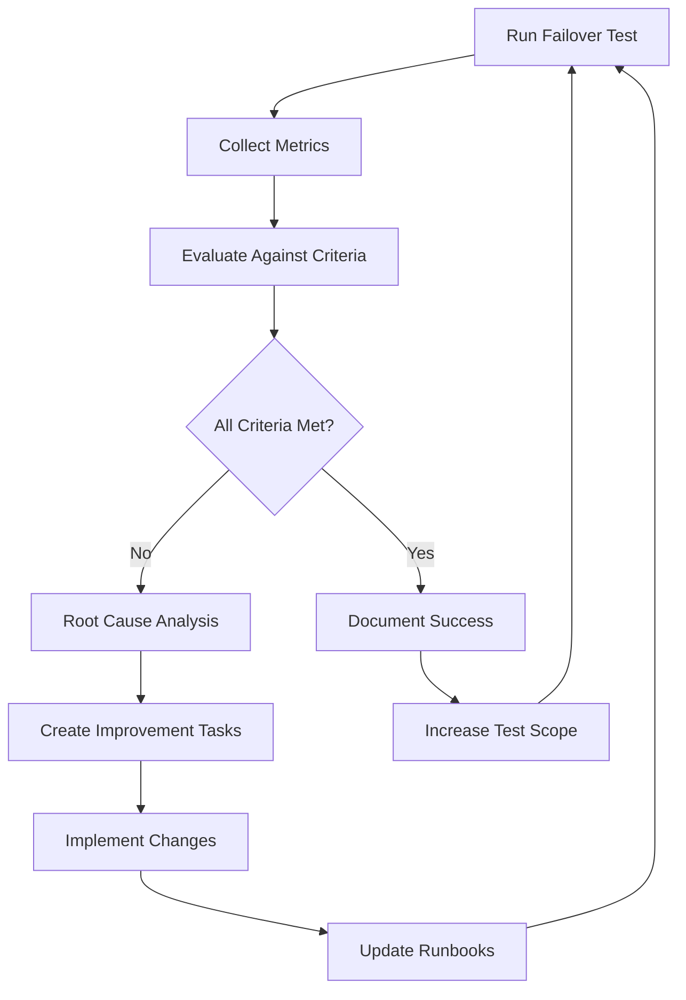

# How to Create Failover Testing

Author: [nawazdhandala](https://github.com/nawazdhandala)

Tags: High Availability, Testing, Failover, SRE

Description: Learn how to test failover mechanisms to ensure they work when needed.

---

Failover mechanisms are only as good as your last test. Many organizations invest heavily in redundant infrastructure, only to discover during an actual outage that their failover does not work as expected. This guide covers how to systematically test your failover systems to build confidence that they will perform when it matters most.

## Why Test Failover?



Untested failover is a liability disguised as a feature. The only way to know your failover works is to trigger it deliberately, measure the results, and iterate.

## Test Planning

Before running any failover test, you need a comprehensive plan that covers scope, stakeholders, rollback procedures, and success criteria.

### Define the Scope

```yaml
# failover-test-plan.yaml
apiVersion: testing.sre/v1
kind: FailoverTestPlan
metadata:
  name: database-failover-q1-2026
  labels:
    component: database
    environment: production
spec:
  scope:
    components:
      - postgresql-primary
      - postgresql-replica
      - connection-pooler
    excludedComponents:
      - analytics-database  # Not critical for this test

  testType: planned  # planned | chaos | drill

  schedule:
    date: "2026-02-15"
    time: "03:00"
    timezone: "UTC"
    maintenanceWindow: 2h

  stakeholders:
    primary:
      - name: "SRE Team"
        notification: "sre@company.com"
    secondary:
      - name: "Database Team"
        notification: "dba@company.com"
    informed:
      - name: "Customer Success"
        notification: "cs@company.com"

  rollback:
    automatic: true
    timeout: 5m
    manualTrigger: "/rollback failover-test"
```

### Create a Communication Template

```markdown
## Failover Test Notification

**Date:** 2026-02-15
**Time:** 03:00 UTC (Maintenance Window: 2 hours)
**Component:** PostgreSQL Database Cluster

### What We Are Testing
- Primary to replica failover
- Connection pooler reconnection
- Application automatic retry logic

### Expected Impact
- Brief connection interruptions (< 30 seconds)
- Possible slow queries during switchover

### Rollback Plan
- Automatic rollback if health checks fail after 5 minutes
- Manual rollback available via incident channel

### Contacts
- Test Lead: @sre-oncall
- Escalation: @database-team
```

## Scheduled Failover Tests

Scheduled tests are the foundation of failover validation. Run them regularly on a cadence that matches your risk tolerance.

### Test Cadence by Component Criticality



### Automated Failover Test Script

```bash
#!/bin/bash
# failover-test.sh - Automated database failover test

set -euo pipefail

# Configuration
COMPONENT="postgresql"
TEST_ID="failover-$(date +%Y%m%d-%H%M%S)"
TIMEOUT_SECONDS=300
HEALTH_CHECK_URL="https://api.example.com/health"

# Logging
log() {
    echo "[$(date '+%Y-%m-%d %H:%M:%S')] $1"
}

# Pre-flight checks
preflight_checks() {
    log "Running pre-flight checks..."

    # Check current primary is healthy
    if ! pg_isready -h postgres-primary.example.com -p 5432; then
        log "ERROR: Primary database not ready. Aborting test."
        exit 1
    fi

    # Check replica lag
    LAG=$(psql -h postgres-primary.example.com -t -c \
        "SELECT EXTRACT(EPOCH FROM (now() - pg_last_xact_replay_timestamp()))::int;")

    if [ "$LAG" -gt 10 ]; then
        log "ERROR: Replica lag is ${LAG}s (threshold: 10s). Aborting test."
        exit 1
    fi

    # Check maintenance window
    CURRENT_HOUR=$(date +%H)
    if [ "$CURRENT_HOUR" -lt 2 ] || [ "$CURRENT_HOUR" -gt 5 ]; then
        log "WARNING: Running outside maintenance window (02:00-05:00 UTC)"
        read -p "Continue? (y/N): " confirm
        [ "$confirm" != "y" ] && exit 1
    fi

    log "Pre-flight checks passed."
}

# Trigger failover
trigger_failover() {
    log "Triggering failover for $COMPONENT..."

    # Record start time
    START_TIME=$(date +%s)

    # Trigger the failover (example using pg_ctl or Patroni)
    # Option 1: Patroni
    patronictl switchover --master postgres-primary --candidate postgres-replica --force

    # Option 2: Manual pg_ctl
    # ssh postgres-primary "pg_ctl stop -D /var/lib/postgresql/data -m fast"

    log "Failover triggered."
}

# Wait for failover completion
wait_for_failover() {
    log "Waiting for failover to complete..."

    local elapsed=0
    while [ $elapsed -lt $TIMEOUT_SECONDS ]; do
        # Check if new primary is ready
        if pg_isready -h postgres-replica.example.com -p 5432; then
            # Verify it's actually primary
            IS_PRIMARY=$(psql -h postgres-replica.example.com -t -c \
                "SELECT pg_is_in_recovery();" | tr -d ' ')

            if [ "$IS_PRIMARY" = "f" ]; then
                FAILOVER_TIME=$(($(date +%s) - START_TIME))
                log "Failover completed in ${FAILOVER_TIME} seconds."
                return 0
            fi
        fi

        sleep 1
        elapsed=$((elapsed + 1))
    done

    log "ERROR: Failover did not complete within ${TIMEOUT_SECONDS}s"
    return 1
}

# Verify application connectivity
verify_application() {
    log "Verifying application connectivity..."

    local retries=0
    local max_retries=30

    while [ $retries -lt $max_retries ]; do
        HTTP_STATUS=$(curl -s -o /dev/null -w "%{http_code}" "$HEALTH_CHECK_URL")

        if [ "$HTTP_STATUS" = "200" ]; then
            log "Application health check passed."
            return 0
        fi

        sleep 1
        retries=$((retries + 1))
    done

    log "ERROR: Application health check failed after ${max_retries} retries"
    return 1
}

# Generate report
generate_report() {
    local status=$1
    local failover_time=$2

    cat <<EOF > "/tmp/${TEST_ID}-report.json"
{
    "testId": "${TEST_ID}",
    "component": "${COMPONENT}",
    "timestamp": "$(date -u +%Y-%m-%dT%H:%M:%SZ)",
    "status": "${status}",
    "metrics": {
        "failoverTimeSeconds": ${failover_time},
        "applicationRecoverySeconds": ${APPLICATION_RECOVERY_TIME:-0},
        "totalDowntimeSeconds": ${TOTAL_DOWNTIME:-0}
    },
    "results": {
        "preflightPassed": true,
        "failoverCompleted": $([ "$status" = "success" ] && echo "true" || echo "false"),
        "applicationRecovered": $([ "$status" = "success" ] && echo "true" || echo "false")
    }
}
EOF

    log "Report generated: /tmp/${TEST_ID}-report.json"
}

# Main execution
main() {
    log "Starting failover test: ${TEST_ID}"

    preflight_checks
    trigger_failover

    if wait_for_failover; then
        if verify_application; then
            generate_report "success" "$FAILOVER_TIME"
            log "Failover test PASSED"
            exit 0
        fi
    fi

    generate_report "failed" "${FAILOVER_TIME:-0}"
    log "Failover test FAILED"
    exit 1
}

main "$@"
```

### Kubernetes-Based Failover Test

```yaml
apiVersion: batch/v1
kind: Job
metadata:
  name: failover-test-database
  namespace: sre-tools
spec:
  ttlSecondsAfterFinished: 86400
  template:
    spec:
      serviceAccountName: failover-tester
      containers:
        - name: failover-tester
          image: sre-tools/failover-tester:v1.2.0
          env:
            - name: TEST_COMPONENT
              value: "postgresql"
            - name: FAILOVER_METHOD
              value: "patroni"
            - name: TIMEOUT_SECONDS
              value: "300"
            - name: SLACK_WEBHOOK
              valueFrom:
                secretKeyRef:
                  name: sre-secrets
                  key: slack-webhook
          command:
            - /bin/sh
            - -c
            - |
              # Notify start
              curl -X POST $SLACK_WEBHOOK -d '{"text":"Failover test starting for '$TEST_COMPONENT'"}'

              # Run test
              /app/failover-test.sh
              RESULT=$?

              # Notify result
              if [ $RESULT -eq 0 ]; then
                curl -X POST $SLACK_WEBHOOK -d '{"text":"Failover test PASSED for '$TEST_COMPONENT'"}'
              else
                curl -X POST $SLACK_WEBHOOK -d '{"text":"Failover test FAILED for '$TEST_COMPONENT'"}'
              fi

              exit $RESULT
      restartPolicy: Never
  backoffLimit: 0
```

## Chaos Engineering Integration

Chaos engineering extends scheduled testing by introducing controlled randomness and testing failure modes you might not anticipate.



### Chaos Mesh Failover Experiments

```yaml
# chaos-experiment-database-failover.yaml
apiVersion: chaos-mesh.org/v1alpha1
kind: Workflow
metadata:
  name: database-failover-chaos
  namespace: chaos-testing
spec:
  entry: failover-sequence
  templates:
    - name: failover-sequence
      templateType: Serial
      children:
        - record-baseline
        - inject-failure
        - verify-failover
        - cleanup

    - name: record-baseline
      templateType: Task
      task:
        container:
          name: baseline-recorder
          image: curlimages/curl
          command:
            - /bin/sh
            - -c
            - |
              # Record current response times
              for i in $(seq 1 10); do
                curl -w "%{time_total}\n" -o /dev/null -s https://api.example.com/health
              done > /tmp/baseline.txt

              BASELINE_AVG=$(awk '{sum+=$1} END {print sum/NR}' /tmp/baseline.txt)
              echo "Baseline average response time: ${BASELINE_AVG}s"

    - name: inject-failure
      templateType: PodChaos
      podChaos:
        action: pod-kill
        mode: one
        selector:
          namespaces:
            - database
          labelSelectors:
            role: primary
            app: postgresql
        duration: "30s"

    - name: verify-failover
      templateType: Task
      task:
        container:
          name: failover-verifier
          image: postgres:15
          command:
            - /bin/sh
            - -c
            - |
              # Wait for new primary
              sleep 10

              # Verify write capability
              PGPASSWORD=$DB_PASSWORD psql -h postgres.database.svc -U app -d mydb \
                -c "INSERT INTO health_check (timestamp) VALUES (NOW());"

              if [ $? -eq 0 ]; then
                echo "Failover verification: PASSED"
              else
                echo "Failover verification: FAILED"
                exit 1
              fi
          env:
            - name: DB_PASSWORD
              valueFrom:
                secretKeyRef:
                  name: db-credentials
                  key: password

    - name: cleanup
      templateType: Task
      task:
        container:
          name: cleanup
          image: curlimages/curl
          command:
            - /bin/sh
            - -c
            - |
              echo "Chaos experiment completed. Sending report..."
              # Send results to observability platform
```

### LitmusChaos Integration

```yaml
# litmus-failover-experiment.yaml
apiVersion: litmuschaos.io/v1alpha1
kind: ChaosEngine
metadata:
  name: database-failover-engine
  namespace: litmus
spec:
  appinfo:
    appns: database
    applabel: app=postgresql
    appkind: statefulset
  chaosServiceAccount: litmus-admin
  experiments:
    - name: pod-delete
      spec:
        components:
          env:
            - name: TOTAL_CHAOS_DURATION
              value: "30"
            - name: CHAOS_INTERVAL
              value: "10"
            - name: FORCE
              value: "true"
            - name: TARGET_PODS
              value: "postgresql-0"  # Primary pod
        probe:
          - name: "check-database-availability"
            type: "httpProbe"
            mode: "Continuous"
            runProperties:
              probeTimeout: 5
              retry: 3
              interval: 2
              probePollingInterval: 1
            httpProbe/inputs:
              url: "http://postgres-service.database.svc:5432/health"
              insecureSkipVerify: false
              method:
                get:
                  criteria: "=="
                  responseCode: "200"
```

### Gremlin Failover Scenario

```python
# gremlin_failover_test.py
import gremlin
from gremlin import attacks, scenarios
import time
import requests

class FailoverTest:
    def __init__(self, api_key):
        self.client = gremlin.Client(api_key=api_key)
        self.health_endpoint = "https://api.example.com/health"
        self.metrics = {
            "failover_time": 0,
            "recovery_time": 0,
            "errors_during_failover": 0
        }

    def record_baseline(self):
        """Record baseline metrics before the test."""
        response_times = []
        for _ in range(10):
            start = time.time()
            response = requests.get(self.health_endpoint)
            response_times.append(time.time() - start)

        self.baseline_avg = sum(response_times) / len(response_times)
        print(f"Baseline average response time: {self.baseline_avg:.3f}s")

    def run_failover_attack(self):
        """Execute the failover attack using Gremlin."""
        attack = attacks.StateAttack(
            target_type="container",
            target_tags={"app": "postgresql", "role": "primary"},
            command="shutdown",
            args={"delay": 0, "reboot": False}
        )

        print("Triggering failover attack...")
        start_time = time.time()

        attack_result = self.client.attacks.create(attack)

        # Monitor until failover completes
        while True:
            try:
                response = requests.get(self.health_endpoint, timeout=5)
                if response.status_code == 200:
                    self.metrics["failover_time"] = time.time() - start_time
                    break
            except requests.exceptions.RequestException:
                self.metrics["errors_during_failover"] += 1

            time.sleep(1)

            if time.time() - start_time > 300:
                raise TimeoutError("Failover did not complete within 5 minutes")

        print(f"Failover completed in {self.metrics['failover_time']:.2f}s")
        print(f"Errors during failover: {self.metrics['errors_during_failover']}")

    def verify_recovery(self):
        """Verify the system has fully recovered."""
        response_times = []
        for _ in range(10):
            start = time.time()
            response = requests.get(self.health_endpoint)
            response_times.append(time.time() - start)

        recovery_avg = sum(response_times) / len(response_times)

        # Recovery is successful if response times are within 20% of baseline
        threshold = self.baseline_avg * 1.2
        if recovery_avg <= threshold:
            print(f"Recovery verified. Avg response time: {recovery_avg:.3f}s")
            return True
        else:
            print(f"Recovery incomplete. Avg response time: {recovery_avg:.3f}s (threshold: {threshold:.3f}s)")
            return False

    def run(self):
        """Execute the complete failover test."""
        print("Starting failover test...")

        self.record_baseline()
        self.run_failover_attack()
        success = self.verify_recovery()

        return {
            "success": success,
            "metrics": self.metrics,
            "baseline_response_time": self.baseline_avg
        }

if __name__ == "__main__":
    test = FailoverTest(api_key="your-gremlin-api-key")
    results = test.run()
    print(f"Test results: {results}")
```

## Success Criteria

Define clear, measurable success criteria before running any failover test.

### Metrics Framework



### Success Criteria Configuration

```yaml
# success-criteria.yaml
apiVersion: testing.sre/v1
kind: SuccessCriteria
metadata:
  name: database-failover-criteria
spec:
  component: postgresql

  criteria:
    - name: recovery_time_objective
      description: "Time to restore read/write capability"
      metric: failover_duration_seconds
      operator: lessThan
      threshold: 60
      unit: seconds
      required: true

    - name: recovery_point_objective
      description: "Maximum acceptable data loss"
      metric: data_loss_seconds
      operator: lessThan
      threshold: 5
      unit: seconds
      required: true

    - name: error_rate
      description: "Error rate during failover window"
      metric: error_rate_percentage
      operator: lessThan
      threshold: 1
      unit: percent
      required: true

    - name: automatic_recovery
      description: "No manual intervention required"
      metric: manual_interventions
      operator: equals
      threshold: 0
      unit: count
      required: true

    - name: connection_recovery
      description: "Time for connection pools to recover"
      metric: connection_pool_recovery_seconds
      operator: lessThan
      threshold: 30
      unit: seconds
      required: false  # Nice to have

    - name: replication_lag_post_failover
      description: "Replication lag after failover stabilizes"
      metric: replication_lag_seconds
      operator: lessThan
      threshold: 10
      unit: seconds
      required: false

  scoring:
    passingScore: 100  # All required criteria must pass
    warningScore: 80   # Some optional criteria failed
```

### Automated Success Evaluation

```python
# evaluate_success.py
import json
from dataclasses import dataclass
from typing import List, Dict, Any
from enum import Enum

class CriteriaResult(Enum):
    PASS = "pass"
    FAIL = "fail"
    SKIP = "skip"

@dataclass
class Criterion:
    name: str
    threshold: float
    actual: float
    operator: str
    required: bool

    def evaluate(self) -> CriteriaResult:
        operators = {
            "lessThan": lambda a, t: a < t,
            "lessThanOrEqual": lambda a, t: a <= t,
            "equals": lambda a, t: a == t,
            "greaterThan": lambda a, t: a > t,
            "greaterThanOrEqual": lambda a, t: a >= t,
        }

        if self.actual is None:
            return CriteriaResult.SKIP

        op_func = operators.get(self.operator)
        if op_func and op_func(self.actual, self.threshold):
            return CriteriaResult.PASS
        return CriteriaResult.FAIL

class FailoverTestEvaluator:
    def __init__(self, criteria_config: Dict[str, Any]):
        self.criteria = self._parse_criteria(criteria_config)

    def _parse_criteria(self, config: Dict[str, Any]) -> List[Criterion]:
        return [
            Criterion(
                name=c["name"],
                threshold=c["threshold"],
                actual=None,
                operator=c["operator"],
                required=c["required"]
            )
            for c in config["spec"]["criteria"]
        ]

    def evaluate(self, test_results: Dict[str, float]) -> Dict[str, Any]:
        """Evaluate test results against success criteria."""
        results = []
        required_passed = 0
        required_total = 0
        optional_passed = 0
        optional_total = 0

        for criterion in self.criteria:
            # Map metric name to test result
            metric_mapping = {
                "recovery_time_objective": "failover_duration_seconds",
                "recovery_point_objective": "data_loss_seconds",
                "error_rate": "error_rate_percentage",
                "automatic_recovery": "manual_interventions",
                "connection_recovery": "connection_pool_recovery_seconds",
                "replication_lag_post_failover": "replication_lag_seconds"
            }

            metric_key = metric_mapping.get(criterion.name)
            criterion.actual = test_results.get(metric_key)

            result = criterion.evaluate()

            results.append({
                "name": criterion.name,
                "threshold": criterion.threshold,
                "actual": criterion.actual,
                "result": result.value,
                "required": criterion.required
            })

            if criterion.required:
                required_total += 1
                if result == CriteriaResult.PASS:
                    required_passed += 1
            else:
                optional_total += 1
                if result == CriteriaResult.PASS:
                    optional_passed += 1

        overall_pass = required_passed == required_total
        score = (required_passed / required_total * 100) if required_total > 0 else 0

        return {
            "overall_result": "PASS" if overall_pass else "FAIL",
            "score": score,
            "required_criteria": {
                "passed": required_passed,
                "total": required_total
            },
            "optional_criteria": {
                "passed": optional_passed,
                "total": optional_total
            },
            "details": results
        }

# Example usage
if __name__ == "__main__":
    criteria_config = {
        "spec": {
            "criteria": [
                {"name": "recovery_time_objective", "threshold": 60, "operator": "lessThan", "required": True},
                {"name": "recovery_point_objective", "threshold": 5, "operator": "lessThan", "required": True},
                {"name": "error_rate", "threshold": 1, "operator": "lessThan", "required": True},
                {"name": "automatic_recovery", "threshold": 0, "operator": "equals", "required": True},
            ]
        }
    }

    test_results = {
        "failover_duration_seconds": 45,
        "data_loss_seconds": 2,
        "error_rate_percentage": 0.5,
        "manual_interventions": 0,
    }

    evaluator = FailoverTestEvaluator(criteria_config)
    evaluation = evaluator.evaluate(test_results)

    print(json.dumps(evaluation, indent=2))
```

## Impact Measurement

Understanding the real-world impact of failover events is critical for justifying infrastructure investments and identifying improvement areas.

### Impact Dashboard Metrics

```yaml
# prometheus-rules.yaml
apiVersion: monitoring.coreos.com/v1
kind: PrometheusRule
metadata:
  name: failover-impact-metrics
spec:
  groups:
    - name: failover-impact
      interval: 30s
      rules:
        # Failover duration
        - record: failover:duration:seconds
          expr: |
            max(
              timestamp(database_role{role="primary"} == 1)
              - timestamp(database_role{role="primary"} offset 5m == 1)
            ) by (cluster)

        # Error rate during failover window
        - record: failover:error_rate:ratio
          expr: |
            sum(rate(http_requests_total{status=~"5.."}[5m])) by (cluster)
            /
            sum(rate(http_requests_total[5m])) by (cluster)

        # Request latency during failover
        - record: failover:latency:p99
          expr: |
            histogram_quantile(0.99,
              sum(rate(http_request_duration_seconds_bucket[5m])) by (le, cluster)
            )

        # Connection pool impact
        - record: failover:connection_pool:available
          expr: |
            sum(pgbouncer_pools_sv_active) by (cluster)
            /
            sum(pgbouncer_pools_sv_active + pgbouncer_pools_sv_idle) by (cluster)
```

### Business Impact Calculation

```python
# impact_calculator.py
from dataclasses import dataclass
from datetime import datetime, timedelta
from typing import Optional
import json

@dataclass
class FailoverEvent:
    start_time: datetime
    end_time: datetime
    affected_requests: int
    failed_requests: int
    revenue_per_minute: float

    @property
    def duration_minutes(self) -> float:
        return (self.end_time - self.start_time).total_seconds() / 60

    @property
    def error_rate(self) -> float:
        if self.affected_requests == 0:
            return 0
        return (self.failed_requests / self.affected_requests) * 100

    @property
    def estimated_revenue_impact(self) -> float:
        # Assume 50% of errors result in lost revenue
        error_impact_factor = 0.5
        return self.duration_minutes * self.revenue_per_minute * (self.error_rate / 100) * error_impact_factor

class ImpactAnalyzer:
    def __init__(self):
        self.events = []

    def add_event(self, event: FailoverEvent):
        self.events.append(event)

    def generate_report(self) -> dict:
        if not self.events:
            return {"error": "No events to analyze"}

        total_downtime = sum(e.duration_minutes for e in self.events)
        total_errors = sum(e.failed_requests for e in self.events)
        total_requests = sum(e.affected_requests for e in self.events)
        total_revenue_impact = sum(e.estimated_revenue_impact for e in self.events)

        avg_duration = total_downtime / len(self.events)
        avg_error_rate = (total_errors / total_requests * 100) if total_requests > 0 else 0

        return {
            "summary": {
                "total_events": len(self.events),
                "total_downtime_minutes": round(total_downtime, 2),
                "average_duration_minutes": round(avg_duration, 2),
                "total_affected_requests": total_requests,
                "total_failed_requests": total_errors,
                "overall_error_rate_percent": round(avg_error_rate, 2),
                "estimated_revenue_impact_usd": round(total_revenue_impact, 2)
            },
            "events": [
                {
                    "start_time": e.start_time.isoformat(),
                    "end_time": e.end_time.isoformat(),
                    "duration_minutes": round(e.duration_minutes, 2),
                    "error_rate_percent": round(e.error_rate, 2),
                    "revenue_impact_usd": round(e.estimated_revenue_impact, 2)
                }
                for e in self.events
            ],
            "recommendations": self._generate_recommendations(avg_duration, avg_error_rate)
        }

    def _generate_recommendations(self, avg_duration: float, avg_error_rate: float) -> list:
        recommendations = []

        if avg_duration > 60:
            recommendations.append({
                "severity": "high",
                "area": "RTO",
                "recommendation": "Failover duration exceeds 60s. Consider implementing faster health checks or pre-warmed standby instances."
            })

        if avg_error_rate > 5:
            recommendations.append({
                "severity": "high",
                "area": "Error Handling",
                "recommendation": "Error rate during failover exceeds 5%. Implement retry logic with exponential backoff in client applications."
            })

        if avg_error_rate > 1:
            recommendations.append({
                "severity": "medium",
                "area": "Connection Pooling",
                "recommendation": "Consider implementing connection pool warm-up for standby instances."
            })

        return recommendations

# Example usage
if __name__ == "__main__":
    analyzer = ImpactAnalyzer()

    # Add sample events
    analyzer.add_event(FailoverEvent(
        start_time=datetime(2026, 1, 15, 3, 0, 0),
        end_time=datetime(2026, 1, 15, 3, 0, 45),
        affected_requests=10000,
        failed_requests=150,
        revenue_per_minute=100
    ))

    report = analyzer.generate_report()
    print(json.dumps(report, indent=2))
```

### Impact Tracking Dashboard

```yaml
# grafana-dashboard.yaml
apiVersion: v1
kind: ConfigMap
metadata:
  name: failover-impact-dashboard
  labels:
    grafana_dashboard: "1"
data:
  failover-impact.json: |
    {
      "title": "Failover Impact Dashboard",
      "panels": [
        {
          "title": "Failover Events Over Time",
          "type": "timeseries",
          "targets": [
            {
              "expr": "count(changes(database_role{role=\"primary\"}[1h]) > 0)",
              "legendFormat": "Failover Events"
            }
          ]
        },
        {
          "title": "Average Failover Duration",
          "type": "stat",
          "targets": [
            {
              "expr": "avg(failover:duration:seconds)",
              "legendFormat": "Duration (s)"
            }
          ]
        },
        {
          "title": "Error Rate During Failover",
          "type": "gauge",
          "targets": [
            {
              "expr": "avg(failover:error_rate:ratio) * 100",
              "legendFormat": "Error Rate %"
            }
          ],
          "fieldConfig": {
            "defaults": {
              "thresholds": {
                "steps": [
                  {"color": "green", "value": null},
                  {"color": "yellow", "value": 1},
                  {"color": "red", "value": 5}
                ]
              }
            }
          }
        },
        {
          "title": "Estimated Revenue Impact",
          "type": "stat",
          "targets": [
            {
              "expr": "sum(failover_revenue_impact_usd)",
              "legendFormat": "Revenue Impact"
            }
          ]
        }
      ]
    }
```

## Continuous Improvement

Failover testing is not a one-time activity. Build a continuous improvement loop that tracks trends and drives iterative enhancements.



### Improvement Tracking System

```yaml
# improvement-tracker.yaml
apiVersion: tracking.sre/v1
kind: ImprovementTracker
metadata:
  name: failover-improvements
spec:
  component: database

  testHistory:
    - testId: "failover-20260115-030000"
      date: "2026-01-15"
      result: "PASS"
      metrics:
        failoverDuration: 45
        errorRate: 0.5
        manualInterventions: 0

    - testId: "failover-20261215-030000"
      date: "2025-12-15"
      result: "FAIL"
      metrics:
        failoverDuration: 120
        errorRate: 5.2
        manualInterventions: 2
      issues:
        - "Connection pool did not reconnect automatically"
        - "Health check timeout too aggressive"

  improvements:
    - id: "IMP-001"
      createdFromTest: "failover-20251215-030000"
      issue: "Connection pool did not reconnect automatically"
      status: "completed"
      action: "Implemented PgBouncer automatic reconnection with exponential backoff"
      completedDate: "2025-12-20"
      verifiedInTest: "failover-20260115-030000"

    - id: "IMP-002"
      createdFromTest: "failover-20251215-030000"
      issue: "Health check timeout too aggressive"
      status: "completed"
      action: "Increased health check timeout from 1s to 5s"
      completedDate: "2025-12-22"
      verifiedInTest: "failover-20260115-030000"

  trends:
    failoverDuration:
      direction: "improving"
      sixMonthAverage: 52
      targetValue: 30
    errorRate:
      direction: "improving"
      sixMonthAverage: 1.2
      targetValue: 0.5
```

### Automated Improvement Workflow

```python
# improvement_workflow.py
from dataclasses import dataclass
from typing import List, Optional
from datetime import datetime
import json

@dataclass
class TestResult:
    test_id: str
    date: datetime
    passed: bool
    metrics: dict
    issues: List[str]

@dataclass
class Improvement:
    id: str
    issue: str
    status: str
    action: Optional[str] = None
    completed_date: Optional[datetime] = None
    verified_in_test: Optional[str] = None

class ImprovementWorkflow:
    def __init__(self):
        self.test_history: List[TestResult] = []
        self.improvements: List[Improvement] = []
        self.improvement_counter = 0

    def record_test(self, result: TestResult):
        """Record a test result and create improvement items for any issues."""
        self.test_history.append(result)

        if not result.passed:
            for issue in result.issues:
                self._create_improvement(issue, result.test_id)

    def _create_improvement(self, issue: str, test_id: str):
        """Create a new improvement item."""
        self.improvement_counter += 1
        improvement = Improvement(
            id=f"IMP-{self.improvement_counter:03d}",
            issue=issue,
            status="open"
        )
        self.improvements.append(improvement)
        print(f"Created improvement {improvement.id}: {issue}")

    def complete_improvement(self, improvement_id: str, action: str):
        """Mark an improvement as completed."""
        for imp in self.improvements:
            if imp.id == improvement_id:
                imp.status = "completed"
                imp.action = action
                imp.completed_date = datetime.now()
                print(f"Completed improvement {improvement_id}")
                return
        print(f"Improvement {improvement_id} not found")

    def verify_improvement(self, improvement_id: str, test_id: str):
        """Verify an improvement in a subsequent test."""
        for imp in self.improvements:
            if imp.id == improvement_id:
                imp.verified_in_test = test_id
                imp.status = "verified"
                print(f"Verified improvement {improvement_id} in test {test_id}")
                return
        print(f"Improvement {improvement_id} not found")

    def calculate_trends(self) -> dict:
        """Calculate trends from test history."""
        if len(self.test_history) < 2:
            return {"status": "insufficient data"}

        recent_tests = self.test_history[-6:]  # Last 6 tests

        durations = [t.metrics.get("failover_duration", 0) for t in recent_tests]
        error_rates = [t.metrics.get("error_rate", 0) for t in recent_tests]

        def trend_direction(values: List[float]) -> str:
            if len(values) < 2:
                return "unknown"
            first_half_avg = sum(values[:len(values)//2]) / (len(values)//2)
            second_half_avg = sum(values[len(values)//2:]) / (len(values) - len(values)//2)
            if second_half_avg < first_half_avg * 0.9:
                return "improving"
            elif second_half_avg > first_half_avg * 1.1:
                return "degrading"
            return "stable"

        return {
            "failover_duration": {
                "trend": trend_direction(durations),
                "average": sum(durations) / len(durations),
                "latest": durations[-1] if durations else None
            },
            "error_rate": {
                "trend": trend_direction(error_rates),
                "average": sum(error_rates) / len(error_rates),
                "latest": error_rates[-1] if error_rates else None
            }
        }

    def generate_report(self) -> dict:
        """Generate a comprehensive improvement report."""
        open_improvements = [i for i in self.improvements if i.status == "open"]
        completed_improvements = [i for i in self.improvements if i.status in ["completed", "verified"]]

        return {
            "summary": {
                "total_tests": len(self.test_history),
                "passing_tests": sum(1 for t in self.test_history if t.passed),
                "pass_rate": sum(1 for t in self.test_history if t.passed) / len(self.test_history) * 100 if self.test_history else 0,
                "open_improvements": len(open_improvements),
                "completed_improvements": len(completed_improvements)
            },
            "trends": self.calculate_trends(),
            "open_improvements": [
                {"id": i.id, "issue": i.issue}
                for i in open_improvements
            ],
            "recent_completions": [
                {"id": i.id, "issue": i.issue, "action": i.action}
                for i in completed_improvements[-5:]
            ]
        }

# Example usage
if __name__ == "__main__":
    workflow = ImprovementWorkflow()

    # Record a failed test
    workflow.record_test(TestResult(
        test_id="failover-20251215",
        date=datetime(2025, 12, 15),
        passed=False,
        metrics={"failover_duration": 120, "error_rate": 5.2},
        issues=["Connection pool timeout", "Slow health checks"]
    ))

    # Complete an improvement
    workflow.complete_improvement("IMP-001", "Increased connection pool timeout to 30s")

    # Record a passing test
    workflow.record_test(TestResult(
        test_id="failover-20260115",
        date=datetime(2026, 1, 15),
        passed=True,
        metrics={"failover_duration": 45, "error_rate": 0.5},
        issues=[]
    ))

    # Verify the improvement
    workflow.verify_improvement("IMP-001", "failover-20260115")

    # Generate report
    report = workflow.generate_report()
    print(json.dumps(report, indent=2))
```

### Quarterly Review Template

```markdown
## Failover Testing Quarterly Review - Q1 2026

### Test Summary
| Metric | Target | Actual | Status |
|--------|--------|--------|--------|
| Tests Conducted | 3 | 3 | On Track |
| Pass Rate | 100% | 100% | On Track |
| Avg Failover Duration | < 60s | 47s | Exceeds |
| Avg Error Rate | < 1% | 0.6% | Exceeds |

### Key Achievements
1. Reduced failover duration from 75s to 47s through connection pool optimization
2. Eliminated manual interventions with automated DNS failover
3. Integrated chaos engineering tests into monthly schedule

### Areas for Improvement
1. Connection pool warm-up still shows 5s delay on failover
2. Monitoring alerts fire 30s after actual failover - need faster detection

### Action Items for Q2
- [ ] Implement pre-warmed connection pools on standby
- [ ] Reduce alert latency to < 10s
- [ ] Expand failover testing to include CDN and DNS

### Budget Impact
- Infrastructure cost for HA: $5,000/month
- Estimated prevented downtime value: $25,000/quarter
- ROI: 400%
```

## Conclusion

Failover testing transforms high availability from a theoretical capability into a proven, measurable feature. The key principles are:

1. **Plan thoroughly** - Document scope, stakeholders, and rollback procedures before every test
2. **Test regularly** - Monthly for critical components, quarterly for others
3. **Integrate chaos** - Go beyond scheduled tests with chaos engineering
4. **Define success clearly** - Measurable criteria with specific thresholds
5. **Measure impact** - Track business metrics alongside technical ones
6. **Improve continuously** - Every failed test is an opportunity

The worst time to discover your failover does not work is during an actual outage. Build confidence through regular, systematic testing.

---

Start small with manual failover drills, automate as you learn, and gradually increase the blast radius. Your future self during a 3 AM incident will thank you.
