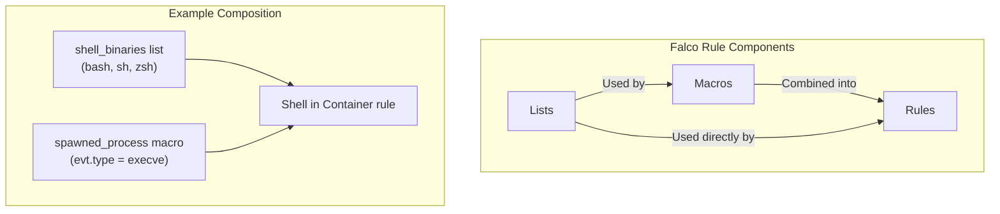
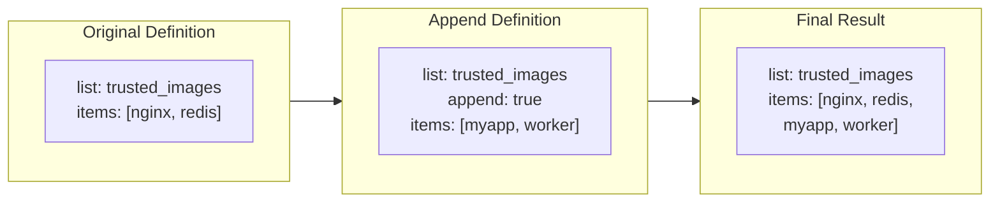
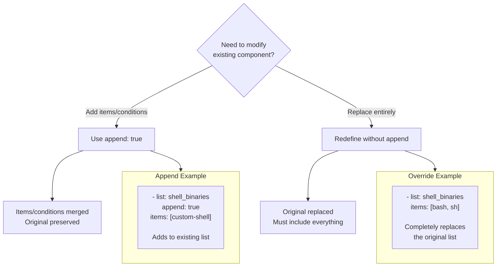
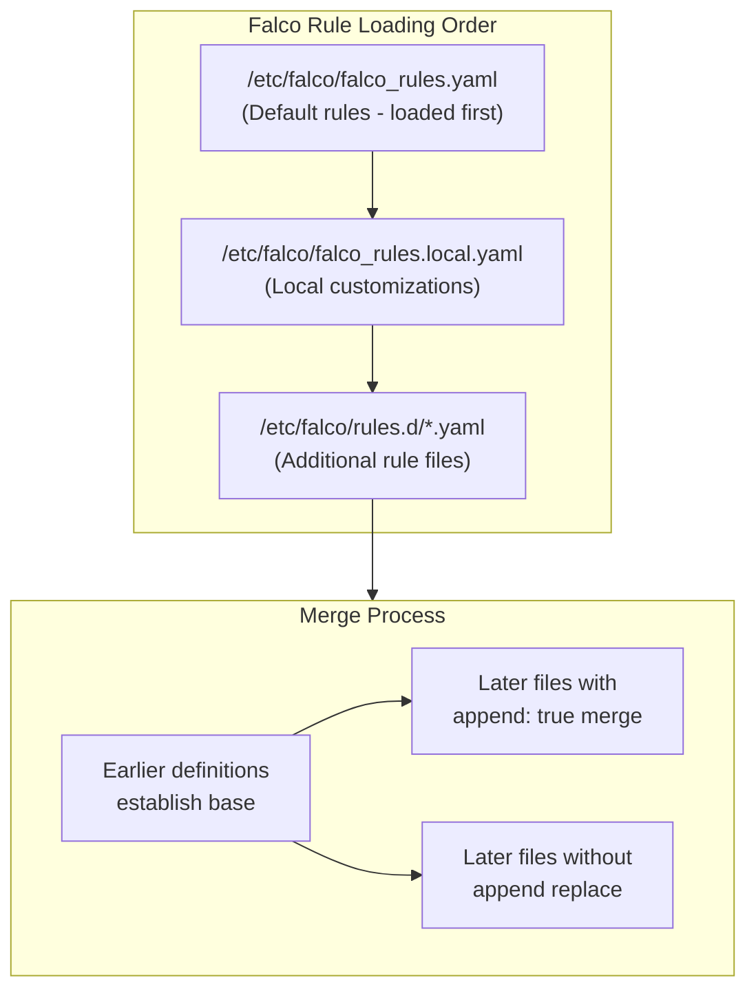

# How to Implement Falco Append Rules

Author: [nawazdhandala](https://github.com/nawazdhandala)

Tags: Falco, Security, Kubernetes, Customization

Description: Learn how to extend and customize Falco rules using the append directive to modify existing detection logic without duplicating rule definitions.

---

Falco ships with a comprehensive set of default rules, but every environment has unique requirements. Rather than copying and modifying entire rules, Falco provides an append mechanism that lets you extend existing rules, macros, and lists cleanly. This approach keeps your customizations separate from upstream rules, making updates painless.

## Understanding Falco Rule Components

Before diving into append rules, you need to understand the three building blocks that make up Falco's detection logic.



### Lists

Lists are named collections of items that you reference in macros and rules.

```yaml
# A list of known shell binaries
- list: shell_binaries
  items: [bash, csh, ksh, sh, tcsh, zsh, dash]
```

### Macros

Macros are reusable condition snippets that simplify complex expressions.

```yaml
# Macro that checks if a shell process was spawned
- macro: spawned_process
  condition: evt.type = execve and evt.dir = <
```

### Rules

Rules combine conditions with output formatting and priority levels.

```yaml
# Rule that detects shells spawned in containers
- rule: Shell Spawned in Container
  desc: Detect shell execution in a container
  condition: spawned_process and container and proc.name in (shell_binaries)
  output: "Shell spawned in container (user=%user.name command=%proc.cmdline)"
  priority: WARNING
```

## The Append Directive

The `append` directive lets you add items to existing lists, extend macro conditions, or modify rule behavior without redefining the entire component.



### Appending to Lists

Add items to existing lists without replacing them.

```yaml
# Original list from default rules
- list: trusted_images
  items: [nginx, redis, postgres]

# Your custom additions (in a separate file)
- list: trusted_images
  append: true
  items:
    - mycompany/api-server      # Add your internal images
    - mycompany/worker-service
    - mycompany/frontend
```

### Appending to Macros

Extend macro conditions using `and` or `or` logic.

```yaml
# Original macro from default rules
- macro: user_known_write_below_etc_activities
  condition: proc.name = confd

# Append additional trusted processes
- macro: user_known_write_below_etc_activities
  append: true
  condition: or proc.name = myconfig-agent or proc.name = vault-agent
```

The final macro condition becomes:

```
proc.name = confd or proc.name = myconfig-agent or proc.name = vault-agent
```

### Appending to Rules

Modify rule conditions to add exceptions or extend detection.

```yaml
# Original rule detects writes to /etc
- rule: Write Below Etc
  desc: Detect writes below /etc directory
  condition: write_etc_common and not user_known_write_below_etc_activities
  output: "File written below /etc (file=%fd.name)"
  priority: WARNING

# Append exceptions for your environment
- rule: Write Below Etc
  append: true
  condition: and not proc.name = my-legitimate-tool
```

## Override vs Append Behavior

Understanding when to use `append: true` versus redefining components is critical.



### When to Override

Override when you need to completely replace a component:

```yaml
# Override the entire list of allowed container images
# This REPLACES the default list entirely
- list: allowed_k8s_containers
  items:
    - mycompany/app:v1.0
    - mycompany/sidecar:latest
```

### When to Append

Append when you want to extend existing behavior:

```yaml
# Add to the default list while keeping original items
- list: allowed_k8s_containers
  append: true
  items:
    - mycompany/app:v1.0
    - mycompany/sidecar:latest
```

## File Ordering for Rule Processing

Falco processes rule files in a specific order, and later files can modify earlier definitions. This ordering is essential for append rules to work correctly.



### Configuring Rule File Order

In your Falco configuration, specify the loading order:

```yaml
# /etc/falco/falco.yaml
rules_file:
  - /etc/falco/falco_rules.yaml           # Default rules (first)
  - /etc/falco/falco_rules.local.yaml     # Local overrides (second)
  - /etc/falco/rules.d                    # Custom rules directory (last)
```

### Best Practice: Separate Files for Custom Rules

Keep your customizations in dedicated files:

```
/etc/falco/
  falco_rules.yaml              # Do not modify (upstream rules)
  falco_rules.local.yaml        # Your overrides and appends
  rules.d/
    custom-lists.yaml           # Environment-specific lists
    custom-macros.yaml          # Environment-specific macros
    app-specific-rules.yaml     # Application-specific rules
```

## Practical Examples

### Example 1: Whitelisting Processes for File Access

Your application legitimately writes to sensitive directories. Instead of disabling the rule, add exceptions.

```yaml
# File: /etc/falco/rules.d/file-access-exceptions.yaml

# Add your application to the list of trusted processes
- list: user_known_write_etc_processes
  append: true
  items:
    - config-reloader       # Sidecar that updates config files
    - cert-manager          # Certificate rotation tool
    - vault-injector        # HashiCorp Vault sidecar

# Extend the macro to include your specific use cases
- macro: user_known_write_below_etc_activities
  append: true
  condition: >
    or (proc.name = config-reloader and fd.name startswith /etc/myapp/)
    or (proc.name = cert-manager and fd.name startswith /etc/ssl/)
```

### Example 2: Extending Network Rules for Microservices

Allow specific internal communications while maintaining security monitoring.

```yaml
# File: /etc/falco/rules.d/network-exceptions.yaml

# Define your internal service ports
- list: internal_service_ports
  append: true
  items: [8080, 8443, 9090, 3000]

# Add known internal services to trusted outbound list
- list: trusted_network_binaries
  append: true
  items:
    - envoy                 # Service mesh proxy
    - linkerd-proxy         # Linkerd sidecar
    - istio-proxy           # Istio sidecar

# Modify rule to exclude legitimate service mesh traffic
- macro: allowed_outbound_connections
  append: true
  condition: >
    or (proc.name = envoy and fd.sport in (internal_service_ports))
    or (proc.name in (trusted_network_binaries) and container.image.repository startswith "mycompany/")
```

### Example 3: Container Image Whitelisting

Maintain a list of approved container images for your organization.

```yaml
# File: /etc/falco/rules.d/approved-images.yaml

# Approved base images from trusted registries
- list: approved_base_images
  items:
    - docker.io/library/alpine
    - docker.io/library/debian
    - gcr.io/distroless/static
    - myregistry.azurecr.io/base-images

# Your application images
- list: approved_app_images
  items:
    - myregistry.azurecr.io/api-service
    - myregistry.azurecr.io/worker
    - myregistry.azurecr.io/frontend

# Macro combining all approved images
- macro: running_approved_image
  condition: >
    container.image.repository in (approved_base_images)
    or container.image.repository in (approved_app_images)

# Rule to detect unapproved images
- rule: Unapproved Container Image Running
  desc: Detect containers running images not in the approved list
  condition: >
    container
    and container.image.repository != ""
    and not running_approved_image
  output: >
    Unapproved container image detected
    (image=%container.image.repository:%container.image.tag
    pod=%k8s.pod.name ns=%k8s.ns.name)
  priority: WARNING
  tags: [container, compliance]
```

### Example 4: Kubernetes-Specific Exceptions

Handle Kubernetes system components that trigger false positives.

```yaml
# File: /etc/falco/rules.d/k8s-exceptions.yaml

# Trusted Kubernetes namespaces
- list: trusted_k8s_namespaces
  items:
    - kube-system
    - kube-public
    - istio-system
    - monitoring
    - cert-manager

# Extend the trusted images list for K8s components
- list: k8s_system_images
  append: true
  items:
    - k8s.gcr.io/kube-apiserver
    - k8s.gcr.io/kube-controller-manager
    - k8s.gcr.io/kube-scheduler
    - k8s.gcr.io/etcd
    - quay.io/coreos/etcd

# Macro for trusted K8s system activity
- macro: k8s_system_activity
  condition: >
    k8s.ns.name in (trusted_k8s_namespaces)
    and container.image.repository in (k8s_system_images)

# Append to rules that generate noise from system components
- rule: Terminal Shell in Container
  append: true
  condition: and not k8s_system_activity

- rule: Read Sensitive File Untrusted
  append: true
  condition: and not k8s_system_activity
```

## Testing Your Append Rules

Validate your rules before deploying to production.

### Dry Run with Falco

```bash
# Test rule syntax without starting the engine
falco --validate /etc/falco/rules.d/custom-rules.yaml

# List all loaded rules and check for conflicts
falco --list=rules

# List all macros
falco --list=macros

# List all lists
falco --list=lists
```

### Generate Test Events

```bash
# Trigger a shell spawn event for testing
kubectl exec -it test-pod -- /bin/bash -c "echo test"

# Check if rule fires or exception applies
kubectl logs -l app=falco -n falco --tail=100
```

### Debug Rule Evaluation

```yaml
# Temporarily set rule to DEBUG priority for testing
- rule: My Custom Rule
  append: true
  priority: DEBUG
```

## Common Pitfalls

### Pitfall 1: Missing Logical Operators

When appending conditions, always include the logical operator:

```yaml
# Wrong - missing operator
- rule: Suspicious Activity
  append: true
  condition: proc.name = myapp    # Error: condition must start with and/or

# Correct - includes operator
- rule: Suspicious Activity
  append: true
  condition: and not proc.name = myapp
```

### Pitfall 2: File Loading Order

Ensure your custom files load after the default rules:

```yaml
# falco.yaml - correct order
rules_file:
  - /etc/falco/falco_rules.yaml      # Base rules first
  - /etc/falco/rules.d/custom.yaml   # Custom rules after
```

### Pitfall 3: Overriding Instead of Appending

Forgetting `append: true` replaces the entire definition:

```yaml
# This REPLACES the shell_binaries list
- list: shell_binaries
  items: [custom-shell]

# This ADDS to the shell_binaries list
- list: shell_binaries
  append: true
  items: [custom-shell]
```

---

Falco append rules give you the flexibility to customize detection without maintaining a fork of upstream rules. By keeping customizations in separate files and using append directives thoughtfully, you can adapt Falco to your environment while preserving the ability to pull in rule updates cleanly. Start with list and macro appends for simple whitelisting, then progress to rule condition modifications as your security requirements evolve.
