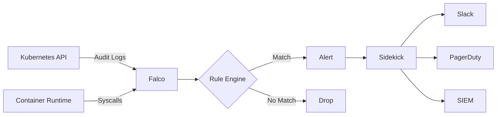

# How to Build Falco Custom Rules Advanced

Author: [nawazdhandala](https://www.github.com/nawazdhandala)

Tags: Falco, Security, Kubernetes, Runtime Security, Container Security

Description: Create custom Falco rules for runtime security detection with syscall filtering, container awareness, and Kubernetes context.

---

Once you have the basics of Falco rules down, the real power comes from building sophisticated detection patterns. This guide dives into advanced techniques like exception handling, performance optimization, output templating, and creating rules that scale across large Kubernetes clusters.

## Understanding Rule Exceptions

Exceptions let you create granular allow-lists without modifying the original rule condition. They keep your rules clean while handling edge cases.

```yaml
# Define a rule with exceptions support
- rule: Shell Spawned in Container
  desc: Detect shell execution inside containers
  condition: >
    spawned_process and
    container and
    proc.name in (bash, sh, zsh, ash, dash)
  output: >
    Shell spawned (user=%user.name container=%container.name
    shell=%proc.name parent=%proc.pname cmdline=%proc.cmdline)
  priority: WARNING
  # Define exception fields that can be used
  exceptions:
    - name: allowed_shells
      # Match on container image and process name combination
      fields: [container.image.repository, proc.name]
    - name: allowed_containers
      # Match on container name only
      fields: [container.name]

# Create exception entries (in a separate file for easier management)
- exception: Shell Spawned in Container
  name: allowed_shells
  values:
    # Allow bash in our debug containers
    - [myregistry.io/debug-tools, bash]
    # Allow sh in init containers
    - [myregistry.io/init-helper, sh]

- exception: Shell Spawned in Container
  name: allowed_containers
  values:
    # CI runner containers need shell access
    - [gitlab-runner]
    - [jenkins-agent]
```

Exceptions are evaluated at rule load time and compiled into efficient lookups. They perform better than adding conditions directly to the rule.

## Advanced Condition Patterns

### Chaining Parent Process Detection

Tracking process ancestry helps identify suspicious execution chains.

```yaml
# Define macros for process chain analysis
- macro: spawned_process
  condition: evt.type = execve and evt.dir = <

# Check parent and grandparent processes
- macro: suspicious_parent_chain
  condition: >
    (proc.pname = bash and proc.aname[2] = sshd) or
    (proc.pname = sh and proc.aname[2] = crond) or
    (proc.pname in (python, python3) and proc.aname[2] = apache2)

# Rule using process chain analysis
- rule: Suspicious Process Chain
  desc: Detect processes spawned through suspicious parent chains
  condition: >
    spawned_process and
    container and
    suspicious_parent_chain and
    proc.name in (curl, wget, nc, ncat)
  output: >
    Suspicious process chain detected
    (proc=%proc.name parent=%proc.pname grandparent=%proc.aname[2]
    container=%container.name cmdline=%proc.cmdline)
  priority: CRITICAL
  tags: [mitre_execution, process_chain]
```

### File Descriptor Filtering

Monitor specific file operations with precision.

```yaml
# Macro for write operations
- macro: write_operation
  condition: >
    (evt.type in (write, writev, pwrite, pwritev) and evt.dir = <) or
    (evt.type in (open, openat) and evt.dir = < and
     evt.arg.flags contains O_WRONLY or evt.arg.flags contains O_RDWR)

# List of sensitive configuration paths
- list: sensitive_config_paths
  items:
    - /etc/passwd
    - /etc/shadow
    - /etc/sudoers
    - /etc/ssh/sshd_config
    - /root/.ssh/authorized_keys

# Rule detecting config file modifications
- rule: Sensitive Config File Modified
  desc: Detect writes to sensitive system configuration files
  condition: >
    write_operation and
    container and
    fd.name in (sensitive_config_paths)
  output: >
    Config file modified
    (file=%fd.name user=%user.name container=%container.name
    proc=%proc.name cmdline=%proc.cmdline)
  priority: CRITICAL
  tags: [filesystem, mitre_persistence]
```

## Performance Optimization Techniques

Falco processes thousands of events per second. Poorly written rules can cause dropped events and high CPU usage.

### Order Conditions by Cost

Place cheap checks before expensive ones. Event type checks are fastest, followed by simple field comparisons, then string operations.

```yaml
# Good: cheap checks first
- rule: Optimized Rule
  condition: >
    evt.type = execve and          # Cheapest - event type filter
    evt.dir = < and                # Cheap - direction check
    container.id != host and       # Cheap - simple comparison
    proc.name = curl and           # Medium - string comparison
    proc.cmdline contains "http"   # Expensive - substring search

# Bad: expensive checks first
- rule: Unoptimized Rule
  condition: >
    proc.cmdline contains "http" and  # Expensive substring first
    container.id != host and
    evt.type = execve and
    proc.name = curl
```

### Use Lists Instead of Multiple OR Conditions

Lists are compiled into hash lookups, which are faster than chained OR conditions.

```yaml
# Good: uses list lookup
- list: network_tools
  items: [curl, wget, nc, ncat, netcat, socat, telnet]

- rule: Network Tool Execution
  condition: >
    spawned_process and
    container and
    proc.name in (network_tools)

# Less efficient: chained OR conditions
- rule: Network Tool Execution Slow
  condition: >
    spawned_process and
    container and
    (proc.name = curl or proc.name = wget or
     proc.name = nc or proc.name = ncat)
```

### Macro Composition for Reuse

Build macros that compose well and avoid redundant checks.

```yaml
# Base macros
- macro: container
  condition: container.id != host

- macro: spawned_process
  condition: evt.type = execve and evt.dir = <

- macro: k8s_pod
  condition: k8s.pod.name != ""

# Composed macro - each base macro is evaluated once
- macro: container_process_spawn
  condition: spawned_process and container

# Use in rules
- rule: Rule One
  condition: container_process_spawn and proc.name = bash

- rule: Rule Two
  condition: container_process_spawn and proc.name = python
```

## Custom Output Formatting

Rich outputs make alerts actionable without needing to query additional systems.

```yaml
# Comprehensive output with Kubernetes context
- rule: Container Drift Detected
  desc: Detect new executables running that were not part of original image
  condition: >
    spawned_process and
    container and
    proc.is_exe_from_memfd = true
  output: >
    Container drift detected - executable from memory
    (
      severity=high
      container_id=%container.id
      container_name=%container.name
      image=%container.image.repository:%container.image.tag
      k8s_namespace=%k8s.ns.name
      k8s_pod=%k8s.pod.name
      k8s_deployment=%k8s.deployment.name
      user=%user.name
      uid=%user.uid
      process=%proc.name
      cmdline=%proc.cmdline
      parent=%proc.pname
      parent_cmdline=%proc.pcmdline
      exe_path=%proc.exepath
      cwd=%proc.cwd
    )
  priority: CRITICAL
  tags: [container_drift, mitre_defense_evasion]
```

### JSON Output for Log Aggregation

Enable JSON output in your Falco configuration for structured logging.

```yaml
# falco.yaml configuration
json_output: true
json_include_output_property: true
json_include_tags_property: true

# Output fields appear as JSON keys
# {"output":"Container drift detected...","priority":"Critical","rule":"Container Drift Detected","tags":["container_drift"]}
```

## Multi-Source Correlation

Falco can correlate syscall events with Kubernetes audit logs for comprehensive detection.



### Combining Syscall and Audit Rules

Create rules that use both sources for context.

```yaml
# Syscall rule - detect exec in container
- rule: Exec in Pod
  desc: Detect process execution in pods
  condition: >
    spawned_process and
    container and
    k8s.pod.name != ""
  output: >
    Process in pod (pod=%k8s.pod.name ns=%k8s.ns.name proc=%proc.name)
  priority: INFO
  source: syscall
  tags: [kubernetes]

# Audit rule - detect kubectl exec command
- rule: Kubectl Exec Audit
  desc: Detect kubectl exec via audit logs
  condition: >
    kevt and
    ka.verb = create and
    ka.target.resource = pods and
    ka.target.subresource = exec
  output: >
    Kubectl exec (user=%ka.user.name pod=%ka.target.name
    ns=%ka.target.namespace)
  priority: NOTICE
  source: k8s_audit
  tags: [kubernetes, exec]
```

## Rule Versioning and Overrides

Manage rule updates across environments without losing customizations.

```yaml
# Override default rule priority
- rule: Terminal Shell in Container
  priority: ERROR  # Increase from WARNING
  append: false    # Replace, don't append

# Disable a rule entirely
- rule: Read Sensitive File Untrusted
  enabled: false

# Append conditions to existing rule
- rule: Write Below Etc
  condition: and not fd.name startswith /etc/nginx
  append: true

# Extend a list from default rules
- list: allowed_k8s_users
  items: [system:serviceaccount:monitoring:prometheus]
  append: true
```

## Testing Advanced Rules

### Capture and Replay

Record live traffic for rule development.

```bash
# Capture syscalls for 5 minutes
sudo falco -c /etc/falco/falco.yaml \
  -w /tmp/capture.scap \
  -M 300

# Test new rules against capture
falco -c /etc/falco/falco.yaml \
  -r /etc/falco/falco_rules.yaml \
  -r ./my_advanced_rules.yaml \
  -e /tmp/capture.scap \
  --stats-interval 10
```

### Rule Statistics

Monitor rule performance in production.

```yaml
# Enable stats in falco.yaml
webserver:
  enabled: true
  listen_port: 8765

metrics:
  enabled: true
  interval: 15s
```

```bash
# Check rule statistics
curl -s localhost:8765/metrics | grep falco_rules
# falco_rules_matches_total{rule="Shell Spawned in Container"} 42
# falco_rules_matches_total{rule="Container Drift Detected"} 3
```

## Deployment Patterns

### GitOps with Helm

Store rules in version control and deploy with Helm.

```yaml
# values.yaml
falco:
  json_output: true
  priority: notice

customRules:
  advanced-rules.yaml: |-
    - macro: company_container
      condition: >
        container.image.repository startswith "gcr.io/mycompany/"

    - rule: Non-Company Container
      desc: Alert on containers from external registries
      condition: >
        spawned_process and
        container and
        not company_container
      output: External container (image=%container.image)
      priority: WARNING

falcosidekick:
  enabled: true
  config:
    slack:
      webhookurl: "https://hooks.slack.com/services/XXX"
      minimumpriority: warning
```

```bash
# Deploy with Helm
helm upgrade --install falco falcosecurity/falco \
  --namespace falco \
  --create-namespace \
  -f values.yaml
```

## Wrapping Up

Advanced Falco rules give you the detection capabilities needed for production Kubernetes security. Focus on exception-based allow-listing to reduce noise, optimize condition ordering for performance, and use rich outputs for faster incident response.

Start with the patterns in this guide, test them against captured traffic, and iterate based on your environment. The goal is catching real threats while keeping false positives manageable.

**[OneUptime](https://oneuptime.com)** provides unified observability that integrates with Falco alerts, giving you runtime security events alongside metrics and logs in a single dashboard.
