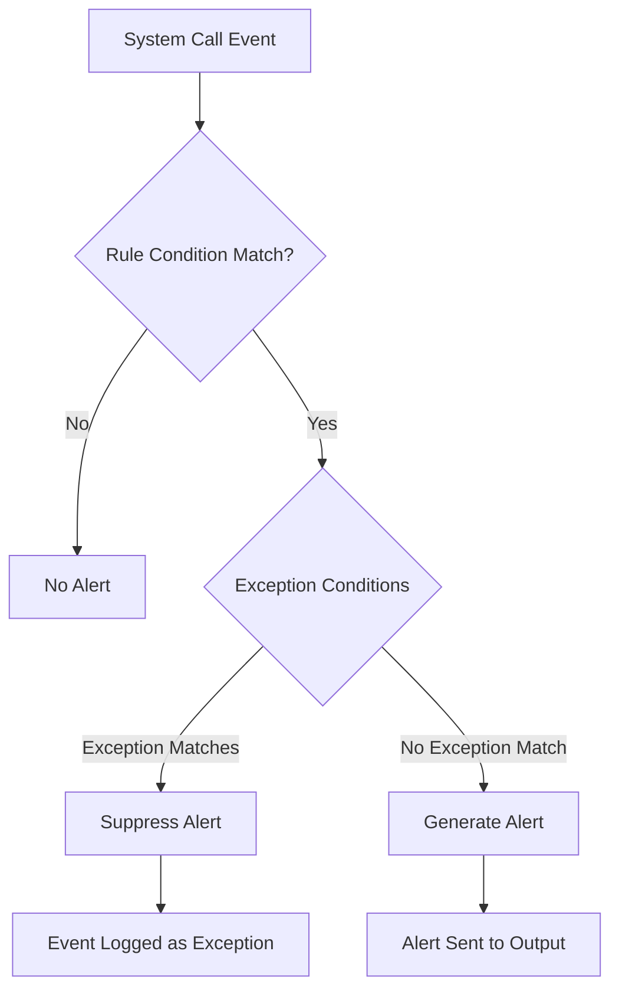
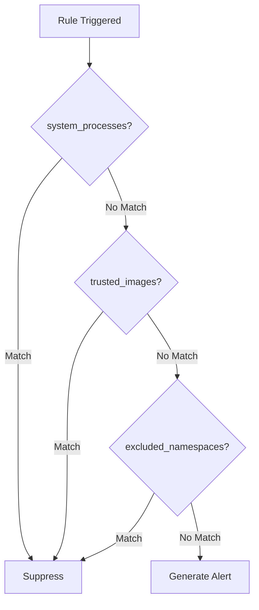

# How to Build Falco Exceptions

Author: [nawazdhandala](https://github.com/nawazdhandala)

Tags: Falco, Security, Kubernetes, Tuning

Description: Learn how to create Falco exceptions to reduce false positives and fine-tune runtime security rules for your Kubernetes workloads.

---

Falco is a powerful runtime security tool, but out-of-the-box rules generate noise. Legitimate operations trigger alerts. Your on-call engineers start ignoring them. That defeats the purpose of runtime security. Exceptions let you suppress known-good behavior without disabling entire rules.

## Understanding Falco Rule Structure

Before creating exceptions, you need to understand how Falco rules work.

```yaml
# A basic Falco rule has three main parts
- rule: Write below etc
  desc: Detect writes below /etc directory
  condition: >
    open_write and
    fd.name startswith /etc and
    not proc.name in (systemd, cloud-init)
  output: >
    File below /etc opened for writing
    (file=%fd.name user=%user.name command=%proc.cmdline)
  priority: WARNING
  tags: [filesystem, mitre_persistence]
```

The key components are:

- **rule**: The name of the rule (used to reference it in exceptions)
- **condition**: The filter expression that triggers the alert
- **output**: What gets logged when the rule fires
- **priority**: Severity level (DEBUG, INFO, NOTICE, WARNING, ERROR, CRITICAL, ALERT, EMERGENCY)

## What Are Falco Exceptions?

Exceptions provide a structured way to add conditions that prevent a rule from firing. Instead of modifying the original rule condition, you define exceptions separately.



## Exception Syntax and Structure

Exceptions are defined within the rule using the `exceptions` field. Each exception has a name, fields to match, and comparison operators.

### Basic Exception Format

```yaml
- rule: Write below etc
  desc: Detect writes below /etc directory
  condition: >
    open_write and
    fd.name startswith /etc
  output: >
    File below /etc opened for writing
    (file=%fd.name user=%user.name command=%proc.cmdline)
  priority: WARNING
  exceptions:
    # Define the exception structure
    - name: known_etc_writers
      fields: [proc.name, fd.name]
      comps: [=, startswith]
```

### Applying Exception Values

Once you define the exception structure, you apply values using `append`:

```yaml
- rule: Write below etc
  exceptions:
    - name: known_etc_writers
      values:
        # Process name equals "etcd" AND file starts with "/etc/kubernetes"
        - [etcd, /etc/kubernetes]
        # Process name equals "kubelet" AND file starts with "/etc/kubernetes"
        - [kubelet, /etc/kubernetes]
        # Process name equals "dockerd" AND file starts with "/etc/docker"
        - [dockerd, /etc/docker]
```

## Field-Based Exception Conditions

Falco supports many fields for building precise exceptions. Here are the most commonly used ones.

### Process Fields

```yaml
exceptions:
  - name: by_process
    fields: [proc.name]          # Process name
    comps: [=]
    values:
      - [nginx]
      - [postgres]

  - name: by_process_path
    fields: [proc.exepath]       # Full executable path
    comps: [=]
    values:
      - [/usr/sbin/nginx]
      - [/usr/lib/postgresql/14/bin/postgres]

  - name: by_cmdline
    fields: [proc.cmdline]       # Full command line
    comps: [contains]
    values:
      - [--config=/etc/myapp/config.yaml]
```

### Container Fields

```yaml
exceptions:
  - name: by_container
    fields: [container.image.repository]
    comps: [=]
    values:
      - [docker.io/library/nginx]
      - [gcr.io/my-project/my-app]

  - name: by_container_name
    fields: [container.name]
    comps: [startswith]
    values:
      - [prometheus-]
      - [grafana-]

  - name: by_namespace
    fields: [k8s.ns.name]
    comps: [=]
    values:
      - [kube-system]
      - [monitoring]
```

### File and Network Fields

```yaml
exceptions:
  - name: by_file_path
    fields: [fd.name]
    comps: [startswith]
    values:
      - [/var/log/]
      - [/tmp/build-]

  - name: by_network
    fields: [fd.sip, fd.sport]   # Source IP and port
    comps: [=, =]
    values:
      - [10.0.0.1, 443]
      - [10.0.0.2, 8080]
```

## Comparison Operators

Falco supports several comparison operators for exceptions:

| Operator | Description | Example |
|----------|-------------|---------|
| `=` | Exact match | `proc.name = nginx` |
| `!=` | Not equal | `proc.name != bash` |
| `in` | Match any in list | `proc.name in (nginx, apache)` |
| `startswith` | String prefix | `fd.name startswith /etc` |
| `endswith` | String suffix | `fd.name endswith .conf` |
| `contains` | Substring match | `proc.cmdline contains --debug` |
| `glob` | Glob pattern | `fd.name glob /var/log/*.log` |
| `pmatch` | Prefix match list | `fd.name pmatch (/etc, /var)` |

```yaml
# Example using different operators
exceptions:
  - name: complex_exception
    fields: [proc.name, fd.name, k8s.ns.name]
    comps: [in, glob, =]
    values:
      # Match nginx or apache writing to any .conf file in production namespace
      - [[nginx, apache], /etc/**/*.conf, production]
```

## Combining Multiple Exception Conditions

You can create multiple named exceptions within a single rule. Each exception is evaluated independently, and the alert is suppressed if any exception matches.

```yaml
- rule: Sensitive file opened for reading
  desc: Detect reads of sensitive files
  condition: >
    open_read and
    fd.name in (/etc/shadow, /etc/passwd, /etc/sudoers)
  output: >
    Sensitive file opened (file=%fd.name user=%user.name proc=%proc.name)
  priority: WARNING
  exceptions:
    # Exception 1: Known system processes
    - name: system_processes
      fields: [proc.name]
      comps: [in]
      values:
        - [[sshd, sudo, su, login, passwd]]

    # Exception 2: Specific container images
    - name: trusted_images
      fields: [container.image.repository, fd.name]
      comps: [=, =]
      values:
        - [my-registry/auth-service, /etc/passwd]
        - [my-registry/user-service, /etc/passwd]

    # Exception 3: Entire namespace exclusion
    - name: excluded_namespaces
      fields: [k8s.ns.name]
      comps: [in]
      values:
        - [[kube-system, istio-system]]
```



## Using AND Logic Within Exceptions

When you specify multiple fields in a single exception, they use AND logic. All fields must match for the exception to apply.

```yaml
exceptions:
  - name: specific_container_and_path
    # ALL of these must match
    fields: [container.image.repository, proc.name, fd.name]
    comps: [=, =, startswith]
    values:
      # Container is nginx AND process is nginx AND file starts with /etc/nginx
      - [docker.io/library/nginx, nginx, /etc/nginx]
```

## Using OR Logic Across Values

Multiple values within the same exception use OR logic. Any matching value set triggers the exception.

```yaml
exceptions:
  - name: multiple_allowed_scenarios
    fields: [proc.name, fd.name]
    comps: [=, startswith]
    values:
      # Match: etcd writing to /etc/kubernetes OR
      - [etcd, /etc/kubernetes]
      # Match: kubelet writing to /etc/kubernetes OR
      - [kubelet, /etc/kubernetes]
      # Match: containerd writing to /etc/containerd
      - [containerd, /etc/containerd]
```

## Practical Examples

### Example 1: Terminal Shell in Container

The default rule fires whenever a shell runs in a container. This catches legitimate debugging and CI/CD operations.

```yaml
# Original rule that generates noise
- rule: Terminal shell in container
  desc: A shell was used as the entrypoint/exec point into a container
  condition: >
    spawned_process and
    container and
    shell_procs and
    proc.tty != 0
  output: >
    Shell running in container
    (container=%container.name shell=%proc.name parent=%proc.pname)
  priority: NOTICE

# Add exceptions for legitimate use cases
- rule: Terminal shell in container
  exceptions:
    # Allow shells in CI runner containers
    - name: ci_runners
      fields: [container.image.repository]
      comps: [contains]
      values:
        - [gitlab-runner]
        - [github-actions-runner]
        - [jenkins-agent]

    # Allow shells in debug/dev namespaces
    - name: dev_namespaces
      fields: [k8s.ns.name]
      comps: [in]
      values:
        - [[dev, staging, debug]]

    # Allow specific debug containers
    - name: debug_containers
      fields: [container.name]
      comps: [startswith]
      values:
        - [debug-]
        - [kubectl-debug-]
```

### Example 2: Outbound Connection to Unexpected Port

```yaml
- rule: Unexpected outbound connection
  desc: Detect outbound connections to non-standard ports
  condition: >
    outbound and
    fd.sport not in (80, 443, 53) and
    container
  output: >
    Unexpected outbound connection
    (command=%proc.cmdline connection=%fd.name container=%container.name)
  priority: WARNING
  exceptions:
    # Database connections
    - name: database_ports
      fields: [fd.sport, proc.name]
      comps: [=, in]
      values:
        - [5432, [psql, postgres, pgbouncer]]  # PostgreSQL
        - [3306, [mysql, mysqld]]              # MySQL
        - [6379, [redis-cli, redis-server]]    # Redis
        - [27017, [mongosh, mongod]]           # MongoDB

    # Internal service mesh communication
    - name: service_mesh
      fields: [fd.sport, k8s.ns.name]
      comps: [in, =]
      values:
        - [[15001, 15006, 15090], istio-system]

    # Prometheus metrics scraping
    - name: prometheus_scrape
      fields: [fd.sport, container.image.repository]
      comps: [in, contains]
      values:
        - [[9090, 9091, 9093, 9094], prometheus]
```

### Example 3: Package Management in Container

```yaml
- rule: Package management process launched in container
  desc: Detect package manager execution in containers
  condition: >
    spawned_process and
    container and
    package_mgmt_procs
  output: >
    Package management process launched
    (command=%proc.cmdline container=%container.name)
  priority: WARNING
  exceptions:
    # Allow during build phase only (detected by parent process)
    - name: build_processes
      fields: [proc.pname]
      comps: [in]
      values:
        - [[docker-build, buildah, kaniko, buildkit]]

    # Allow in init containers (naming convention)
    - name: init_containers
      fields: [container.name]
      comps: [startswith]
      values:
        - [init-]

    # Allow in specific build images
    - name: build_images
      fields: [container.image.repository]
      comps: [endswith]
      values:
        - [-builder]
        - [-build]
        - [/builder]
```

## Exception File Organization

For maintainability, organize exceptions in separate files from rules.

### Directory Structure

```
/etc/falco/
  falco.yaml              # Main config
  falco_rules.yaml        # Default Falco rules
  rules.d/
    custom_rules.yaml     # Your custom rules
    exceptions/
      containers.yaml     # Container-specific exceptions
      namespaces.yaml     # Namespace exclusions
      processes.yaml      # Process-based exceptions
```

### Loading Exception Files

```yaml
# falco.yaml
rules_file:
  - /etc/falco/falco_rules.yaml
  - /etc/falco/rules.d/custom_rules.yaml
  - /etc/falco/rules.d/exceptions/containers.yaml
  - /etc/falco/rules.d/exceptions/namespaces.yaml
  - /etc/falco/rules.d/exceptions/processes.yaml
```

### Namespace Exception File Example

```yaml
# exceptions/namespaces.yaml
# Suppress noisy rules in system namespaces

- rule: Terminal shell in container
  exceptions:
    - name: system_namespaces
      fields: [k8s.ns.name]
      comps: [in]
      values:
        - [[kube-system, kube-public, istio-system, cert-manager]]

- rule: Write below etc
  exceptions:
    - name: system_namespaces
      fields: [k8s.ns.name]
      comps: [in]
      values:
        - [[kube-system]]

- rule: Read sensitive file untrusted
  exceptions:
    - name: system_namespaces
      fields: [k8s.ns.name]
      comps: [in]
      values:
        - [[kube-system, monitoring]]
```

## Best Practices for Exception Management

### 1. Start Narrow, Expand Carefully

Begin with the most specific exception possible, then widen only if necessary.

```yaml
# Bad: Too broad
exceptions:
  - name: all_nginx
    fields: [proc.name]
    comps: [=]
    values:
      - [nginx]

# Good: Specific to context
exceptions:
  - name: nginx_in_production
    fields: [proc.name, k8s.ns.name, fd.name]
    comps: [=, =, startswith]
    values:
      - [nginx, production, /etc/nginx]
```

### 2. Document Every Exception

```yaml
exceptions:
  # TICKET: SEC-1234
  # REASON: Prometheus needs to read /etc/passwd for user ID resolution
  # APPROVED BY: Security Team (2024-01-15)
  # REVIEW DATE: 2024-07-15
  - name: prometheus_passwd_read
    fields: [container.image.repository, fd.name]
    comps: [contains, =]
    values:
      - [prometheus, /etc/passwd]
```

### 3. Use Version Control

Track all exception changes in Git with meaningful commit messages:

```bash
git commit -m "Add exception for prometheus /etc/passwd reads

Ticket: SEC-1234
Prometheus requires reading /etc/passwd for UID resolution
in its process discovery. This is expected behavior.

Approved by: @security-team"
```

### 4. Review Exceptions Regularly

Create a review schedule and process:

```yaml
# Add metadata for review tracking
# REVIEW_SCHEDULE: quarterly
# LAST_REVIEW: 2024-01-15
# NEXT_REVIEW: 2024-04-15
# OWNER: platform-team
```

### 5. Test Exceptions Before Production

```bash
# Run Falco in dry-run mode with new exceptions
falco -r /etc/falco/falco_rules.yaml \
      -r /etc/falco/rules.d/exceptions/new_exceptions.yaml \
      --dry-run

# Use falco-event-generator to test specific scenarios
docker run -it --rm falcosecurity/event-generator run syscall --all
```

### 6. Monitor Exception Effectiveness

Track how many alerts are suppressed vs generated:

```yaml
# In falco.yaml, enable metrics
webserver:
  enabled: true
  listen_port: 8765
metrics:
  enabled: true
```

```bash
# Query Falco metrics
curl http://localhost:8765/metrics | grep falco_rules
```

## Debugging Exceptions

### Check If Exceptions Are Loaded

```bash
# Start Falco with verbose output
falco -v

# Look for exception loading messages
# "Loading rule with X exceptions"
```

### Test Exception Matching

```bash
# Generate a test event
kubectl exec -it test-pod -- cat /etc/shadow

# Check Falco logs for the event
# If no alert appears, exception is working
# If alert appears, exception is not matching

# Run with debug output
falco -o "log_level=debug"
```

### Common Exception Issues

**Exception not matching:**
- Field name typo (check exact field names in Falco docs)
- Comparison operator mismatch
- Value format incorrect (lists need double brackets for "in" operator)

**Exception too broad:**
- Use more specific fields
- Add container or namespace constraints
- Combine multiple fields with AND logic

```yaml
# Debug: Log when exceptions match
- rule: Debug exception matching
  desc: Temporary rule to verify exceptions
  condition: >
    spawned_process and container
  output: >
    Process spawned (proc=%proc.name ns=%k8s.ns.name img=%container.image.repository)
  priority: DEBUG
  enabled: true
```

## Exception Anti-Patterns

### Avoid: Blanket Namespace Exclusions

```yaml
# Bad: Excludes all alerts from kube-system
exceptions:
  - name: exclude_kubesystem
    fields: [k8s.ns.name]
    comps: [=]
    values:
      - [kube-system]
```

Attackers target kube-system because of elevated privileges. Exclude specific, known behaviors instead.

### Avoid: Process Name Only Exceptions

```yaml
# Bad: Any process named "python" is excluded
exceptions:
  - name: python_allowed
    fields: [proc.name]
    comps: [=]
    values:
      - [python]
```

Attackers can rename malicious binaries. Always combine with additional context.

### Avoid: Overly Complex Exceptions

If an exception requires more than 4 fields, consider if the original rule needs adjustment instead.

---

Falco exceptions are essential for running runtime security in production without drowning in false positives. Start with the default rules, observe what triggers in your environment, and add precise exceptions for legitimate behavior. Keep exceptions narrow, documented, and reviewed. The goal is to reduce noise while maintaining visibility into actual threats.
