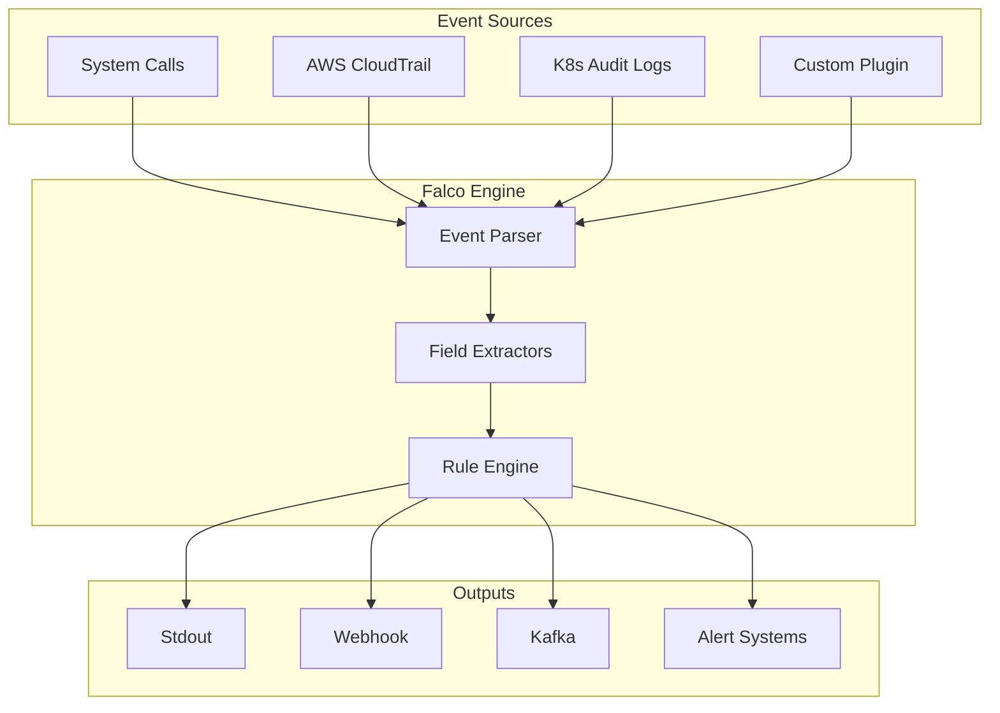
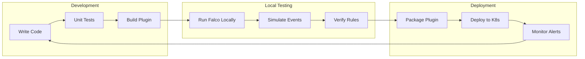

# How to Implement Falco Plugins Development

Author: [nawazdhandala](https://github.com/nawazdhandala)

Tags: Falco, Security, Kubernetes, Go, Cloud Native, Runtime Security

Description: A comprehensive guide to building custom Falco plugins in Go, enabling you to extend runtime security detection with custom event sources and field extractors.

---

Falco is the cloud-native runtime security tool that detects unexpected behavior in your applications. While it ships with powerful built-in capabilities, plugins let you extend Falco to ingest events from any source and extract custom fields for your security rules.

## Understanding Falco Plugin Architecture

Falco plugins come in two types: event sources that generate events and field extractors that parse data from events.



### Plugin Types

| Type | Purpose | Example |
|------|---------|---------|
| Source Plugin | Generates events from external systems | AWS CloudTrail, GitHub Audit |
| Extractor Plugin | Parses fields from event data | JSON field extraction |
| Source + Extractor | Both generates and parses events | Most common pattern |

## Setting Up Your Development Environment

### Prerequisites

You need Go 1.21 or later and the Falco plugin SDK.

```bash
# Verify Go installation
go version

# Create a new plugin project
mkdir falco-github-plugin && cd falco-github-plugin
go mod init github.com/myorg/falco-github-plugin

# Add the Falco plugin SDK
go get github.com/falcosecurity/plugin-sdk-go@latest
```

### Project Structure

A well-organized plugin project looks like this:

```
falco-github-plugin/
├── go.mod
├── go.sum
├── main.go              # Plugin entry point
├── pkg/
│   └── github/
│       ├── plugin.go    # Plugin implementation
│       ├── source.go    # Event source logic
│       ├── extract.go   # Field extraction
│       └── config.go    # Configuration handling
├── rules/
│   └── github_rules.yaml
└── Makefile
```

## Building Your First Plugin

Let us build a plugin that monitors GitHub webhook events for security-relevant activity.

### Define the Plugin Structure

Create the main plugin file that defines capabilities and metadata.

```go
// pkg/github/plugin.go
package github

import (
    "github.com/falcosecurity/plugin-sdk-go/pkg/sdk"
    "github.com/falcosecurity/plugin-sdk-go/pkg/sdk/plugins"
    "github.com/falcosecurity/plugin-sdk-go/pkg/sdk/plugins/source"
    "github.com/falcosecurity/plugin-sdk-go/pkg/sdk/plugins/extractor"
)

// Plugin name and version constants
const (
    PluginID          uint32 = 999
    PluginName        string = "github"
    PluginDescription string = "Monitors GitHub webhook events for security detection"
    PluginContact     string = "https://github.com/myorg/falco-github-plugin"
    PluginVersion     string = "0.1.0"
    EventSourceName   string = "github"
)

// GitHubPlugin implements the Falco plugin interface
type GitHubPlugin struct {
    plugins.BasePlugin
    config GitHubConfig
}

// GitHubConfig holds plugin configuration
type GitHubConfig struct {
    WebhookSecret string `json:"webhook_secret" jsonschema:"title=Webhook Secret,description=GitHub webhook secret for signature validation"`
    ListenAddr    string `json:"listen_addr" jsonschema:"title=Listen Address,description=Address to listen for webhooks,default=:8080"`
    BufferSize    int    `json:"buffer_size" jsonschema:"title=Buffer Size,description=Event buffer size,default=1000"`
}

// Info returns plugin metadata required by Falco
func (p *GitHubPlugin) Info() *plugins.Info {
    return &plugins.Info{
        ID:          PluginID,
        Name:        PluginName,
        Description: PluginDescription,
        Contact:     PluginContact,
        Version:     PluginVersion,
        EventSource: EventSourceName,
    }
}

// Init initializes the plugin with configuration
func (p *GitHubPlugin) Init(cfg string) error {
    // Set defaults
    p.config = GitHubConfig{
        ListenAddr: ":8080",
        BufferSize: 1000,
    }

    // Parse JSON configuration from Falco
    return json.Unmarshal([]byte(cfg), &p.config)
}

// InitSchema returns the JSON schema for configuration validation
func (p *GitHubPlugin) InitSchema() *sdk.SchemaInfo {
    reflector := jsonschema.Reflector{
        RequiredFromJSONSchemaTags: true,
    }
    schema := reflector.Reflect(&GitHubConfig{})

    if schemaJSON, err := json.Marshal(schema); err == nil {
        return &sdk.SchemaInfo{
            Schema: string(schemaJSON),
        }
    }
    return nil
}
```

### Implement the Event Source

The event source receives GitHub webhooks and converts them to Falco events.

```go
// pkg/github/source.go
package github

import (
    "context"
    "encoding/json"
    "io"
    "net/http"
    "time"

    "github.com/falcosecurity/plugin-sdk-go/pkg/sdk"
    "github.com/falcosecurity/plugin-sdk-go/pkg/sdk/plugins/source"
)

// GitHubInstance holds per-capture state
type GitHubInstance struct {
    source.BaseInstance
    eventChan chan []byte
    server    *http.Server
    ctx       context.Context
    cancel    context.CancelFunc
}

// GitHubEvent represents a GitHub webhook event
type GitHubEvent struct {
    Timestamp   time.Time              `json:"timestamp"`
    EventType   string                 `json:"event_type"`
    Action      string                 `json:"action"`
    Repository  string                 `json:"repository"`
    Sender      string                 `json:"sender"`
    RawPayload  map[string]interface{} `json:"raw_payload"`
}

// Open creates a new capture instance
func (p *GitHubPlugin) Open(params string) (source.Instance, error) {
    ctx, cancel := context.WithCancel(context.Background())

    instance := &GitHubInstance{
        eventChan: make(chan []byte, p.config.BufferSize),
        ctx:       ctx,
        cancel:    cancel,
    }

    // Start HTTP server for webhooks
    mux := http.NewServeMux()
    mux.HandleFunc("/webhook", instance.handleWebhook(p.config.WebhookSecret))

    instance.server = &http.Server{
        Addr:    p.config.ListenAddr,
        Handler: mux,
    }

    go func() {
        if err := instance.server.ListenAndServe(); err != http.ErrServerClosed {
            // Log error but don't panic
        }
    }()

    return instance, nil
}

// handleWebhook processes incoming GitHub webhooks
func (i *GitHubInstance) handleWebhook(secret string) http.HandlerFunc {
    return func(w http.ResponseWriter, r *http.Request) {
        // Validate webhook signature if secret is configured
        if secret != "" {
            signature := r.Header.Get("X-Hub-Signature-256")
            if !validateSignature(r, signature, secret) {
                http.Error(w, "Invalid signature", http.StatusUnauthorized)
                return
            }
        }

        body, err := io.ReadAll(r.Body)
        if err != nil {
            http.Error(w, "Failed to read body", http.StatusBadRequest)
            return
        }
        defer r.Body.Close()

        // Parse the raw payload
        var payload map[string]interface{}
        if err := json.Unmarshal(body, &payload); err != nil {
            http.Error(w, "Invalid JSON", http.StatusBadRequest)
            return
        }

        // Create structured event
        event := GitHubEvent{
            Timestamp:  time.Now(),
            EventType:  r.Header.Get("X-GitHub-Event"),
            RawPayload: payload,
        }

        // Extract common fields
        if action, ok := payload["action"].(string); ok {
            event.Action = action
        }
        if repo, ok := payload["repository"].(map[string]interface{}); ok {
            if name, ok := repo["full_name"].(string); ok {
                event.Repository = name
            }
        }
        if sender, ok := payload["sender"].(map[string]interface{}); ok {
            if login, ok := sender["login"].(string); ok {
                event.Sender = login
            }
        }

        eventBytes, _ := json.Marshal(event)

        select {
        case i.eventChan <- eventBytes:
            w.WriteHeader(http.StatusOK)
        default:
            http.Error(w, "Buffer full", http.StatusServiceUnavailable)
        }
    }
}

// NextBatch returns the next batch of events
func (i *GitHubInstance) NextBatch(pState sdk.PluginState, evts sdk.EventWriters) (int, error) {
    evt := evts.Get(0)

    select {
    case <-i.ctx.Done():
        return 0, sdk.ErrEOF
    case eventData := <-i.eventChan:
        evt.SetTimestamp(uint64(time.Now().UnixNano()))
        _, err := evt.Writer().Write(eventData)
        if err != nil {
            return 0, err
        }
        return 1, nil
    case <-time.After(100 * time.Millisecond):
        return 0, sdk.ErrTimeout
    }
}

// Close shuts down the capture instance
func (i *GitHubInstance) Close() {
    i.cancel()
    if i.server != nil {
        ctx, cancel := context.WithTimeout(context.Background(), 5*time.Second)
        defer cancel()
        i.server.Shutdown(ctx)
    }
}
```

### Implement Field Extractors

Field extractors let Falco rules reference specific data from your events.

```go
// pkg/github/extract.go
package github

import (
    "encoding/json"
    "io"

    "github.com/falcosecurity/plugin-sdk-go/pkg/sdk"
)

// Define extractable fields that can be used in Falco rules
var fields = []sdk.FieldEntry{
    {Type: "string", Name: "github.event_type", Desc: "Type of GitHub event (push, pull_request, etc.)"},
    {Type: "string", Name: "github.action", Desc: "Action performed (created, deleted, etc.)"},
    {Type: "string", Name: "github.repository", Desc: "Full repository name (owner/repo)"},
    {Type: "string", Name: "github.sender", Desc: "User who triggered the event"},
    {Type: "string", Name: "github.branch", Desc: "Branch name for push/PR events"},
    {Type: "uint64", Name: "github.commits_count", Desc: "Number of commits in push event"},
    {Type: "string", Name: "github.pr.title", Desc: "Pull request title"},
    {Type: "string", Name: "github.pr.state", Desc: "Pull request state"},
    {Type: "string", Name: "github.pr.merged_by", Desc: "User who merged the PR"},
    {Type: "string", Name: "github.member.permission", Desc: "Permission level for member events"},
    {Type: "string", Name: "github.org", Desc: "Organization name"},
}

// Fields returns the list of extractable fields
func (p *GitHubPlugin) Fields() []sdk.FieldEntry {
    return fields
}

// Extract extracts field values from an event
func (p *GitHubPlugin) Extract(req sdk.ExtractRequest, evt sdk.EventReader) error {
    // Read and parse the event data
    data, err := io.ReadAll(evt.Reader())
    if err != nil {
        return err
    }

    var event GitHubEvent
    if err := json.Unmarshal(data, &event); err != nil {
        return err
    }

    // Extract the requested field
    switch req.Field() {
    case "github.event_type":
        req.SetValue(event.EventType)

    case "github.action":
        req.SetValue(event.Action)

    case "github.repository":
        req.SetValue(event.Repository)

    case "github.sender":
        req.SetValue(event.Sender)

    case "github.branch":
        branch := extractNestedString(event.RawPayload, "ref")
        req.SetValue(branch)

    case "github.commits_count":
        if commits, ok := event.RawPayload["commits"].([]interface{}); ok {
            req.SetValue(uint64(len(commits)))
        }

    case "github.pr.title":
        title := extractNestedString(event.RawPayload, "pull_request", "title")
        req.SetValue(title)

    case "github.pr.state":
        state := extractNestedString(event.RawPayload, "pull_request", "state")
        req.SetValue(state)

    case "github.pr.merged_by":
        mergedBy := extractNestedString(event.RawPayload, "pull_request", "merged_by", "login")
        req.SetValue(mergedBy)

    case "github.member.permission":
        permission := extractNestedString(event.RawPayload, "membership", "permission")
        req.SetValue(permission)

    case "github.org":
        org := extractNestedString(event.RawPayload, "organization", "login")
        req.SetValue(org)
    }

    return nil
}

// extractNestedString safely extracts a string from nested maps
func extractNestedString(data map[string]interface{}, keys ...string) string {
    current := data
    for i, key := range keys {
        if i == len(keys)-1 {
            if val, ok := current[key].(string); ok {
                return val
            }
            return ""
        }
        if next, ok := current[key].(map[string]interface{}); ok {
            current = next
        } else {
            return ""
        }
    }
    return ""
}
```

### Create the Plugin Entry Point

The main file registers the plugin with Falco.

```go
// main.go
package main

import (
    "github.com/falcosecurity/plugin-sdk-go/pkg/sdk/plugins"
    "github.com/falcosecurity/plugin-sdk-go/pkg/sdk/plugins/extractor"
    "github.com/falcosecurity/plugin-sdk-go/pkg/sdk/plugins/source"

    "github.com/myorg/falco-github-plugin/pkg/github"
)

func init() {
    // Register the plugin with all its capabilities
    plugins.SetFactory(func() plugins.Plugin {
        p := &github.GitHubPlugin{}

        // Enable source capability (generates events)
        source.Register(p)

        // Enable extractor capability (parses fields)
        extractor.Register(p)

        return p
    })
}

func main() {}
```

## Writing Falco Rules for Your Plugin

Create rules that use your custom fields to detect security-relevant events.

```yaml
# rules/github_rules.yaml

# Detect when repository visibility changes
- rule: GitHub Repository Made Public
  desc: A private repository was changed to public visibility
  condition: >
    github.event_type = "repository" and
    github.action = "publicized"
  output: >
    Repository made public
    (repo=%github.repository user=%github.sender)
  priority: WARNING
  source: github
  tags: [github, data_exposure]

# Detect force pushes to protected branches
- rule: GitHub Force Push to Main Branch
  desc: Force push detected to main or master branch
  condition: >
    github.event_type = "push" and
    (github.branch = "refs/heads/main" or github.branch = "refs/heads/master") and
    json.value[/forced] = "true"
  output: >
    Force push to protected branch
    (repo=%github.repository branch=%github.branch user=%github.sender)
  priority: CRITICAL
  source: github
  tags: [github, code_integrity]

# Detect new admin collaborators
- rule: GitHub Admin Collaborator Added
  desc: A user was granted admin access to a repository
  condition: >
    github.event_type = "member" and
    github.action = "added" and
    github.member.permission = "admin"
  output: >
    Admin collaborator added
    (repo=%github.repository user=%github.sender)
  priority: WARNING
  source: github
  tags: [github, access_control]

# Detect organization membership changes
- rule: GitHub Org Member Removed
  desc: A member was removed from the organization
  condition: >
    github.event_type = "organization" and
    github.action = "member_removed"
  output: >
    Organization member removed
    (org=%github.org user=%github.sender)
  priority: NOTICE
  source: github
  tags: [github, access_control]

# Detect branch protection rule changes
- rule: GitHub Branch Protection Disabled
  desc: Branch protection rules were deleted
  condition: >
    github.event_type = "branch_protection_rule" and
    github.action = "deleted"
  output: >
    Branch protection rule deleted
    (repo=%github.repository user=%github.sender)
  priority: CRITICAL
  source: github
  tags: [github, security_config]

# Detect suspicious PR merges
- rule: GitHub Large PR Merged Without Review
  desc: A pull request with many changes was merged quickly
  condition: >
    github.event_type = "pull_request" and
    github.action = "closed" and
    github.pr.state = "merged"
  output: >
    Pull request merged
    (repo=%github.repository title=%github.pr.title merged_by=%github.pr.merged_by)
  priority: INFO
  source: github
  tags: [github, code_review]
```

## Building and Testing Your Plugin

### Create the Makefile

```makefile
# Makefile
PLUGIN_NAME := github
PLUGIN_VERSION := 0.1.0

.PHONY: build test clean install

build:
	go build -buildmode=c-shared -o lib$(PLUGIN_NAME).so .

test:
	go test -v ./...

clean:
	rm -f lib$(PLUGIN_NAME).so

install: build
	mkdir -p ~/.falco/plugins
	cp lib$(PLUGIN_NAME).so ~/.falco/plugins/
	cp rules/github_rules.yaml ~/.falco/rules.d/

lint:
	golangci-lint run ./...
```

### Build the Plugin

```bash
# Build the shared library
make build

# Verify the output
file libgithub.so
# Output: libgithub.so: Mach-O 64-bit dynamically linked shared library arm64
```

### Configure Falco to Load Your Plugin

Update your Falco configuration to load the plugin.

```yaml
# falco.yaml
plugins:
  - name: github
    library_path: /home/user/.falco/plugins/libgithub.so
    init_config:
      webhook_secret: "your-github-webhook-secret"
      listen_addr: ":8080"
      buffer_size: 1000

load_plugins: [github]

rules_file:
  - /etc/falco/falco_rules.yaml
  - /home/user/.falco/rules.d/github_rules.yaml
```

### Test Locally

Run Falco with your plugin and send test events.

```bash
# Start Falco with the plugin
sudo falco -c falco.yaml

# In another terminal, simulate a GitHub webhook
curl -X POST http://localhost:8080/webhook \
  -H "Content-Type: application/json" \
  -H "X-GitHub-Event: repository" \
  -d '{
    "action": "publicized",
    "repository": {
      "full_name": "myorg/secret-repo"
    },
    "sender": {
      "login": "developer"
    }
  }'
```

## Advanced Plugin Patterns

### Adding Async Event Processing

For high-throughput scenarios, process events asynchronously.

```go
// pkg/github/async.go
package github

import (
    "sync"
)

// EventProcessor handles async event processing
type EventProcessor struct {
    workers   int
    inputChan chan []byte
    outputChan chan []byte
    wg        sync.WaitGroup
}

// NewEventProcessor creates a new async processor
func NewEventProcessor(workers int, bufferSize int) *EventProcessor {
    return &EventProcessor{
        workers:    workers,
        inputChan:  make(chan []byte, bufferSize),
        outputChan: make(chan []byte, bufferSize),
    }
}

// Start begins processing events with worker goroutines
func (ep *EventProcessor) Start() {
    for i := 0; i < ep.workers; i++ {
        ep.wg.Add(1)
        go ep.worker()
    }
}

// worker processes events from the input channel
func (ep *EventProcessor) worker() {
    defer ep.wg.Done()

    for eventData := range ep.inputChan {
        // Enrich or transform the event
        processed := ep.processEvent(eventData)
        ep.outputChan <- processed
    }
}

// processEvent enriches event data
func (ep *EventProcessor) processEvent(data []byte) []byte {
    // Add enrichment logic here
    // For example: GeoIP lookup, user context, etc.
    return data
}

// Stop gracefully shuts down the processor
func (ep *EventProcessor) Stop() {
    close(ep.inputChan)
    ep.wg.Wait()
    close(ep.outputChan)
}
```

### Implementing Event Batching

Batch events to improve throughput.

```go
// pkg/github/batch.go
package github

import (
    "time"

    "github.com/falcosecurity/plugin-sdk-go/pkg/sdk"
)

// BatchConfig configures event batching
type BatchConfig struct {
    MaxSize     int
    MaxWait     time.Duration
}

// NextBatch returns multiple events at once for efficiency
func (i *GitHubInstance) NextBatchOptimized(
    pState sdk.PluginState,
    evts sdk.EventWriters,
    config BatchConfig,
) (int, error) {
    count := 0
    deadline := time.Now().Add(config.MaxWait)

    for count < config.MaxSize && count < evts.Len() {
        select {
        case <-i.ctx.Done():
            if count > 0 {
                return count, nil
            }
            return 0, sdk.ErrEOF

        case eventData := <-i.eventChan:
            evt := evts.Get(count)
            evt.SetTimestamp(uint64(time.Now().UnixNano()))
            evt.Writer().Write(eventData)
            count++

        default:
            if time.Now().After(deadline) {
                if count > 0 {
                    return count, nil
                }
                return 0, sdk.ErrTimeout
            }
            time.Sleep(10 * time.Millisecond)
        }
    }

    return count, nil
}
```

## Plugin Testing Strategies

### Unit Testing Field Extraction

```go
// pkg/github/extract_test.go
package github

import (
    "testing"

    "github.com/stretchr/testify/assert"
)

func TestExtractNestedString(t *testing.T) {
    tests := []struct {
        name     string
        data     map[string]interface{}
        keys     []string
        expected string
    }{
        {
            name: "simple key",
            data: map[string]interface{}{
                "action": "created",
            },
            keys:     []string{"action"},
            expected: "created",
        },
        {
            name: "nested key",
            data: map[string]interface{}{
                "repository": map[string]interface{}{
                    "full_name": "owner/repo",
                },
            },
            keys:     []string{"repository", "full_name"},
            expected: "owner/repo",
        },
        {
            name: "missing key",
            data: map[string]interface{}{
                "action": "created",
            },
            keys:     []string{"missing"},
            expected: "",
        },
    }

    for _, tt := range tests {
        t.Run(tt.name, func(t *testing.T) {
            result := extractNestedString(tt.data, tt.keys...)
            assert.Equal(t, tt.expected, result)
        })
    }
}
```

### Integration Testing with Falco

```go
// pkg/github/integration_test.go
//go:build integration

package github

import (
    "bytes"
    "encoding/json"
    "net/http"
    "testing"
    "time"

    "github.com/stretchr/testify/require"
)

func TestWebhookIntegration(t *testing.T) {
    plugin := &GitHubPlugin{}
    err := plugin.Init(`{"listen_addr": ":18080", "buffer_size": 100}`)
    require.NoError(t, err)

    instance, err := plugin.Open("")
    require.NoError(t, err)
    defer instance.Close()

    // Wait for server to start
    time.Sleep(100 * time.Millisecond)

    // Send test webhook
    payload := map[string]interface{}{
        "action": "publicized",
        "repository": map[string]interface{}{
            "full_name": "test/repo",
        },
        "sender": map[string]interface{}{
            "login": "testuser",
        },
    }

    body, _ := json.Marshal(payload)
    req, _ := http.NewRequest("POST", "http://localhost:18080/webhook", bytes.NewReader(body))
    req.Header.Set("Content-Type", "application/json")
    req.Header.Set("X-GitHub-Event", "repository")

    resp, err := http.DefaultClient.Do(req)
    require.NoError(t, err)
    require.Equal(t, http.StatusOK, resp.StatusCode)
}
```

## Deploying to Kubernetes

### Falco with Plugin as DaemonSet

```yaml
# kubernetes/falco-daemonset.yaml
apiVersion: apps/v1
kind: DaemonSet
metadata:
  name: falco
  namespace: falco
spec:
  selector:
    matchLabels:
      app: falco
  template:
    metadata:
      labels:
        app: falco
    spec:
      serviceAccountName: falco
      containers:
        - name: falco
          image: falcosecurity/falco:latest
          securityContext:
            privileged: true
          volumeMounts:
            - name: plugins
              mountPath: /usr/share/falco/plugins
            - name: rules
              mountPath: /etc/falco/rules.d
            - name: config
              mountPath: /etc/falco/falco.yaml
              subPath: falco.yaml
          ports:
            - containerPort: 8080
              name: webhook
      volumes:
        - name: plugins
          configMap:
            name: falco-plugins
        - name: rules
          configMap:
            name: falco-rules
        - name: config
          configMap:
            name: falco-config
---
apiVersion: v1
kind: Service
metadata:
  name: falco-webhook
  namespace: falco
spec:
  selector:
    app: falco
  ports:
    - port: 8080
      targetPort: webhook
```

### Expose Webhook Externally

```yaml
# kubernetes/ingress.yaml
apiVersion: networking.k8s.io/v1
kind: Ingress
metadata:
  name: falco-webhook
  namespace: falco
  annotations:
    cert-manager.io/cluster-issuer: letsencrypt-prod
spec:
  rules:
    - host: falco-webhook.example.com
      http:
        paths:
          - path: /webhook
            pathType: Prefix
            backend:
              service:
                name: falco-webhook
                port:
                  number: 8080
  tls:
    - hosts:
        - falco-webhook.example.com
      secretName: falco-webhook-tls
```

## Plugin Development Workflow



## Best Practices

1. **Validate input rigorously** - Never trust incoming webhook data without validation
2. **Use buffered channels** - Prevent blocking when Falco processes events slowly
3. **Implement graceful shutdown** - Clean up resources when Falco stops
4. **Export metrics** - Add Prometheus metrics for monitoring plugin health
5. **Version your rules** - Keep rules in version control alongside the plugin
6. **Test extraction edge cases** - Handle missing fields and malformed data
7. **Document fields clearly** - Write descriptions that help rule authors
8. **Use semantic versioning** - Follow semver for plugin releases

---

Falco plugins unlock the ability to detect threats across your entire stack, not just system calls. Start with a simple event source, add field extractors as needed, and iterate based on the security events you want to detect. The plugin SDK handles the complexity of integrating with Falco, letting you focus on your domain expertise.
