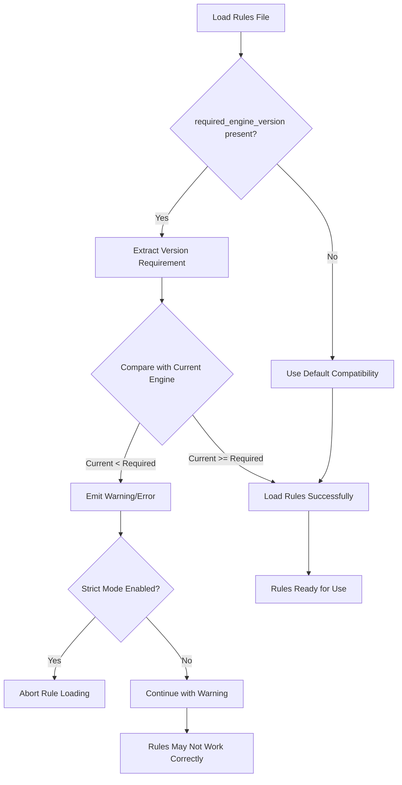
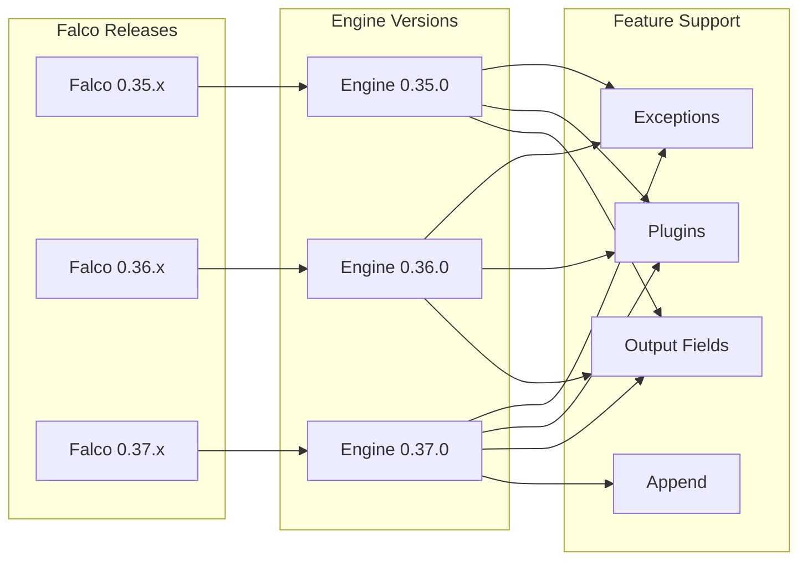

# How to Create Falco Required Engine Version

Author: [nawazdhandala](https://github.com/nawazdhandala)

Tags: Falco, Security, Kubernetes, Compatibility

Description: Learn how to specify and validate Falco engine version requirements to ensure rule compatibility across different Falco deployments.

---

## Introduction

Falco is a powerful runtime security tool for Kubernetes and cloud-native environments. When writing custom Falco rules, ensuring compatibility across different Falco engine versions is critical. The `required_engine_version` directive allows rule authors to specify the minimum engine version needed to run their rules correctly.

This guide covers everything you need to know about Falco engine version requirements, from basic syntax to advanced compatibility strategies.

## What is the Falco Engine Version?

The Falco engine version represents the rules engine's capability level. Each new engine version may introduce:

- New filter fields
- New operators
- Enhanced functionality
- Bug fixes in rule parsing

The engine version is separate from the Falco release version. A single Falco release may include engine updates that affect rule compatibility.

## Engine Version Specification Syntax

### Basic Syntax

To specify a required engine version in your rules file, use the `required_engine_version` directive at the top of your rules file:

```yaml
# Specify the minimum required engine version
- required_engine_version: 0.31.0

# Your rules follow below
- rule: Detect Shell in Container
  desc: Detects when a shell is spawned inside a container
  condition: >
    spawned_process and
    container and
    shell_procs
  output: >
    Shell spawned in container
    (user=%user.name container_id=%container.id
    container_name=%container.name shell=%proc.name)
  priority: WARNING
  tags: [container, shell, mitre_execution]
```

### Semantic Versioning Format

The engine version follows semantic versioning (SemVer):

```yaml
# Format: MAJOR.MINOR.PATCH
- required_engine_version: 0.31.0
```

Where:
- **MAJOR**: Significant changes that may break backward compatibility
- **MINOR**: New features added in a backward-compatible manner
- **PATCH**: Backward-compatible bug fixes

## Version Compatibility Checking Flow

The following diagram illustrates how Falco validates engine version requirements when loading rules:



## Checking Your Current Engine Version

Before writing rules with version requirements, verify your Falco engine version:

```bash
# Check Falco version and engine version
falco --version

# Example output:
# Falco version: 0.37.0
# Engine version: 0.37.0
# Libs version: 0.14.1
# Plugin API version: 3.0.0
```

You can also check programmatically in your deployment:

```bash
# Get just the engine version
falco --version | grep "Engine version" | awk '{print $3}'
```

## Feature-Based Version Requirements

Different engine versions support different features. Here is a reference table for common features:

| Feature | Minimum Engine Version | Description |
|---------|----------------------|-------------|
| Basic syscall fields | 0.1.0 | Core process and file fields |
| Container fields | 0.10.0 | Container metadata fields |
| K8s audit log support | 0.13.0 | Kubernetes audit events |
| Exceptions support | 0.28.0 | Rule exception blocks |
| Plugin system | 0.32.0 | Loadable plugin support |
| Output fields in conditions | 0.35.0 | Enhanced field support |
| Append operator | 0.37.0 | Rule append functionality |

### Example: Using Exceptions (Requires 0.28.0+)

```yaml
# Requires engine version 0.28.0 for exceptions support
- required_engine_version: 0.28.0

- rule: Write Below Etc
  desc: Detect writes to /etc directory
  condition: >
    open_write and
    fd.name startswith /etc
  output: >
    File below /etc opened for writing
    (user=%user.name file=%fd.name)
  priority: ERROR
  exceptions:
    # Exception block requires engine 0.28.0+
    - name: known_etc_writers
      fields: [proc.name, fd.name]
      comps: [=, startswith]
      values:
        - [systemd, /etc/machine-id]
        - [dhclient, /etc/resolv.conf]
```

### Example: Using Plugins (Requires 0.32.0+)

```yaml
# Requires engine version 0.32.0 for plugin support
- required_engine_version: 0.32.0

# Load the cloudtrail plugin
- required_plugin_versions:
  - name: cloudtrail
    version: 0.7.0

- rule: AWS Console Login Without MFA
  desc: Detect AWS console logins without MFA
  condition: >
    ct.name="ConsoleLogin" and
    ct.response.ConsoleLogin="Success" and
    json.value[/additionalEventData/MFAUsed]="No"
  output: >
    AWS console login without MFA
    (user=%ct.user principal=%ct.userIdentity.principalId)
  priority: CRITICAL
  source: aws_cloudtrail
  tags: [aws, compliance, authentication]
```

## Handling Version Mismatches

### Graceful Degradation Strategy

When distributing rules that may run on different Falco versions, consider these strategies:

```yaml
# Option 1: Separate files for different versions
# rules-legacy.yaml (for older engines)
- required_engine_version: 0.26.0

- rule: Detect Privilege Escalation
  desc: Basic privilege escalation detection
  condition: >
    spawned_process and
    proc.name in (sudo, su)
  output: Privilege escalation attempt (user=%user.name cmd=%proc.cmdline)
  priority: WARNING
```

```yaml
# rules-modern.yaml (for newer engines with exceptions)
- required_engine_version: 0.28.0

- rule: Detect Privilege Escalation
  desc: Advanced privilege escalation detection with exceptions
  condition: >
    spawned_process and
    proc.name in (sudo, su)
  output: Privilege escalation attempt (user=%user.name cmd=%proc.cmdline)
  priority: WARNING
  exceptions:
    - name: allowed_sudo_users
      fields: [user.name, proc.cmdline]
      comps: [=, contains]
      values:
        - [admin, system-update]
```

### Version Detection Script

Use this script to select the appropriate rules file:

```bash
#!/bin/bash

# detect_and_load_rules.sh
# Automatically select rules based on engine version

# Get the current engine version
ENGINE_VERSION=$(falco --version | grep "Engine version" | awk '{print $3}')

# Parse major and minor version
MAJOR=$(echo "$ENGINE_VERSION" | cut -d. -f1)
MINOR=$(echo "$ENGINE_VERSION" | cut -d. -f2)

echo "Detected Falco engine version: $ENGINE_VERSION"

# Select rules based on version capabilities
if [ "$MINOR" -ge 32 ]; then
    echo "Using modern rules with plugin support"
    RULES_FILE="/etc/falco/rules-modern.yaml"
elif [ "$MINOR" -ge 28 ]; then
    echo "Using rules with exception support"
    RULES_FILE="/etc/falco/rules-exceptions.yaml"
else
    echo "Using legacy rules"
    RULES_FILE="/etc/falco/rules-legacy.yaml"
fi

# Start Falco with the selected rules
falco -r "$RULES_FILE" "$@"
```

## CI/CD Integration for Version Validation

Validate your rules against specific engine versions in your CI/CD pipeline:

```yaml
# .github/workflows/validate-falco-rules.yaml
name: Validate Falco Rules

on:
  push:
    paths:
      - 'rules/**'
  pull_request:
    paths:
      - 'rules/**'

jobs:
  validate:
    runs-on: ubuntu-latest
    strategy:
      matrix:
        falco_version: ['0.35.0', '0.36.0', '0.37.0']

    steps:
      - uses: actions/checkout@v4

      - name: Install Falco ${{ matrix.falco_version }}
        run: |
          curl -fsSL https://falco.org/repo/falcosecurity-packages.asc | \
            sudo gpg --dearmor -o /usr/share/keyrings/falco-archive-keyring.gpg
          echo "deb [signed-by=/usr/share/keyrings/falco-archive-keyring.gpg] \
            https://download.falco.org/packages/deb stable main" | \
            sudo tee /etc/apt/sources.list.d/falcosecurity.list
          sudo apt-get update
          sudo apt-get install -y falco=${{ matrix.falco_version }}

      - name: Validate Rules
        run: |
          # Validate rules syntax and version compatibility
          falco --validate rules/custom-rules.yaml

          # Check for version requirement
          if grep -q "required_engine_version" rules/custom-rules.yaml; then
            echo "Engine version requirement found"
            REQUIRED=$(grep "required_engine_version" rules/custom-rules.yaml | \
              awk '{print $2}')
            echo "Required engine version: $REQUIRED"
          fi
```

## Version Compatibility Matrix Diagram

The following diagram shows the relationship between Falco releases and engine versions:



## Best Practices

### 1. Always Specify Version Requirements

```yaml
# Good: Explicit version requirement
- required_engine_version: 0.35.0

- rule: My Custom Rule
  # ...
```

```yaml
# Bad: No version requirement (may fail silently on older engines)
- rule: My Custom Rule
  # ...
```

### 2. Document Feature Dependencies

```yaml
# Required engine version: 0.28.0
# Features used:
#   - Exception blocks (0.28.0+)
#   - Container fields (0.10.0+)
- required_engine_version: 0.28.0

- rule: Sensitive Mount Detection
  desc: Detect sensitive host path mounts in containers
  condition: >
    container and
    container.mount.dest[/] in (/etc, /var, /root)
  output: >
    Sensitive path mounted in container
    (mount=%container.mount.source[/]
    dest=%container.mount.dest[/])
  priority: WARNING
  exceptions:
    - name: trusted_mounts
      fields: [container.image.repository]
      comps: [=]
      values:
        - [docker.io/library/nginx]
```

### 3. Test Across Multiple Versions

Create a testing matrix that covers your target deployment versions:

```bash
#!/bin/bash

# test_rules_compatibility.sh
# Test rules against multiple Falco versions using Docker

RULES_FILE="$1"
VERSIONS=("0.35.0" "0.36.0" "0.37.0")

for VERSION in "${VERSIONS[@]}"; do
    echo "Testing against Falco $VERSION..."

    docker run --rm \
        -v "$(pwd)/$RULES_FILE:/etc/falco/rules.d/custom.yaml:ro" \
        "falcosecurity/falco:$VERSION" \
        falco --validate /etc/falco/rules.d/custom.yaml

    if [ $? -eq 0 ]; then
        echo "PASS: Rules valid for Falco $VERSION"
    else
        echo "FAIL: Rules invalid for Falco $VERSION"
    fi
    echo "---"
done
```

## Troubleshooting Common Version Issues

### Error: Unknown Field

```
Error: Rule uses unknown field 'container.mount.dest'
```

**Solution**: This field requires a minimum engine version. Add the appropriate version requirement:

```yaml
- required_engine_version: 0.26.0
```

### Error: Unexpected Exception Block

```
Error: Unexpected key 'exceptions' in rule definition
```

**Solution**: Exceptions require engine version 0.28.0 or higher:

```yaml
- required_engine_version: 0.28.0
```

### Warning: Version Requirement Not Met

```
Warning: Rule file requires engine version 0.35.0, but current engine is 0.32.0
```

**Solution**: Either upgrade Falco or create a compatible version of your rules for older engines.

## Conclusion

Properly managing Falco engine version requirements ensures your security rules work reliably across different environments. By specifying version requirements explicitly, you prevent silent failures and make it easier to maintain rules across diverse Kubernetes deployments.

Key takeaways:

1. Always include `required_engine_version` in your rules files
2. Document which features require specific versions
3. Test rules against all target Falco versions in your CI/CD pipeline
4. Consider graceful degradation for environments with mixed versions
5. Keep your Falco installations updated to access the latest rule features

For more information, visit the [official Falco documentation](https://falco.org/docs/).
