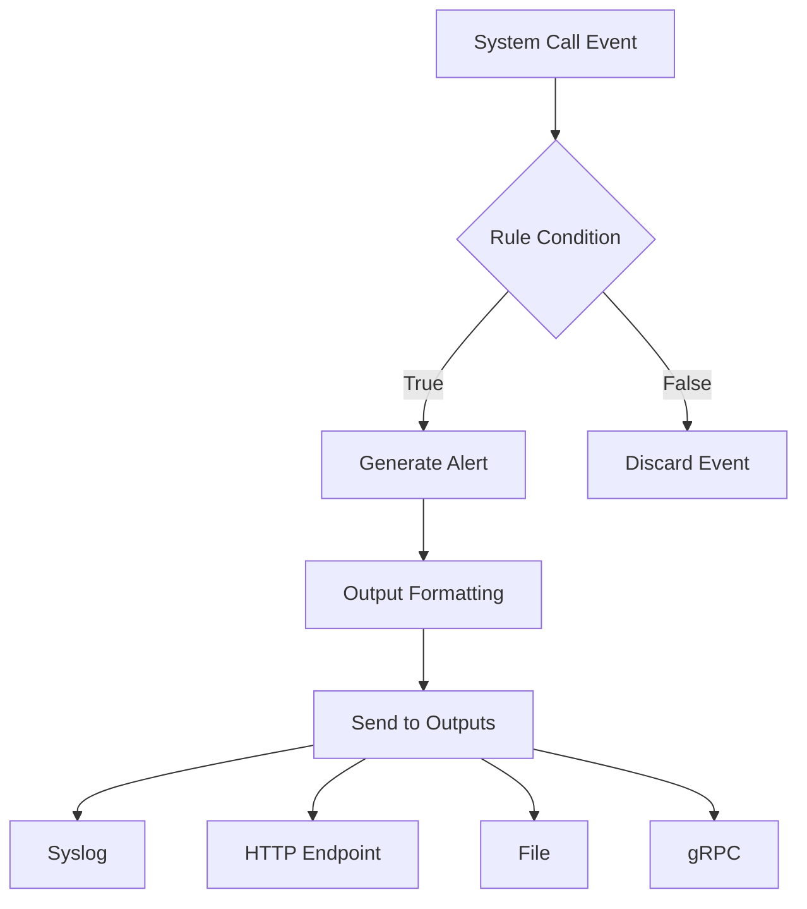
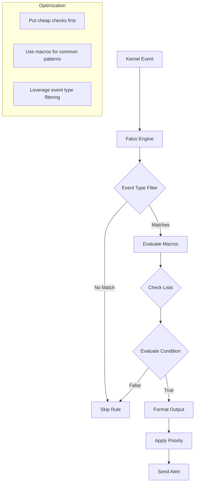

# How to Create Falco Rule Conditions

Author: [nawazdhandala](https://github.com/nawazdhandala)

Tags: Falco, Security, Kubernetes, Detection

Description: Learn to write Falco rule conditions that detect security threats in real time using field comparisons, macros, and lists.

---

Falco is a runtime security tool that monitors system calls and detects anomalous behavior in containers and hosts. The power of Falco lies in its rule conditions, which are boolean expressions that determine when to trigger alerts. Understanding how to write effective conditions is essential for building detection rules that catch real threats without drowning your team in false positives.

## How Falco Rules Work

A Falco rule consists of three main parts: a condition that specifies when to alert, an output that formats the alert message, and metadata like priority and tags. The condition is where the detection logic lives.



## Basic Rule Structure

Every Falco rule follows this YAML structure:

```yaml
# A basic Falco rule detecting shell execution in containers
- rule: Shell Spawned in Container
  desc: Detect shell execution inside a container
  condition: container.id != host and proc.name in (bash, sh, zsh, csh, tcsh)
  output: "Shell spawned in container (user=%user.name container=%container.name shell=%proc.name)"
  priority: WARNING
  tags: [container, shell, mitre_execution]
```

## Condition Syntax and Operators

Falco conditions use a filtering expression language similar to tcpdump or Wireshark. The syntax supports comparison operators, boolean logic, and special operators for pattern matching.

### Comparison Operators

| Operator | Description | Example |
|----------|-------------|---------|
| `=` | Equal | `proc.name = nginx` |
| `!=` | Not equal | `container.id != host` |
| `<` | Less than | `fd.sport < 1024` |
| `<=` | Less than or equal | `proc.uid <= 1000` |
| `>` | Greater than | `evt.rawarg.size > 1048576` |
| `>=` | Greater than or equal | `thread.vmsize >= 100000000` |
| `contains` | Substring match | `proc.cmdline contains password` |
| `startswith` | Prefix match | `fd.name startswith /etc` |
| `endswith` | Suffix match | `fd.name endswith .sh` |
| `glob` | Glob pattern match | `fd.name glob /home/*/.ssh/*` |

### Boolean Operators

Combine conditions using `and`, `or`, and `not`:

```yaml
# Detect privilege escalation attempts
- rule: Privilege Escalation via Setuid
  desc: Process changed to root user via setuid
  condition: >
    evt.type = setuid
    and evt.arg.uid = 0
    and proc.uid != 0
    and not proc.name in (sudo, su, login)
  output: "Setuid to root (user=%user.name proc=%proc.name parent=%proc.pname)"
  priority: CRITICAL
```

### Operator Precedence

Falco evaluates operators in this order (highest to lowest):

1. `not`
2. `and`
3. `or`

Use parentheses to make complex conditions readable:

```yaml
# Parentheses clarify evaluation order
condition: >
    (container.id != host and proc.name = bash)
    or
    (proc.uid = 0 and proc.name in (nc, netcat, ncat))
```

## Field References

Falco provides hundreds of fields extracted from system calls. These fields let you inspect processes, files, network connections, containers, and Kubernetes metadata.

### Process Fields

```yaml
# Common process fields for detection rules
- rule: Suspicious Process Execution
  desc: Detect execution of known attack tools
  condition: >
    spawned_process                          # Macro for new process events
    and proc.name in (nmap, masscan, nikto)  # Process name
    and proc.pname != automation             # Parent process name
    and proc.uid != 0                        # Process user ID
    and proc.exe startswith /tmp             # Executable path
  output: >
    Suspicious tool executed
    (proc=%proc.name
    cmdline=%proc.cmdline
    parent=%proc.pname
    exe=%proc.exe
    uid=%proc.uid)
  priority: HIGH
```

### File System Fields

```yaml
# Detect sensitive file access
- rule: Read Sensitive File
  desc: Detect read access to password and shadow files
  condition: >
    open_read                               # Macro for file read events
    and fd.name in (/etc/passwd, /etc/shadow, /etc/sudoers)
    and not proc.name in (login, sshd, passwd, useradd)
  output: "Sensitive file read (file=%fd.name proc=%proc.name user=%user.name)"
  priority: WARNING
```

### Network Fields

```yaml
# Detect outbound connection to suspicious port
- rule: Outbound Connection to IRC Port
  desc: Detect connections to IRC which may indicate C2 communication
  condition: >
    evt.type = connect
    and evt.dir = <                         # Outgoing connection
    and fd.sip != 127.0.0.1                 # Not localhost
    and fd.sport in (6666, 6667, 6668, 6669, 6697)  # IRC ports
    and container.id != host
  output: "Outbound IRC connection (ip=%fd.sip port=%fd.sport proc=%proc.name)"
  priority: HIGH
```

### Container Fields

```yaml
# Detect container escape attempts
- rule: Container Escape via Mount
  desc: Detect attempts to mount host filesystem in container
  condition: >
    evt.type = mount
    and container.id != host
    and container.privileged = true
    and evt.arg.source startswith /host
  output: >
    Mount in privileged container
    (container=%container.name
    image=%container.image.repository
    source=%evt.arg.source)
  priority: CRITICAL
```

### Kubernetes Fields

```yaml
# Detect kubectl exec into production namespace
- rule: Kubectl Exec in Production
  desc: Alert on interactive shell in production pods
  condition: >
    spawned_process
    and container.id != host
    and k8s.ns.name = production
    and proc.tty != 0                       # Interactive terminal
    and proc.name in (bash, sh, zsh)
  output: >
    Shell in production pod
    (pod=%k8s.pod.name
    namespace=%k8s.ns.name
    container=%container.name)
  priority: WARNING
  tags: [k8s, production, mitre_execution]
```

## Macros for Reusable Conditions

Macros let you define reusable condition fragments. Use them to avoid repetition and make rules more readable.

### Defining Macros

```yaml
# Define a macro for detecting new process creation
- macro: spawned_process
  condition: >
    evt.type in (execve, execveat)
    and evt.dir = <

# Macro for file open events with read intent
- macro: open_read
  condition: >
    evt.type in (open, openat, openat2)
    and evt.is_open_read = true

# Macro for file open events with write intent
- macro: open_write
  condition: >
    evt.type in (open, openat, openat2)
    and evt.is_open_write = true

# Macro for network connection events
- macro: outbound_conn
  condition: >
    evt.type = connect
    and evt.dir = <
    and fd.typechar = 4
```

### Using Macros in Rules

```yaml
# Rule using multiple macros
- rule: Write to Binary Directory
  desc: Detect writes to system binary directories
  condition: >
    open_write
    and fd.directory in (/bin, /sbin, /usr/bin, /usr/sbin)
    and not proc.name in (apt, dpkg, yum, rpm)
    and not trusted_installer
  output: "Binary directory write (file=%fd.name proc=%proc.name)"
  priority: HIGH

# Supporting macro for trusted processes
- macro: trusted_installer
  condition: >
    proc.name in (apt-get, dpkg, yum, dnf, rpm, pacman)
    or proc.pname in (apt-get, dpkg, yum, dnf, rpm, pacman)
```

### Macro Composition

Macros can reference other macros:

```yaml
# Base macro for container context
- macro: in_container
  condition: container.id != host

# Extended macro combining container check with process event
- macro: container_process
  condition: in_container and spawned_process

# Rule using composed macro
- rule: Package Manager in Container
  desc: Unexpected package installation in container
  condition: >
    container_process
    and proc.name in (apt, apt-get, yum, dnf, apk)
  output: "Package manager in container (container=%container.name proc=%proc.name)"
  priority: NOTICE
```

## Lists for Grouping Values

Lists define collections of values that can be referenced in conditions. They make rules maintainable and easy to update.

### Defining Lists

```yaml
# List of shell binaries
- list: shell_binaries
  items: [bash, sh, zsh, csh, tcsh, ksh, fish, dash]

# List of sensitive files
- list: sensitive_files
  items:
    - /etc/shadow
    - /etc/passwd
    - /etc/sudoers
    - /etc/pam.d
    - /root/.ssh/authorized_keys
    - /root/.bash_history

# List of known miners
- list: miner_binaries
  items: [xmrig, minerd, cpuminer, cgminer, bfgminer, ethminer]

# List of network scanning tools
- list: network_scanners
  items: [nmap, masscan, zmap, unicornscan, nikto, sqlmap]
```

### Using Lists in Conditions

```yaml
# Reference lists with the 'in' operator
- rule: Cryptocurrency Miner Detected
  desc: Known crypto mining binary executed
  condition: >
    spawned_process
    and proc.name in (miner_binaries)
  output: "Crypto miner executed (proc=%proc.name cmdline=%proc.cmdline)"
  priority: CRITICAL
  tags: [cryptomining, mitre_resource_hijacking]

# Combine lists with other conditions
- rule: Network Scan from Container
  desc: Network scanning tool run inside container
  condition: >
    container_process
    and proc.name in (network_scanners)
    and not allowed_scanner_container
  output: "Network scan in container (tool=%proc.name container=%container.name)"
  priority: HIGH
```

### Appending to Lists

You can extend existing lists without modifying the original:

```yaml
# Original list from default rules
- list: shell_binaries
  items: [bash, sh, zsh, csh, tcsh]

# Append additional shells in your custom rules file
- list: shell_binaries
  append: true
  items: [fish, elvish, ion, xonsh]
```

## Rule Evaluation Flow

Understanding how Falco evaluates rules helps you write efficient conditions.



### Performance Tips

1. **Put the most selective filter first**: Start with event type checks
2. **Use macros for common patterns**: Reduces parsing overhead
3. **Avoid expensive operations**: Regex and glob matching cost more than equality checks

```yaml
# Good: Event type first, then container check, then expensive glob
- rule: Efficient Rule
  condition: >
    evt.type = open
    and container.id != host
    and fd.name glob /etc/**/*.conf

# Less efficient: Glob check runs on every event
- rule: Inefficient Rule
  condition: >
    fd.name glob /etc/**/*.conf
    and container.id != host
    and evt.type = open
```

## Practical Examples

### Detect Reverse Shell

```yaml
- macro: network_tool_procs
  condition: proc.name in (nc, ncat, netcat, socat, telnet)

- rule: Reverse Shell Detected
  desc: Process spawned with stdin/stdout redirected to network
  condition: >
    spawned_process
    and proc.name in (bash, sh, zsh)
    and (
      proc.cmdline contains "/dev/tcp"
      or proc.cmdline contains "| nc"
      or proc.cmdline contains "|nc"
      or (proc.pname in (nc, ncat, netcat, socat) and proc.tty = 0)
    )
  output: >
    Reverse shell detected
    (cmdline=%proc.cmdline
    parent=%proc.pname
    user=%user.name
    container=%container.name)
  priority: CRITICAL
  tags: [network, shell, mitre_command_and_control]
```

### Detect Credential Access

```yaml
- list: credential_files
  items:
    - /etc/shadow
    - /etc/gshadow
    - /etc/security/opasswd
    - /root/.aws/credentials
    - /home/*/.aws/credentials

- rule: Credential File Access
  desc: Process reading credential files
  condition: >
    open_read
    and (
      fd.name in (credential_files)
      or fd.name glob /home/*/.ssh/id_*
      or fd.name glob /root/.ssh/id_*
    )
    and not proc.name in (sshd, login, su, sudo, passwd)
    and not proc.pname in (ansible, puppet, chef-client)
  output: >
    Credential file read
    (file=%fd.name
    proc=%proc.name
    parent=%proc.pname
    user=%user.name)
  priority: HIGH
  tags: [filesystem, credentials, mitre_credential_access]
```

### Detect Container Drift

```yaml
- macro: container_started
  condition: >
    evt.type = container
    and evt.dir = <

- rule: New Executable in Container
  desc: Executable file created or modified in running container
  condition: >
    open_write
    and container.id != host
    and fd.name endswith .so or fd.name glob /usr/bin/* or fd.name glob /usr/sbin/*
    and not proc.name in (apt, dpkg, yum, rpm)
  output: >
    Executable modified in container
    (file=%fd.name
    container=%container.name
    image=%container.image.repository)
  priority: WARNING
  tags: [container, drift, mitre_persistence]
```

### Kubernetes-Specific Detection

```yaml
- list: sensitive_namespaces
  items: [kube-system, kube-public, istio-system, monitoring]

- macro: sensitive_namespace
  condition: k8s.ns.name in (sensitive_namespaces)

- rule: Exec in System Namespace
  desc: Interactive shell in Kubernetes system namespace
  condition: >
    spawned_process
    and container.id != host
    and sensitive_namespace
    and proc.tty != 0
    and proc.name in (shell_binaries)
  output: >
    Shell in system namespace
    (namespace=%k8s.ns.name
    pod=%k8s.pod.name
    container=%container.name
    user=%user.name)
  priority: HIGH
  tags: [k8s, system, mitre_execution]
```

## Testing Your Rules

Validate rules before deploying to production:

```bash
# Check rule syntax
falco --validate /etc/falco/rules.d/custom_rules.yaml

# Dry run with a specific rules file
falco -r /etc/falco/rules.d/custom_rules.yaml --dry-run

# Test against a capture file
falco -r custom_rules.yaml -e test_events.scap

# Run in verbose mode to see rule matching
falco -r custom_rules.yaml -v
```

### Generate Test Events

```bash
# Trigger shell detection
docker run --rm alpine sh -c "echo test"

# Trigger sensitive file access
docker run --rm -v /etc:/host-etc:ro alpine cat /host-etc/shadow

# Trigger network scan detection
docker run --rm alpine apk add nmap && nmap localhost
```

---

Falco rule conditions give you the flexibility to detect nearly any runtime security threat. Start with the default rules, understand how conditions work, then customize them for your environment. Use macros and lists to keep rules maintainable, and always test before deploying. Effective detection is about precision, not just coverage.
