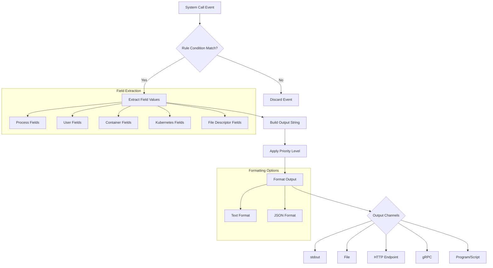
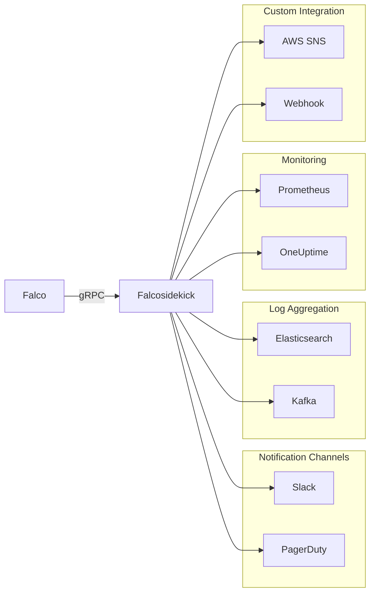

# How to Build Falco Rule Outputs

Author: [nawazdhandala](https://github.com/nawazdhandala)

Tags: Falco, Security, Kubernetes, Alerting

Description: Learn how to configure Falco rule outputs for effective alert formatting and integration with monitoring systems.

---

Falco is a powerful runtime security tool for Kubernetes and cloud-native environments. One of its most important features is the ability to customize alert outputs, which determine how security events are formatted and delivered. This guide covers the output format specification, field placeholders, and practical integration patterns.

## Understanding Falco Output Format

Falco outputs are defined in rule files and control how alerts appear when a rule triggers. The output string can include static text mixed with dynamic field placeholders that get populated at runtime.

### Basic Output Structure

```yaml
# Basic rule with output definition
- rule: Detect Shell in Container
  desc: Detects when a shell is spawned inside a container
  condition: >
    spawned_process and
    container and
    proc.name in (bash, sh, zsh, dash)
  output: >
    Shell spawned in container
    (user=%user.name command=%proc.cmdline container=%container.name
    image=%container.image.repository pod=%k8s.pod.name)
  priority: WARNING
  tags: [container, shell, mitre_execution]
```

## Field Placeholders and Formatting

Falco provides a rich set of field placeholders that extract information from the system call context. These fields are wrapped in `%` symbols and get replaced with actual values at alert time.

### Common Field Categories

```yaml
# Process-related fields
# %proc.name      - Process name (e.g., bash)
# %proc.cmdline   - Full command line with arguments
# %proc.pid       - Process ID
# %proc.ppid      - Parent process ID
# %proc.pname     - Parent process name
# %proc.exepath   - Full executable path

# User-related fields
# %user.name      - Username running the process
# %user.uid       - User ID
# %user.loginuid  - Login user ID (tracks original user through sudo)

# Container-related fields
# %container.id           - Container ID (first 12 characters)
# %container.name         - Container name
# %container.image.repository  - Image repository name
# %container.image.tag    - Image tag

# Kubernetes-related fields
# %k8s.pod.name           - Pod name
# %k8s.ns.name            - Namespace name
# %k8s.deployment.name    - Deployment name
# %k8s.pod.label[key]     - Specific pod label value
```

### Advanced Field Usage

```yaml
# Rule demonstrating advanced field placeholders
- rule: Sensitive File Access
  desc: Detects access to sensitive configuration files
  condition: >
    open_read and
    fd.name startswith /etc/ and
    fd.name in (/etc/shadow, /etc/passwd, /etc/sudoers)
  output: >
    Sensitive file opened for reading
    (file=%fd.name process=%proc.name parent=%proc.pname
    user=%user.name uid=%user.uid container=%container.name
    namespace=%k8s.ns.name pod=%k8s.pod.name
    cmdline=%proc.cmdline)
  priority: CRITICAL
  tags: [filesystem, sensitive_data]
```

## Output Processing Flow

The following diagram illustrates how Falco processes rule outputs from detection to delivery:



## JSON Output for Structured Logging

For integration with log aggregation systems like Elasticsearch, Splunk, or Loki, JSON output provides structured data that is easy to parse and query.

### Enabling JSON Output

Configure Falco to emit JSON-formatted alerts in the configuration file:

```yaml
# /etc/falco/falco.yaml

# Enable JSON output format
json_output: true

# Include output fields as a separate JSON object
json_include_output_property: true

# Include tags in the JSON output
json_include_tags_property: true

# Time format options
time_format_iso_8601: true
```

### JSON Output Structure

When JSON output is enabled, alerts have this structure:

```json
{
  "uuid": "a1b2c3d4-e5f6-7890-abcd-ef1234567890",
  "output": "Shell spawned in container (user=root command=bash container=nginx-pod image=nginx pod=nginx-pod-abc123)",
  "priority": "Warning",
  "rule": "Detect Shell in Container",
  "source": "syscall",
  "tags": [
    "container",
    "shell",
    "mitre_execution"
  ],
  "time": "2026-01-30T10:15:30.123456789Z",
  "output_fields": {
    "container.name": "nginx-pod",
    "container.image.repository": "nginx",
    "k8s.pod.name": "nginx-pod-abc123",
    "proc.cmdline": "bash",
    "proc.name": "bash",
    "user.name": "root"
  },
  "hostname": "worker-node-01"
}
```

### Custom Output Fields

You can specify which fields appear in the `output_fields` object:

```yaml
# Rule with explicit output fields for JSON
- rule: Network Connection to Suspicious Port
  desc: Detects outbound connections to commonly exploited ports
  condition: >
    outbound and
    fd.sport in (4444, 5555, 6666, 1337)
  output: >
    Suspicious outbound connection detected
    (process=%proc.name destination=%fd.sip:%fd.sport
    container=%container.name pod=%k8s.pod.name)
  priority: HIGH
  output_fields:
    - proc.name
    - proc.cmdline
    - fd.sip
    - fd.sport
    - container.name
    - container.image.repository
    - k8s.pod.name
    - k8s.ns.name
  tags: [network, suspicious_connection]
```

## Integration with Notification Channels

Falco supports multiple output channels that can be configured simultaneously for different use cases.

### Output Channel Configuration

```yaml
# /etc/falco/falco.yaml

# Standard output (useful for container logging)
stdout_output:
  enabled: true

# File output for local logging
file_output:
  enabled: true
  keep_alive: false
  filename: /var/log/falco/events.log

# HTTP webhook for external integrations
http_output:
  enabled: true
  url: https://alerts.example.com/falco/webhook
  user_agent: "Falco/0.38.0"

# Program output for custom processing
program_output:
  enabled: true
  keep_alive: false
  program: >
    jq '{
      alert: .output,
      severity: .priority,
      source: "falco",
      timestamp: .time
    }' | curl -X POST -H "Content-Type: application/json"
    -d @- https://siem.example.com/api/events

# gRPC output for Falcosidekick integration
grpc_output:
  enabled: true

grpc:
  enabled: true
  bind_address: "0.0.0.0:5060"
  threadiness: 8
```

### Integration Architecture



### Falcosidekick Configuration Example

```yaml
# falcosidekick configuration for multi-channel output
# values.yaml for Helm deployment

config:
  slack:
    webhookurl: "https://hooks.slack.com/services/XXX/YYY/ZZZ"
    channel: "#security-alerts"
    minimumpriority: "warning"
    messageformat: |
      *Rule:* {{ .Rule }}
      *Priority:* {{ .Priority }}
      *Output:* {{ .Output }}
      *Time:* {{ .Time }}
      *Namespace:* {{ index .OutputFields "k8s.ns.name" }}
      *Pod:* {{ index .OutputFields "k8s.pod.name" }}

  elasticsearch:
    hostport: "https://elasticsearch.example.com:9200"
    index: "falco-alerts"
    type: "_doc"
    minimumpriority: "notice"

  prometheus:
    extralabels: "env:production,cluster:main"

  webhook:
    address: "https://oneuptime.example.com/api/alerts"
    minimumpriority: "warning"
    customheaders:
      Authorization: "Bearer ${API_TOKEN}"
```

## Practical Examples with Comments

### Example 1: Privilege Escalation Detection

```yaml
# Detect attempts to escalate privileges via setuid binaries
- rule: Setuid Execution
  desc: Detects execution of setuid binaries that could lead to privilege escalation
  condition: >
    spawned_process and
    proc.is_exe_upper_layer=true and
    proc.is_exe_writable=false and
    user.uid != 0 and
    proc.suid = 0
  # Output includes all context needed for incident response
  # The format follows: what happened, who did it, where, how
  output: >
    Setuid binary executed for potential privilege escalation
    (binary=%proc.exepath user=%user.name uid=%user.uid
    container=%container.name image=%container.image.repository
    namespace=%k8s.ns.name pod=%k8s.pod.name
    cmdline=%proc.cmdline)
  priority: CRITICAL
  # Tags help with filtering and categorization in SIEM systems
  tags: [privilege_escalation, mitre_privilege_escalation, T1548]
```

### Example 2: Cryptocurrency Mining Detection

```yaml
# Detect cryptocurrency mining processes based on common miner names and arguments
- rule: Cryptocurrency Mining Activity
  desc: Identifies known cryptocurrency mining software execution
  condition: >
    spawned_process and
    (
      proc.name in (xmrig, minerd, cpuminer, ethminer, cgminer) or
      proc.cmdline contains "stratum+tcp://" or
      proc.cmdline contains "pool.mining"
    )
  # Include network destination if available for threat intel enrichment
  output: >
    Cryptocurrency miner detected
    (process=%proc.name cmdline=%proc.cmdline
    user=%user.name container=%container.name
    image=%container.image.repository namespace=%k8s.ns.name
    pod=%k8s.pod.name parent_process=%proc.pname)
  priority: CRITICAL
  # Multiple tags for different categorization systems
  tags: [cryptomining, mitre_impact, T1496, resource_hijacking]
```

### Example 3: Suspicious Network Activity

```yaml
# Detect when a container makes DNS requests to suspicious domains
- rule: DNS Request to Suspicious Domain
  desc: Detects DNS lookups for known malicious or suspicious domains
  condition: >
    dns_lookup and
    (
      fd.name endswith ".onion" or
      fd.name endswith ".bit" or
      fd.name contains "dyndns" or
      fd.name contains "no-ip.com"
    )
  # Network fields provide connection context
  output: >
    Suspicious DNS lookup detected
    (domain=%fd.name process=%proc.name pid=%proc.pid
    user=%user.name container=%container.name
    pod=%k8s.pod.name namespace=%k8s.ns.name
    connection=%fd.name)
  priority: HIGH
  output_fields:
    - fd.name
    - proc.name
    - proc.pid
    - proc.cmdline
    - user.name
    - container.name
    - container.image.repository
    - k8s.pod.name
    - k8s.ns.name
  tags: [network, dns, suspicious_domain, mitre_command_and_control]
```

### Example 4: File Integrity Monitoring

```yaml
# Monitor writes to critical system configuration files
- rule: Critical Config File Modified
  desc: Detects modifications to critical system configuration files
  condition: >
    open_write and
    fd.name in (
      /etc/passwd, /etc/shadow, /etc/group,
      /etc/sudoers, /etc/ssh/sshd_config,
      /etc/kubernetes/admin.conf
    )
  # Include both the file being modified and the process doing it
  output: >
    Critical configuration file modified
    (file=%fd.name process=%proc.name user=%user.name
    container=%container.name image=%container.image.repository
    pod=%k8s.pod.name namespace=%k8s.ns.name
    parent=%proc.pname cmdline=%proc.cmdline)
  priority: CRITICAL
  tags: [file_integrity, configuration_change, mitre_persistence]
```

## Best Practices for Output Design

1. **Include Context**: Always include enough fields to identify the who, what, where, and when of an event.

2. **Use Consistent Formatting**: Maintain a consistent output format across rules for easier parsing.

3. **Add Kubernetes Context**: Include namespace and pod information for containerized workloads.

4. **Include Parent Process**: The parent process often reveals how a suspicious process was launched.

5. **Tag Appropriately**: Use MITRE ATT&CK tags and descriptive categories for filtering.

6. **Consider JSON Output**: For automated processing, JSON provides structured data that is easier to parse.

7. **Test Output Readability**: Ensure outputs are readable by humans while remaining machine-parseable.

## Conclusion

Falco rule outputs are the bridge between detection and response. Well-designed outputs provide security teams with the context they need to quickly understand and respond to threats. By leveraging field placeholders, JSON formatting, and integration with notification channels, you can build a comprehensive security alerting system that fits your organization's needs.

For more advanced configurations, consider using Falcosidekick to route alerts to multiple destinations with customized formatting for each channel.
