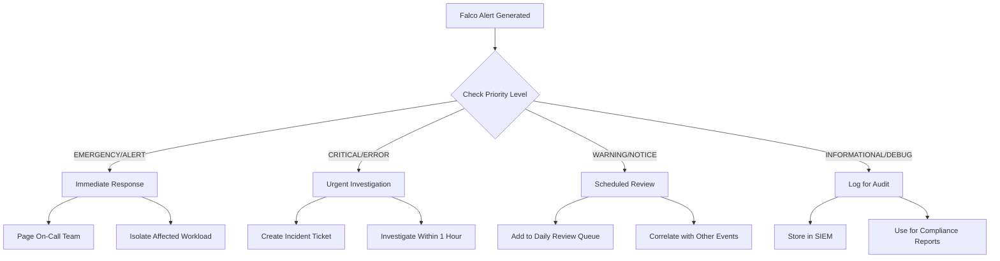

# How to Implement Falco Rule Priorities

Author: [nawazdhandala](https://github.com/nawazdhandala)

Tags: Falco, Security, Kubernetes, Alerting

Description: Learn how to classify and triage security alerts using Falco rule priorities for effective incident response.

---

Falco is a powerful runtime security tool that detects anomalous activity in your containers and Kubernetes clusters. One of its most important features is the priority system, which allows you to classify alerts by severity. Understanding and properly implementing rule priorities is essential for effective security monitoring and incident response.

## Understanding Falco Priority Levels

Falco provides eight priority levels, ranging from the most critical to the least severe. Each level serves a specific purpose in your security alerting strategy.

| Priority | Numeric Value | Use Case |
|----------|---------------|----------|
| EMERGENCY | 0 | System is unusable, immediate action required |
| ALERT | 1 | Immediate action needed, critical security breach |
| CRITICAL | 2 | Critical conditions, potential system compromise |
| ERROR | 3 | Error conditions that need attention |
| WARNING | 4 | Warning conditions, suspicious but not confirmed threats |
| NOTICE | 5 | Normal but significant conditions |
| INFORMATIONAL | 6 | Informational messages for audit trails |
| DEBUG | 7 | Debug level messages for troubleshooting |

## Alert Triage Flow

The following diagram illustrates how Falco priorities should guide your incident response workflow:



## Priority Assignment Guidelines

When writing custom Falco rules, follow these guidelines for assigning priorities:

### EMERGENCY and ALERT
Use for events that indicate an active compromise or system failure:
- Root shell spawned in container
- Sensitive file tampering detected
- Kernel module loaded unexpectedly

### CRITICAL and ERROR
Use for events that require urgent investigation:
- Privilege escalation attempts
- Unauthorized network connections
- Container escape attempts

### WARNING and NOTICE
Use for suspicious but not definitively malicious activity:
- Unusual process execution
- Configuration file reads
- Non-standard port usage

### INFORMATIONAL and DEBUG
Use for audit logging and troubleshooting:
- Standard system calls for compliance
- Debug information for rule development

## Writing Rules with Priorities

Here is a basic example of a Falco rule with priority assignment:

```yaml
# Rule to detect shell spawned in a container
# Priority set to ALERT because this often indicates compromise
- rule: Shell Spawned in Container
  desc: Detects when a shell is spawned inside a container
  condition: >
    spawned_process and
    container and
    shell_procs
  output: >
    Shell spawned in container
    (user=%user.name container_id=%container.id
    container_name=%container.name shell=%proc.name
    parent=%proc.pname cmdline=%proc.cmdline)
  priority: ALERT
  tags: [container, shell, mitre_execution]
```

## Overriding Priorities in Custom Rules

You can override the priority of existing rules without modifying the original rule files. This is useful when you want to adjust severity based on your environment.

```yaml
# Override the priority of an existing rule
# This changes a WARNING to CRITICAL for your environment
- rule: Read Sensitive File Untrusted
  priority: CRITICAL
  append: true

# You can also override with additional conditions
- rule: Terminal Shell in Container
  priority: EMERGENCY
  condition: and k8s.ns.name = "production"
  append: true
```

### Creating Environment-Specific Overrides

```yaml
# File: custom_rules_override.yaml
# Override priorities based on namespace sensitivity

# Production namespace gets higher priorities
- rule: Unexpected Network Connection
  priority: CRITICAL
  condition: and k8s.ns.name in (production, payments)
  append: true

# Development namespace gets lower priorities
- rule: Unexpected Network Connection
  priority: NOTICE
  condition: and k8s.ns.name in (development, staging)
  append: true
```

## Filtering Alerts by Priority

Falco allows you to filter which alerts are sent to specific outputs based on priority. This helps reduce noise and ensures critical alerts reach the right channels.

### Configuring Minimum Priority

In your Falco configuration file, set the minimum priority for alerts:

```yaml
# falco.yaml configuration
# Only output alerts with priority WARNING or higher
priority: WARNING

# This means DEBUG, INFORMATIONAL, and NOTICE
# alerts will not be generated
```

### Output-Specific Priority Filtering

You can configure different outputs to receive different priority levels:

```yaml
# falco.yaml output configuration

# Send all CRITICAL and above to PagerDuty
- name: pagerduty
  library_path: /usr/share/falco/plugins/libpagerduty.so
  min_priority: CRITICAL

# Send WARNING and above to Slack
- name: slack
  library_path: /usr/share/falco/plugins/libslack.so
  min_priority: WARNING

# Send everything to file for audit
- name: file
  library_path: /usr/share/falco/plugins/libfile.so
  min_priority: DEBUG
  options:
    filename: /var/log/falco/events.log
```

### Using Falcosidekick for Priority-Based Routing

Falcosidekick is commonly used to route alerts based on priority:

```yaml
# falcosidekick configuration
# Route alerts to different channels based on priority

slack:
  webhookurl: "https://hooks.slack.com/services/XXX"
  minimumpriority: "warning"
  channel: "#security-alerts"

pagerduty:
  apikey: "your-api-key"
  minimumpriority: "critical"

elasticsearch:
  hostport: "http://elasticsearch:9200"
  minimumpriority: "debug"
  index: "falco-alerts"
```

## Practical Examples

### Example 1: Detecting Crypto Mining

```yaml
# Detect potential cryptocurrency mining activity
# High priority because crypto miners consume resources
# and may indicate compromised workloads
- rule: Detect Crypto Mining Process
  desc: Detects processes commonly associated with crypto mining
  condition: >
    spawned_process and
    (proc.name in (xmrig, minerd, cpuminer, cgminer, bfgminer) or
    proc.cmdline contains "stratum+tcp" or
    proc.cmdline contains "cryptonight")
  output: >
    Crypto mining process detected
    (user=%user.name process=%proc.name
    cmdline=%proc.cmdline container=%container.name)
  priority: CRITICAL
  tags: [cryptomining, mitre_resource_hijacking]
```

### Example 2: Monitoring Sensitive File Access

```yaml
# Monitor access to sensitive Kubernetes files
# Priority varies based on the file sensitivity
- rule: Read Sensitive K8s Files
  desc: Detects read access to sensitive Kubernetes configuration files
  condition: >
    open_read and
    container and
    (fd.name startswith /etc/kubernetes/ or
    fd.name startswith /var/lib/kubelet/)
  output: >
    Sensitive Kubernetes file read
    (user=%user.name file=%fd.name
    process=%proc.name container=%container.name)
  priority: WARNING
  tags: [kubernetes, filesystem, mitre_discovery]

# Higher priority for service account tokens
- rule: Read Service Account Token
  desc: Detects read access to service account tokens
  condition: >
    open_read and
    container and
    fd.name startswith /var/run/secrets/kubernetes.io/serviceaccount/
  output: >
    Service account token accessed
    (user=%user.name file=%fd.name
    process=%proc.name container=%container.name)
  priority: ERROR
  tags: [kubernetes, credentials, mitre_credential_access]
```

### Example 3: Network Anomaly Detection

```yaml
# Detect unexpected outbound connections
# Priority based on destination characteristics
- rule: Unexpected Outbound Connection
  desc: Detects outbound connections to unexpected destinations
  condition: >
    outbound and
    container and
    not (fd.sip in (allowed_outbound_ips))
  output: >
    Unexpected outbound connection
    (user=%user.name process=%proc.name
    connection=%fd.name container=%container.name)
  priority: WARNING
  tags: [network, mitre_exfiltration]

# Critical priority for connections to known malicious IPs
- rule: Connection to Malicious IP
  desc: Detects connections to known malicious IP addresses
  condition: >
    outbound and
    fd.sip in (malicious_ip_list)
  output: >
    Connection to known malicious IP detected
    (user=%user.name process=%proc.name
    destination=%fd.sip container=%container.name)
  priority: EMERGENCY
  tags: [network, malware, mitre_command_and_control]
```

## Best Practices for Priority Management

1. **Start Conservative**: Begin with higher priorities and adjust downward as you understand your baseline traffic.

2. **Document Your Decisions**: Keep notes on why specific rules have certain priorities for future reference.

3. **Review Regularly**: Schedule monthly reviews of alert volumes by priority to identify tuning opportunities.

4. **Use Tags with Priorities**: Combine priority levels with tags for more granular filtering and reporting.

5. **Test in Lower Environments**: Validate priority assignments in staging before deploying to production.

6. **Create Runbooks**: Document response procedures for each priority level so your team knows exactly how to respond.

## Conclusion

Falco rule priorities are essential for building an effective runtime security monitoring system. By properly classifying alerts, you ensure that critical security events receive immediate attention while reducing alert fatigue from lower-priority notifications. Start with the guidelines in this post and continuously refine your priority assignments based on your environment and operational experience.

Remember that priority assignment is not a one-time task. As your infrastructure evolves and you learn more about your normal baseline behavior, you should revisit and adjust priorities to maintain an effective security posture.
