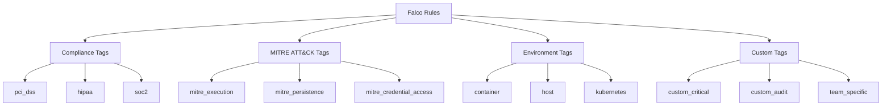

# How to Create Falco Rule Tags

Author: [nawazdhandala](https://github.com/nawazdhandala)

Tags: Falco, Security, Kubernetes, Organization

Description: Learn how to use Falco rule tags to organize, filter, and manage security rules effectively in your Kubernetes environment.

---

Falco rule tags provide a powerful mechanism for organizing and filtering your security rules. By applying meaningful tags to rules, you can enable or disable groups of rules, generate targeted reports, and align your security policies with compliance frameworks like MITRE ATT&CK and PCI-DSS.

## Understanding Falco Rule Tags

Tags in Falco are labels attached to rules that help categorize them by purpose, compliance requirement, or threat type. A single rule can have multiple tags, making it easy to create overlapping categories for different use cases.

```yaml
# Basic rule with tags
- rule: Detect Shell in Container
  desc: Detects when a shell is spawned inside a container
  condition: >
    container.id != host and
    proc.name in (bash, sh, zsh, ash)
  output: >
    Shell spawned in container
    (user=%user.name container=%container.name shell=%proc.name)
  priority: WARNING
  tags:
    - container
    - shell
    - mitre_execution
    - T1059
```

## Tag Naming Conventions

### MITRE ATT&CK Framework Tags

MITRE ATT&CK tags help map rules to known attack techniques. Falco follows a consistent naming pattern for these tags.

```yaml
# MITRE ATT&CK tagged rule
- rule: Detect Credential Dumping
  desc: Detects attempts to dump credentials from memory
  condition: >
    spawned_process and
    proc.name in (mimikatz, procdump, secretsdump)
  output: >
    Credential dumping tool executed
    (user=%user.name command=%proc.cmdline)
  priority: CRITICAL
  tags:
    # Tactic tag (lowercase with underscore)
    - mitre_credential_access
    # Technique ID tag
    - T1003
    # Sub-technique tag (when applicable)
    - T1003.001
```

Common MITRE tactic tags include:

| Tag | Description |
|-----|-------------|
| `mitre_initial_access` | Initial entry into the network |
| `mitre_execution` | Running malicious code |
| `mitre_persistence` | Maintaining foothold |
| `mitre_privilege_escalation` | Gaining higher permissions |
| `mitre_defense_evasion` | Avoiding detection |
| `mitre_credential_access` | Stealing credentials |
| `mitre_discovery` | Exploring the environment |
| `mitre_lateral_movement` | Moving through the network |
| `mitre_exfiltration` | Stealing data |

### PCI-DSS Compliance Tags

For organizations requiring PCI-DSS compliance, tags help track which rules satisfy specific requirements.

```yaml
# PCI-DSS tagged rule
- rule: Detect Unauthorized Network Connection
  desc: Detects connections to unauthorized networks
  condition: >
    outbound and
    not fd.snet in (allowed_networks)
  output: >
    Unauthorized network connection detected
    (user=%user.name dest=%fd.sip)
  priority: ERROR
  tags:
    # PCI-DSS requirement tags
    - pci_dss_1.1.1
    - pci_dss_1.2.1
    # General category
    - network
    - compliance
```

## Tag Hierarchy and Organization

The following diagram illustrates how tags can be organized hierarchically for effective rule management:



## Tag-Based Rule Enabling and Disabling

One of the most powerful features of tags is the ability to enable or disable entire groups of rules at once.

### Enabling Rules by Tag

Use the `-t` flag to run Falco with only rules matching specific tags:

```bash
# Run only rules tagged with 'network'
falco -t network

# Run rules matching multiple tags (OR logic)
falco -t network -t filesystem

# Run rules matching MITRE execution techniques
falco -t mitre_execution
```

### Disabling Rules by Tag

Use the `-T` flag to exclude rules with specific tags:

```bash
# Disable all rules tagged with 'debug'
falco -T debug

# Disable multiple tag categories
falco -T debug -T experimental

# Run all rules except those tagged for specific compliance
falco -T pci_dss
```

### Configuration File Approach

You can also configure tag-based filtering in your falco.yaml configuration:

```yaml
# falco.yaml configuration for tag filtering
rules_file:
  - /etc/falco/falco_rules.yaml
  - /etc/falco/custom_rules.yaml

# Enable only specific tags
# This runs rules that have ANY of these tags
load_plugins: []

# Tag filtering in Kubernetes Helm values
# values.yaml
falco:
  rules_file:
    - /etc/falco/falco_rules.yaml

  # Use environment variables for tag filtering
  extra_args:
    - "-t"
    - "container"
    - "-t"
    - "kubernetes"
    - "-T"
    - "experimental"
```

## Creating Custom Tags

Custom tags allow you to organize rules according to your specific needs.

### Team-Based Tags

```yaml
# Rules organized by team responsibility
- rule: Database Access Violation
  desc: Detects unauthorized database access attempts
  condition: >
    spawned_process and
    proc.name in (mysql, psql, mongo) and
    not user.name in (db_admins)
  output: >
    Unauthorized database access attempt
    (user=%user.name database_tool=%proc.name)
  priority: WARNING
  tags:
    - database
    - team_data
    - custom_access_control

- rule: Network Configuration Change
  desc: Detects changes to network configuration
  condition: >
    open_write and
    fd.name startswith /etc/network
  output: >
    Network configuration modified
    (user=%user.name file=%fd.name)
  priority: ERROR
  tags:
    - network
    - team_infrastructure
    - custom_config_change
```

### Severity-Based Custom Tags

```yaml
# Custom severity classification
- rule: Critical Production Alert
  desc: Detects critical events in production
  condition: >
    container.image.repository contains "prod" and
    (proc.name = "rm" or proc.name = "dd")
  output: >
    Critical operation in production container
    (user=%user.name command=%proc.cmdline image=%container.image.repository)
  priority: CRITICAL
  tags:
    - production
    - custom_severity_p0
    - requires_immediate_response
```

## Filtering and Reporting by Tags

### Generating Tag-Based Reports

Create scripts to analyze your rules by tag for compliance reporting:

```bash
#!/bin/bash
# Script to generate tag-based rule report

RULES_FILE="/etc/falco/falco_rules.yaml"

# Count rules per tag
echo "=== Falco Rules Tag Report ==="
echo ""

# Extract all unique tags
tags=$(grep -A 20 "^- rule:" "$RULES_FILE" | \
       grep "^\s*-\s" | \
       grep -v "rule:" | \
       sed 's/^[[:space:]]*-[[:space:]]*//' | \
       sort | uniq -c | sort -rn)

echo "Tag Distribution:"
echo "$tags"
```

### Using Falco Output for Tag Filtering

Configure Falco output to include tags for downstream filtering:

```yaml
# falco.yaml output configuration
json_output: true
json_include_tags_property: true
json_include_output_property: true

# Output will include tags for filtering
# Example output:
# {
#   "output": "Shell spawned in container...",
#   "priority": "Warning",
#   "rule": "Detect Shell in Container",
#   "tags": ["container", "shell", "mitre_execution"],
#   "time": "2024-01-15T10:30:00.000000000Z"
# }
```

### Integrating with SIEM Systems

Use tags to route alerts to appropriate teams or channels:

```yaml
# Falco Sidekick configuration for tag-based routing
# config.yaml

slack:
  webhookurl: "https://hooks.slack.com/services/XXX"
  outputformat: "all"
  minimumpriority: "warning"

# Route by tags to different channels
customfields:
  environment: "production"

# Use tags in alert routing logic
templatedfields:
  channel: |
    {{- if has "team_security" .Tags -}}
    #security-alerts
    {{- else if has "team_infrastructure" .Tags -}}
    #infra-alerts
    {{- else -}}
    #general-alerts
    {{- end -}}
```

## Best Practices for Tag Management

### 1. Establish a Tagging Convention

Document your tagging standards for consistency:

```yaml
# Tagging convention document
#
# Prefix conventions:
#   mitre_    - MITRE ATT&CK framework mappings
#   pci_      - PCI-DSS compliance requirements
#   hipaa_    - HIPAA compliance requirements
#   team_     - Team ownership tags
#   env_      - Environment tags (prod, staging, dev)
#   custom_   - Organization-specific custom tags
#
# Always include:
#   1. At least one environment tag
#   2. Relevant compliance tags
#   3. MITRE mapping when applicable

- rule: Example Well-Tagged Rule
  desc: Demonstrates proper tagging convention
  condition: always_true
  output: Example output
  priority: INFO
  tags:
    # Environment
    - env_production
    - container
    # Compliance
    - pci_dss_10.2.1
    # MITRE mapping
    - mitre_execution
    - T1059.004
    # Team ownership
    - team_security
```

### 2. Review and Audit Tags Regularly

```bash
#!/bin/bash
# Audit script for tag coverage

echo "Rules without MITRE tags:"
grep -B5 "^- rule:" /etc/falco/falco_rules.yaml | \
  grep -A5 "rule:" | \
  grep -L "mitre_"

echo ""
echo "Rules without compliance tags:"
grep -B5 "^- rule:" /etc/falco/falco_rules.yaml | \
  grep -A5 "rule:" | \
  grep -vE "(pci_|hipaa_|soc2_)"
```

### 3. Use Tags for Gradual Rollouts

```yaml
# Tag new rules as experimental
- rule: New Detection Rule
  desc: Experimental rule for testing
  condition: some_new_condition
  output: New detection triggered
  priority: INFO
  tags:
    - experimental
    - new_2024q1
    - needs_tuning
```

Then run in production without experimental rules:

```bash
# Production deployment excludes experimental rules
falco -T experimental -T needs_tuning
```

## Summary

Falco rule tags are essential for managing security rules at scale. By following consistent naming conventions aligned with frameworks like MITRE ATT&CK and PCI-DSS, you can effectively organize rules, enable compliance reporting, and route alerts to the right teams. Start with a clear tagging strategy, document your conventions, and use tag-based filtering to customize Falco deployments for different environments and requirements.
