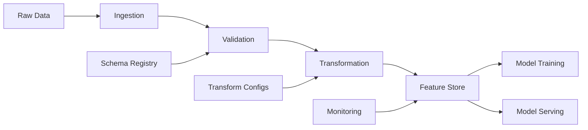
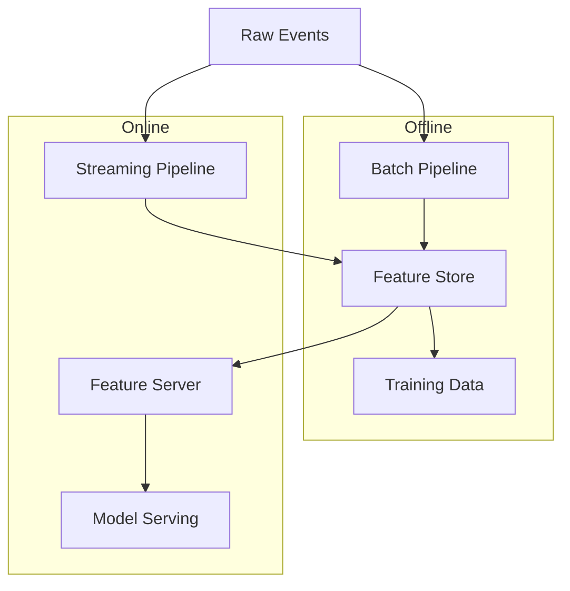

# How to Implement Feature Engineering Pipelines

Author: [nawazdhandala](https://github.com/nawazdhandala)

Tags: MLOps, Machine Learning, Data Science, Feature Engineering

Description: A practical guide to building reproducible feature engineering pipelines that transform raw data into ML-ready features with proper versioning, validation, and monitoring.

---

Feature engineering transforms raw data into the numerical representations that machine learning models actually consume. It is often the difference between a model that works in a notebook and one that performs reliably in production. Yet many teams treat feature engineering as an afterthought, writing ad-hoc transformation code that becomes impossible to maintain, reproduce, or debug.

This guide walks through building feature engineering pipelines that are reproducible, testable, and production-ready.

## Why Feature Engineering Pipelines Matter

Raw data rarely arrives in a format suitable for machine learning. You need to handle missing values, encode categorical variables, normalize numerical features, create interaction terms, and extract meaningful signals from timestamps, text, or nested structures.

Without a structured pipeline approach:

- **Training-serving skew**: Features computed differently in training vs inference cause silent model degradation
- **Reproducibility failures**: Cannot recreate model results when feature code changes
- **Testing gaps**: Hard to verify feature logic in isolation
- **Scaling bottlenecks**: Ad-hoc code does not parallelize across large datasets
- **Debugging nightmares**: Cannot trace which transformation introduced bad values

## Pipeline Architecture Overview

A well-designed feature engineering pipeline has distinct stages, each with clear inputs, outputs, and contracts.



| Stage | Purpose | Key Concerns |
|-------|---------|--------------|
| Ingestion | Load data from various sources | Schema evolution, incremental loading |
| Validation | Ensure data quality | Missing values, outliers, type mismatches |
| Transformation | Convert raw values to features | Encoding, normalization, feature crossing |
| Feature Store | Persist and serve features | Versioning, point-in-time correctness |
| Monitoring | Track feature health | Drift detection, freshness checks |

## Building a Feature Transformer Base Class

Start with an abstract base class that enforces a consistent interface. Every transformer must implement fit (learn parameters from training data) and transform (apply the transformation).

This base class provides a contract that all feature transformers must follow. The fit method learns any parameters from training data, while transform applies the transformation. The get_feature_names method returns output column names for downstream tracking.

```python
from abc import ABC, abstractmethod
from typing import Any, Dict, List, Optional
import pandas as pd
import numpy as np


class FeatureTransformer(ABC):
    """
    Base class for all feature transformers.

    Transformers follow the fit/transform pattern:
    - fit(): Learn parameters from training data (e.g., mean for normalization)
    - transform(): Apply the transformation using learned parameters
    - fit_transform(): Convenience method that does both
    """

    def __init__(self, name: str, input_columns: List[str], output_columns: List[str]):
        self.name = name
        self.input_columns = input_columns
        self.output_columns = output_columns
        self.is_fitted = False
        self.params: Dict[str, Any] = {}

    @abstractmethod
    def fit(self, df: pd.DataFrame) -> "FeatureTransformer":
        """
        Learn transformation parameters from training data.
        Must set self.is_fitted = True when complete.
        """
        pass

    @abstractmethod
    def transform(self, df: pd.DataFrame) -> pd.DataFrame:
        """
        Apply the transformation to input data.
        Must be called after fit() or will raise an error.
        """
        pass

    def fit_transform(self, df: pd.DataFrame) -> pd.DataFrame:
        """Convenience method: fit then transform in one call."""
        return self.fit(df).transform(df)

    def get_feature_names(self) -> List[str]:
        """Return the names of output features for documentation."""
        return self.output_columns

    def validate_input(self, df: pd.DataFrame) -> None:
        """Check that required input columns exist."""
        missing = set(self.input_columns) - set(df.columns)
        if missing:
            raise ValueError(
                f"Transformer '{self.name}' missing required columns: {missing}"
            )

    def to_dict(self) -> Dict[str, Any]:
        """Serialize transformer state for storage/versioning."""
        return {
            "name": self.name,
            "class": self.__class__.__name__,
            "input_columns": self.input_columns,
            "output_columns": self.output_columns,
            "params": self.params,
            "is_fitted": self.is_fitted,
        }
```

## Implementing Common Transformers

### Numerical Normalization

Normalization scales numerical features to a standard range. This prevents features with large values from dominating models that use distance metrics or gradient descent.

The StandardScaler transformer computes mean and standard deviation from training data, then applies z-score normalization. We add a small epsilon to avoid division by zero for constant features.

```python
class StandardScaler(FeatureTransformer):
    """
    Z-score normalization: (x - mean) / std

    Transforms features to have mean=0 and std=1. Essential for:
    - Neural networks (gradient descent converges faster)
    - Distance-based models (KNN, SVM with RBF kernel)
    - Regularized models (L1/L2 penalties are scale-sensitive)
    """

    def __init__(self, columns: List[str]):
        output_cols = [f"{col}_scaled" for col in columns]
        super().__init__(
            name="standard_scaler",
            input_columns=columns,
            output_columns=output_cols,
        )

    def fit(self, df: pd.DataFrame) -> "StandardScaler":
        self.validate_input(df)

        # Compute statistics on training data only
        # These will be applied to all future data (including production)
        self.params["means"] = {}
        self.params["stds"] = {}

        for col in self.input_columns:
            self.params["means"][col] = df[col].mean()
            self.params["stds"][col] = df[col].std()

            # Handle zero variance (constant column)
            if self.params["stds"][col] == 0:
                self.params["stds"][col] = 1.0

        self.is_fitted = True
        return self

    def transform(self, df: pd.DataFrame) -> pd.DataFrame:
        if not self.is_fitted:
            raise RuntimeError("StandardScaler must be fit before transform")

        self.validate_input(df)
        result = df.copy()

        for col in self.input_columns:
            output_col = f"{col}_scaled"
            mean = self.params["means"][col]
            std = self.params["stds"][col]

            # Apply z-score normalization using training statistics
            result[output_col] = (df[col] - mean) / std

        return result
```

### Categorical Encoding

Categorical variables need conversion to numerical form. One-hot encoding creates binary columns for each category, while target encoding uses the relationship with the target variable.

One-hot encoding is safe and interpretable but creates many columns for high-cardinality features. We track known categories from training to handle unknown categories in production gracefully.

```python
class OneHotEncoder(FeatureTransformer):
    """
    One-hot encoding for categorical variables.

    Creates binary columns for each category. Handles unknown categories
    in production by setting all encoded columns to 0.
    """

    def __init__(
        self,
        columns: List[str],
        max_categories: int = 50,
        handle_unknown: str = "ignore"
    ):
        # Output columns determined during fit based on actual categories
        super().__init__(
            name="one_hot_encoder",
            input_columns=columns,
            output_columns=[],  # Set during fit
        )
        self.max_categories = max_categories
        self.handle_unknown = handle_unknown

    def fit(self, df: pd.DataFrame) -> "OneHotEncoder":
        self.validate_input(df)

        self.params["categories"] = {}
        self.output_columns = []

        for col in self.input_columns:
            # Get unique categories, limited to top N by frequency
            value_counts = df[col].value_counts()
            categories = value_counts.head(self.max_categories).index.tolist()

            self.params["categories"][col] = categories

            # Generate output column names
            for cat in categories:
                self.output_columns.append(f"{col}_{cat}")

        self.is_fitted = True
        return self

    def transform(self, df: pd.DataFrame) -> pd.DataFrame:
        if not self.is_fitted:
            raise RuntimeError("OneHotEncoder must be fit before transform")

        self.validate_input(df)
        result = df.copy()

        for col in self.input_columns:
            categories = self.params["categories"][col]

            for cat in categories:
                output_col = f"{col}_{cat}"
                # Create binary indicator: 1 if match, 0 otherwise
                result[output_col] = (df[col] == cat).astype(int)

        return result
```

### Datetime Feature Extraction

Timestamps contain rich information that models cannot use directly. Extract cyclical components (hour, day of week) and practical features (is_weekend, is_business_hours).

Datetime extraction creates multiple features from a single timestamp column. Cyclical encoding using sine/cosine preserves the circular nature of time (hour 23 is close to hour 0).

```python
class DatetimeFeatures(FeatureTransformer):
    """
    Extract features from datetime columns.

    Creates both categorical (day_of_week) and cyclical (hour_sin, hour_cos)
    features. Cyclical encoding preserves temporal proximity
    (e.g., hour 23 is close to hour 0).
    """

    def __init__(self, column: str, features: Optional[List[str]] = None):
        self.datetime_column = column

        # Default feature set if not specified
        self.features = features or [
            "year", "month", "day", "hour", "day_of_week",
            "is_weekend", "hour_sin", "hour_cos"
        ]

        output_cols = [f"{column}_{feat}" for feat in self.features]
        super().__init__(
            name="datetime_features",
            input_columns=[column],
            output_columns=output_cols,
        )

    def fit(self, df: pd.DataFrame) -> "DatetimeFeatures":
        # Datetime extraction is stateless (no parameters to learn)
        # but we still validate the column exists and is datetime
        self.validate_input(df)

        # Verify column can be converted to datetime
        try:
            pd.to_datetime(df[self.datetime_column])
        except Exception as e:
            raise ValueError(
                f"Column '{self.datetime_column}' cannot be parsed as datetime: {e}"
            )

        self.is_fitted = True
        return self

    def transform(self, df: pd.DataFrame) -> pd.DataFrame:
        if not self.is_fitted:
            raise RuntimeError("DatetimeFeatures must be fit before transform")

        self.validate_input(df)
        result = df.copy()

        # Parse datetime column
        dt = pd.to_datetime(df[self.datetime_column])
        col = self.datetime_column

        # Extract requested features
        if "year" in self.features:
            result[f"{col}_year"] = dt.dt.year

        if "month" in self.features:
            result[f"{col}_month"] = dt.dt.month

        if "day" in self.features:
            result[f"{col}_day"] = dt.dt.day

        if "hour" in self.features:
            result[f"{col}_hour"] = dt.dt.hour

        if "day_of_week" in self.features:
            result[f"{col}_day_of_week"] = dt.dt.dayofweek

        if "is_weekend" in self.features:
            result[f"{col}_is_weekend"] = (dt.dt.dayofweek >= 5).astype(int)

        # Cyclical encoding: map time to unit circle
        # This preserves proximity (hour 23 is close to hour 0)
        if "hour_sin" in self.features:
            result[f"{col}_hour_sin"] = np.sin(2 * np.pi * dt.dt.hour / 24)

        if "hour_cos" in self.features:
            result[f"{col}_hour_cos"] = np.cos(2 * np.pi * dt.dt.hour / 24)

        return result
```

## Building the Pipeline Orchestrator

The pipeline orchestrator chains transformers together and handles execution order, error handling, and state management.

The FeaturePipeline class manages transformer execution order, tracks fitted state, and provides serialization for persistence. It ensures transformers run in the correct sequence and handles errors gracefully.

```python
import json
import hashlib
from datetime import datetime
from typing import List, Dict, Any, Optional
import pandas as pd


class FeaturePipeline:
    """
    Orchestrates a sequence of feature transformers.

    Handles:
    - Sequential execution of transformers
    - Fit/transform state management
    - Serialization for versioning and persistence
    - Input/output validation
    """

    def __init__(self, name: str, transformers: List[FeatureTransformer]):
        self.name = name
        self.transformers = transformers
        self.is_fitted = False
        self.created_at = datetime.utcnow().isoformat()
        self.version = self._compute_version()

    def _compute_version(self) -> str:
        """Generate a version hash based on pipeline configuration."""
        config = {
            "name": self.name,
            "transformers": [t.to_dict() for t in self.transformers],
        }
        config_str = json.dumps(config, sort_keys=True)
        return hashlib.sha256(config_str.encode()).hexdigest()[:12]

    def fit(self, df: pd.DataFrame) -> "FeaturePipeline":
        """
        Fit all transformers sequentially on training data.

        Each transformer fits on the output of the previous transformer,
        allowing later transformers to use features created by earlier ones.
        """
        current_df = df.copy()

        for transformer in self.transformers:
            print(f"Fitting transformer: {transformer.name}")
            transformer.fit(current_df)
            current_df = transformer.transform(current_df)

        self.is_fitted = True
        return self

    def transform(self, df: pd.DataFrame) -> pd.DataFrame:
        """Apply all transformers to input data."""
        if not self.is_fitted:
            raise RuntimeError("Pipeline must be fit before transform")

        current_df = df.copy()

        for transformer in self.transformers:
            current_df = transformer.transform(current_df)

        return current_df

    def fit_transform(self, df: pd.DataFrame) -> pd.DataFrame:
        """Fit and transform in one call."""
        return self.fit(df).transform(df)

    def get_feature_names(self) -> List[str]:
        """Get all output feature names from all transformers."""
        names = []
        for transformer in self.transformers:
            names.extend(transformer.get_feature_names())
        return names

    def to_dict(self) -> Dict[str, Any]:
        """Serialize pipeline for storage."""
        return {
            "name": self.name,
            "version": self.version,
            "created_at": self.created_at,
            "is_fitted": self.is_fitted,
            "transformers": [t.to_dict() for t in self.transformers],
        }

    def save(self, path: str) -> None:
        """Save pipeline configuration and state to JSON."""
        with open(path, "w") as f:
            json.dump(self.to_dict(), f, indent=2)
        print(f"Pipeline saved to {path}")

    def validate_output(self, df: pd.DataFrame) -> Dict[str, Any]:
        """
        Run validation checks on transformed output.

        Returns a report with statistics and any issues found.
        """
        report = {
            "total_rows": len(df),
            "total_columns": len(df.columns),
            "feature_columns": self.get_feature_names(),
            "issues": [],
        }

        for col in self.get_feature_names():
            if col not in df.columns:
                report["issues"].append(f"Missing expected column: {col}")
                continue

            null_count = df[col].isnull().sum()
            if null_count > 0:
                report["issues"].append(
                    f"Column {col} has {null_count} null values"
                )

            if df[col].dtype in ["float64", "float32"]:
                inf_count = np.isinf(df[col]).sum()
                if inf_count > 0:
                    report["issues"].append(
                        f"Column {col} has {inf_count} infinite values"
                    )

        return report
```

## Feature Validation Layer

Validation catches data quality issues before they corrupt your model. Implement checks at both the raw data stage and after transformation.

The FeatureValidator class performs statistical validation on features, checking for nulls, outliers, type mismatches, and distribution drift compared to training data.

```python
from dataclasses import dataclass
from typing import List, Dict, Any, Optional, Callable
import pandas as pd
import numpy as np


@dataclass
class ValidationRule:
    """A single validation rule with a check function and error message."""
    name: str
    check: Callable[[pd.Series], bool]
    error_message: str
    severity: str = "error"  # "error" or "warning"


class FeatureValidator:
    """
    Validates feature data quality before and after transformation.

    Checks include:
    - Null/missing values
    - Value ranges and outliers
    - Type consistency
    - Distribution drift vs training
    """

    def __init__(self):
        self.rules: Dict[str, List[ValidationRule]] = {}
        self.training_stats: Dict[str, Dict[str, float]] = {}

    def add_rule(self, column: str, rule: ValidationRule) -> None:
        """Add a validation rule for a specific column."""
        if column not in self.rules:
            self.rules[column] = []
        self.rules[column].append(rule)

    def add_not_null_rule(self, column: str) -> None:
        """Add rule to check for null values."""
        rule = ValidationRule(
            name="not_null",
            check=lambda s: s.isnull().sum() == 0,
            error_message=f"Column {column} contains null values",
        )
        self.add_rule(column, rule)

    def add_range_rule(
        self,
        column: str,
        min_val: Optional[float] = None,
        max_val: Optional[float] = None
    ) -> None:
        """Add rule to check value range."""
        def check(s: pd.Series) -> bool:
            if min_val is not None and s.min() < min_val:
                return False
            if max_val is not None and s.max() > max_val:
                return False
            return True

        rule = ValidationRule(
            name="range_check",
            check=check,
            error_message=f"Column {column} values outside range [{min_val}, {max_val}]",
        )
        self.add_rule(column, rule)

    def learn_training_stats(self, df: pd.DataFrame) -> None:
        """
        Capture statistics from training data for drift detection.

        Store mean, std, min, max, and percentiles for numerical columns.
        """
        for col in df.select_dtypes(include=[np.number]).columns:
            self.training_stats[col] = {
                "mean": df[col].mean(),
                "std": df[col].std(),
                "min": df[col].min(),
                "max": df[col].max(),
                "p5": df[col].quantile(0.05),
                "p95": df[col].quantile(0.95),
            }

    def check_drift(
        self,
        df: pd.DataFrame,
        threshold: float = 0.2
    ) -> Dict[str, Any]:
        """
        Compare current data statistics to training data.

        Returns drift report with columns that have shifted significantly.
        Threshold is the maximum allowed relative change in mean.
        """
        drift_report = {"drifted_columns": [], "details": {}}

        for col, train_stats in self.training_stats.items():
            if col not in df.columns:
                continue

            current_mean = df[col].mean()
            train_mean = train_stats["mean"]

            # Calculate relative drift (normalized by training std)
            if train_stats["std"] > 0:
                drift = abs(current_mean - train_mean) / train_stats["std"]
            else:
                drift = abs(current_mean - train_mean)

            if drift > threshold:
                drift_report["drifted_columns"].append(col)
                drift_report["details"][col] = {
                    "training_mean": train_mean,
                    "current_mean": current_mean,
                    "drift_score": drift,
                }

        return drift_report

    def validate(self, df: pd.DataFrame) -> Dict[str, Any]:
        """
        Run all validation rules and return a report.

        Returns dict with passed/failed status and details.
        """
        report = {
            "passed": True,
            "errors": [],
            "warnings": [],
        }

        for column, rules in self.rules.items():
            if column not in df.columns:
                report["errors"].append(f"Missing column: {column}")
                report["passed"] = False
                continue

            for rule in rules:
                if not rule.check(df[column]):
                    if rule.severity == "error":
                        report["errors"].append(rule.error_message)
                        report["passed"] = False
                    else:
                        report["warnings"].append(rule.error_message)

        return report
```

## Putting It All Together

Here is a complete example that builds a feature pipeline for an e-commerce recommendation system.

This example creates a complete pipeline for e-commerce data with user behavior features, product features, and temporal features. It demonstrates the full workflow from raw data to validated features.

```python
import pandas as pd
import numpy as np
from datetime import datetime, timedelta


# Sample e-commerce data
def generate_sample_data(n_rows: int = 1000) -> pd.DataFrame:
    """Generate sample e-commerce interaction data."""
    np.random.seed(42)

    return pd.DataFrame({
        "user_id": np.random.randint(1, 100, n_rows),
        "product_id": np.random.randint(1, 500, n_rows),
        "category": np.random.choice(
            ["electronics", "clothing", "books", "home", "sports"],
            n_rows
        ),
        "price": np.random.uniform(10, 500, n_rows),
        "quantity": np.random.randint(1, 5, n_rows),
        "timestamp": [
            datetime.now() - timedelta(days=np.random.randint(0, 30))
            for _ in range(n_rows)
        ],
        "device_type": np.random.choice(["mobile", "desktop", "tablet"], n_rows),
        "is_member": np.random.choice([True, False], n_rows),
    })


# Create the pipeline
def create_ecommerce_pipeline() -> FeaturePipeline:
    """Build a feature engineering pipeline for e-commerce data."""

    transformers = [
        # Normalize numerical features
        StandardScaler(columns=["price", "quantity"]),

        # Encode categorical features
        OneHotEncoder(columns=["category", "device_type"]),

        # Extract datetime features
        DatetimeFeatures(
            column="timestamp",
            features=["hour", "day_of_week", "is_weekend", "hour_sin", "hour_cos"]
        ),
    ]

    return FeaturePipeline(name="ecommerce_features", transformers=transformers)


# Main execution
def main():
    # Generate training and test data
    train_df = generate_sample_data(n_rows=10000)
    test_df = generate_sample_data(n_rows=2000)

    print("Training data shape:", train_df.shape)
    print("Test data shape:", test_df.shape)

    # Create and fit pipeline
    pipeline = create_ecommerce_pipeline()
    print(f"\nPipeline version: {pipeline.version}")

    # Fit on training data
    train_features = pipeline.fit_transform(train_df)
    print(f"\nTraining features shape: {train_features.shape}")

    # Transform test data (using parameters learned from training)
    test_features = pipeline.transform(test_df)
    print(f"Test features shape: {test_features.shape}")

    # Validate output
    report = pipeline.validate_output(train_features)
    print(f"\nValidation report:")
    print(f"  Total features: {len(report['feature_columns'])}")
    print(f"  Issues found: {len(report['issues'])}")

    # Set up validation rules
    validator = FeatureValidator()
    validator.add_not_null_rule("price_scaled")
    validator.add_range_rule("price_scaled", min_val=-5, max_val=5)
    validator.learn_training_stats(train_features)

    # Check for drift in test data
    drift_report = validator.check_drift(test_features)
    print(f"\nDrift check:")
    print(f"  Drifted columns: {drift_report['drifted_columns']}")

    # Save pipeline configuration
    pipeline.save("/tmp/ecommerce_pipeline.json")

    # Show sample transformed data
    print("\nSample transformed features:")
    print(train_features[pipeline.get_feature_names()].head())


if __name__ == "__main__":
    main()
```

## Feature Store Integration

A feature store centralizes feature computation, storage, and serving. It ensures training and inference use identical feature values.



The FeatureStore class provides a simple interface for storing and retrieving features with versioning and point-in-time correctness for historical training data.

```python
from typing import Dict, List, Any, Optional
from datetime import datetime
import pandas as pd
import json


class FeatureStore:
    """
    Simple feature store for managing feature data.

    In production, use systems like Feast, Tecton, or Databricks Feature Store.
    This implementation demonstrates the core concepts.
    """

    def __init__(self, storage_path: str):
        self.storage_path = storage_path
        self.feature_groups: Dict[str, Dict[str, Any]] = {}

    def register_feature_group(
        self,
        name: str,
        entity_columns: List[str],
        feature_columns: List[str],
        timestamp_column: str,
        description: str = "",
    ) -> None:
        """
        Register a new feature group.

        A feature group is a logical collection of related features
        that share the same entity (e.g., user_id) and update schedule.
        """
        self.feature_groups[name] = {
            "entity_columns": entity_columns,
            "feature_columns": feature_columns,
            "timestamp_column": timestamp_column,
            "description": description,
            "created_at": datetime.utcnow().isoformat(),
        }
        print(f"Registered feature group: {name}")

    def ingest(
        self,
        feature_group: str,
        df: pd.DataFrame,
        write_mode: str = "append"
    ) -> None:
        """
        Write feature data to the store.

        write_mode: 'append' adds new data, 'overwrite' replaces existing
        """
        if feature_group not in self.feature_groups:
            raise ValueError(f"Unknown feature group: {feature_group}")

        config = self.feature_groups[feature_group]

        # Validate required columns exist
        required = config["entity_columns"] + config["feature_columns"]
        required.append(config["timestamp_column"])

        missing = set(required) - set(df.columns)
        if missing:
            raise ValueError(f"Missing required columns: {missing}")

        # In production, write to a proper storage system
        # Here we simulate with parquet files
        path = f"{self.storage_path}/{feature_group}.parquet"

        if write_mode == "append":
            try:
                existing = pd.read_parquet(path)
                df = pd.concat([existing, df], ignore_index=True)
            except FileNotFoundError:
                pass

        df.to_parquet(path, index=False)
        print(f"Ingested {len(df)} rows to {feature_group}")

    def get_features(
        self,
        feature_group: str,
        entity_df: pd.DataFrame,
        feature_names: Optional[List[str]] = None,
        as_of_timestamp: Optional[datetime] = None,
    ) -> pd.DataFrame:
        """
        Retrieve features for given entities.

        entity_df: DataFrame with entity columns to look up
        feature_names: Specific features to retrieve (None = all)
        as_of_timestamp: Get features as they were at this time (point-in-time)
        """
        if feature_group not in self.feature_groups:
            raise ValueError(f"Unknown feature group: {feature_group}")

        config = self.feature_groups[feature_group]
        path = f"{self.storage_path}/{feature_group}.parquet"

        # Load feature data
        feature_df = pd.read_parquet(path)

        # Filter by timestamp if specified (point-in-time correctness)
        if as_of_timestamp:
            ts_col = config["timestamp_column"]
            feature_df = feature_df[
                pd.to_datetime(feature_df[ts_col]) <= as_of_timestamp
            ]

        # Select requested features
        if feature_names:
            cols = config["entity_columns"] + feature_names
        else:
            cols = config["entity_columns"] + config["feature_columns"]

        feature_df = feature_df[cols + [config["timestamp_column"]]]

        # Get latest value per entity
        feature_df = feature_df.sort_values(config["timestamp_column"])
        feature_df = feature_df.groupby(config["entity_columns"]).last().reset_index()

        # Join with entity DataFrame
        result = entity_df.merge(
            feature_df.drop(columns=[config["timestamp_column"]]),
            on=config["entity_columns"],
            how="left"
        )

        return result


# Example usage
def feature_store_example():
    """Demonstrate feature store usage."""

    store = FeatureStore("/tmp/feature_store")

    # Register feature groups
    store.register_feature_group(
        name="user_features",
        entity_columns=["user_id"],
        feature_columns=["total_purchases", "avg_order_value", "days_since_last_order"],
        timestamp_column="computed_at",
        description="Aggregated user behavior features",
    )

    # Compute and ingest features
    user_features = pd.DataFrame({
        "user_id": [1, 2, 3, 4, 5],
        "total_purchases": [10, 25, 5, 100, 42],
        "avg_order_value": [50.0, 75.0, 30.0, 120.0, 85.0],
        "days_since_last_order": [2, 7, 30, 1, 14],
        "computed_at": [datetime.now()] * 5,
    })

    store.ingest("user_features", user_features)

    # Retrieve features for specific users
    query_df = pd.DataFrame({"user_id": [1, 3, 5]})
    result = store.get_features("user_features", query_df)

    print("Retrieved features:")
    print(result)
```

## Monitoring Feature Pipelines

Feature pipelines need monitoring just like application code. Track data quality, processing latency, and feature drift.

| Metric | What to Track | Alert Threshold |
|--------|---------------|-----------------|
| Null rate | % null values per feature | > 5% |
| Value range | Min/max outside expected bounds | 3+ std from training |
| Processing time | Pipeline execution duration | > 2x baseline |
| Feature drift | Distribution shift vs training | PSI > 0.2 |
| Data freshness | Time since last update | > SLA window |

The FeatureMonitor class tracks pipeline health metrics and can integrate with monitoring systems like OneUptime for alerting and visualization.

```python
from dataclasses import dataclass, field
from typing import Dict, List, Any
from datetime import datetime
import pandas as pd
import numpy as np


@dataclass
class FeatureMetrics:
    """Metrics collected for a single feature."""
    name: str
    null_rate: float
    mean: float
    std: float
    min_val: float
    max_val: float
    timestamp: datetime = field(default_factory=datetime.utcnow)


class FeatureMonitor:
    """
    Monitor feature pipeline health and quality.

    Collects metrics during pipeline execution and can send
    alerts to monitoring systems when thresholds are breached.
    """

    def __init__(self, pipeline_name: str):
        self.pipeline_name = pipeline_name
        self.metrics_history: List[Dict[str, Any]] = []
        self.thresholds = {
            "max_null_rate": 0.05,
            "max_drift_score": 0.2,
            "max_processing_seconds": 300,
        }

    def collect_metrics(self, df: pd.DataFrame, stage: str) -> Dict[str, FeatureMetrics]:
        """
        Collect metrics for all numerical features.

        stage: Name of pipeline stage (e.g., 'post_transform')
        """
        metrics = {}

        for col in df.select_dtypes(include=[np.number]).columns:
            metrics[col] = FeatureMetrics(
                name=col,
                null_rate=df[col].isnull().mean(),
                mean=df[col].mean(),
                std=df[col].std(),
                min_val=df[col].min(),
                max_val=df[col].max(),
            )

        # Store in history
        self.metrics_history.append({
            "stage": stage,
            "timestamp": datetime.utcnow().isoformat(),
            "metrics": {k: v.__dict__ for k, v in metrics.items()},
        })

        return metrics

    def check_thresholds(self, metrics: Dict[str, FeatureMetrics]) -> List[str]:
        """
        Check metrics against thresholds and return list of violations.
        """
        violations = []

        for name, m in metrics.items():
            if m.null_rate > self.thresholds["max_null_rate"]:
                violations.append(
                    f"Feature {name}: null rate {m.null_rate:.2%} exceeds "
                    f"threshold {self.thresholds['max_null_rate']:.2%}"
                )

        return violations

    def log_pipeline_run(
        self,
        start_time: datetime,
        end_time: datetime,
        input_rows: int,
        output_rows: int,
        status: str,
    ) -> Dict[str, Any]:
        """
        Log a complete pipeline run for observability.

        Returns a structured log entry suitable for sending to
        monitoring systems like OneUptime.
        """
        duration = (end_time - start_time).total_seconds()

        log_entry = {
            "pipeline_name": self.pipeline_name,
            "start_time": start_time.isoformat(),
            "end_time": end_time.isoformat(),
            "duration_seconds": duration,
            "input_rows": input_rows,
            "output_rows": output_rows,
            "rows_per_second": input_rows / duration if duration > 0 else 0,
            "status": status,
        }

        # Check processing time threshold
        if duration > self.thresholds["max_processing_seconds"]:
            log_entry["warning"] = (
                f"Processing time {duration:.1f}s exceeds threshold "
                f"{self.thresholds['max_processing_seconds']}s"
            )

        return log_entry

    def export_metrics_prometheus(self) -> str:
        """
        Export metrics in Prometheus format for scraping.
        """
        lines = []

        for entry in self.metrics_history[-1:]:  # Latest only
            for feature_name, m in entry["metrics"].items():
                # Sanitize feature name for Prometheus
                safe_name = feature_name.replace(".", "_").replace("-", "_")

                lines.append(
                    f'feature_null_rate{{pipeline="{self.pipeline_name}",'
                    f'feature="{safe_name}"}} {m["null_rate"]}'
                )
                lines.append(
                    f'feature_mean{{pipeline="{self.pipeline_name}",'
                    f'feature="{safe_name}"}} {m["mean"]}'
                )

        return "\n".join(lines)
```

## Best Practices Summary

| Practice | Why It Matters |
|----------|----------------|
| Fit on training data only | Prevents data leakage from test/production data |
| Version your pipelines | Enables reproducibility and rollback |
| Validate inputs and outputs | Catches data quality issues early |
| Monitor feature drift | Detects when retraining is needed |
| Use a feature store | Ensures training-serving consistency |
| Test transformers in isolation | Makes debugging easier |
| Document feature semantics | Helps team understand what features mean |

## Conclusion

Feature engineering pipelines bring the same rigor to data transformation that we apply to application code: clear interfaces, testing, versioning, and monitoring. The upfront investment pays off when you need to debug a model regression, reproduce an experiment, or scale to larger datasets.

Start simple with a few core transformers and expand as needed. The key is establishing the patterns early so that feature engineering becomes a maintainable part of your ML infrastructure rather than a collection of ad-hoc scripts.

**Related Reading:**
- [Basics of Profiling: Turning CPU and Memory Hotspots into Action](https://oneuptime.com/blog/post/2025-09-09-basics-of-profiling/view)
- [Python Health Checks for Kubernetes](https://oneuptime.com/blog/post/2025-01-06-python-health-checks-kubernetes/view)
- [Python Structured Logging with OpenTelemetry](https://oneuptime.com/blog/post/2025-01-06-python-structured-logging-opentelemetry/view)

---

*Building ML infrastructure that needs monitoring? OneUptime provides unified observability for your feature pipelines, model serving, and data infrastructure. Track pipeline health, detect anomalies, and get alerted before issues impact your models.*
